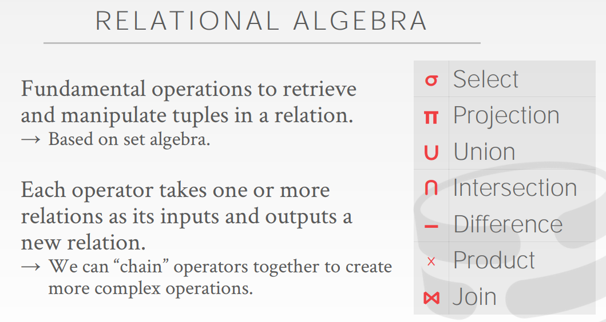
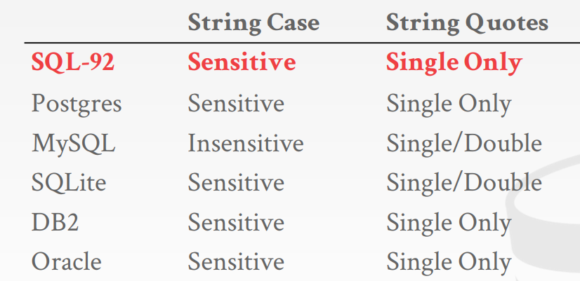
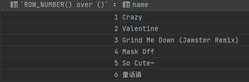
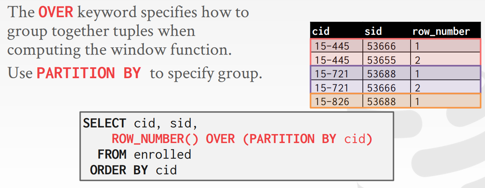
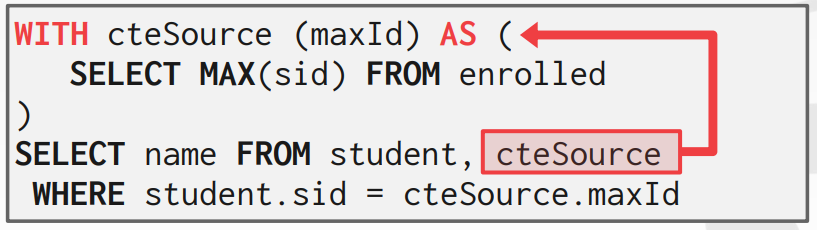
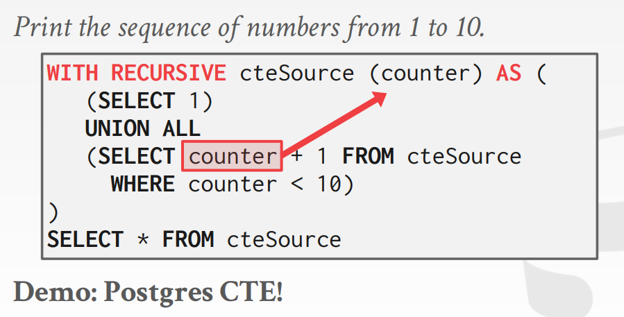

# CMU15-445 数据库系统

[TOC]

课程链接：https://15445.courses.cs.cmu.edu/fall2019/

书籍链接：https://www.db-book.com/

## 一. 关系模型

[讲义](https://15445.courses.cs.cmu.edu/fall2019/notes/01-introduction.pdf)

关系模式主要包含三部分：

1. 结构(structure)：关系和内容的定义
2. 完整性约束(Integrity)：确保数据库的内容满足约束
3. 操作(manipulation)：对于数据的增删改查

主键(primary key)：能唯一标识一条记录的属性组。

DML: Data Manipulation Languages 数据操作语言

关系代数：



## 二. 高级 SQL

[讲义](https://15445.courses.cs.cmu.edu/fall2019/notes/02-advancedsql.pdf)

对于 DBMS 来说，用户无需关心查询数据库的计算复杂度，只需要关注数据库最终的查询结果即可。因此 DBMS 需要评估每一次执行效率。

因此就产生了查询优化器(query optimizer)：可以重排操作指令并且产生查询计划

DML: Data Manipulation Language，比如增删改查语句

DDL: Data Definition Language，创建数据库和表的语句 

DCL: Data Control Language，还有安全性授权语句，视图、约束等

### 1. 聚合函数

聚合函数比如：AVG，MIN，MAX，COUNT，SUM，STD

聚合函数支持 DISTINCT 关键字：

```sql
SELECT COUNT(DISTINCT score) FROM student where id like '@cs';
```

在聚合语句中，未使用聚合函数字段在 where 语句中未出现就不能再 select 语句中出现，否则大部分情况下会报错。比如：

```sql
SELECT AVG(s.gpa), e.cid FROM enrolled AS e, student AS s WHERE e.sid = s.sid;
```

这里 `e.cid` 的出现在 select 子句中是极不合理的，因为一个平均成绩所统计的课程 id 有很多个，在这里统计这个字段是没有意义的。

> 在 PostgreSQL 和 MySQL 5.7 及之后的版本会报错，在 MySQL 5.7 和 sqlite 上不会报错，会随机挑选一个 e.cid 作为结果返回。MySQL 切换语法可以使用 `set SESSION sql_mode = 'ansi'/ 'traditional'`

对于在聚合语句中出现的未用聚合语句包围的字段必须在 group by 中出现。

对于聚合字段不能使用 where 语句进行过滤，因为 where 语句是在聚合操作之前执行的，因此应该使用 `having` 子句进行执行。

```sql
SELECT AVG(s.gpa) as avg_gpa, e.cid FROM enrolled AS e, student AS s 
	WHERE e.sid = s.sid
	HAVING avg_gpa > 3.9;
```

### 2. 字符串操作



在 MySQL 中字符串是不分大小写的，

比如一个字段中name = 'jack':

```sql
select * from t where name = 'JACK';
select * from t where name = 'jack';
```

这两种都是可以查到的。

并且用字符串标识用单双引号都可以进行标识。为了标准使用以后最好使用单引号进行使用。

字符串匹配：`%` 可以代表任何一个或者多个字符，`_` 标识单个字符串

其他 string 处理函数，`SUBSTRING(s, start, length)` , `UPPER`, `LOWER`

字符串拼接：

* MySQL: `CONCAT()`

### 3. 日期操作

查看当前时间：

```sql
# psql
SELECT NOW();
SELECT CURRENT_TIMESTAMP();
# mysql
SELECT NOW();
SELECT CURRENT_TIMESTAMP();
# sqlite
SELECT CURRENT_TIMESTAMP;
```

将字符串转为日期，计算天数：

```sql
# psql
select EXTRACT(DAY from DATE('2020-10-08'));
select DATE('2020-10-01') - DATE('2020-01-01') as days;
# mysql
select EXTRACT(DAY from DATE('2020-10-08'));
select DATEDIFF(DATE('2020-10-01'),  DATE('2020-01-01')) as days;
# sqlite
# first no
select CAST((julianday('2020-10-01') - julianday('2018-01-01')) as INT) as days;
```

### 4. 输出控制

即将查询的结果输出到另一个表中：

```sql
# 方式 1
create table demo (
    select id, name, cover from t_web_musics
);
```

这种方式会创建一个新的表，但是不会复制原表中的结构（比如完整性约束等）

```sql
# 方式2
insert into demo 
	select id, name, cover from t_web_musics;
```

第二种方式是使用插入的方式，select 的数据内容必须和插入表中的数据结构完全一致，否则无法写入。

输出的时候也可以进行排序 `order by`

```sql
select sid, score from t order sid asc, score desc;
```

也可以控制输出的行数：`limit <count>, offset`

```sql
select * from t limit 10;
select * from t limit 20, 5;
```

### 5. 嵌套查询

嵌套查询即一个查询语句中还包含一个查询语句：

```sql
select * from t where col in 
	(select col from t2);
```

通常情况下比较难去优化，通常使用 join 来进行优化。

这种方式执行比较愚蠢，因为首先需要通过外部查询来找出每一个 tuple，然后又得一次一次执行内部查询，因为每次比较的时候内部还需要重新查询一遍。

因此可以使用替代的函数：

* `ALL`：对于子查询所有行，必须满足所有条件
* `ANY` (相当于 `IN`)：对于子查询，只要有一行满足条件即可。
* `EXISTS`：至少有一行返回了。

上述嵌套循环可以改写为：

```sql
select * from t where col =	ANY(select col from t2);
```

### 6. 窗口函数

常见窗口函数：`rank`, `row_number`, `dense_rank`

窗口函数(window function)可以对数据进行实时分析处理，可以对一个集合进行函数计算，并且将其聚合为一个结果。像是一个聚合函数，但是数据集合不会被分组到单独的一个组中。

基础语法：

```sql
select ... FUNC(...) OVER(...) from t;
```

`FUNC` 是用于聚合的函数，`OVER` 适用于切分数据的函数，也可以用于排序。

比如为每一个记录生成行号：

```sql
select ROW_NUMBER() over (), name from t_web_musics;
```



Over 函数 Partition by 可以将记录进行分组，然后在组内进行窗口函数执行。



OVER 函数还支持 order by 操作，即在组内进行排序操作，排完序后执行窗口函数。

比如：找出每门课中成绩最高的学生

```sql
SELECT * FROM (
	SELECT *, 
		RANK() OVER (PARTITION BY cid ORDER BY grade ASC) AS rank
	FROM enrolled) AS ranking
WHERE ranking.rank = 1
```

psql、MySQL 8 以及最新的 sqllite 都支持窗口函数。

rank 函数只会对排序的字段处理，如果相同则会得到相同的值，如果不使用 order by 函数所有值都会为 1。

### 7. 公用表表达式

共用表表达式(Common Table Expression, CTE)，可以使用一个辅助语句来替代长语句，即使用 `with` 语句，其会在执行正常程序之前先行一步执行。这对于大批量的 SQL 数据，可以优化性能。



这和嵌套查询有什么区别？CTE 可以嵌套执行。



嵌套 CTE 比较难理解，但是 CTE 还是有很多人用的。

## Appendix-0 Pre

### 1. 安装 sqlite

首先在[sqlite官网](https://www.sqlite.org/download.html)下载 sqlite-autoconf-*.tar.gz 文件：

```sh
wget https://www.sqlite.org/2022/sqlite-autoconf-3390400.tar.gz
```

然后解压缩：

```sh
tar -zxvf sqlite-autoconf-3390400.tar.gz
cd sqlite-autoconf-3071502
```

配置安装路径和编译：

```sh
./configure --prefix=/usr/local
make && make install
```

检测是否安装：

```sh
$ sqlite3
SQLite version 3.39.4 2022-09-29 15:55:41
Enter ".help" for usage hints.
Connected to a transient in-memory database.
Use ".open FILENAME" to reopen on a persistent database.
sqlite>
```

### 2. gradescope

实验结果评分需要在 [Gradescope](https://www.gradescope.com/) 网站上进行提交，注册所需要的课程码一般会在 [FAQ](https://15445.courses.cs.cmu.edu/fall2021/faq.html) 网页中给出，当年的非 CMU 学生的实验开放时间在当学期之后。


注册时候学校填写 Carnegie Mellon University 即可。

## Appendix-1. Homework

2021 homework: https://15445.courses.cs.cmu.edu/fall2021/assignments.html

2022 homework: https://15445.courses.cs.cmu.edu/fall2022/assignments.html

对应页面有参考答案。

### 1. SQL

目的：学习 SQL 语法和熟悉 sqlite。(需要安装sqlite)

首先下载和解压缩数据库文件：

```sh
wget https://15445.courses.cs.cmu.edu/fall2022/files/imdb-cmudb2022.db.gz
gunzip imdb-cmudb2022.db.gz
```

查看数据库文件：

```sh
$ sqlite3 imdb-cmudb2022.db
SQLite version 3.39.4 2022-09-29 15:55:41
Enter ".help" for usage hints.
sqlite> .table
akas      crew      episodes  people    ratings   titles
```

为各个表创建索引：

```sql
CREATE INDEX ix_people_name ON people (name);
CREATE INDEX ix_titles_type ON titles (type);
CREATE INDEX ix_titles_primary_title ON titles (primary_title);
CREATE INDEX ix_titles_original_title ON titles (original_title);
CREATE INDEX ix_akas_title_id ON akas (title_id);
CREATE INDEX ix_akas_title ON akas (title);
CREATE INDEX ix_crew_title_id ON crew (title_id);
CREATE INDEX ix_crew_person_id ON crew (person_id);
```

查看表的信息：

```sqlite
> .schema people
CREATE TABLE people (
  person_id VARCHAR PRIMARY KEY,
  name VARCHAR,
  born INTEGER,
  died INTEGER
);
CREATE INDEX ix_people_name ON people (name);
```

🔵Q1: 测试

```sql
SELECT DISTINCT(language) from akas order by language limit 10;
```

🔵Q2: Find the 10 `Sci-Fi` works with the longest runtimes.

比较简单：

```sql
SELECT 
	primary_title, premiered, CAST(runtime_minutes AS VARCHAR) || " (mins)" 
FROM titles 
WHERE genres LIKE '%Sci-Fi%'
ORDER BY runtime_minutes DESC
LIMIT 10;
```

🔵Q3: Determine the oldest people in the dataset who were born in or after 1900. You should assume that a person without a known death year is still alive.

我的答案：

```sql
SELECT name, age FROM (
    SELECT name, died-born AS age 
    FROM people 
    WHERE born >= 1900 AND died is not NULL 
    UNION 
    SELECT name, 2022-born AS age 
    FROM people
    WHERE born >= 1900 AND died IS NULL
)
ORDER BY age DESC, name ASC
LIMIT 20;
```

由于不会使用 if-else 语句，所以会导致对整个表扫描了两遍，效率更低。

标准答案：

```sql
SELECT name,
	CASE
		WHEN died IS NOT NULL
		THEN died - born
		ELSE 2022 - born
	END AS age
FROM
	people
WHERE born >= 1900
ORDER BY age DESC, name ASC
LIMIT 20;
```

语法格式：

```sql
CASE
	WHEN [cond]
	THEN ...
	ELSE ...
END as ..
```

🔵Q4: Find the people who appear most frequently as crew members.

我的答案：

```sql
SELECT 
	(SELECT name FROM people p WHERE p.person_id = c.person_id) AS name,
	COUNT(1) AS cnt 
FROM crew c 
GROUP BY c.person_id 
ORDER BY cnt DESC 
LIMIT 20;
```

参考答案：

```sql
SELECT
        name, COUNT(*) as num_appearances
FROM
        people
INNER JOIN
        crew ON people.person_id = crew.person_id
GROUP BY name
ORDER BY num_appearances DESC
LIMIT 20;
```

我觉的这个参考答案是有问题的，因为 name 字段不是唯一属性，很有可能会重复，因此结果不一定准确。

🔵Q5: Compute intersting statistics on the ratings of content on a per-decade basis.

我的答案：

```sql
SELECT 
	SUBSTRING(premiered, 1, 3) || "0s" AS decade, 
	ROUND(AVG(r.rating),2) ar, 
	MAX(r.rating), 
	MIN(r.rating), 
	COUNT(1) 
FROM titles t JOIN ratings r ON t.title_id=r.title_id 
WHERE premiered IS NOT NULL 
GROUP BY decade 
ORDER BY ar DESC, decade ASC
LIMIT 20;
```

参考答案大致一致。

🔵Q6: Determine the most popular works with a person who has "Cruise" in their name and is born in 1962.

我的答案：

```sql
SELECT primary_title, votes 
FROM titles t 
JOIN ratings r 
    ON r.title_id=t.title_id 
WHERE r.title_id in (
    SELECT title_id 
    FROM crew c
    JOIN people p 
    	ON c.person_id=p.person_id 
    WHERE name LIKE '%Cruise%' and born = 1962) 
ORDER BY votes DESC 
LIMIT 10;
```

Sqlite 中没有 any 函数，改用 in 所以执行效率会有所降低。因此改用 CTE ：

```sql
WITH cruise_title AS (
    SELECT title_id 
    FROM crew c
    JOIN people p 
    	ON c.person_id=p.person_id 
    WHERE name LIKE '%Cruise%' and born = 1962
)

SELECT primary_title, votes 
FROM titles t 
JOIN ratings r 
    ON r.title_id=t.title_id 
WHERE r.title_id in cruise_title
ORDER BY votes DESC 
LIMIT 10;
```

参考答案：

```sql
WITH cruise_movies AS (
     SELECT
          crew.title_id AS title_id
     FROM crew
     INNER JOIN
          people ON crew.person_id = people.person_id
     WHERE people.name LIKE "%Cruise%" AND people.born = 1962
)
SELECT
     titles.primary_title as name,
     ratings.votes as votes
FROM
     cruise_movies
INNER JOIN
     ratings ON cruise_movies.title_id = ratings.title_id
INNER JOIN
     titles ON cruise_movies.title_id = titles.title_id
ORDER BY votes DESC
LIMIT 10;
```

🔵Q7: List the number of works that premiered in the same year that "Army of Thieves" premiered.

我的答案：

```sql
WITH year AS (
    SELECT premiered 
    FROM titles 
    WHERE primary_title='Army of Thieves'
) 
SELECT COUNT(1) 
FROM titles 
WHERE premiered IN year;
```

参考答案大致一致。

🔵Q8: List the all the different actors and actresses who have starred in a work with Nicole Kidman (born in 1967).

我的答案：

```sql
SELECT 
	DISTINCT name 
FROM people 
JOIN crew 
	ON crew.person_id=people.person_id 
WHERE 
	category IN ('actor', 'actress') 
	AND 
	title_id IN (
        SELECT title_id 
        FROM crew c 
        JOIN people p 
        	ON c.person_id=p.person_id 
        WHERE name='Nicole Kidman') 
ORDER BY name ASC;
```

🔵Q9: For all people born in 1955, get their name and average rating on all movies they have been part of through their careers. Output the 9th decile of individuals as measured by their average career movie rating.

学会使用窗口函数。

我的答案：

```sql
WITH t AS (
    SELECT
    	name, rating
    FROM people p
    JOIN crew c ON p.person_id=c.person_id
    JOIN titles t ON c.title_id=t.title_id
    JOIN ratings r ON r.title_id=t.title_id
    WHERE born = 1955 AND type='movie'
)
SELECT name, ar
FROM (
    SELECT
        name, ROUND(AVG(rating), 2) ar, NTILE(10) OVER(ORDER BY AVG(rating)) as nt
    FROM t
    GROUP BY name
    ORDER BY ar DESC, name ASC
)
WHERE nt = 9;
```

参考答案：

```sql
WITH actors_and_movies_1955 AS (
     SELECT
          people.person_id,
          people.name,
          titles.title_id,
          titles.primary_title
     FROM
          people
     INNER JOIN
          crew ON people.person_id = crew.person_id
     INNER JOIN
          titles ON crew.title_id = titles.title_id
     WHERE people.born = 1955 AND titles.type = "movie"
),
actor_ratings AS (
     SELECT
          name,
          ROUND(AVG(ratings.rating), 2) as rating
     FROM ratings
     INNER JOIN actors_and_movies_1955 ON ratings.title_id = actors_and_movies_1955.title_id
     GROUP BY actors_and_movies_1955.person_id
),
quartiles AS (
     SELECT *, NTILE(10) OVER (ORDER BY rating ASC) AS RatingQuartile FROM actor_ratings
)
SELECT name, rating
FROM quartiles
WHERE RatingQuartile = 9
ORDER BY rating DESC, name ASC;
```

🔵Q10: Concatenate all the unique titles for the **TV Series** "House of the Dragon" as a string of comma-separated values in alphabetical order of the titles.

不会递归 CTE。

参考答案：

```sql
with p as (
      select titles.primary_title as name, akas.title as dubbed
      from titles
      inner join akas on titles.title_id = akas.title_id
      where titles.primary_title = "House of the Dragon" AND titles.type = 'tvSeries'
      group by titles.primary_title, akas.title
      order by akas.title
),
c as (
      select row_number() over (order by p.name asc) as seqnum, p.dubbed as dubbed
      from p
),
flattened as (
      select seqnum, dubbed
      from c
      where seqnum = 1
      union all
      select c.seqnum, f.dubbed || ', ' || c.dubbed
      from c join
            flattened f
            on c.seqnum = f.seqnum + 1
)
select dubbed from flattened
order by seqnum desc limit 1;
```

## Appendix-2. Lab