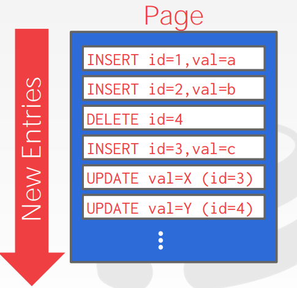
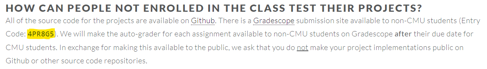

# CMU15-445 数据库系统

[TOC]

课程链接：https://15445.courses.cs.cmu.edu/fall2019/

homework / lab 链接: [2021 版](https://15445.courses.cs.cmu.edu/fall2021/assignments.html), [2022 版](https://15445.courses.cs.cmu.edu/fall2022/assignments.html)

书籍链接：https://www.db-book.com/


## 一. 关系模型

[讲义](https://15445.courses.cs.cmu.edu/fall2019/notes/01-introduction.pdf)

关系模式主要包含三部分：

1. 结构(structure)：关系和内容的定义
2. 完整性约束(Integrity)：确保数据库的内容满足约束
3. 操作(manipulation)：对于数据的增删改查

主键(primary key)：能唯一标识一条记录的属性组。

DML: Data Manipulation Languages 数据操作语言

关系代数：


## 二. 高级 SQL

[讲义](https://15445.courses.cs.cmu.edu/fall2019/notes/02-advancedsql.pdf)

对于 DBMS 来说，用户无需关心查询数据库的计算复杂度，只需要关注数据库最终的查询结果即可。因此 DBMS 需要评估每一次执行效率。

因此就产生了查询优化器(query optimizer)：可以重排操作指令并且产生查询计划

DML: Data Manipulation Language，比如增删改查语句

DDL: Data Definition Language，创建数据库和表的语句 

DCL: Data Control Language，还有安全性授权语句，视图、约束等

### 1. 聚合函数

聚合函数比如：AVG，MIN，MAX，COUNT，SUM，STD

聚合函数支持 DISTINCT 关键字：

```sql
SELECT COUNT(DISTINCT score) FROM student where id like '@cs';
```

在聚合语句中，未使用聚合函数字段在 where 语句中未出现就不能再 select 语句中出现，否则大部分情况下会报错。比如：

```sql
SELECT AVG(s.gpa), e.cid FROM enrolled AS e, student AS s WHERE e.sid = s.sid;
```

这里 `e.cid` 的出现在 select 子句中是极不合理的，因为一个平均成绩所统计的课程 id 有很多个，在这里统计这个字段是没有意义的。

> 在 PostgreSQL 和 MySQL 5.7 及之后的版本会报错，在 MySQL 5.7 和 sqlite 上不会报错，会随机挑选一个 e.cid 作为结果返回。MySQL 切换语法可以使用 `set SESSION sql_mode = 'ansi'/ 'traditional'`

对于在聚合语句中出现的未用聚合语句包围的字段必须在 group by 中出现。

对于聚合字段不能使用 where 语句进行过滤，因为 where 语句是在聚合操作之前执行的，因此应该使用 `having` 子句进行执行。

```sql
SELECT AVG(s.gpa) as avg_gpa, e.cid FROM enrolled AS e, student AS s 
	WHERE e.sid = s.sid
	HAVING avg_gpa > 3.9;
```

### 2. 字符串操作


在 MySQL 中字符串是不分大小写的，

比如一个字段中name = 'jack':

```sql
select * from t where name = 'JACK';
select * from t where name = 'jack';
```

这两种都是可以查到的。

并且用字符串标识用单双引号都可以进行标识。为了标准使用以后最好使用单引号进行使用。

字符串匹配：`%` 可以代表任何一个或者多个字符，`_` 标识单个字符串

其他 string 处理函数，`SUBSTRING(s, start, length)` , `UPPER`, `LOWER`

字符串拼接：

* MySQL: `CONCAT()`

### 3. 日期操作

查看当前时间：

```sql
# psql
SELECT NOW();
SELECT CURRENT_TIMESTAMP();
# mysql
SELECT NOW();
SELECT CURRENT_TIMESTAMP();
# sqlite
SELECT CURRENT_TIMESTAMP;
```

将字符串转为日期，计算天数：

```sql
# psql
select EXTRACT(DAY from DATE('2020-10-08'));
select DATE('2020-10-01') - DATE('2020-01-01') as days;
# mysql
select EXTRACT(DAY from DATE('2020-10-08'));
select DATEDIFF(DATE('2020-10-01'),  DATE('2020-01-01')) as days;
# sqlite
# first no
select CAST((julianday('2020-10-01') - julianday('2018-01-01')) as INT) as days;
```

### 4. 输出控制

即将查询的结果输出到另一个表中：

```sql
# 方式 1
create table demo (
    select id, name, cover from t_web_musics
);
```

这种方式会创建一个新的表，但是不会复制原表中的结构（比如完整性约束等）

```sql
# 方式2
insert into demo 
	select id, name, cover from t_web_musics;
```

第二种方式是使用插入的方式，select 的数据内容必须和插入表中的数据结构完全一致，否则无法写入。

输出的时候也可以进行排序 `order by`

```sql
select sid, score from t order sid asc, score desc;
```

也可以控制输出的行数：`limit <count>, offset`

```sql
select * from t limit 10;
select * from t limit 20, 5;
```

### 5. 嵌套查询

嵌套查询即一个查询语句中还包含一个查询语句：

```sql
select * from t where col in 
	(select col from t2);
```

通常情况下比较难去优化，通常使用 join 来进行优化。

这种方式执行比较愚蠢，因为首先需要通过外部查询来找出每一个 tuple，然后又得一次一次执行内部查询，因为每次比较的时候内部还需要重新查询一遍。

因此可以使用替代的函数：

* `ALL`：对于子查询所有行，必须满足所有条件
* `ANY` (相当于 `IN`)：对于子查询，只要有一行满足条件即可。
* `EXISTS`：至少有一行返回了。

上述嵌套循环可以改写为：

```sql
select * from t where col =	ANY(select col from t2);
```

### 6. 窗口函数

常见窗口函数：`rank`, `row_number`, `dense_rank`

窗口函数(window function)可以对数据进行实时分析处理，可以对一个集合进行函数计算，并且将其聚合为一个结果。像是一个聚合函数，但是数据集合不会被分组到单独的一个组中。

基础语法：

```sql
select ... FUNC(...) OVER(...) from t;
```

`FUNC` 是用于聚合的函数，`OVER` 适用于切分数据的函数，也可以用于排序。

比如为每一个记录生成行号：

```sql
select ROW_NUMBER() over (), name from t_web_musics;
```


Over 函数 Partition by 可以将记录进行分组，然后在组内进行窗口函数执行。


OVER 函数还支持 order by 操作，即在组内进行排序操作，排完序后执行窗口函数。

比如：找出每门课中成绩最高的学生

```sql
SELECT * FROM (
	SELECT *, 
		RANK() OVER (PARTITION BY cid ORDER BY grade ASC) AS rank
	FROM enrolled) AS ranking
WHERE ranking.rank = 1
```

psql、MySQL 8 以及最新的 sqllite 都支持窗口函数。

rank 函数只会对排序的字段处理，如果相同则会得到相同的值，如果不使用 order by 函数所有值都会为 1。

### 7. 公用表表达式

共用表表达式(Common Table Expression, CTE)，可以使用一个辅助语句来替代长语句，即使用 `with` 语句，其会在执行正常程序之前先行一步执行。这对于大批量的 SQL 数据，可以优化性能。


这和嵌套查询有什么区别？CTE 可以嵌套执行。


嵌套 CTE 比较难理解，但是 CTE 还是有很多人用的。

## 三. 数据库存储

数据库存储的位置都在磁盘上，DBMS 就是用于管理磁盘和内存之间的数据移动，任何时间尝试读取的数据都有可能不在内存中。


基于硬盘的 DBMS 大致如上，读取数据的时候首先将对应的数据库读取到内存中，查询的时候通过搜索引擎来对 buffer pool 中的数据进行操作。

这个流程类似于虚拟内存管理，但是为什么不使用操作系统自带的内存管理，而要另外编写一套系统来管理数据？

* 通常情况下，使用 `mmap` 函数将硬盘数据读取到内存中。但是在这种情况下，就将数据的控制权交给的操作系统了。然而操作系统并不能完全知道我们想要做什么，因此最终操作结果和理想结果会有偏差。
* 并且对于 `mmap` 函数来说，如果对于多线程读写来说，操作系统并不知道什么时候应该在读取数据之前是否将数据写入磁盘，即操作系统无法保证脏页输入磁盘的正确顺序。
* 对于一些情况，操作系统的管理会自动换出缓存页，然而某些情况我们并不想换出缓存页。
* 还有其他线程调度问题

因此主流数据库比如 MySQL，PostgreSQL 都几乎不使用 `mmap` 函数。

因此需要解决两个问题：

1. DBMS 是如何在磁盘中表示文件的？
2. DBMS 是如何管理磁盘中的数据块换入换出内存的？

### 1. 文件存储

存储引擎(storage manager)：用于维护数据库文件，有些时候引擎会调度读写顺序来提高对于页的操作的时间和空间局部性。用于管理组织一系列的页(pages)，用于将数据读写到页中，以及监控在页中还可以写入多少数据。

页：即一个固定大小的数据块。

页分为多种：

* 硬件页：通常为 4KB，这个级别意味着每一写入 4KB 是原子性的。
* OS 页：通常为 4KB
* 数据库页：512B - 16KB

不同 DBMS 管理页的方式：（可参考[link](https://zditect.com/main/dbms/dbms-heap-file-organization.html)）

* Heap File Organization(堆文件组织): 最常见的组织方式。有无序的页集合构成，需要使用元信息来保持跟踪哪些页存在和哪些页还有剩余空间。

  通常实现方式为链表的形式：

  在 Header 中有两个指针，分别指向 Free Page List 和 Data Page List。

  

  不过现在大部分 DBMS 都采用目录的形式来访问每个页，在目录中维护中页的位置和剩余空间大小，只要通过遍历整个目录就可以找到对应页的大小。

  

* Sequential / Sorted File Organization

* Hashing File Organization

### 2. 页结构

DBMS 需要确保目录页的内容要和数据页中的信息保持同步。


每个页都包含 header 元信息内容：比如页大小、checksum、DBMS 版本、事务可见性、压缩信息等。

在一个页内部是如何组织数据的？

* Tuple-oriented，最常见的是 slotted pages
* Log-structured，存储的是日志记录（比如 SQL 语句）

最常见的页布局形式是 slotted pages （页槽）：


在页中维护一个槽数组，每个槽内记录着每个数据块的存储起始偏移量。

对于 DBMS 来说，如何确定一个 tuple 的位置？

* 通常会为每个 tuple 分配一个唯一的记录 ID（比如 page ID + offset/slot）
* 在查找数据的时候，根据索引提供的记录 ID 信息就可以找到 tuple 所存储的硬盘位置。

比如在 PostgreSQL 中，表中每个记录都对应有一个 ctid 来记录存储的位置：

```sql
SELECT t.ctid, t.* FROM t;
```

结果：(即采用的方式是 page ID + slot 的方式)

```
 ctid  | id | name | age
-------+----+------+-----
 (0,1) |  1 | Lisa |  28
 (0,2) |  2 | John |  16
 (0,3) |  3 | Jack |  18
 (0,4) |  4 | Lina |  22
```

如果删除第 3 行之后再插入一行数据会变为：

```
 ctid  | id | name  | age
-------+----+-------+-----
 (0,1) |  1 | Lisa  |  28
 (0,2) |  2 | John  |  16
 (0,4) |  4 | Lina  |  22
 (0,5) |  5 | Peter |  24
```

在删除一个数据之后，Postgres 不会覆盖原来删除的位置，会继续以追加的方式来添加数据，当然这会造成内部碎片无法利用，因此 Postgres 还提供了紧凑(Compact)的方式来清理内部碎片：

```sql
VACUUM FULL
```

之后结果为：

```
 ctid  | id | name  | age
-------+----+-------+-----
 (0,1) |  1 | Lisa  |  28
 (0,2) |  2 | John  |  16
 (0,3) |  4 | Lina  |  22
 (0,4) |  5 | Peter |  24
```

在 MySQL 中对应的命令为：

```sql
SELECT sys.fn_PhysLocFormatter(%%physloc%%) AS [File:Page:Slot], t.* FROM t;
```

> 不过在 MySQL 上自动进行紧凑操作。

基于日志结构的组织形式：



这种方式写操作很快，因为以追加的方式记录数据要比随机写的方式要快（可以联想到 GFS 的工作方式），但是读的方式比较慢，需要回溯整个记录。

### 3. 数据表示形式

在数据库中不同数据有着不同的类型：

* INTEGER / BIGINT / SMALLINT / TINYINT 都遵循 C/C++ 的表示形式
* FLOAT / REAL 采用的是 IEEE-754 标准，而 NUMERIC / DECIMAL 采用的是定点小数的表示方法。（对于高精度应用，必须要使用定点小数来保证数据的准确性），前者由于使用的是 C/C++ 标准，运算直接使用硬件指令所以执行速度会更快，而后者的话需要额外处理精度问题所以效率不那么高。
* VARCHAR / VARBINARY / TEXT / BLOB 采用的是标注长度的头，紧接着数据
* TIME / DATE / TIMESTAMP 采用的是 32/64 位整数秒/毫秒/微秒表达形式

大数据块存储：通常 DBMS 不允许一个数据块的大小超过单个数据页的大小，在这种情况下 DBMS 有两种方式进行解决：

* 使用一种 Overflow page 的方式进行存储，一个 overflow page 存储不下则使用多个 page 进行存储。

  

* 外部存储：即允许指向一个外部文件，比如大的视频文件等等，这种类型通常为 `BLOB` 类型，并且 DBMS 无法修改 BLOB 内部的某个值。或者通常情况下该字段保存的是该大文件的文件路径，否则数据库可能维护文件成本较高。

### 4. 系统目录 system catalogs

系统目录中存储着关于数据库的元信息：

* 表结构、列信息、索引、视图等
* 用户及其权限
* 内部统计数据等等

几乎所有的数据库都会维护一个数据库的系统目录。比如 MySQL 中的 `information_schema`, `performance_schema`, `sys` 等数据库，Postgres 中每创建一个表自增主键都会有的 `***_id_seq` 的表信息等等，比如：

```sql
SELECT * FROM INFORMATION_SCHEMA.TABLES WHERE table_catalog='DB';
```

### 5. 存储模型

> 需要在业务中搞清楚数据适合行存储(OLTP)还是列存储(OLAP)


联机事务处理(On-Line Transaction Process, OLTP)：简单读取或者更新数据库中的单个实体。

联机分析处理(On-Line Analytical Process, OLAP)：查询操作为主。

🔵N-array Storage Model(NSM)：DBMS 会将表中所有的属性全部连续存储在一个页中，十分适合 OLTP。


优点：

* 增删改很快
* 对于需要拿到整个 tuple 的查询也很有好处

缺点：

* 如果只想拿到属性子集的字段，会产生大量用不到的数据。

  

🔵分解存储模型：DBMS 为单个属性单独连续存储在一个页中，十分适合 OLAP


那么在 DSM 中，是如何根据字段值确定整个 tuple 的？


* 固定长度偏移，在这个属性中每个值都是固定长度的，因此只需要知道偏移量就可以确定其他字段在其页中的所在位置。这也是比较常见的做法。
* 嵌入 Tuple ID，为每个值都标识一个 tuple id，比较浪费空间

优点：

* 能够减少不必要的 IO 操作，DBMS 只需要读它想读的
* 可以更好的进行查询和数据压缩

缺点：

* 读取整个 tuple 比较慢

## 四. buffer 池与缓冲管理

主要解决 DBMS 如何在磁盘和主存之间来回移动数据。DBMS 申请的内存是由 DBMS 自己来管理，不通过操作系统内核来进行管理。

### 1. 缓冲池元数据


由于是 DBMS 自己来管理 page 到 frame 的映射，因此需要维护一个页表来保存这种映射。

并且对于页表中的每一个页来说，还需要保存其他的元信息：

* Dirty Flag：用来查看该页是否被修改过
* Pin/Reference Counter：用于查看该页的引用数目

🔵 Lock 和 Latch 的区别：

Lock：

* 用于在事务中保护数据库的逻辑内容
* 需要能够回滚操作

Latch：

* 用于在多线程中保护 DBMS 内部数据的临界区域
* 不需要回滚操作
* 可以自旋操作，也允许多个 thread 进行读

### 2. 页分配策略

1. 全局策略：根据所有活跃的事务来做决定
2. 局部策略：不考虑事务的并发行为，直接将 frame 分配给对应的事务；并且仍然支持共享页

### 3. 缓冲池优化

<h4>A. 多缓冲池</h4>

DBMS 可以拥有多个缓冲池，每个缓冲池都有对应的一个页表来进行管理。这样可以在每个缓冲池上执行局部策略，可以为你存放进去的数据量身定制。比如可以为每个表都设置一个缓冲池。

当进行寻找数据的时候，可以通过记录 ID 映射到相应的缓冲池或者通过 hash(ID) 找到对应的缓冲池。

<h4>B. Pre-fetch 预取</h4>

预取的情况分为两种：线性扫描和索引扫描

线性扫描：在进行线性扫描数据的时候，预先将数据库中页读取到缓冲池中，即利用局部性策略，避免下一次读取时候的停顿，加快数据库的操作速度。对于系统函数 `mmap` 也可以做到这一点。


索引扫描：然而在进行索引扫描的时候，由于索引对应的记录所存储的数据在磁盘上不一定是连续的，因此 `mmap` 这时候就不知道下一次我们会读什么数据了。因此就需要 DBMS 主动根据索引将记录所在页预取到缓冲池中。

<h4>C. Scan Sharing 扫描共享</h4>

> 暂时只有 Oracle，SQLServer 支持

即在同一时间段内和同一个表时，如果两个事务中间部分查询流程是有交集的，那么在 A 事务查询时候，需要对于页进行换入换出操作，此时 B 事务也要对此表进行操作，就可能会出现 A 刚换出的页在 B 事务执行的时候又会被换入，因此就会出现内存抖动的线性导致执行效率较低。扫描共享就是此时 B 事务就可以复用 A 事务查询的cursor，即 B 事务扫描时候的 cursor 指向和 A 事务 cursor 指向的数据，两者在同一时刻扫描的时同一个页，从而避免出现内存抖动的情况，当 A 事务执行结束的时候，B 事务的 cursor 再指向未进行扫描的记录。


<h4>D. Buffer Pool bypass</h4>

> 也称作轻量级扫描(Light Scans)，Postgres 中支持，MySQL 5.7 不支持

对于大规模顺序读取来说，不需要将已读取数据存储到缓冲池中来避免额外开销。由于 OS 通常会读取的磁盘文件的时候就会进入 OS 缓存中，实现 bypass 通常使用 Direct IO (`O_DIRECT`) 来避免进行缓存。

Postgres 是教学的典范：

```sql
EXPLAIN (ANALYZE, BUFFERS) SELECT * FROM startup;
```

使用 explain (ANALYZE, BUFFERS) ，不仅可以查看执行计划，还可以查看此次查看所使用的缓存页数

```
                              QUERY PLAN
-----------------------------------------------------------------------------------------------
 Seq Scan on startup  (cost=0.00..1.04 rows=4 width=40) (actual time=0.174..0.175 rows=4 loops=1)
   Buffers: shared read=1
 Planning:
   Buffers: shared hit=28 read=2
 Planning Time: 0.258 ms
 Execution Time: 0.183 ms
(6 rows)
```

`Buffers: shared read=1` 即表示此次查询使用了一个缓存页。

### 4. 缓存替换策略

LRU，CLOCK 算法，但是这些算法对于 sequential flood 都不太好处理。

sequential flood：即顺序扫描读取每一个页，这会污染缓存池并且只读一次。

在 sequential flood 这种情况下，只想替换最近被使用的，而不是最近最少使用的。解决这种情况的策略有：

* LRU-K 算法，核心思路就是在没有达到 K 次访问的数据就不会被缓存
* 局部化：DBMS 基于每个查询或者事务来决定换出哪个页。
* 优先级提示(priority hints)：用于提供一些信息告诉缓存池哪些页是重要还是不重要的（比如索引扫描）。

* 脏页处理：dirty bit 是用来表示当页存入缓存池后是否对这个页进行修改。在进行替换的时候可以找不是脏页的进行替换，否则的话需要将对应的页安全写入磁盘才可以对其进行换出。

  或者也可以使用**后台写入**(backgroud writing)的方法，定期将脏页写入磁盘并且重置 dirty bit，后续就无需担心换页时候的额外时间开销了。

## Appendix-0 Pre

### 1. 安装 sqlite

首先在[sqlite官网](https://www.sqlite.org/download.html)下载 sqlite-autoconf-*.tar.gz 文件：

```sh
wget https://www.sqlite.org/2022/sqlite-autoconf-3390400.tar.gz
```

然后解压缩：

```sh
tar -zxvf sqlite-autoconf-3390400.tar.gz
cd sqlite-autoconf-3071502
```

配置安装路径和编译：

```sh
./configure --prefix=/usr/local
make && make install
```

检测是否安装：

```sh
$ sqlite3
SQLite version 3.39.4 2022-09-29 15:55:41
Enter ".help" for usage hints.
Connected to a transient in-memory database.
Use ".open FILENAME" to reopen on a persistent database.
sqlite>
```

### 2. gradescope

实验结果评分需要在 [Gradescope](https://www.gradescope.com/) 网站上进行提交，注册所需要的课程码一般会在 [FAQ](https://15445.courses.cs.cmu.edu/fall2021/faq.html) 网页中给出，当年的非 CMU 学生的实验开放时间在当学期之后。



注册时候学校填写 Carnegie Mellon University 即可。

## Appendix-1. Homework

对应页面有参考答案。

### 1. SQL

目的：学习 SQL 语法和熟悉 sqlite。(需要安装sqlite)

首先下载和解压缩数据库文件：

```sh
wget https://15445.courses.cs.cmu.edu/fall2022/files/imdb-cmudb2022.db.gz
gunzip imdb-cmudb2022.db.gz
```

查看数据库文件：

```sh
$ sqlite3 imdb-cmudb2022.db
SQLite version 3.39.4 2022-09-29 15:55:41
Enter ".help" for usage hints.
sqlite> .table
akas      crew      episodes  people    ratings   titles
```

为各个表创建索引：

```sql
CREATE INDEX ix_people_name ON people (name);
CREATE INDEX ix_titles_type ON titles (type);
CREATE INDEX ix_titles_primary_title ON titles (primary_title);
CREATE INDEX ix_titles_original_title ON titles (original_title);
CREATE INDEX ix_akas_title_id ON akas (title_id);
CREATE INDEX ix_akas_title ON akas (title);
CREATE INDEX ix_crew_title_id ON crew (title_id);
CREATE INDEX ix_crew_person_id ON crew (person_id);
```

查看表的信息：

```sqlite
> .schema people
CREATE TABLE people (
  person_id VARCHAR PRIMARY KEY,
  name VARCHAR,
  born INTEGER,
  died INTEGER
);
CREATE INDEX ix_people_name ON people (name);
```

🔵Q1: 测试

```sql
SELECT DISTINCT(language) from akas order by language limit 10;
```

🔵Q2: Find the 10 `Sci-Fi` works with the longest runtimes.

比较简单：

```sql
SELECT 
	primary_title, premiered, CAST(runtime_minutes AS VARCHAR) || " (mins)" 
FROM titles 
WHERE genres LIKE '%Sci-Fi%'
ORDER BY runtime_minutes DESC
LIMIT 10;
```

🔵Q3: Determine the oldest people in the dataset who were born in or after 1900. You should assume that a person without a known death year is still alive.

我的答案：

```sql
SELECT name, age FROM (
    SELECT name, died-born AS age 
    FROM people 
    WHERE born >= 1900 AND died is not NULL 
    UNION 
    SELECT name, 2022-born AS age 
    FROM people
    WHERE born >= 1900 AND died IS NULL
)
ORDER BY age DESC, name ASC
LIMIT 20;
```

由于不会使用 if-else 语句，所以会导致对整个表扫描了两遍，效率更低。

标准答案：

```sql
SELECT name,
	CASE
		WHEN died IS NOT NULL
		THEN died - born
		ELSE 2022 - born
	END AS age
FROM
	people
WHERE born >= 1900
ORDER BY age DESC, name ASC
LIMIT 20;
```

语法格式：

```sql
CASE
	WHEN [cond]
	THEN ...
	ELSE ...
END as ..
```

🔵Q4: Find the people who appear most frequently as crew members.

我的答案：

```sql
SELECT 
	(SELECT name FROM people p WHERE p.person_id = c.person_id) AS name,
	COUNT(1) AS cnt 
FROM crew c 
GROUP BY c.person_id 
ORDER BY cnt DESC 
LIMIT 20;
```

参考答案：

```sql
SELECT
        name, COUNT(*) as num_appearances
FROM
        people
INNER JOIN
        crew ON people.person_id = crew.person_id
GROUP BY name
ORDER BY num_appearances DESC
LIMIT 20;
```

我觉的这个参考答案是有问题的，因为 name 字段不是唯一属性，很有可能会重复，因此结果不一定准确。

🔵Q5: Compute intersting statistics on the ratings of content on a per-decade basis.

我的答案：

```sql
SELECT 
	SUBSTRING(premiered, 1, 3) || "0s" AS decade, 
	ROUND(AVG(r.rating),2) ar, 
	MAX(r.rating), 
	MIN(r.rating), 
	COUNT(1) 
FROM titles t JOIN ratings r ON t.title_id=r.title_id 
WHERE premiered IS NOT NULL 
GROUP BY decade 
ORDER BY ar DESC, decade ASC
LIMIT 20;
```

参考答案大致一致。

🔵Q6: Determine the most popular works with a person who has "Cruise" in their name and is born in 1962.

我的答案：

```sql
SELECT primary_title, votes 
FROM titles t 
JOIN ratings r 
    ON r.title_id=t.title_id 
WHERE r.title_id in (
    SELECT title_id 
    FROM crew c
    JOIN people p 
    	ON c.person_id=p.person_id 
    WHERE name LIKE '%Cruise%' and born = 1962) 
ORDER BY votes DESC 
LIMIT 10;
```

Sqlite 中没有 any 函数，改用 in 所以执行效率会有所降低。因此改用 CTE ：

```sql
WITH cruise_title AS (
    SELECT title_id 
    FROM crew c
    JOIN people p 
    	ON c.person_id=p.person_id 
    WHERE name LIKE '%Cruise%' and born = 1962
)

SELECT primary_title, votes 
FROM titles t 
JOIN ratings r 
    ON r.title_id=t.title_id 
WHERE r.title_id in cruise_title
ORDER BY votes DESC 
LIMIT 10;
```

参考答案：

```sql
WITH cruise_movies AS (
     SELECT
          crew.title_id AS title_id
     FROM crew
     INNER JOIN
          people ON crew.person_id = people.person_id
     WHERE people.name LIKE "%Cruise%" AND people.born = 1962
)
SELECT
     titles.primary_title as name,
     ratings.votes as votes
FROM
     cruise_movies
INNER JOIN
     ratings ON cruise_movies.title_id = ratings.title_id
INNER JOIN
     titles ON cruise_movies.title_id = titles.title_id
ORDER BY votes DESC
LIMIT 10;
```

🔵Q7: List the number of works that premiered in the same year that "Army of Thieves" premiered.

我的答案：

```sql
WITH year AS (
    SELECT premiered 
    FROM titles 
    WHERE primary_title='Army of Thieves'
) 
SELECT COUNT(1) 
FROM titles 
WHERE premiered IN year;
```

参考答案大致一致。

🔵Q8: List the all the different actors and actresses who have starred in a work with Nicole Kidman (born in 1967).

我的答案：

```sql
SELECT 
	DISTINCT name 
FROM people 
JOIN crew 
	ON crew.person_id=people.person_id 
WHERE 
	category IN ('actor', 'actress') 
	AND 
	title_id IN (
        SELECT title_id 
        FROM crew c 
        JOIN people p 
        	ON c.person_id=p.person_id 
        WHERE name='Nicole Kidman') 
ORDER BY name ASC;
```

🔵Q9: For all people born in 1955, get their name and average rating on all movies they have been part of through their careers. Output the 9th decile of individuals as measured by their average career movie rating.

学会使用窗口函数。

我的答案：

```sql
WITH t AS (
    SELECT
    	name, rating
    FROM people p
    JOIN crew c ON p.person_id=c.person_id
    JOIN titles t ON c.title_id=t.title_id
    JOIN ratings r ON r.title_id=t.title_id
    WHERE born = 1955 AND type='movie'
)
SELECT name, ar
FROM (
    SELECT
        name, ROUND(AVG(rating), 2) ar, NTILE(10) OVER(ORDER BY AVG(rating)) as nt
    FROM t
    GROUP BY name
    ORDER BY ar DESC, name ASC
)
WHERE nt = 9;
```

参考答案：

```sql
WITH actors_and_movies_1955 AS (
     SELECT
          people.person_id,
          people.name,
          titles.title_id,
          titles.primary_title
     FROM
          people
     INNER JOIN
          crew ON people.person_id = crew.person_id
     INNER JOIN
          titles ON crew.title_id = titles.title_id
     WHERE people.born = 1955 AND titles.type = "movie"
),
actor_ratings AS (
     SELECT
          name,
          ROUND(AVG(ratings.rating), 2) as rating
     FROM ratings
     INNER JOIN actors_and_movies_1955 ON ratings.title_id = actors_and_movies_1955.title_id
     GROUP BY actors_and_movies_1955.person_id
),
quartiles AS (
     SELECT *, NTILE(10) OVER (ORDER BY rating ASC) AS RatingQuartile FROM actor_ratings
)
SELECT name, rating
FROM quartiles
WHERE RatingQuartile = 9
ORDER BY rating DESC, name ASC;
```

🔵Q10: Concatenate all the unique titles for the **TV Series** "House of the Dragon" as a string of comma-separated values in alphabetical order of the titles.

不会递归 CTE。

参考答案：

```sql
with p as (
      select titles.primary_title as name, akas.title as dubbed
      from titles
      inner join akas on titles.title_id = akas.title_id
      where titles.primary_title = "House of the Dragon" AND titles.type = 'tvSeries'
      group by titles.primary_title, akas.title
      order by akas.title
),
c as (
      select row_number() over (order by p.name asc) as seqnum, p.dubbed as dubbed
      from p
),
flattened as (
      select seqnum, dubbed
      from c
      where seqnum = 1
      union all
      select c.seqnum, f.dubbed || ', ' || c.dubbed
      from c join
            flattened f
            on c.seqnum = f.seqnum + 1
)
select dubbed from flattened
order by seqnum desc limit 1;
```

## Appendix-2. Lab

### pre. C++ 基础

🔵 智能指针

参考：[c++智能指针](https://xhy3054.github.io/cpp-unique-ptr/)

由于 C++ 需要自行动态管理内存，为了防止内存泄漏花费程序员大量的时间，在 c++11 中提出使用智能指针来帮助程序员**管理动态内存**，使用智能指针的时候无需手动 `delete` ，当所在作用域执行完毕之后会自动进行释放。智能指针分为三种：

* `shared_ptr`：是采用引用计数的智能指针，一个原始指针可以分配给多个所有者。
* `unique_ptr`：只允许基础指针的一个所有者。
* `weak_ptr`：想要观察某个对象但不需要其保持活动状态

🔵unordered_map

unordered_map 是一个 map

🔵lvalue 和 rvalue

参考：[值类别：lvalue 和 rvalue (C++) ](https://learn.microsoft.com/zh-cn/cpp/cpp/lvalues-and-rvalues-visual-cpp?view=msvc-170)

lvalue 具有程序可访问的地址。 例如，lvalue 表达式包括变量名称，其中包括 **`const`** 变量、数组元素、返回 lvalue 引用的函数调用、位域、联合和类成员。

* `std::move()` 将左值转为右值

🔵引用声明符 `&&`

参考：

* [规则引用声明符：&&](https://learn.microsoft.com/zh-cn/cpp/cpp/rvalue-reference-declarator-amp-amp?view=msvc-170)
* [一文读懂C++右值引用和std::move - 知乎 (zhihu.com)](https://zhuanlan.zhihu.com/p/335994370)

看不懂

🔵 类型转换

* `static_cast`:  是 c 语言的强制转换代替品，在编译时期强制转换
* `dynamic_cast`:  dynamic_cast会运行时检查该转换是否类型安全，只在多态类型时合法，dynamic_cast在运行时期转换(较安全).

用法：

```cpp
dynamic_cast <type>(expression)
```


### 0. C++ Primer

> 主要考察对于 C++ 语法的使用

下载 [bustub](https://github.com/cmu-db/bustub) 代码：

```sh
git clone https://github.com/cmu-db/bustub.git
```

配置环境：

```sh
cd bustub
sudo build_support/packages.sh
```

build 文件：

```sh
cd bustub
mkdir build
cd build
cmake -DCMAKE_BUILD_TYPE=Debug ..
# make with 8 threads
make -j8
```

由于程序测试大多先关闭，因需要打开测试案例，需要在测试名称之前删除 `DISABLED_` 前缀。

打开测试 `bustub/test/primer/starter_trie_test.cpp`：

```cpp
// 比如在 starter_trie_test.cpp 中
TEST(StarterTest, DISABLED_TrieNodeInsertTest)
// 改为
TEST(StarterTest, TrieNodeInsertTest)
```

将文件中所有 TEST 的中全部删除即可。

代码风格，需要满足[Google C++ Style Guide](https://google.github.io/styleguide/cppguide.html)：

```sh
# 首先构建代码格式化检测文件
make format
make check-lint
make check-clang-tidy-p0
```

内存泄漏检查：

```sh
valgrind --error-exitcode=1 --leak-check=full ./test/starter_trie_test
```

日志处理：

```cpp
#include "common/logger.h"

LOG_INFO("# Pages: %d", num_pages);
LOG_DEBUG("Fetching page %d", page_id);
```

注意点：由于智能指针的回收是自动进行的，一出作用域就会立刻进行回收（和 rust 中的变量类似），比如对于**任何含有**智能指针的原有变量使用等号 `=` 赋值都会变为空，可以使用 `std::move()` 延长生命周期。

```c++
// children_ 的定义
std::unordered_map<char, std::unique_ptr<TrieNode>> children_;
// 解决方案
TrieNode(TrieNode &&other_trie_node) noexcept {
    this->key_char_ = other_trie_node.key_char_;
    this->is_end_ = other_trie_node.is_end_;
    this->children_ = std::move(other_trie_node.children_);
}
```

将智能指针转为原有类型的右值引用：

```cpp
auto nxt = (*node)->GetChildNode(c);	// unique_pre<Node>* 类型
auto tmp = nxt->release();				// Node* 类型
Node&& node = std::move(*tmp);			// Node && 类型
```

将智能指针中的内容进行替换：

```cpp
auto t = TrieNodeWithValue<T>(std::move(test), value);
(*nxt).reset(&t);
```

cpp 中子类转父类，转化失败会返回 `nullptr`：

```cpp
auto casted = dynamic_cast<TrieNodeWithValue<T> *>(tmp);
if (casted != nullptr) {
    *success = true;
    return casted->GetValue();
}
```

对于最后的并发问题，只需要加锁即可。
