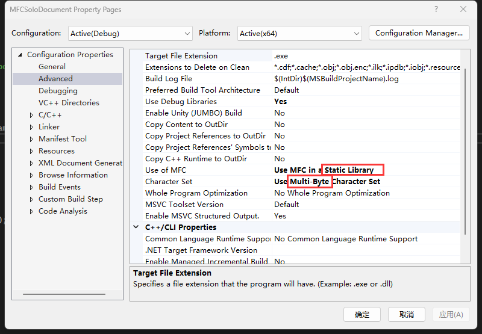

# C++

[TOC]

## 0x1. 指针

### 1. 左值右值

左值：可以放在赋值运算符左边

右值：指数据本身，不能取其自身地址。

### 2. 数组与指针

```c++
int a[4] = {1, 2, 3, 4};
// 指向一个元素类型为int长度为4的数组
int(*b)[4] = &a;

int* ap[5];
// 指向一个元素类型为int*长度为5的数组
int*(*bap)[5] = &ap;
```

### 3. const

分为两个概念：

* const pointer：指针不可改变

* pointer to const：指向的变量内容不可改变

```c++
char *s1 = "123";
char *s2 = "456";

char const *sc1 = s1;
sc1[0] = 'a'; // error
sc1 = s2;

char *const sc2 = s1;
sc2[0] = 'b';
sc2 = s1;   // error

char const * const sc3 = s1;
```

关于 const 修饰的部分需要看左侧，左侧没有则看右侧：

* `char const *sc1`：左侧是 `char` 说明 char 不可变，但是指针可变。
* `char *const sc2`：左侧是 `char*` 说明指针不可被，但是字符内容可变。
* `char const * const sc3`：说明指针和内容都不可变。

 ### 4. 智能指针

> 在`<memory>`头文件中

根据对象的生命周期和所有权分为四种智能指针：

* unique_ptr：只能被一个对象持有，不支持直接赋值和复制，只可以使用 `std::move()` 转移所有权。

  * 创建方式：

    ```c++
    unique_ptr<int> b(new int[10]);
    // C++17
    unique_ptr<int> a = std::make_unique<int>(10);
    ```

  * 使用和转移

    ```c++
    unique_ptr<int> a = std::make_unique<int>(10);
    // get()使用
    a.get()[0] = 1;
    unique_ptr<int> b = std::move(a);
    ```

* shared_ptr：可以让多个指针指向同一个对象，原理是引用计数，如果计数为 0 就会进行析构释放内存。但是会出现**循环引用**的情况。

  ```c++
  shared_ptr<int> a = make_shared<int>(10);
  cout << a.use_count() << endl;
  shared_ptr<int> b = a;
  cout << a.use_count() << endl;
  weak_ptr<int> c = a;
  cout << a.use_count() << endl;
  ```

* weak_ptr：用来和 shared_ptr 一起工作，来解决**循环引用**的问题。使用观察者模式工作的，weak_ptr 只对 shared_ptr 进行引用但是**不会改变引用计数**。使用场景就是只查看不对 shared_ptr 进行修改，当 shared_ptr 失效的时候，weak_ptr 也会失效。

* auto_ptr(C++17中被删除)：auto_ptr在销毁的时候，其所管理的对象也会自动被 delete。如果有其它 auto_ptr 指向相同的对象会转移所有权。

## 0x2. 面向对象

C++中的 struct 和 class 的区别：

* struct 默认权限是 public 的
* class 默认权限是 private 的

### 1. 运算符重载

Refer:

* [operator overloading](https://en.cppreference.com/w/cpp/language/operators)

举例：

```c++
class Point {
 public:
  double x = 0, y = 0;

  bool operator==(const Point &rhs) const {
    return x == rhs.x &&
        y == rhs.y;
  }

};
```

前置操作和后置操作：

```c++
// 前置 ++p;
Point& operator++();
// 后置 p++; 先返回之前的对象然后再自增，相比于前置会多创建一个对象
Point operator++(int);
```

标准输入输出重载：

```c++
class Point {
 public:
  double x = 0, y = 0;

  Point(double x, double y) : x(x), y(y) {}
  // 输出
  friend ostream &operator<<(ostream &os, const Point &point) {
    os << "x: " << point.x << " y: " << point.y;
    return os;
  }
  // 输入
  friend istream &operator>>(istream &is, Point &p) {
    is >> p.x >> p.y;
    return is;
  }

};
```

### 2. const 修饰成员函数

举例：

```c++
int Girl::print() const {
  this->age = 1;//报错
  return 0;
}
```

当使用 `const` 修饰成员函数时，`this` 返回的类型为 `const Girl *`，也就意味着指针指向的数据只能读取不能修改，从而优化。

### 3. friend 关键字

friend关键字允许一个函数或者类访问该类的私有属性。

* 友元类：

  ```c++
  class Friend {
   private:
    int age;
    string name;
  
    friend class Boy;
  };
  
  class Boy {
    void f1(Friend &f) {
      cout << f.name << endl;
    }
  };
  ```

* 友元函数：

  ```c++
  class Point {
   public:
    double x = 0, y = 0;
  
    friend ostream &operator<<(ostream &os, const Point &point) {
      os << "x: " << point.x << " y: " << point.y;
      return os;
    }
  };
  ```

### 4. 合成成员函数

当创建一个类的时候，如果不进行任何操作，编译器会为该类生成**合成拷贝构造**函数，这些函数有：

* 拷贝构造：`ClassName(const ClassName&)`：会自动拷贝该类的成员变量给新的对象
* 拷贝赋值：`ClassName& operator=(const ClassName&)`：同样会拷贝类的成员变量给新对象。
* 析构函数：析构函数会自动销毁对象的非静态成员变量。
* 移动构造：`ClassName(ClassName&&)`
* 移动赋值：`ClassName& operator=(ClassName&&) noexcept`

可以使用 `default` 和 `delete` 来自定义是否使用合成函数。

```c++
// 使用
Point() = default;
// 不使用
Point &operator=(const Point& p) = delete;
Point(const Point&) = delete;
```

### 5. 带泛型的函数

类中如果部分函数有泛型，则只能在内部定义函数体，否则在某些场景可能会报错。

```c++
class ProcessUtil
{
public:
	/*
	Read value from specific address of process handle
	*/
	template<typename T>
	static T Read(HANDLE pHandle, QWORD address) {
		T _read = 0;
		ReadProcessMemory(pHandle, (LPVOID)address, &_read, sizeof(T), NULL);
		return _read;
	}

	/*
	Write value T to address in process handle
	*/
	template<typename T>
	static BOOL Write(HANDLE pHandle, QWORD address, T value) {
		return WriteProcessMemory(pHandle, (LPVOID)address, &value, sizeof(T), NULL);
	}
};
```


## 0x3. 高级用法

### 1. constexpr

Refers: [constexpr (C++) | Microsoft Learn](https://learn.microsoft.com/zh-cn/cpp/cpp/constexpr-cpp?view=msvc-170)

* `constexpr` 变量：`const` 变量可以推迟到运行时进行，`constexpr` 必须在编译时进行初始化
* `constexpr` 函数：该函数可以在编译时就可以计算其返回值。

### 2. 头文件重复包含

有两种解决方案：

* 使用 `#ifndef` 、`#define`、`#endif`：可移植性好，但是无法防止重复定义
* 使用 `#pragma once`：只考虑windows平台使用这个

### 3. Boost库

提供了较为常用的扩展库，[Boost C++ Libraries](https://www.boost.org/)

## 0x4. 多线程

参考：

* [C++ 多线程编程（一）：std::thread的使用](https://immortalqx.github.io/2021/12/04/cpp-notes-3/)
* 

### 1. 创建线程

```c++
#include "thread"

void func1(int i) {
  cout << i << endl;
}

void create_thread() {
  for (int i = 0; i < 5; ++i) {
    thread t(func1, i);
    t.detach();
  }
}
```

创建线程参数：

* 第一个是函数
* 其余是函数的参数

最后使用 `detach()` 函数脱离主线程，让线程可以独立允许。

C++11有两种方式来等待线程结束：

- detach方式：启动的线程自主在后台运行，当前的代码继续往下执行，不等待新线程结束。前面代码所使用的就是这种方式。
  - 调用detach表示thread对象和其表示的线程完全分离；
  - 分离之后的线程不再受约束和管制，会单独执行直到执行完毕释放资源，可以看做是一个daemon线程；
  - 分离之后thread对象不再表示任何线程；
  - 分离之后joinable() == false，即使还在执行；
- join方式：等待启动的线程完成，才会继续往下执行。假如前面的代码使用这种方式，其输出就会0,1,2,3，因为每次都是前一个线程输出完成了才会进行下一个循环，启动下一个新线程。
  - 只有处于活动状态线程才能调用join，可以通过joinable()函数检查;
  - joinable() == true表示当前线程是活动线程，才可以调用join函数；
  - 默认构造函数创建的对象是joinable() == false;
  - join只能被调用一次，之后joinable就会变为false，表示线程执行完毕；
  - 调用 ternimate()的线程必须是 joinable() == false;
  - 如果线程不调用join()函数，即使执行完毕也是一个活动线程，即joinable() == true，依然可以调用join()函数

## 0x5. MFC

### 0. 准备

在设置 visual studio 的时候将项目需要设置为使用 MFC 静态库和多字节字符集。



### 1. 基本信息

常用头文件：

* afx.h
* afxwin.h：包含 `afx.h` 和 `windows.h`
* afxext.h：提供扩展类的

### 2. 消息处理机制

1. 监听窗口创建信息

   这种方式不标准，应该使用消息映射机制来处理消息。

   ```c++
   class CMainFrame : public CFrameWnd
   {
   public:
   	virtual LRESULT WindowProc(UINT message, WPARAM wParam, LPARAM lParam);
   
   };
   ```

   实现：

   ```c++
   LRESULT CMainFrame::WindowProc(UINT message, WPARAM wParam, LPARAM lParam)
   {
   	switch (message)
   	{
   	case WM_CREATE:
   		AfxMessageBox("你好");
   		break;
   	}
   	// 其余消息交给父类处理
   	return CFrameWnd::WindowProc(message, wParam, lParam);
   }
   ```

2. 消息映射机制

   可以在不重写 `WindowProc` 的前提下处理消息。

   需要具备的条件：

   * 类内需要声明宏：`DECLARE_MESSAGE_MAP()`

     ```c++
     // MainFrm.h
     class CMainFrame : public CFrameWnd
     {
     protected:
     	DECLARE_MESSAGE_MAP()
     };
     ```

   * 类外必须添加实现宏：`BEGIN_MESSAGE_MAP(theClass, baseClass)` 和 `END_MESSAGE_MAP()`

     使用 `ON_MESSAGE(msgID, func)` 将消息ID和处理函数绑定在一起。

     ```c++
     // MainFrm.cpp
     BEGIN_MESSAGE_MAP(CMainFrame, CFrameWnd)
     	ON_MESSAGE(WM_CREATE, MyCreate)
     END_MESSAGE_MAP()
     ```

     处理函数的格式为：

     ```c++
     LRESULT CMainFrame::MyCreate(WPARAM wParam, LPARAM lParam)
     {
     	AfxMessageBox("WM_CREATE-0.0");
     	return LRESULT(0);
     }
     ```

   MFC模板中还提供另一种宏：

   ```c++
   BEGIN_MESSAGE_MAP(CMainFrame, CFrameWnd)
   	ON_WM_CREATE()
   END_MESSAGE_MAP()
   ```

   `ON_WM_CREATE()` 会默认绑定一个 `OnCreate` 函数，但是函数格式为：

   ```c++
   int CMainFrame::OnCreate(LPCREATESTRUCT lpCreateStruct)
   {
   	if (CFrameWnd::OnCreate(lpCreateStruct) == -1)
   		return -1;
   
   	if (!m_wndStatusBar.Create(this))
   	{
   		TRACE0("Failed to create status bar\n");
   		return -1;      // fail to create
   	}
   	m_wndStatusBar.SetIndicators(indicators, sizeof(indicators)/sizeof(UINT));
   
   	return 0;
   }
   ```

3. 消息分类

   * 标准windows消息：ON_WM_XXX
   * 自定义消息：ON_MESSAGE
   * 命令消息：ON_COMMAND

4. 发送自定义消息

   使用 `:PostMessage()` 来发送，在宏中使用 `ON_MESSAGE` 接收。

### 3. 运行时类信息

 必须具备的条件：

* 类必须派生于 CObject
* 类内必须添加宏声明 `DECLARE_DYNAMIC(theClass)`
* 类外必须添加宏：`IMPLEMENT_DYNAMIC（theClass, baseClass）`

具备以上三个条件后，使用 `CObject::IsKindOf(RUNTIME_CLASS(theClass ))` 就可以正确判断对象是否属于某个类。

### 4. 动态创建机制

在不知道类名的情况下，创建类的对象。

### 5. 绘图

使用 `CDC` 类进行绘图，该类封装绘图相关的函数和两个重要的成员变量 `m_hDC` 和 `m_hAtrribDC`

* CPaintDC 类封装了在 WM_PAINT 消息中的绘图设备
* CClientDC 类封装了客户去绘图的绘图设备

### 6. 监听按键消息

按键消息分为两种：

* 全局按键

  1. 首先需要注册热键信息：

     其中 `SHOW_HIDE_KEY` 为组合键别名，注意别和常规按键代码冲突。

     ```c++
     #define SHOW_HIDE_KEY 1011
     RegisterHotKey(this->m_hWnd, SHOW_HIDE_KEY, MOD_CONTROL, VK_F9);
     ```

     该案例为注册 Ctrl + F9 热键。

  2. 在程序中监听按键事件：

     ```c++
     void CMFCDemoDlg::OnHotKey(UINT nHotKeyId, UINT nKey1, UINT nKey2)
     {
     	// TODO: Add your message handler code here and/or call default
     	if (nHotKeyId == SHOW_HIDE_KEY) {
     		CString s1;
     		s1.Format("KeyID:%d, Key1: %d, Key2: %d", nHotKeyId, nKey1, nKey2);
     		//MessageBox(s1);
     		if (IsWindowVisible()) this->ShowWindow(SW_HIDE);
     		else this->ShowWindow(SW_SHOW);
     	}
     
     	CDialogEx::OnHotKey(nHotKeyId, nKey1, nKey2);
     }
     ```

     这个程序是使用按键来显示和隐藏程序。

* 程序内按键：

  需要实现虚函数 `PreTranslateMessage`

  ```c++
  BOOL CMFCDemoDlg::PreTranslateMessage(MSG* pMsg)
  {
  	if (pMsg->message == WM_KEYUP) {
  		switch (pMsg->wParam)
  		{
  		case 65:
  			MessageBox("A");
  			SetDlgItemText(IDC_KEY_CONTENT, "A");
  			return TRUE;
  		case VK_F8:
  			this->ShowWindow(SW_HIDE);
  			return TRUE;
  		case VK_F9:
  			this->ShowWindow(SW_NORMAL);
  			return TRUE;
  		default:
  			break;
  		}
  	}
  	return CDialogEx::PreTranslateMessage(pMsg);
  }
  ```

  默认 `ESC` 键是退出程序，可以使用该函数拦截 ESC 键。

### 7. 定时器

参考：[SetTimer function (winuser.h) - Win32 apps | Microsoft Learn](https://learn.microsoft.com/en-us/windows/win32/api/winuser/nf-winuser-settimer)

需要使用函数 `SetTimer` :

```c++
#define BASIC_TIMER 1000

BOOL CNeonAbyssCheaterDlg::OnInitDialog()
{
	SetTimer(BASIC_TIMER, 3000, NULL);
   // ...
}
```

最后一个参数是执行函数，如果为 NULL 会发送一个 `WM_TIMER` 消息事件给对象。

```c++
BEGIN_MESSAGE_MAP(CNeonAbyssCheaterDlg, CDialogEx)
	ON_WM_TIMER()
END_MESSAGE_MAP()
    
void CNeonAbyssCheaterDlg::OnTimer(UINT_PTR nIDEvent)
{
	// TODO: Add your message handler code here and/or call default
	if (nIDEvent == BASIC_TIMER) {
		MessageBox("MyTimer");
	}

	CDialogEx::OnTimer(nIDEvent);
}
```

## 0x6. DLL

参考：[自变量传递和命名约定 | Microsoft Learn](https://learn.microsoft.com/zh-cn/cpp/cpp/argument-passing-and-naming-conventions?view=msvc-170)

DLL 是指动态链接库，可以减少应用体积，提高代码复用率。

DLL 入口函数：

```c++
BOOL APIENTRY DllMain( HMODULE hModule, DWORD ul_reason_for_call, LPVOID lpReserved)
{
    switch (ul_reason_for_call)
    {
    case DLL_PROCESS_ATTACH:
    case DLL_THREAD_ATTACH:
    case DLL_THREAD_DETACH:
    case DLL_PROCESS_DETACH:
        break;
    }
    return TRUE;
}
```

* `APIENTRY`：是 `__stdcall` 的宏定义，其是一种调用约定，在堆栈上按相反顺序推送参数（从右到左）

  其他调用约定：

  | 关键字                                                       | 堆栈清理 | 参数传递                                               |
  | :----------------------------------------------------------- | :------- | :----------------------------------------------------- |
  | [__cdecl](https://learn.microsoft.com/zh-cn/cpp/cpp/cdecl?view=msvc-170) | 调用方   | 在堆栈上按相反顺序推送参数（从右到左）                 |
  | [__clrcall](https://learn.microsoft.com/zh-cn/cpp/cpp/clrcall?view=msvc-170) | 不适用   | 按顺序将参数加载到 CLR 表达式堆栈上（从左到右）。      |
  | [__stdcall](https://learn.microsoft.com/zh-cn/cpp/cpp/stdcall?view=msvc-170) | 被调用方 | 在堆栈上按相反顺序推送参数（从右到左）                 |
  | [__fastcall](https://learn.microsoft.com/zh-cn/cpp/cpp/fastcall?view=msvc-170) | 被调用方 | 存储在寄存器中，然后在堆栈上推送                       |
  | [__thiscall](https://learn.microsoft.com/zh-cn/cpp/cpp/thiscall?view=msvc-170) | 被调用方 | 在堆栈上推送；存储在 ECX 中的 **`this`** 指针          |
  | [__vectorcall](https://learn.microsoft.com/zh-cn/cpp/cpp/vectorcall?view=msvc-170) | 被调用方 | 存储在寄存器中，然后按相反顺序在堆栈上推送（从右到左） |

* `hModule`：DLL文件的句柄。

* `ul_reason_for_call`：函数被调用的原因，见代码，有四种调用原因：进程附加和脱离、线程附加和脱离。用于做一些初始化以及结尾工作。

* `lpReserved`：保留参数

### 1. 导出函数

用于提供给外界调用的函数，外界在使用 DLL 文件的时候，只会各取所需，不会将所有的 DLL 函数都加载进其进程内存空间中。

## 0x??. CMake

来源：[CMake-Bilibili](https://www.bilibili.com/video/BV14s4y1g7Zj)


## 0x??. GTest

