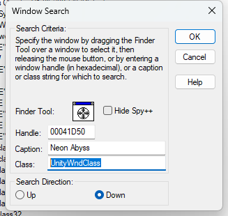

# Cheat Engine Notes
[TOC]

## 0x1. Cheater and C++

### 1. 获取进程信息

* 首先查找窗口，使用 spy++ 获取窗口标题和窗口类

  

* 使用 `FindWindow()` 函数获取对应窗口句柄

  ```c++
  HWND w = FindWindowA(getGameMainClass(), getGameName());
  ```

* 使用函数 `GetWindowThreadProcessId()` 根据窗口句柄获取进程ID

  ```c++
  DWORD processId;
  GetWindowThreadProcessId(w, &processId);
  ```

* 根据进程 ID 获取**进程句柄**

  ```c++
  ```

  

* 

## 0x2. CE Demo 第九关(共享代码块)

参考资料：
* [Auto Assemble文档](https://wiki.cheatengine.org/index.php?title=Cheat_Engine:Auto_Assembler)

应用场景：
* 比如在扣减血量的时候，我方和敌人扣减血量使用的是同一个函数，如果将扣减血量的指令 nop 掉之后，自己虽然不掉血了，但是敌人也不掉血了。因此在 patch 的时候需要进行判断扣减的对象。

在关键语句的修改脚本：

* 使用lua脚本的 `define` 函数来定义基址：`define(base,"Tutorial-i386.exe"+2566F0)`
* 在使用 `registersymbol` 函数将定义好的符号，可以让汇编代码进行识别，结束时候使用 `unregistersymbol` 函数解除符号。
* 可以使用 `label` 函数定义多个代码块地址。
* 所有代码从上往下执行，需要开发者定义好流程控制。


```lua
define(address,"Tutorial-i386.exe"+28E89)
define(bytes,89 43 04 D9 EE)
define(base,"Tutorial-i386.exe"+2566F0)

[ENABLE]
//code from here to '[DISABLE]' will be used to enable the cheat

assert(address,bytes)
alloc(newmem,$1000)

label(code)
label(return)
label(me)
label(enemy)
registersymbol(base)

newmem:
  //push eax
  mov eax, [base]
  cmp ebx, [eax+500]
  je enemy
  cmp ebx, [eax+504]
  je enemy
  jne me

enemy:
  mov eax, 0
  jmp code

me:
  mov eax, 459c4000

code:
  mov [ebx+04],eax
  fldz
  jmp return

address:
  jmp newmem
return:

[DISABLE]
//code from here till the end of the code will be used to disable the cheat
address:
  db bytes
  // mov [ebx+04],eax
  // fldz

dealloc(newmem)
UNREGISTERSYMBOL(base)

```