# Go advance

[TOC]

## 0x1 Memory Manage


The data and variables in program are allocated in virtual memory. The are two important area in memory: stack and heap. The parameters function called, return value and local variable are almost allocated in stack and those are managed by compiler.

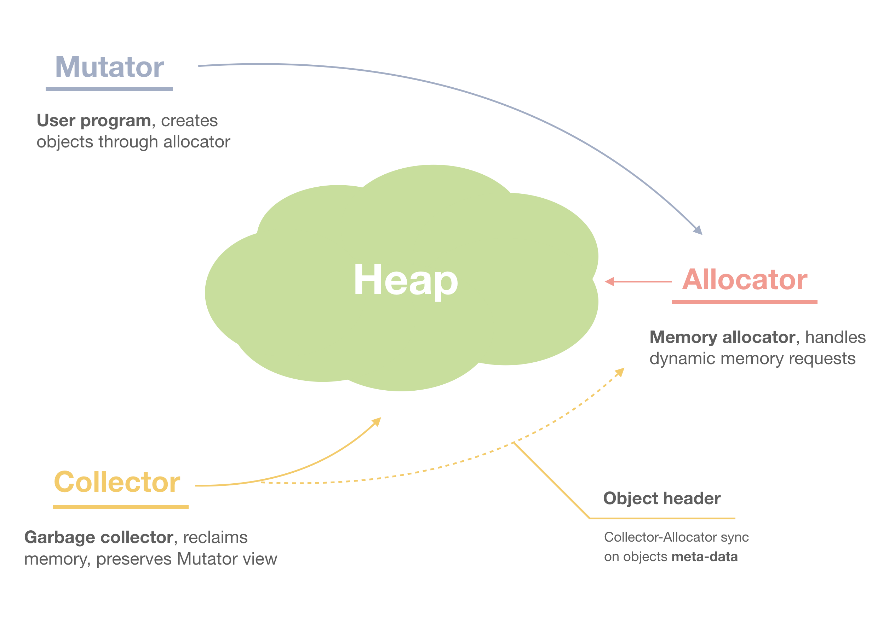

The memory manage in Golang contains three component: Mutator, Allocator and Collector. When the mutator applies for memory, it delegates this generic task to Allocator.

### 1. Memory Allocation

Reference:

1. [鹅厂后台大佬教你Go内存管理](https://mp.weixin.qq.com/s/56tth8PSquB1eR5-1XaDWA)
2. [白话Go语言内存管理三部曲（一）内存分配原理](https://zhuanlan.zhihu.com/p/225190602)
3. [Go 语言内存分配器的实现原理](https://draveness.me/golang/docs/part3-runtime/ch07-memory/golang-memory-allocator/)
4. [Go: Memory Management and Allocation](https://medium.com/a-journey-with-go/go-memory-management-and-allocation-a7396d430f44)
5. [TCMalloc : Thread-Caching Malloc](http://goog-perftools.sourceforge.net/doc/tcmalloc.html)

There are two ways of allocating: Sequential Allocator(Bump allocator) and Free-List Allocator.

#### 1.1 General allocation method

🔵 Bump Allocator

Bump allocating is an efficient method for memory allocation but has some limitations. We only need to maintain a pointer which point to a specific position in memory. The allocator only need to check remain free space and return the pointer in allocated memory area If user program applies for a memory to it.

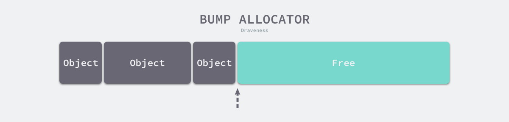

Although the bump allocator brings faster speed and lower complexity, it can't collect the memory which has been freed. As followed image, the allocator can't reuse the red part of memory immediately, because there is an object between red part and cyan part of memory and the bump allocator has ONLY one pointer.

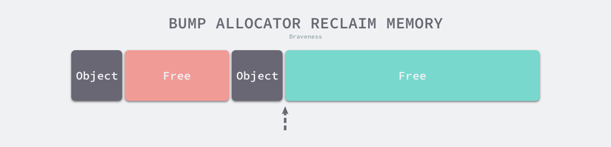

🔵 Free-List Allocator

Free-List Allocator can reuse memory which has been freed. It maintain a data structure like link list.

Free-List allocator will traverse freed chunk of memory if a user program applies for memory, find one big enough memory then request new resource and modify the link list.


There are four common allocation strategy:

1. First-Fit: Traverse from head of link list and select the first free chunk of memory whose size is greater than request memory.
2. Next-Fit: The traversal starts at the end of last traversal and select the first free chunk of memory whose size is greater than request memory.
3. Best-Fit: The traversal starts at the head of link list and select the **fittest** chunk of memory.
4. Segregate-Fit: Divide memory into multiple link lists those have same size of memory. When requesting memory, find a link list which meet the condition then select the appropriate chunk of memory.

The memory allocation strategy in Golang is similar with the fourth.


As shown in this image, Segregate-Fit strategy divide the memory into 4 linked list consisting of memory blocks of 4, 8, 16 and 32 bytes. When a user program requests an 8 bytes memory, the strategy will find the fittest linked list then find the free chunk of memory in this list. This strategy reduces the number of traversal and improves the efficiency of memory allocation.

#### 1.2 TCMalloc

The thought of memory allocation in Golang originates from TCMalloc(Thread-Cache Malloc) which Google designs for C. TCMalloc is faster than malloc in glibc 2.3 and also reduces lock contention for multi-thread programs. For small objects, there is virtually zero contention. For large objects, TCMalloc tries to use fine grained and efficient spinlocks.

|   Category   |    Size     |
| :----------: | :---------: |
| Micro Object |  (0, 16B)   |
| Small Object | [16B, 32KB] |
|  Big Object  | (32KB, +∞)  |


Thread cache belongs to every independent thread and it can meet almost memory allocation request for thread level. Since there are no multithreads involved, there are no mutex locks to protect memory which reduce the performance cost of lock contentions. When thread need bigger memory, the central  cache is used to solve this. Large objects are **directly** allocated from the central heap.

#### 1.3 allocation in Golang


When a go program launches, it will initialize whole part of **virtual memory** which contains three parts:

* **spans**: (512 MB)store pointers of memory manage unit `runtime.mspan`, and each unit of 8KB manages several page of memory space.
* **bitmap**: (16 GB)marks those addresses have stored objects,
* **arena**: (512GB)the real heap area. 8KB chunk of memory will be seen as a **page** which stores all the initialized objects in heap.

Three are 4 important components in memory allocator in Golang: Memory manage unit, thread cache, central cache and page head correspond to data struct `mspan`, `mcache`, `mcentral` and `mheap` respectively.

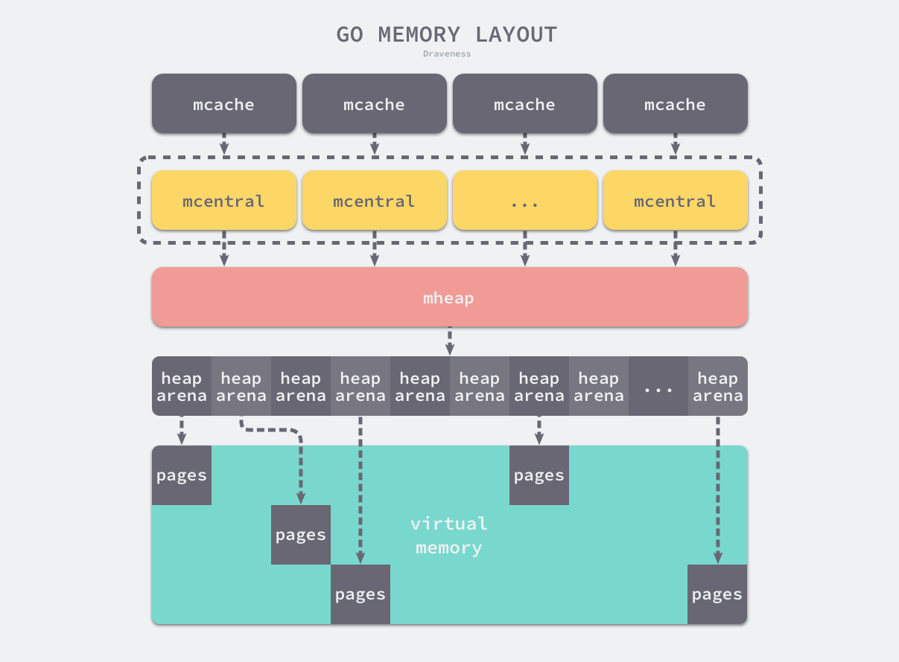

Go program initialize memory layout as shown in this image when launch. And every processor will allocate a thread cache( `runtime.mcache` ) to handle the allocation of micro and small objects and they possess the memory manage unit `runtime.mspan`.

🔵memory manage unit --- mspan

```go
type mspan struct {
    next *mspan     // next span in list, or nil if none
    prev *mspan     // previous span in list, or nil if none
    list *mSpanList

    startAddr uintptr // address of first byte of span aka s.base()
    npages    uintptr // number of pages in span

    manualFreeList gclinkptr // list of free objects in mSpanManual spans
    freeindex uintptr

    // Cache of the allocBits at freeindex. allocCache is shifted
    // such that the lowest bit corresponds to the bit freeindex.
    // allocCache holds the complement of allocBits, thus allowing
    // ctz (count trailing zero) to use it directly.
    // allocCache may contain bits beyond s.nelems; the caller must ignore
    // these.
    allocCache uint64

    allocBits  *gcBits
    gcmarkBits *gcBits
    // sweep generation:
    // if sweepgen == h->sweepgen - 2, the span needs sweeping
    // if sweepgen == h->sweepgen - 1, the span is currently being swept
    // if sweepgen == h->sweepgen, the span is swept and ready to use
    // if sweepgen == h->sweepgen + 1, the span was cached before sweep began and is still cached, and needs sweeping
    // if sweepgen == h->sweepgen + 3, the span was swept and then cached and is still cached
    // h->sweepgen is incremented by 2 after every GC
    sweepgen    uint32
    // ...
}
```

`mspan` has two fields: `next` and `prev` means `mspan` is doubly linked list. `mSpanList` stores the head and tail node of double linked list.

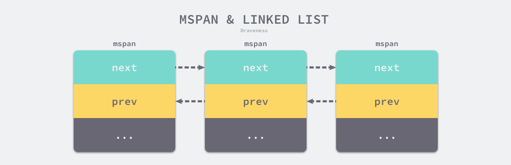

🔵 Thread Cache --- mcache

```go
type mcache struct {
   // The following members are accessed on every malloc,
   // so they are grouped here for better caching.
   nextSample uintptr // trigger heap sample after allocating this many bytes
   scanAlloc  uintptr // bytes of scannable heap allocated

   tiny       uintptr
   tinyoffset uintptr
   tinyAllocs uintptr

   // The rest is not accessed on every malloc.

   alloc [numSpanClasses]*mspan // spans to allocate from, indexed by spanClass

   stackcache [_NumStackOrders]stackfreelist

   // flushGen indicates the sweepgen during which this mcache
   // was last flushed. If flushGen != mheap_.sweepgen, the spans
   // in this mcache are stale and need to the flushed so they
   // can be swept. This is done in acquirep.
   flushGen uint32
}
```

Thread cache stores the micro objects of user program. Each thread cache has 68*2 `mspan`s stored in `alloc` field.

🔵Central Cache --- mcentral

```go
type mcentral struct {
   spanclass spanClass
   partial [2]spanSet // list of spans with a free object
   full    [2]spanSet // list of spans with no free objects
}
```

Different with thread cache, accessing mspan in central cache needs mutex.

🔵Page Heap --- mheap

```go
type mheap struct {
    // lock must only be acquired on the system stack, otherwise a g
    // could self-deadlock if its stack grows with the lock held.
    lock  mutex
    pages pageAlloc // page allocation data structure

    sweepgen uint32 // sweep generation, see comment in mspan; written during STW

    allspans []*mspan // all spans out there

    pagesInUse         atomic.Uint64 // pages of spans in stats mSpanInUse
    pagesSwept         atomic.Uint64 // pages swept this cycle
    pagesSweptBasis    atomic.Uint64 // pagesSwept to use as the origin of the sweep ratio
    sweepHeapLiveBasis uint64        // value of gcController.heapLive to use as the origin of sweep ratio; written with lock, read without
    sweepPagesPerByte  float64       // proportional sweep ratio; written with lock, read 
    scavengeGoal uint64
    reclaimIndex atomic.Uint64
    reclaimCredit atomic.Uintptr
    arenas [1 << arenaL1Bits]*[1 << arenaL2Bits]*heapArena

    // heapArenaAlloc is pre-reserved space for allocating heapArena
    // objects. This is only used on 32-bit, where we pre-reserve
    // this space to avoid interleaving it with the heap itself.
    heapArenaAlloc linearAlloc

    // arenaHints is a list of addresses at which to attempt to
    // add more heap arenas. This is initially populated with a
    // set of general hint addresses, and grown with the bounds of
    // actual heap arena ranges.
    arenaHints *arenaHint

    // arena is a pre-reserved space for allocating heap arenas
    // (the actual arenas). This is only used on 32-bit.
    arena linearAlloc

    allArenas []arenaIdx

    sweepArenas []arenaIdx

    markArenas []arenaIdx

    curArena struct {
        base, end uintptr
    }

    _ uint32 // ensure 64-bit alignment of central

    central [numSpanClasses]struct {
        mcentral mcentral
        pad      [cpu.CacheLinePadSize - unsafe.Sizeof(mcentral{})%cpu.CacheLinePadSize]byte
    }

    spanalloc             fixalloc // allocator for span*
    cachealloc            fixalloc // allocator for mcache*
    specialfinalizeralloc fixalloc // allocator for specialfinalizer*
    specialprofilealloc   fixalloc // allocator for specialprofile*
    specialReachableAlloc fixalloc // allocator for specialReachable
    speciallock           mutex    // lock for special record allocators.
    arenaHintAlloc        fixalloc // allocator for arenaHints

    unused *specialfinalizer // never set, just here to force the specialfinalizer type into DWARF
}
```

Page heap is core structure of memory allocation

### 2. Stack Memory


### 3. Garbage Collection

## 0x2. Closure

Closure = Function + Environment. Environment means that some variable define outside this function but used within this function. Even when the function is invoked outside their scope.

🔵Case 1:

```go
func C() func() int {
   c := 1
   return func() int {
      return c
   }
}

func TestA(t *testing.T) {
   fc1 := C()
   fc2 := C()
   // 0x1036bc0, 0x1036ba0
   fmt.Printf("%p, %p\n", fc1, fc2)
}
```

In function `C()` it returns a closure with captured value `c`. When invokes `C()` it will create a variable of type `funcValue` in heap, and there have two closures. So the address of return value `C()` is different.

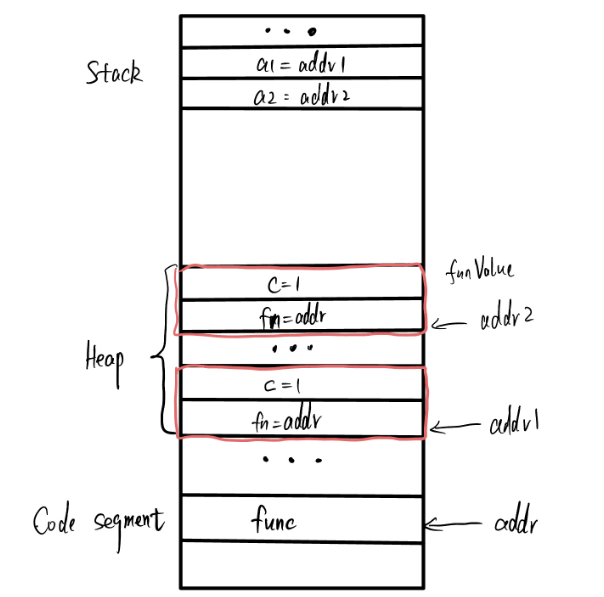

🔵Case 2:

```go
func A() func() {
   return func() {
      log.Printf("OK")
   }
}

func TestA(t *testing.T) {
   a1 := A
   a2 := A
   // 0x1036a40, 0x1036a40
   fmt.Printf("%p, %p\n", a1, a2)
}
```

But in this case, `A()` function has no capture value and go complier optimizes for this case and reuse the address after create first instance.

🔵Case 3:

```go
func D() (fs [2]func()) {
   for i := 0; i < 2; i++ {
      fs[i] = func() {
         fmt.Printf("%v ", i)
      }
   }
   return
}

func TestD(t *testing.T) {
   fs := D()
   fs[0]()
   fs[1]()
   // 2 2
}
```

if multi closures write one same variable, the variable will be allocated in **heap**. So when these closure are created their captured value point to same address, and they output same value. In this case it is also call variable escape.

## 0x3 defer panic recover

### 1. defer

for a function:

```go
func A() {
    defer B()
}
```

This is equivalent to:

```go
func A() {
    r = deferproc(8, B)
    // ...
    runtime.deferreturn()
}
```

Compiler will register defer function first then call it before return.

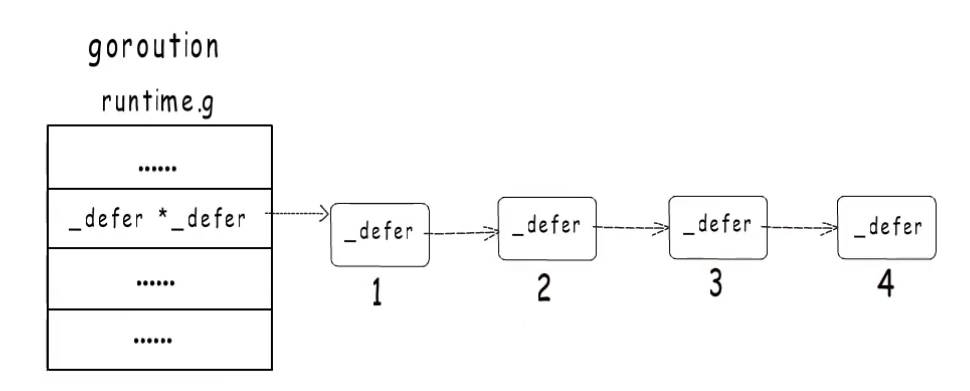

defer will be register like a linked list, so defer functions will be called in reverse order.

```go
func TestA(t *testing.T) {
    a, b := 1, 2
    defer func(a int) {
        fmt.Printf("%v\n", a)
    }(a)

    a += b
    fmt.Printf("%v - %v\n", a, b)
    // 3 - 2
    // 1
}
```

defer + closure:

```go
func TestB(t *testing.T) {
    a, b := 1, 2
    defer func() {
        fmt.Printf("%v\n", a)
    }()

    a += b
    fmt.Printf("%v - %v\n", a, b)
    // 3 - 2
    // 3
}
```

### 2. panic

## 0x4 type

### 1. type and alias

```go
type mytype int32		// type
type myalias = int32	// alias
```

### 2. interface

### 3. assertion

### 4. reflect

## 0x5 GMP

参考：

* 文章：[Golang GMP 原理-小徐先生](https://mp.weixin.qq.com/s/jIWe3nMP6yiuXeBQgmePDg)
* 视频：[BV1hv411x7we](https://www.bilibili.com/video/BV1hv411x7we)

### 1. 协程、线程和 goroutine

又称为用户级线程，和内核级线程为 M：1的映射关系，创建销毁调度都是在用户态完成，如果一个协程阻塞就会导致同一个线程下所有协程无法执行，并且无法并行。

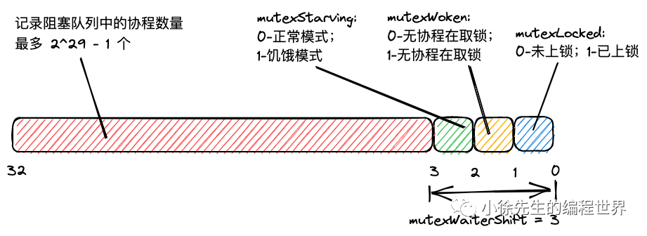

goroutine 是优化后的特殊协程，和内核级线程的映射关系为 M:N，多个 goroutine 可以实现并行，由于调度器的存在可以实现和线程之间的动态绑定和灵活调度，栈的空间可以动态扩展。

### 2. GMP 模型

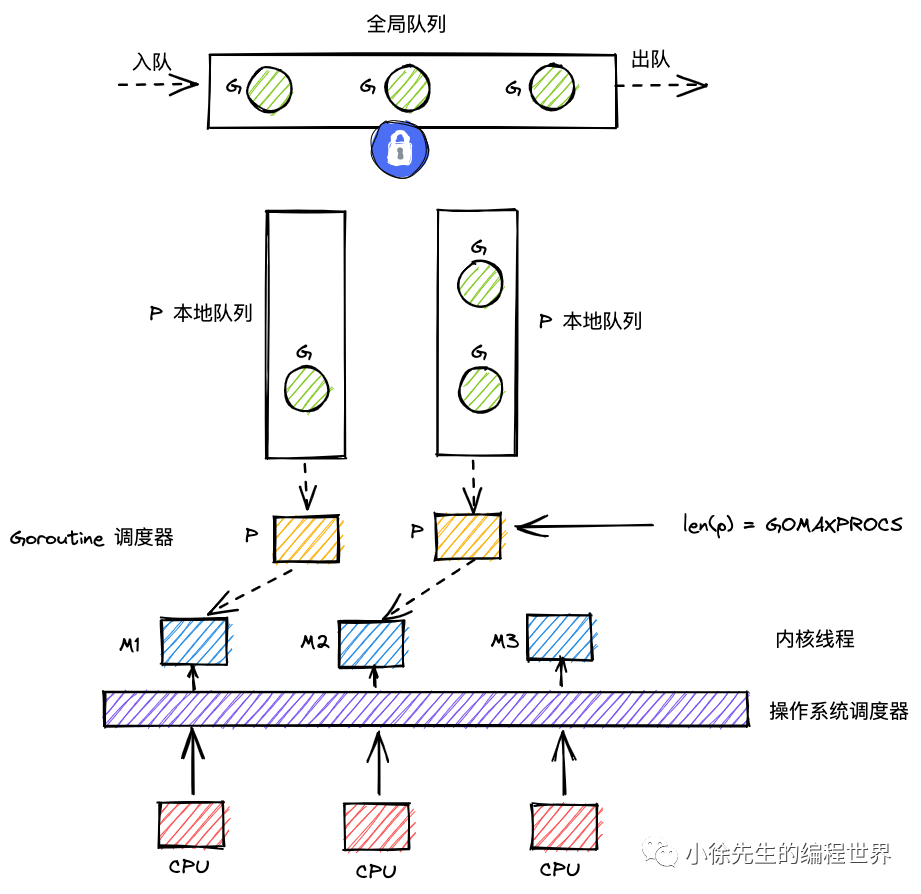

gmp = goroutine + machine + processor，其中 p 相当于调度器，用于协调 g 和 m 之间的关系。

对于每个 P 来说都有一个本地队列，可以实现一个轻量级锁的情况，因此在执行每个 goroutine 效率较高，当 p 的本地队列执行完的时候，会从全局队列中拿取 goroutine 来进行执行，由于多个 p 拿取因此需要进行加锁互斥访问，也有可能从别的 p 队列中偷一些 goroutine 来执行，不过情况发生较少。

go 语言中协程对应的数据结构是 `runtime.g`，工作线程对应的数据结构是 `runtime.m`。其中全局变量 `g0` 对应的就是主协程，他的协程栈式再主线程栈上分配的，全局变量 `m0` 就是主线程对应的 `m`，`g0` 和 `m0` 互相持有对方的指针，`allg` 对应所有的 `g`， `allm` 对应所有的 `m`。

goroutine 生命周期：

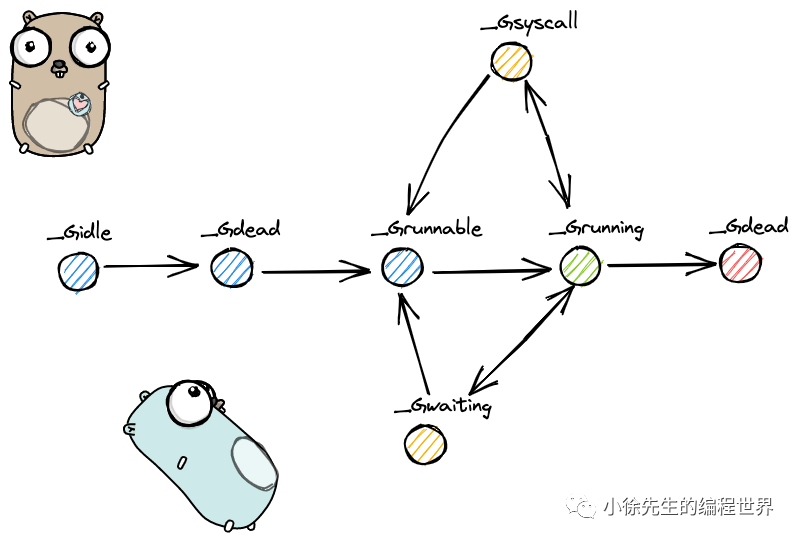

### 3. g

g 分为两种：g0 和普通的 g，g0是一类特殊的调度协程，不用于执行用户函数，负责执行 g 之间的切换调度，和 m 的关系是 1:1；另一种就是普通的 g。

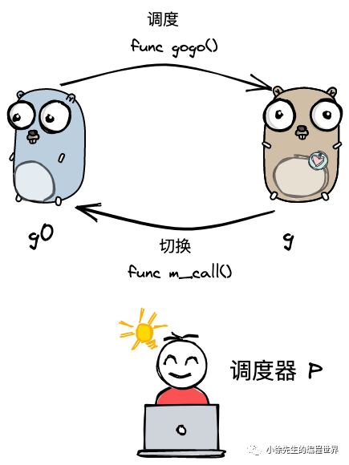

🔵g0的四种调度类型：

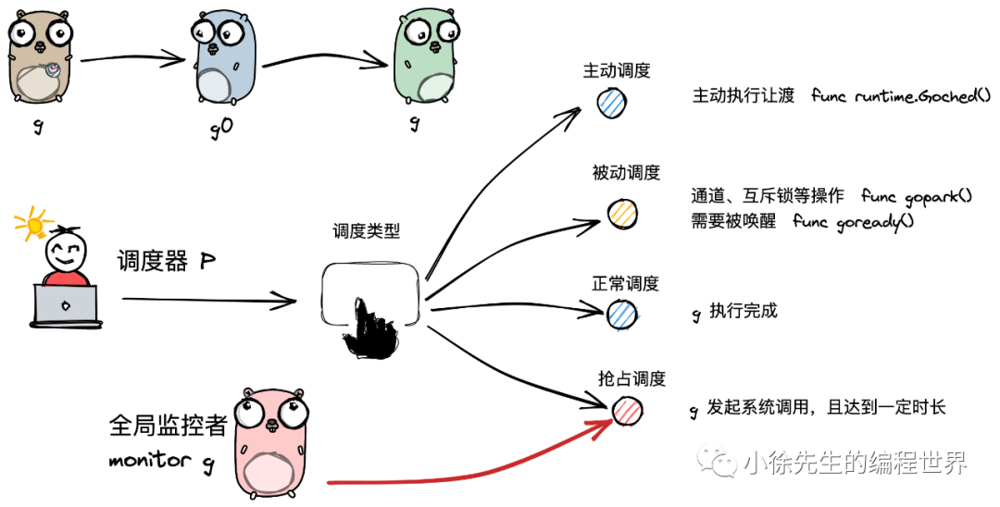

* 主动让出：用于用户在执行代码中调用 `runtime.Gosched()` 方法主动让出执行权，或者使用 `runtime.Goexit()` 主动退出线程：

  ```go
  func a() {
  	for i := 1; i < 10; i++ {
  		fmt.Println("A:", i)
  	}
  }
  
  func b() {
  	for i := 1; i < 10; i++ {
  		fmt.Println("B:", i)
  		//time.Sleep(time.Millisecond)
  		if i == 5 {
  			runtime.Gosched()
  		}
  	}
  }
  
  func main() {
  	runtime.GOMAXPROCS(1)
  	go a()
  	go b()
  	time.Sleep(time.Second)
  }
  ```

* 被动调度：在通道或者互斥锁操作阻塞的时候会 `gopark()` 调度给其他 goroutine，`goready()` 来唤醒

* 正常调度：该 goroutine 正常执行完毕，进入销毁流程。

* 抢占调度：发起**系统调用**。

调度流程：

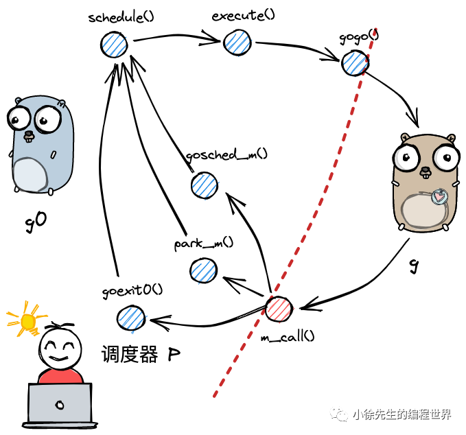

```go
// runtime/proc.go
func schedule() {
    // ...
    gp, inheritTime, tryWakeP := findRunnable() // blocks until work is available
    // ....
    execute(gp, inheritTime)
}
```

1. 首先从 `findRunnable` 找到可以调度的 goroutine，从全局队列和本地队列中拿取 goroutine

   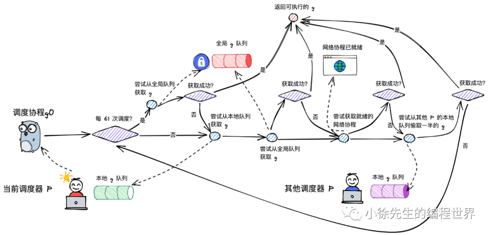

2. `execute()` 函数将对应协程状态从 runnable 转为 running 状态。

3. 执行 `gogo()` 方法

🔵 Gosched 主动调度流程

* 调用 `mcall` 方法将执行权交给 g0
* 首先将当前协程的状态从 running 转为 runnable
* 将当前的 g 和 m 进行解绑操作
* 在将当前的 g 添加的全局队列中

🔵 被动调度流程

* 当遇到锁阻塞的时候，状态由 running 更新为 waiting
* 解绑 g 和 m
* 开启新一轮调度

🔵 抢占调度

由全局监控 goroutine 来处理，一下情况会进行抢占调度：

* 执行系统调用超过 10ms
* p 本地队列中由待执行的 g
* 当前没有空闲的 p 和 m