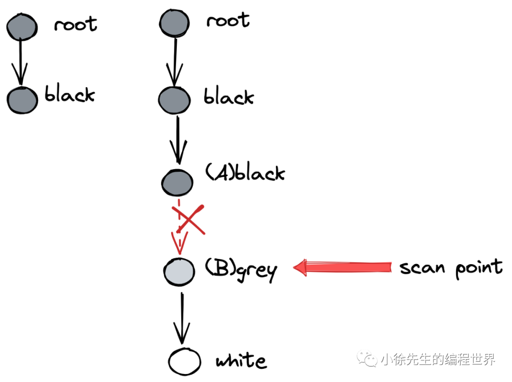
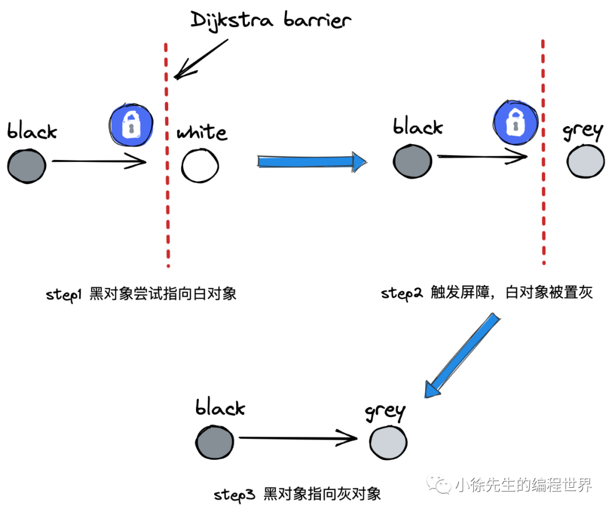
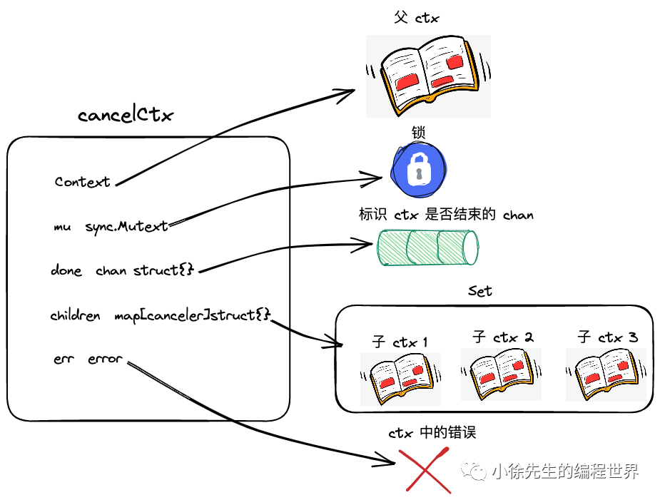
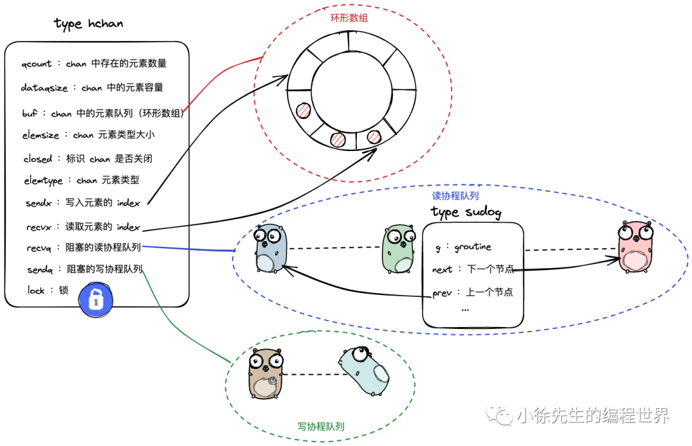
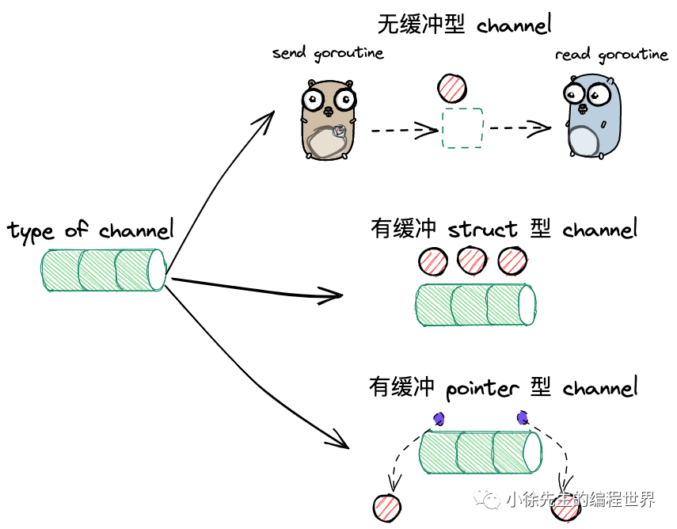
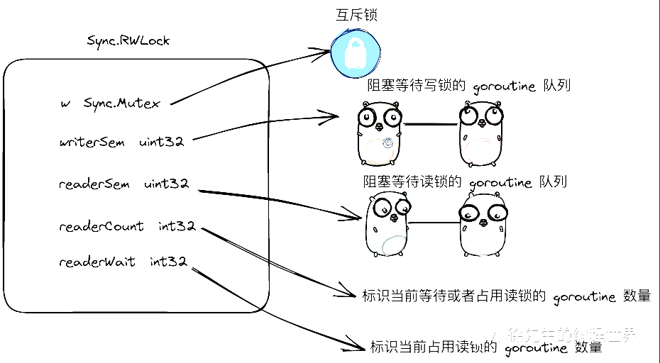
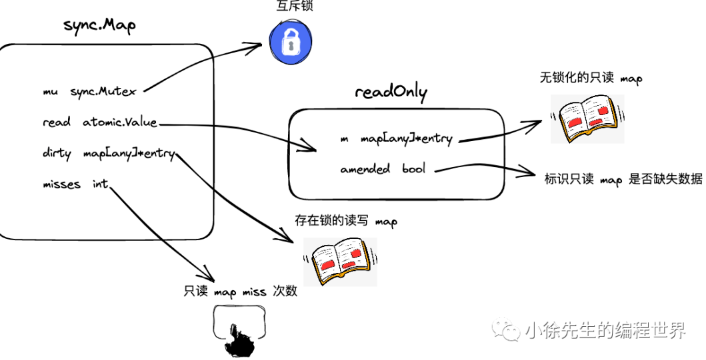
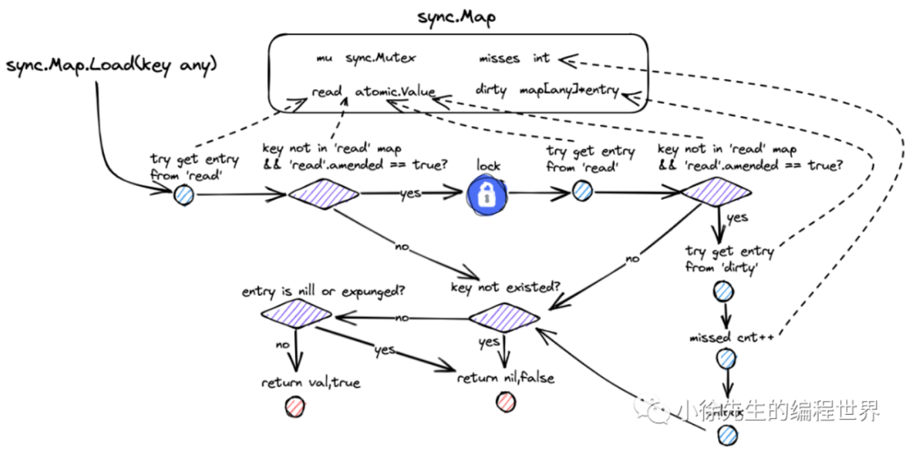
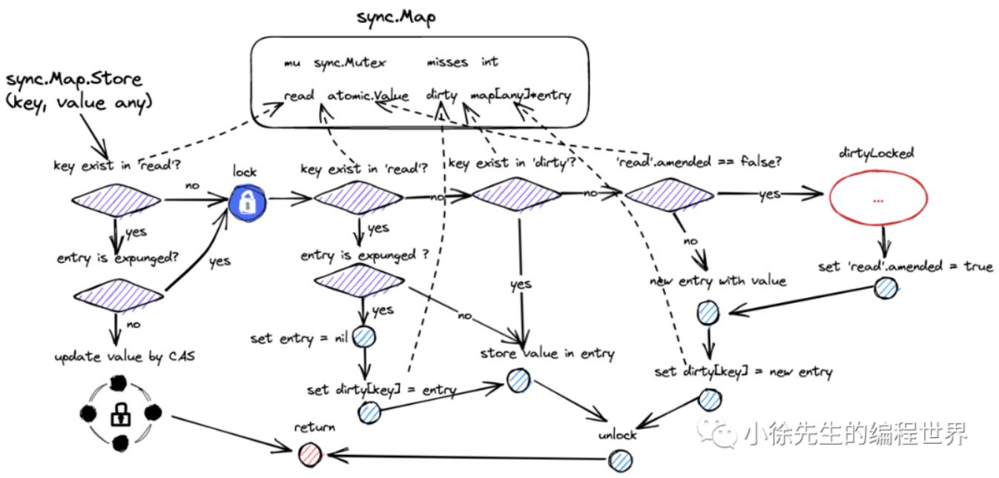

# Go advance

[TOC]

## 0x1 Memory Manage


The data and variables in program are allocated in virtual memory. The are two important area in memory: stack and heap. The parameters function called, return value and local variable are almost allocated in stack and those are managed by compiler.


The memory manage in Golang contains three component: Mutator, Allocator and Collector. When the mutator applies for memory, it delegates this generic task to Allocator.

### 1. Memory Allocation

Reference:

1. [鹅厂后台大佬教你Go内存管理](https://mp.weixin.qq.com/s/56tth8PSquB1eR5-1XaDWA)
2. [白话Go语言内存管理三部曲（一）内存分配原理](https://zhuanlan.zhihu.com/p/225190602)
3. [Go 语言内存分配器的实现原理](https://draveness.me/golang/docs/part3-runtime/ch07-memory/golang-memory-allocator/)
4. [Go: Memory Management and Allocation](https://medium.com/a-journey-with-go/go-memory-management-and-allocation-a7396d430f44)
5. [TCMalloc : Thread-Caching Malloc](http://goog-perftools.sourceforge.net/doc/tcmalloc.html)

There are two ways of allocating: Sequential Allocator(Bump allocator) and Free-List Allocator.

#### 1.1 General allocation method

🔵 Bump Allocator

Bump allocating is an efficient method for memory allocation but has some limitations. We only need to maintain a pointer which point to a specific position in memory. The allocator only need to check remain free space and return the pointer in allocated memory area If user program applies for a memory to it.


Although the bump allocator brings faster speed and lower complexity, it can't collect the memory which has been freed. As followed image, the allocator can't reuse the red part of memory immediately, because there is an object between red part and cyan part of memory and the bump allocator has ONLY one pointer.


🔵 Free-List Allocator

Free-List Allocator can reuse memory which has been freed. It maintain a data structure like link list.

Free-List allocator will traverse freed chunk of memory if a user program applies for memory, find one big enough memory then request new resource and modify the link list.


There are four common allocation strategy:

1. First-Fit: Traverse from head of link list and select the first free chunk of memory whose size is greater than request memory.
2. Next-Fit: The traversal starts at the end of last traversal and select the first free chunk of memory whose size is greater than request memory.
3. Best-Fit: The traversal starts at the head of link list and select the **fittest** chunk of memory.
4. Segregate-Fit: Divide memory into multiple link lists those have same size of memory. When requesting memory, find a link list which meet the condition then select the appropriate chunk of memory.

The memory allocation strategy in Golang is similar with the fourth.


As shown in this image, Segregate-Fit strategy divide the memory into 4 linked list consisting of memory blocks of 4, 8, 16 and 32 bytes. When a user program requests an 8 bytes memory, the strategy will find the fittest linked list then find the free chunk of memory in this list. This strategy reduces the number of traversal and improves the efficiency of memory allocation.

#### 1.2 TCMalloc

The thought of memory allocation in Golang originates from TCMalloc(Thread-Cache Malloc) which Google designs for C. TCMalloc is faster than malloc in glibc 2.3 and also reduces lock contention for multi-thread programs. For small objects, there is virtually zero contention. For large objects, TCMalloc tries to use fine grained and efficient spinlocks.

|   Category   |    Size     |
| :----------: | :---------: |
| Micro Object |  (0, 16B)   |
| Small Object | [16B, 32KB] |
|  Big Object  | (32KB, +∞)  |


Thread cache belongs to every independent thread and it can meet almost memory allocation request for thread level. Since there are no multithreads involved, there are no mutex locks to protect memory which reduce the performance cost of lock contentions. When thread need bigger memory, the central  cache is used to solve this. Large objects are **directly** allocated from the central heap.

#### 1.3 allocation in Golang


When a go program launches, it will initialize whole part of **virtual memory** which contains three parts:

* **spans**: (512 MB)store pointers of memory manage unit `runtime.mspan`, and each unit of 8KB manages several page of memory space.
* **bitmap**: (16 GB)marks those addresses have stored objects,
* **arena**: (512GB)the real heap area. 8KB chunk of memory will be seen as a **page** which stores all the initialized objects in heap.

Three are 4 important components in memory allocator in Golang: Memory manage unit, thread cache, central cache and page head correspond to data struct `mspan`, `mcache`, `mcentral` and `mheap` respectively.


Go program initialize memory layout as shown in this image when launch. And every processor will allocate a thread cache( `runtime.mcache` ) to handle the allocation of micro and small objects and they possess the memory manage unit `runtime.mspan`.

🔵memory manage unit --- mspan

```go
type mspan struct {
    next *mspan     // next span in list, or nil if none
    prev *mspan     // previous span in list, or nil if none
    list *mSpanList

    startAddr uintptr // address of first byte of span aka s.base()
    npages    uintptr // number of pages in span

    manualFreeList gclinkptr // list of free objects in mSpanManual spans
    freeindex uintptr

    // Cache of the allocBits at freeindex. allocCache is shifted
    // such that the lowest bit corresponds to the bit freeindex.
    // allocCache holds the complement of allocBits, thus allowing
    // ctz (count trailing zero) to use it directly.
    // allocCache may contain bits beyond s.nelems; the caller must ignore
    // these.
    allocCache uint64

    allocBits  *gcBits
    gcmarkBits *gcBits
    // sweep generation:
    // if sweepgen == h->sweepgen - 2, the span needs sweeping
    // if sweepgen == h->sweepgen - 1, the span is currently being swept
    // if sweepgen == h->sweepgen, the span is swept and ready to use
    // if sweepgen == h->sweepgen + 1, the span was cached before sweep began and is still cached, and needs sweeping
    // if sweepgen == h->sweepgen + 3, the span was swept and then cached and is still cached
    // h->sweepgen is incremented by 2 after every GC
    sweepgen    uint32
    // ...
}
```

`mspan` has two fields: `next` and `prev` means `mspan` is doubly linked list. `mSpanList` stores the head and tail node of double linked list.


🔵 Thread Cache --- mcache

```go
type mcache struct {
   // The following members are accessed on every malloc,
   // so they are grouped here for better caching.
   nextSample uintptr // trigger heap sample after allocating this many bytes
   scanAlloc  uintptr // bytes of scannable heap allocated

   tiny       uintptr
   tinyoffset uintptr
   tinyAllocs uintptr

   // The rest is not accessed on every malloc.

   alloc [numSpanClasses]*mspan // spans to allocate from, indexed by spanClass

   stackcache [_NumStackOrders]stackfreelist

   // flushGen indicates the sweepgen during which this mcache
   // was last flushed. If flushGen != mheap_.sweepgen, the spans
   // in this mcache are stale and need to the flushed so they
   // can be swept. This is done in acquirep.
   flushGen uint32
}
```

Thread cache stores the micro objects of user program. Each thread cache has 68*2 `mspan`s stored in `alloc` field.

🔵Central Cache --- mcentral

```go
type mcentral struct {
   spanclass spanClass
   partial [2]spanSet // list of spans with a free object
   full    [2]spanSet // list of spans with no free objects
}
```

Different with thread cache, accessing mspan in central cache needs mutex.

🔵Page Heap --- mheap

```go
type mheap struct {
    // lock must only be acquired on the system stack, otherwise a g
    // could self-deadlock if its stack grows with the lock held.
    lock  mutex
    pages pageAlloc // page allocation data structure

    sweepgen uint32 // sweep generation, see comment in mspan; written during STW

    allspans []*mspan // all spans out there

    pagesInUse         atomic.Uint64 // pages of spans in stats mSpanInUse
    pagesSwept         atomic.Uint64 // pages swept this cycle
    pagesSweptBasis    atomic.Uint64 // pagesSwept to use as the origin of the sweep ratio
    sweepHeapLiveBasis uint64        // value of gcController.heapLive to use as the origin of sweep ratio; written with lock, read without
    sweepPagesPerByte  float64       // proportional sweep ratio; written with lock, read 
    scavengeGoal uint64
    reclaimIndex atomic.Uint64
    reclaimCredit atomic.Uintptr
    arenas [1 << arenaL1Bits]*[1 << arenaL2Bits]*heapArena

    // heapArenaAlloc is pre-reserved space for allocating heapArena
    // objects. This is only used on 32-bit, where we pre-reserve
    // this space to avoid interleaving it with the heap itself.
    heapArenaAlloc linearAlloc

    // arenaHints is a list of addresses at which to attempt to
    // add more heap arenas. This is initially populated with a
    // set of general hint addresses, and grown with the bounds of
    // actual heap arena ranges.
    arenaHints *arenaHint

    // arena is a pre-reserved space for allocating heap arenas
    // (the actual arenas). This is only used on 32-bit.
    arena linearAlloc

    allArenas []arenaIdx

    sweepArenas []arenaIdx

    markArenas []arenaIdx

    curArena struct {
        base, end uintptr
    }

    _ uint32 // ensure 64-bit alignment of central

    central [numSpanClasses]struct {
        mcentral mcentral
        pad      [cpu.CacheLinePadSize - unsafe.Sizeof(mcentral{})%cpu.CacheLinePadSize]byte
    }

    spanalloc             fixalloc // allocator for span*
    cachealloc            fixalloc // allocator for mcache*
    specialfinalizeralloc fixalloc // allocator for specialfinalizer*
    specialprofilealloc   fixalloc // allocator for specialprofile*
    specialReachableAlloc fixalloc // allocator for specialReachable
    speciallock           mutex    // lock for special record allocators.
    arenaHintAlloc        fixalloc // allocator for arenaHints

    unused *specialfinalizer // never set, just here to force the specialfinalizer type into DWARF
}
```

Page heap is core structure of memory allocation

### 2. Stack Memory


### 3. Garbage Collection

链接：[Golang 垃圾回收原理分析](https://mp.weixin.qq.com/s/TdekaMjlf_kk_ReyPvoXiQ)

Golang 中的垃圾回收是由三色标记发 + 混合写屏障机制实现的。

三色标记法，对象分为三种颜色标记：黑、灰、白：

- 黑对象代表，对象自身存活，且其指向对象都已标记完成
- 灰对象代表，对象自身存活，但其指向对象还未标记完成
- 白对象代表，对象尙未被标记到，可能是垃圾对象

回收的时候是通过并发线程进行回收的，正式因为并发运行，所以在垃圾回收的时候可能会存在漏标问题和多标问题。

* 漏标问题：

  漏标问题即：在 GC 协程并发场景下，存活对象未被标记但是被误删的情况。

  - moment1：GC协程下，对象A被扫描完成，置黑；此时对象B是灰色，还未完成扫描
  - momen2：用户协程下，对象A建立指向对象C的引用
  - moment3：用户协程下，对象B删除指向对象C的引用
  - moment4：GC协程下，开始执行对对象B的扫描

  

* 多标问题：

  - 条件：初始时刻，对象A持有对象B的引用
  - moment1：GC协程下，对象A被扫描完成，置黑；对象B被对象A引用，因此被置灰
  - momen2：用户协程下，对象A删除指向对象B的引用

  

  其导致本该被删但仍侥幸存活的对象被称为“浮动垃圾”，至多到下一轮GC，这部分对象就会被GC回收，因此错误可以得到弥补.

golang 中使用屏障机制来进行实现。

🔵屏障机制

* 强弱三色不等式：

  强三色不等式：白色对象不能被黑色对象直接引用

  弱三色不等式：白色对象可以被黑色对象引用，但是要从某个灰对象触发仍然可达该白对象。

* 插入写屏障

  

  写屏障是实现强三色不等式，保证黑色对象指向白色对象时候会触发屏障将白色对象置为灰色，再建立引用

* 删除写屏障

  删除写屏障是用于实现弱三色不等式，当白色对象被上有删除引用前，会触发屏障置灰

🔵 混合写屏障

插入写屏障和删除写屏障都可以解决漏标问题。

由于对于栈对象涉及频繁的轻量操作，如果对于这种高频操作都要触发屏障机制的话成本无法接收，因此需要设定屏障机制**无法作用栈对象**。

为了消除这个额外的 STW 成本，Golang 1.8 引入了混合写屏障机制，可以视为糅合了插入写屏障+删除写屏障的加强版本，要点如下：

- • GC 开始前，以栈为单位分批扫描，将栈中所有对象置黑
- • GC 期间，栈上新创建对象直接置黑
- • 堆对象正常启用插入写屏障
- • 堆对象正常启用删除写屏障

## 0x2. Closure

Closure = Function + Environment. Environment means that some variable define outside this function but used within this function. Even when the function is invoked outside their scope.

🔵Case 1:

```go
func C() func() int {
   c := 1
   return func() int {
      return c
   }
}

func TestA(t *testing.T) {
   fc1 := C()
   fc2 := C()
   // 0x1036bc0, 0x1036ba0
   fmt.Printf("%p, %p\n", fc1, fc2)
}
```

In function `C()` it returns a closure with captured value `c`. When invokes `C()` it will create a variable of type `funcValue` in heap, and there have two closures. So the address of return value `C()` is different.


🔵Case 2:

```go
func A() func() {
   return func() {
      log.Printf("OK")
   }
}

func TestA(t *testing.T) {
   a1 := A
   a2 := A
   // 0x1036a40, 0x1036a40
   fmt.Printf("%p, %p\n", a1, a2)
}
```

But in this case, `A()` function has no capture value and go complier optimizes for this case and reuse the address after create first instance.

🔵Case 3:

```go
func D() (fs [2]func()) {
   for i := 0; i < 2; i++ {
      fs[i] = func() {
         fmt.Printf("%v ", i)
      }
   }
   return
}

func TestD(t *testing.T) {
   fs := D()
   fs[0]()
   fs[1]()
   // 2 2
}
```

if multi closures write one same variable, the variable will be allocated in **heap**. So when these closure are created their captured value point to same address, and they output same value. In this case it is also call variable escape.

## 0x3 defer panic recover

### 1. defer

for a function:

```go
func A() {
    defer B()
}
```

This is equivalent to:

```go
func A() {
    r = deferproc(8, B)
    // ...
    runtime.deferreturn()
}
```

Compiler will register defer function first then call it before return.


defer will be register like a linked list, so defer functions will be called in reverse order.

```go
func TestA(t *testing.T) {
    a, b := 1, 2
    defer func(a int) {
        fmt.Printf("%v\n", a)
    }(a)

    a += b
    fmt.Printf("%v - %v\n", a, b)
    // 3 - 2
    // 1
}
```

defer + closure:

```go
func TestB(t *testing.T) {
    a, b := 1, 2
    defer func() {
        fmt.Printf("%v\n", a)
    }()

    a += b
    fmt.Printf("%v - %v\n", a, b)
    // 3 - 2
    // 3
}
```

### 2. panic

## 0x4 type

### 1. type and alias

```go
type mytype int32		// type
type myalias = int32	// alias
```

### 2. interface

### 3. assertion

### 4. reflect

## 0x5 Context

概念：context 从字面意思上说就是上下文的概念，用于保存并发时候调用链路上下文信息，以一种优雅的形式实现并发协调和 goroutine 的生命周期控制，可以用来防止协程泄漏的情况。

怎么实现生命周期控制的：使用一种树形结构来管理协程之间的父子关系，通过生命周期终止事件单向传递来管理父子协程的生命周期。（当父节点生命周期终止后，其所有子节点也都会收到生命周期终止的信号）

### 1. 数据结构


```go
type Context interface {
    Deadline() (deadline time.Time, ok bool)
    Done() <-chan struct{}
    Err() error
    Value(key any) any
}
```

* `Deadline()` 方法用于返回 context 上下文的过期信息
* `Done()` 方法返回的是一个只读的承载空结构体的 channel，表示只发送信号，不做数据存储
* `Err()` 方法用来返回错误，通常只有两种错误，一种是手动取消，一种是过期错误
* `Value()` 方法用于根据 key 来找到对应的 value

---

### 2. Context 类型

* emptyCtx

  context 包中提供了两种最顶级的 context，`Background()` 和 `TODO()`：

  ```go
  var (
  	background = new(emptyCtx)
  	todo       = new(emptyCtx)
  )
  
  // Background returns a non-nil, empty Context. It is never canceled, has no
  // values, and has no deadline. It is typically used by the main function,
  // initialization, and tests, and as the top-level Context for incoming
  // requests.
  func Background() Context {
  	return background
  }
  
  // TODO returns a non-nil, empty Context. Code should use context.TODO when
  // it's unclear which Context to use or it is not yet available (because the
  // surrounding function has not yet been extended to accept a Context
  // parameter).
  func TODO() Context {
  	return todo
  }
  ```

  这两个 context 都是 `emptyCtx`，其用于不能被取消、没有任何值并且没有过期时间，目的是**用来创建其他 `context`**，如果尝试从 emptyCtx 中的 `Done()` channel 中读取信号的话会永远被阻塞。

* cancelCtx：

  cancelCtx 的数据结构：

  ```go
  type cancelCtx struct {
  	Context
  
  	mu       sync.Mutex            // protects following fields
  	done     atomic.Value          // of chan struct{}, created lazily, closed by first cancel call
  	children map[canceler]struct{} // set to nil by the first cancel call
  	err      error                 // set to non-nil by the first cancel call
  }
  ```

  

  * context 表示父 context
  * mu 表示访问互斥锁
  * done 的话表示一个 channel
  * children 的话是一个 `Canceler` 的 set，对于子 context 只需要关注其 cancel 方法和 Done

* timerContext

  其数据结构为：

  ```go
  type timerCtx struct {
  	cancelCtx
  	timer *time.Timer // Under cancelCtx.mu.
  
  	deadline time.Time
  }
  ```

  其包含 `cancelCtx`，在创建 timerCtx 会同时创建一个 cancelContext，表明其是一个 cancelContext

  其创建流程如下：

  1. 如果其过期时间要晚于父 context 的过期时间，那么就只创建 cancelContext
  2. 如果过期时间相对于当前时间已经过期，那么就直接调用 cancel 方法并且返回。
  3. 如果在当前时间之后，就开启一个定时器，到达过期时间自动调用 cancel 方法，返回过期错误。

  ```go
  func WithDeadline(parent Context, d time.Time) (Context, CancelFunc) {
  	if parent == nil {
  		panic("cannot create context from nil parent")
  	}
  	if cur, ok := parent.Deadline(); ok && cur.Before(d) {
  		// The current deadline is already sooner than the new one.
  		return WithCancel(parent)
  	}
  	c := &timerCtx{
  		cancelCtx: newCancelCtx(parent),
  		deadline:  d,
  	}
  	propagateCancel(parent, c)
  	dur := time.Until(d)
  	if dur <= 0 {
  		c.cancel(true, DeadlineExceeded) // deadline has already passed
  		return c, func() { c.cancel(false, Canceled) }
  	}
  	c.mu.Lock()
  	defer c.mu.Unlock()
  	if c.err == nil {
  		c.timer = time.AfterFunc(dur, func() {
  			c.cancel(true, DeadlineExceeded)
  		})
  	}
  	return c, func() { c.cancel(true, Canceled) }
  }
  ```

* valueContext

  其数据结构为：

  ```go
  type valueCtx struct {
  	Context
  	key, val any
  }
  ```

  查找 value 是一个有底向上查找的流程，在查找 key 对应的 value 时候，首先查看当前节点是否匹配，如果不匹配则从直接父节点中查找，一直找到根节点为止，找不到则返回 nil。

  如果这个链表里由多个相同的 key 的时候，则会找到和当前节点最近的节点。

### 3. context cancel流程

在创建一个 CancelContext 的时候，cancel 是以闭包函数的形式传给使用者：

```go
func WithCancel(parent Context) (ctx Context, cancel CancelFunc) {
	if parent == nil {
		panic("cannot create context from nil parent")
	}
	c := newCancelCtx(parent)
	propagateCancel(parent, &c)
	return &c, func() { c.cancel(true, Canceled) }
}
```

---

`propagateCancel()` 函数是用于构建父子 context 之间的终止事件的传播关系：

1. 在创建 context 的时候如果父 context 是 emptyCtx 则不需要建立 cancel 传播关系；如果父 context 已经关闭，则直接调用该 context 的 cancel 方法

   ```go
   done := parent.Done()
   if done == nil {
       return // parent is never canceled
   }
   
   select {
       case <-done:
           // parent is already canceled
           child.cancel(false, parent.Err())
           return
       default:
   }
   ```

2. 如果父 contex 是 cancelContext 则将自身添加到父 context 的 children 中

   ```go
   if p, ok := parentCancelCtx(parent); ok {
       p.mu.Lock()
       if p.err != nil {
           // parent has already been canceled
           child.cancel(false, p.err)
       } else {
           if p.children == nil {
               p.children = make(map[canceler]struct{})
           }
           p.children[child] = struct{}{}
       }
       p.mu.Unlock()
   }
   ```

3. 如果不是，则开启一个协程使用 select 来监听父子 context 的终止事件，如果父 context 关闭则关闭子 context

   ```go
   atomic.AddInt32(&goroutines, +1)
   go func() {
       select {
           case <-parent.Done():
           child.cancel(false, parent.Err())
           case <-child.Done():
           }
   }()
   ```

---

* `CancelContext` 的 cancel 流程：

  逐个遍历 children 并且调用子 context 的 cancel 方法，然后解除自己和父 context 的关系

  ```go
  func (c *cancelCtx) cancel(removeFromParent bool, err error) {
  	if err == nil {
  		panic("context: internal error: missing cancel error")
  	}
  	c.mu.Lock()
  	if c.err != nil {
  		c.mu.Unlock()
  		return // already canceled
  	}
  	c.err = err
  	d, _ := c.done.Load().(chan struct{})
  	if d == nil {
  		c.done.Store(closedchan)
  	} else {
  		close(d)
  	}
  	for child := range c.children {
  		// NOTE: acquiring the child's lock while holding parent's lock.
  		child.cancel(false, err)
  	}
  	c.children = nil
  	c.mu.Unlock()
  
  	if removeFromParent {
  		removeChild(c.Context, c)
  	}
  }
  ```

* `TimerContext` 的 cancel 流程：

  其创建的时候会创建一个父 context 为 cancelContext 的上下文，因此其首先会调用父 cancelContext 的cancel 方法，然后再解除自己和父 context 的关系并且暂停定时器

  ```go
  func (c *timerCtx) cancel(removeFromParent bool, err error) {
  	c.cancelCtx.cancel(false, err)
  	if removeFromParent {
  		// Remove this timerCtx from its parent cancelCtx's children.
  		removeChild(c.cancelCtx.Context, c)
  	}
  	c.mu.Lock()
  	if c.timer != nil {
  		c.timer.Stop()
  		c.timer = nil
  	}
  	c.mu.Unlock()
  }
  ```

## 0x6 Channel

[Golang Channel 实现原理](https://mp.weixin.qq.com/s/QgNndPgN1kqxWh-ijSofkw)

通过通信来实现共享数据结构而不是通过共享数据来完成通信，后者的话对于可以看到各个线程内的数据，线程之间的隔离性不好。

### 1. 数据结构

核心数据结构：是环形数组



* qcount，dataqsiz：元素数量和容量大小
* buf：环形数组
* sendx, recvx：环形数据的首位指针
* sendq, recvq：当数据填满后的阻塞读和阻塞写队列
* lock：锁

### 2. 创建 channel



创建 channel 时候会根据三种情况分别进行处理：

* 无缓冲类型：
* 有缓冲空结构体类型：
* 有缓冲指针类型：

创建 channel 的函数：

```go
func makechan(t *chantype, size int) *hchan {
   elem := t.elem

   // compiler checks this but be safe.
   if elem.size >= 1<<16 {
      throw("makechan: invalid channel element type")
   }
   if hchanSize%maxAlign != 0 || elem.align > maxAlign {
      throw("makechan: bad alignment")
   }

   mem, overflow := math.MulUintptr(elem.size, uintptr(size))
   if overflow || mem > maxAlloc-hchanSize || size < 0 {
      panic(plainError("makechan: size out of range"))
   }

   // Hchan does not contain pointers interesting for GC when elements stored in buf do not contain pointers.
   // buf points into the same allocation, elemtype is persistent.
   // SudoG's are referenced from their owning thread so they can't be collected.
   // TODO(dvyukov,rlh): Rethink when collector can move allocated objects.
   var c *hchan
   switch {
   case mem == 0:
      // Queue or element size is zero.
      c = (*hchan)(mallocgc(hchanSize, nil, true))
      // Race detector uses this location for synchronization.
      c.buf = c.raceaddr()
   case elem.ptrdata == 0:
      // Elements do not contain pointers.
      // Allocate hchan and buf in one call.
      c = (*hchan)(mallocgc(hchanSize+mem, nil, true))
      c.buf = add(unsafe.Pointer(c), hchanSize)
   default:
      // Elements contain pointers.
      c = new(hchan)
      c.buf = mallocgc(mem, elem, true)
   }

   c.elemsize = uint16(elem.size)
   c.elemtype = elem
   c.dataqsiz = uint(size)
   lockInit(&c.lock, lockRankHchan)

   if debugChan {
      print("makechan: chan=", c, "; elemsize=", elem.size, "; dataqsiz=", size, "\n")
   }
   return c
}
```

### 3. 写channel流程

写流程中可能会遇到**两种**异常：

* 向没有初始化的 channel 中写数据
* 向已经 close 的 channel 中写数据

写流程：

1. 检查 channel 是否为 nil 或者是否被关闭，空/被关闭就会抛出异常

2. （加锁保证线程安全）如果存在正在阻塞的读 goroutine 的话，直接将数据传给该读 goroutine，并且唤醒该 goroutine

   ```go
   if sg := c.recvq.dequeue(); sg != nil {
       // Found a waiting receiver. We pass the value we want to send
       // directly to the receiver, bypassing the channel buffer (if any).
       send(c, sg, ep, func() { unlock(&c.lock) }, 3)
       return true
   }
   ```

3. 如果没有阻塞读并且缓冲区仍有空间，则将数据写到缓冲区然后返回

4. 如果没有阻塞读并且缓冲区没有空间了，则将该 goroutine 加入到阻塞写协程队列中，然后 gopark 当前线程等待被唤醒

### 4. 读 channel 流程

读流程：

1. 检查 channel 是否初始化，如果未初始化则会报错

2. 检查 channel 是否已经关闭，如果已经关闭并且缓冲区没有数据则会返回对应数据类型的零值

   ```go
   data, ok := <- ch
   ```

   可以通过第二个返回值查看 channel 是否关闭，如果关闭 ok 为 false。

3. （加锁）读的时候有阻塞写 goroutine，读取队列中第一个数据，将写协程的数据填充到环形队列中然后唤醒这个 goroutine

4. 如果没有阻塞的写 goroutine 并且缓存区含有数据，读取队列中的元素并且调整队列指针

5. 如果没有阻塞写 goroutine 并且缓冲区为空，那么就会加入该 channel 的阻塞读协程队列尾部中

### 5. 阻塞和非阻塞模式

channel 在读和写都分有阻塞模式和非阻塞模式，当处于非阻塞模式的情况下，原先读和写阻塞操作就会直接返回 `false` 防止进行阻塞。

> 非阻塞模式即使用 `select` 进行处理 channel 数据。

channel 和 多路 io 复用 select，如何在 select 分支中选择其中一个 channel 不会真正阻塞其他的 channel？

* ```go
  func chansend(c *hchan, ep unsafe.Pointer, block bool, callerpc uintptr) bool {
      if c == nil {
          // 判断阻塞模式
          if !block {
              return false
          }
          gopark(nil, nil, waitReasonChanSendNilChan, traceEvGoStop, 2)
          throw("unreachable")
      }
      // ...
  }
  ```

  如果是在多路复用模式下，向 nil 的 channel 中写入数据会直接返回 false

  ```go
  func chanrecv(c *hchan, ep unsafe.Pointer, block bool) (selected, received bool) {
      // raceenabled: don't need to check ep, as it is always on the stack
      // or is new memory allocated by reflect.
  
      if c == nil {
          // 判断阻塞模式
          if !block {
              return
          }
          gopark(nil, nil, waitReasonChanReceiveNilChan, traceEvGoStop, 2)
          throw("unreachable")
      }
  }
  ```

  如果是在多路复用模式下，读取数据会直接返回，不会阻塞和报错。

### 6. 关闭 channel

使用内置函数 `close(ch)` 进行关闭，一个 channel 只能被关闭一次。

关闭流程：

1. 如果 channel 为 nil 或者已经关闭，则会 panic
2. 唤醒所有阻塞的读写 goroutine

在关闭 channel 的时候会唤醒此时所有读写channel的协程，写协程会panic，读不会。

防止二次关闭 channel 的方法：

1. 方式一：使用多路复用的方式，如果发送读取阻塞就会走 default 分支，然后关闭 channel；如果 channel 已经关闭那么从 channel 中读取不会进行阻塞。

   > 局限性就是需要保证调用当前函数只能由一个协程是发送 channel 的一方，否则会导致程序错误

   ```go
   select {
       case <- ch:
       	return
       default:
       	close(ch)
   }
   ```

2. 方式二：使用 `sync.Once` 来保证只能被关闭一次

   ```go
   type MyChan struct {
       sync.Once
       ch chan struct{}
   }
   
   func (m *MyChan) Close() {
       m.Do(func() {
           close(ch)
       })
   }
   ```


## 0x7 GMP

参考：

* 文章：[Golang GMP 原理-小徐先生](https://mp.weixin.qq.com/s/jIWe3nMP6yiuXeBQgmePDg)
* 视频：[BV1hv411x7we](https://www.bilibili.com/video/BV1hv411x7we)

### 1. 协程、线程和 goroutine

又称为用户级线程，和内核级线程为 M：1的映射关系，创建销毁调度都是在用户态完成，如果一个协程阻塞就会导致同一个线程下所有协程无法执行，并且无法并行。

goroutine 是优化后的特殊协程，和内核级线程的映射关系为 M:N，多个 goroutine 可以实现并行，由于调度器的存在可以实现和线程之间的动态绑定和灵活调度，栈的空间可以动态扩展。

### 2. GMP 模型


gmp = goroutine + machine + processor

* g：指的是 goroutine，一个 golang 协程
* m：指的是内核级线程
* p：指的是调度器，用于将 p 调度到 m 上进行执行，每个 p 都有一个本地队列，可以实现 g 和 m 的动态绑定

> P的数量由 `GOMAXPROCS` 决定

调度流程：

1. 首先 p 会首先从私有本地队列中取出 g 来进行调度执行，
2. 如果私有本地队列无任务，会从全局队列中获取任务
3. 如果本地队列和全局队列都没有，会从其他 p 的本地队列中窃取任务(Work Stealing)。

> 新创建的 g 会优先投递到当前 p 的本地队列中，满了就会加入全局队列。

goroutine 生命周期：


### 3. 核心数据结构

go 语言中协程对应的数据结构是 `runtime.g`，工作线程对应的数据结构是 `runtime.m`。其中全局变量 `g0` 对应的就是主协程，他的协程栈式再主线程栈上分配的，全局变量 `m0` 就是主线程对应的 `m`，`g0` 和 `m0` 互相持有对方的指针，`allg` 对应所有的 `g`， `allm` 对应所有的 `m`。

* g

  对应数据结构为：

  ```go
  type g struct {
      m 		*m
      sched 	gobuf
      // ...
  }
  
  type gobuf struct {
  	// The offsets of sp, pc, and g are known to (hard-coded in) libmach.
  	//
  	// ctxt is unusual with respect to GC: it may be a
  	// heap-allocated funcval, so GC needs to track it, but it
  	// needs to be set and cleared from assembly, where it's
  	// difficult to have write barriers. However, ctxt is really a
  	// saved, live register, and we only ever exchange it between
  	// the real register and the gobuf. Hence, we treat it as a
  	// root during stack scanning, which means assembly that saves
  	// and restores it doesn't need write barriers. It's still
  	// typed as a pointer so that any other writes from Go get
  	// write barriers.
  	sp   uintptr
  	pc   uintptr
  	g    guintptr
  	ctxt unsafe.Pointer
  	ret  uintptr
  	lr   uintptr
  	bp   uintptr // for framepointer-enabled architectures
  }
  ```

  每个 g 会绑定一个 m，sched 表示的是寄存器状态

* m

  ```go
  type m struct {
      g0 *g
      tls	[tlsSlots]unitptr // thread-local storage
  }
  ```

  g0 是特殊的调度协程，不执行用户函数，负责执行 g 之间的切换调度，和 m 的关系是 1：1

  

* p

  ```go
  type p struct {
      runq 		[256]guintptr
      runqhead 	uint32
      runqtail	uint32
      
      runnext		guintptr
  }
  ```

  runq 表示本地 goroutine 任务队列

* schedt 为全局队列

  ```go
  type schedt struct {
      // ...
      lock mutex
      runq gQueue
      runqsize int32
  }
  ```

### 4. 调度流程

g 分为两种：g0 和普通的 g，g0是一类特殊的调度协程，不用于执行用户函数，负责执行 g 之间的切换调度，和 m 的关系是 1:1；另一种就是普通的 g。


🔵g0的四种调度类型：


* 主动让出：用于用户在执行代码中调用 `runtime.Gosched()` 方法主动让出执行权，或者使用 `runtime.Goexit()` 主动退出线程：

  ```go
  func a() {
  	for i := 1; i < 10; i++ {
  		fmt.Println("A:", i)
  	}
  }
  
  func b() {
  	for i := 1; i < 10; i++ {
  		fmt.Println("B:", i)
  		//time.Sleep(time.Millisecond)
  		if i == 5 {
  			runtime.Gosched()
  		}
  	}
  }
  
  func main() {
  	runtime.GOMAXPROCS(1)
  	go a()
  	go b()
  	time.Sleep(time.Second)
  }
  ```

* 被动调度：在通道或者互斥锁操作阻塞的时候会 `gopark()` 调度给其他 goroutine，`goready()` 来唤醒

* 正常调度：该 goroutine 正常执行完毕，进入销毁流程。

* 抢占调度：由全局 monitor g 监控，普通 g 发起**系统调用**并且达到一定时长。

调度流程：


```go
// runtime/proc.go
func schedule() {
    // ...
    gp, inheritTime, tryWakeP := findRunnable() // blocks until work is available
    // ....
    execute(gp, inheritTime)
}
```

1. 首先从 `findRunnable` 找到可以调度的 goroutine，从全局队列和本地队列中拿取 goroutine

   

2. `execute()` 函数将对应协程状态从 runnable 转为 running 状态。

3. 执行 `gogo()` 方法

🔵 Gosched 主动调度流程

* 调用 `mcall` 方法将执行权交给 g0
* 首先将当前协程的状态从 running 转为 runnable
* 将当前的 g 和 m 进行解绑操作
* 在将当前的 g 添加的全局队列中

🔵 被动调度流程

* 当遇到锁阻塞的时候，状态由 running 更新为 waiting
* 解绑 g 和 m
* 开启新一轮调度

🔵 抢占调度

由全局监控 goroutine 来处理，一下情况会进行抢占调度：

* 执行系统调用超过 10ms
* p 本地队列中由待执行的 g
* 当前没有空闲的 p 和 m

## 0x8 锁 Mutex

### 1. 锁升级

当 goroutine 发现锁已被抢占会有两种策略：

* （多核）自旋+cas，cas 失败达到一定程度之后转为阻塞和挂起模式
* 阻塞/唤醒

### 2. 饥饿模式

用于解决非公平锁导致饥饿现象 golang 中 mutex 采取的优化模式。

饥饿模式：当 mutex 阻塞队列中存在饥饿态的 goroutine 的时候，将抢锁流程从非公平转为公平竞争模式。

两模式转换条件：

* 正常模式->饥饿模式：当阻塞队列中的 goroutine 等待时间 > 1ms
* 饥饿模式->正常模式：阻塞队列中所有 goroutine 等待时间都 < 1ms / 阻塞队列已清空

### 3. 数据结构

```go
type Mutex struct {
	state int32
	sema  uint32
}
var (
	mutexLocked = 1 << iota // mutex is locked
	mutexWoken	// 2
	mutexStarving	// 4
	mutexWaiterShift = iota	// 3
	starvationThresholdNs = 1e6	// 饥饿模式的阈值
)
```

* state 表示锁的状态
* sema 用于阻塞和唤醒的信号量


### 4. 加锁流程

加锁流程如下：

1. 首先会尝试一次 cas 操作，只有在无阻塞队列、无竞争线程、正常模式下才会加锁成功，否则进入 `lockSlow` 流程

   ```go
   func (m *Mutex) Lock() {
   	// Fast path: grab unlocked mutex.
   	if atomic.CompareAndSwapInt32(&m.state, 0, mutexLocked) {
   		return
   	}
   	// Slow path (outlined so that the fast path can be inlined)
   	m.lockSlow()
   }
   ```

2. lockSlow 中的局部变量

   ```go
   func (m *Mutex) lockSlow() {
       // 表示抢锁的等待时间
       var waitStartTime int64
       // 是否处于饥饿模式
       starving := false
       // 是否已有协程在等待锁
       awoke := false
       // 自旋次数
       iter := 0
       // 临时存储锁的 state
       old := m.state
       // ...
   ```

3. 自旋空转流程

   ```go
   if old&(mutexLocked|mutexStarving) == mutexLocked && runtime_canSpin(iter) {
       // Active spinning makes sense.
       // Try to set mutexWoken flag to inform Unlock
       // to not wake other blocked goroutines.
       if !awoke && old&mutexWoken == 0 && old>>mutexWaiterShift != 0 &&
       atomic.CompareAndSwapInt32(&m.state, old, old|mutexWoken) {
           awoke = true
       }
       runtime_doSpin()
       iter++
       old = m.state
       continue
   }
   ```

4. 使用 cas 操作进行加锁

   ```go
   if atomic.CompareAndSwapInt32(&m.state, old, new) {
       // 如果之前不存在锁并且不处于饥饿模式，条件成功就表示加锁成功
       if old&(mutexLocked|mutexStarving) == 0 {
           break // locked the mutex with CAS
       }
       // If we were already waiting before, queue at the front of the queue.
       queueLifo := waitStartTime != 0
       if waitStartTime == 0 {
           waitStartTime = runtime_nanotime()
       }
       // 将当前 goroutine 添加到阻塞队列中
       runtime_SemacquireMutex(&m.sema, queueLifo, 1)
       // 被唤醒
       starving = starving || runtime_nanotime()-waitStartTime > starvationThresholdNs
       old = m.state
       if old&mutexStarving != 0 {
           // If this goroutine was woken and mutex is in starvation mode,
           // ownership was handed off to us but mutex is in somewhat
           // inconsistent state: mutexLocked is not set and we are still
           // accounted as waiter. Fix that.
           if old&(mutexLocked|mutexWoken) != 0 || old>>mutexWaiterShift == 0 {
               throw("sync: inconsistent mutex state")
           }
           delta := int32(mutexLocked - 1<<mutexWaiterShift)
           if !starving || old>>mutexWaiterShift == 1 {
               // Exit starvation mode.
               // Critical to do it here and consider wait time.
               // Starvation mode is so inefficient, that two goroutines
               // can go lock-step infinitely once they switch mutex
               // to starvation mode.
               delta -= mutexStarving
           }
           atomic.AddInt32(&m.state, delta)
           break
       }
       awoke = true
       iter = 0
   } else {
       old = m.state
   }
   ```

### 5. 解锁流程

1. 首先直接对 state -1
2. 如果 state 为 0 表示没有其他线程正在争抢则直接返回
3. 如果不为 0，检查是否正在解锁已经解锁的锁，如果是则报错
4. 然后唤醒一个正在阻塞的线程

### 6. 读写锁

数据结构：

```go
type RWMutex struct {
	w           Mutex  // held if there are pending writers
	writerSem   uint32 // semaphore for writers to wait for completing readers
	readerSem   uint32 // semaphore for readers to wait for completing writers
	readerCount int32  // number of pending readers
	readerWait  int32  // number of departing readers
}
```



## 0x9 sync.Map

### 1. 核心数据结构



```go
type Map struct {
	mu Mutex
	read atomic.Value // readOnly
	dirty map[any]*entry
	misses int
}
```

sync.Map 的特点是冗余了两份 map：read map 和 dirty map，有两个特点：

1. 首先基于无锁操作访问 read map；倘若 read map 不存在该 key，则加锁并使用 dirty map 兜底；

2. read map 和 dirty map 之间会交替轮换更新.

value 使用 entry 来进行包装，entry.p 的指向分为三种情况：

* 存活态：正常指向元素；
* 软删除态：指向 nil；readmap 和 dirtymap 中仍存在对应的 kv 对，但是其已经被删除了
* 硬删除态：指向固定的全局变量 expunged.

### 2. 读写流程

读流程：



1. 先查看 readmap 中是否存在对应的 key，如果存在则直接读取然后返回
2. 如果 readmap 中不存在，检查 readmap 是否缺失数据，如果不缺失则返回零值
3. 如果缺失数据，加锁二次从 readmap 中检查键值对存在以及是否缺失数据
4. 如果仍然缺失数据，从 dirtymap 中获取数据，并且让 miss 加一，然后返回结果

写流程：



> 需要注意的是，map 中 value 的类型为 `*entry` 指针，如果在 readmap 中更新，那么对应的值在 dirty 中也会进行更新。

1. 检查 key 是否在 readmap 中存在，如果存在并且不是硬删除，则使用 cas 操作来更新值
2. 如果不存在或者是硬删除，加锁并且进行 double check 双重检测 readmap
3. readmap 或者 dirtymap 中存在对应的 key，则直接设置新的 value 即可。
4. 如果 dirty map 中都不存在，添加新 kv 对，并且设置 readmap 的缺失数据标志位为 true

读写流程中的两次复制：

* 第一次在 `missLocked()` 函数中，当 miss 的次数达到 dirtymap 的长度时候，就会将 dirtymap 整体复制到 readmap 中，并且将 dirtymap 置为 nil，时间复杂度为 `O(1)`
* 第二次在 `dirtyLocked()` 函数中，由于 `missLocked` 中将 dirtymap 置为 nil，需要从 readmap 中复制到 dirtymap 中，但是在复制过程中，要将 readmap 中软删除标记转为硬删除，**只有未被删除的 kv 对才会被复制**，保证 dirty 中一定不存在硬删除的状态，时间复杂度为 `O(n)`。

> 因此，尽量避免在 sync.Map 使用在写多读少的情况，否则会存在性能瓶颈的问题。