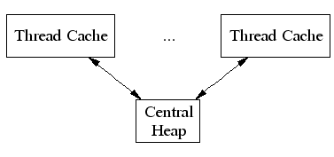
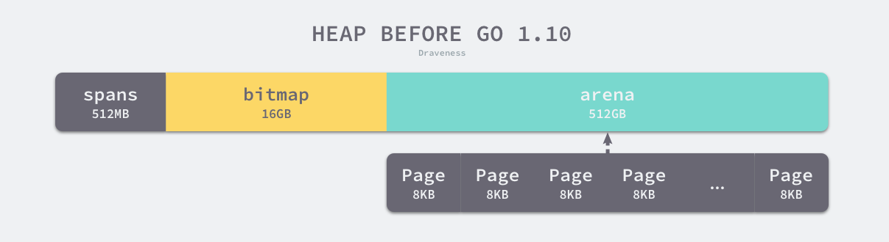

# Go advance

[TOC]

## Memory Manage


The data and variables in program are allocated in virtual memory. The are two important area in memory: stack and heap. The parameters function called, return value and local variable are almost allocated in stack and those are managed by compiler.


The memory manage in Golang contains three component: Mutator, Allocator and Collector. When the mutator applies for memory, it delegates this generic task to Allocator.

### 1. Memory Allocation

Reference:

1. [鹅厂后台大佬教你Go内存管理](https://mp.weixin.qq.com/s/56tth8PSquB1eR5-1XaDWA)
2. [白话Go语言内存管理三部曲（一）内存分配原理](https://zhuanlan.zhihu.com/p/225190602)
3. [Go 语言内存分配器的实现原理](https://draveness.me/golang/docs/part3-runtime/ch07-memory/golang-memory-allocator/)
4. [Go: Memory Management and Allocation](https://medium.com/a-journey-with-go/go-memory-management-and-allocation-a7396d430f44)
5. [TCMalloc : Thread-Caching Malloc](http://goog-perftools.sourceforge.net/doc/tcmalloc.html)

There are two ways of allocating: Sequential Allocator(Bump allocator) and Free-List Allocator.

#### 1.1 General allocation method

🔵 Bump Allocator

Bump allocating is an efficient method for memory allocation but has some limitations. We only need to maintain a pointer which point to a specific position in memory. The allocator only need to check remain free space and return the pointer in allocated memory area If user program applies for a memory to it.


Although the bump allocator brings faster speed and lower complexity, it can't collect the memory which has been freed. As followed image, the allocator can't reuse the red part of memory immediately, because there is an object between red part and cyan part of memory and the bump allocator has ONLY one pointer.


🔵 Free-List Allocator

Free-List Allocator can reuse memory which has been freed. It maintain a data structure like link list.

Free-List allocator will traverse freed chunk of memory if a user program applies for memory, find one big enough memory then request new resource and modify the link list.


There are four common allocation strategy:

1. First-Fit: Traverse from head of link list and select the first free chunk of memory whose size is greater than request memory.
2. Next-Fit: The traversal starts at the end of last traversal and select the first free chunk of memory whose size is greater than request memory.
3. Best-Fit: The traversal starts at the head of link list and select the **fittest** chunk of memory.
4. Segregate-Fit: Divide memory into multiple link lists those have same size of memory. When requesting memory, find a link list which meet the condition then select the appropriate chunk of memory.

The memory allocation strategy in Golang is similar with the fourth.


As shown in this image, Segregate-Fit strategy divide the memory into 4 linked list consisting of memory blocks of 4, 8, 16 and 32 bytes. When a user program requests an 8 bytes memory, the strategy will find the fittest linked list then find the free chunk of memory in this list. This strategy reduces the number of traversal and improves the efficiency of memory allocation.

#### 1.2 TCMalloc

The thought of memory allocation in Golang originates from TCMalloc(Thread-Cache Malloc) which Google designs for C. TCMalloc is faster than malloc in glibc 2.3 and also reduces lock contention for multi-thread programs. For small objects, there is virtually zero contention. For large objects, TCMalloc tries to use fine grained and efficient spinlocks.

|   Category   |    Size     |
| :----------: | :---------: |
| Micro Object |  (0, 16B)   |
| Small Object | [16B, 32KB] |
|  Big Object  | (32KB, +∞)  |




Thread cache belongs to every independent thread and it can meet almost memory allocation request for thread level. Since there are no multithreads involved, there are no mutex locks to protect memory which reduce the performance cost of lock contentions. When thread need bigger memory, the central  cache is used to solve this. Large objects are **directly** allocated from the central heap.

#### 1.3 allocation in Golang



When a go program launches, it will initialize whole part of **virtual memory** which contains three parts:

* **spans**: (512 MB)store pointers of memory manage unit `runtime.mspan`, and each unit of 8KB manages several page of memory space.
* **bitmap**: (16 GB)marks those addresses have stored objects,
* **arena**: (512GB)the real heap area. 8KB chunk of memory will be seen as a **page** which stores all the initialized objects in heap.

Three are 4 important components in memory allocator in Golang: Memory manage unit, thread cache, central cache and page head correspond to data struct `mspan`, `mcache`, `mcentral` and `mheap` respectively.


Go program initialize memory layout as shown in this image when launch. And every processor will allocate a thread cache( `runtime.mcache` ) to handle the allocation of micro and small objects and they possess the memory manage unit `runtime.mspan`.

🔵memory manage unit --- mspan

```go
type mspan struct {
    next *mspan     // next span in list, or nil if none
    prev *mspan     // previous span in list, or nil if none
    list *mSpanList

    startAddr uintptr // address of first byte of span aka s.base()
    npages    uintptr // number of pages in span

    manualFreeList gclinkptr // list of free objects in mSpanManual spans
    freeindex uintptr

    // Cache of the allocBits at freeindex. allocCache is shifted
    // such that the lowest bit corresponds to the bit freeindex.
    // allocCache holds the complement of allocBits, thus allowing
    // ctz (count trailing zero) to use it directly.
    // allocCache may contain bits beyond s.nelems; the caller must ignore
    // these.
    allocCache uint64

    allocBits  *gcBits
    gcmarkBits *gcBits
    // sweep generation:
    // if sweepgen == h->sweepgen - 2, the span needs sweeping
    // if sweepgen == h->sweepgen - 1, the span is currently being swept
    // if sweepgen == h->sweepgen, the span is swept and ready to use
    // if sweepgen == h->sweepgen + 1, the span was cached before sweep began and is still cached, and needs sweeping
    // if sweepgen == h->sweepgen + 3, the span was swept and then cached and is still cached
    // h->sweepgen is incremented by 2 after every GC
    sweepgen    uint32
    // ...
}
```

`mspan` has two fields: `next` and `prev` means `mspan` is doubly linked list. `mSpanList` stores the head and tail node of double linked list.


🔵 Thread Cache --- mcache

```go
type mcache struct {
   // The following members are accessed on every malloc,
   // so they are grouped here for better caching.
   nextSample uintptr // trigger heap sample after allocating this many bytes
   scanAlloc  uintptr // bytes of scannable heap allocated

   tiny       uintptr
   tinyoffset uintptr
   tinyAllocs uintptr

   // The rest is not accessed on every malloc.

   alloc [numSpanClasses]*mspan // spans to allocate from, indexed by spanClass

   stackcache [_NumStackOrders]stackfreelist

   // flushGen indicates the sweepgen during which this mcache
   // was last flushed. If flushGen != mheap_.sweepgen, the spans
   // in this mcache are stale and need to the flushed so they
   // can be swept. This is done in acquirep.
   flushGen uint32
}
```

Thread cache stores the micro objects of user program. Each thread cache has 68*2 `mspan`s stored in `alloc` field.

🔵Central Cache --- mcentral

```go
type mcentral struct {
   spanclass spanClass
   partial [2]spanSet // list of spans with a free object
   full    [2]spanSet // list of spans with no free objects
}
```

Different with thread cache, accessing mspan in central cache needs mutex.

🔵Page Heap --- mheap

```go
type mheap struct {
    // lock must only be acquired on the system stack, otherwise a g
    // could self-deadlock if its stack grows with the lock held.
    lock  mutex
    pages pageAlloc // page allocation data structure

    sweepgen uint32 // sweep generation, see comment in mspan; written during STW

    allspans []*mspan // all spans out there

    pagesInUse         atomic.Uint64 // pages of spans in stats mSpanInUse
    pagesSwept         atomic.Uint64 // pages swept this cycle
    pagesSweptBasis    atomic.Uint64 // pagesSwept to use as the origin of the sweep ratio
    sweepHeapLiveBasis uint64        // value of gcController.heapLive to use as the origin of sweep ratio; written with lock, read without
    sweepPagesPerByte  float64       // proportional sweep ratio; written with lock, read 
    scavengeGoal uint64
    reclaimIndex atomic.Uint64
    reclaimCredit atomic.Uintptr
    arenas [1 << arenaL1Bits]*[1 << arenaL2Bits]*heapArena

    // heapArenaAlloc is pre-reserved space for allocating heapArena
    // objects. This is only used on 32-bit, where we pre-reserve
    // this space to avoid interleaving it with the heap itself.
    heapArenaAlloc linearAlloc

    // arenaHints is a list of addresses at which to attempt to
    // add more heap arenas. This is initially populated with a
    // set of general hint addresses, and grown with the bounds of
    // actual heap arena ranges.
    arenaHints *arenaHint

    // arena is a pre-reserved space for allocating heap arenas
    // (the actual arenas). This is only used on 32-bit.
    arena linearAlloc

    allArenas []arenaIdx

    sweepArenas []arenaIdx

    markArenas []arenaIdx

    curArena struct {
        base, end uintptr
    }

    _ uint32 // ensure 64-bit alignment of central

    central [numSpanClasses]struct {
        mcentral mcentral
        pad      [cpu.CacheLinePadSize - unsafe.Sizeof(mcentral{})%cpu.CacheLinePadSize]byte
    }

    spanalloc             fixalloc // allocator for span*
    cachealloc            fixalloc // allocator for mcache*
    specialfinalizeralloc fixalloc // allocator for specialfinalizer*
    specialprofilealloc   fixalloc // allocator for specialprofile*
    specialReachableAlloc fixalloc // allocator for specialReachable
    speciallock           mutex    // lock for special record allocators.
    arenaHintAlloc        fixalloc // allocator for arenaHints

    unused *specialfinalizer // never set, just here to force the specialfinalizer type into DWARF
}
```

Page heap is core structure of memory allocation

### 2. Stack Memory


### 3. Garbage Collection