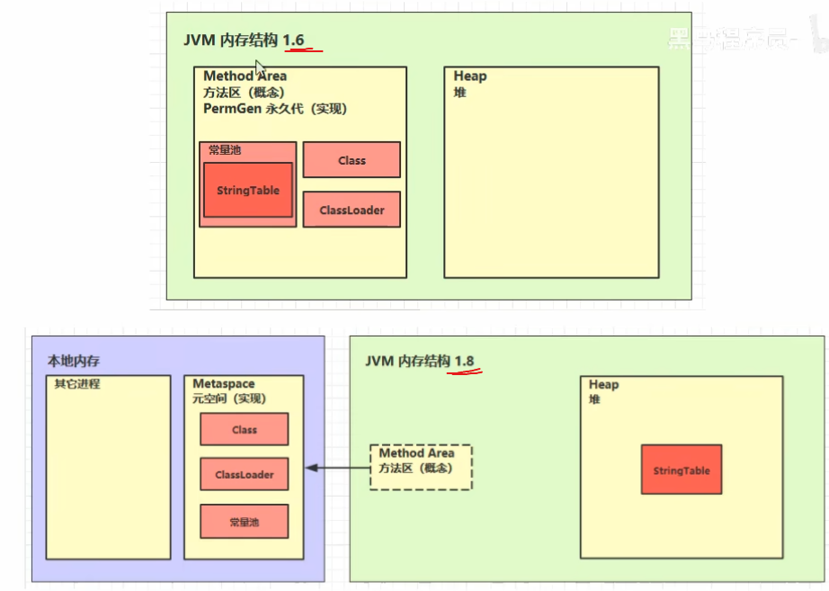
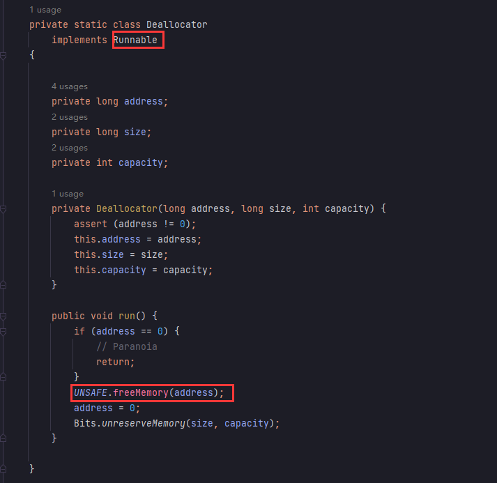
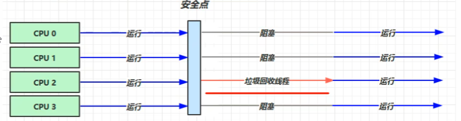
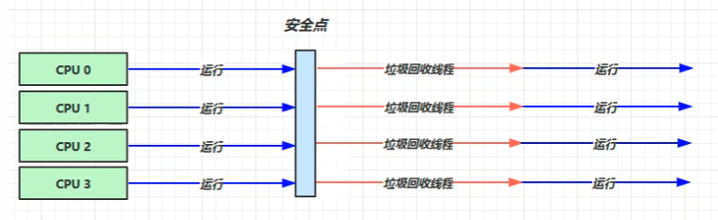
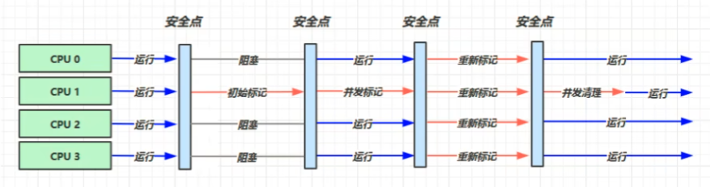
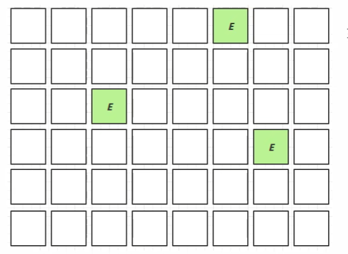
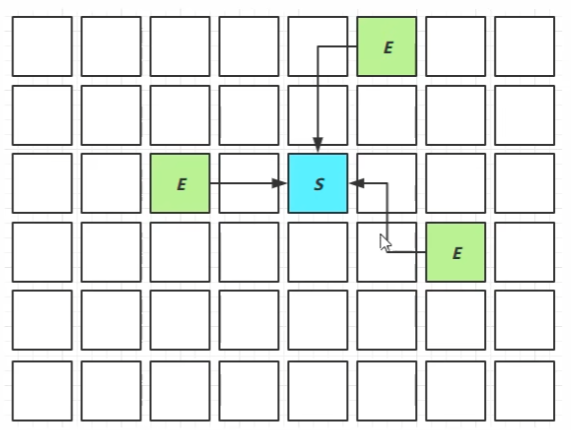
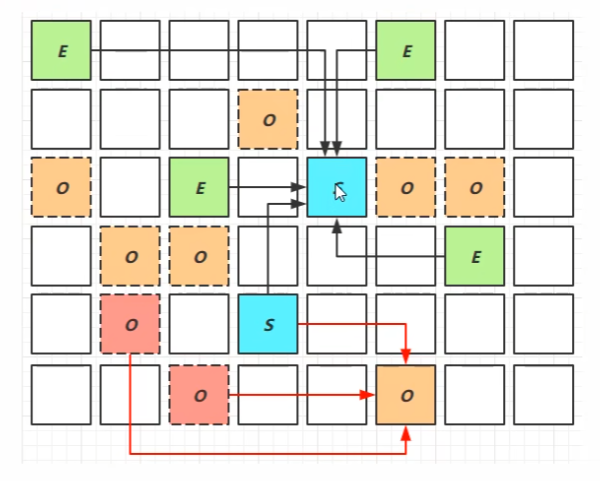
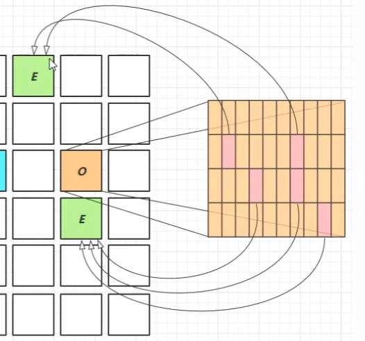

# JVM

[BV1yE411Z7AP](https://www.bilibili.com/video/BV1yE411Z7AP) Over

[TOC]


## 一. JVM内存结构

### 0x1. 程序计数器

Program Counter Register程序计数器，用于存储下一条指令的地址。

特点：

* **线程私有**
* **不会出现内存溢出的**

### 0x2. 虚拟机栈

虚拟机栈即线程运行时需要的内存空间，栈帧即每个方法运行时需要的内存（参数，局部变量，返回值地址）。

**面试问题**：

* 栈内存受垃圾回收机制影响吗？不受影响，当变量使用完毕后会弹栈自动回收。并且垃圾回收时只涉及到堆内存中的数据。

* 栈内存是越大越好吗？使用 `-Xss1m` 来进行调整大小（默认就好）

  不一定，在内存大小一致的情况下，将栈内存调大是可以允许嵌套调用函数变多，但是线程数目会变少，因为每个线程初始化时候都会分配该大小的栈空间，如果分配栈空间过大反而会降低允许同时允许线程的数目。

* 方法内的局部变量是否是线程安全的？

  如果方法内的局部变量没有逃逸，那么就是线程安全的。否则会出现线程安全问题。

🔵栈内存溢出

可能发生溢出的情况：栈帧过多(递归)、栈帧过大等情况，报 `java.lang.StackOverflowError` 错误

```java
@Slf4j(topic = "StackOverflowError")
public class StackOF {
    // StackOverflowError
    private static int count = 0;
    public static void main(String[] args) {
        try {
            m1();
        } catch (Exception e) {
            e.printStackTrace();
        } finally {
            log.debug("{}", count); // -Xss256k
        }
    }

    private static void m1() {
        count++;
        m1();
    }
}
```

🔵线程运行诊断

一，占用CPU过高：

```sh
top
ps H -eo pid,tid,%cpu | grep pid
jstack tid
```

使用top定位进程id，使用`ps H`命令定位对应线程的id，再使用`jstack tid`找到对应线程占用过高的代码。

二，线程发生死锁

同样使用jstack工具来进行诊断。

### 0x3. 本地方法栈

即使用`native`进行修饰的方法，比如使用C/C++实现的方法。

### 0x4. 堆

> Heap，是**线程共享**的，需要考虑线程安全问题。

通过`new`关键字创建的对象都会使用堆内存，存在堆内存溢出的问题。

🔵堆内存溢出，会抛出 `java.lang.OutOfMemoryError`

```java
@Slf4j(topic = "HeapOF")
public class HeapOF {
    public static void main(String[] args) {
        int i = 0;
        try {
            List<String> list = new ArrayList<>();
            String a = "Hello";
            while (true) {
                list.add(a);
                a = a + a;
                i++;
            }
        } catch (Throwable e) {
            e.printStackTrace();
            log.debug("{}", i);
        }
    }
}
```

可以通过设置`-Xmx`参数设置堆的大小。

如果想要暴露程序是否存在堆内存溢出的可能性，因此在调试的时候可以将堆设置小一些。

🔵堆内存溢出诊断

通过 `jps` 查看系统中有哪些 Java 进程。

可以使用`jmap -heap`或者jconsole来监测。

面试问题：

* 对于垃圾回收过后，内存占用还是很高的情况怎么处理？

  可以使用 `jvisualvm` 工具中的堆dump来分析其中的类的对象信息。

### 0x5. 方法区



方法区是所有**线程共享**的，用来存储每个类的结构比如运行时常量池、属性以及方法数据，方法区也会到处内存溢出。方法区是在虚拟机启动时候创建，逻辑上属于堆的一部分。

> jdk 1.8 之后方法区不占用 jvm 堆内存，占用的是操作系统内存，内存区域叫做 `元空间内存`，使用参数 `-XX:MaxMetaspaceSize=8m` 进行设置，默认没有设置元空间大小限制。

Java Class 文件中保存的信息：

* 类的基本信息
* 常量池
* 类方法定义，包含虚拟机指令

可以通过`javap -v *.class`来对字节码进行反编译。

```
Constant pool:
   #1 = Methodref          #6.#20         // java/lang/Object."<init>":()V
   #2 = Fieldref           #21.#22        // java/lang/System.out:Ljava/io/PrintStream;
   #3 = String             #23            // Hello World
   #4 = Methodref          #24.#25        // java/io/PrintStream.println:(Ljava/lang/String;)V
   #5 = Class              #26            // com/jvm/struction/ConstantPool
   #6 = Class              #27            // java/lang/Object
   #7 = Utf8               <init>
   #8 = Utf8               ()V
   #9 = Utf8               Code
   #10 = Utf8              LineNumberTable
```

🔵运行时常量池

运行时将常量池放到内存中就是运行时常量池，指令为：

```
ldc #5	// 从常量池中加载到内存，并且转为字符串对象
astore	// 将内存的中字符串存储到局部变量表中
```

方法区的常量池就是一张常量表。

#### a. StringTable

优秀参考文章：

* [一文彻底搞懂字符串、字符串常量池原理](https://blog.csdn.net/qq_45076180/article/details/115082348)

运行时常量池和字符串常量池(String Pool)的关系。


常量池中的信息都会加载到运行时常量池中，执行代码`ldc #2`的时候才可以将对于的常量转化为字符串对象。

```java
public static void main(String[] args) {
    String a = "a";
    String b = "b";
    String ab = "ab";
    String s4 = a + b;
    String s5 = "a" + "b";

    System.out.println(ab == s4);   // false
    System.out.println(ab == s5);   // true
    ab.intern();
}
```

对于jdk8中s4中的字节码代码相当于是`StringBuilder().append("a").append("b").toString()`，而 StringBuilder 的 `toString()` 会创建新的 String 对象。

对于s5的情况是javac编译器上做了优化，在StringTable 中已经存在 "ab" 这个常量了，又由于String是不可变类，因此创建s5的时候会直接从常量池中查找。

常量池中的数据只是符号，只有在使用的时候才会转为对象。`intern()` 方法会查看当前字符串对象是否已经存在与串池中，如果不存在将该对象放入，如果存在则返回串池中的对象。（在1.6的不存在会**复制**一份放入串池中）

    0: ldc           #2                  // String a
    2: astore_1
    3: ldc           #3                  // String b
    5: astore_2
    6: ldc           #4                  // String ab
    8: astore_3
    9: aload_1
    10: aload_2
    11: invokedynamic #5,  0              // InvokeDynamic #0:makeConcatWithConstants:(Ljava/lang/String;Ljava/lang/String;)Ljava/lang/String;
    16: astore        4
    18: ldc           #4                  // String ab
    20: astore        5

**问题**：

```java
public static void main(String[] args) {
    String s1 = "a";
    String s2 = "b";
    String s3 = "a" + "b";
    String s4 = s1 + s2;
    String s5 = "ab";
    String s6 = s4.intern();

    System.out.println(s3 == s4);   // false
    System.out.println(s3 == s5);   // true
    System.out.println(s3 == s6);   // true

    String x2 = new String("c") + new String("d");
    String x1 = "cd";
    x2.intern();
    System.out.println(x1 == x2);   // false
}
```

🔵StringTable在jvm中存放的位置

在jdk8中Stringtable是存放在堆内存中，jdk1.6之前是放在永久代中。

将字符串放在堆中，只需要 minor GC 就可以回收不用的字符串.


🔵StringTable性能调优

1. 调整桶的个数, 減小哈希

   StringTable的底层存储结构其实是一个`HashTable`，如果使用`-XX:StringTableSize=20000`来指定常量池桶(bucket)的大小，如果字符串数量较多的话，常量池越小花费的时间会越多，常量池越大花费的时间会越少，减少hash冲突。

2. 考虑将字符串对象是否入池，如果字符串存在重复利用的问题，那么就需要使用 `intern()` 方法将其存储常量池中，减小大量重复创建对象导致的内存占用。

### 0x6. 直接内存

直接内存（Direct memory）指系统内存。

常见于NIO操作，用于数据缓冲区。分配回收的成本较高，但是读写性能高；不受JVM内存回收管理。

传统的读写一般用`Input/OutputStream`，使用系统直接内存为`ByteBuffer`类中的`allocateDirect()`，对于Java传统的读写需要首先将数据读取到系统的缓冲区，然后再读取到Java的缓冲区中，直接切换的开销过大。


🔵但是其不受JVM控制，内存怎么回收？

因为在创建 `ByteBuffer` 类时候是使用 `Unsafe.allocateMemory` 来分配直接内存，并且在创建的时候会绑定一个 `Cleaner` 虚拟引用类型，并且绑定当 `ByteBuffer` 回收时候回收直接内存的动作 `new Deallocator()`。

```java
DirectByteBuffer(int cap) {                   // package-private
	// ...

    long base = 0;
    try {
        base = UNSAFE.allocateMemory(size);
    } catch (OutOfMemoryError x) {
        Bits.unreserveMemory(size, cap);
        throw x;
    }
    UNSAFE.setMemory(base, size, (byte) 0);
    // ...
    cleaner = Cleaner.create(this, new Deallocator(base, size, cap));
    att = null;

}
```

`ByteBuffer` 回收后操作 `Unsafe` 回收直接内存：



显式调用垃圾回收：

```java
System.gc();
```

由于显式垃圾回收都是 FullGC，可以设置运行参数：`-XX:+DisableExplictGC`来禁用显式垃圾回收。如果要想回收直接内存直接使用 `unsafe.freeMemory` 来释放。

## 二. 垃圾回收

### 0x1. 如何判断垃圾

🔵引用计数法

当存在别的对象对一个对象引用的时候，就会让引用的计数加一，如果为0的时候就可以进行垃圾回收了。

对于引用计数法存在一个问题，对于两个循环引用的对象，A引用B，B引用A时，两个各自引用计数都是1，因此就不能进行回收。

Java因此不采用这种方法，python以前使用的是这种方法。

🔵可达性分析算法

Java采用的算法，Java首先需要判断根对象，jvm判断每个对象是否被根对象所引用，如果被引用则不可以被垃圾回收，未被引用则表示可以被回收。

什么是根对象（GC root）？

* 系统类对象，JVM 运行时所需的核心对象
* 操作系统栈中引用的 Java 对象
* 加锁的对象
* 活动线程中使用的对象

对于分析内存泄漏可以使用Eclipse开发的[Memory Analyzer(MAT)](https://www.eclipse.org/mat/)工具，来发现哪些对象可以作为GCRoot。

```sh
jps # 查看java进程id
jmap -dump:format=b,live,file=1.bin 21384	# 输出堆内存快照文件
jmap -dump:format=b,live,file=2.bin 21384	# 输出将指针设置为空后的快照
# 然后使用mat软件打开两个快照文件，查看gc root
```


🔵Java中的四种引用

引用的接口类为`Reference`，其他分别为`StrongReference, SoftReference, WeakReference, PhantomReference`.


图中的实现为强引用，虚线为其他引用。

1. 强引用

   只有所有的强引用连接全部断开，才会进行垃圾回收。

2. 软引用

   当A2都没有被强引用直接或者间接引用的时候，在内存不足的时候，都有可能被回收。

3. 弱引用

   当A3都没有被强引用直接或者间接引用的时候，**不管内存够不够**，都有可能被回收。可以配合引用队列进行使用。

4. 虚引用

   其**必须**配合引用队列进行使用，比如在回收ByteBuffer对象的时候，也需要回收其对应的直接内存。

5. 终结器引用

   使用对象都会继续`Object`父类，调用`finalize()`时，但是不推荐调用这个方法。

使用软引用的场景，对于某些场景如果遇到资源紧张，但是要求不那麼高，可以等到内存充足的时候再加载。代码：`-Xmx20m -XX:+PrintGCDetails -verbose:gc`

引用链：List -> SoftReference -> byte[]

```java
@Slf4j(topic = "SoftReference")
public class SoftReferenceDemo {
    private static final int _4MB = 1024 * 1024 * 4;

    public static void main(String[] args) throws IOException {
        soft();
    }

    public static void soft() throws IOException {
        System.in.read();
        List<SoftReference<byte[]>> list = new ArrayList<>();
        for (int i = 0; i < 5; i++) {
            SoftReference<byte[]> ref = new SoftReference<>(new byte[_4MB]);
            log.info("{}", ref);
            list.add(ref);
            log.info("{}", list.size());
        }

        log.debug("循环结束");
        for (SoftReference ref : list) {
            log.info("{}", ref);
        }
        System.in.read();
    }
}
```

对于软引用可能会被垃圾回收的情况，可以将`SoftReference`关联到`ReferenceQueue`对象上，当被回收的时候可以通过检测来删除对象。

```java
@Slf4j(topic = "GCTest")
public class NormalTest extends TestCase {
    public void testRefQueue() {
        int _5MB = 5 * 1024 * 1024;
        ReferenceQueue<byte[]> queue = new ReferenceQueue<>();
        List<SoftReference<byte[]>> list = new ArrayList<>();
        for (int i = 0; i < 5; i++) {
            SoftReference<byte[]> ref = new SoftReference<>(new byte[_5MB], queue);
            list.add(ref);
            log.debug("ref: {}", ref);
        }

        while (true) {
            Reference<? extends byte[]> item = queue.poll();
            if (item == null) break;
            list.remove(item);
        }

        log.debug("==============================");

        for (SoftReference<byte[]> ref : list) {
            log.debug("Left: {}", ref);
        }

        log.debug("Over");
    }
}
```

结果：

```
20:38:07.819 [main] DEBUG GCTest - ref: java.lang.ref.SoftReference@735b478
20:38:07.825 [main] DEBUG GCTest - ref: java.lang.ref.SoftReference@337d0578
20:38:07.837 [main] DEBUG GCTest - ref: java.lang.ref.SoftReference@59e84876
20:38:07.840 [main] DEBUG GCTest - ref: java.lang.ref.SoftReference@61a485d2
20:38:07.846 [main] DEBUG GCTest - ref: java.lang.ref.SoftReference@39fb3ab6
20:38:07.846 [main] DEBUG GCTest - ==============================
20:38:07.846 [main] DEBUG GCTest - Left: java.lang.ref.SoftReference@39fb3ab6
20:38:07.846 [main] DEBUG GCTest - Over
```


### 0x2. 垃圾回收算法

🔵标记清除法


首先将GCroot未进行引用的地址进行标记，然后进行清除。

优点就是速度快，但是会产生很多空间不连续会导致很多的空间碎片。

🔵标记整理法

在标记清除算法的基础上，在进行一个“紧凑”操作。

不会产生碎片，但是需要考虑到系统对象引用的修改，缺点就是速度较慢。

🔵复制算法


复制回收算法使用于存活的内存区域较少的情况，即将内存区域分为两块FROM区域和TO区域。将原先FROM区域中存活的内存复制到TO区域中，清除FROM区域。最终交换两个区域，FROM区域变为TO区域，TO区域变为FROM区域。

缺点就是需要划分两倍的内存。

### 0x3. 分代回收算法


在具体的java垃圾回收算法中，不会只是用某一种算法，而是将几种算法有机的结合在一起。

Java的回收算法将内存区分为两个区域：新生代和老年代。

有的对象需要长时间进行使用，就放入到老年代中；对于用完就可以丢弃的，就放入到新生代中。

#### a. 回收流程


1. 当新生代的伊甸园放满后，触发 Minor GC
2. 将还存活的对象复制到幸存区 TO 中，并且将对象生命周期加一
3. 清空伊甸园区域
4. 最后将FROM区域和TO区域的进行交换。

当存放在幸存区中对象寿命超过阈值15的时候，会将对应的内存晋升到老年代中。如果新生代和老年代两个区域都放不下新的内存区域的时候，就会触发新的`Full GC`操作，会对新生代和老年代两个区域都进行垃圾回收。

`Minor GC`会触发Stop The World操作，即发生垃圾回收的时候，会暂停其他的用户线程，等待垃圾回收操作完成之后，才会进行恢复用户线程。因为在进行垃圾回收的时候，会发生内存地址发生变化的情况，如果不暂停线程的话会导致地址混乱的情况。

`Full GC`也会触发Stop The World操作，并且时间较长。

> 如果对象大小超过新生代大小，会直接存储老年代中，如果老年代中也存储不了就会 OOM。

#### b. GC 相关的vm参数

|       含义        |                            参数                             |
| :---------------: | :---------------------------------------------------------: |
|    堆初始大小     |                            -Xms                             |
|    堆最大大小     |                            -Xmx                             |
|    新生代大小     |                            -Xmn                             |
| 幸存区比例(动态)  | -XX:InitialSurvivorRatio=ratio / -XX:+UseAdaptiveSizePolicy |
|    幸存区比例     |                   -XX:SurvivorRatio=ratio                   |
|     晋升阈值      |             -XX:MaxTenuringThreshold=threshold              |
|     晋升详情      |               -XX:+PrintTenuringDistribution                |
|      GC详情       |               -XX:+PrintGCDetails -verbose:gc               |
| Full GC前Minor GC |                  -XX:ScavengeBeforeFullGC                   |

### 0x4. 垃圾回收器（CMS, G1）

* 串行垃圾回收器`Serial GC`，使用单线程进行回收

  

  当垃圾回收的时候，其他线程阻塞

  适合单线程；也适合堆内存比较小，适合单人电脑。

  开启串行垃圾回收：`-XX:+UseSerialGC=Serial+SerialOld`

* 吞吐量优先`Parallel GC` （1.8默认回收器）

  

  适合多线程，堆内存较大，让单位时间内STW时间最短。但是会在短时间内使得CPU占用变高。

  开启吞吐量优先的开关：`-XX:UseParallelGC`

  `-XX:GCTimeRatio=ratio` 设置垃圾回收占用时间的比值

  `-XX:MaxGCPauseMillis=ms` 设置垃圾回收占用时间最大毫秒数，默认 200 ms

  `-XX:ParallelGCThreads=n` 设置垃圾回收的线程数

* 响应时间优先 `ConcMarkSweep GC`

  

  当其他用户进程运行的时候也能进行标记。
  
  * 初始标记的时候会将其他线程阻塞，用于标记 GC root 对象。
  * 将剩余的对象进行并发标记
  * 重新标记用于查看已标记的对象是否被用户线程改变
  
  适合多线程，堆内存较大，尽可能的让STW单次时间最短（可能STW次数很多）。
  
  开启响应时间GC：`-XX:+UseConcMarkSweepGC` 开启并发的标记清除GC算法。

* **G1垃圾回收器**（重要）见下一节

### 0x5. G1 垃圾回收器

JDK9之后默认使用垃圾回收器。

适用场景：

* 同时注重吞吐量和低延迟，默认的暂停时间是200ms。

* 适合超大的堆内存，会将堆大小分为多个大小相等的Region。

* 整体上是标记整理法，区域之间是复制算法。

相关参数：

* `-XX:UseG1GC`，JDK8需要显式开启

* `-XX:G1HeapRegionSize=size`，设置G1垃圾回收的 Region 大小

* `-XX:MaxGCPauseMillis=time`，设置暂停时间。

G1垃圾回收会将内存区域分成大小相同的区域，每个区域都可以被独立分为 Eden，Young 和 old。

#### a. G1回收阶段


1. 新生代收集。初始阶段会分配几个 Eden 区，当 Eden 被分配满之后就会触发新生代收集。

   

   触发新生代垃圾回收之后会将 eden 中存活对象复制到幸存区中。

   

   当幸存区对象也变多的时候，会晋升到老年代.

2. 新生代收集+CM

   当发生Young GC 的时候会进行 GC root 标记

   当老年代占用堆空间比例达到阈值的时候会进行并发标记（不会STW）

3. 混合收集阶段

   会对 E、S、O进行全面垃圾回收

   最终标记和拷贝存活都会 STW

   

> 对于CMS 和 G1 来说，当老年代内存不足的时候不一定会触发 FullGC，只有产生垃圾的速度大于回收垃圾速度的时候才会退化为 SerialOld，就会执行 FullGC

#### b. 卡表

当需要对新生代对象进行标记的时候，需要找到 GC Root，有的 GC Root 就存储在老年代中，然后一个个遍历老年代会比较耗时，因此会使用卡表的技术对于引用新生代中的老年代对象标记为“脏卡”。



将来进行垃圾回收的时候只需要遍历脏卡即可。

#### c. 重标记法remark

三色标记法，使用读写屏障来防止某些对象在并发使用的情况被错误回收和未被回收的情况。

#### d. JDK8新特性

* 字符串去重

  关注的是 `char[]` 数组，会将所有新分配的字符串放入队列，当新生代回收的时候，G1 并发检查是否有重复字符串，如果值一样，就指向同一个 `char[]` 数组。

  优点：节省大量内存

  缺点：多占用 CPU 时间，新生代回收时间略微增加。

* 并发标记类卸载

  当类不再使用的时候，当类加载器的所有类不再使用的时候就会卸载所有的类

* 回收巨型对象

  当一个对象大于 region 的一半的时候就会被当作巨型对象。

  G1 不会对巨型对象进行拷贝，回收时候会被优先考虑，G1会跟踪老年代所有 incoming 引用，当老年代 incoming 引用为 0 的时候就可以在新生代垃圾回收掉。

* 并发标记其实时间调整

* 更高效的回收效率

### 0x6. 垃圾回收调优

确定目标来选择合适的回收器，**低延迟**还是**高吞吐量**。

最快的GC就是不发生GC。

考虑以下几个问题：

* 数据是不是太多？
* 数据是否太臃肿？拿取数据的时候是否也顺便拿取了冗余的数据？
* 是否存在内存泄漏？比如向`static Map map`中频繁的加入和删除数据，一般情况下使用第三方缓存数据库来进行存储。

🔵新生代调优：

新生代特点：

* 所有 new 操作的内存分配非常廉价，TLAB(Thread-Local allocation buffer)
* 死亡对象的回收代价为0， From区域和To区域只要交换后，To区域就会直接清零。
* 大部分对象用过即死
* Minor GC的回收时间远远小于 Full GC。

新生代设置的不能太小也不能太大。如果设置太大，就会导致老年代空间变小，从而使得 Full GC 次数变多。

Oracle 建议新生代设置的大小为堆大小的 25%-50% 之间，新生代的设置能够容纳`并发量*(请求-响应)`的数据。

新生代也存在幸存区，其大小要满足能够保留`当前活跃对象+需要晋升对象`的数据，让短时间存活的对象不晋升，让长时间存活的对象尽量晋升。

设置晋升阈值：`-XX:MaxTenuringThreshold=n`

🔵老年代的调优

* CMS的老年代内存越大越好
* 先不进行调优，如果没有出现 Full GC 就挺好了，否则先尝试调优新生代。
* 调试完新生代之后还会发生 Full GC 的时候，将老年代的大小调大 1/3 或者 1/4。

🔵调优案例：

* Full GC 和 Minor GC 频繁
* 请求高峰发生 FullGC，单词暂停时间长（CMS）

## 三. 字节码

### 0x1. 类文件结构

简单的 Hello World 样例编译后的字节码文件：


```
CA FE BA BE 00 00 00 37 00 22 0A 00 06 00 14 09
```

🔵版本信息：前8个字节

* `CA FE BA BE` cafebabe 是用来标识的是java的class文件
* `00 00 00 37` 标识JDK的版本，这里标识JDK11，34标识jdk8

🔵常量池信息：

第8-9个字节：`00 22` 标识有多少个常量。

第 #1 常量：`0A 00 06 00 14`，0A表示Method信息，00 06 和 00 14 表示其引用了常量池中 #6 和 #20 项来获取这个方法的**所属类**和**方法名**。

`<init>` 表示构造方法，`()V` 表示无参构造方法。

第 #2 常量：`09 00 15 00 16`，09 表示Field属性类型，后面`00 15` 以及 `00 16` 表示引用了常量 #23 和 #24 的常量信息。

对于字符串常量：`01 00 0B 48 65 6C 6C 6F 20 57 6F 72 6C 64 `，其中 01 表示 utf8串，`00 0B`表示字符串的长度，`48 65 6C 6C 6F 20 57 6F 72 6C 64` 就表示的是`Hello World`。

其余类似。

🔵类的访问标识

```
00 21 00 05 00 06 00 00 00 00 00 02 00 01 00 07
```

`00 21` 表示是一个公共的类，`00 05` 表示类全限定名称 #5，`00 06` 表示父类的全限定名称 #6，`00 00` 表示接口的数量信息，`00 00` 表示属性信息，`00 02` 表示方法的数量。

对于类中的方法属性，其中还有字节码会标识**Java源码**中对应的行号。

更详情的内容可以参考书籍《The Java® Virtual Machine Specification》中的第四章The class File Format。

### 0x2. 字节码指令

java提供javap指令来进行反编译：`javap -v xxx.class`

样例分析：

```java
public class First {
    public static void main(String[] args) {
        int a = 10;
        int b = a++ + ++a + a--;
        System.out.println(a);  // 11
        System.out.println(b);  // 34
    }
}
```

对应的字节码：

```
0: bipush        10
2: istore_1
3: iload_1
4: iinc          1, 1
7: iinc          1, 1
10: iload_1
11: iadd
12: iload_1
13: iinc          1, -1
16: iadd
17: istore_2
18: getstatic     #2                  // Field java/lang/System.out:Ljava/io/PrintStream;
21: iload_1
22: invokevirtual #3                  // Method java/io/PrintStream.println:(I)V
25: getstatic     #2                  // Field java/lang/System.out:Ljava/io/PrintStream;
28: iload_2
29: invokevirtual #3                  // Method java/io/PrintStream.println:(I)V
32: return
```

样例分析二：

```java
private static void t1() {
    int i = 0, x = 0;
    while (i < 10) {
        x = x ++;
        i++;
    }
    System.out.println(x + " " + i);    // 0 10
}
```

对于x一直为0有字节码：

    10: iload_2
    11: iinc          2, 1
    14: istore_2

JVM先将LocalVariableTable中slot为2的`x`进行操作栈，然后对LocalVariableTable中的x进行自增变为1，执行到`istore_2` 的时候又将操作栈中的值重新赋值给slot中的数据，因此数值还是为0。

对应字节码：

```
0: iconst_0
1: istore_1
2: iconst_0
3: istore_2
4: iload_1
5: bipush        10
7: if_icmpge     21
10: iload_2
11: iinc          2, 1
14: istore_2
15: iinc          1, 1
18: goto          4
21: getstatic     #2                  // Field java/lang/System.out:Ljava/io/PrintStream;
24: iload_2
25: iload_1
26: invokedynamic #3,  0              // InvokeDynamic #0:makeConcatWithConstants:(II)Ljava/lang/String;
31: invokevirtual #4                  // Method java/io/PrintStream.println:(Ljava/lang/String;)V
34: return
```

🔵static：

```java
public class StaticDemo {
    static int i = 1;

    static { i = 2; }

    static { i = 3; }
}
```

在JDK8中会将静态代码块和静态变量的赋值全部按照上下顺序合并为`<cinit>`方法。

🔵非静态成员变量和代码块

```java
package com.jvm.bytecode;

public class Constructor {
    private int a = 1;

    {
        b = 3;
    }

    private int b = 2;

    {
        a = 4;
    }

    public Constructor(int a, int b) {
        this.a = a;
        this.b = b;
    }

    public static void main(String[] args) {
        Constructor ins = new Constructor(9, 99);
        System.out.println(ins.a + " " + ins.b);    // 9 99
    }
}
```

对于非静态代码块和属性中的赋值，jvm会将其重新整合成一个新的构造器，然后将人工构造器的代码放在新的构造器之后。

### 0x3. 多态的原理

对于私有方法和静态方法，JVM的底层字节码都是调用 `InvokeSpecial` 和 `InvokeStatic` ，而对于公开的非静态方法调用的是 `InvokeVirtual`，涉及到多态的原理。前者的执行效率要比后者的高。

使用 HSDB 工具进行查看。

`InvokeVirtual` 指令的加载流程：

1. 想通过栈帧中的引用找到对象
2. 分析对象头，找到实际的 class
3. class 结构中有 vtable，他在类加载的链接阶段就已经将方法的重写规则生成完毕
4. 查表得到方法的具体地址
5. 执行方法的字节码

### 0x4. Try/Catch 异常处理原理

```java
public static void main(String[] args) {
    int i = 0;
    try {
        i = 10;
    }catch (Exception e) {
        i = 22;
    }
}
```

对应的字节码：

    stack=1, locals=3, args_size=1
        0: iconst_0
        1: istore_1
        2: bipush        10
        4: istore_1
        5: goto          12
        8: astore_2
        9: bipush        22
        11: istore_1
        12: return
    Exception table:
    from    to  target type
    	2     5     8   Class java/lang/Exception

对于异常处理的部分，jvm会维护一个Exception table，用来检测2-5行字节码是否出现对应异常，如果出现异常的话就跳到第8行。

对于多个Catch会有多行的Exception Table。

如果存在 `finally` 块，JVM会将其块中的代码分别复制到多个子代码块中，比如未发生异常的分支和发生异常的每一个分支中，并且可能由于会出现 `Exception` 的父类错误，或者`Error, Throwable`等错误，JVM会捕捉剩余的异常类型`any`，确保finally中的代码一定会执行。

🔵finally 面试问题：

1. 请问这个返回什么?

```java
static int test2() {
    try {
        return 10;
    }finally {
        return 20;
    }
}
```

返回20.

对应的字节码为：

```
 Code:
      stack=1, locals=2, args_size=0
         0: bipush        10
         2: istore_0
         3: bipush        20
         5: ireturn
         6: astore_1
         7: bipush        20
         9: ireturn
```

🔴注意！不要再finally块中写return语句，如果写入return语句会将异常吞掉，不会输出异常。

2. 请问这个返回什么？

```java
static int test3() {
    int i;
    try {
        i = 10;
        return i;
    }finally {
        i = 20;
    }
}
```

返回10，在返回之前 JVM 会做一个固定返回值的操作，防止 finally 块中修改返回值.

对应的字节码：

```java
Code:
  stack=1, locals=3, args_size=0
     0: bipush        10		// 放入栈顶
     2: istore_0					// 10 -> i
     3: iload_0						// <- i(10)，
     4: istore_1					// 10 -> slot 1,暂存至slot 1，目的是为了固定返回值
     5: bipush        20		// 将20放入栈顶
     7: istore_0					// 20 -> i
     8: iload_1						// <- slot 1(10), 载入slot 1中的值到操作栈
     9: ireturn					  // 返回栈顶的值
    10: astore_2
    11: bipush        20
    13: istore_0
    14: aload_2
    15: athrow					// 存在throw语句
  Exception table:
     from    to  target type
         0     5    10   any
```

### 0x5. Synchronized原理

```java
synchronized(lock){
  // ...  
}
```

jvm会使用 `monitorenter` 和 `monitorexit` 来进行解锁，并且会有隐藏的catch块，如果被包围的代码中如果有异常，就会进入ExceptionTable中指定的区域执行 `monitorexit ` 来保证一定会被解锁。

### 0x6. 语法糖

* 对于没有写默认构造方法的类，JVM会自动调用父类的`super()`方法
* 自动拆装箱：`Interger x = 1` 相当于 `Integer x = Integer.valueOf(1)`
* 泛型集合：`List<Integer> list = new ArrayList<>()`
* 可变参数：`String... args`  === `String[] args`
* foreach循环
* switch-String优化：底层相当于使用了两个switch语句，首先比对String的hashcode，case中再使用`equals()`来对比字符串设置对应的flag，防止hashcode冲突；然后再根据flag来switch对应的操作。
* switch-enum：使用了一个合成类，根据枚举的`ordinal()`来判断
* try-with-resource，可以自动关闭资源，简化资源关闭，`try(is = FileInputStream) {}`，资源必须要实现 `AutoCloaseable` 接口。
* 匿名内部类

### 0x7. 类加载

#### a. 加载过程


🔵加载

类加载即将类的字节码载入方法区，内存采用的是C++的 instanceKlass 来描述java类，他的主要field有：

* _java_mirror 即java的类镜像，起到桥梁的作用

🔵链接：

链接分为多个阶段：

1. 验证：类文件的魔数 magic number

2. 准备：为static变量分配内存空间，其存储在`_java_mirror`的末尾。对于静态变量，准备是在编译的时候进行，赋值实在类的构造方法中进行。

   对于 static 变量，如果 static 变量是 final 的**基本**类型，那么值在编译阶段就已经确定了，赋值在准备阶段完成；如果不是基本类型或者非 final 变量，分配空间和赋值是两个步骤，分配空间在准备阶段完成，赋值阶段在初始化阶段完成。

3. 解析：将常量池中的引用解析为直接引用。比如在类加载的时候采用的是懒加载的模式，如果不使用到对应的类，则其就不会加载。

🔵初始化

类的初始化即调用 `<cinit>` 方法，并且虚拟机会保证类初始化的线程安全。

静态内部类只有在使用的时候才会被初始化，适用于单例模式中的懒汉式加载。

#### b. 类加载器

类加载器的分类：

|          名称           |       加载的类        |            说明             |
| :---------------------: | :-------------------: | :-------------------------: |
|  Bootstrap ClassLoader  |   JAVA_HOME/jre/lib   |        无法直接访问         |
|  Extension ClassLoader  | JAVA_HOME/jre/lib/ext | 上级为Bootstrap，显示为null |
| Application ClassLoader |       classpath       |       上级为Extension       |
|      自定义加载器       |        自定义         |      上级为Application      |

在加载类的时候会首先向上级查找是否有全限定类名的类，如果存在则返回相同的类，如果不存在从下级中加载。

🔵启动类加载器Bootstrap

启动设置参数：`-XBootclasspath/a:.`

```java
public class BootstrapDemo {
    public static void main(String[] args) throws ClassNotFoundException {
        Class<?> aClass = Class.forName("com.jvm.classloader.F");
        System.out.println(aClass.getClassLoader());
        // null
    }
}

class F {
    static {
        System.out.println("Bootstrap F init");
    }
}
```

输出为null，则为启动类加载器。

🔵扩展类加载器

在jdk8中，如果将应用类jar包放入`jre/lib/ext`目录下，就会输出`ExtClassLoader`

🔵应用类加载器：

对于上述不添加参数，默认输出：`jdk.internal.loader.ClassLoaders$AppClassLoader@1f89ab83`

#### c. 双亲委派模式

双亲委派机制指的是调用类加载器的classloader方法时候查找类的规则。这里的双亲其实是上级的意思，因为其并没有继承的关系。

如果应用类加载器未找到对应的类，向上到扩展类加载器找，扩展类中未找到就向上到启动类加载器中查询。如果都为找到就到自身的加载器中查询，都未找到就到自定义的类加载器中查询。

#### d. 自定义类加载器

什么情况下需要自定义类加载器？

* 想加载任意路径中的类文件
* 用于框架设计
* 对于不同版本的类进行隔离，不同应用相同类名都可以加载不冲突，常见的比如 tomcat 容器

实现步骤：

1. 继承 classLocader 父类
2. 遵循双亲委派机制，重写 findClass 方法（非 `loadClass` 方法）
3. 读取类文件的字节码
4. 调用父类的 `defineClass` 方法来加载类
5. 使用者调用 `loadClass` 方法

```java
public class MyClassLoader extends ClassLoader{
    private String dir;

    @Override
    protected Class<?> findClass(String name) throws ClassNotFoundException {
        // name 即类名
        String path = dir + name + ".class";
        try {
            ByteArrayOutputStream os = new ByteArrayOutputStream();
            Files.copy(Paths.get(path), os);
            byte[] bytes = os.toByteArray();
            return defineClass(name, bytes, 0, bytes.length);
        } catch (IOException e) {
            // not found
            throw new RuntimeException(e);
        }
    }
}
```

如果不同类加载器加载相同的类，其实例化的对象地址是不同的，因为实例化的对象保存在类加载器的缓存中。

## 四. 运行期优化

> 新版可以使用graalvm直接运行编译为二进制文件运行即可。

### 0x1. JIT即时编译器

JIT优化Demo

```java
public class Demo {
    public static void main(String[] args) {
        for (int i = 0; i < 400; i++) {
            long l = System.nanoTime();
            for (int j = 0; j < 1000; j++) {
                new Object();
            }
            System.out.printf("%d\t%d\n", i, System.nanoTime() - l);
        }
    }
}
```

对应的输出：

```
0	35900
1	28000
2	25100
3	26400
........		// 中间省略
60	27100
61	30600
62	29600
63	28800
64	10500
65	6800
66	6400
67	6500
68	6300
........		// 中间省略
200	9200
201	57300
202	6900
203	300
204	300
205	300
........		// 中间省略
394	300
395	300
396	300
397	400
398	300
399	300
```

> 使用graalvm的编译为本地字节码文件后，可以直接达到300纳秒左右，即使存在逃逸对象。

可以看到对于热点代码，执行速度首先是提升了两倍，执行纳秒降到了4位数，然后又将为了3位数。

JVM将执行阶段分为了5段：

* 第0层是解释运行
* 第1层是使用C1编译器编译执行（不带Profiling）
* 第2层是使用C1编译器编译执行（带基本的Profiling）
* 第3层是使用C1编译器编译执行（带完全Profiling）
* 第4层是使用C2编译器编译执行

JIT编译器会将热点代码直接编译为机器码，放到 code cache 中，下次遇到直接执行无需编译。

如果热点代码使用的变量没有逃逸分析，那么就会进行 JIT，否则就不会进行到 C2 编译。

### 0x2. 方法内联inline

有点类似C中的`inline`关键字，即将短而且热点代码直接将方法体代码嵌入调用方法中。

### 0x3. 字段优化

如果想要优化使用变量的话尽量使用局部变量，而不是全局变量。

```java
public class {
    
    private int[] arr;
    
    // ....
    
    public void t1() {
        for(int i = 0; i < arr.length; i++) doSome(arr[i]);
    }

    public void t2() {
        int []tmp = arr;
        for(int i = 0; i < tmp.length; i++) doSome(tmp[i]);
    }
}
```

后者的执行效率要比前者要高，前者每次都需要寻找成员中的变量，后者不需要。或者直接使用 foreach 进行循环。

### 0x4. 反射优化

```java
public class ReflectDemo {
    public static void main(String[] args) throws Exception {
        Method t1 = ReflectDemo.class.getMethod("t1");
        for (int i = 0; i < 500; i++) {
            long start = System.nanoTime();
            t1.invoke(null);
            System.out.println(System.nanoTime() - start);
        }
    }

    public static void t1() {
        System.out.print("Test");
    }
}
```

前十几次（`inflationThreshold`）调用耗时较高效率低，之后效率就会变高。

## 五. JMM内存模型

即定义了一套在多线程读写共享数据的时候，对于数据的可见性、有序性和原子性的一套规则和保障。

### 0x1. 原子性

jvm中使用的是叫做 `Monitor` 的数据结构来进行锁的使用，当线程使用的资源未加锁的时候会将此线程加入到Owner中，当资源以及加锁的时候会将此线程加入EntryList中，睡眠或者wait的时候会加入到WaitSet中。

JVM 使用过 `synchronized` 关键字来保证原子性的，将锁的信息保存在对象的 `monitor` 数据结构中，`monitor` 中关于锁的字段有三个：

* Owner：加锁的时候如果当前没有线程持有锁，使用 `monitorenter` 指令拥有锁。
* EntryList：是保存争抢锁的线程列表，当线程 `monitorexit` 指令之后，EntryList 中的所有线程会争抢锁。
* WaitSet：

### 0x2. 可见性

由于 JIT 的存在，会将尝试用的变量存放到本地缓存中，当变量的原始值发生变化的时候，使用本地缓存的线程感知不到变量原始值已经改变，就会出现缓存不一致的情况。

```java
@Slf4j(topic = "JMMTest")
public class JMMTest {

    static boolean run = true;

    @Test
    public void testA() throws InterruptedException {
        Thread thread = new Thread(() -> {
            while (run) {

            }
        });

        thread.start();
        TimeUnit.SECONDS.sleep(1);
        run = false;
        thread.join();
    }
}
```

使用 `volatile` 关键字可以解决这种可见性的问题，每次都读取最新数值。或者使用包含 `synchronized` 关键字同步缓存和原始值。

### 0x3. 有序性

由于存在指令重排的问题，因此需要保证指令的有序性。在进行单例模式设计的时候，由于创建对象赋值有两个操作：`invokespecial` 和 `putstatic` 分别对象构造方法初始化和将实例引用赋值给变量。如果这两个发生指令重排操作，就可能会将未进行初始化操作的单例对象赋值给变量，就会出现调用问题。

写屏障和读屏障。

## 六. 反射

反射允许对于封装类的字段，方法和构造函数进行编程访问，可以在**运行状态**构造任意一个类的对象。

获取对象的三种方式：

* `Class.forName("全类名")`
* `类名.class`
* `对象.getClass()`

获取构造方法：

* `getConstructors()` 获取所有公共的构造方法
* `getDeclaredConstructors()` 获取所有的构造方法
* `getDeclaredConstructor(Class<?>... parameterTypes)` 获取特定参数类型的构造方法

```java
@Slf4j(topic = "ReflectDemo")
public class ReflectDemo {
    public static void main(String[] args) throws ClassNotFoundException, NoSuchMethodException, InvocationTargetException, InstantiationException, IllegalAccessException {
        Class<?> clazz = Class.forName("com.jvm.reflect.Dog");
        // 获取所有公共的构造方法
        log.info("=====所有公共构造方法====");
        for (Constructor<?> constructor : clazz.getConstructors()) {
            log.info("{}", constructor);
        }

        // 获取所有构造方法
        log.info("=====所有构造方法====");
        for (Constructor<?> constructor : clazz.getDeclaredConstructors()) {
            log.info("{}", constructor);
        }
        // 暴力反射
        Constructor<?> constructor = clazz.getDeclaredConstructor();
        constructor.setAccessible(true);
        Object o = constructor.newInstance();
        log.info("Obj: {}", o);
    }
}
```

同理获取 `Field` 为成员变量，`Method` 为成员方法，对于两者还可以获取修饰符，数据类型以及异常等，也可以获取设置成员变量的值，调用成员方法。
