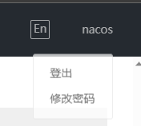
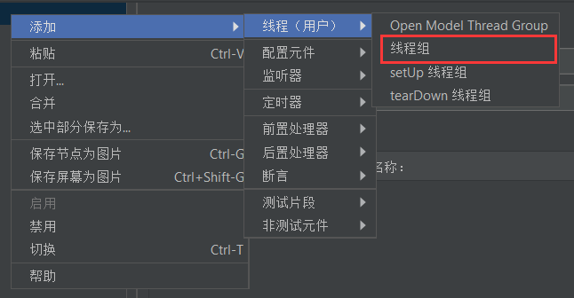
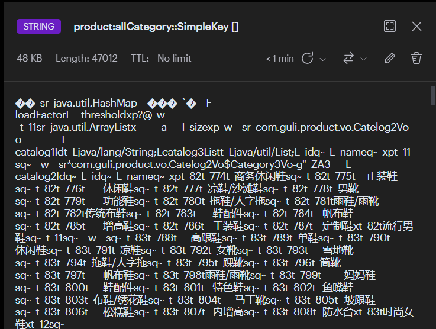
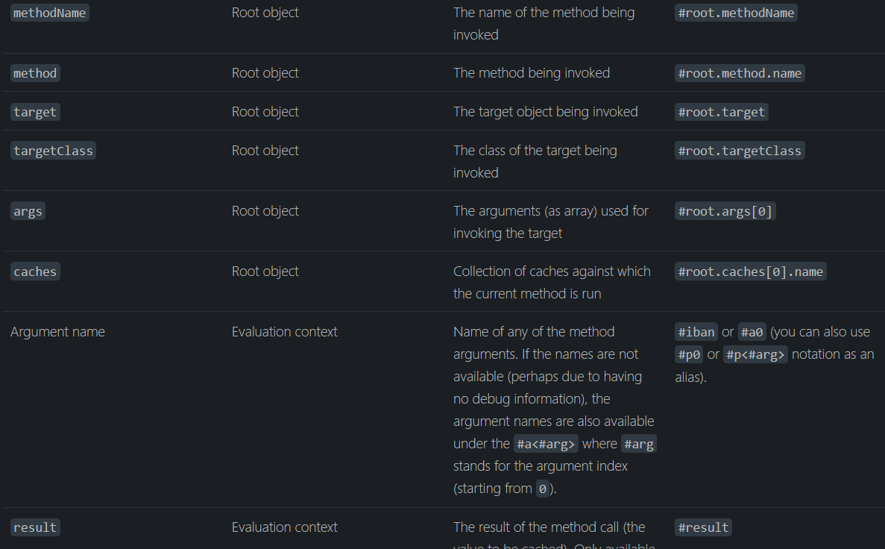

# Java项目

[TOC]

## 商城秒杀系统

[BV1SL411H7wN](https://www.bilibili.com/video/BV1SL411H7wN)  P52

学习目标：如何实现高并发高性能的系统，满足高性能，一致性，高可用的特点。

项目结构：


### 两次MD5加密

前端发送到服务器的时候需要加密一次，从后端再到持久层的时候在加密一次。MD5(MD5(PASS+salt)+salt)

添加POM依赖：

```xml
<dependency>
    <groupId>commons-codec</groupId>
    <artifactId>commons-codec</artifactId>
</dependency>

<dependency>
    <groupId>org.apache.commons</groupId>
    <artifactId>commons-lang3</artifactId>
</dependency>
```

Spring 中也提供了 `BCryptPasswordEncoder` 进行密码防止哈希碰撞

### MyBatis-Plus使用以及代码生成

> 可以快速生成Model，mapper，controller，service等java代码

添加依赖：

```xml
<dependency>
    <groupId>com.baomidou</groupId>
    <artifactId>mybatis-plus-boot-starter</artifactId>
    <version>3.4.3</version>
</dependency>

<dependency>
    <groupId>com.baomidou</groupId>
    <artifactId>mybatis-plus-generator</artifactId>
    <version>3.4.1</version>
</dependency>

<!--HTML模板引擎-->
<dependency>
    <groupId>org.freemarker</groupId>
    <artifactId>freemarker</artifactId>
</dependency>

<dependency>
    <groupId>mysql</groupId>
    <artifactId>mysql-connector-java</artifactId>
</dependency>
```

添加代码：[代码生成器](https://baomidou.com/guide/generator.html#代码生成器)

修改其中的部分代码配置（比如dsn，包名），运行，找到对应的表生成代码。

配置yaml：

```yaml
mybatis-plus:
  mapper-locations: classpath*:/mapper/**/*Mapper.xml
  type-aliases-package: com.xx.xxx.model
```


### 分布式Session

解决方案：Session复制，前端存储，session粘滞，后端集中存储，redis分布式解决

🔵方法一：使用SpringSession来实现分布式session

添加依赖：

```xml
<dependency>
    <groupId>org.springframework.boot</groupId>
    <artifactId>spring-boot-starter-data-redis</artifactId>
</dependency>

<!--lettuce 可能用到的对象池-->
<dependency>
    <groupId>org.apache.commons</groupId>
    <artifactId>commons-pool2</artifactId>
</dependency>

<dependency>
    <groupId>org.springframework.session</groupId>
    <artifactId>spring-session-data-redis</artifactId>
</dependency>
```

Spring配置redis：

```yml
spring:
  redis:
    host: 127.0.0.1
    port: 6379
    database: 0
    lettuce:
      pool:
        max-active: 8
        max-wait: 10000ms
```

> 配置完之后就已经实现分布式session，当访问网站即可将session存到redis中。

🔵方法二：直接将用户信息存储到redis中去。

首先写一个redis配置类用于操作redis

```java
@Configuration
public class RedisConf {

    @Bean
    public RedisTemplate<String, Object> redisTemplate(RedisConnectionFactory factory){
        RedisTemplate<String, Object> redisTemplate = new RedisTemplate<>();
        redisTemplate.setKeySerializer(new StringRedisSerializer());
        redisTemplate.setValueSerializer(new GenericJackson2JsonRedisSerializer()); // 序列化到redis中为json而非二进制
        // 对Hash类型序列化
        redisTemplate.setHashKeySerializer(new StringRedisSerializer());
        redisTemplate.setHashValueSerializer(new GenericJackson2JsonRedisSerializer());


        // 注入连接工厂
        redisTemplate.setConnectionFactory(factory);
        return redisTemplate;
    }
}
```

操作redis：

```java
@Autowired
RedisTemplate<String, Object> redisTemplate;

redisTemplate.opsForValue().set("user"+uid, user);
User user = (User) redisTemplate.opsForValue().get("user" + ticket);
```

### 优化登录功能

> 也可以使用拦截器实现

在做每一次业务请求的时候，都需要判断用户是否登录的session，比较麻烦，太重复了，进行参数处理。这里使用到的是**SpringMVC的自定义参数解析器**。

这个参数解析器，如果在controller中的形参中碰到某种类型的参数，即会进行参数解析，将其他参数传入到对应继承了`HandlerMethodArgumentResolver`接口的类中，进行处理，并且返回对应类型的参数。

原来的样子：

```java
@Autowired
IUserService userService;

@RequestMapping("/tolist")
public String toList(HttpServletRequest req, HttpServletResponse rsp, Model model, @CookieValue("userTicket") String ticket){
    if (!StringUtils.hasLength(ticket))return "login";
    //        User user = (User) session.getAttribute(ticket);
    User user = userService.getUserByCookie(ticket,req, rsp);
    if (user == null)return "login";
    model.addAttribute("user", user);
    return "goodsList";
}
```

功能改为：

```java
@RequestMapping("/tolist")
public String toList(Model model, User user){
    //        if (user == null)return "login";
    model.addAttribute("user", user);
    return "goodsList";
}
```

这里将req，rsp等形参变为了`user`，更加注重controller层的业务处理。

首先需要编写一个WebMVC配置类，继承`WebMvcConfigurer`，重写`addArgumentResolvers`方法来进行controller的参数解析。并且由于重写会导致springboot的默认静态资源目录失效，需要对`addResourceHandlers`进行重写，添加对应资源目录。

```java
@Configuration
@EnableWebMvc
public class WebConf implements WebMvcConfigurer {
    @Override
    public void addResourceHandlers(ResourceHandlerRegistry registry) {
        registry.addResourceHandler("/**").addResourceLocations("classpath:/static/");
    }

    @Autowired
    UserArgumentResolver userArgumentResolver;

    @Override
    public void addArgumentResolvers(List<HandlerMethodArgumentResolver> resolvers) {
        resolvers.add(userArgumentResolver);
    }
}
```

再编写对于User参数的解析器，遇到形参有User类型的controller层即开始解析：

这里使用NativeWebRequest来获取对应的HttpServletRequest和HttpServletResponse

```java
@Component
public class UserArgumentResolver implements HandlerMethodArgumentResolver {
    @Autowired
    IUserService userService;

    // 用于条件判断，如果执行返回true之后，才会执行`resolveArgument`方法, false 则不执行
    @Override
    public boolean supportsParameter(MethodParameter methodParameter) {
        return methodParameter.getParameterType().equals(User.class);
    }

    @Override
    public Object resolveArgument(MethodParameter methodParameter,
                                  ModelAndViewContainer modelAndViewContainer,
                                  NativeWebRequest webRequest,
                                  WebDataBinderFactory webDataBinderFactory) throws Exception {
        // 这里用于判断是否登录的流程
        HttpServletRequest request = webRequest.getNativeRequest(HttpServletRequest.class);
        HttpServletResponse rsp = webRequest.getNativeResponse(HttpServletResponse.class);
        String ticket = CookieUtils.getCookie(request, "userTicket");
        if (!StringUtils.hasLength(ticket))return null;
        return userService.getUserByCookie(ticket, request, rsp);
    }
}
```

### 秒杀功能实现

一、检查库存是否充足。二、每个用户只可以买一件，不可以重复买。

即实现库存减一，订单和秒杀订单中添加记录，基本的CURD操作。

### 压力测试

两个测试标准：QPS（Query Per Second），TPS（Transaction Per Second）

使用[JMeter](https://jmeter.apache.org/)工具来进行压力测试。

对于秒杀功能的测试，首先需要准备5000个用户及其Cookie来进行测试前置。

> 获取5000个用户Cookie可以使用Go语言多线程进行获取，速度极快。

将对应的用户和Cookie信息写入到CSV文件中，并且配置JMeter的CSV配置，导入5000个信息。


设置HTTP Cookie管理器：


开始运行。

> 这里会出现超卖了现象，库存出现负数的情况。

### 缓存

一般放到缓存中的是被频繁读取而且很少进行改动的数据。

🔵页面缓存

将整个HTML页面进行缓存，一般情况下都是前后端分离，这里因为使用到了thymeleaf的问题，将thymeleaf的整个模板+数据库数据放到redis中，并且设置60s秒过期时间。

```java
@RequestMapping(value = "/tolist", produces = "text/html;charset=utf-8")
@ResponseBody
public String toList(Model model, User user, HttpServletRequest request, HttpServletResponse rsp){
    // 缓存查询
    ValueOperations<String, Object> ops = redisTemplate.opsForValue();
    String html = (String) ops.get("goodsList");
    if (StringUtils.hasLength(html))return html;

    //        if (user == null)return "login";
    if (user == null)return null;
    model.addAttribute("user", user);
    model.addAttribute("goodsList", goodsService.findGoodsVo());
    // 手动渲染引擎
    WebContext context = new WebContext(request, rsp, request.getServletContext(), request.getLocale(), model.asMap());
    html = thymeleafViewResolver.getTemplateEngine().process("goodsList", context);
    if (StringUtils.hasLength(html))ops.set("goodsList", html,60, TimeUnit.SECONDS);
    return html;
}
```

🔵URL缓存：

即再redis中存储的字段为：`user:1` `user:2:tel`类似的格式。

🔵对象存储

如何去保证数据库和缓存数据的一致性，当进行数据库操作的时候需要对redis缓存中的信息进行删除清空，更新缓存中的信息，才能够保证前端页面获取到的不是旧的未修改的数据。

🔵页面静态化：

开启`Accept-Encoding:gzip,deflate`选项。

### 解决超卖

出现超卖的情况，可能是一个用户多次下单同一个商品，或者是在更新库存减一的时候没有验证库存量是否大于0，并且防止数据库过量访问。

1. 解决一个用户多次下单同一个商品

   简单的解决办法：在数据库表中字段添加唯一UNIQUE索引，防止重复。

3. 更新的时候使用验证`stock_count > 0`
   
   ```sql
   update t_seckill_goods set stock_count = stock_count - 1 where goods_id = ${goods.id} and stock_count > 0;
   ```

3. 防止数据库单用户过量访问：

   在用户成功下单之后，将数据加入到redis中，用户再次下单的时候检查redis中是否存在数据即可。

### RabbitMQ

添加Springboot依赖：

```xml
<dependency>
    <groupId>org.springframework.boot</groupId>
    <artifactId>spring-boot-starter-amqp</artifactId>
</dependency>
```

yml配置：

```yaml
spring:
  rabbitmq:
    host: localhost
    username: admin
    password: 123456
    virtual-host: /
    port: 5672
    listener:
      simple:
        concurrency: 10     # 消费者最小并发数量
        max-concurrency: 10
        prefetch: 1           # 限制消费这每次只能处理一个消息
        auto-startup: true
        default-requeue-rejected: true    # 被拒绝是否重新进入队列
```

声明交换机、队列和绑定：

```java
@Configuration
public class RabbitMQConfig {

    public static final String EXCHANGE_FANOUT = "fanoutEx01";
    @Bean
    public Queue queue01(){ return new Queue("queue01", true); }

    @Bean
    public Queue queue02(){ return new Queue("queue02", true); }

    @Bean
    public Queue queue03(){ return new Queue("queue03", true); }

    @Bean
    public FanoutExchange fanoutExchange01(){
        return new FanoutExchange(EXCHANGE_FANOUT);
    }

    @Bean
    public DirectExchange directExchange01(){
        return new DirectExchange("Direct01");
    }
    
    // Fanout 绑定

    @Bean
    public Binding binding01(){
        return BindingBuilder.bind(queue01()).to(fanoutExchange01());
    }

    @Bean
    public Binding binding02(){
        return BindingBuilder.bind(queue02()).to(fanoutExchange01()).;
    }

	// 绑定routingKey
    @Bean
    public Binding binding03(){
        return BindingBuilder.bind(queue03()).to(directExchange01()).with("routingKey");
    }
}
```

配置RabbitMQ生产者：

```java
@Service
@Slf4j
public class MQSender {
    @Autowired
    private RabbitTemplate rabbitTemplate;

    public void send(Object msg){
        log.info("发送消息:{}", msg);
        rabbitTemplate.convertAndSend(msg);
    }
}
```

配置消费者：

```java
@Service
@Slf4j
public class MQReceiver {
    @RabbitListener(queues = {"queue"})
    public void recv(Object msg){
        log.info("Recv Msg: {}", msg);

    }
}
```

### 接口优化

在redis中预减库存减少数据库的访问；通过内存标记等方法优化接口减少redis的访问；请求进入通过消息队列进行异步下单。

🔵预减库存+内存标记：

让对应的Controller实现`InitializingBean`类，并且实现`afterPropertiesSet()`方法，这个方法是在所有类加载完成后进行的初始化操作，即将数据库中的库存数量加载到redis中。每当一个秒杀请求进入的时候就使用redis的`decr`或者`incr`的原子操作进行库存-1。

当一个秒杀商品的库存变为0的时候，为了减少对访问redis，使用内存标记法来标记某个库存是否已经使用完毕，可以使用HashMap来进行标记。

```java
private Map<Long, Boolean> emptyStockMap = new HashMap<>();

@RequestMapping("/doSecKill")
public String doSecKill(Model model, User user, Long goodsId) throws JsonProcessingException {
    if (user == null) return "login";
    model.addAttribute("user", user);

    // 方案2：使用redis进行库存预减
    ValueOperations<String, Object> ops = redisTemplate.opsForValue();
    SeckillOrder seckillOrder = (SeckillOrder) ops.get("user:" + user.getId() + ":" + goodsId);
    if (seckillOrder != null) {
        model.addAttribute("error", RespBeanEnum.REPEAT_ERROR.getMsg());
        return "secKillFail";
    }

    // 内存标记，防止大量访问redis
    if (emptyStockMap.get(goodsId)){
        model.addAttribute("error", RespBeanEnum.EMPTY_STOCK.getMsg());
        return "secKillFail";
    }

    Long stock = ops.decrement("SecKillGoodsStockCount:" + goodsId);
    if (stock < 0) {
        emptyStockMap.put(goodsId, true);
        ops.increment("SecKillGoodsStockCount:" + goodsId);
        model.addAttribute("error", RespBeanEnum.EMPTY_STOCK.getMsg());
        return "secKillFail";
    }

	// 发布消息队列
    SeckillMessage seckillMessage = new SeckillMessage(user, goodsId);
    mqSender.sendSeckillMessage(seckillMessage);

    //        model.addAttribute("order", order);
    //        model.addAttribute("goods", goods);
    model.addAttribute("status", 0);
    return "orderDetail";
}

/**
* 系统初始化，将数据库库存加载到redis
*/
@Override
public void afterPropertiesSet() throws Exception {
    List<GoodsVo> list = goodsService.findGoodsVo();
    if (CollectionUtils.isEmpty(list)) return;
    list.forEach(vo -> {
        redisTemplate.opsForValue().set("SecKillGoodsStockCount:" + vo.getId(), vo.getStockCount());
        emptyStockMap.put(vo.getId(), false);
    });
}
```

🔵使用消息队列处理事件：

构建一个Topic类型的交换机，队列并且绑定

```java
@Configuration
public class RMQTopicConf {
    public static final String QUEUE = "seckillQueue";
    public static final String EXCHANGE = "sckillExchange";


    @Bean
    public Queue queue(){
        return new Queue(QUEUE);
    }

    @Bean
    public TopicExchange topicExchange(){
        return new TopicExchange(EXCHANGE);
    }

    @Bean
    public Binding binding(){
        return BindingBuilder.bind(queue()).to(topicExchange()).with("seckill.#");
    }
}
```

进行消息发送：

> RabbitMQ中存储的类型只能是`String`, `byte[]`以及序列化后的信息，不能直接传入对象，可以使用jackson来进行pojo和string类型的互相转换。

```java
@Service
@Slf4j
public class MQSender {
    @Autowired
    private RabbitTemplate rabbitTemplate;

    public void sendSeckillMessage(Object msg) throws JsonProcessingException {
        log.info("发送消息：{}", msg);
        String s = JSONUtils.Pojo2String(msg);
        rabbitTemplate.convertAndSend(RMQTopicConf.EXCHANGE, "seckill.message", s);
    }
}
```

进行消息接受：

```java
@Service
@Slf4j
public class MQReceiver {
    @Autowired
    private IGoodsService goodsService;
    @Autowired
    private RedisTemplate<String,Object> redisTemplate;
    @Autowired
    private IOrderService orderService;

    @RabbitListener(queues = {RMQTopicConf.QUEUE})
    public void recvSeckillMessage(String s) throws JsonProcessingException {
        log.info("收到消息{}", s);
        SeckillMessage msg = JSONUtils.String2Pojo(s, SeckillMessage.class);
        Long goodsId = msg.getGoodsId();
        User user = msg.getUser();
        GoodsVo goodsVo = goodsService.findGoodsVoById(goodsId);
        if (goodsVo.getStockCount() < 1)return;
        // 参考订单，判断是否重复抢购
        ValueOperations<String, Object> ops = redisTemplate.opsForValue();
        SeckillOrder seckillOrder = (SeckillOrder) ops.get("user:" + user.getId() + ":" + goodsId);
        if (seckillOrder != null)return;
        orderService.seckill(user,goodsVo);
    }
}
```

### Redis实现分布式锁

使用`setIfAbsent()`和lua脚本。。

### 安全优化

不直接显示抢购的URL，比如每个用户使用特定的URL，使用redis可以实现。

## 博客

### 网易云音乐外链

数字为音乐id

```
http://music.163.com/song/media/outer/url?id=433107530.mp3
```

也可以使用jsdelivr加速github

```
https://cdn.jsdelivr.net/gh/ACCOUNT/PROJECT@latest/lyrics/1340143947.lrc
```

### 跨域请求下的Cookie设置

同源策略三个标准：同协议(`http`, `https`)，同域名，同端口

需要在后端设置`allowCredentials`，在前端设置`withCredentials`来允许携带Cookie信息

并且最好在添加cookie的时候添加`HttpOnly`.

```java
@Configuration
@EnableWebMvc
public class WebConf implements WebMvcConfigurer {

    /**
     * 设置跨域请求
     */
    @Override
    public void addCorsMappings(CorsRegistry registry) {
        registry.addMapping("/**")
                .allowedOrigins("http://localhost:8081", "http://localhost:8080")
                .allowedMethods("POST", "GET", "PUT", "OPTIONS", "DELETE")
                .allowedHeaders("*")
                .allowCredentials(true)     // 允许设置Cookie
                .maxAge(3600);
    }
}
```

### 拦截器的使用


如果需要配置拦截器，需要编写一个类来实现`HandlerInterceptor`接口，并且根据需求覆写其中的方法，`preHandle`，`postHandle`，`afterCompletion`，三个方法分别在请求前，请求后，完成请求处理后进行触发，`preHandle`返回true表示放行，返回false表示拦截。

```java
@Slf4j
@Configuration
public class SessionInterceptor implements HandlerInterceptor {

    @Autowired
    private RedisTemplate<String, Object> redisTemplate;

    @Override
    public boolean preHandle(HttpServletRequest request, HttpServletResponse response, Object handler) throws Exception {
        // 拦截业务
        return false;
    }

    @Override
    public void postHandle(HttpServletRequest request, HttpServletResponse response, Object handler, ModelAndView modelAndView) throws Exception {
        HandlerInterceptor.super.postHandle(request, response, handler, modelAndView);
    }

    @Override
    public void afterCompletion(HttpServletRequest request, HttpServletResponse response, Object handler, Exception ex) throws Exception {
        HandlerInterceptor.super.afterCompletion(request, response, handler, ex);
    }
}
```

[Spring MVC拦截器中的第三个参数handler](https://blog.csdn.net/Dongguabai/article/details/81160361)

前两个参数分别是数据请求和数据响应，第三个参数是`HandlerMethod`，可以用来获取controller中对应处理此请求的函数名机器信息。

```java
@Override
public boolean preHandle(HttpServletRequest request, HttpServletResponse response, Object handler) throws Exception {
    if (handler instanceof HandlerMethod){
        var m = (HandlerMethod)handler;
        log.info("controller中对应处理函数名称：{}", m.getMethod().getName());
        log.info("参数数目：{}", m.getMethod().getParameters().length);
        log.info("方法包名：{}", m.getBean().getClass().getName());
    }
    return true;
}
```

### 拦截器中使用redis

[springboot拦截器无法注入redisTemplate](https://blog.csdn.net/zxl646801924/article/details/99544463)

由于拦截器执行实在bean实例化之前执行的，因此在拦截器中使用`redisTemplate`会导致空指针异常。

因此需要在拦截器执行之前实例化Bean。

```java
@Slf4j
@Configuration
public class SessionInterceptor implements HandlerInterceptor {
    @Bean	// 实例化Bean
    public SessionInterceptor getSessionInterceptor(){
        return new SessionInterceptor();
    }

    @Autowired
    private RedisTemplate<String, Object> redisTemplate;

    @Override
    public boolean preHandle(HttpServletRequest request, HttpServletResponse response, Object handler) throws Exception {

        // 获取到Cookie，查redis，查到则放行，查不到打回。 
        /*redisTemplate*/
        String userSign = CookieUtils.getCookie(request, "userSign");
        if (StringUtils.hasLength(userSign)){
            Object o = redisTemplate.opsForValue().get("webblog:userSign:" + userSign);
            if (o != null)return true;
        }
        RspStatus fail = RspStatus.fail(RspStatusEnum.SESSION_EXPIRED);
        String ret = new ObjectMapper().writeValueAsString(fail);
        response.getWriter().write(ret);
        return false;
    }

}
```

WebConf

```java
@Configuration
@EnableWebMvc
public class WebConf implements WebMvcConfigurer {

    public static final String[] excludeSessionPath = new String[]{"/user/login", "/user/register", "/music/**", "/gapi/**"};

    @Autowired	/自动取出Bean
    private SessionInterceptor sessionInterceptor;

    // 对于非登录用户进行拦截
    @Override
    public void addInterceptors(InterceptorRegistry registry) {
        registry.addInterceptor(sessionInterceptor)
                .addPathPatterns("/**")
                .excludePathPatterns(Arrays.asList(excludeSessionPath));
    }
}
```

### CORS与拦截器

一般情况下使用的是实现`WebMvcConfigurer`接口来进行实现跨域请求，但是有一个bug，当项目中存在拦截器的时候，如果一个请求路径在拦截器的排除路径`excludePath`之中，相当于请求放行，而这个逻辑相当于当一个请求通过拦截器之后，就相当于一次请求返回了，而又没有经过CorsMapping函数，因此浏览器就会自动抛弃数据包，导致CORS警告出现。

正确的配置方式：[CorsFilter](https://docs.spring.io/spring-framework/docs/current/reference/html/web.html#mvc-cors-filter)

只需要在容器中放入一个`CorsFilter`的Bean就可以。

```java
@Configuration
public class CorsConf {
    public static final String[] ALLOWED_ORIGINS= new String[]{"http://localhost:8081"};

    @Bean
    public CorsFilter corsFilter(){
        CorsConfiguration corsConfiguration = new CorsConfiguration();
        corsConfiguration.addAllowedHeader("*");
        corsConfiguration.addAllowedMethod("*");
        corsConfiguration.setAllowedOriginPatterns(Arrays.asList(ALLOWED_ORIGINS));
        corsConfiguration.setMaxAge(3600L);
        corsConfiguration.setAllowCredentials(true);


        UrlBasedCorsConfigurationSource source = new UrlBasedCorsConfigurationSource();
        source.registerCorsConfiguration("/**",corsConfiguration);
        return new CorsFilter(source);
    }
}
```

### Websocket聊天室

🔵添加依赖：

```xml
<!--WebSocket-->
<dependency>
    <groupId>org.springframework.boot</groupId>
    <artifactId>spring-boot-starter-websocket</artifactId>
</dependency>
```

首先要在config中配置一个`ServerEndpointExporter`的Bean，这个类会自动注册使用了<b>@ServerEndPoint</b>注解声明的Websocket入口。

```java
/**
 *首先要注入ServerEndpointExporter，这个类会自动注册使用了<b>@ServerEndPoint</b>注解
 * 声明的Websocket入口
 */
@Configuration
public class WebsocketConf {
    @Bean
    public ServerEndpointExporter serverEndpointExporter(){
        return new ServerEndpointExporter();
    }

    @Autowired
    public void setChatroomService(IChatroomService chatroomService){
        WebsocketEndpoint.chatroomService = chatroomService;
    }
}
```

🔵定义服务器WebSocket入口：

使用`@ServerEndpoint(value = "/websocket/{userId}") `注解标注ws的url入口地址，对应的地址为`ws://host:port/websocket/{userid}`，并且使用`@OnOpen`，`@OnClose`，`@OnMessage`，`@OnError`来绑定服务器端的ws四个事件。

```java
//Websocket业务代码都写在这里
// ws://host:8080/websocket/{userId}
@ServerEndpoint(value = "/websocket/{userId}")      // Websocket对外暴露的连接入口
@Component
@Slf4j
public class WebsocketEndpoint {

    public static IChatroomService chatroomService;

    /**
     * 当有客户端连接的时候，在对应的连接池中添加session
     * @param session Websocket交互时候会自动传入的参数
     * @param userId 用户id
     */
    @OnOpen
    public void onOpen(Session session, @PathParam("userId") String userId) throws IOException {
        // 将会话存到连接池中
        log.info("有连接进入：{}, session: {}", userId, session.getId());
        WebsocketSessionPool.chatRoomSessions.put(userId, session);
        // 有客户端进入，就发送其前25条记录
        List<Object> msgs = chatroomService.getLast25Message();
        for (Object o : msgs) {
            //TODO getAsyncRemote getBasicRemote
            session.getBasicRemote().sendText(JSONUtils.pojo2string(o));
        }
    }

    @OnClose
    public void onClose(Session session) throws IOException {
        log.info("关闭连接, session: {}", session.getId());
        WebsocketSessionPool.closeSession(session.getId());
    }

    @OnMessage
    public void onMessage(Session session, String msg) throws JsonProcessingException {
        log.info("有消息传入：{}, session: {}", msg, session.getId());
        WSChatroomMessage one = JSONUtils.string2pojo(msg, WSChatroomMessage.class);
        chatroomService.pushMessage(one);
        WebsocketSessionPool.broadcastMsg(msg, session.getId());
    }
}
```

🔵实现群发广播：

想要实现群发的功能就必须要保存各个客户端与服务器之间的会话（Session），这里使用`ConcurrentHashMap`结构**会话池**来解决并发访问的情况，将各个会话存储到这个变量中。通过变量中的数据遍历来实现群发，并且可以添加、删除对应的会话。

```java
public class WebsocketSessionPool {
    public static Map<String, Session> chatRoomSessions = new ConcurrentHashMap<>();

    public static void closeSession(String sessionId) throws IOException {
        for (String uid : chatRoomSessions.keySet()) {
            Session session = chatRoomSessions.get(uid);
            if (session.getId().equals(sessionId)){
                chatRoomSessions.remove(uid);
                session.close();
                break;
            }
        }
    }

    /**
     * 群发到此房间所有的用户
     * @param msg 消息体
     */
    public static void broadcastMsg(String msg, String sessionId){
        for (String sid : chatRoomSessions.keySet()) {
            chatRoomSessions.get(sid).getAsyncRemote().sendText(msg);
        }
    }
}
```

🔵私聊：

即在会话池中找到对应的人发送消息即可。

🔵异常处理（重连）：

前端JS处理，在onerror的时候执行重新连接

🔵心跳检测：

客户端定期发送消息到服务器端是否存活。

🔴异步发送消息与同步发送消息

[Spring專案中使用webservice實現h5的websocket通訊](https://www.itread01.com/p/1445678.html)

在一次性给一个用户发送多个消息的时候，如果使用`getAsyncRemote()`来进行异步发送消息，如果发送消息过快，可能会出现上一条消息还未发送完毕，下一条消息就会发送过来的情况，会导致`TEXT_FULL_WRITING`的异常，如果需要保证信息的顺序，就使用`getBasicRemote()`来进行发送消息，如果只是发送单条少量消息或者消息的顺序不是很重要的时候，可以采用异步发送。

同步发送消息，在用户登录的时候加载数据库中的历史消息。

```java
@OnOpen
public void onOpen(Session session, @PathParam("userId") String userId) throws IOException {
    // 将会话存到连接池中
    log.info("有连接进入：{}, session: {}", userId, session.getId());
    WebsocketSessionPool.chatRoomSessions.put(userId, session);
    // 有客户端进入，就发送其前n条记录
    List<Object> msgs = chatroomService.getLast25Message();
    for (Object o : msgs) {
        session.getBasicRemote().sendText(JSONUtils.pojo2string(o));
    }
}
```

🔴在Websocket服务器类中使用service层

如果直接使用会导致service空指针异常，并不能自动`@AutoWire`，需要在WebsocketConf配置类中自动链接，然后再服务器类中加入service的静态变量。

设置静态变量：

```java
//Websocket业务代码都写在这里
// ws://host:8080/websocket/{userId}
@ServerEndpoint(value = "/websocket/{userId}")      // Websocket对外暴露的连接入口
@Component
@Slf4j
public class WebsocketEndpoint {

    public static IChatroomService chatroomService;

	 // Other code ....
}
```

在配置类中自动链接：

```java
@Configuration
@EnableWebSocket
public class WebsocketConf {
    @Bean
    public ServerEndpointExporter serverEndpointExporter(){
        return new ServerEndpointExporter();
    }

    @Autowired
    public void setChatroomService(IChatroomService chatroomService){
        WebsocketEndpoint.chatroomService = chatroomService;
    }
}
```

### Mybatis-plus分页插件

参考：[分页插件](https://baomidou.com/guide/page.html)

添加MP配置：

```java
@Configuration
public class MybatisPlusConf {
    // 最新版
    @Bean
    public MybatisPlusInterceptor mybatisPlusInterceptor() {
        MybatisPlusInterceptor interceptor = new MybatisPlusInterceptor();
        interceptor.addInnerInterceptor(new PaginationInnerInterceptor(DbType.H2));
        return interceptor;
    }
}
```

在Mapper中添加对应接口，添加变量`Page<?>`类型的分页配置变量。

```java
public interface TimeCapsulesMapper extends BaseMapper<User> {
    Page<User> selectDynamicsByPage(Page<?> pageConf, Long userId);
}
```

查询数据：

```java
Page<User> pageConf = new Page<>(1, 5);	// 查询第一页，每页5个数据
Page<User> capsulesPage = tcMapper.selectDynamicsByPage(pageConf, userId);
List<User> records = capsulesPage.getRecords();
```

### 定时任务SpringTask

定时同步redis数据到MySQL数据库。

cron表达式：

| **名称** | **必需** | **值**          | **允许的特殊字符** |
| -------- | -------- | --------------- | ------------------ |
| 秒       | 是       | 0-59            | , - * / R          |
| 分钟     | 是       | 0-59            | , - * / R          |
| 小时     | 是       | 0-23            | , - * / R          |
| 日       | 是       | 1-31            | , - * / ? L W      |
| 月       | 是       | 1-12 或 JAN-DEC | , - */             |
| 星期几   | 是       | 0-6 或 SUN-SAT  | , - / ? L #        |
| 年       | 否       | 1970-2099       | , - * /            |

举例：

* `0/2 * * * * ?` 每两秒同步一次
* `0 0/5 * * * ?` 每5分钟执行一次


每秒运行一次的任务

```java
@Component
public class SyncRedisToDB {
    @Scheduled(cron = "0/2 * * * * ?")	
    public void taskdemo(){
        System.out.println("Task");
    }
}
```

**解决单线程运行定时任务：**

参考：

[定时任务@Scheduled之单线程多线程问题](https://blog.csdn.net/Mr_EvanChen/article/details/103408290)

[spring-boot @Scheduled实现多线程并发定时任务](https://blog.csdn.net/qq_32218473/article/details/102720024)

* 方法一：扩大原定时任务线程池中的核心线程数

  ```java
  @Configuration
  public class ScheduleConf implements SchedulingConfigurer {
  
      public static final int scheduledPoolSize = 5;
  
      @Override
      public void configureTasks(ScheduledTaskRegistrar taskRegistrar) {
          taskRegistrar.setScheduler(Executors.newScheduledThreadPool(scheduledPoolSize));
      }
  }
  ```

* 方法二：把Scheduled配置成成多线程执行

  使用`@EnableAsync`注解，但是任务1中的卡死线程越来越多，会导致线程池占满，还是会影响到定时任务。

  ```java
  @Configuration
  @EnableAsync
  class ScheduleConf2  {
  
      public static final int scheduledPoolSize = 5;
  
      @Bean
      public TaskScheduler taskScheduler () {
          ThreadPoolTaskScheduler taskScheduler = new ThreadPoolTaskScheduler();
          taskScheduler.setPoolSize(scheduledPoolSize);
          return taskScheduler;
      }
  }
  ```

  代码：

  ```java
  @Component
  public class SyncRedisToDB {
      
      @Scheduled(cron = "0/2 * * * * ?")
      @Async
      public void taskdemo(){
          System.out.println("Task");
      }
  }
  ```

* 方法三：直接将@Scheduled注释的方法内部改成异步执行

  ```java
  @Component
  public class SyncRedisToDB {
  
      ExecutorService service = Executors.newFixedThreadPool(5);
  
      @Scheduled(cron = "0/2 * * * * ?")
      public void taskdemo(){
          service.execute(()->{
              System.out.println("task");
          });
      }
  }
  ```

### 正则表达式

参考：[Java 正则捕获组](https://www.runoob.com/w3cnote/java-capture-group.html)

🔵设置匹配规则：

```java
Pattern pattern = Pattern.compile("dynamic:(?<id>[0-9]+):(thumbs|views)");
```

🔵是否**完全**匹配：

```java
String s = "This is a sentence";
boolean b = pattern.matcher(s).match();
```

🔵是否存在**部分**匹配：

```java
boolean b = pattern.matcher(s).find();
```

🔵捕获组（例如`user:([\d]+):views`）：

即匹配获取圆括号中的内容

```java
String id = pattern.matcher(s).group()
```

给捕获组设置name属性方便获取

```java
Pattern pattern = Pattern.compile("user:(?<userId>[\d]+):views");
String id = pattern.matcher(s).group("userId");
```

使用`?<key>`的形式进行

### 数据库同步到redis

redis同步到数据库见<a href="#定时任务SpringTask">链接</a>

一般用在常用读取操作上，在服务器初始化的时候进行操作。

首先需要在对应的类上实现接口`InitializingBean`，并且实现`afterPropertiesSet()`方法，编写对应的业务即可。

### Vue路由中history模式nginx404解决方法

```conf
location / {
　　# .....
　　try_files $uri $uri/ /index.html;
```

[nginx +VUE 解决404 问题](https://www.jianshu.com/p/989d8bc719c4)

## IPv6建站流程梳理

最近想着怎么将以前的接电脑重新利用起来，想到学校宽带可以分配IPv6地址，立马产生了一个想法，把我的旧电脑当成一个服务器，我的旧电脑8核8G的配置，虽然校园网只有10M但也比腾讯云的2核1G1M的服务器强多了。

而且手机流量运营商默认支持IPv6，这样就可以随时随地访问自己的服务器了。

[IPv6閒談-一起玩玩IPv6自動配置 - 台部落 (twblogs.net)](https://www.twblogs.net/a/5c7f7082bd9eee35fc133b9b)

### 1. 检查IPv6

首先需要直插网线来检验自己的使用的运营商是否支持IPv6，在window端使用`ipconfig`指令可以查看是否有IPv6地址。

如果有IPv6地址会显示如下：

```
以太网适配器 以太网:

   连接特定的 DNS 后缀 . . . . . . . :
   IPv6 地址 . . . . . . . . . . . . : 2401:3a2:2194:6320::1001
   IPv6 地址 . . . . . . . . . . . . : 2401:3a2:2194:6320:6989:1d24:1d7b:ae1c
   临时 IPv6 地址. . . . . . . . . . : 2401:3a2:2194:6320:3496:447e:914c:e38d
   本地链接 IPv6 地址. . . . . . . . : fe80::6989:1d24:1d7b:391c%9
   IPv4 地址 . . . . . . . . . . . . : 192.168.1.101
   子网掩码  . . . . . . . . . . . . : 255.255.255.0
   默认网关. . . . . . . . . . . . . : fe80::6a77:24ff:feb1:7aa9%9
                                       192.168.1.1
```

其中`2401:`开头的地址为全球IPv6地址，`fe80:`开头的则为本地IPv6地址。如果只有本地IPv6地址则表明并未开启IPv6.

对于部分windows设备的默认设置可能并未开启IPv6协议，可以通过打开`控制面板->网络和共享中心->更改适配器设置`，选择当前自己的网络，右键属性中网络选项卡中查看是否勾选`Internet协议版本6`，没勾选请勾选上。


如果还未设置，需要检查你的路由器、光猫是否分配IPv6地址，或者联系运营商。

在linux中使用`ip addr | grep inet6`或者`ifconfig | inet6`来查看是否分配IPv6地址。

```sh
➜  ~ ip addr | grep inet6
    inet6 ::1/128 scope host 
    inet6 2401:3a2:2094:6320::1000/128 scope global dynamic noprefixroute 
    inet6 2401:3a2:2094:6320:8130:33bf:6d5c:5f8f/64 scope global temporary dynamic 
    inet6 2401:3a2:2094:6320:b5ea:5511:1fc9:8d28/64 scope global dynamic mngtmpaddr noprefixroute 
    inet6 fe80::66e:39a1:916:7c17/64 scope link noprefixroute
```

检验是否成功连接IPv6，是否可以成功访问以下网址:

* <a href="https://test-ipv6.com/" target="blank_">test-ipv6</a>
* <a href="http://speed.neu6.edu.cn/" target="blank_">东北大学IPv6测速站</a>

### 2. 硬件准备

检查好自己的网络已经支持了IPv6的话，就可以开始准备硬件了。

> 注意这里的路由器是为了方便非流量设备进行IPv6访问，比如平板、电脑、电视、智能语音助手等设备。如果没有这个需求，也可以只使用网线进行连接。

1. 支持IPv6的路由器（少部分路由器支持）这里选择了`TL-WDR5620千兆版`，某东大约￥130购入。
2. 支持IPv6的设备（95%设备都支持）

检查路由器是否成功分配到IPv6。


### 3. 设置IPv6临时地址

临时地址大概意思是一个设备的ip不固定，为了隐私考虑。ipv6地址不像ipv4一样使用NAT公用一个ip，IPv6使得设备间连接更容易，但是更容易造成安全隐患。为此操作系统可以选用多个临时ip，每个ip有固定的生命周期。ipv6自动配置时使用你的MAC地址来选择一个ip地址，这样其它设备根据你的ip地址可能会算出你的mac地址（全球唯一)。

而临时IPv6地址的出现就是为了解决这个安全隐患，临时IPv6地址会上一级网络获得的`租约时间`来改变，如果时间到了会自动切换一个临时IPv6地址，使得设备的安全性提高。

对于普通的**客户端**来说，临时IPv6地址的开启可以某种程度上有效提高设备的安全性。

而对于**服务器端**来说，并不想让其他的用户通过临时IPv6地址进行访问，要求其必须从固定的IPv6地址访问，因此需要进行配置。

windows端：

* 开启临时IPv6地址：`netsh interface ipv6 set privacy state=enable`
* 关闭临时IPv6地址：`netsh interface ipv6 set privacy state=disable`

Linux端：

参考：[linux设置ipv6临时地址](https://www.cnblogs.com/makefile/p/5040615.html)

查看是否开启IPv6临时地址：

```sh
> sudo sysctl -a | grep tempaddr     
net.ipv6.conf.all.use_tempaddr = 2
net.ipv6.conf.default.use_tempaddr = 2
net.ipv6.conf.docker0.use_tempaddr = 2
net.ipv6.conf.eno1.use_tempaddr = 0
net.ipv6.conf.lo.use_tempaddr = -1
net.ipv6.conf.veth0b4fc75.use_tempaddr = 2
net.ipv6.conf.wlo1.use_tempaddr = 2
```

如果是无线网卡就修改`wlol`的配置，如果是以太网就修改`eno1`的配置。

* 开启：

  ```sh
  vim /etc/sysctl.d/10-ipv6-privacy.conf
  # 设置以下
  net.ipv6.conf.default.use_tempaddr = 0
  # 推出vim
  sysctl --system	# 使得配置生效
  ```

* 关闭：设置为`net.ipv6.conf.default.use_tempaddr = 2`重新连接网络即可。

### 4. 防火墙设置

服务器如果是indows中需要关闭网络防火墙，在`控制面板\系统和安全\Windows Defender 防火墙\自定义设置`中`关闭windows Defender防火墙`，这个防火墙默认会拦截来自内网和外网的80或者443端口。


在Linux暂时还没有遇到，默认是全部放行。

### 5. 域名解析和DDNS配置

这里使用[阿里云](https://www.aliyun.com/)的域名和[DNSPod](https://www.dnspod.cn/)的https证书申请。这里使用阿里云是因为其有丰富的设置API，可以在远端使用程序即可设置域名DDNS解析。

首先是测试自己的域名是否能够正常解析到自己的IPv6地址：

进入阿里云域名控制台后选择已经创建好的域名后，点击**解析**，然后添加记录。

* 记录类型选择`AAAA`，用于指向一个IPv6的地址，当前中国只有IPv6地址的服务器无需备案。
* 主机记录根据自己选择，这里我选择了`@`
* 解析路线默认即可
* 记录值即自己服务器的IPv6地址，填写服务器的**固定**IPv6地址。
* TTL设置为10分钟最短的更新时间。

登录到阿里云控制台后进入[RAM 访问控制](https://ram.console.aliyun.com/users)，点击创建用户，并且勾选`Open API 调用访问`用于生成调用阿里云API的Token。创建完成后一定要保存自己的`AccessKey ID`和`AccessKey`这是在后来API中重要的验证参数。

创建完成后为其添加两个权限`AliyunDomainFullAccess`和`AliyunDNSFullAccess`，这两个是允许这个APIToken进行控制的权限，分别是管理域名服务的权限和管理云解析(DNS)的权限，否则之后使用API无法对DDNS进行修改和设置。

由于IPv6的地址由于运营商的设置可能会发生变换，因此DDNS的设置就是为了让自己的IPv6地址与域名解析实时更新。

DDNS设置使用Github的开源项目：https://github.com/NewFuture/DDNS

具体用法见https://github.com/NewFuture/DDNS/blob/master/README.md。

### 6. Nginx配置

如果使用nginx来配置服务器，需要监听IPv6地址对应的端口，如果不开启会导致无法使用IPv6地址访问。

```
server{
	listen 80;
	listen [::]:80;	# IPv6地址
}
```

## 谷粒商城

[BV1np4y1C7Yf](https://www.bilibili.com/video/BV1np4y1C7Yf?p=22) P28

TODO：

* Spring Gateway
* Spring Cache
* 业务表结构的设计
* 事务传播行为和分布式事务 Seata
* Sentinel

### 1. 配置环境

配置 MySQL：

```sh
docker run -p 3306:3306 --name mysql01 -v /data/mysql01/conf:/etc/mysql	-v /data/mysql01/log:/var/log/mysql -v /data/mysql01/data:/var/lib/mysql -v /data/mysql01/mysql-files:/var/lib/mysql-files -e MYSQL_ROOT_PASSWORD=root -d mysql:8.0
```

修改 MySQL 配置文件设置编码：

```sh
vim /data/mysql01/conf/my.cnf
```

```
[client]
default-character-set=utf8

[mysql]
default-character-set=utf8

[mysqld]
init_connect='SET collation_connection = utf8_unicode_ci'
init_connect='SET NAMES utf8'
character-set-server=utf8
collation-server=utf8_unicode_ci
skip-character-set-client-handshake
skip-name-resolve
```

配置 redis：

```sh
# 首先创建在实体机创建 redis.conf 文件
mkdir -p data/redis01/conf
touch /data/redis01/conf/redis.conf
# 运行容器
docker run -d -p 6379:6379 --name redis01 -v /data/redis01/data:/data -v /data/redis01/conf/redis.conf:/etc/redis/redis.conf redis redis-server /etc/redis/redis.conf --save 60 1
```

使用 docker 自动启动容器：

```sh
docker update mysql01 --restart=always
docker update redis01 --restart=always
```

为数据库创建表结构，源码地址[Link](https://share.weiyun.com/bO0OZMCv)，这些表的特点就是**没有外键**。

```sql
# 商品系统
create database `gulimall_pms` DEFAULT CHARACTER SET utf8mb4 COLLATE utf8mb4_unicode_ci;
# order
create database `gulimall_oms` DEFAULT CHARACTER SET utf8mb4 COLLATE utf8mb4_unicode_ci;
# user
create database `gulimall_ums` DEFAULT CHARACTER SET utf8mb4 COLLATE utf8mb4_unicode_ci;
# 营销系统
create database `gulimall_sms` DEFAULT CHARACTER SET utf8mb4 COLLATE utf8mb4_unicode_ci;
# 库存系统
create database `gulimall_wms` DEFAULT CHARACTER SET utf8mb4 COLLATE utf8mb4_unicode_ci;
# 管理员系统
create database `gulimall_admin` DEFAULT CHARACTER SET utf8mb4 COLLATE utf8mb4_unicode_ci;

# 然后将对应的 sql 文件在对应的库中执行
```

clone 人人开源的三个项目：renren-fast、renren-fast-vue 以及 renren-generator，用于后台管理。

```sh
# 后台管理
git clone https://gitee.com/renrenio/renren-fast.git
# 前端代码
git clone https://gitee.com/renrenio/renren-fast-vue.git
# 代码生成器
https://gitee.com/renrenio/renren-generator.git
```

* 后端配置

  将 renren-fast 整个包移动到项目下，并且执行的 db 文件夹下的所有对应数据库在 gulimall_admin 库中执行。

  修改 renren-fast 中 Spring 配置信息，将其中的 mysql 连接地址进行修改。

  配置完毕之后就可以在 `http://localhost:8080/renren-fast/` 中进行访问。

* 前端配置：

  在 renren-fast-vue 目录下执行：
  ```sh
  npm config set registry http://registry.npm.taobao.org
  # 安装依赖，可以解决墙内安装问题
  cnpm install
  # 开启项目
  npm run dev
  ```

  会存在 Nodejs 版本的问题，最好使用 `node v10.16.3` 版本。害怕与本地冲突则使用 `nvm` 进行 nodejs 版本管理。

  其他问题见[FAQ renren-fast-vue](https://github.com/renrenio/renren-fast-vue/wiki/FAQ)

  在进行多机部署的时候需要对 webpack.config.js 的傻哔设计中添加 `allowedHosts`

MyBatis-Plus 配置：配置表的主键 ID 自增

```yaml
mybatis-plus:
 global-config:
   db-config:
     id-type: auto
```


将 renren-generator 同样移到项目下。

### 2. SpringCloud

微服务包含注册中心、配置中心、网关。

注册中心：相当于服务的登记处，方便用于服务发现。

配置中心：各个服务配置众多，单个修改服务十分麻烦，需要配置中心来集中进行配置。

网关：用于鉴权，过滤，路由等。


Spring Cloud Alibaba的组件：

* Nacos：注册中心、配置中心
* Ribbon：负载均衡
* OpenFeign：声明式 HTTP 客户端，整合了 Ribbon 负载均衡和 Hystrix 服务熔断。
* Sentinel：服务容错（限流、降级、熔断）
* Gateway：API 网关(webflux 编程模式)
* Sleuth: 调用链监控
* Seata：分布式事务解决方案

#### a. Nacos 注册中心

> 单机部署 nacos 需要在执行模式改为 `standalone`，或者添加 `-m standalone`

如何使用 Nacos：[Nacos Demo](https://github.com/alibaba/spring-cloud-alibaba/blob/2021.x/spring-cloud-alibaba-examples/nacos-example/nacos-discovery-example/readme-zh.md)

1. 首先[下载](https://github.com/alibaba/nacos/releases) 并且开启 Nacos Server

   ```sh
   tar -zxvf nacos-server-2.1.2.tar.gz
   bash nacos/bin/startup.sh -m standalone
   ```

   得到对应的地址：http://ip:8848/nacos/index.html

2. 配置 application.yaml，配置 nacos 服务器地址和服务名称

   ```yml
   spring:
     cloud:
       nacos:
         discovery:
           server-addr: guli:8848
           service: memberService

3. 在应用上添加注解 `@EnableDiscoveryClient` ：

   ```java
   @EnableDiscoveryClient
   @SpringBootApplication
   public class MemberApplication {
   	public static void main(String[] args) {
   		SpringApplication.run(MemberApplication.class, args);
   	}
   }
   ```

🔵使用 OpenFeign 进行远程调用

1. 引入依赖：

   ```xml
   <dependency>
       <groupId>org.springframework.cloud</groupId>
       <artifactId>spring-cloud-starter-openfeign</artifactId>
   </dependency>
   
   
   <!--    负载均衡    -->
   <dependency>
       <groupId>org.springframework.cloud</groupId>
       <artifactId>spring-cloud-starter-loadbalancer</artifactId>
   </dependency>
   ```

2. 调用者配置，创建 feign 接口

   假设被调用者的 API 为：

   ```java
   @RestController
   @RequestMapping("coupon/coupon")
   public class CouponController {
       @Autowired
       private CouponService couponService;
   
       @RequestMapping("/member/demo")
       public R demo() {
           CouponEntity entity = new CouponEntity();
           entity.setCouponName("满100减100");
           return R.ok().put("coupon", entity);
       }
   }
   ```

   调用者对应的 feign 接口为：

   需要设置对应在 nacos 中被调用者的服务名

   ```java
   @FeignClient(name = "CouponService")
   public interface CouponFeignService {
       @RequestMapping("/coupon/coupon/member/demo")
       public R demo();
   }
   ```

3. 在调用者应用上开启 feign 远程调用功能

   添加注解 `@EnableFeignClients` 并且设置 feign 接口包名

   ```java
   @EnableFeignClients(basePackages = "com.guli.member.feign")
   @EnableDiscoveryClient
   @SpringBootApplication
   public class MemberApplication {
   	public static void main(String[] args) {
   		SpringApplication.run(MemberApplication.class, args);
   	}
   }
   ```

4. 然后就可以通过 HTTP 进行访问了。

#### b. Nacos 配置中心

在以前的应用中，如果修改配置之后需要重新进行打包、编译、发布，十分麻烦，因此就产生了配置中心来进行集中管理。

[官方样例](https://github.com/alibaba/spring-cloud-alibaba/blob/2021.x/spring-cloud-alibaba-examples/nacos-example/nacos-config-example/readme-zh.md)

1. 引入配置

   ```xml
   <dependency>
       <groupId>org.springframework.cloud</groupId>
       <artifactId>spring-cloud-starter-bootstrap</artifactId>
       <version>3.1.5</version>
   </dependency>
   
   <dependency>
        <groupId>com.alibaba.cloud</groupId>
        <artifactId>spring-cloud-starter-alibaba-nacos-config</artifactId>
    </dependency>
   ```

2. 在 resources 目录下创建 `bootstrap.properties` 配置 nacos config 元数据

   `bootstrap.yml` 要比 `application.yml` 优先级要高。

   ```sh
   spring.application.name=CouponService
   spring.cloud.nacos.config.server-addr=guli:8848
   ```

3. 在对应的 Controller 上添加注解 `@RefreshScope` 可以实现动态刷新配置

4. 运行的时候首先在 nacos 配置中心找对应的配置，没有的话再去本地查找：

   使用 `@Value` 获取配置项

   ```java
   @Value("${demo.user.name}")
   String name;
   @Value("${demo.user.age}")
   int age;
   
   @RequestMapping("/test/config")
   public R testConfig() {
       return R.ok().put("name", name).put("age", age);
   }
   ```

   红色部分即程序想要找的 nacos 配置文件

   

5. 在 nacos 配置中心添加配置 `CouponService.properties`：

   

   默认情况下使用的文件扩展为 `properties` 类型，可以在 `bootstrap.yml` 中设置 `file-extension: yaml` 将默认配置文件为 yml 文件。 

6. 即可实现动态配置

> 如果配置中心和本地都存在配置文件，优先使用远程配置文件

**命名空间：**

> 可以创建不同的命名空间，命名空间下分为多个组，每个组有多个配置

配置中心详解：

* 命名空间：用于配置隔离

  默认命名空间为 public，默认所有新增的配置都在 public 空间中

  1. 比如 dev, test, production

     

  2. 在 `bootstrap.properties` 文件中配置命名空间 id

     ```properties
     spring.cloud.nacos.config.namespace=61d94d79-80d7-4ff1-9ccb-c8323ed10778
     ```

  3. 重启应用生效

* 配置集：所有配置的合集

* 配置分组：

  默认所有的配置集都属于 `DEFAULT_GROUP`

  ```properties
  spring.cloud.nacos.config.group=planA
  ```

同时加载多个配置文件，根据不同的配置来进行分类和拆分，然后在 `bootstrap.yml` 中进行配置：

使用项 ` extension-configs` 配置，注意文件后缀名必须标准。

```yml
spring:
  application:
    name: CouponService
  cloud:
    nacos:
      config:
        server-addr: guli:8848
        namespace: 4bcf76ac-f634-437b-a666-87c75c718845
        group: dev
        extension-configs:
          - data-id: datasource.yml
            refresh: true
            group: dev
          - data-id: mybatis.yml
            refresh: true
            group: dev
          - data-id: cloud.yml
            refresh: true
            group: dev
          - data-id: other.yml
            refresh: true
            group: dev
```

#### c. Nacos 鉴权

Nacos 作为十分重要的配置中心，必须要设置防止篡改身份验证。

首先需要为 Nacos 配置 MySQL 角色：

```sql
CREATE USER 'nacos'@'%' IDENTIFIED BY 'nacos';

create database nacos_config;

GRANT ALL PRIVILEGES on nacos_config.* to 'nacos'@'%'
```

在 MySQL 中创建 `nacos_config` 数据库，用于保存 nacos 的配置信息，并且在 `nacos/config/mysql_scheme.sql` 中的表信息添加到数据库中。

如果不是 docker 类型需要在 `nacos/conf/application.properties` 中设置 MySQL 连接：

```properties
spring.sql.init.platform=mysql

### Count of DB:
db.num=1

### Connect URL of DB:
db.url.0=jdbc:mysql://localhost:3306/nacos_config?characterEncoding=utf8&connectTimeout=1000&socketTimeout=3000&autoReconnect=true&useUnicode=true&useSSL=false&serverTimezone=UTC
db.user.0=nacos
db.password.0=nacos
```

Docker 版配置见：[nacos/nacos-server](https://hub.docker.com/r/nacos/nacos-server)

在 properties 文件中设置开启鉴权：

```properties
nacos.core.auth.enabled=true
```

设置身份信息：docker 版中可以不设置

```properties
nacos.core.auth.server.identity.key=serverIdentity
nacos.core.auth.server.identity.value=security
```

设置 Base64 编码后的密钥：

```properties
nacos.core.auth.plugin.nacos.token.secret.key=N2xkQXA2TkZVaGdyVU9QRllONDVJOHhVYUdtQWtjOEY=
```

开启 nacos 后默认账号密码为 `nacos`，进入界面右上角可以修改默认密码：



#### d. API 网关


实现路由、过滤、限流、监控、鉴权。使用 Gateway 来进行处理。

Glossary

使用网关的话，也需要注册发现和配置中心。

配置网关规则：

```yaml
spring:
  cloud:
    gateway:
      routes:
        - id: baidu_route
          uri: https://www.baidu.com
          predicates:
            - Query=url, baidu
        - id: qq_route
          uri: https://www.qq.com
          predicates:
            - Query=url, qq
```

对于以上规则：比如说在网关处访问：`http://gateway/hello?url=baidu` 就会跳转到 `https://www.baidu.com/hello` 网页处。

注意点：

* 由于在引入 mybatis plus 的时候会自动寻找数据源的配置，但是 gateway 中不需要进行数据源的处理，可以在进行自动装配的时候排除对应的类别：

  ```java
  @SpringBootApplication(exclude = {DataSourceAutoConfiguration.class})
  public class GatewayApplication {
      // ...
  ```

API 网关代理其他微服务：

```yaml
- id: admin_route
    uri: lb://renren-fast
    predicates:
    - Path=/api/**
    filters:
    - RewritePath=/api/(?<segment>.*), /renren-fast/$\{segment}
```

其中 `lb` 用来指示 SpringCloud 中微服务的名称。

**跨域请求解决：**

在网关中的配置类添加 Bean：需要注意的是新版 HTTP 要求当 allowedCredentials 为 true 的时候只能配置 addlowedOriginPattern 而不能使用 allowedOrigins

```java
@Configuration
public class CORSConfig {

    @Bean
    public CorsWebFilter corsWebFilter() {
        UrlBasedCorsConfigurationSource source = new UrlBasedCorsConfigurationSource();
        CorsConfiguration cfg = new CorsConfiguration();

        cfg.addAllowedHeader("*");
        cfg.addAllowedMethod("*");
        cfg.addAllowedOriginPattern("*");
        cfg.setAllowCredentials(true);

        source.registerCorsConfiguration("/**", cfg);
        return new CorsWebFilter(source);
    }
}
```

#### e. 多环境切换

可以在父 pom 文件中指定三种环境，其中 `activeByDefault` 表示默认选择的环境：

```xml
<profiles>
    <profile>
        <!--不同环境的唯一id-->
        <id>dev</id>
        <activation>
            <!--默认激活开发环境-->
            <jdk>17</jdk>
            <activeByDefault>true</activeByDefault>
        </activation>
        <properties>
            <!--profile.active对应application.yml中的@profile.active@-->
            <profile.active>dev</profile.active>
        </properties>
    </profile>

    <!--测试环境-->
    <profile>
        <id>test</id>
        <properties>
            <profile.active>test</profile.active>
        </properties>

    </profile>

    <!--生产环境-->
    <profile>
        <id>prod</id>
        <properties>
            <profile.active>prod</profile.active>
        </properties>
    </profile>
</profiles>
```

在 yaml 文件中使用 `@profile.active@` 获取对应的值：

```yaml
spring:
  application:
    name: EssayService
  cloud:
    nacos:
      config:
        group: @profile.active@
```

此外还需要添加 yaml `@` 符号解析器：

```xml
<build>
    <plugins>
        <plugin>
            <groupId>org.apache.maven.plugins</groupId>
            <artifactId>maven-resources-plugin</artifactId>
            <configuration>
                <delimiters>@</delimiters>
                <useDefaultDelimiters>false</useDefaultDelimiters>
            </configuration>
        </plugin>
    </plugins>
    <resources>
        <resource>
            <directory>src/main/resources</directory>
            <filtering>true</filtering>
        </resource>
    </resources>
</build>
```

在使用 maven 进行编译的时候 `-P dev` 指定使用环境，就会将对应的值编译到文件中：

```sh
mvn install -P dev
mvn install -P prod
```

### 3. API 设计

#### a. 各种对象划分：

根据不同业务场景，传输的对象类型也不一致，比如 PO，DO，VO，POJO，DAO 等等

在进行商品列表多级查询结果优化的时候，需要为一级列表添加二级列表，需要在实体类中另外添加属性，但是由于修改后和 Mapper 类冲突，因此需要在添加 Mybatis-plus 注解表示该字段在表中不存在：

```java
@TableField(exist = false)
private List<CategoryEntity> children;
```

对于返回值的结果处理，返回结果的数组为空时，想直接取消这个字段，那么可以通过 jackson 中的 `@JsonInclude` 进行标识：

```java
@JsonInclude(JsonInclude.Include.NON_EMPTY)
private List<CategoryEntity> children;
```

VO 对象时用于业务层之间的数据传输，用于接收来自页面的数据和封装成页面的数据。

对于 VO 和原始实体类之间，如果 VO 只比原始类多几个属性但是，需要从实体类中将相同的属性进行赋值，这会十分麻烦，因此使用 Spring 提供的 BeanUtils 来进行快速复制。

```java
public void updateAttr(AttrVo attr) {
    AttrEntity attrEntity = new AttrEntity();
    BeanUtils.copyProperties(attr, attrEntity);
    // ...
}
```

Jackson 日期格式化：

```yaml
spring:
  jackson:
    date-format: yyyy-MM-dd HH:mm:ss
```

#### b. 逻辑删除

mybatis 中支持逻辑删除字段，默认用 1 表示删除，用 0 表示未删除。

在对应字段上添加逻辑删除注解，如果和默认值不一样，可以指定对应的值：

```java
@TableLogic(value = "1", delval = "0")
private Integer showStatus;
```

规则如下：

```java
public @interface TableLogic {

    /**
     * 默认逻辑未删除值（该值可无、会自动获取全局配置）
     */
    String value() default "";

    /**
     * 默认逻辑删除值（该值可无、会自动获取全局配置）
     */
    String delval() default "";
}
```

#### c. 文件存储上传

使用阿里云对象存储服务来实现功能，使用之前需要在 alibaba 开通 oss 对象存储并且创建对应的 bucket

编程使用的包为 Alibaba Cloud OSS. 官网中的导入有问题，正确的导入如下：

```xml
<dependency>
    <groupId>com.alibaba.cloud</groupId>
    <artifactId>aliyun-oss-spring-boot-starter</artifactId>
</dependency>

<dependencyManagement>
    <dependency>
        <groupId>com.alibaba.cloud</groupId>
        <artifactId>aliyun-spring-boot-dependencies</artifactId>
        <version>1.0.0</version>
        <type>pom</type>
        <scope>import</scope>
    </dependency>
    </dependencies>
</dependencyManagement>
```

在配置中填写：

```properties
alibaba:
  cloud:
    access-key: AccessKey
    secret-key: SecretKey
    oss:
      endpoint: oss-cn-beijing.aliyuncs.com
```

使用 [demo](https://github.com/alibaba/spring-cloud-alibaba/wiki/OSS)

注意点：如果将密钥直接存储在前端中会直接导致密钥的泄漏，但是先上传至服务器再上传到 oss 中又会导致服务器带宽压力大，所以使用服务端签名后直传 oss。


使用阿里云OSS上传步骤：

1. 设置 OSS 对应的 bucket 允许跨域请求

   

2. 构造签名：构造签名 [Demo](https://help.aliyun.com/document_detail/91868.html?)

   ```java
   @GetMapping("/policy")
   public R getPolicy(HttpServletRequest request, HttpServletResponse response) {
       String host = bucket + "." + endpoint;
       // 创建ossClient实例。
       OSS ossClient = new OSSClientBuilder().build(endpoint, accessId, secretKey);
       Map<String, String> respMap = null;
       try {
           long expireEndTime = System.currentTimeMillis() + expireTime * 1000;
           Date expiration = new Date(expireEndTime);
           // bucket 上传的文件夹名称
           String dir = new SimpleDateFormat("yyyy-MM-dd").format(expiration);
   
           PolicyConditions policyConds = new PolicyConditions();
           policyConds.addConditionItem(PolicyConditions.COND_CONTENT_LENGTH_RANGE, 0, 1048576000);
           policyConds.addConditionItem(MatchMode.StartWith, PolicyConditions.COND_KEY, dir);
   
           String postPolicy = ossClient.generatePostPolicy(expiration, policyConds);
           byte[] binaryData = postPolicy.getBytes(StandardCharsets.UTF_8);
           String encodedPolicy = BinaryUtil.toBase64String(binaryData);
           String postSignature = ossClient.calculatePostSignature(postPolicy);
   
           respMap = new LinkedHashMap<>();
           respMap.put("accessId", accessId);
           respMap.put("policy", encodedPolicy);
           respMap.put("signature", postSignature);
           respMap.put("dir", dir);
           respMap.put("host", host);
           respMap.put("expire", String.valueOf(expireEndTime / 1000));
   
       } catch (Exception e) {
           // Assert.fail(e.getMessage());
           System.out.println(e.getMessage());
       }
       return R.ok().put("data", respMap);
   }
   ```

3. HTTP 客户端获取到 policy 之后就可以上传给 oss 了：

   ```json
   {
       policy: '',
       signature: '',
       ossaccessKeyId: '',
       key: '',	// 目标文件名称
       dir: '',	// 上传的文件夹
       host: '',	// bucket + endpoint
       // callback:'',
   }
   ```

#### d. 后端数据校验

首先引入包，在 SpringBoot 项目中需要引入一下依赖：

```xml
<dependency>
    <groupId>org.springframework.boot</groupId>
    <artifactId>spring-boot-starter-validation</artifactId>
</dependency>
```

使用 JSR303 进行数据校验，对应的包为 `javax.validation.constraints`，默认的提示信息在 `ValidationMessages.properties` 文件中。

在对应字段上添加注解：

```java
@NotBlank(message = "name字段不能为空")
private String name;
```

然后添加校验标记 `@Valid`

```java
@RequestMapping("/save")
public R save(@Valid @RequestBody CategoryEntity category) {
    categoryService.save(category);
    return R.ok();
}
```

如果想要接收校验的结果，需要添加 `BindingResult` 来进行检测：

```java
public R save(@Valid @RequestBody CategoryEntity category, BindingResult result) {
    if (result.hasErrors()) {
        Map<String, String> error = new HashMap<>();

        result.getFieldErrors().forEach(i -> {
            error.put(i.getField(), i.getDefaultMessage());
        });

        return R.error(400, "提交数据不合法").put("error", error);
    } else {
        categoryService.save(category);
        return R.ok();
    }
}
```

自定义校验：`@Pattern` ，可以使用对应的正则表达式来看对应字段是否匹配。

**分组校验**：

对于不同的业务情况，使用校验规则是不同的。比如 ID 字段，在进行新增数据的时候由于 MyBatis-Plus 会指定主键 ID，因此不需要进行手动赋值，而在进行增删改查的时候就需要指定对应的 ID。因此需要分组校验类实现不同业务需求。

分组校验的时候需要指定对应的类别：

```java
@TableId
@NotNull(groups = {UpdateProduct.class})
@Null(groups = {AddProduct.class})
private Long brandId;
```

其中分组的类只需要接口类型用于指定即可：


在进行限制的时候使用 `@Validated` 注解进行标记指定的组：

```java
@RequestMapping("/save")
public R save(@Validated({AddProduct.class}) @RequestBody BrandEntity brand){
    brandService.save(brand);
    return R.ok();
}
```

需要注意的是，如果指定组业务的时候对应的实体类未指定对应的组，这些注解将不会生效，只有在未指定分组校验的时候才会生效。

**自定义校验逻辑：**

首先需要创建对应的注解，比如创建一个值必须是指定数组内的值，使用 `value` 来接收数值信息：

```java
@Documented
@Constraint(validatedBy = {ListValValidator.class})
@Target({METHOD, FIELD, ANNOTATION_TYPE, CONSTRUCTOR, PARAMETER, TYPE_USE})
@Retention(RUNTIME)
public @interface ListVal {
    // 信息也可以通过 ValidationMessages.properties 中指定信息进行配置
    // String message() default "{全类名.ListVal.message}";
    String message() default "值必须是指定数组内的值";

    // 分组校验
    Class<?>[] groups() default {};

    // 自定义负载信息
    Class<? extends Payload>[] payload() default {};

    int[] value() default {};
}

```

创建自定校验器，实现 `ConstraintValidator` 类：

```java
public class ListValValidator implements ConstraintValidator<ListVal, Integer> {

    Set<Integer> set = new HashSet<>();

    @Override
    public void initialize(ListVal constraintAnnotation) {
        for (Integer val : constraintAnnotation.value()) {
            set.add(val);
        }
    }

    @Override
    public boolean isValid(Integer value, ConstraintValidatorContext context) {
        return set.contains(value);
    }
}
```

在 ListVal 注解上的 `@Constraint(validatedBy = {ListValValidator.class})` 指定校验器进行关联即可。

并且可以指定多个校验器。

#### e. 统一处理异常

使用单一的类来处理所有异常，不需要在每个业务中添加处理异常的逻辑。

在 SpringBoot 中使用 `@ControllerAdvice` 来捕获异常错误，当进行业务开发的时候就可以大胆抛出异常，交给对应的专门的组件进行处理。如果想要将错误返回给客户端，可以使用 `@RestControllerAdvice` 进行返回：

```java
@Slf4j
@RestControllerAdvice(basePackages = "com.guli.product.controller")
public class ControllerAdvice {

    // 参数验证不通过
    @ExceptionHandler({MethodArgumentNotValidException.class, HttpMessageNotReadableException.class})
    public R handleParameterException(Exception e) {
        if (e instanceof MethodArgumentNotValidException) {
            MethodArgumentNotValidException e1 = (MethodArgumentNotValidException) e;
            List<FieldError> errors = e1.getFieldErrors();
            Map<String, String> map = new HashMap<>();
            errors.forEach(i-> map.put(i.getField(), i.getDefaultMessage()));
            return R.error(400,"数据校验错误").put("error", map);
        } else if (e instanceof HttpMessageNotReadableException) {
            HttpMessageNotReadableException e1 = (HttpMessageNotReadableException) e;
            return R.error(400, "参数类型错误");
        } else {
            return R.error(400, "未知错误");
        }
    }
}
```

#### f. Mybatis 使用

**引入分页插件：**

```java
@Configuration
@EnableTransactionManagement
@MapperScan("com.guli.product.dao")
public class MybatisConfig {

    @Bean
    public PaginationInnerInterceptor paginationInnerInterceptor() {
        PaginationInnerInterceptor interceptor = new PaginationInnerInterceptor();
        // 设置请求页面最大页后的操作，true 调回首页，false 进行请求，默认 false
        interceptor.setOverflow(true);
        // 设置最大但也的限制数量，默认 500 条, -1 不受限制
        interceptor.setMaxLimit(1000L);
        return interceptor;
    }
}
```

**事务：**

只有在 MybatisConfig 配置类中使用了 `@EnableTransacionManagement` 在业务中使用 `@Transactional` 注解才会生效。

#### g. 不同微服务之间相互调用

具体的调用步骤在 2.a 章节中已经陈述。

由于设计到不同微服务之间的数据传输，需要设计一个传输数据结构 TO。

如果添加 `@RequestParam` 等注解微服务之间调用的流程：

* 调用者将对应数据结构转为 json 发送给被调用者
* 被调用者将接收到 json 之后再将其转为对象

只要两者最终转化的 json 数据格式相同，就可以正常通信。

```java
@FeignClient(name = "CouponService")
public interface CouponFeignService {
    @PostMapping("/coupon/spubounds/save")
    R saveSpuBounds(@RequestBody SpuBoundTo spuBoundTo);

    @PostMapping("/coupon/skufullreduction/saveinfo")
    R saveSkuReduction(@RequestParam SkuReductionTo skuReductionTo);
}
```

> 注意：`@RequestBody` 需要对应相同的注解，`@RequestParam` 也是。

**让所有请求经过网关：**

但是为了业务更加合理，微服务和微服务之间的调用也应该经过网关来进行处理，并且可以节省开发考虑不同微服务的名称。

```java
@FeignClient("GatewayService")
public interface ProductFeignService {
    @RequestMapping("/api/product/skuinfo/info/{skuId}")
    R info(@PathVariable("skuId") Long skuId);
}
```

**远程调用解决请求头丢失的问题**：

微服务调用链之间不能将浏览器的请求头携带给下一个微服务，就会将登录信息丢失，Feign 远程调用的时候会调用各个拦截器，因此需要我们手工创建拦截器来进行修复。

```java
@Configuration
public class FeignConfig {

    @Bean("requestInterceptor")
    public RequestInterceptor requestInterceptor() {

        return template -> {
            //1、使用RequestContextHolder拿到刚进来的请求数据
            ServletRequestAttributes requestAttributes = (ServletRequestAttributes) RequestContextHolder.getRequestAttributes();

            if (requestAttributes != null) {
                //老请求
                HttpServletRequest request = requestAttributes.getRequest();

                if (request != null) {
                    //2、同步请求头的数据（主要是cookie）
                    //把老请求的cookie值放到新请求上来，进行一个同步
                    String cookie = request.getHeader("Cookie");
                    template.header("Cookie", cookie);
                }
            }
        };
    }

}
```

**远程调用解决丢失上下文的问题**：

使用 `RequestContextHolder` 来进行共享信息，其内部的结构是使用 `ThreadLocal` 来进行实现的。

```java
RequestAttributes requestAttributes = RequestContextHolder.getRequestAttributes();

//开启第一个异步任务
CompletableFuture<Void> addressFuture = CompletableFuture.runAsync(() -> {

    //每一个线程都来共享之前的请求数据
    RequestContextHolder.setRequestAttributes(requestAttributes);
    // ...
}, executor);
```

### 4. ElasticSearch

#### a. 安装 es 和 kibana

kibana 是 es 的可视化界面。

> 项目使用的版本是 8.7.0

首先需要安装：

```sh
docker pull elasticsearch
docker pull kibana
```

运行 docker：9200 为 es RESTAPI 的接口端口

```shell
# 配置文件夹和数据文件夹
mkdir -p /mydata/es/config
mkdir -p /mydata/es/data
chmod -R 777 /mydata/es
echo "http.host: 0.0.0.0" >> /mydata/es/config/elasticsearch.yml

docker run --name gulies -p 9200:9200 -p 9300:9300 -e "discovery.type=single-node" -e ES_JAVA_OPTS="-Xms64m -Xmx128m" -v /mydata/es/config/elasticsearch.yml:/usr/share/elasticsearch/config/elasticsearch.yml -v /mydata/es/data:/usr/share/elasticsearch/data -v /mydata/es/plugins:/usr/share/elasticsearch/plugins -d elasticsearch
```

如果运行报错可以先不挂载数据，或者尝试在 `elasticsearch.yml` 中添加：

```yaml
xpack.license.self_generated.type: trial
xpack.security.enabled: false
http.host: 0.0.0.0
```

其中第二条为是否开启https.

运行 kibana

```sh
docker run --name kibana ELASTICSEARCH_HOSTS=https://HOST:9200 -p 5601:5601 -d kibana
```

或者直接使用 docker-compose ，kibana 启动之后的界面会让用户指定 es 的 API 地址，在 docker 中不配置也可以。

```yaml
version: "3"

services:
  guli_es:
    image: elasticsearch:7.4.2
    ports:
      - "9200:9200"
      - "9300:9300"
    environment:
      - discovery.type=single-node
      - "ES_JAVA_OPTS=-Xms128m -Xmx128m"
    volumes:
      - /mydata/es/config/elasticsearch.yml:/usr/share/elasticsearch/config/elasticsearch.yml      
      - /mydata/es/data:/usr/share/elasticsearch/data
      - /mydata/es/plugins:/usr/share/elasticsearch/plugins
    networks:
      - es_net

  guli_kibana:
    image: kibana:7.4.2
    ports:
      - 5601:5601
    depends_on:
      - guli_es
    networks:
      - es_net

networks:
  es_net:
```

#### b. 初步使用

```
GET /_cat/master
GET /_cat/nodes
GET /_cat/indices
```

添加一个数据库：

```http
PUT http://es/{db}/{table}/{uuid}

{
	"name": "john"
}

# 或者使用 POST、
POST http://es/{db}/{table}/{uuid}

{
	"name": "john"
}
```

更新数据：这种情况如果数据未发生改变不会更新版本号

```http
POST http://es/{db}/{table}/{uuid}/_update

{
	"name": "john"
}
```

支持批量 API

#### c. Query DSL

返回满足条件的值：

对于字符串是模糊查询应该使用 `match`，对于数字是精确查询应该使用 `term`

```http
GET /kibana_sample_data_ecommerce/_search
{
  "query": {
    "match": {
      "FIELD": "VALUE"
    }
  }
}
```

查询类型：

* 普通查询：对于字符串的查询比如查 "Good Morning" 使用 match 就会将含有 good 和 morning 的单词的所有数据都会查询出来。

  如果使用想使用文本的精确查询使用 `FIELD.keyword`

* 范围查询：使用 `range`

  ```json
  {
    "query": {
      "range": {
        "products.base_price": {
          "gte": 10,
          "lte": 20
        }
      }
    }
  }
  ```

* 短语查询：如果只想查询  "Good Morning"，需要使用 `match_phrase`：

  ```json
  {
    "query": {
      "match_phrase": {
        "category": "Men's"
      }
    }
  }
  ```

* 多字段查询：想在多个字段查询是否有  "Good Morning"

  ```json
  {
    "query": {
      "multi_match": {
        "query": "Women's Men's",
        "fields": ["category", "products.product_name"]
      }
    }
    , "_source": ["category", "products.product_name"]
  }
  ```

* 复合查询，使用更复杂的查询，`must` 表示必须满足的，`must_not` 表示必须不满足的，`should` 表示可以满足的。其中 `must` 和 `should` 会贡献搜索权重值，其他不会。

  ```json
  {
    "query": {
      "bool": {
        "must": [
          {
            "match": {
              "currency": "EUR"
            }
          },
          {
            "match": {
              "category": "Men's"
            }
          }
        ],
        "must_not": [
          {
            "match": {
              "customer_gender": "FEMALE"
            }
          }
        ],
        "should": [
          {
            "match": {
              "products.manufacturer": "Tide"
            }
          }
        ]
      }
    }
  }
  ```

* `filter` 过滤器，`must_not` 也相当于一个过滤器，不会影响相关性得分，相当于是结果过滤。

对数据进行排序：

```http
GET /kibana_sample_data_ecommerce/_search
{
  "query": {
    "match_all": {}
  },
  "sort": [
    {
      "taxful_total_price": {
        "order": "desc"
      }
    }
  ],
  "_source": ["category", "taxful_total_price"]
}
```

只选取部分字段：

```http
GET /kibana_sample_data_ecommerce/_search
{
  "query": {
    "match_all": {}
  },
  "_source": ["category", "taxful_total_price"]
}
```

聚合数据：类似MySQL中的 group by，以及支持聚合的嵌套

映射：可以对字段存储数据类型进行定义

#### d. 分词器

分词器的种类有很多种，其中使用标准分词器的demo：

```json
GET _analyze
{
  "analyzer": "standard",
  "text": "I am a good boy."
}
```

但是对于中文分词识别不是很好，因此使用中文的 [ik 分词器](https://github.com/medcl/elasticsearch-analysis-ik/releases) ，找到和 es 相应的版本解压存放到 plugins 目录下然后重启 es。

* smart 模式

  ```json
  GET _analyze
  {
    "analyzer": "ik_smart",
    "text": "迎面走来的你蠢蠢欲动"
  }
  ```

  会切分为：迎面  走来  的  你  蠢蠢欲动

* max_word 模式

  ```json
  GET _analyze
  {
    "analyzer": "ik_max_word",
    "text": "迎面走来的你蠢蠢欲动"
  }
  ```

  会切分为：迎面  走来  的  你  蠢蠢欲动  蠢蠢  欲  动

* 自定义扩展分词

  由于一些网络用语无法实时更新，因此应该使用实时语料库来进行提取。

  在 ik 分词数据库中支持使用网络语料库来进行配置，在 ik 文件夹下的 `ik/config/IKAnalyzer.cfg.xml` 中进行指定：

  ```xml
  <properties>
          <comment>IK Analyzer 扩展配置</comment>
          <!--用户可以在这里配置自己的扩展字典 -->
          <entry key="ext_dict"></entry>
           <!--用户可以在这里配置自己的扩展停止词字典-->
          <entry key="ext_stopwords"></entry>
          <!--用户可以在这里配置远程扩展字典 -->
          <!-- <entry key="remote_ext_dict">words_location</entry> -->
          <!--用户可以在这里配置远程扩展停止词字典-->
          <!-- <entry key="remote_ext_stopwords">words_location</entry> -->
  </properties>
  ```

  扩展：

  * 可以用过 NLP 相关词库 [Github](https://github.com/fighting41love/funNLP)

  * 搜狗词库：

    ```
    搜狗词库: http://pinyin.sogou.com/dict/list.php
    可以直接访问地址: http://pinyin.sogou.com/dict/download_txt.php?id=词库id 
    ```

  * 敏感词词库（全字词库，拆解词库）

#### e. 创建索引映射结构

对于一些字段根据业务要求，为了加快检索效率不需要简历索引和

在进行索引字段映射的时候设置：

```json
{
  "mapping": {
    "imgUrl": {
      "type": "keyword",
      "index": false,
      "doc_values": false
    }
  }
}
```

其中设置 `index` 为 false 表示不对该字段建立倒排索引，设置 `doc_values` 为 false 表示该字段不用于排序和聚合操作，节约存储空间。

**嵌套数据类型Nested DataType：**

对于嵌套类型的数据结构，es 中会进行扁平化处理

对于原数据：

```json
{
  "group" : "fans",
  "user" : [ 
    {
      "first" : "John",
      "last" :  "Smith"
    },
    {
      "first" : "Alice",
      "last" :  "White"
    }
  ]
}
```

在 es 中会被看作：

```json
{
  "group" :        "fans",
  "user.first" : [ "alice", "john" ],
  "user.last" :  [ "smith", "white" ]
}
```

如果想要查询 alice smith 这个人的时候会将上面两个用户进行匹配，但是这种匹配是错误的，因此需要使用 nested 的数据类型，禁用扁平化处理。

想要用查询/聚合 nested 数据类型不能使用常规查询，需要使用 nested 查询/聚合方式。

**ES 迁移数据：**

如果更改了数据映射类型，就需要将索引数据重新进行迁移

```json
POST _reindex
{
  "source": {"index": "product"},
  "dest": {"index": "guli-product"}
}
```

#### f. Java 调用 ElasticSearch

[官方Java文档](https://www.elastic.co/guide/en/elasticsearch/client/java-api-client/8.7/installation.html)

首先需要引入相关依赖：

```xml
<dependency>
    <groupId>co.elastic.clients</groupId>
    <artifactId>elasticsearch-java</artifactId>
    <version>8.7.0</version>
</dependency>

<dependency>
    <groupId>com.fasterxml.jackson.core</groupId>
    <artifactId>jackson-databind</artifactId>
    <version>2.14.2</version>
</dependency>

<dependency>
    <groupId>jakarta.json</groupId>
    <artifactId>jakarta.json-api</artifactId>
    <version>2.1.1</version>
</dependency>
```

将客户端实例存入到 Spring 容器中：

```java
// 同步客户端
@Bean
public ElasticsearchClient restClient() {
    RestClient restClient = RestClient.builder(new HttpHost("guli", 9200, "http")).build();
    ElasticsearchTransport transport = new RestClientTransport(restClient, new JacksonJsonpMapper());
    return new ElasticsearchClient(transport);
}
// 异步客户端

// ...
	return new ElasticsearchAsyncClient(transport);
// ...
```

尝试添加数据：

```java
@Test
void testIndex() throws IOException {
    User jack = new User(1, "Jack");
    IndexResponse resp = elasticsearchClient.index(i ->
            i.index("users")
                    .id(String.valueOf(jack.getId()))
                    .document(jack)
    );
    log.info("{}", resp);
}
```

异步请求：

```java
asyncClient
    .exists(b -> b.index("products").id("foo"))
    .whenComplete((response, exception) -> {
        if (exception != null) {
            logger.error("Failed to index", exception);
        } else {
            logger.info("Product exists");
        }
    });
```

创建索引的方式：

```java
// 1...
IndexRequest<Product> request = IndexRequest.of(i -> i
    .index("products")
    .id(product.getSku())
    .document(product)
);
// 2.
IndexRequest.Builder<Product> indexReqBuilder = new IndexRequest.Builder<>();
indexReqBuilder.index("product");
indexReqBuilder.id(product.getSku());
indexReqBuilder.document(product);
```

查询数据：

```java
void testQuery() throws IOException {
    Query query = MatchQuery.of(m -> m.field("category").query("Men's"))._toQuery();
    Query rangeQuery = RangeQuery.of(r -> r.field("product.base_price")
            .gte(JsonData.of("30"))
            .lte(JsonData.of("35")))._toQuery();

    // 选取的列
    SourceConfig sourceConfig = SourceConfig.of(s -> s.filter(f -> f.includes("currency", "user")));

    SearchResponse<D> resp = esClient.search(s -> s.index("kibana_sample_data_ecommerce")
            .query(q ->q.bool(b->b.must(query).should(rangeQuery)))
            .source(sourceConfig)
            .from(0)
            .size(3), D.class);

    log.info("Resp: {}", resp);
    for (Hit<D> hit : resp.hits().hits()) {
        System.out.println(hit.source());
    }
}
```

### 5. nginx 配置

#### a. 添加头部信息

在使用 nginx 进行反向代理的时候，将请求传给网关的时候会丢失 HOST 信息，因此需要进行设置。

```nginx
location / {
    proxy_set_header Host $host;
    proxy_pass http://gulimall;
}
```

### 6. 压力测试和性能监控

使用压力测试可以考察当前软硬件环境下的承受能力，可以找到更难发现的错误类型：**内存泄漏**、**并发和同步**。常见的性能指标有：TPS，QPS，吞吐量，响应时间、错误率等等。通常使用的是 JMeter 进行测试。

性能监控通常使用 jconsole 和 jvisualvm

#### a. 性能监控

其中 jvisualvm 是 jconsole 的升级版，监控的指标更加全面，甚至还支持监控 SQL 语句查询，并且支持插件功能。


其中有个插件叫做 visual GC，支持已动画的形式展现垃圾回收的过程：


#### b. 压力测试

在开始压力测试之前需要创建线程组：



在线程组的设置中，可以设置 Ramp-up 时间和循环次数。ramp-up 表示在多少秒内启动完毕所有线程，优点类似慢启动，循环次数表示单个线程执行的次数。

在线程组中可以添加

* **取样器**：其中可以添加 HTTP 请求 TCP 请求等。

* **监听器**：可以用于查看执行结果和图形化统计数据

  比如汇总图可以查看统计数据等，比如 90% 请求的响应时间汇总：

  

* 配置原件中可以设置 HTTP 请求头 Cookie 信息等

#### c. JVM 参数调整

-Xmx -Xms -Xmn

* 使用 redis 在高并发情况下存在堆外内存溢出现象 `OutOfDirectMemoryError` ：

  Springboot 2.0 默认使用 lettuce 作为操作 redis 的客户端，使用 netty 作为网络通信组件。这是由于 lettuce 的 bug 导致。因为 netty 如果没有设置堆外内存，默认使用 `-Xmx` ，可以通过 `-Dio.netty.maxDirectMemory` 。

* 

### 7. 缓存

#### a. 缓存难题

* 缓存穿透
* 缓存击穿
* 缓存雪崩

#### b. redis 分布式锁

分布式锁的逻辑：

1. 上锁
2. 成功拿到锁，执行业务
3. 释放锁

分布式锁中会面临的问题：

* 当在第二步的情况下，如果发生异常、断电等事故故障恢复之后，执行逻辑已经停止但是锁仍然在数据库中，因此会出现死锁的情况，因此需要给锁添加过期时间。

  因此在释放锁的时候需要考虑业务逻辑是否超过过期时间，或者查看锁的版本号是否一致，考虑是否会删除别人的锁。

  在删除锁的时候还会存在一个问题：由于需要对比版本号 / 过期时间，redis 取值的时候还未过期，但是服务端拿到值的时过期被删除，而服务端以为还未过期就会执行删除值的操作。如果此时已经有其他线程占有锁，那么就会删除别人的锁，导致并发问题。因为对比值和删除 key 不是原子性的，需要使用 `lua` 脚本，因为 redis 执行 lua 脚本是原子的。

  lua 删除值脚本如下

  ```lua
  if redis.call("get",KEYS[1]) == ARGV[1]
  then
      return redis.call("del",KEYS[1])
  else
      return 0
  end
  ```

**Redission**

redis 有更专业的分布式锁处理工具 redission。

引入 redission 依赖：

```xml
<!-- https://mvnrepository.com/artifact/org.redisson/redisson-spring-boot-starter -->
<dependency>
    <groupId>org.redisson</groupId>
    <artifactId>redisson-spring-boot-starter</artifactId>
    <version>3.20.1</version>
</dependency>
```

redisson 普通锁实现了 JUC 包中的 Lock 接口，并且是一个**可重入锁**，可以根调用本地接口一样进行分布式上锁。并且为了解决加锁异常的情况，redisson 会自动进行锁的续期，如果业务中断就不会续期知道锁到期，这种自动续期的工作模式是看门狗的定时任务。

如果手动指定锁的过期时间，就不会有看门狗的定时任务，直接过期就释放锁。

还支持其他锁的类型：公平锁，读写锁，信号量（限流），CountDownKatch

#### c. 缓存一致性

缓存和 db 数据不一致的解决方法：

* 数据加过期时间，对于时效性要求不高的。
* canal 订阅 binlog 
* 分布式读写锁+事务

#### d. SpringCache

引入 Spring Cache：

```xml
<dependency>
    <groupId>org.springframework.boot</groupId>
    <artifactId>spring-boot-starter-cache</artifactId>
</dependency>
```

Spring Cache 支持多种缓存形式，有 ConcurrentMap，redis 等：

配置时候设置缓存的类型：

```yaml
spring:
  cache:
    type: redis
    redis:
      cache-null-values: true # 是否允许缓存控制
      use-key-prefix: true  # key 的默认前缀
      key-prefix: CACHE_
```

Cache 的注解：

* `@Cacheable`：将数据保存到缓存，如果缓存中有就不调用方法，没有则会调用方法并且将结果放入缓存。

  

  默认设置：

  * key 的名称是：自己设置的名称+随机字段
  * value 结果默认使用的是 Java 序列化方式
  * 默认 ttl 是 -1

  用户可以自定义：

  * key 的名称使用属性 `key` 进行明确指定，使用的是 Spring 表达式

    ```java
    @Cacheable(value = {"product", "category"}, key = "'third-level'")
    ```

    分别在 `product::third-level` 和 `category::third-level` 中存储数据。

    使用 `sync` 属性进行互斥访问读取，适用于解决缓存穿透

    spring 表达式支持拿取方法名，变量值等数据。

    

  * TTL 在配置文件中默认设置：

    ```properties
    spring.cache.redis.time-to-live=600000
    ```

  * 自定义 JSON 序列化方式：

    redis cache 在自动装配的时候需要加载 `RedusCacheConfiguration` 类：

    ```java
    public class RedisCacheConfiguration {
    
       private final Duration ttl;
       private final boolean cacheNullValues;
       private final CacheKeyPrefix keyPrefix;
       private final boolean usePrefix;
    
       private final SerializationPair<String> keySerializationPair;
       private final SerializationPair<Object> valueSerializationPair;
    
       private final ConversionService conversionService;
       // ...
    }
    ```

    因此自己在容器中创建一个配置类：

    ```java
    @EnableConfigurationProperties(CacheProperties.class)
    @Configuration
    @EnableCaching
    public class SelfDefineRedisCacheConfiguration {
    
        @Bean
        public RedisCacheConfiguration redisCacheConfiguration(CacheProperties properties) {
            RedisCacheConfiguration config = RedisCacheConfiguration.defaultCacheConfig();
            RedisSerializationContext.SerializationPair<Object> jacksonSerializer = RedisSerializationContext.SerializationPair.fromSerializer(new GenericJackson2JsonRedisSerializer());
            config = config.serializeValuesWith(jacksonSerializer);
    
            CacheProperties.Redis redisProperties = properties.getRedis();
            //将配置文件中所有的配置都生效
            if (redisProperties.getTimeToLive() != null) {
                config = config.entryTtl(redisProperties.getTimeToLive());
            }
            if (redisProperties.getKeyPrefix() != null) {
                config = config.prefixCacheNameWith(redisProperties.getKeyPrefix());
            }
            if (!redisProperties.isCacheNullValues()) {
                config = config.disableCachingNullValues();
            }
            if (!redisProperties.isUseKeyPrefix()) {
                config = config.disableKeyPrefix();
            }
            return config;
        }
    }
    ```

    由于在 SpringCache 在引入自动配置类的时候会导致配置文件中的配置失效，所以应该手动导入引入配置，使用 `@EnableConfigurationProperties` 注解来手动引入 `CacheProperties` 的属性。

  * 

* `@CacheEvict`：缓存换出（缓存删除模式）

  支持删除一个分区所有的数据：

  ```java
  @CacheEvict(value="group", allEntries=true)
  ```

* `@CachePut`：执行方法更新缓存，用于缓存双写模式，更新缓存信息。（双写模式）

* `@Caching`：多种缓存操作，比如删除多个 key：

  ```java
  @Caching(
  	evict={
          @CacheEvict(value="group1", key="'key1'")
          @CacheEvict(value="group2", key="'key2'")
      }
  )
  ```

* `@CacheConfig`：在类的级别进行缓存操作

在使用 SpringCache 之前首先需要开启注解，在启动类上标记 `@EnableCaching`

SpringCache 不足之处：

* `sync` 属性只有 `@Cacheable` 注解有，常规数据使用 SpringCache 就可以进行解决
* 对于写模式较频繁的数据可以使用 canal 来监听 binlog 日志。

### 8. 异步和线程池

为什么要用线程池？

* 可以重用已经开启的线程，节约系统资源

JUC 包中有 Executors 就是用于创建线程池的。

`ThreadPoolExecutor` 线程池的七大参数：

* corePoolSize：线程池创建好准备就绪的线程数量
* maximumPoolSize：最大线程数量
* keepAliveTime：存活时间，如果当前线程数量大于 corePoolSize，如果多余线程在指定时间内还未收到任务就结束生命周期
* workQueue：阻塞队列用于存放未执行的任务
* threadFactory：线程创建工厂
* rejectHandler：当阻塞队列满的时候，用于拒绝执行的处理器

当不同线程之间需要某种先后顺序的时候，就需要使用到 `ComleteableFuture` 进行异步编排，其支持四个静态方法创建异步操作，`runAsync`，`supplyAsync`

```java
public SkuItemVo item(Long skuId) throws ExecutionException, InterruptedException {
    SkuItemVo skuItemVo = new SkuItemVo();
    // 1. 获取基本信息


    CompletableFuture<SkuInfoEntity> infoFuture = CompletableFuture.supplyAsync(() -> {
        SkuInfoEntity info = getById(skuId);
        skuItemVo.setInfo(info);
        return info;
    }, executor);

    CompletableFuture<Void> imageFuture = CompletableFuture.runAsync(() -> {
        // 2. 获取图片信息
        List<SkuImagesEntity> images = skuImagesService.getImagesBySkuId(skuId);
        skuItemVo.setImages(images);
    }, executor);

    CompletableFuture<Void> spuFuture = infoFuture.thenAcceptAsync((res) -> {
        // 3. 获取 SPU 销售属性
        List<SkuItemSaleAttrVo> saleAttrVos = skuSaleAttrValueService.getSaleAttrsBySpuId(res.getSpuId());
        skuItemVo.setSaleAttr(saleAttrVos);
    }, executor);

    CompletableFuture<Void> descFuture = infoFuture.thenAcceptAsync((res) -> {
        // 4. 获取 SPU 介绍
        SpuInfoDescEntity spuInfoDesc = spuInfoDescService.getById(res.getSpuId());
        skuItemVo.setDesc(spuInfoDesc);
    }, executor);

    CompletableFuture<Void> attrFuture = infoFuture.thenAcceptAsync((res) -> {
        // 5. 获取规格参数信息
        List<SpuItemAttrGroupVo> attrGroupVos = attrGroupService.getAttrGroupWithAttrsBySpuId(res.getSpuId(), res.getCatalogId());
        skuItemVo.setGroupAttrs(attrGroupVos);
    }, executor);
    // 等待所有任务执行完成
    CompletableFuture.allOf(imageFuture, spuFuture, descFuture, attrFuture).get();
    return skuItemVo;
}
```

### 9. 认证服务

#### a. OAuth2.0

使用第三方应用来登录自己的服务器。

#### b. Session 共享问题

* 一致性哈希：当一个用户与服务器建立连接后，之后只与该服务器进行连接。比如nginx的四层代理和七层代理。
* redis 存储 session 数据。

`@EnableRedisHttpSession` 和 `@EnableRedisWebSession` 的区别。也会自动延期。

配置 Session 的序列化方式和子域问题：

```java
@Bean
public CookieSerializer cookieSerializer() {

    DefaultCookieSerializer cookieSerializer = new DefaultCookieSerializer();

    //放大作用域
    cookieSerializer.setDomainName("gulimall.com");
    cookieSerializer.setCookieName("GULISESSION");

    return cookieSerializer;
}

// Jackson 序列化方式
@Bean
public RedisSerializer<Object> springSessionDefaultRedisSerializer() {
    return new GenericJackson2JsonRedisSerializer();
}
```

SpringSession的原理：

1. 启动的时候在容器中放置了一个 `SessionRepositoryFilter` 的过滤器，即 HTTP Servlet Filter
2. 核心代码在 `doFilterInternal` 中，将 request 和 response 进行 Session 包装然后进行方向。

#### c. 多系统-单点登录SSO

单点登录 [xxl-sso](https://gitee.com/xuxueli0323/xxl-sso)

对于多个系统，只提供一个登陆点，避免业务重复并且简化业务流程。

单点登录（SSO）的实现原理主要是基于认证中心和令牌两个关键概念完成的。

具体来说，其实现过程如下：

1. 用户在任意一个子系统尝试访问资源时，发现用户未进行身份验证或者Session失效，则该子系统会将请求重定向到统一认证平台。
2. 统一认证平台负责认证用户并生成Token标识后返回给子系统。Token可以是JWT、SAML等格式，并且包含有关用户身份、有效期和其他安全信息的数据。
3. 验证成功后，此时子系统会拿到该Token标识并检查其是否合法。如果合法，则代表用户已经通过认证授权，可以轻松地从Token中获取用户信息以及权限。
4. 在Token过期之前，即使用户切换到另一个应用程序或子系统，他们也不需要再次提供凭据或身份验证，因为它们拥有单点登录。

总的来说，单点登录利用了统一认证机制，把所有子系统都集中到同一个认证中心上，每个系统只对这个中心负责认证，同时也能够共享认证信息。这样，用户只需输入一次用户名和密码，就能在多个应用系统中无缝浏览和操作。

#### d. ThreadLocal进行用户身份鉴别

因为在 Spring 中拦截器、controller、service和dao都是在同一个线程内执行，因此可以使用 ThreadLocal 来存储数据。

### 10. 消息队列 rabbitmq

消息队列具有异步处理，应用解耦和流量控制的作用。

```sh
docker run -d --name gulirmq -p 5671:5671 -p 5672:5672 -p 4369:4369 -p 25672:25672 -p 15671:15671 -p 15672:15672 rabbitmq:management
```

引入pom文件：

```xml
<dependency>
    <groupId>org.springframework.boot</groupId>
    <artifactId>spring-boot-starter-amqp</artifactId>
</dependency>
```

开启 rmq：

```java
@EnableRabbit
```

#### a. 延时队列

使用场景：比如未付款订单，但是 30 分钟内未支付就删除订单。

采用 rabbitmq 消息 TTL 和 死信交换机结合使用。

#### b. 保证消息可靠性

**消息丢失**：

* 使用 try-catch 进行容错
* 使用重试机制
* 为消息做好日志记录，将消息存储到数据库（rabbitmq 这种不好）
* 等服务器消息收到和消费都添加消息确认机制

消息重复：

消息积压：

* 消费者宕机导致积压（消费能力不足）：添加更多消费者

### 11. 接口幂等性

幂等性解决方案：

* 令牌机制，使用验证码来提交。
* 数据库乐观锁和悲观锁
* 数据库唯一索引
* redis set防重表
* 全局请求唯一 ID


### 12. 分布式事务

使用 `@Transactional` 注解只能回滚自己的事务，如果使用远程调用的话，远程服务无法进行回滚，因此需要使用分布式事务。

#### a. Springboot 本地事务的坑

SpringBoot 本地事务的坑，在同一个对象内事务方法互调会使得被调用方法的设置失效！

解决方法：

1. 首先引入 `spring-boot-starter-aop` 引入 aspectj

2. 在启动类上创建 `@EnableAspectAutoProxy(exposeProxy=true)` 开启动态代理，并且设置暴露代理

3. 使用代理对象调用本类方法：

   ```java
   @Transactional
   void a() {
       ServiceImpl service = (ServiceImpl)AopContext.currentProxy();
       // 调用方法，就不会让b方法上的 Transactional 标签失效。
       service.b();
   }
   ```

#### b. 柔性事务

一般刚性事务需要满足 CAP 定理，而柔性事务一般需要满足 BASE 事务达到最终一致性。

* TCC 事务补偿型方案，自定义 prepare，commit，rollback 方案。
* 最大努力通知型方案，当事务进行失败的时候，尽可能通知操作接口，用于结合 MQ 进行实现。
* 可靠消息+最终一致性方案：也是通过 MQ 进行配合使用的。

#### c. seata AT 模式

[Seata 是什么](https://seata.io/zh-cn/docs/overview/what-is-seata.html)

seata 支持 2PC。

1. 导入依赖：

   ```xml
   <dependency>
      <groupId>com.alibaba.cloud</groupId>
      <artifactId>spring-cloud-starter-alibaba-seata</artifactId>
   </dependency>
   ```

2. 下载 seata 之后将 seata 注册和配置到 nacos 上：

   * 在 `conf/registry.conf` 将注册中心和配置中心改为 nacos，默认配置文件是在 `file.conf`
   * 如果想将分布式事务日志存储到 mysql 中可以配置存储的数据库和表结构，在 `db_store.sql` 文件中

3. 使用 `@GlobalTransactional` 替换 `@Transactional`

4. Seata 由于需要在部分事务失败时候进行回滚，对于单个已提交事务的回滚不方便，因此需要为每个数据库添加额外的 `UNDO_LOG` 表来记录原有的状态并且进行还原。具体表信息见[官网](https://seata.io/zh-cn/docs/overview/what-is-seata.html)

5. 使用 Seata 代理数据源：

   ```java
   @Configuration
   public class MySeataConfig {
   
       @Autowired
       DataSourceProperties dataSourceProperties;
   
   
       @Bean
       public DataSource dataSource(DataSourceProperties dataSourceProperties) {
   
           HikariDataSource dataSource = dataSourceProperties.initializeDataSourceBuilder().type(HikariDataSource.class).build();
           if (StringUtils.hasText(dataSourceProperties.getName())) {
               dataSource.setPoolName(dataSourceProperties.getName());
           }
   
           return new DataSourceProxy(dataSource);
       }
   }
   ```

6. 每个微服务必须将 `file.conf` 和 `registry.conf` 导入到 resource 目录下

7. 将 `file.conf` 中的 `service.vgroup_mapping` 必须要和 `spring.application.name` 保持一致。

但是 AT 模式不适合高并发的情况，因为牵扯到大量的锁。

### 13. 定时任务

> SpringTask 默认采用单线程执行，如果前一个任务未执行完毕会阻塞下一个任务，可以让业务以异步的方式进行执行。

使用 `Quartz` 来进行定时任务。

### 14. 高并发系统关注的问题

1. 服务单一职责，独立部署，即使扛不住压力也不要影响其他人
2. 秒杀链接加密，防止恶意攻击
3. 库存预热+快速扣减
4. 动静分离
5. 恶意请求拦截
6. 流量错峰，验证码，加入购物车
7. 限流、熔断、降级
8. 队列削峰

### 15. 限流 熔断 降级

使用 sentinel 来进行实现，具体参见[文档](https://github.com/alibaba/spring-cloud-alibaba/wiki/Sentinel)。

首先引入依赖：

```xml
<dependency>
    <groupId>com.alibaba.cloud</groupId>
    <artifactId>spring-cloud-starter-alibaba-sentinel</artifactId>
</dependency>
```

下载 Sentinel 控制台 [Sentinel](https://github.com/alibaba/Sentinel/releases) 并且开启控制台。

配置 Sentinel 控制台信息：

```yml
spring:
  cloud:
    sentinel:
      transport:
        dashboard: guli:8080
```

引入 springboot 监控组件：

```xml
<dependency>
    <groupId>org.springframework.boot</groupId>
    <artifactId>spring-boot-starter-actuator</artifactId>
</dependency>
```

并且配置 actuator 暴露端口：

```yml
management:
  endpoints:
    web:
      exposure:
        include: '*'
```

#### a. 自定义流控响应

```java
@Configuration
public class SentinelConfig {

    public SentinelConfig() {

        WebCallbackManager.setUrlBlockHandler(new UrlBlockHandler() {
            @Override
            public void blocked(HttpServletRequest request, HttpServletResponse response, BlockException ex) throws IOException {
                R error = R.error(BizCodeEnum.TO_MANY_REQUEST.getCode(), BizCodeEnum.TO_MANY_REQUEST.getMessage());
                response.setCharacterEncoding("UTF-8");
                response.setContentType("application/json");
                response.getWriter().write(JSON.toJSONString(error));

            }
        });
    }
}
```

#### b. 熔断保护

1. 调用方的熔断保护：

   首先需要开启 feign 的 sentinel 监控功能：

   ```properties
   feign.sentinel.enabled=true
   ```

   定义熔断后回滚的类：

   ```java
   @FeignClient(value = "SeckillService",fallback = SeckillFeignServiceFallBack.class)
   public interface SeckillFeignService {
   
       /**
        * 根据skuId查询商品是否参加秒杀活动
        * @param skuId
        * @return
        */
       @GetMapping(value = "/sku/seckill/{skuId}")
       R getSkuSeckilInfo(@PathVariable("skuId") Long skuId);
   
   }
   ```

   如果发送熔断就会调用 fallback 类，fallback 类需要实现对应的 feign 接口：

   ```java
   @Component
   public class SeckillFeignServiceFallBack implements SeckillFeignService {
       @Override
       public R getSkuSeckilInfo(Long skuId) {
           return R.error(BizCodeEnum.TO_MANY_REQUEST.getCode(),BizCodeEnum.TO_MANY_REQUEST.getMessage());
       }
   }
   ```

#### 4. 网关层限流

### 16. 其他

#### a. SpringBoot 自动装配

在众多微服务中通常会有一个共同依赖包，如果我们想要为大部分微服务编写一个配置但又不想一个一个重复编写，因此可以在 `common` 微服务中填写自动装配来为所有引入 `common` 包的微服务装配。

首先需要填写一个配置类：

```java
@Configuration
public class DemoAutoConfig {
    @Data
    @AllArgsConstructor
    public static class User {
        String name;
    }

    @Bean
    @ConditionalOnMissingBean
    public User user() {
        return new User("Jacey");
    }

}
```

然后在 `resource/META-INF` 文件夹下创建 `spring.factories` 文件，将自动装配的类名自动添加：

```properties
org.springframework.boot.autoconfigure.EnableAutoConfiguration=\
  xyz.qaqaqqa.common.conf.MybatisPlusConf,\
  xyz.qaqaqqa.common.conf.DemoAutoConfig
```

然后在项目中使用即可。
