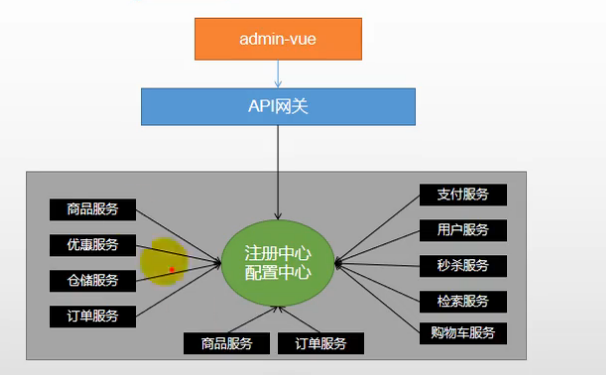
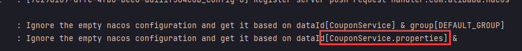
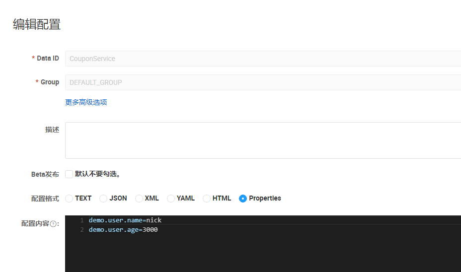
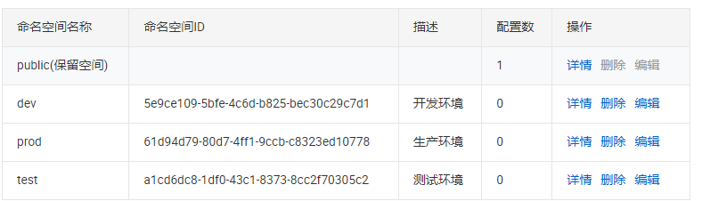
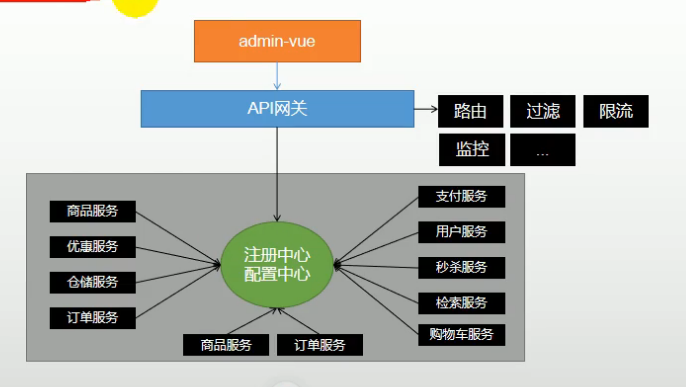
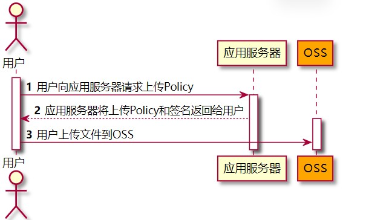
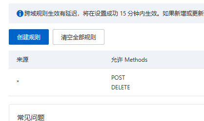
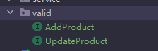

# Java项目

[TOC]

## 商城秒杀系统

[BV1SL411H7wN](https://www.bilibili.com/video/BV1SL411H7wN)  P52

学习目标：如何实现高并发高性能的系统，满足高性能，一致性，高可用的特点。

项目结构：


### 两次MD5加密

前端发送到服务器的时候需要加密一次，从后端再到持久层的时候在加密一次。MD5(MD5(PASS+salt)+salt)

添加POM依赖：

```xml
<dependency>
    <groupId>commons-codec</groupId>
    <artifactId>commons-codec</artifactId>
</dependency>

<dependency>
    <groupId>org.apache.commons</groupId>
    <artifactId>commons-lang3</artifactId>
</dependency>
```

### MyBatis-Plus使用以及代码生成

> 可以快速生成Model，mapper，controller，service等java代码

添加依赖：

```xml
<dependency>
    <groupId>com.baomidou</groupId>
    <artifactId>mybatis-plus-boot-starter</artifactId>
    <version>3.4.3</version>
</dependency>

<dependency>
    <groupId>com.baomidou</groupId>
    <artifactId>mybatis-plus-generator</artifactId>
    <version>3.4.1</version>
</dependency>

<!--HTML模板引擎-->
<dependency>
    <groupId>org.freemarker</groupId>
    <artifactId>freemarker</artifactId>
</dependency>

<dependency>
    <groupId>mysql</groupId>
    <artifactId>mysql-connector-java</artifactId>
</dependency>
```

添加代码：[代码生成器](https://baomidou.com/guide/generator.html#代码生成器)

修改其中的部分代码配置（比如dsn，包名），运行，找到对应的表生成代码。

配置yaml：

```yaml
mybatis-plus:
  mapper-locations: classpath*:/mapper/**/*Mapper.xml
  type-aliases-package: com.xx.xxx.model
```


### 分布式Session

解决方案：Session复制，前端存储，session粘滞，后端集中存储，redis分布式解决

🔵方法一：使用SpringSession来实现分布式session

添加依赖：

```xml
<dependency>
    <groupId>org.springframework.boot</groupId>
    <artifactId>spring-boot-starter-data-redis</artifactId>
</dependency>

<!--lettuce 可能用到的对象池-->
<dependency>
    <groupId>org.apache.commons</groupId>
    <artifactId>commons-pool2</artifactId>
</dependency>

<dependency>
    <groupId>org.springframework.session</groupId>
    <artifactId>spring-session-data-redis</artifactId>
</dependency>
```

Spring配置redis：

```yml
spring:
  redis:
    host: 127.0.0.1
    port: 6379
    database: 0
    lettuce:
      pool:
        max-active: 8
        max-wait: 10000ms
```

> 配置完之后就已经实现分布式session，当访问网站即可将session存到redis中。

🔵方法二：直接将用户信息存储到redis中去。

首先写一个redis配置类用于操作redis

```java
@Configuration
public class RedisConf {

    @Bean
    public RedisTemplate<String, Object> redisTemplate(RedisConnectionFactory factory){
        RedisTemplate<String, Object> redisTemplate = new RedisTemplate<>();
        redisTemplate.setKeySerializer(new StringRedisSerializer());
        redisTemplate.setValueSerializer(new GenericJackson2JsonRedisSerializer()); // 序列化到redis中为json而非二进制
        // 对Hash类型序列化
        redisTemplate.setHashKeySerializer(new StringRedisSerializer());
        redisTemplate.setHashValueSerializer(new GenericJackson2JsonRedisSerializer());


        // 注入连接工厂
        redisTemplate.setConnectionFactory(factory);
        return redisTemplate;
    }
}
```

操作redis：

```java
@Autowired
RedisTemplate<String, Object> redisTemplate;

redisTemplate.opsForValue().set("user"+uid, user);
User user = (User) redisTemplate.opsForValue().get("user" + ticket);
```

### 优化登录功能

> 也可以使用拦截器实现

在做每一次业务请求的时候，都需要判断用户是否登录的session，比较麻烦，太重复了，进行参数处理。这里使用到的是**SpringMVC的自定义参数解析器**。

这个参数解析器，如果在controller中的形参中碰到某种类型的参数，即会进行参数解析，将其他参数传入到对应继承了`HandlerMethodArgumentResolver`接口的类中，进行处理，并且返回对应类型的参数。

原来的样子：

```java
@Autowired
IUserService userService;

@RequestMapping("/tolist")
public String toList(HttpServletRequest req, HttpServletResponse rsp, Model model, @CookieValue("userTicket") String ticket){
    if (!StringUtils.hasLength(ticket))return "login";
    //        User user = (User) session.getAttribute(ticket);
    User user = userService.getUserByCookie(ticket,req, rsp);
    if (user == null)return "login";
    model.addAttribute("user", user);
    return "goodsList";
}
```

功能改为：

```java
@RequestMapping("/tolist")
public String toList(Model model, User user){
    //        if (user == null)return "login";
    model.addAttribute("user", user);
    return "goodsList";
}
```

这里将req，rsp等形参变为了`user`，更加注重controller层的业务处理。

首先需要编写一个WebMVC配置类，继承`WebMvcConfigurer`，重写`addArgumentResolvers`方法来进行controller的参数解析。并且由于重写会导致springboot的默认静态资源目录失效，需要对`addResourceHandlers`进行重写，添加对应资源目录。

```java
@Configuration
@EnableWebMvc
public class WebConf implements WebMvcConfigurer {
    @Override
    public void addResourceHandlers(ResourceHandlerRegistry registry) {
        registry.addResourceHandler("/**").addResourceLocations("classpath:/static/");
    }

    @Autowired
    UserArgumentResolver userArgumentResolver;

    @Override
    public void addArgumentResolvers(List<HandlerMethodArgumentResolver> resolvers) {
        resolvers.add(userArgumentResolver);
    }
}
```

再编写对于User参数的解析器，遇到形参有User类型的controller层即开始解析：

这里使用NativeWebRequest来获取对应的HttpServletRequest和HttpServletResponse

```java
@Component
public class UserArgumentResolver implements HandlerMethodArgumentResolver {
    @Autowired
    IUserService userService;

    // 用于条件判断，如果执行返回true之后，才会执行`resolveArgument`方法, false 则不执行
    @Override
    public boolean supportsParameter(MethodParameter methodParameter) {
        return methodParameter.getParameterType().equals(User.class);
    }

    @Override
    public Object resolveArgument(MethodParameter methodParameter,
                                  ModelAndViewContainer modelAndViewContainer,
                                  NativeWebRequest webRequest,
                                  WebDataBinderFactory webDataBinderFactory) throws Exception {
        // 这里用于判断是否登录的流程
        HttpServletRequest request = webRequest.getNativeRequest(HttpServletRequest.class);
        HttpServletResponse rsp = webRequest.getNativeResponse(HttpServletResponse.class);
        String ticket = CookieUtils.getCookie(request, "userTicket");
        if (!StringUtils.hasLength(ticket))return null;
        return userService.getUserByCookie(ticket, request, rsp);
    }
}
```

### 秒杀功能实现

一、检查库存是否充足。二、每个用户只可以买一件，不可以重复买。

即实现库存减一，订单和秒杀订单中添加记录，基本的CURD操作。

### 压力测试

两个测试标准：QPS（Query Per Second），TPS（Transaction Per Second）

使用[JMeter](https://jmeter.apache.org/)工具来进行压力测试。

对于秒杀功能的测试，首先需要准备5000个用户及其Cookie来进行测试前置。

> 获取5000个用户Cookie可以使用Go语言多线程进行获取，速度极快。

将对应的用户和Cookie信息写入到CSV文件中，并且配置JMeter的CSV配置，导入5000个信息。


设置HTTP Cookie管理器：


开始运行。

> 这里会出现超卖了现象，库存出现负数的情况。

### 缓存

一般放到缓存中的是被频繁读取而且很少进行改动的数据。

🔵页面缓存

将整个HTML页面进行缓存，一般情况下都是前后端分离，这里因为使用到了thymeleaf的问题，将thymeleaf的整个模板+数据库数据放到redis中，并且设置60s秒过期时间。

```java
@RequestMapping(value = "/tolist", produces = "text/html;charset=utf-8")
@ResponseBody
public String toList(Model model, User user, HttpServletRequest request, HttpServletResponse rsp){
    // 缓存查询
    ValueOperations<String, Object> ops = redisTemplate.opsForValue();
    String html = (String) ops.get("goodsList");
    if (StringUtils.hasLength(html))return html;

    //        if (user == null)return "login";
    if (user == null)return null;
    model.addAttribute("user", user);
    model.addAttribute("goodsList", goodsService.findGoodsVo());
    // 手动渲染引擎
    WebContext context = new WebContext(request, rsp, request.getServletContext(), request.getLocale(), model.asMap());
    html = thymeleafViewResolver.getTemplateEngine().process("goodsList", context);
    if (StringUtils.hasLength(html))ops.set("goodsList", html,60, TimeUnit.SECONDS);
    return html;
}
```

🔵URL缓存：

即再redis中存储的字段为：`user:1` `user:2:tel`类似的格式。

🔵对象存储

如何去保证数据库和缓存数据的一致性，当进行数据库操作的时候需要对redis缓存中的信息进行删除清空，更新缓存中的信息，才能够保证前端页面获取到的不是旧的未修改的数据。

🔵页面静态化：

开启`Accept-Encoding:gzip,deflate`选项。

### 解决超卖

出现超卖的情况，可能是一个用户多次下单同一个商品，或者是在更新库存减一的时候没有验证库存量是否大于0，并且防止数据库过量访问。

1. 解决一个用户多次下单同一个商品

   简单的解决办法：在数据库表中字段添加唯一UNIQUE索引，防止重复。

3. 更新的时候使用验证`stock_count > 0`
   
   ```sql
   update t_seckill_goods set stock_count = stock_count - 1 where goods_id = ${goods.id} and stock_count > 0;
   ```

3. 防止数据库单用户过量访问：

   在用户成功下单之后，将数据加入到redis中，用户再次下单的时候检查redis中是否存在数据即可。

### RabbitMQ

添加Springboot依赖：

```xml
<dependency>
    <groupId>org.springframework.boot</groupId>
    <artifactId>spring-boot-starter-amqp</artifactId>
</dependency>
```

yml配置：

```yaml
spring:
  rabbitmq:
    host: localhost
    username: admin
    password: 123456
    virtual-host: /
    port: 5672
    listener:
      simple:
        concurrency: 10     # 消费者最小并发数量
        max-concurrency: 10
        prefetch: 1           # 限制消费这每次只能处理一个消息
        auto-startup: true
        default-requeue-rejected: true    # 被拒绝是否重新进入队列
```

声明交换机、队列和绑定：

```java
@Configuration
public class RabbitMQConfig {

    public static final String EXCHANGE_FANOUT = "fanoutEx01";
    @Bean
    public Queue queue01(){ return new Queue("queue01", true); }

    @Bean
    public Queue queue02(){ return new Queue("queue02", true); }

    @Bean
    public Queue queue03(){ return new Queue("queue03", true); }

    @Bean
    public FanoutExchange fanoutExchange01(){
        return new FanoutExchange(EXCHANGE_FANOUT);
    }

    @Bean
    public DirectExchange directExchange01(){
        return new DirectExchange("Direct01");
    }
    
    // Fanout 绑定

    @Bean
    public Binding binding01(){
        return BindingBuilder.bind(queue01()).to(fanoutExchange01());
    }

    @Bean
    public Binding binding02(){
        return BindingBuilder.bind(queue02()).to(fanoutExchange01()).;
    }

	// 绑定routingKey
    @Bean
    public Binding binding03(){
        return BindingBuilder.bind(queue03()).to(directExchange01()).with("routingKey");
    }
}
```

配置RabbitMQ生产者：

```java
@Service
@Slf4j
public class MQSender {
    @Autowired
    private RabbitTemplate rabbitTemplate;

    public void send(Object msg){
        log.info("发送消息:{}", msg);
        rabbitTemplate.convertAndSend(msg);
    }
}
```

配置消费者：

```java
@Service
@Slf4j
public class MQReceiver {
    @RabbitListener(queues = {"queue"})
    public void recv(Object msg){
        log.info("Recv Msg: {}", msg);

    }
}
```

### 接口优化

在redis中预减库存减少数据库的访问；通过内存标记等方法优化接口减少redis的访问；请求进入通过消息队列进行异步下单。

🔵预减库存+内存标记：

让对应的Controller实现`InitializingBean`类，并且实现`afterPropertiesSet()`方法，这个方法是在所有类加载完成后进行的初始化操作，即将数据库中的库存数量加载到redis中。每当一个秒杀请求进入的时候就使用redis的`decr`或者`incr`的原子操作进行库存-1。

当一个秒杀商品的库存变为0的时候，为了减少对访问redis，使用内存标记法来标记某个库存是否已经使用完毕，可以使用HashMap来进行标记。

```java
private Map<Long, Boolean> emptyStockMap = new HashMap<>();

@RequestMapping("/doSecKill")
public String doSecKill(Model model, User user, Long goodsId) throws JsonProcessingException {
    if (user == null) return "login";
    model.addAttribute("user", user);

    // 方案2：使用redis进行库存预减
    ValueOperations<String, Object> ops = redisTemplate.opsForValue();
    SeckillOrder seckillOrder = (SeckillOrder) ops.get("user:" + user.getId() + ":" + goodsId);
    if (seckillOrder != null) {
        model.addAttribute("error", RespBeanEnum.REPEAT_ERROR.getMsg());
        return "secKillFail";
    }

    // 内存标记，防止大量访问redis
    if (emptyStockMap.get(goodsId)){
        model.addAttribute("error", RespBeanEnum.EMPTY_STOCK.getMsg());
        return "secKillFail";
    }

    Long stock = ops.decrement("SecKillGoodsStockCount:" + goodsId);
    if (stock < 0) {
        emptyStockMap.put(goodsId, true);
        ops.increment("SecKillGoodsStockCount:" + goodsId);
        model.addAttribute("error", RespBeanEnum.EMPTY_STOCK.getMsg());
        return "secKillFail";
    }

	// 发布消息队列
    SeckillMessage seckillMessage = new SeckillMessage(user, goodsId);
    mqSender.sendSeckillMessage(seckillMessage);

    //        model.addAttribute("order", order);
    //        model.addAttribute("goods", goods);
    model.addAttribute("status", 0);
    return "orderDetail";
}

/**
* 系统初始化，将数据库库存加载到redis
*/
@Override
public void afterPropertiesSet() throws Exception {
    List<GoodsVo> list = goodsService.findGoodsVo();
    if (CollectionUtils.isEmpty(list)) return;
    list.forEach(vo -> {
        redisTemplate.opsForValue().set("SecKillGoodsStockCount:" + vo.getId(), vo.getStockCount());
        emptyStockMap.put(vo.getId(), false);
    });
}
```

🔵使用消息队列处理事件：

构建一个Topic类型的交换机，队列并且绑定

```java
@Configuration
public class RMQTopicConf {
    public static final String QUEUE = "seckillQueue";
    public static final String EXCHANGE = "sckillExchange";


    @Bean
    public Queue queue(){
        return new Queue(QUEUE);
    }

    @Bean
    public TopicExchange topicExchange(){
        return new TopicExchange(EXCHANGE);
    }

    @Bean
    public Binding binding(){
        return BindingBuilder.bind(queue()).to(topicExchange()).with("seckill.#");
    }
}
```

进行消息发送：

> RabbitMQ中存储的类型只能是`String`, `byte[]`以及序列化后的信息，不能直接传入对象，可以使用jackson来进行pojo和string类型的互相转换。

```java
@Service
@Slf4j
public class MQSender {
    @Autowired
    private RabbitTemplate rabbitTemplate;

    public void sendSeckillMessage(Object msg) throws JsonProcessingException {
        log.info("发送消息：{}", msg);
        String s = JSONUtils.Pojo2String(msg);
        rabbitTemplate.convertAndSend(RMQTopicConf.EXCHANGE, "seckill.message", s);
    }
}
```

进行消息接受：

```java
@Service
@Slf4j
public class MQReceiver {
    @Autowired
    private IGoodsService goodsService;
    @Autowired
    private RedisTemplate<String,Object> redisTemplate;
    @Autowired
    private IOrderService orderService;

    @RabbitListener(queues = {RMQTopicConf.QUEUE})
    public void recvSeckillMessage(String s) throws JsonProcessingException {
        log.info("收到消息{}", s);
        SeckillMessage msg = JSONUtils.String2Pojo(s, SeckillMessage.class);
        Long goodsId = msg.getGoodsId();
        User user = msg.getUser();
        GoodsVo goodsVo = goodsService.findGoodsVoById(goodsId);
        if (goodsVo.getStockCount() < 1)return;
        // 参考订单，判断是否重复抢购
        ValueOperations<String, Object> ops = redisTemplate.opsForValue();
        SeckillOrder seckillOrder = (SeckillOrder) ops.get("user:" + user.getId() + ":" + goodsId);
        if (seckillOrder != null)return;
        orderService.seckill(user,goodsVo);
    }
}
```

### Redis实现分布式锁

使用`setIfAbsent()`和lua脚本。。

### 安全优化

不直接显示抢购的URL，比如每个用户使用特定的URL，使用redis可以实现。

## 博客

### 网易云音乐外链

数字为音乐id

```
http://music.163.com/song/media/outer/url?id=433107530.mp3
```

也可以使用jsdelivr加速github

```
https://cdn.jsdelivr.net/gh/ACCOUNT/PROJECT@latest/lyrics/1340143947.lrc
```

### 跨域请求下的Cookie设置

同源策略三个标准：同协议(`http`, `https`)，同域名，同端口

需要在后端设置`allowCredentials`，在前端设置`withCredentials`来允许携带Cookie信息

并且最好在添加cookie的时候添加`HttpOnly`.

```java
@Configuration
@EnableWebMvc
public class WebConf implements WebMvcConfigurer {

    /**
     * 设置跨域请求
     */
    @Override
    public void addCorsMappings(CorsRegistry registry) {
        registry.addMapping("/**")
                .allowedOrigins("http://localhost:8081", "http://localhost:8080")
                .allowedMethods("POST", "GET", "PUT", "OPTIONS", "DELETE")
                .allowedHeaders("*")
                .allowCredentials(true)     // 允许设置Cookie
                .maxAge(3600);
    }
}
```

### 拦截器的使用


如果需要配置拦截器，需要编写一个类来实现`HandlerInterceptor`接口，并且根据需求覆写其中的方法，`preHandle`，`postHandle`，`afterCompletion`，三个方法分别在请求前，请求后，完成请求处理后进行触发，`preHandle`返回true表示放行，返回false表示拦截。

```java
@Slf4j
@Configuration
public class SessionInterceptor implements HandlerInterceptor {

    @Autowired
    private RedisTemplate<String, Object> redisTemplate;

    @Override
    public boolean preHandle(HttpServletRequest request, HttpServletResponse response, Object handler) throws Exception {
        // 拦截业务
        return false;
    }

    @Override
    public void postHandle(HttpServletRequest request, HttpServletResponse response, Object handler, ModelAndView modelAndView) throws Exception {
        HandlerInterceptor.super.postHandle(request, response, handler, modelAndView);
    }

    @Override
    public void afterCompletion(HttpServletRequest request, HttpServletResponse response, Object handler, Exception ex) throws Exception {
        HandlerInterceptor.super.afterCompletion(request, response, handler, ex);
    }
}
```

[Spring MVC拦截器中的第三个参数handler](https://blog.csdn.net/Dongguabai/article/details/81160361)

前两个参数分别是数据请求和数据响应，第三个参数是`HandlerMethod`，可以用来获取controller中对应处理此请求的函数名机器信息。

```java
@Override
public boolean preHandle(HttpServletRequest request, HttpServletResponse response, Object handler) throws Exception {
    if (handler instanceof HandlerMethod){
        var m = (HandlerMethod)handler;
        log.info("controller中对应处理函数名称：{}", m.getMethod().getName());
        log.info("参数数目：{}", m.getMethod().getParameters().length);
        log.info("方法包名：{}", m.getBean().getClass().getName());
    }
    return true;
}
```

### 拦截器中使用redis

[springboot拦截器无法注入redisTemplate](https://blog.csdn.net/zxl646801924/article/details/99544463)

由于拦截器执行实在bean实例化之前执行的，因此在拦截器中使用`redisTemplate`会导致空指针异常。

因此需要在拦截器执行之前实例化Bean。

```java
@Slf4j
@Configuration
public class SessionInterceptor implements HandlerInterceptor {
    @Bean	// 实例化Bean
    public SessionInterceptor getSessionInterceptor(){
        return new SessionInterceptor();
    }

    @Autowired
    private RedisTemplate<String, Object> redisTemplate;

    @Override
    public boolean preHandle(HttpServletRequest request, HttpServletResponse response, Object handler) throws Exception {

        // 获取到Cookie，查redis，查到则放行，查不到打回。 
        /*redisTemplate*/
        String userSign = CookieUtils.getCookie(request, "userSign");
        if (StringUtils.hasLength(userSign)){
            Object o = redisTemplate.opsForValue().get("webblog:userSign:" + userSign);
            if (o != null)return true;
        }
        RspStatus fail = RspStatus.fail(RspStatusEnum.SESSION_EXPIRED);
        String ret = new ObjectMapper().writeValueAsString(fail);
        response.getWriter().write(ret);
        return false;
    }

}
```

WebConf

```java
@Configuration
@EnableWebMvc
public class WebConf implements WebMvcConfigurer {

    public static final String[] excludeSessionPath = new String[]{"/user/login", "/user/register", "/music/**", "/gapi/**"};

    @Autowired	/自动取出Bean
    private SessionInterceptor sessionInterceptor;

    // 对于非登录用户进行拦截
    @Override
    public void addInterceptors(InterceptorRegistry registry) {
        registry.addInterceptor(sessionInterceptor)
                .addPathPatterns("/**")
                .excludePathPatterns(Arrays.asList(excludeSessionPath));
    }
}
```

### CORS与拦截器

一般情况下使用的是实现`WebMvcConfigurer`接口来进行实现跨域请求，但是有一个bug，当项目中存在拦截器的时候，如果一个请求路径在拦截器的排除路径`excludePath`之中，相当于请求放行，而这个逻辑相当于当一个请求通过拦截器之后，就相当于一次请求返回了，而又没有经过CorsMapping函数，因此浏览器就会自动抛弃数据包，导致CORS警告出现。

正确的配置方式：[CorsFilter](https://docs.spring.io/spring-framework/docs/current/reference/html/web.html#mvc-cors-filter)

只需要在容器中放入一个`CorsFilter`的Bean就可以。

```java
@Configuration
public class CorsConf {
    public static final String[] ALLOWED_ORIGINS= new String[]{"http://localhost:8081"};

    @Bean
    public CorsFilter corsFilter(){
        CorsConfiguration corsConfiguration = new CorsConfiguration();
        corsConfiguration.addAllowedHeader("*");
        corsConfiguration.addAllowedMethod("*");
        corsConfiguration.setAllowedOriginPatterns(Arrays.asList(ALLOWED_ORIGINS));
        corsConfiguration.setMaxAge(3600L);
        corsConfiguration.setAllowCredentials(true);


        UrlBasedCorsConfigurationSource source = new UrlBasedCorsConfigurationSource();
        source.registerCorsConfiguration("/**",corsConfiguration);
        return new CorsFilter(source);
    }
}
```

### Websocket聊天室

🔵添加依赖：

```xml
<!--WebSocket-->
<dependency>
    <groupId>org.springframework.boot</groupId>
    <artifactId>spring-boot-starter-websocket</artifactId>
</dependency>
```

首先要在config中配置一个`ServerEndpointExporter`的Bean，这个类会自动注册使用了<b>@ServerEndPoint</b>注解声明的Websocket入口。

```java
/**
 *首先要注入ServerEndpointExporter，这个类会自动注册使用了<b>@ServerEndPoint</b>注解
 * 声明的Websocket入口
 */
@Configuration
public class WebsocketConf {
    @Bean
    public ServerEndpointExporter serverEndpointExporter(){
        return new ServerEndpointExporter();
    }

    @Autowired
    public void setChatroomService(IChatroomService chatroomService){
        WebsocketEndpoint.chatroomService = chatroomService;
    }
}
```

🔵定义服务器WebSocket入口：

使用`@ServerEndpoint(value = "/websocket/{userId}") `注解标注ws的url入口地址，对应的地址为`ws://host:port/websocket/{userid}`，并且使用`@OnOpen`，`@OnClose`，`@OnMessage`，`@OnError`来绑定服务器端的ws四个事件。

```java
//Websocket业务代码都写在这里
// ws://host:8080/websocket/{userId}
@ServerEndpoint(value = "/websocket/{userId}")      // Websocket对外暴露的连接入口
@Component
@Slf4j
public class WebsocketEndpoint {

    public static IChatroomService chatroomService;

    /**
     * 当有客户端连接的时候，在对应的连接池中添加session
     * @param session Websocket交互时候会自动传入的参数
     * @param userId 用户id
     */
    @OnOpen
    public void onOpen(Session session, @PathParam("userId") String userId) throws IOException {
        // 将会话存到连接池中
        log.info("有连接进入：{}, session: {}", userId, session.getId());
        WebsocketSessionPool.chatRoomSessions.put(userId, session);
        // 有客户端进入，就发送其前25条记录
        List<Object> msgs = chatroomService.getLast25Message();
        for (Object o : msgs) {
            //TODO getAsyncRemote getBasicRemote
            session.getBasicRemote().sendText(JSONUtils.pojo2string(o));
        }
    }

    @OnClose
    public void onClose(Session session) throws IOException {
        log.info("关闭连接, session: {}", session.getId());
        WebsocketSessionPool.closeSession(session.getId());
    }

    @OnMessage
    public void onMessage(Session session, String msg) throws JsonProcessingException {
        log.info("有消息传入：{}, session: {}", msg, session.getId());
        WSChatroomMessage one = JSONUtils.string2pojo(msg, WSChatroomMessage.class);
        chatroomService.pushMessage(one);
        WebsocketSessionPool.broadcastMsg(msg, session.getId());
    }
}
```

🔵实现群发广播：

想要实现群发的功能就必须要保存各个客户端与服务器之间的会话（Session），这里使用`ConcurrentHashMap`结构**会话池**来解决并发访问的情况，将各个会话存储到这个变量中。通过变量中的数据遍历来实现群发，并且可以添加、删除对应的会话。

```java
public class WebsocketSessionPool {
    public static Map<String, Session> chatRoomSessions = new ConcurrentHashMap<>();

    public static void closeSession(String sessionId) throws IOException {
        for (String uid : chatRoomSessions.keySet()) {
            Session session = chatRoomSessions.get(uid);
            if (session.getId().equals(sessionId)){
                chatRoomSessions.remove(uid);
                session.close();
                break;
            }
        }
    }

    /**
     * 群发到此房间所有的用户
     * @param msg 消息体
     */
    public static void broadcastMsg(String msg, String sessionId){
        for (String sid : chatRoomSessions.keySet()) {
            chatRoomSessions.get(sid).getAsyncRemote().sendText(msg);
        }
    }
}
```

🔵私聊：

即在会话池中找到对应的人发送消息即可。

🔵异常处理（重连）：

前端JS处理，在onerror的时候执行重新连接

🔵心跳检测：

客户端定期发送消息到服务器端是否存活。

🔴异步发送消息与同步发送消息

[Spring專案中使用webservice實現h5的websocket通訊](https://www.itread01.com/p/1445678.html)

在一次性给一个用户发送多个消息的时候，如果使用`getAsyncRemote()`来进行异步发送消息，如果发送消息过快，可能会出现上一条消息还未发送完毕，下一条消息就会发送过来的情况，会导致`TEXT_FULL_WRITING`的异常，如果需要保证信息的顺序，就使用`getBasicRemote()`来进行发送消息，如果只是发送单条少量消息或者消息的顺序不是很重要的时候，可以采用异步发送。

同步发送消息，在用户登录的时候加载数据库中的历史消息。

```java
@OnOpen
public void onOpen(Session session, @PathParam("userId") String userId) throws IOException {
    // 将会话存到连接池中
    log.info("有连接进入：{}, session: {}", userId, session.getId());
    WebsocketSessionPool.chatRoomSessions.put(userId, session);
    // 有客户端进入，就发送其前n条记录
    List<Object> msgs = chatroomService.getLast25Message();
    for (Object o : msgs) {
        session.getBasicRemote().sendText(JSONUtils.pojo2string(o));
    }
}
```

🔴在Websocket服务器类中使用service层

如果直接使用会导致service空指针异常，并不能自动`@AutoWire`，需要在WebsocketConf配置类中自动链接，然后再服务器类中加入service的静态变量。

设置静态变量：

```java
//Websocket业务代码都写在这里
// ws://host:8080/websocket/{userId}
@ServerEndpoint(value = "/websocket/{userId}")      // Websocket对外暴露的连接入口
@Component
@Slf4j
public class WebsocketEndpoint {

    public static IChatroomService chatroomService;

	 // Other code ....
}
```

在配置类中自动链接：

```java
@Configuration
@EnableWebSocket
public class WebsocketConf {
    @Bean
    public ServerEndpointExporter serverEndpointExporter(){
        return new ServerEndpointExporter();
    }

    @Autowired
    public void setChatroomService(IChatroomService chatroomService){
        WebsocketEndpoint.chatroomService = chatroomService;
    }
}
```

### Mybatis-plus分页插件

参考：[分页插件](https://baomidou.com/guide/page.html)

添加MP配置：

```java
@Configuration
public class MybatisPlusConf {
    // 最新版
    @Bean
    public MybatisPlusInterceptor mybatisPlusInterceptor() {
        MybatisPlusInterceptor interceptor = new MybatisPlusInterceptor();
        interceptor.addInnerInterceptor(new PaginationInnerInterceptor(DbType.H2));
        return interceptor;
    }
}
```

在Mapper中添加对应接口，添加变量`Page<?>`类型的分页配置变量。

```java
public interface TimeCapsulesMapper extends BaseMapper<User> {
    Page<User> selectDynamicsByPage(Page<?> pageConf, Long userId);
}
```

查询数据：

```java
Page<User> pageConf = new Page<>(1, 5);	// 查询第一页，每页5个数据
Page<User> capsulesPage = tcMapper.selectDynamicsByPage(pageConf, userId);
List<User> records = capsulesPage.getRecords();
```

### 定时任务SpringTask

定时同步redis数据到MySQL数据库。

cron表达式：

| **名称** | **必需** | **值**          | **允许的特殊字符** |
| -------- | -------- | --------------- | ------------------ |
| 秒       | 是       | 0-59            | , - * / R          |
| 分钟     | 是       | 0-59            | , - * / R          |
| 小时     | 是       | 0-23            | , - * / R          |
| 日       | 是       | 1-31            | , - * / ? L W      |
| 月       | 是       | 1-12 或 JAN-DEC | , - */             |
| 星期几   | 是       | 0-6 或 SUN-SAT  | , - / ? L #        |
| 年       | 否       | 1970-2099       | , - * /            |

举例：

* `0/2 * * * * ?` 每两秒同步一次
* `0 0/5 * * * ?` 每5分钟执行一次


每秒运行一次的任务

```java
@Component
public class SyncRedisToDB {
    @Scheduled(cron = "0/2 * * * * ?")	
    public void taskdemo(){
        System.out.println("Task");
    }
}
```

**解决单线程运行定时任务：**

参考：

[定时任务@Scheduled之单线程多线程问题](https://blog.csdn.net/Mr_EvanChen/article/details/103408290)

[spring-boot @Scheduled实现多线程并发定时任务](https://blog.csdn.net/qq_32218473/article/details/102720024)

* 方法一：扩大原定时任务线程池中的核心线程数

  ```java
  @Configuration
  public class ScheduleConf implements SchedulingConfigurer {
  
      public static final int scheduledPoolSize = 5;
  
      @Override
      public void configureTasks(ScheduledTaskRegistrar taskRegistrar) {
          taskRegistrar.setScheduler(Executors.newScheduledThreadPool(scheduledPoolSize));
      }
  }
  ```

* 方法二：把Scheduled配置成成多线程执行

  使用`@EnableAsync`注解，但是任务1中的卡死线程越来越多，会导致线程池占满，还是会影响到定时任务。

  ```java
  @Configuration
  @EnableAsync
  class ScheduleConf2  {
  
      public static final int scheduledPoolSize = 5;
  
      @Bean
      public TaskScheduler taskScheduler () {
          ThreadPoolTaskScheduler taskScheduler = new ThreadPoolTaskScheduler();
          taskScheduler.setPoolSize(scheduledPoolSize);
          return taskScheduler;
      }
  }
  ```

  代码：

  ```java
  @Component
  public class SyncRedisToDB {
      
      @Scheduled(cron = "0/2 * * * * ?")
      @Async
      public void taskdemo(){
          System.out.println("Task");
      }
  }
  ```

* 方法三：直接将@Scheduled注释的方法内部改成异步执行

  ```java
  @Component
  public class SyncRedisToDB {
  
      ExecutorService service = Executors.newFixedThreadPool(5);
  
      @Scheduled(cron = "0/2 * * * * ?")
      public void taskdemo(){
          service.execute(()->{
              System.out.println("task");
          });
      }
  }
  ```

### 正则表达式

参考：[Java 正则捕获组](https://www.runoob.com/w3cnote/java-capture-group.html)

🔵设置匹配规则：

```java
Pattern pattern = Pattern.compile("dynamic:(?<id>[0-9]+):(thumbs|views)");
```

🔵是否**完全**匹配：

```java
String s = "This is a sentence";
boolean b = pattern.matcher(s).match();
```

🔵是否存在**部分**匹配：

```java
boolean b = pattern.matcher(s).find();
```

🔵捕获组（例如`user:([\d]+):views`）：

即匹配获取圆括号中的内容

```java
String id = pattern.matcher(s).group()
```

给捕获组设置name属性方便获取

```java
Pattern pattern = Pattern.compile("user:(?<userId>[\d]+):views");
String id = pattern.matcher(s).group("userId");
```

使用`?<key>`的形式进行

### 数据库同步到redis

redis同步到数据库见<a href="#定时任务SpringTask">链接</a>

一般用在常用读取操作上，在服务器初始化的时候进行操作。

首先需要在对应的类上实现接口`InitializingBean`，并且实现`afterPropertiesSet()`方法，编写对应的业务即可。

### Vue路由中history模式nginx404解决方法

```conf
location / {
　　# .....
　　try_files $uri $uri/ /index.html;
```

[nginx +VUE 解决404 问题](https://www.jianshu.com/p/989d8bc719c4)

## IPv6建站流程梳理

最近想着怎么将以前的接电脑重新利用起来，想到学校宽带可以分配IPv6地址，立马产生了一个想法，把我的旧电脑当成一个服务器，我的旧电脑8核8G的配置，虽然校园网只有10M但也比腾讯云的2核1G1M的服务器强多了。

而且手机流量运营商默认支持IPv6，这样就可以随时随地访问自己的服务器了。

[IPv6閒談-一起玩玩IPv6自動配置 - 台部落 (twblogs.net)](https://www.twblogs.net/a/5c7f7082bd9eee35fc133b9b)

### 1. 检查IPv6

首先需要直插网线来检验自己的使用的运营商是否支持IPv6，在window端使用`ipconfig`指令可以查看是否有IPv6地址。

如果有IPv6地址会显示如下：

```
以太网适配器 以太网:

   连接特定的 DNS 后缀 . . . . . . . :
   IPv6 地址 . . . . . . . . . . . . : 2401:3a2:2194:6320::1001
   IPv6 地址 . . . . . . . . . . . . : 2401:3a2:2194:6320:6989:1d24:1d7b:ae1c
   临时 IPv6 地址. . . . . . . . . . : 2401:3a2:2194:6320:3496:447e:914c:e38d
   本地链接 IPv6 地址. . . . . . . . : fe80::6989:1d24:1d7b:391c%9
   IPv4 地址 . . . . . . . . . . . . : 192.168.1.101
   子网掩码  . . . . . . . . . . . . : 255.255.255.0
   默认网关. . . . . . . . . . . . . : fe80::6a77:24ff:feb1:7aa9%9
                                       192.168.1.1
```

其中`2401:`开头的地址为全球IPv6地址，`fe80:`开头的则为本地IPv6地址。如果只有本地IPv6地址则表明并未开启IPv6.

对于部分windows设备的默认设置可能并未开启IPv6协议，可以通过打开`控制面板->网络和共享中心->更改适配器设置`，选择当前自己的网络，右键属性中网络选项卡中查看是否勾选`Internet协议版本6`，没勾选请勾选上。


如果还未设置，需要检查你的路由器、光猫是否分配IPv6地址，或者联系运营商。

在linux中使用`ip addr | grep inet6`或者`ifconfig | inet6`来查看是否分配IPv6地址。

```sh
➜  ~ ip addr | grep inet6
    inet6 ::1/128 scope host 
    inet6 2401:3a2:2094:6320::1000/128 scope global dynamic noprefixroute 
    inet6 2401:3a2:2094:6320:8130:33bf:6d5c:5f8f/64 scope global temporary dynamic 
    inet6 2401:3a2:2094:6320:b5ea:5511:1fc9:8d28/64 scope global dynamic mngtmpaddr noprefixroute 
    inet6 fe80::66e:39a1:916:7c17/64 scope link noprefixroute
```

检验是否成功连接IPv6，是否可以成功访问以下网址:

* <a href="https://test-ipv6.com/" target="blank_">test-ipv6</a>
* <a href="http://speed.neu6.edu.cn/" target="blank_">东北大学IPv6测速站</a>

### 2. 硬件准备

检查好自己的网络已经支持了IPv6的话，就可以开始准备硬件了。

> 注意这里的路由器是为了方便非流量设备进行IPv6访问，比如平板、电脑、电视、智能语音助手等设备。如果没有这个需求，也可以只使用网线进行连接。

1. 支持IPv6的路由器（少部分路由器支持）这里选择了`TL-WDR5620千兆版`，某东大约￥130购入。
2. 支持IPv6的设备（95%设备都支持）

检查路由器是否成功分配到IPv6。


### 3. 设置IPv6临时地址

临时地址大概意思是一个设备的ip不固定，为了隐私考虑。ipv6地址不像ipv4一样使用NAT公用一个ip，IPv6使得设备间连接更容易，但是更容易造成安全隐患。为此操作系统可以选用多个临时ip，每个ip有固定的生命周期。ipv6自动配置时使用你的MAC地址来选择一个ip地址，这样其它设备根据你的ip地址可能会算出你的mac地址（全球唯一)。

而临时IPv6地址的出现就是为了解决这个安全隐患，临时IPv6地址会上一级网络获得的`租约时间`来改变，如果时间到了会自动切换一个临时IPv6地址，使得设备的安全性提高。

对于普通的**客户端**来说，临时IPv6地址的开启可以某种程度上有效提高设备的安全性。

而对于**服务器端**来说，并不想让其他的用户通过临时IPv6地址进行访问，要求其必须从固定的IPv6地址访问，因此需要进行配置。

windows端：

* 开启临时IPv6地址：`netsh interface ipv6 set privacy state=enable`
* 关闭临时IPv6地址：`netsh interface ipv6 set privacy state=disable`

Linux端：

参考：[linux设置ipv6临时地址](https://www.cnblogs.com/makefile/p/5040615.html)

查看是否开启IPv6临时地址：

```sh
> sudo sysctl -a | grep tempaddr     
net.ipv6.conf.all.use_tempaddr = 2
net.ipv6.conf.default.use_tempaddr = 2
net.ipv6.conf.docker0.use_tempaddr = 2
net.ipv6.conf.eno1.use_tempaddr = 0
net.ipv6.conf.lo.use_tempaddr = -1
net.ipv6.conf.veth0b4fc75.use_tempaddr = 2
net.ipv6.conf.wlo1.use_tempaddr = 2
```

如果是无线网卡就修改`wlol`的配置，如果是以太网就修改`eno1`的配置。

* 开启：

  ```sh
  vim /etc/sysctl.d/10-ipv6-privacy.conf
  # 设置以下
  net.ipv6.conf.default.use_tempaddr = 0
  # 推出vim
  sysctl --system	# 使得配置生效
  ```

* 关闭：设置为`net.ipv6.conf.default.use_tempaddr = 2`重新连接网络即可。

### 4. 防火墙设置

服务器如果是indows中需要关闭网络防火墙，在`控制面板\系统和安全\Windows Defender 防火墙\自定义设置`中`关闭windows Defender防火墙`，这个防火墙默认会拦截来自内网和外网的80或者443端口。


在Linux暂时还没有遇到，默认是全部放行。

### 5. 域名解析和DDNS配置

这里使用[阿里云](https://www.aliyun.com/)的域名和[DNSPod](https://www.dnspod.cn/)的https证书申请。这里使用阿里云是因为其有丰富的设置API，可以在远端使用程序即可设置域名DDNS解析。

首先是测试自己的域名是否能够正常解析到自己的IPv6地址：

进入阿里云域名控制台后选择已经创建好的域名后，点击**解析**，然后添加记录。

* 记录类型选择`AAAA`，用于指向一个IPv6的地址，当前中国只有IPv6地址的服务器无需备案。
* 主机记录根据自己选择，这里我选择了`@`
* 解析路线默认即可
* 记录值即自己服务器的IPv6地址，填写服务器的**固定**IPv6地址。
* TTL设置为10分钟最短的更新时间。

登录到阿里云控制台后进入[RAM 访问控制](https://ram.console.aliyun.com/users)，点击创建用户，并且勾选`Open API 调用访问`用于生成调用阿里云API的Token。创建完成后一定要保存自己的`AccessKey ID`和`AccessKey`这是在后来API中重要的验证参数。

创建完成后为其添加两个权限`AliyunDomainFullAccess`和`AliyunDNSFullAccess`，这两个是允许这个APIToken进行控制的权限，分别是管理域名服务的权限和管理云解析(DNS)的权限，否则之后使用API无法对DDNS进行修改和设置。

由于IPv6的地址由于运营商的设置可能会发生变换，因此DDNS的设置就是为了让自己的IPv6地址与域名解析实时更新。

DDNS设置使用Github的开源项目：https://github.com/NewFuture/DDNS

具体用法见https://github.com/NewFuture/DDNS/blob/master/README.md。

### 6. Nginx配置

如果使用nginx来配置服务器，需要监听IPv6地址对应的端口，如果不开启会导致无法使用IPv6地址访问。

```
server{
	listen 80;
	listen [::]:80;	# IPv6地址
}
```

## 谷粒商城

[BV1np4y1C7Yf](https://www.bilibili.com/video/BV1np4y1C7Yf?p=22) P28

### 1. 配置环境

配置 MySQL：

```sh
docker run -p 3306:3306 --name mysql01 -v /data/mysql01/conf:/etc/mysql	-v /data/mysql01/log:/var/log/mysql -v /data/mysql01/data:/var/lib/mysql -v /data/mysql01/mysql-files:/var/lib/mysql-files -e MYSQL_ROOT_PASSWORD=root -d mysql:8.0
```

修改 MySQL 配置文件设置编码：

```sh
vim /data/mysql01/conf/my.cnf
```

```
[client]
default-character-set=utf8

[mysql]
default-character-set=utf8

[mysqld]
init_connect='SET collation_connection = utf8_unicode_ci'
init_connect='SET NAMES utf8'
character-set-server=utf8
collation-server=utf8_unicode_ci
skip-character-set-client-handshake
skip-name-resolve
```

配置 redis：

```sh
# 首先创建在实体机创建 redis.conf 文件
mkdir -p data/redis01/conf
touch /data/redis01/conf/redis.conf
# 运行容器
docker run -d -p 6379:6379 --name redis01 -v /data/redis01/data:/data -v /data/redis01/conf/redis.conf:/etc/redis/redis.conf redis redis-server /etc/redis/redis.conf --save 60 1
```

使用 docker 自动启动容器：

```sh
docker update mysql01 --restart=always
docker update redis01 --restart=always
```

为数据库创建表结构，源码地址[Link](https://share.weiyun.com/bO0OZMCv)，这些表的特点就是**没有外键**。

```sql
# 商品系统
create database `gulimall_pms` DEFAULT CHARACTER SET utf8mb4 COLLATE utf8mb4_unicode_ci;
# order
create database `gulimall_oms` DEFAULT CHARACTER SET utf8mb4 COLLATE utf8mb4_unicode_ci;
# user
create database `gulimall_ums` DEFAULT CHARACTER SET utf8mb4 COLLATE utf8mb4_unicode_ci;
# 营销系统
create database `gulimall_sms` DEFAULT CHARACTER SET utf8mb4 COLLATE utf8mb4_unicode_ci;
# 库存系统
create database `gulimall_wms` DEFAULT CHARACTER SET utf8mb4 COLLATE utf8mb4_unicode_ci;
# 管理员系统
create database `gulimall_admin` DEFAULT CHARACTER SET utf8mb4 COLLATE utf8mb4_unicode_ci;

# 然后将对应的 sql 文件在对应的库中执行
```

clone 人人开源的三个项目：renren-fast、renren-fast-vue 以及 renren-generator，用于后台管理。

```sh
# 后台管理
git clone https://gitee.com/renrenio/renren-fast.git
# 前端代码
git clone https://gitee.com/renrenio/renren-fast-vue.git
# 代码生成器
https://gitee.com/renrenio/renren-generator.git
```

* 后端配置

  将 renren-fast 整个包移动到项目下，并且执行的 db 文件夹下的所有对应数据库在 gulimall_admin 库中执行。

  修改 renren-fast 中 Spring 配置信息，将其中的 mysql 连接地址进行修改。

  配置完毕之后就可以在 `http://localhost:8080/renren-fast/` 中进行访问。

* 前端配置：

  在 renren-fast-vue 目录下执行：
  ```sh
  npm config set registry http://registry.npm.taobao.org
  # 安装依赖，可以解决墙内安装问题
  cnpm install
  # 开启项目
  npm run dev
  ```

  会存在 Nodejs 版本的问题，最好使用 `node v10.16.3` 版本。害怕与本地冲突则使用 `nvm` 进行 nodejs 版本管理。

  其他问题见[FAQ renren-fast-vue](https://github.com/renrenio/renren-fast-vue/wiki/FAQ)

  在进行多机部署的时候需要对 webpack.config.js 的傻哔设计中添加 `allowedHosts`

MyBatis-Plus 配置：配置表的主键 ID 自增

```yaml
mybatis-plus:
 global-config:
   db-config:
     id-type: auto
```


将 renren-generator 同样移到项目下。

### 2. SpringCloud

微服务包含注册中心、配置中心、网关。

注册中心：相当于服务的登记处，方便用于服务发现。

配置中心：各个服务配置众多，单个修改服务十分麻烦，需要配置中心来集中进行配置。

网关：用于鉴权，过滤，路由等。



Spring Cloud Alibaba的组件：

* Nacos：注册中心、配置中心
* Ribbon：负载均衡
* OpenFeign：声明式 HTTP 客户端，整合了 Ribbon 负载均衡和 Hystrix 服务熔断。
* Sentinel：服务容错（限流、降级、熔断）
* Gateway：API 网关(webflux 编程模式)
* Sleuth: 调用链监控
* Seata：分布式事务解决方案

#### a. Nacos 注册中心

> 单机部署 nacos 需要在执行模式改为 `standalone`，或者添加 `-m standalone`

如何使用 Nacos：[Nacos Demo](https://github.com/alibaba/spring-cloud-alibaba/blob/2021.x/spring-cloud-alibaba-examples/nacos-example/nacos-discovery-example/readme-zh.md)

1. 首先[下载](https://github.com/alibaba/nacos/releases) 并且开启 Nacos Server

   ```sh
   tar -zxvf nacos-server-2.1.2.tar.gz
   bash nacos/bin/startup.sh -m standalone
   ```

   得到对应的地址：http://ip:8848/nacos/index.html

2. 配置 application.yaml，配置 nacos 服务器地址和服务名称

   ```yml
   spring:
     cloud:
       nacos:
         discovery:
           server-addr: guli:8848
           service: memberService

3. 在应用上添加注解 `@EnableDiscoveryClient` ：

   ```java
   @EnableDiscoveryClient
   @SpringBootApplication
   public class MemberApplication {
   	public static void main(String[] args) {
   		SpringApplication.run(MemberApplication.class, args);
   	}
   }
   ```

🔵使用 OpenFeign 进行远程调用

1. 引入依赖：

   ```xml
   <dependency>
       <groupId>org.springframework.cloud</groupId>
       <artifactId>spring-cloud-starter-openfeign</artifactId>
   </dependency>
   
   
   <!--    负载均衡    -->
   <dependency>
       <groupId>org.springframework.cloud</groupId>
       <artifactId>spring-cloud-starter-loadbalancer</artifactId>
   </dependency>
   ```

2. 调用者配置，创建 feign 接口

   假设被调用者的 API 为：

   ```java
   @RestController
   @RequestMapping("coupon/coupon")
   public class CouponController {
       @Autowired
       private CouponService couponService;
   
       @RequestMapping("/member/demo")
       public R demo() {
           CouponEntity entity = new CouponEntity();
           entity.setCouponName("满100减100");
           return R.ok().put("coupon", entity);
       }
   }
   ```

   调用者对应的 feign 接口为：

   需要设置对应在 nacos 中被调用者的服务名

   ```java
   @FeignClient(name = "CouponService")
   public interface CouponFeignService {
       @RequestMapping("/coupon/coupon/member/demo")
       public R demo();
   }
   ```

3. 在调用者应用上开启 feign 远程调用功能

   添加注解 `@EnableFeignClients` 并且设置 feign 接口包名

   ```java
   @EnableFeignClients(basePackages = "com.guli.member.feign")
   @EnableDiscoveryClient
   @SpringBootApplication
   public class MemberApplication {
   	public static void main(String[] args) {
   		SpringApplication.run(MemberApplication.class, args);
   	}
   }
   ```

4. 然后就可以通过 HTTP 进行访问了。

#### b. Nacos 配置中心

在以前的应用中，如果修改配置之后需要重新进行打包、编译、发布，十分麻烦，因此就产生了配置中心来进行集中管理。

[官方样例](https://github.com/alibaba/spring-cloud-alibaba/blob/2021.x/spring-cloud-alibaba-examples/nacos-example/nacos-config-example/readme-zh.md)

1. 引入配置

   ```xml
   <dependency>
       <groupId>org.springframework.cloud</groupId>
       <artifactId>spring-cloud-starter-bootstrap</artifactId>
       <version>3.1.5</version>
   </dependency>
   
   <dependency>
        <groupId>com.alibaba.cloud</groupId>
        <artifactId>spring-cloud-starter-alibaba-nacos-config</artifactId>
    </dependency>
   ```

2. 在 resources 目录下创建 `bootstrap.properties` 配置 nacos config 元数据

   `bootstrap.yml` 要比 `application.yml` 优先级要高。

   ```sh
   spring.application.name=CouponService
   spring.cloud.nacos.config.server-addr=guli:8848
   ```

3. 在对应的 Controller 上添加注解 `@RefreshScope` 可以实现动态刷新配置

4. 运行的时候首先在 nacos 配置中心找对应的配置，没有的话再去本地查找：

   使用 `@Value` 获取配置项

   ```java
   @Value("${demo.user.name}")
   String name;
   @Value("${demo.user.age}")
   int age;
   
   @RequestMapping("/test/config")
   public R testConfig() {
       return R.ok().put("name", name).put("age", age);
   }
   ```

   红色部分即程序想要找的 nacos 配置文件

   

5. 在 nacos 配置中心添加配置 `CouponService.properties`：

   

   默认情况下使用的文件扩展为 `properties` 类型，可以在 `bootstrap.yml` 中设置 `file-extension: yaml` 将默认配置文件为 yml 文件。 

6. 即可实现动态配置

> 如果配置中心和本地都存在配置文件，优先使用远程配置文件

**命名空间：**

> 可以创建不同的命名空间，命名空间下分为多个组，每个组有多个配置

配置中心详解：

* 命名空间：用于配置隔离

  默认命名空间为 public，默认所有新增的配置都在 public 空间中

  1. 比如 dev, test, production

     

  2. 在 `bootstrap.properties` 文件中配置命名空间 id

     ```properties
     spring.cloud.nacos.config.namespace=61d94d79-80d7-4ff1-9ccb-c8323ed10778
     ```

  3. 重启应用生效

* 配置集：所有配置的合集

* 配置分组：

  默认所有的配置集都属于 `DEFAULT_GROUP`

  ```properties
  spring.cloud.nacos.config.group=planA
  ```

同时加载多个配置文件，根据不同的配置来进行分类和拆分，然后在 `bootstrap.yml` 中进行配置：

使用项 ` extension-configs` 配置，注意文件后缀名必须标准。

```yml
spring:
  application:
    name: CouponService
  cloud:
    nacos:
      config:
        server-addr: guli:8848
        namespace: 4bcf76ac-f634-437b-a666-87c75c718845
        group: dev
        extension-configs:
          - data-id: datasource.yml
            refresh: true
            group: dev
          - data-id: mybatis.yml
            refresh: true
            group: dev
          - data-id: cloud.yml
            refresh: true
            group: dev
          - data-id: other.yml
            refresh: true
            group: dev
```

#### c. API 网关



实现路由、过滤、限流、监控、鉴权。使用 Gateway 来进行处理。

Glossary

使用网关的话，也需要注册发现和配置中心。

配置网关规则：

```yaml
spring:
  cloud:
    gateway:
      routes:
        - id: baidu_route
          uri: https://www.baidu.com
          predicates:
            - Query=url, baidu
        - id: qq_route
          uri: https://www.qq.com
          predicates:
            - Query=url, qq
```

对于以上规则：比如说在网关处访问：`http://gateway/hello?url=baidu` 就会跳转到 `https://www.baidu.com/hello` 网页处。

注意点：

* 由于在引入 mybatis plus 的时候会自动寻找数据源的配置，但是 gateway 中不需要进行数据源的处理，可以在进行自动装配的时候排除对应的类别：

  ```java
  @SpringBootApplication(exclude = {DataSourceAutoConfiguration.class})
  public class GatewayApplication {
      // ...
  ```

API 网关代理其他微服务：

```yaml
- id: admin_route
    uri: lb://renren-fast
    predicates:
    - Path=/api/**
    filters:
    - RewritePath=/api/(?<segment>.*), /renren-fast/$\{segment}
```

其中 `lb` 用来指示 SpringCloud 中微服务的名称。

**跨域请求解决：**

在网关中的配置类添加 Bean：需要注意的是新版 HTTP 要求当 allowedCredentials 为 true 的时候只能配置 addlowedOriginPattern 而不能使用 allowedOrigins

```java
@Configuration
public class CORSConfig {

    @Bean
    public CorsWebFilter corsWebFilter() {
        UrlBasedCorsConfigurationSource source = new UrlBasedCorsConfigurationSource();
        CorsConfiguration cfg = new CorsConfiguration();

        cfg.addAllowedHeader("*");
        cfg.addAllowedMethod("*");
        cfg.addAllowedOriginPattern("*");
        cfg.setAllowCredentials(true);

        source.registerCorsConfiguration("/**", cfg);
        return new CorsWebFilter(source);
    }
}
```

### 3. API 设计

#### a. 各种对象划分：

根据不同业务场景，传输的对象类型也不一致，比如 PO，DO，VO，POJO，DAO 等等

在进行商品列表多级查询结果优化的时候，需要为一级列表添加二级列表，需要在实体类中另外添加属性，但是由于修改后和 Mapper 类冲突，因此需要在添加 Mybatis-plus 注解表示该字段在表中不存在：

```java
@TableField(exist = false)
private List<CategoryEntity> children;
```

对于返回值的结果处理，返回结果的数组为空时，想直接取消这个字段，那么可以通过 jackson 中的 `@JsonInclude` 进行标识：

```java
@JsonInclude(JsonInclude.Include.NON_EMPTY)
private List<CategoryEntity> children;
```

VO 对象时用于业务层之间的数据传输，用于接收来自页面的数据和封装成页面的数据。

对于 VO 和原始实体类之间，如果 VO 只比原始类多几个属性但是，需要从实体类中将相同的属性进行赋值，这会十分麻烦，因此使用 Spring 提供的 BeanUtils 来进行快速复制。

```java
public void updateAttr(AttrVo attr) {
    AttrEntity attrEntity = new AttrEntity();
    BeanUtils.copyProperties(attr, attrEntity);
    // ...
}
```

Jackson 日期格式化：

```yaml
spring:
  jackson:
    date-format: yyyy-MM-dd HH:mm:ss
```

#### b. 逻辑删除

mybatis 中支持逻辑删除字段，默认用 1 表示删除，用 0 表示未删除。

在对应字段上添加逻辑删除注解，如果和默认值不一样，可以指定对应的值：

```java
@TableLogic(value = "1", delval = "0")
private Integer showStatus;
```

规则如下：

```java
public @interface TableLogic {

    /**
     * 默认逻辑未删除值（该值可无、会自动获取全局配置）
     */
    String value() default "";

    /**
     * 默认逻辑删除值（该值可无、会自动获取全局配置）
     */
    String delval() default "";
}
```

#### c. 文件存储上传

使用阿里云对象存储服务来实现功能，使用之前需要在 alibaba 开通 oss 对象存储并且创建对应的 bucket

编程使用的包为 Alibaba Cloud OSS. 官网中的导入有问题，正确的导入如下：

```xml
<dependency>
    <groupId>com.alibaba.cloud</groupId>
    <artifactId>aliyun-oss-spring-boot-starter</artifactId>
</dependency>

<dependencyManagement>
    <dependency>
        <groupId>com.alibaba.cloud</groupId>
        <artifactId>aliyun-spring-boot-dependencies</artifactId>
        <version>1.0.0</version>
        <type>pom</type>
        <scope>import</scope>
    </dependency>
    </dependencies>
</dependencyManagement>
```

在配置中填写：

```properties
alibaba:
  cloud:
    access-key: AccessKey
    secret-key: SecretKey
    oss:
      endpoint: oss-cn-beijing.aliyuncs.com
```

使用 [demo](https://github.com/alibaba/spring-cloud-alibaba/wiki/OSS)

注意点：如果将密钥直接存储在前端中会直接导致密钥的泄漏，但是先上传至服务器再上传到 oss 中又会导致服务器带宽压力大，所以使用服务端签名后直传 oss。



使用阿里云OSS上传步骤：

1. 设置 OSS 对应的 bucket 允许跨域请求

   

2. 构造签名：构造签名 [Demo](https://help.aliyun.com/document_detail/91868.html?)

   ```java
   @GetMapping("/policy")
   public R getPolicy(HttpServletRequest request, HttpServletResponse response) {
       String host = bucket + "." + endpoint;
       // 创建ossClient实例。
       OSS ossClient = new OSSClientBuilder().build(endpoint, accessId, secretKey);
       Map<String, String> respMap = null;
       try {
           long expireEndTime = System.currentTimeMillis() + expireTime * 1000;
           Date expiration = new Date(expireEndTime);
           // bucket 上传的文件夹名称
           String dir = new SimpleDateFormat("yyyy-MM-dd").format(expiration);
   
           PolicyConditions policyConds = new PolicyConditions();
           policyConds.addConditionItem(PolicyConditions.COND_CONTENT_LENGTH_RANGE, 0, 1048576000);
           policyConds.addConditionItem(MatchMode.StartWith, PolicyConditions.COND_KEY, dir);
   
           String postPolicy = ossClient.generatePostPolicy(expiration, policyConds);
           byte[] binaryData = postPolicy.getBytes(StandardCharsets.UTF_8);
           String encodedPolicy = BinaryUtil.toBase64String(binaryData);
           String postSignature = ossClient.calculatePostSignature(postPolicy);
   
           respMap = new LinkedHashMap<>();
           respMap.put("accessId", accessId);
           respMap.put("policy", encodedPolicy);
           respMap.put("signature", postSignature);
           respMap.put("dir", dir);
           respMap.put("host", host);
           respMap.put("expire", String.valueOf(expireEndTime / 1000));
   
       } catch (Exception e) {
           // Assert.fail(e.getMessage());
           System.out.println(e.getMessage());
       }
       return R.ok().put("data", respMap);
   }
   ```

3. HTTP 客户端获取到 policy 之后就可以上传给 oss 了：

   ```json
   {
       policy: '',
       signature: '',
       ossaccessKeyId: '',
       key: '',	// 目标文件名称
       dir: '',	// 上传的文件夹
       host: '',	// bucket + endpoint
       // callback:'',
   }
   ```

#### d. 后端数据校验

首先引入包，在 SpringBoot 项目中需要引入一下依赖：

```xml
<dependency>
    <groupId>org.springframework.boot</groupId>
    <artifactId>spring-boot-starter-validation</artifactId>
</dependency>
```

使用 JSR303 进行数据校验，对应的包为 `javax.validation.constraints`

在对应字段上添加注解：

```java
@NotBlank(message = "name字段不能为空")
private String name;
```

然后添加校验标记 `@Valid`

```java
@RequestMapping("/save")
public R save(@Valid @RequestBody CategoryEntity category) {
    categoryService.save(category);
    return R.ok();
}
```

如果想要接收校验的结果，需要添加 `BindingResult` 来进行检测：

```java
public R save(@Valid @RequestBody CategoryEntity category, BindingResult result) {
    if (result.hasErrors()) {
        Map<String, String> error = new HashMap<>();

        result.getFieldErrors().forEach(i -> {
            error.put(i.getField(), i.getDefaultMessage());
        });

        return R.error(400, "提交数据不合法").put("error", error);
    } else {
        categoryService.save(category);
        return R.ok();
    }
}
```

自定义校验：`@Pattern` ，可以使用对应的正则表达式来看对应字段是否匹配。

**分组校验**：

对于不同的业务情况，使用校验规则是不同的。比如 ID 字段，在进行新增数据的时候由于 MyBatis-Plus 会指定主键 ID，因此不需要进行手动赋值，而在进行增删改查的时候就需要指定对应的 ID。因此需要分组校验类实现不同业务需求。

分组校验的时候需要指定对应的类别：

```java
@TableId
@NotNull(groups = {UpdateProduct.class})
@Null(groups = {AddProduct.class})
private Long brandId;
```

其中分组的类只需要接口类型用于指定即可：



在进行限制的时候使用 `@Validated` 注解进行标记指定的组：

```java
@RequestMapping("/save")
public R save(@Validated({AddProduct.class}) @RequestBody BrandEntity brand){
    brandService.save(brand);
    return R.ok();
}
```

需要注意的是，如果指定组业务的时候对应的实体类未指定对应的组，这些注解将不会生效，只有在未指定分组校验的时候才会生效。

**自定义校验逻辑：**

首先需要创建对应的注解，比如创建一个值必须是指定数组内的值，使用 `value` 来接收数值信息：

```java
@Documented
@Constraint(validatedBy = {ListValValidator.class})
@Target({METHOD, FIELD, ANNOTATION_TYPE, CONSTRUCTOR, PARAMETER, TYPE_USE})
@Retention(RUNTIME)
public @interface ListVal {
    // 信息也可以通过 ValidationMessages.properties 中指定信息进行配置
    // String message() default "{全类名.ListVal.message}";
    String message() default "值必须是指定数组内的值";

    // 分组校验
    Class<?>[] groups() default {};

    // 自定义负载信息
    Class<? extends Payload>[] payload() default {};

    int[] value() default {};
}

```

创建自定校验器，实现 `ConstraintValidator` 类：

```java
public class ListValValidator implements ConstraintValidator<ListVal, Integer> {

    Set<Integer> set = new HashSet<>();

    @Override
    public void initialize(ListVal constraintAnnotation) {
        for (Integer val : constraintAnnotation.value()) {
            set.add(val);
        }
    }

    @Override
    public boolean isValid(Integer value, ConstraintValidatorContext context) {
        return set.contains(value);
    }
}
```

在 ListVal 注解上的 `@Constraint(validatedBy = {ListValValidator.class})` 指定校验器进行关联即可。

并且可以指定多个校验器。

#### e. 统一处理异常

使用单一的类来处理所有异常，不需要在每个业务中添加处理异常的逻辑。

在 SpringBoot 中使用 `@ControllerAdvice` 来捕获异常错误，当进行业务开发的时候就可以大胆抛出异常，交给对应的专门的组件进行处理。如果想要将错误返回给客户端，可以使用 `@RestControllerAdvice` 进行返回：

```java
@Slf4j
@RestControllerAdvice(basePackages = "com.guli.product.controller")
public class ControllerAdvice {

    // 参数验证不通过
    @ExceptionHandler({MethodArgumentNotValidException.class, HttpMessageNotReadableException.class})
    public R handleParameterException(Exception e) {
        if (e instanceof MethodArgumentNotValidException) {
            MethodArgumentNotValidException e1 = (MethodArgumentNotValidException) e;
            List<FieldError> errors = e1.getFieldErrors();
            Map<String, String> map = new HashMap<>();
            errors.forEach(i-> map.put(i.getField(), i.getDefaultMessage()));
            return R.error(400,"数据校验错误").put("error", map);
        } else if (e instanceof HttpMessageNotReadableException) {
            HttpMessageNotReadableException e1 = (HttpMessageNotReadableException) e;
            return R.error(400, "参数类型错误");
        } else {
            return R.error(400, "未知错误");
        }
    }
}
```

#### f. Mybatis 使用

**引入分页插件：**

```java
@Configuration
@EnableTransactionManagement
@MapperScan("com.guli.product.dao")
public class MybatisConfig {

    @Bean
    public PaginationInnerInterceptor paginationInnerInterceptor() {
        PaginationInnerInterceptor interceptor = new PaginationInnerInterceptor();
        // 设置请求页面最大页后的操作，true 调回首页，false 进行请求，默认 false
        interceptor.setOverflow(true);
        // 设置最大但也的限制数量，默认 500 条, -1 不受限制
        interceptor.setMaxLimit(1000L);
        return interceptor;
    }
}
```

**事务：**

只有在 MybatisConfig 配置类中使用了 `@EnableTransacionManagement` 在业务中使用 `@Transactional` 注解才会生效。

#### g. 不同微服务之间相互调用

具体的调用步骤在 2.a 章节中已经陈述。

由于设计到不同微服务之间的数据传输，需要设计一个传输数据结构 TO。

如果添加 `@RequestParam` 等注解微服务之间调用的流程：

* 调用者将对应数据结构转为 json 发送给被调用者
* 被调用者将接收到 json 之后再将其转为对象

只要两者最终转化的 json 数据格式相同，就可以正常通信。

```java
@FeignClient(name = "CouponService")
public interface CouponFeignService {
    @PostMapping("/coupon/spubounds/save")
    R saveSpuBounds(@RequestBody SpuBoundTo spuBoundTo);

    @PostMapping("/coupon/skufullreduction/saveinfo")
    R saveSkuReduction(@RequestParam SkuReductionTo skuReductionTo);
}
```

> 注意：`@RequestBody` 需要对应相同的注解，`@RequestParam` 也是。

**让所有请求经过网关：**

但是为了业务更加合理，微服务和微服务之间的调用也应该经过网关来进行处理，并且可以节省开发考虑不同微服务的名称。

```java
@FeignClient("GatewayService")
public interface ProductFeignService {
    @RequestMapping("/api/product/skuinfo/info/{skuId}")
    R info(@PathVariable("skuId") Long skuId);
}
```

