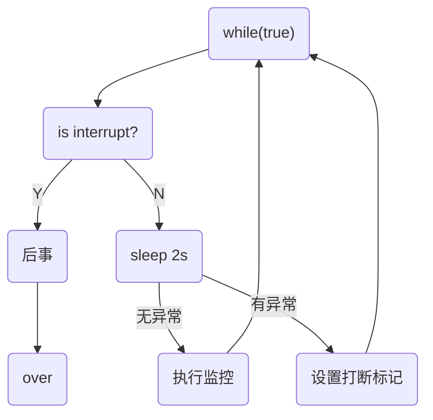

# Java高并发编程

[TOC]

[BV16J411h7Rd](https://www.bilibili.com/video/BV16J411h7Rd) P105

## 多线程

### 多线程创建

线程创建的三种方式：Thread类、Runnable接口、Callable接口

**创建方式一：继承Thread类**

* 继承Thread类并且重写`run()`方法，创建对象调用`start()`，由线程执行`run()`方法。(不直接使用`run()`方法，否则相当于程序调用，为一个线程)

```java
public class Thread1 extends Thread{
    @Override
    public void run() {
        for (int i = 0; i < 200; i++) {
            System.out.println("线程"+ i);
        }
    }

    public static void main(String[] args) {
        Thread1 thread1 = new Thread1();
        thread1.start();
        for (int i = 0; i < 200; i++) {
            System.out.println("Main Thread" + i);
        }
    }
}
```

或者：

```java
@Test
public void t1(){
    Thread t = new Thread(() -> log.debug("Running"), "Thread_Jan");
    t.start();
    log.debug("Running");
}
//00:20:47.440 [Thread_Jan] DEBUG demo.Begin - Running
//00:20:47.440 [main] DEBUG demo.Begin - Running
```

**创建方式二：实现Runnable接口**

```java
public class RunnableDemo implements Runnable{
    @Override
    public void run() {
        for (int i = 0; i < 30; i++) {
            System.out.println("Runnable== " + i);
        }
    }

    public static void main(String[] args) {
        // 创建实现类的对象
        RunnableDemo runnableDemo = new RunnableDemo();
        // 创建线程对象，通过线程对象开启“代理”
        Thread thread = new Thread(runnableDemo);
        thread.start();

        for (int i = 0; i < 30; i++) {
            System.out.println("Main Thread" + i);
        }
    }
}
```

<font color='#00ff00'>避免单继承的局限性，灵活方便。</font>

```java
@Test
public void t2(){
    Runnable r = () -> log.debug("Runnable");
    new Thread(r, "R").start();
    log.debug("Main");
}
```

**创建方式三：使用FutureTask配合Thread**

> FutureTask可以返回线程执行的结果，而Runnable接口为`void`返回值

```java
@Test
public void t3() throws ExecutionException, InterruptedException {
    FutureTask<String> task = new FutureTask<>(()->{
        log.debug("Task");
        return "Future Task";
    });

    new Thread(task, "FT1").start();
    // 这里get会阻塞，等待任务执行完毕返回结果
    String s = task.get();
    log.debug("Main: " + s);
}
```

### 线程方法

线程切换原因：时间片用完、垃圾回收、有更高优先级的线程运行、线程自己调用`sleep` `yield` `wait`等方法。


🔵线程睡眠：两种睡眠方法

```java
@Test
public void sleeping() throws InterruptedException {
    Thread.sleep(1000);
    TimeUnit.SECONDS.sleep(2);
}
```

可以利用sleep防止CPU空转：

```java
@Test
public void sleeping() throws InterruptedException {
    while (true){
        Thread.sleep(10);
    }
}
```

🔵等待线程执行结束`join()`

> 可以通过join方法来实现同步

```java
private static int r = 0;
@Test
public void joining() throws InterruptedException {
    Thread t1 = new Thread(() -> r = 6, "t1");
    t1.start();
    t1.join();
    log.debug("r is {}", r);
}
// 16:28:07.326 [main] DEBUG demo.Begin - r is 6
```

有时效的`join(long n)`，等待线程结束最多等待时间。

🔵线程打断`interrupt()`

如果打断正常运行中的线程，会向此线程添加有一个**打断标记**，这个线程仍然会继续运行，需要线程自主决定是否结束自身；如果打断一个正在睡眠中的线程则会抛出`InterruptedException`，并且将打断标记`isInterrupted()`重新置为假。

```java
@Test
public void interr() throws InterruptedException {
    Thread t1 = new Thread(() -> {
        while (true) {
            if (Thread.currentThread().isInterrupted()) {
                log.debug("Being interrupted");
                break;
            }
        }
    }, "t1");
    t1.start();
    Thread.sleep(1000);
    log.debug("Interrupt");
    t1.interrupt();
    log.debug("Over");
}
/*
16:44:19.279 [main] DEBUG demo.Begin - Interrupt
16:44:19.281 [main] DEBUG demo.Begin - Over
16:44:19.281 [t1] DEBUG demo.Begin - Being interrupted
*/
```

### 不推荐使用的方法

`stop()`，停止线程

`suspend()`  ，暂停线程

`resume()`，恢复线程

三种方法已经过时，容易破坏线程的同步代码块，造成线程死锁。

### 主线程和守护线程

守护线程：只要其他非守护线程都执行完毕，如果守护线程还有代码未执行完毕，也必须结束。

垃圾回收器就可以是守护线程。

```java
thread.setDaemon(true);
```

### Java中线程的六种状态：

* NEW
* RUNNABLE，这个状态涵盖了操作系统方面的运行中，阻塞和就绪状态。
* BLOCKED
* WAITING
* TIMED_WAITING，sleep时候的状态
* TERMINATED

其中`BLOCKED,WAITING,TIMED_WAITING`是Java层面的阻塞，不是操作系统层面上的阻塞。

## 共享模型—管程

### synchronized关键字

互斥关键字

```java
@Slf4j(topic = "互斥测试")
public class Exclusive {
    static int count = 0;
    @Test
    public void sync() {
        // 测试Synchronized关键字
        Object countLock = new Object();
        new Thread(()->{
            for (int i = 0; i < 5000; i++) {
                synchronized (countLock){
                    count++;
                }
            }
        }).start();

        new Thread(()->{
            for (int i = 0; i < 5000; i++) {
                synchronized (countLock){
                    count--;
                }
            }
        }).start();

        try {
            Thread.sleep(500);
        } catch (InterruptedException e) {
            e.printStackTrace();
        }
        log.debug("{}", count);
    }
}
```

🔵面向对象优化

```java
class Room {
    private int count = 0;

    public void increment(){
        synchronized (this){
            count++;
        }
    }
    
    public void decrement(){
        synchronized (this){
            count--;
        }
    }
    
    public int getCount() {
        synchronized (this){
            return count;
        }
    }
}
```

🔵方法上的`Synchronized`

以下表示方式都是等价的：

```java
class Test{
    public synchronized void t (){}
    public void t (){
        synchronized(this){
            
        }
    }
}
```

方法二：

```java
class Test{
    public synchronized static void t (){}
    public static void t (){
        synchronized(Test.class){
            
        }
    }
}
```

### 线程安全分析

成员变量和静态变量是否线程安全？如果两者没有共享则线程安全；如果有共享，只有读操作则线程安全，有读写操作则不安全。

局部变量的线程安全：

```java
void test(){
    int i = 10;
    i++;
}
```

对于这个情况，多个线程共同访问是线程安全的。由于是局部非引用变量，各个线程之间保有其栈帧，i变量在各个栈中间不会互相影响。

局部引用变量的线程安全：

```java
class Test{
    ArrayList<String> list = new ArrayList();
    private void m1(ArrayList list){
        list.add('0');
    }
    private void m2(ArrayList list){
        list.remove(0);
    }
}
```

如果在本例子中引用的是成员变量`list`，则很有可能发生线程不安全的问题。

```java
class Test{
    private void m0(ArrayList list){
        ArrayList<String> list = new ArrayList();
        m1(list);
        m2(list);
    }
    private void m1(ArrayList list){
        list.add('0');
    }
    private void m2(ArrayList list){
        list.remove(0);
    }
}
```

而在本情况下不会存在线程安全问题，`list`变量存放在对象的栈帧中，两个对象有两份`list`互不影响。

但是如果将`m1`方法使用`public`公开后，使用子类来对其进行继承覆写，使用另一个线程进行处理，就会出现线程安全问题，这时候的Test类的局部变量，相对于子类来说就是成员变量。因此可以使用`private`或者`final`修饰方法防止子类继承覆写。

🔵线程安全类

```java
String, Integer, StringBuffer, Random, Vector, Hashtable, JUC的包
```

### Monitor概念

monitor可以称为**监视器**或者**管程**

### synchronized优化原理

🔵轻量级锁

使用场景：如果一个对象虽然有多线程访问，但是多线程访问的时间段是错开的（没有竞争），那么可以使用轻量级锁来进行优化。

```java
public static final Object obj = new Object();

public static void m1() {
    synchronized (obj){
        m2();
    }
}

public static void m2(){
    synchronized (obj){
        System.out.println("sth");
    }
}
```

对于方法`m2()`，在调用之前有`m1()`调用已经加锁，在`m2`中同样加了锁，但是这是可以在同一个线程中进行的操作，因此`m2`加的锁是**重入锁**，在锁记录中会有两条记录，当两条记录全部解除之后才会对obj对象解除占用。

🔵锁膨胀

如果在尝试加入轻量级锁的过程中，CAS操作无法完成，即已经有其他线程对此对象加上了轻量级锁，这个时候就需要进行**锁膨胀**，将轻量级锁转为重量级锁。


重量级锁的话就需要请求Monitor对象。


🔵自旋优化

重量级锁竞争的时候，还可以使用自旋来进行优化，如果当前的进程自旋成功（即这时候持锁线程已经退出了同步锁，释放了锁），这是当前的进程就可以避免阻塞。

自旋成功：


自选失败：


由于阻塞会造成系统的上下文切换开销较大，因此通过自旋来进行等待（只对多核系统有效）。

🔵偏向锁

轻量级锁在没有竞争的时候，每次冲入仍然需要执行CAS操作。

偏向锁就是将线程的ID设置到锁对象的头中，之后如果发现这个线程的ID是自己的就表示没有竞争。

Java中默认会开启偏向锁，对象头后三位是`101`。

> 如果对于一个对象调用了其`hashcode()`方法，会禁用这个对象的偏向锁，由于对于偏向锁中并不存储`hashcode`字段，因此会转为普通锁，影响锁的状态。

**撤销偏向锁**

* 使用`hashcode()`方法
* 当有其他线程使用偏向锁对象的时候，会自动升级为轻量级锁。
* `wait()`和`notify()`方法，只有重量级锁采用阻塞和唤醒方法。

🔵批量重新偏向/撤销

如果撤销偏向锁的阈值超过20次之后，jvm有可能会重新添加偏向锁。

如果撤销偏向锁的阈值超过40次之后，jvm会将**整个类和新创建的对象**全部设置为不可偏向。

🔵锁消除

对于已经加了锁，但是程序不可能多线程用到锁的程序段，Java中会有一个JIT即时编译器来进行优化，将对应的锁进行消除，并且加锁会导致执行速度变慢，锁消除可以优化执行速度。

### wait/notify

当一个线程调用`wait`方法的时候，线程会变为`WAITING`状态，进入monitor中的`Waitset`队列中（阻塞的线程放在`EntryList`中），但是**前提是**必须先获得锁。

```java
@Slf4j(topic = "wait demo")
public class WaitDemo {
    private static final Object o = new Object();

    public static void main(String[] args) throws InterruptedException {
        Thread t1, t2;

        t2 = new Thread(() -> {
            synchronized (o) {
                try {
                    o.wait();
                } catch (InterruptedException e) {
                    e.printStackTrace();
                }
                log.debug("t2");
            }
        }, "t2");

        t1 = new Thread(() -> {
            synchronized (o) {
                try {
                    o.wait();
                } catch (InterruptedException e) {
                    e.printStackTrace();
                }
                log.debug("t1");
                o.notify();
            }
        }, "t1");

        t1.start();
        t2.start();
        Thread.sleep(1000);
        synchronized (o){
            o.notify();
        }
        t2.join();
    }
}
```

`notify()`是唤醒一个进程，`notifyAll()`是唤醒所有的进程。

`sleep()`和`wait()`区别：

* 后者需要配合`synchronized`关键字一起使用
* 前者不释放锁，后者会释放锁
* 两者状态都是`TIME_WAITING`

🔵错误唤醒：

如果不同角色的线程使用相同的锁，如何解决被错误唤醒也是一个问题。

解决方法：

* 可以使用`notifyAll()`和轮询检测对应的标志变量。

  ```java
  synchronized(lock){
  	while(sign){
        lock.wait();
  	}
  }
  ```

  

* 分别使用不同的锁

### 设计模式——保护性暂停

见设计模式一章

## 并发设计模式

### 两阶段终止设计模式

在一线程1中“优雅”的终止线程2。这里的优雅是指能够给线程2一些处理后续操作的机会。比如线程2可能会持有一些共享资源的锁，需要释放锁，来防止其他线程死锁一直等待释放资源。

监控线程的流程：



代码：

```java
@Slf4j(topic = "Monitor")
class Monitor{
    private Thread monitor;
    public void start(){
        monitor = new Thread(() -> {
            while (true){
                Thread cur = Thread.currentThread();
                if (cur.isInterrupted()){
                    log.debug("料理后事，释放所持有的资源");
                    break;
                }
                try {
                    Thread.sleep(1000); // 如果这里被打断会重置打断标记
                    log.debug("继续监控");
                } catch (InterruptedException e) {
                    e.printStackTrace();
                    log.debug("睡眠中被打断");
                    cur.interrupt();
                }
            }
        }, "Monitor");

        monitor.start();
    }

    public void stop(){
        monitor.interrupt();
    }
}
```

🔵知识点：

对于Java多线程中有两个方法`isInterrupted()`和方法`interrupted()`，两者都是用来判断当前的线程是否被打断，而前者不会清除打断标记，后者会清除打断标记。

### 同步保护性暂停

即guarded suspension，用在一个线程等待另一个线程的执行结果。

要点：

