# Java高并发编程

[TOC]

[BV16J411h7Rd](https://www.bilibili.com/video/BV16J411h7Rd) P146

## 多线程

### 多线程创建

线程创建的三种方式：Thread类、Runnable接口、Callable接口

**创建方式一：继承Thread类**

* 继承Thread类并且重写`run()`方法，创建对象调用`start()`，由线程执行`run()`方法。(不直接使用`run()`方法，否则相当于程序调用，为一个线程)

```java
public class Thread1 extends Thread{
    @Override
    public void run() {
        for (int i = 0; i < 200; i++) {
            System.out.println("线程"+ i);
        }
    }

    public static void main(String[] args) {
        Thread1 thread1 = new Thread1();
        thread1.start();
        for (int i = 0; i < 200; i++) {
            System.out.println("Main Thread" + i);
        }
    }
}
```

或者：

```java
@Test
public void t1(){
    Thread t = new Thread(() -> log.debug("Running"), "Thread_Jan");
    t.start();
    log.debug("Running");
}
//00:20:47.440 [Thread_Jan] DEBUG demo.Begin - Running
//00:20:47.440 [main] DEBUG demo.Begin - Running
```

**创建方式二：实现Runnable接口**

```java
public class RunnableDemo implements Runnable{
    @Override
    public void run() {
        for (int i = 0; i < 30; i++) {
            System.out.println("Runnable== " + i);
        }
    }

    public static void main(String[] args) {
        // 创建实现类的对象
        RunnableDemo runnableDemo = new RunnableDemo();
        // 创建线程对象，通过线程对象开启“代理”
        Thread thread = new Thread(runnableDemo);
        thread.start();

        for (int i = 0; i < 30; i++) {
            System.out.println("Main Thread" + i);
        }
    }
}
```

<font color='#00ff00'>避免单继承的局限性，灵活方便。</font>

```java
@Test
public void t2(){
    Runnable r = () -> log.debug("Runnable");
    new Thread(r, "R").start();
    log.debug("Main");
}
```

**创建方式三：使用FutureTask配合Thread**

> FutureTask可以返回线程执行的结果，而Runnable接口为`void`返回值

```java
@Test
public void t3() throws ExecutionException, InterruptedException {
    FutureTask<String> task = new FutureTask<>(()->{
        log.debug("Task");
        return "Future Task";
    });

    new Thread(task, "FT1").start();
    // 这里get会阻塞，等待任务执行完毕返回结果
    String s = task.get();
    log.debug("Main: " + s);
}
```

### 线程方法

线程切换原因：时间片用完、垃圾回收、有更高优先级的线程运行、线程自己调用`sleep` `yield` `wait`等方法。


🔵线程睡眠：两种睡眠方法

```java
@Test
public void sleeping() throws InterruptedException {
    Thread.sleep(1000);
    TimeUnit.SECONDS.sleep(2);
}
```

可以利用sleep防止CPU空转：

```java
@Test
public void sleeping() throws InterruptedException {
    while (true){
        Thread.sleep(10);
    }
}
```

🔵等待线程执行结束`join()`

> 可以通过join方法来实现同步

```java
private static int r = 0;
@Test
public void joining() throws InterruptedException {
    Thread t1 = new Thread(() -> r = 6, "t1");
    t1.start();
    t1.join();
    log.debug("r is {}", r);
}
// 16:28:07.326 [main] DEBUG demo.Begin - r is 6
```

有时效的`join(long n)`，等待线程结束最多等待时间。

🔵线程打断`interrupt()`

如果打断正常运行中的线程，会向此线程添加有一个**打断标记**，这个线程仍然会继续运行，需要线程自主决定是否结束自身；如果打断一个正在睡眠中的线程则会抛出`InterruptedException`，并且将打断标记`isInterrupted()`重新置为假。

```java
@Test
public void interr() throws InterruptedException {
    Thread t1 = new Thread(() -> {
        while (true) {
            if (Thread.currentThread().isInterrupted()) {
                log.debug("Being interrupted");
                break;
            }
        }
    }, "t1");
    t1.start();
    Thread.sleep(1000);
    log.debug("Interrupt");
    t1.interrupt();
    log.debug("Over");
}
/*
16:44:19.279 [main] DEBUG demo.Begin - Interrupt
16:44:19.281 [main] DEBUG demo.Begin - Over
16:44:19.281 [t1] DEBUG demo.Begin - Being interrupted
*/
```

### 不推荐使用的方法

`stop()`，停止线程

`suspend()`  ，暂停线程

`resume()`，恢复线程

三种方法已经过时，容易破坏线程的同步代码块，造成线程死锁。

### 主线程和守护线程

守护线程：只要其他非守护线程都执行完毕，如果守护线程还有代码未执行完毕，也必须结束。

垃圾回收器就可以是守护线程。

```java
thread.setDaemon(true);
```

### Java中线程的六种状态：

* NEW
* RUNNABLE，这个状态涵盖了操作系统方面的运行中，阻塞和就绪状态。
* BLOCKED
* WAITING
* TIMED_WAITING，sleep时候的状态
* TERMINATED

其中`BLOCKED,WAITING,TIMED_WAITING`是Java层面的阻塞，不是操作系统层面上的阻塞。

## 共享模型—管程

### synchronized关键字

互斥关键字

```java
@Slf4j(topic = "互斥测试")
public class Exclusive {
    static int count = 0;
    @Test
    public void sync() {
        // 测试Synchronized关键字
        Object countLock = new Object();
        new Thread(()->{
            for (int i = 0; i < 5000; i++) {
                synchronized (countLock){
                    count++;
                }
            }
        }).start();

        new Thread(()->{
            for (int i = 0; i < 5000; i++) {
                synchronized (countLock){
                    count--;
                }
            }
        }).start();

        try {
            Thread.sleep(500);
        } catch (InterruptedException e) {
            e.printStackTrace();
        }
        log.debug("{}", count);
    }
}
```

🔵面向对象优化

```java
class Room {
    private int count = 0;

    public void increment(){
        synchronized (this){
            count++;
        }
    }
    
    public void decrement(){
        synchronized (this){
            count--;
        }
    }
    
    public int getCount() {
        synchronized (this){
            return count;
        }
    }
}
```

🔵方法上的`Synchronized`

以下表示方式都是等价的：

```java
class Test{
    public synchronized void t (){}
    public void t (){
        synchronized(this){
            
        }
    }
}
```

方法二：

```java
class Test{
    public synchronized static void t (){}
    public static void t (){
        synchronized(Test.class){
            
        }
    }
}
```

### 线程安全分析

成员变量和静态变量是否线程安全？如果两者没有共享则线程安全；如果有共享，只有读操作则线程安全，有读写操作则不安全。

局部变量的线程安全：

```java
void test(){
    int i = 10;
    i++;
}
```

对于这个情况，多个线程共同访问是线程安全的。由于是局部非引用变量，各个线程之间保有其栈帧，i变量在各个栈中间不会互相影响。

局部引用变量的线程安全：

```java
class Test{
    ArrayList<String> list = new ArrayList();
    private void m1(ArrayList list){
        list.add('0');
    }
    private void m2(ArrayList list){
        list.remove(0);
    }
}
```

如果在本例子中引用的是成员变量`list`，则很有可能发生线程不安全的问题。

```java
class Test{
    private void m0(ArrayList list){
        ArrayList<String> list = new ArrayList();
        m1(list);
        m2(list);
    }
    private void m1(ArrayList list){
        list.add('0');
    }
    private void m2(ArrayList list){
        list.remove(0);
    }
}
```

而在本情况下不会存在线程安全问题，`list`变量存放在对象的栈帧中，两个对象有两份`list`互不影响。

但是如果将`m1`方法使用`public`公开后，使用子类来对其进行继承覆写，使用另一个线程进行处理，就会出现线程安全问题，这时候的Test类的局部变量，相对于子类来说就是成员变量。因此可以使用`private`或者`final`修饰方法防止子类继承覆写。

🔵线程安全类

```java
String, Integer, StringBuffer, Random, Vector, Hashtable, JUC的包
```

### Monitor概念

monitor可以称为**监视器**或者**管程**

### synchronized优化原理

🔵轻量级锁

使用场景：如果一个对象虽然有多线程访问，但是多线程访问的时间段是错开的（没有竞争），那么可以使用轻量级锁来进行优化。

```java
public static final Object obj = new Object();

public static void m1() {
    synchronized (obj){
        m2();
    }
}

public static void m2(){
    synchronized (obj){
        System.out.println("sth");
    }
}
```

对于方法`m2()`，在调用之前有`m1()`调用已经加锁，在`m2`中同样加了锁，但是这是可以在同一个线程中进行的操作，因此`m2`加的锁是**重入锁**，在锁记录中会有两条记录，当两条记录全部解除之后才会对obj对象解除占用。

🔵锁膨胀

如果在尝试加入轻量级锁的过程中，CAS操作无法完成，即已经有其他线程对此对象加上了轻量级锁，这个时候就需要进行**锁膨胀**，将轻量级锁转为重量级锁。


重量级锁的话就需要请求Monitor对象。


🔵自旋优化

重量级锁竞争的时候，还可以使用自旋来进行优化，如果当前的进程自旋成功（即这时候持锁线程已经退出了同步锁，释放了锁），这是当前的进程就可以避免阻塞。

自旋成功：


自选失败：


由于阻塞会造成系统的上下文切换开销较大，因此通过自旋来进行等待（只对多核系统有效）。

🔵偏向锁

轻量级锁在没有竞争的时候，每次冲入仍然需要执行CAS操作。

偏向锁就是将线程的ID设置到锁对象的头中，之后如果发现这个线程的ID是自己的就表示没有竞争。

Java中默认会开启偏向锁，对象头后三位是`101`。

> 如果对于一个对象调用了其`hashcode()`方法，会禁用这个对象的偏向锁，由于对于偏向锁中并不存储`hashcode`字段，因此会转为普通锁，影响锁的状态。

**撤销偏向锁**

* 使用`hashcode()`方法
* 当有其他线程使用偏向锁对象的时候，会自动升级为轻量级锁。
* `wait()`和`notify()`方法，只有重量级锁采用阻塞和唤醒方法。

🔵批量重新偏向/撤销

如果撤销偏向锁的阈值超过20次之后，jvm有可能会重新添加偏向锁。

如果撤销偏向锁的阈值超过40次之后，jvm会将**整个类和新创建的对象**全部设置为不可偏向。

🔵锁消除

对于已经加了锁，但是程序不可能多线程用到锁的程序段，Java中会有一个JIT即时编译器来进行优化，将对应的锁进行消除，并且加锁会导致执行速度变慢，锁消除可以优化执行速度。

### wait/notify

当一个线程调用`wait`方法的时候，线程会变为`WAITING`状态，进入monitor中的`Waitset`队列中（阻塞的线程放在`EntryList`中），但是**前提是**必须先获得锁。

```java
@Slf4j(topic = "wait demo")
public class WaitDemo {
    private static final Object o = new Object();

    public static void main(String[] args) throws InterruptedException {
        Thread t1, t2;

        t2 = new Thread(() -> {
            synchronized (o) {
                try {
                    o.wait();
                } catch (InterruptedException e) {
                    e.printStackTrace();
                }
                log.debug("t2");
            }
        }, "t2");

        t1 = new Thread(() -> {
            synchronized (o) {
                try {
                    o.wait();
                } catch (InterruptedException e) {
                    e.printStackTrace();
                }
                log.debug("t1");
                o.notify();
            }
        }, "t1");

        t1.start();
        t2.start();
        Thread.sleep(1000);
        synchronized (o){
            o.notify();
        }
        t2.join();
    }
}
```

`notify()`是唤醒一个进程，`notifyAll()`是唤醒所有的进程。

`sleep()`和`wait()`区别：

* 后者需要配合`synchronized`关键字一起使用
* 前者不释放锁，后者会释放锁
* 两者状态都是`TIME_WAITING`

🔵错误唤醒：

如果不同角色的线程使用相同的锁，如何解决被错误唤醒也是一个问题。

解决方法：

* 可以使用`notifyAll()`和轮询检测对应的标志变量。

  ```java
  synchronized(lock){
  	while(sign){
        lock.wait();
  	}
  }
  ```

  

* 分别使用不同的锁

### 设计模式——保护性暂停

见设计模式一章

### park和unpark

是`LockSupport`中提供的，用于暂停和恢复线程的执行。

```java
@Slf4j(topic = "Park")
public class Park {
    public static void main(String[] args) {
        Thread t1 = new Thread(() -> {
            log.debug("Start park");
            LockSupport.park();
            log.debug("Park over");
        }, "t1");

        t1.start();

        try {
            Thread.sleep(1000);
            log.debug("Start Unpark");
            LockSupport.unpark(t1);
        } catch (InterruptedException e) {
            e.printStackTrace();
        }
    }
}
```

🔵park的特点

`unpark`可以在`park`之前调用并且唤醒对应的线程，park的线程不使用`Monitor`来对线程进行操作。

`unpark`相当于补充干粮，`park`的时候如果没有干粮就等待，干粮充足就无需等待。

### Java线程状态转换


* 2情况在`synchronized`获取对象锁之后调用`wait()`变成`WAITING`状态，`notify()`竞争成功变为`RUNNABLE`，锁竞争失败变`BLOCKED`。
* 3情况是在`join()`方法调用线程会变为`WAITING`
* 4情况比如`park()`
* `RUNNABLE`变为`TIMED_WAITING`使用方法比如`join(n),wait(n)，sleep(n),parkNanos(n)`

### 死锁定位与解决

检测死锁可以使用jconsole或者jps来定位进程ID，再用jstack定位死锁。

```
Found one Java-level deadlock:
=============================
"DL-1":
  waiting to lock monitor 0x000002159213d700 (object 0x00000007153d4498, a java.lang.Object),
  which is held by "DL-2"
"DL-2":
  waiting to lock monitor 0x000002159213f700 (object 0x00000007153d4488, a java.lang.Object),
  which is held by "DL-1"

Java stack information for the threads listed above:
===================================================
"DL-1":
        at com.yz.interrupt.DeadLock.lambda$main$0(DeadLock.java:15)
        - waiting to lock <0x00000007153d4498> (a java.lang.Object)
        - locked <0x00000007153d4488> (a java.lang.Object)
        at com.yz.interrupt.DeadLock$$Lambda$14/0x0000000800066840.run(Unknown Source)
        at java.lang.Thread.run(java.base@11.0.11/Thread.java:829)
"DL-2":
        at com.yz.interrupt.DeadLock.lambda$main$1(DeadLock.java:29)
        - waiting to lock <0x00000007153d4488> (a java.lang.Object)
        - locked <0x00000007153d4498> (a java.lang.Object)
        at com.yz.interrupt.DeadLock$$Lambda$15/0x0000000800066c40.run(Unknown Source)
        at java.lang.Thread.run(java.base@11.0.11/Thread.java:829)

Found 1 deadlock.
```

以上是发现死锁的信息。

### 活锁

死锁是由于两个线程之间互相持有两者都想要却又不放手的资源而导致程序无法进行的情况。

而活锁是由于两个线程之间互相改变两者对应结束条件而产生迟迟无法结束的情况。

这里两个线程互相改变`count`的值。

```java
@Slf4j(topic = "LiveLock")
public class LiveLock {
    static int count = 10;

    public static void main(String[] args) {
        new Thread(() -> {
            while (count > 0) {
                try {
                    Thread.sleep(200);
                    count--;
                    log.debug("count: {}", count);
                } catch (InterruptedException e) {
                    e.printStackTrace();
                }
            }
        }).start();

        new Thread(() -> {
            while (count < 20) {
                try {
                    Thread.sleep(200);
                    count++;
                    log.debug("count: {}", count);
                } catch (InterruptedException e) {
                    e.printStackTrace();
                }
            }
        }).start();
    }
}
```

如何解决活锁的情况：

* 可以将两者的指令执行交错开，等一个线程执行完毕再执行另一个线程。

### ※可重入锁ReentrantLock

> ReentrantLock，可重入锁

可重入锁的特点：

* 可中断，
* 可以设置超时时间，如果在指定时间内无法获得锁，就执行其他操作。
* 可以设置公平锁，防止出现饥饿的现象。
* 支持多个条件变量

基本语法：

```java
reentrantLock.lock();
// 临界区
try{
    // 临界区
}finally{
    // 释放锁
    reentrantLock.unlock();
}
```

🔵可重入

```java
private static ReentrantLock lock = new ReentrantLock();

public static void main(String[] args) {
    lock.lock();
    try {
        log.debug("Main");
        m1();
    }finally {
        lock.unlock();
    }
}

public static void m1(){
    lock.lock();
    try {
        log.debug("m1");
    }finally {
        lock.unlock();
    }
}
```

🔵可打断`lockInterruptibly()`

```java
public static void canInterrupt() {
    Thread t1 = new Thread(() -> {
        try {
            lock.lockInterruptibly();
        } catch (InterruptedException e) {
            e.printStackTrace();
            log.debug("未获得锁，退出");
            return;
        }

        try {
            log.debug("获得锁");
        }finally {
            lock.unlock();
        }
    });

    lock.lock();
    t1.start();
    log.debug("打断t1");
    t1.interrupt();
    lock.unlock();
}
```

🔵锁超时`tryLock()`

> `tryLock()`可以设置超时时间。`tryLock(n, TimeUnit)`，可以利用`tryLock`方法来解决哲学家进餐问题，只需要在对应的资源类上继承`ReentrantLock`即可实现。

```java
public static void tryLock() {
    Thread t1 = new Thread(() -> {
        try {
            log.debug("尝试获取锁");
            if (!lock.tryLock(2, TimeUnit.SECONDS)) {
                log.debug("获取不到锁，886");
                return;
            }
            try {
                log.debug("获取到锁");
            } finally {
                lock.unlock();
            }
        } catch (InterruptedException e) {
            e.printStackTrace();
            return;
        }
    });

    lock.lock();
    t1.start();
    try {
        Thread.sleep(1000);
    } catch (InterruptedException e) {
        e.printStackTrace();
    }
    lock.unlock();
}
```

🔵锁公平

使用`ReentrantLock(True)`可以将其设置为公平锁。

> 但是一般情况下没必要设置公平锁。

🔵条件变量

条件变量的等待`await()`需要获得锁。使用条件变量便捷之处就是在一个线程处于`WAITING`状态的时候不会被虚假唤醒，可以通过各个不同的条件变量来进行特定唤醒。

```java
@Slf4j(topic = "ConditionLock")
public class ConditionLock {

    static ReentrantLock lock = new ReentrantLock();
    static boolean hasCigar = false, hasTakeout = false;

    public static void main(String[] args) throws InterruptedException {
        Condition cigar = lock.newCondition();
        Condition takeout = lock.newCondition();

        new Thread(() -> {
            lock.lock();
            try {
                while (!hasCigar) {
                    log.debug("No cigar, await");
                    try {
                        cigar.await();
                    } catch (InterruptedException e) {
                        e.printStackTrace();
                    }
                }
                log.debug("Has Cigar, Start work.");
            } finally {
                lock.unlock();
            }
        }).start();

        new Thread(() -> {
            lock.lock();
            try {
                while (!hasTakeout) {
                    log.debug("No takeout, await");
                    try {
                        takeout.await();
                    } catch (InterruptedException e) {
                        e.printStackTrace();
                    }
                }
                log.debug("Has Cigar, Start work.");
            } finally {
                lock.unlock();
            }
        }).start();

        Thread.sleep(1000);

        lock.lock();
        try {
            hasCigar = true;
            log.debug("Send cigar");
            cigar.signal();
        } finally {
            lock.unlock();
        }

        Thread.sleep(1000);

        lock.lock();
        try {
            hasTakeout = true;
            log.debug("Send takeout");
            takeout.signal();
        } finally {
            lock.unlock();
        }
    }
}
```

## JMM-共享内存模型

> JMM即，Java Memory Model，主要体现在原子性、可见性、有序性。

原子性是保证指令不受线程上下文切换的影响，可见性是保证指令不受CPU缓存的影响，有序性是保证指令不会受CPU指令并行优化的影响。

### 可见性

```java
static boolean run = true;

public static void main(String[] args) throws InterruptedException {
    new Thread(() -> {
        while (run){

        }
    }, "T").start();
    Thread.sleep(1000);
    run = false;
}
```

这里一秒后程序并不会停下来。

> 注意里面没有代码。停下来可能是在while里面加了println吧，因为println是一个线程安全的方法 ，底层有synchronized，而synchronized保证了可见性，不会一直循环。

🔵为什么线程没有停下来？

线程开始前，`run`变量保存在主存中。线程开始之后，由于需要对比`run`变量的次数过多，JIT即时编译器就将`run`变量存放在另一处高速缓存中，之后此线程对比的变量就是高速缓存中的`run`变量。主存中的`run`变量发生变化的时候并未同步到高速缓存中，因此线程T最终对比的还是旧的`run`变量，从而导致线程无法停止。从而引出**可见性**这个知识点。

**解决方法**：

* 对变量修饰`volatile`关键字，设置变量不允许在缓存中读取。
* 或者使用`synchronized`关键字进行包围。在Java内存模型中，synchronized规定，线程在加锁时， 先清空工作内存→在主内存中拷贝最新变量的副本到工作内存 →执行完代码→将更改后的共享变量的值刷新到主内存中→释放互斥锁。

🔵使用`volatile`的注意事项：

* `volatile`并不保证指令的原子性，只是保证一个线程修改变量，其他线程也可见，不保证指令的交错。
* `sychronized`既可以保证代码块的原子性，也可以保证代码块内变量的原子性，但缺点就是`synchronized`是重量级操作，性能更低。

### 有序性

JVM会在不影响正确性的前提下，调整语句的执行顺序。比如：

```java
int i, j;
i = 1;
j = 2;
```

执行的时候可能会先对`i`赋值，也有可能先对`j`变量进行赋值。在单线程情况下是安全的，但是在多线程的情况下是会影响程序的正确性。

🔵为什么会进行**指令重排**的优化？


为了提高CPU的执行效率。

🔵诡异的结果

对于指令重排的效果需要借助大量的并发压力测试才能够复现诡异的结果。比如：

```java
@Slf4j(topic = "Ordering")
@JCStressTest
@Outcome(id = {"1", "4"}, expect = Expect.ACCEPTABLE, desc = "OK")
@Outcome(id = {"0"}, expect = Expect.ACCEPTABLE_INTERESTING, desc = "!!!!!!")
@State
public class TestOrdering {
    // 指令重排
    int num = 0;
    boolean ready = false;

    @Actor
    public void actor1(I_Result r) {
        if (ready) r.r1 = num + num;
        else r.r1 = 1;
    }

    @Actor
    public void actor2(I_Result r) {
        num = 2;
        ready = true;
    }
}
```

这里的标注`@Actor`表示两个线程，通过分析代码可以知道程序运行如果没有指令重排会有两个结果，1和4。但是如果存在指令重排的情况下就会出现结果为0的情况。

重排会让`actor2()`方法中的两条指令颠倒顺序。

```java
public void actor2(I_Result r) {
    ready = true;
    num = 2;
}
```

结果也表明有千万级的结果是1或者4，只有千数量级的可能结果是0。


🟣诡异的结果解决方法：

还是在`ready`变量加上`volatile`修饰，可以防止在存在`ready`语句之前的代码重排序。

```java
@Slf4j(topic = "Ordering")
@JCStressTest
@Outcome(id = {"1", "4"}, expect = Expect.ACCEPTABLE, desc = "OK")
@Outcome(id = {"0"}, expect = Expect.ACCEPTABLE_INTERESTING, desc = "!!!!!!")
@State
public class TestOrdering {
    // 指令重排
    int num = 0;
    boolean volatile ready = false;

    @Actor
    public void actor1(I_Result r) {
        if (ready) r.r1 = num + num;
        else r.r1 = 1;
    }

    @Actor
    public void actor2(I_Result r) {
        num = 2;
        ready = true;
    }
}
```


## 并发设计模式

### 两阶段终止设计模式

🔵方式一：设置打断标记法

在一线程1中“优雅”的终止线程2。这里的优雅是指能够给线程2一些处理后续操作的机会。比如线程2可能会持有一些共享资源的锁，需要释放锁，来防止其他线程死锁一直等待释放资源。

监控线程的流程：

```mermaid
graph TD
w("while(true)")-->a
a("is interrupt?") -- Y --> b("后事")
b-->c(over)
a--N-->d(sleep 2s)
d-- 无异常 -->e(执行监控)
d-- 有异常 -->f(设置打断标记)
f --> w
e --> w
```



代码：

```java
@Slf4j(topic = "Monitor")
class Monitor{
    private Thread monitor;
    public void start(){
        monitor = new Thread(() -> {
            while (true){
                Thread cur = Thread.currentThread();
                if (cur.isInterrupted()){
                    log.debug("料理后事，释放所持有的资源");
                    break;
                }
                try {
                    Thread.sleep(1000); // 如果这里被打断会重置打断标记
                    log.debug("继续监控");
                } catch (InterruptedException e) {
                    e.printStackTrace();
                    log.debug("睡眠中被打断");
                    cur.interrupt();
                }
            }
        }, "Monitor");

        monitor.start();
    }

    public void stop(){
        monitor.interrupt();
    }
}
```

🟣知识点：

对于Java多线程中有两个方法`isInterrupted()`和方法`interrupted()`，两者都是用来判断当前的线程是否被打断，而前者不会清除打断标记，后者会清除打断标记。

🔵方式二：volatile方式

```java
@Slf4j(topic = "Monitor")
class Monitor{
    private Thread monitor;
    private volatile boolean hasStop;
    public void start(){
        monitor = new Thread(() -> {
            while (true){
                Thread cur = Thread.currentThread();
                if (hasStop){
                    log.debug("料理后事，释放所持有的资源");
                    break;
                }
                try {
                    Thread.sleep(1000); // 如果这里被打断会重置打断标记
                    log.debug("继续监控");
                } catch (InterruptedException e) {
                }
            }
        }, "Monitor");

        monitor.start();
    }

    public void stop(){
        hasStop = true;
        monitor.interrupt();
    }
}
```

这里的`interrupt()`是用于直接打断睡眠时间，防止等待时间过长。

### 同步保护性暂停

即guarded suspension，用在一个线程等待另一个线程的执行结果。

### 生产者消费者模式

### 哲学家进餐问题

```java
public class Philosopher extends Thread {
    Chopstick c1, c2;

    public static void main(String[] args) {
        Chopstick c1 = new Chopstick("c1");
        Chopstick c2 = new Chopstick("c2");
        Chopstick c3 = new Chopstick("c3");
        Chopstick c4 = new Chopstick("c4");
        Chopstick c5 = new Chopstick("c5");

        Philosopher p1 = new Philosopher("p1", c1, c2);
        Philosopher p2 = new Philosopher("p2", c2, c3);
        Philosopher p3 = new Philosopher("p3", c3, c4);
        Philosopher p4 = new Philosopher("p4", c4, c5);
        Philosopher p5 = new Philosopher("p5", c5, c1);

        p1.start();
        p2.start();
        p3.start();
        p4.start();
        p5.start();
    }

    public Philosopher(String name, Chopstick c1, Chopstick c2) {
        super(name);
        this.c1 = c1;
        this.c2 = c2;
    }

    @Override
    public void run() {
        while (true) {
            synchronized (c1) {
                synchronized (c2) {
                    eat();
                }
            }
        }
    }

    private void eat() {
        System.out.println(this.getName() + " Eat.");
        try {
            Thread.sleep(500);
        } catch (InterruptedException e) {
            e.printStackTrace();
        }
    }
}
```

### 同步模式顺序控制

> 让不同线程之间的按照指定的顺序进行执行

🔵join方式

🔵wait/notify版

```java
@Test
public void testSync2() throws InterruptedException {
    Thread t1, t2;

    t2 = new Thread(() -> {
        synchronized (lock){
            log.debug("2");
            has2 = true;
            lock.notify();
        }
    }, "t2");

    t1 = new Thread(() -> {
        synchronized (lock) {
            while (!has2) {
                try {
                    lock.wait();
                } catch (InterruptedException e) {
                    e.printStackTrace();
                }
            }
        }
        log.debug("1");
    }, "t1");

    t1.start();
    t2.start();

    t1.join();
}
```

🔵await/signal版

```java
public void print(String s, Condition cur, Condition next){
    lock.lock();
    try{
        cur.await();
        log.debug("a");
        next.signal();
    }finally{
        lock.unlock();
    }
}
```

🔵park/unpark版

### 同步模式之犹豫模式(Balking)

这个用于检查一个线程发现另一个线程已经开始做相同的事情时候，本线程无需在做就退出。

```java
static volatile boolean isStarted;
public void start(){
    synchronized(this){
        if(isStarted)return;
        isStarted=true;
    }
    // 业务代码
}
```

