# Java高并发编程

[TOC]

[BV16J411h7Rd](https://www.bilibili.com/video/BV16J411h7Rd?p=153) P153

[ThreadLocal 95-100](https://www.bilibili.com/video/BV15b4y117RJ) Over

> 备注：还有disrupt、guava、异步编程、并行编程未涉及。

## 一. 多线程

### 0x1. 多线程创建

线程创建的三种方式：Thread类、Runnable接口、Callable接口

**创建方式一：继承Thread类**

* 继承Thread类并且重写`run()`方法，创建对象调用`start()`，由线程执行`run()`方法。(不直接使用`run()`方法，否则相当于程序调用，为一个线程)

```java
public class Thread1 extends Thread{
    @Override
    public void run() {
        for (int i = 0; i < 200; i++) {
            System.out.println("线程"+ i);
        }
    }

    public static void main(String[] args) {
        Thread1 thread1 = new Thread1();
        thread1.start();
        for (int i = 0; i < 200; i++) {
            System.out.println("Main Thread" + i);
        }
    }
}
```

或者：

```java
@Test
public void t1(){
    Thread t = new Thread(() -> log.debug("Running"), "Thread_Jan");
    t.start();
    log.debug("Running");
}
//00:20:47.440 [Thread_Jan] DEBUG demo.Begin - Running
//00:20:47.440 [main] DEBUG demo.Begin - Running
```

**创建方式二：实现Runnable接口**

```java
public class RunnableDemo implements Runnable{
    @Override
    public void run() {
        for (int i = 0; i < 30; i++) {
            System.out.println("Runnable== " + i);
        }
    }

    public static void main(String[] args) {
        // 创建实现类的对象
        RunnableDemo runnableDemo = new RunnableDemo();
        // 创建线程对象，通过线程对象开启“代理”
        Thread thread = new Thread(runnableDemo);
        thread.start();

        for (int i = 0; i < 30; i++) {
            System.out.println("Main Thread" + i);
        }
    }
}
```

<font color='#00ff00'>避免单继承的局限性，灵活方便。</font>

```java
@Test
public void t2(){
    Runnable r = () -> log.debug("Runnable");
    new Thread(r, "R").start();
    log.debug("Main");
}
```

**创建方式三：使用FutureTask配合Thread**

> FutureTask可以返回线程执行的结果，而Runnable接口为`void`返回值

```java
@Test
public void t3() throws ExecutionException, InterruptedException {
    FutureTask<String> task = new FutureTask<>(()->{
        log.debug("Task");
        return "Future Task";
    });

    new Thread(task, "FT1").start();
    // 这里get会阻塞，等待任务执行完毕返回结果
    String s = task.get();
    log.debug("Main: " + s);
}
```

使用 Runnable 更容易和线程池配合。

### 0x2. 线程方法

线程切换原因：时间片用完、垃圾回收、有更高优先级的线程运行、线程自己调用`sleep` `yield` `wait`等方法。


🔵线程睡眠：两种睡眠方法

```java
@Test
public void sleeping() throws InterruptedException {
    Thread.sleep(1000);
    TimeUnit.SECONDS.sleep(2);
}
```

可以利用sleep防止CPU空转：

```java
@Test
public void sleeping() throws InterruptedException {
    while (true){
        Thread.sleep(10);
    }
}
```

🔵等待线程执行结束`join()`

> 可以通过join方法来实现同步

```java
private static int r = 0;
@Test
public void joining() throws InterruptedException {
    Thread t1 = new Thread(() -> r = 6, "t1");
    t1.start();
    t1.join();
    log.debug("r is {}", r);
}
// 16:28:07.326 [main] DEBUG demo.Begin - r is 6
```

有时效的`join(long n)`，等待线程结束最多等待时间。

🔵线程打断`interrupt()`

如果打断正常运行中的线程，会向此线程添加有一个**打断标记**，这个线程仍然会继续运行，需要线程自主决定是否结束自身；如果打断一个正在睡眠中的线程则会抛出`InterruptedException`，并且将打断标记`isInterrupted()`重新置为假。

```java
@Test
public void interr() throws InterruptedException {
    Thread t1 = new Thread(() -> {
        while (true) {
            if (Thread.currentThread().isInterrupted()) {
                log.debug("Being interrupted");
                break;
            }
        }
    }, "t1");
    t1.start();
    Thread.sleep(1000);
    log.debug("Interrupt");
    t1.interrupt();
    log.debug("Over");
}
/*
16:44:19.279 [main] DEBUG demo.Begin - Interrupt
16:44:19.281 [main] DEBUG demo.Begin - Over
16:44:19.281 [t1] DEBUG demo.Begin - Being interrupted
*/
```

### 0x3. 不推荐使用的方法

`stop()`，停止线程

`suspend()`  ，暂停线程

`resume()`，恢复线程

三种方法已经过时，容易破坏线程的同步代码块，造成线程死锁。

### 0x4. 主线程和守护线程

守护线程：只要其他非守护线程都执行完毕，如果守护线程还有代码未执行完毕，也必须结束。

垃圾回收器就可以是守护线程。

```java
thread.setDaemon(true);
```

### 0x5. Java中线程的六种状态：

* NEW
* RUNNABLE，这个状态涵盖了操作系统方面的运行中，阻塞和就绪状态。
* BLOCKED
* WAITING
* TIMED_WAITING，sleep时候的状态
* TERMINATED

其中`BLOCKED,WAITING,TIMED_WAITING`是Java层面的阻塞，不是操作系统层面上的阻塞。

## 二. 共享模型—管程（悲观锁）

### 0x1. synchronized关键字

互斥关键字

```java
@Slf4j(topic = "互斥测试")
public class Exclusive {
    static int count = 0;
    @Test
    public void sync() {
        // 测试Synchronized关键字
        Object countLock = new Object();
        new Thread(()->{
            for (int i = 0; i < 5000; i++) {
                synchronized (countLock){
                    count++;
                }
            }
        }).start();

        new Thread(()->{
            for (int i = 0; i < 5000; i++) {
                synchronized (countLock){
                    count--;
                }
            }
        }).start();

        try {
            Thread.sleep(500);
        } catch (InterruptedException e) {
            e.printStackTrace();
        }
        log.debug("{}", count);
    }
}
```

🔵面向对象优化

```java
class Room {
    private int count = 0;

    public void increment(){
        synchronized (this){
            count++;
        }
    }
    
    public void decrement(){
        synchronized (this){
            count--;
        }
    }
    
    public int getCount() {
        synchronized (this){
            return count;
        }
    }
}
```

🔵方法上的`Synchronized`

以下表示方式都是等价的：

```java
class Test{
    public synchronized void t (){}
    public void t (){
        synchronized(this){
            
        }
    }
}
```

方法二：

```java
class Test{
    public synchronized static void t (){}
    public static void t (){
        synchronized(Test.class){
            
        }
    }
}
```

### 0x2. 线程安全分析

成员变量和静态变量是否线程安全？如果两者没有共享则线程安全；如果有共享，只有读操作则线程安全，有读写操作则不安全。

局部变量的线程安全：

```java
void test(){
    int i = 10;
    i++;
}
```

对于这个情况，多个线程共同访问是线程安全的。由于是局部非引用变量，各个线程之间保有其栈帧，i变量在各个栈中间不会互相影响。

局部引用变量的线程安全：

```java
class Test{
    ArrayList<String> list = new ArrayList();
    private void m1(ArrayList list){
        list.add('0');
    }
    private void m2(ArrayList list){
        list.remove(0);
    }
}
```

如果在本例子中引用的是成员变量`list`，则很有可能发生线程不安全的问题。

```java
class Test{
    private void m0(ArrayList list){
        ArrayList<String> list = new ArrayList();
        m1(list);
        m2(list);
    }
    private void m1(ArrayList list){
        list.add('0');
    }
    private void m2(ArrayList list){
        list.remove(0);
    }
}
```

而在本情况下不会存在线程安全问题，`list`变量存放在对象的栈帧中，两个对象有两份`list`互不影响。

但是如果将`m1`方法使用`public`公开后，使用子类来对其进行继承覆写，使用另一个线程进行处理，就会出现线程安全问题，这时候的Test类的局部变量，相对于子类来说就是成员变量。因此可以使用`private`或者`final`修饰方法防止子类继承覆写。

🔵线程安全类

```java
String, Integer, StringBuffer, Random, Vector, Hashtable, JUC的包
```

String 和 Integer 都是不可变类

### 0x3. Monitor概念

monitor可以称为**监视器**或者**管程**

普通对象的结构：


Klass Word 用于指向类的信息，Mark Word 用于保存对象 JVM 中的信息（锁，生存年龄，hashcode等信息）


因此一个 Integer 对象除了要保存 int 值数据之外还要保存对象头的信息，总共大小为 8+4=12 字节。

在使用 synchronized 语句的时候就将锁对象和 monitor 对象关联起来，当成功获取到锁的时候，就会将 mark word 中的状态信息改为 `10` 标记状态为重量级锁，前面 62 位字节指向 monitor 对象，那么当前线程就会成为该 monitor 的 `owner`。


如果其他线程此时也想获取锁，但是锁已经被占用，因此当前线程就会存入 monitor 对象的 `EntryList` 中等待锁的释放，并且进入 `BLOCK` 状态。

### 0x4. synchronized优化原理

由于 monitor 对象是由操作系统提供的，使用其成本较高，如果每次加锁都直接使用 monitor 耗费成本较高，因此 JVM 会使用轻量级锁和偏向锁来进行优化。

🔵轻量级锁

使用场景：如果一个对象虽然有多线程访问，但是多线程访问的时间段是错开的（没有竞争），那么可以使用轻量级锁来进行优化。

当一个线程使用 `synchronized` 的时候，此时临界资源的竞争较少，因此直接将锁对象的 mark word 标志位改为 `00`，并且在使用该锁的线程中创建一条锁记录，将对象头原先的 mark word 保存在锁记录中并且两者互相引用。这种锁不使用 monitor 这种重量级锁来进行处理，因此这种锁也成为轻量级锁。

当其他线程也是用该锁的时候，如果发现当前锁已经占用，为了能够加入 monitor 中的 EntryList，需要进入<a href="#锁膨胀">**锁膨胀**</a>的过程。


如果是当前线程使用嵌套 `synchronized` 那么就会执行锁重入，只增加一条锁记录作为重入计数。


当解锁的时候就执行恢复现场的操作，如果解锁失败则进入重量级锁解锁的流程。

```java
public static final Object obj = new Object();

public static void m1() {
    synchronized (obj){
        m2();
    }
}

public static void m2(){
    synchronized (obj){
        System.out.println("sth");
    }
}
```

对于方法`m2()`，在调用之前有`m1()`调用已经加锁，在`m2`中同样加了锁，但是这是可以在同一个线程中进行的操作，因此`m2`加的锁是**重入锁**即是轻量级锁，在锁记录中会有两条记录，当两条记录全部解除之后才会对obj对象解除占用。

🔵<span id='#锁膨胀'>锁膨胀</span>

如果在尝试加入轻量级锁的过程中，CAS操作无法完成，即已经有其他线程对此对象加上了轻量级锁，这个时候就需要进行**锁膨胀**，将轻量级锁转为重量级锁。

流程如下：

* 为锁对象申请 monitor 锁，让锁对象的 mark word state 改为 `10` 并且指向 monitor 对象。
* 然后自己进入 monitor 中的 EntryList 并且进入阻塞状态。
* 当用于轻量级锁的线程退出时候，将 mark word 恢复给锁对象头失败。进入重量级锁解锁流程，按照 monitor 地址找到 monitor 对象，设置 owner 为 null 并且唤醒其他线程。


重量级锁的话就需要请求 Monitor 对象。


🔵自旋优化

> 自旋可以认为是一个轮询等待上锁的过程。

重量级锁竞争的时候，还可以使用自旋来进行优化，如果当前的进程自旋成功（即这时候持锁线程已经退出了同步锁，释放了锁），这是当前的进程就可以避免阻塞。

自旋成功：


自旋失败：


由于阻塞会造成系统的上下文切换开销较大，因此通过自旋来进行等待（只对多核系统有效）。

🔵偏向锁

偏向锁是对可重入锁的优化。

轻量级锁在没有竞争的时候，每次重入仍然需要执行CAS操作。

偏向锁优化就是在第一次 cas 操作的时候将线程的ID设置到锁对象的头中，之后如果发现这个线程的ID是自己的就表示没有竞争。Java中默认会开启偏向锁，对象头后三位是`101`。

> 如果对于一个对象调用了其`hashcode()`方法，会禁用这个对象的偏向锁，由于对于偏向锁中并不存储`hashcode`字段，因此会转为普通锁，影响锁的状态。

**撤销偏向锁**

* 使用`hashcode()`方法
* 当有其他线程使用偏向锁对象的时候，会自动升级为轻量级锁。
* `wait()`和`notify()`方法，只有重量级锁采用阻塞和唤醒方法。

🔵批量重新偏向/撤销

如果撤销偏向锁的阈值超过20次之后，jvm有可能会重新添加偏向锁，偏向另一个线程。

如果撤销偏向锁的阈值超过40次之后，jvm会将**整个类和新创建的对象**全部设置为不可偏向。

🔵锁消除

对于已经加了锁，但是程序不可能多线程用到锁的程序段，Java中会有一个JIT即时编译器来进行优化，将对应的锁进行消除，并且加锁会导致执行速度变慢，锁消除可以优化执行速度。

### 0x4. wait/notify

当一个线程调用`wait`方法的时候，线程会变为`WAITING`状态，进入monitor中的`Waitset`队列中（阻塞的线程放在`EntryList`中），但是**前提**是必须先获得锁。

```java
@Slf4j(topic = "wait demo")
public class WaitDemo {
    private static final Object o = new Object();

    public static void main(String[] args) throws InterruptedException {
        Thread t1, t2;

        t2 = new Thread(() -> {
            synchronized (o) {
                try {
                    o.wait();
                } catch (InterruptedException e) {
                    e.printStackTrace();
                }
                log.debug("t2");
            }
        }, "t2");

        t1 = new Thread(() -> {
            synchronized (o) {
                try {
                    o.wait();
                } catch (InterruptedException e) {
                    e.printStackTrace();
                }
                log.debug("t1");
                o.notify();
            }
        }, "t1");

        t1.start();
        t2.start();
        Thread.sleep(1000);
        synchronized (o){
            o.notify();
        }
        t2.join();
    }
}
```

`notify()`是唤醒一个进程，`notifyAll()`是唤醒所有的进程。

`sleep()`和`wait()`区别：

* 后者需要配合`synchronized`关键字一起使用
* 前者不释放锁，后者会释放锁
* 两者状态都是`TIME_WAITING`

🔵错误唤醒：

如果不同角色的线程使用相同的锁，如何解决被错误唤醒也是一个问题。

解决方法：

* 可以使用`notifyAll()`和轮询检测对应的标志变量。

  ```java
  synchronized(lock){
  	while(sign){
        lock.wait();
  	}
  }
  ```

* 分别使用不同的锁

### 0x5. park和unpark

是`LockSupport`中提供的，用于暂停和恢复线程的执行。

```java
@Slf4j(topic = "Park")
public class Park {
    public static void main(String[] args) {
        Thread t1 = new Thread(() -> {
            log.debug("Start park");
            LockSupport.park();
            log.debug("Park over");
        }, "t1");

        t1.start();

        try {
            Thread.sleep(1000);
            log.debug("Start Unpark");
            LockSupport.unpark(t1);
        } catch (InterruptedException e) {
            e.printStackTrace();
        }
    }
}
```

🔵park的特点

`unpark`可以在`park`之前调用并且唤醒对应的线程，park的线程不使用`Monitor`来对线程进行操作。

`unpark`相当于补充干粮，`park`的时候如果没有干粮就等待，干粮充足就无需等待。

### 0x6. Java线程状态转换


* 2情况在`synchronized`获取对象锁之后调用`wait()`变成`WAITING`状态，`notify()`竞争成功变为`RUNNABLE`，锁竞争失败变`BLOCKED`。
* 3情况是在`join()`方法调用线程会变为`WAITING`
* 4情况比如`park()`
* `RUNNABLE`变为`TIMED_WAITING`使用方法比如`join(n),wait(n)，sleep(n),parkNanos(n)`

### 0x7. 死锁定位与解决

检测死锁可以使用jconsole或者jps来定位进程ID，再用jstack定位死锁。

```
Found one Java-level deadlock:
=============================
"DL-1":
  waiting to lock monitor 0x000002159213d700 (object 0x00000007153d4498, a java.lang.Object),
  which is held by "DL-2"
"DL-2":
  waiting to lock monitor 0x000002159213f700 (object 0x00000007153d4488, a java.lang.Object),
  which is held by "DL-1"

Java stack information for the threads listed above:
===================================================
"DL-1":
        at com.yz.interrupt.DeadLock.lambda$main$0(DeadLock.java:15)
        - waiting to lock <0x00000007153d4498> (a java.lang.Object)
        - locked <0x00000007153d4488> (a java.lang.Object)
        at com.yz.interrupt.DeadLock$$Lambda$14/0x0000000800066840.run(Unknown Source)
        at java.lang.Thread.run(java.base@11.0.11/Thread.java:829)
"DL-2":
        at com.yz.interrupt.DeadLock.lambda$main$1(DeadLock.java:29)
        - waiting to lock <0x00000007153d4488> (a java.lang.Object)
        - locked <0x00000007153d4498> (a java.lang.Object)
        at com.yz.interrupt.DeadLock$$Lambda$15/0x0000000800066c40.run(Unknown Source)
        at java.lang.Thread.run(java.base@11.0.11/Thread.java:829)

Found 1 deadlock.
```

以上是发现死锁的信息。

### 0x8. 活锁

死锁是由于两个线程之间互相持有两者都想要却又不放手的资源而导致程序无法进行的情况。

而活锁是由于两个线程之间互相改变两者对应结束条件而产生迟迟无法结束的情况。

这里两个线程互相改变`count`的值。

```java
@Slf4j(topic = "LiveLock")
public class LiveLock {
    static int count = 10;

    public static void main(String[] args) {
        new Thread(() -> {
            while (count > 0) {
                try {
                    Thread.sleep(200);
                    count--;
                    log.debug("count: {}", count);
                } catch (InterruptedException e) {
                    e.printStackTrace();
                }
            }
        }).start();

        new Thread(() -> {
            while (count < 20) {
                try {
                    Thread.sleep(200);
                    count++;
                    log.debug("count: {}", count);
                } catch (InterruptedException e) {
                    e.printStackTrace();
                }
            }
        }).start();
    }
}
```

如何解决活锁的情况：

* 可以将两者的指令执行交错开，等一个线程执行完毕再执行另一个线程。

### 0x9. ※可重入锁ReentrantLock

> ReentrantLock，可重入锁

可重入锁的特点：

* 可中断，
* 可以设置超时时间，如果在指定时间内无法获得锁，就执行其他操作。
* 可以设置公平锁，防止出现饥饿的现象。
* 支持多个条件变量

基本语法规范：

```java
reentrantLock.lock();
// 临界区
try{
    // 临界区
}finally{
    // 释放锁
    reentrantLock.unlock();
}
```

🔵可重入

```java
private static ReentrantLock lock = new ReentrantLock();

public static void main(String[] args) {
    lock.lock();
    try {
        log.debug("Main");
        m1();
    }finally {
        lock.unlock();
    }
}

public static void m1(){
    lock.lock();
    try {
        log.debug("m1");
    }finally {
        lock.unlock();
    }
}
```

🔵可打断`lockInterruptibly()`

```java
public static void canInterrupt() {
    Thread t1 = new Thread(() -> {
        try {
            lock.lockInterruptibly();
        } catch (InterruptedException e) {
            e.printStackTrace();
            log.debug("未获得锁，退出");
            return;
        }

        try {
            log.debug("获得锁");
        }finally {
            lock.unlock();
        }
    });

    lock.lock();
    t1.start();
    log.debug("打断t1");
    t1.interrupt();
    lock.unlock();
}
```

🔵锁超时`tryLock()`

> `tryLock()`可以设置超时时间。`tryLock(n, TimeUnit)`，可以利用`tryLock`方法来解决哲学家进餐问题，只需要在对应的资源类上继承`ReentrantLock`即可实现。

```java
public static void tryLock() {
    Thread t1 = new Thread(() -> {
        try {
            log.debug("尝试获取锁");
            if (!lock.tryLock(2, TimeUnit.SECONDS)) {
                log.debug("获取不到锁，886");
                return;
            }
            try {
                log.debug("获取到锁");
            } finally {
                lock.unlock();
            }
        } catch (InterruptedException e) {
            e.printStackTrace();
            return;
        }
    });

    lock.lock();
    t1.start();
    try {
        Thread.sleep(1000);
    } catch (InterruptedException e) {
        e.printStackTrace();
    }
    lock.unlock();
}
```

🔵锁公平

使用`ReentrantLock(True)`可以将其设置为公平锁。

> 但是一般情况下没必要设置公平锁。

🔵条件变量

条件变量的等待`await()`需要获得锁。使用条件变量便捷之处就是在一个线程处于`WAITING`状态的时候不会被虚假唤醒，可以通过各个不同的条件变量来进行特定唤醒。

```java
@Slf4j(topic = "ConditionLock")
public class ConditionLock {

    static ReentrantLock lock = new ReentrantLock();
    static boolean hasCigar = false, hasTakeout = false;

    public static void main(String[] args) throws InterruptedException {
        Condition cigar = lock.newCondition();
        Condition takeout = lock.newCondition();

        new Thread(() -> {
            lock.lock();
            try {
                while (!hasCigar) {
                    log.debug("No cigar, await");
                    try {
                        cigar.await();
                    } catch (InterruptedException e) {
                        e.printStackTrace();
                    }
                }
                log.debug("Has Cigar, Start work.");
            } finally {
                lock.unlock();
            }
        }).start();

        new Thread(() -> {
            lock.lock();
            try {
                while (!hasTakeout) {
                    log.debug("No takeout, await");
                    try {
                        takeout.await();
                    } catch (InterruptedException e) {
                        e.printStackTrace();
                    }
                }
                log.debug("Has Cigar, Start work.");
            } finally {
                lock.unlock();
            }
        }).start();

        Thread.sleep(1000);

        lock.lock();
        try {
            hasCigar = true;
            log.debug("Send cigar");
            cigar.signal();
        } finally {
            lock.unlock();
        }

        Thread.sleep(1000);

        lock.lock();
        try {
            hasTakeout = true;
            log.debug("Send takeout");
            takeout.signal();
        } finally {
            lock.unlock();
        }
    }
}
```

## 三. JMM-共享内存模型

> JMM即，Java Memory Model，主要体现在原子性、可见性、有序性。

原子性是保证指令不受线程上下文切换的影响，可见性是保证指令不受CPU缓存的影响，有序性是保证指令不会受CPU指令并行优化的影响。

### 0x1. 可见性

```java
static boolean run = true;

public static void main(String[] args) throws InterruptedException {
    new Thread(() -> {
        while (run){

        }
    }, "T").start();
    Thread.sleep(1000);
    run = false;
}
```

这里一秒后程序并不会停下来。

> 注意里面没有代码。但是如果在while里面加了`println`会停下来，因为`println`是一个线程安全的方法 ，底层有synchronized，而synchronized保证了可见性，不会一直循环。

🔵为什么线程没有停下来？

线程开始前，`run`变量保存在主存中。线程开始之后，由于需要对比`run`变量的次数过多，JIT即时编译器就将`run`变量存放在另一处高速缓存中，之后此线程对比的变量就是高速缓存中的`run`变量。主存中的`run`变量发生变化的时候并未同步到高速缓存中，因此线程T最终对比的还是旧的`run`变量，从而导致线程无法停止。从而引出**可见性**这个知识点。

**解决方法**：

* 对变量修饰`volatile`关键字，设置变量不允许在缓存中读取。
* 或者使用`synchronized`关键字进行包围。在Java内存模型中，`synchronized`规定，线程在加锁时， 先清空工作内存→在主内存中拷贝最新变量的副本到工作内存 →执行完代码→将更改后的共享变量的值刷新到主内存中→释放互斥锁。

🔵使用`volatile`的注意事项：

* `volatile`并不保证指令的原子性，只是保证一个线程修改变量，其他线程也可见，不保证指令的交错。
* `sychronized`既可以保证代码块的原子性，也可以保证代码块内变量的原子性，但缺点就是`synchronized`是重量级操作，性能更低。

### 0x2. 有序性

> 有序性和指令重排概念需要分开。

JVM会在不影响正确性的前提下，调整语句的执行顺序。比如：

```java
int i, j;
i = 1;
j = 2;
```

执行的时候可能会先对`i`赋值，也有可能先对`j`变量进行赋值。在单线程情况下是安全的，但是在多线程的情况下是会影响程序的正确性。

🔵为什么会进行**指令重排**的优化？

对于有些操作，可能前面的语句处理比较耗时，耗时少的代码就有可能放在前面。


为了提高CPU的执行效率。

🔵诡异的结果

对于指令重排的效果需要借助大量的并发压力测试才能够复现诡异的结果。比如：

```java
@Slf4j(topic = "Ordering")
@JCStressTest
@Outcome(id = {"1", "4"}, expect = Expect.ACCEPTABLE, desc = "OK")
@Outcome(id = {"0"}, expect = Expect.ACCEPTABLE_INTERESTING, desc = "!!!!!!")
@State
public class TestOrdering {
    // 指令重排
    int num = 0;
    boolean ready = false;

    @Actor
    public void actor1(I_Result r) {
        if (ready) r.r1 = num + num;
        else r.r1 = 1;
    }

    @Actor
    public void actor2(I_Result r) {
        num = 2;
        ready = true;
    }
}
```

这里的标注`@Actor`表示两个线程，通过分析代码可以知道程序运行如果没有指令重排会有两个结果，1和4。但是如果存在指令重排的情况下就会出现结果为0的情况。

重排会让`actor2()`方法中的两条指令颠倒顺序。

```java
public void actor2(I_Result r) {
    ready = true;
    num = 2;
}
```

结果也表明有千万级的结果是1或者4，只有千数量级的可能结果是0。


🟣诡异的结果解决方法：

还是在`ready`变量加上`volatile`修饰，可以防止在存在`ready`语句之前的代码重排序。

```java
@Slf4j(topic = "Ordering")
@JCStressTest
@Outcome(id = {"1", "4"}, expect = Expect.ACCEPTABLE, desc = "OK")
@Outcome(id = {"0"}, expect = Expect.ACCEPTABLE_INTERESTING, desc = "!!!!!!")
@State
public class TestOrdering {
    // 指令重排
    int num = 0;
    boolean volatile ready = false;

    @Actor
    public void actor1(I_Result r) {
        if (ready) r.r1 = num + num;
        else r.r1 = 1;
    }

    @Actor
    public void actor2(I_Result r) {
        num = 2;
        ready = true;
    }
}
```

### 0x3. ※volatile原理

> volatile底层原理是内存屏障（Memory Barrier / Fence）

* 在volatile变量写指令后会加入写屏障
* 在volatile变量读指令前会加入读屏障

🔵读写屏障是如何保证可见性？

写屏障是保证该屏障之前对共享变量的改动，都同步到主存中。

```java
public void actor2(I_Result r) {
    num = 2;
    ready = true;	// volatile
}
```

读屏障是保证在该屏障之后，对共享变量的读取，从主存中加载最新数据：

```java
public void actor1(I_Result r) {
    if (ready) r.r1 = num + num;
    else r.r1 = 1;
}
```

🔵读写屏障是如何保证有序性？

* 指令重排时，不会将写屏障之前的代码改到之后。
* 读屏障不会将之后的代码排在之前。

> 读写屏障同样不能解决指令的交错。

### 0x4. ※双重检查锁

> 本质知识点还是`volatile`原理

为了解决每次想要拿取一个对象的时候都要加锁，从而导致的性能问题，因此使用双重检查锁(Double-Check Lock)的形式来解决单例模式中可能发生**指令重排**这个问题。

```java
public class Singleton {
    private Singleton () {}

    private static Singleton instance;

    public static Singleton getInstance() {
        if (instance == null){
            synchronized (Singleton.class){
                if (instance == null){
                    instance = new Singleton();
                }
            }
        }
        return instance;
    }
}
```

但是这种看似完美情况存在一个问题：即对`instance`第一次检查的时候并未在`synchronized`保护块内，因此还有可能发生指令重排的情况。

```mermaid
sequenceDiagram
participant t1
participant instance
participant t2

t1 ->> t1 : 17 : new
t1 ->> t1 : 20 : dup
t1 ->> instance : 24 : putstatic(给instance赋值)
t2 ->> instance : 0 : getstatic(获取instance)
t2 ->> t2 : 3 : ifnonnull 37
t2 ->> t2 : 40 : areturn 返回
t2 ->> t2 : 40 : 使用对象
t1 ->> t1 : 21 : invokespecial(调用构造方法)
```



> `synchronized`只保证代码的有序性即java代码一句一句执行，不保证jvm字节码指令的重排。如果不加此关键字，两种情况代码交错和指令交错都是有可能发生的。

这里的`sychronized`代码块中的`instance = new Singleton()`指令可能会发生重排，因此在这种情况下，可能先进行类初始化后并未调用构造方法，然后对`instance`变量进行赋值，此时另一个多线程已经获取到这个`instance`变量，然而此时的`instance`变量是一个未经过调用构造方法初始化的变量，因此直接使用可能会出现问题。

🔵如何解决双重检查锁的问题：

给`instance`变量进行`volatile`进行修饰，使用`volatile`修饰之后，写屏障之前的代码不会被重排到写屏障之后，即在对`instance`变量赋值之前，必然已经执行构造方法并且写入主存。在对变量进行读取之前加入读屏障，防止读取变量之后的指令重排到之前，并且将主存中的最新数据读取到线程的工作内存中，保证程序的正确性。

### 0x5. Happens-Before规则

happens-before规则规定了对共享变量对其他线程读操作可见，是一套有序性和可见性的规则总结，抛开happens-before规则，JMM并不能保证一个线程对共享变量的写，其他线程对于共享变量的读可见。

1. 线程解锁m之前对变量的写，对于接下来对m的加锁的其他线程对该变量读可见。

   ```java
   static int x;
   static Object lock = new Object();
   
   void main(){
       new Thread(()->{
           synchronized(lock){
               x = 10;
           }
       }).start();
       
       new Thread(()->{
           synchronized(lock){
               System.out.println(x);
           }
       }).start();
   }
   ```

2. 使用`volatile`关键字对变量进行修饰

   ```java
   static volatile int x;
   
   void main(){
       new Thread(()->{
           x = 10;
       }).start();
       
       new Thread(()->{
           System.out.println(x);
       }).start();
   }
   ```

3. 在写屏障之间的语句：

   ```java
   static volatile int x;
   static int y;
   
   void main(){
       new Thread(()->{
           y = 20;
           x = 10;
       }).start();
       
       new Thread(()->{
           // 其中y对第二个线程也可见
           System.out.println(x);
       }).start();
   }
   ```

### 简单习题

🔵单例习题1：

```java
// 1. 为什么加final
// 2. 如果实现了Serializable接口，怎么防止序列化破坏单例？
public final class Singleton implements Serializable {
    // 3. 为什么设置为私有构造方法？是否能防止反射创建新的实例？
    private Singleton();
    // 4. 这样初始化是否能保证单例对象创建时线程安全？
    private static final Singleton instance = new Singleton();
    // 5. 为什么提供静态方法而不是之间将instance变量设置为public？
    public static Singleton getInstance(){
        return instance;
    }
    
    public Object readResolve() {
        return instance;
    }
}
```

1. 防止子类继承覆盖父类方法，从而破坏单例。
2. 添加一个`readResolve`方法返回已经创建好的实例。
3. 如果设为公有构造方法其他对象都能创建这个对象，破坏了单例。设置为私有不能防止反射创建新的实例，反射的功能很强大，可以得到类的构造器，并且设置`setAccessible(True)`就可以暴露构造方法调用构造器。
4. 不存在线程安全问题，静态属性实在类加载器中进行加载的，JVM保证其线程安全。
5. 设置为public就可以随便进行修改，设置方法就可以对其进行很好的封装。

🔵单例2：

```java
// 1. 枚举单例是怎么限制单例个数的？
// 2. 枚举单例在创建时是否有并发问题？
// 3. 枚举单例是否能被反射破坏单例？
// 4. 枚举单例是否能被反序列化破坏单例？
// 5. 枚举单例是懒汉式还是饿汉式？
// 6. 枚举单例如果希望加入一些初始化逻辑该怎么做？
public enum Singleton {
    INSTANCE;
}
```

1. 根据反编译字节码可知，枚举单例的本质就是静态常量(`static final`)
2. 同样没有，静态属性实在类加载器中进行加载的，JVM保证其线程安全。
3. 不能被反射
4. 可以被序列化，因为Enum类就实现了`Serializable`接口并且已经考虑到破坏单例的情况，无需其他操作。
5. 饿汉式
6. 加入构造方法即可。

## 共享模型—无锁（乐观锁）

### CAS

> CAS(Compare And Set)，在更新的时候先进行比对然后进行新值的设置。

这个是简单的无锁实现方式，借助`AtomicInteger`来进行操作，没有上锁且比上锁更加轻量级，并且能够保证线程安全。

```java
public class Withdraw {
    private AtomicInteger balance;

    public Withdraw(int balance) {
        this.balance = new AtomicInteger(balance);
    }

    public int getBalance() {
        return balance.get();
    }

    public void withdraw() {
        while (true) {
            int prev = balance.get();
            int next = prev - 10;
            if (balance.compareAndSet(prev, next)) break;
        }
    }
}
```

🔵如何实现的？

* CAS操作需要比对之前的值，如果匹配才能够修改成功，否则就会修改失败。

* 并且CAS还需要`volatile`修饰的支持，CAS中对应变量才能够读取到变量的最新值才能实现CAS操作。

🔵效率分析：

使用无锁的形式要比`synchronized`的效率要高，因为没有上下文切换，代价较高；而CAS不会主动让上下文进行切换，开销较小。

🔵CAS特点：

* 适用于线程数较少、多核CPU的情况下
* CAS是基于乐观锁的思想：不怕别的线程修改共享变量。
* `synchronized`是基于悲观锁的思想，时刻放着其他线程对共享变量的修改。
* 但是CAS如果竞争激烈，重试必然频繁发生，反而效率收到影响。

### 原子整数

JUC提供了很多原子操作包，比如`AtomicInteger`,`AtomicLong`,`AtomicBoolean`

```java
AtomicInteger i = new AtomicInteger();

System.out.println(i.get());
System.out.println(i.getAndIncrement()); // i++
System.out.println(i.incrementAndGet()); // ++i

System.out.println(i.getAndAdd(2)); // i, i += 2
System.out.println(i.addAndGet(2)); // i+=2, i

// 复杂运算 updateAndGet 或者 getAndUpdate
System.out.println(i.updateAndGet(v -> (int) Math.pow(v, 2)));  // square
```

像其他方法`getAndIncrement,getAndAdd,updateAndGet`都是在while循环的基础上演化而来的比如：

```java
public final int updateAndGet(IntUnaryOperator updateFunction) {
    int prev = get(), next = 0;
    for (boolean haveNext = false;;) {
        if (!haveNext)
            next = updateFunction.applyAsInt(prev);
        if (weakCompareAndSetVolatile(prev, next))
            return next;
        haveNext = (prev == (prev = get()));
    }
}
```

### 原子引用

原子引用类型比如`AtomicReference,AtomicMarkableReference,AtomicStampedReference`

```java
public class AdvancedAtomic {
    AtomicReference<BigDecimal> balance;

    public AdvancedAtomic(BigDecimal balance) {
        this.balance = new AtomicReference<>(balance);
    }

    public BigDecimal getBalance() {
        return balance.get();
    }

    public void subBalance(BigDecimal mount) {
        while (true) {
            BigDecimal prev = balance.get();
            BigDecimal next = prev.subtract(mount);
            if (balance.compareAndSet(prev, next)) break;
        }
    }
}
```

🔵ABA问题：

```java
@Slf4j(topic = "ABA")
public class ABAProblem {
    private static AtomicReference<String> str = new AtomicReference<>("A");

    public static void main(String[] args) throws InterruptedException {
        log.debug("Main start...");
        String prev = str.get();
        other();
        Thread.sleep(1000);
        log.debug("Change A -> C, {}", str.compareAndSet(prev, "C"));
    }

    public static void other() throws InterruptedException {
        new Thread(() -> {
            log.debug("Change A -> B, {}", str.compareAndSet("A", "B"));
        }).start();
        Thread.sleep(500);
        new Thread(() -> {
            log.debug("Change B -> A, {}", str.compareAndSet("B", "A"));
        }).start();
    }
}
```

输出如下：

```
22:27:40.990 [main] DEBUG ABA - Main start...
22:27:40.992 [Thread-0] DEBUG ABA - Change A -> B, true
22:27:41.493 [Thread-1] DEBUG ABA - Change B -> A, true
22:27:42.493 [main] DEBUG ABA - Change A -> C, true
```

🟣存在的问题：

在从A改为C的过程中，变量从A改为B，B又改为A，中间发生了变化，但是CAS从A到C之间并未察觉到中间的变化，修改时的A和以前的A是不同的。因此需要其他的形式比如具有版本号的类`AtomicStampedReference`来处理。

🔵`AtomicStampedReference`类的使用

使用`AtomicStampedReference`的时候不仅需要比对原来的值，还需要比对原来值对应的版本号！

```java
@Slf4j(topic = "ABA")
public class ABAProblem2 {
    private static AtomicStampedReference<String> str = new AtomicStampedReference<>("A", 0);

    public static void main(String[] args) throws InterruptedException {
        log.debug("Main start...");
        String prev = str.getReference();
        int stamp = str.getStamp();
        other();
        Thread.sleep(1000);
        log.debug("Change A -> C, {}", str.compareAndSet(prev, "C", stamp, stamp + 1));
    }

    public static void other() throws InterruptedException {
        new Thread(() -> {
            int stamp = str.getStamp();
            log.debug("Change A -> B, {}", str.compareAndSet("A", "B", stamp, stamp + 1));
        }).start();
        Thread.sleep(500);
        new Thread(() -> {
            int stamp = str.getStamp();
            log.debug("Change B -> A, {}", str.compareAndSet("B", "A", stamp, stamp + 1));
        }).start();
    }
}
```

输出：

```
22:34:16.443 [main] DEBUG ABA - Main start...
22:34:16.446 [Thread-0] DEBUG ABA - Change A -> B, true
22:34:16.956 [Thread-1] DEBUG ABA - Change B -> A, true
22:34:17.956 [main] DEBUG ABA - Change A -> C, false
```

结果执行为false，修改失败！

🔵`AtomicMarkableReference`类的使用

有时候我们不关心变量改过多少次，只关心改过没有，因此`AtomicMarkableReference`类存放的不是版本号，而是一个Boolean值。

### 原子数组

有三种类型：`AtomicIntegerArray, AtomicLongArray, AtomicReferenceArray`分别处理不同的数据类型

```java
@Slf4j(topic = "AtomicArray")
public class AtomicArray {
    public static void main(String[] args) throws InterruptedException {
        int threadNum = 10;
        Thread pools[] = new Thread[threadNum];

        AtomicIntegerArray aDemo = new AtomicIntegerArray(threadNum);
        for (int i = 0; i < threadNum; i++) {
            pools[i] = new Thread(() -> {
                for (int j = 0; j < 1000; j++) {
                    for (int k = 0; k < threadNum; k++) {
                        aDemo.getAndIncrement(k);
                    }
                }
            });
        }

        for (int i = 0; i < threadNum; i++) {
            pools[i].start();
        }
        Thread.sleep(500);
        System.out.println(aDemo);

    }
}
```

### 字段更新器

> 原子数组保护的是数组元素，字段更新器保护的是对象中的属性。

类分为：`AtomicReferenceFieldUpdater, AtomicIntegerFieldUpdater, AtomicLongFieldUpdater`，分别针对的类型为引用类型，int和Long类型。

❗注意：想要进行Updater的属性**必须**使用`volatile`进行修饰。

```java
public class AtomicRefUpdater {
    public static void main(String[] args) {
        Dog dog = new Dog();
        AtomicReferenceFieldUpdater updater
                = AtomicReferenceFieldUpdater.newUpdater(Dog.class, String.class, "name");

        updater.compareAndSet(dog,null,"QQ");
        System.out.println(dog.name);	// QQ

    }
}

class Dog {
    volatile String name;
}
```

### 原子累加器Adder

> 对于原子累加器，要比`AtomicInteger`等类性能要高。

🔵缓存行与伪共享

CPU分为不同级别的缓存（L1，L2，L3缓存），对于每次想要读取的数据，就将内存中的数据读取到一个缓存行中，Adder中使用到一个数据结构`Cell`，由于Cell是一个数组，当Cell[0]中的数据更新的时候，会导致另一个CPU中的同样数据的缓存行失效，需要重新读取更新最新值。由于更新的只是数组中的一个元素，其他元素并未更新，就会导致数组中其他索引也失效，从而需要更新整个数组对应的缓存行。

而Adder中的`@sun.misc.Contended`注解就是为了解决这个问题，将数组中每个元素都作为一个缓存行，其它为空白的padding，这样当Cell[0]发生改变的时候不会改变Cell[1]中的缓存行就不会失效，提高了读取的效率。


🔵源码解读：

[P179-LongAdder源码解读-add](https://www.bilibili.com/video/BV16J411h7Rd?p=179)

看不懂

### unsafe

>使用底层方法来对线程、内存进行操作

🔵获取unsafe对象

jdk8

```java
public static void main(String[] args) throws NoSuchFieldException, IllegalAccessException {
    Field theUnsafe = Unsafe.class.getDeclaredField("theUnsafe");
    theUnsafe.setAccessible(true);
    Unsafe unsafe = (Unsafe) theUnsafe.get(null);
    System.out.println(unsafe);
}
```

<del>jdk11以上加入了直接调用</del>（但是不能在自己的方法中用，还得使用反射的方式）：

```java
Unsafe unsafe = Unsafe.getUnsafe();
```

🔵Unsafe的CAS方法

```java
public class UnsafeDemo {
    public static void main(String[] args) throws NoSuchFieldException, IllegalAccessException {
        Field theUnsafe = Unsafe.class.getDeclaredField("theUnsafe");
        theUnsafe.setAccessible(true);
        Unsafe unsafe = (Unsafe) theUnsafe.get(null);
        // 1. 获取对应属性的偏移地址
        long ageOffset = unsafe.objectFieldOffset(Cat.class.getDeclaredField("age"));
        long nicknameOffset = unsafe.objectFieldOffset(Cat.class.getDeclaredField("nickname"));
        // 2. cas操作
        Cat cat = new Cat();
        unsafe.compareAndSwapInt(cat, ageOffset,0, 3);
        unsafe.compareAndSwapObject(cat,nicknameOffset, null,"小兰");
        // 3. 查看结果
        System.out.println(cat);

    }
}

@Data
class Cat {
    volatile int age;
    volatile String nickname;
}
```

## 不可变类

举例：

```java
@Slf4j(topic = "Mutable")
public class MutableDemo {
    public static void main(String[] args) {
        SimpleDateFormat sdf = new SimpleDateFormat("yyyy-MM-dd");
        for (int i = 0; i < 10; i++) {
            new Thread(() -> {
                try {
                    log.debug("{}", sdf.parse("2014-2-1"));
                } catch (ParseException e) {
                    e.printStackTrace();
                }
            }).start();
        }
    }
}
```

`SimpleDateFormat`类并不是线程安全的类，运行这段代码会出错`java.lang.NumberFormatException`。

### 不可变对象

针对上方可能会出错的例子，可以使用不可变类来进行优化`DateTimeFormatter`

```java
@Slf4j(topic = "Immutable")
public class ImmutableDemo {
    public static void main(String[] args) {
        DateTimeFormatter dtf = DateTimeFormatter.ofPattern("yyyy-MM-dd");
        for (int i = 0; i < 10; i++) {
            new Thread(() -> {
                log.debug("{}", dtf.parse("2014-02-01"));
            }).start();
        }
    }
}
```

🔵不可变对象的设计

对于需要修改原来对象的情况下，不可变类会使用保护性拷贝来进行保护。

### final原理

## 并发工具

### 自定义线程池

线程池就时为了省去创建线程的开销，提前创建线程，使用的时候拿出来，不用的时候再放回去，避免过多的上下文切换的开销耗费。


### JDK线程池ThreadPoolExecutor

🔵线程池状态

ThreadPoolExecutor使用一个int数字来存储线程的信息：高三位表示线程池的状态，低29位表示线程的数量。

| 状态       | 高3位 | 接受新任务 | 处理阻塞任务 | 说明                                                 |
| ---------- | ----- | ---------- | ------------ | ---------------------------------------------------- |
| RUNNING    | 111   | Y          | Y            |                                                      |
| SHUTDOWN   | 000   | N          | Y            | 温和打断线程执行，不接收任务但会处理阻塞队列中的任务 |
| STOP       | 001   | N          | N            | 暴力打断线程执行，并且抛弃阻塞队列的任务             |
| TIDYING    | 010   | -          | -            | 任务全部执行完毕，即将终结                           |
| TERMINATED | 011   | -          | -            | 终结状态                                             |

🔵构造方法解析：

```java
public ThreadPoolExecutor(int corePoolSize,					// 核心线程数目
                   int maximumPoolSize,				// 最大线程数
                   long keepAliveTime,				// 生存时间，针对救急线程
                   TimeUnit unit,					//
                   BlockingQueue<Runnable> workQueue,// 阻塞队列
                   ThreadFactory threadFactory,		// 线程工厂，为线程创建好名字
                   RejectedExecutionHandler handler)// 拒绝策略
```

JDK中的线程分为核心线程`corePoolSize`和救急线程，其中救急线程就是最大线程数家去核心线程数的数目。

如果任务的并发量很多，首先分配核心线程，还有任务则分配到阻塞队列中进行等待，如果还有任务就交给救急线程，救急线程是有生存时间限制的（**核心线程没有生存时间**），执行任务完毕就进入结束状态。如果核心线程和救急线程都放满了，就执行拒绝策略。

> 存在救急状态的情况是，你选择的阻塞队列是有界队列（即有容量大小限制的队列），才会有救急队列，斗则是没有救急队列的。

JDK中拒绝策略的实现：


* `AbortPolicy`让调用者抛出异常（默认）
* `CallerRunsPolicy`是让调用者运行任务
* `DiscardOldestPolicy`是放弃队列中最早的任务，本任务取而代之。
* `DiscardPolicy`是放弃本次任务

🔵线程池的工厂方法

1. `newFixedThreadPool`固定大小线程池：

   ```java
   public static ExecutorService newFixedThreadPool(int nThreads) {
       return new ThreadPoolExecutor(nThreads, nThreads,
                                     0L, TimeUnit.MILLISECONDS,
                                     new LinkedBlockingQueue<Runnable>());
   }
   ```

   使用的是无界队列

2. `newCachedThreadPool`缓冲线程池

   ```java
   public static ExecutorService newCachedThreadPool() {
       return new ThreadPoolExecutor(0, Integer.MAX_VALUE,
                                     60L, TimeUnit.SECONDS,
                                     new SynchronousQueue<Runnable>());
   }
   ```

   核心线程为0，意味着全是救急线程，`SynchronousQueue`的特点就是，在没有线程来取的情况下是不能放进去队列的，会阻塞在存放的方法上。

   适合任务数比较密集而且任务执行时间较短的情况。

3. `newSingleThreadPool` 单线程池

   ```java
   public static ExecutorService newSingleThreadExecutor() {
       return new FinalizableDelegatedExecutorService
           (new ThreadPoolExecutor(1, 1,
                                   0L, TimeUnit.MILLISECONDS,
                                   new LinkedBlockingQueue<Runnable>()));
   }
   ```

   选择的是`LinkedBlockingQueue`无界阻塞队列

   自己创建一个单线程的话不能处理异常，并且执行失败没有任何的补救措施。这个单线程池对于`ThreadPoolExecutor`还进行了一层包装，同`newFixedThreadPool(1)`还有所不同，使用的是装饰器模式

🔵提交任务

```java
void execute(Runnable thread);	// 执行任务
<T> Future<T> submit(Callable<T> task);	// 用于接收线程返回的结果

<T> List<Future<T>> invokeAll(Collection<? extends Callable<T>> tasks);
<T> List<Future<T>> invokeAll(Collection<? extends Callable<T>> tasks, long timeout, TimeUnit unit);	// 超时会停掉后面的任务

<T> T invokeAny(Collection<? extends Callable<T>> tasks);
<T> T invokeAny(Collection<? extends Callable<T>> tasks, long timeout, TimeUnit unit);
```

`invokeAny`是执行所有的任务，如果其中有一个任务返回，就作为整体的返回结果，其他线程会被取消。

submit：

```java
@Slf4j(topic = "JDKPool")
public class JDKPool {
    public static void main(String[] args) throws ExecutionException, InterruptedException {
        ExecutorService service = Executors.newSingleThreadExecutor();
        Future<String> submit = service.submit(() -> {
            log.debug("Wait");
            Thread.sleep(1000);
            return "Good";
        });

        log.info("{}", submit.get());   // 这里会阻塞
    }
}
```

🔵线程结束：

`shutdown()`方法是温和结束，停止接收任务，等待任务队列都结束后线程池才停止，状态改为`SHUTDOWN`。

`shutdownNow()`方法是暴力结束，停止接收任务并且将队列中的任务全部返回，状态改为`STOP`。并且返回在任务队列中的任务。

### 任务调度线程池

希望任务延时/定时执行，使用`newScheduledThreadPool`。

延时：

```java
@Slf4j(topic = "JDKPool")
public class JDKPool {
    public static void main(String[] args) throws ExecutionException, InterruptedException {
        ScheduledExecutorService pool = Executors.newScheduledThreadPool(2);
        pool.schedule(() -> {	// 延时
            log.debug("try");
        }, 1, TimeUnit.SECONDS);

        pool.scheduleAtFixedRate(()->{	// 定时：500ms执行一次
            log.debug("FIxed RATE");
        }, 1000,500,TimeUnit.MILLISECONDS);
        
        pool.scheduleWithFixedDelay(() -> {
            log.debug("FIxed Delay");
            Thread.sleep(2000);
        }, 1, 1, TimeUnit.SECONDS);
    }
}
```

注意：这里的`scheduleAtFixedRate`定时会被任务本身的执行时间所延长，不会使的任务同一时间执行两次。

`scheduleWithFixedDelay`定时是每一次任务执行结束后之间所间隔时间的定时，从上次任务结束时间开始计算。

### Fork/Join

> Fork/Join对于的处理类必须要继承`RecursiveTask`或者`RecursiveAction`，有返回值使用前者，无返回值使用后者

```java
@Slf4j(topic = "ForkJoinDemo")
public class ForkJoin {
    public static void main(String[] args) {
        ForkJoinPool pool = new ForkJoinPool(4);
        System.out.println(pool.invoke(new MyTask(5)));
    }
}

@Slf4j(topic = "MyTask")
class MyTask extends RecursiveTask<Integer> {

    private int n;

    public MyTask(int n) {
        this.n = n;
    }

    @Override
    public String toString() {
        return "{" + n + '}';
    }

    @Override
    protected Integer compute() {
        if (n == 1) return 1;
        MyTask t1 = new MyTask(n - 1);

        t1.fork();  // 执行任务
        log.debug("Fork {} + {}", n, t1);
        int res = t1.join() + n;
        log.debug("Join {} + {}", n, t1);
        return res;   // Join 获取任务结果
    }
}
```

> 5+MyTask(4), 4+MyTask(3), ...

输出信息：

```
12:51:41.526 [ForkJoinPool-1-worker-1] DEBUG MyTask - Fork 2 + {1}
12:51:41.526 [ForkJoinPool-1-worker-5] DEBUG MyTask - Fork 4 + {3}
12:51:41.526 [ForkJoinPool-1-worker-7] DEBUG MyTask - Fork 3 + {2}
12:51:41.548 [ForkJoinPool-1-worker-1] DEBUG MyTask - Join 2 + {1}
12:51:41.526 [ForkJoinPool-1-worker-3] DEBUG MyTask - Fork 5 + {4}
12:51:41.548 [ForkJoinPool-1-worker-7] DEBUG MyTask - Join 3 + {2}
12:51:41.549 [ForkJoinPool-1-worker-5] DEBUG MyTask - Join 4 + {3}
12:51:41.549 [ForkJoinPool-1-worker-3] DEBUG MyTask - Join 5 + {4}
15
```

可以看出执行任务确实是并行执行加和的。

## JUC工具包

### AQS原理

全称是AbstractQueuedSychronizer，是阻塞式锁和相关同步器工具的框架。

特点：

* 用state属性来表示资源的状态（独占模式，共享模式），子类需要定义如何维护这个状态，控制如何获得锁和维护锁。
  * getState获取状态，setState设置状态，compareAndSetState乐观锁设置state状态。
  * 独占模式是只有一个线程能够访问资源，共享模式允许多个
* 提供了基于FIFO的等待队列，类似Monitor中EntryList
* 条件变量来实现等待、唤醒机制、支持多个条件变量，类似Monitor中WaitSet

🔵使用AQS实现一个自定义锁

即借助`AbstractQueuedSynchronizer`类来进行实现。

```java
/**
 * 自定义锁（不可重入）
 */
@Slf4j(topic = "MyLock")
class MyLock implements Lock {

    class MySync extends AbstractQueuedSynchronizer {
        @Override
        protected boolean tryAcquire(int arg) {
            // 尝试获取锁
            if (compareAndSetState(0, 1)) {
                setExclusiveOwnerThread(Thread.currentThread());
                return true;
            }
            return false;
        }

        @Override
        protected boolean tryRelease(int arg) {
            // 尝试释放锁
            setExclusiveOwnerThread(null);
            /**
             * 因为State是Volatile修饰的，而exclusiveOwnerThread不是
             * 因此对volatile写操作应该放在最后，将线程工作内存中的数据写入主存
             */
            setState(0);
            return true;
        }

        @Override
        protected boolean isHeldExclusively() {
            // 是否持有独占锁
            return getState() == 1;
        }

        public Condition newCondition() {
            return new ConditionObject();
        }
    }

    private MySync sync = new MySync();

    @Override
    public void lock() {
        // 加锁
        sync.acquire(1);
    }

    @Override
    public void lockInterruptibly() throws InterruptedException {
        // 可打断
        sync.acquireInterruptibly(1);
    }

    @Override
    public boolean tryLock() {
        // 尝试加锁
        return sync.tryAcquire(1);
    }

    @Override
    public boolean tryLock(long time, @NotNull TimeUnit unit) throws InterruptedException {
        return sync.tryAcquireNanos(1, unit.toNanos(time));
    }

    @Override
    public void unlock() {
        sync.release(1);
    }

    @NotNull
    @Override
    public Condition newCondition() {
        return sync.newCondition();
    }
}
```

### ReentrantLock实现原理


🔵加锁解锁流程

加锁成功的话会使用CAS将AQS中的state从0修改为1。

加锁失败的话会调用`tryAcquire()`方法来获取锁，获取失败进入Monitor中的WaitSet中添加到队列的尾部，并且将前驱节点的waitStatus改为-1（表示前驱节点有责任唤醒后继节点），竞争失败然后进入park阻塞状态。

如果当前正在执行的线程执行完毕之后，前驱节点调用`unparkSuccessor()`方法来唤醒后继节点。对于非公平竞争，此时恰好也有一个线程创建并且在waitSet中的线程没有竞争过，则会重新加入waitSet队列中。

```java
final boolean acquireQueued(final Node node, int arg) {
    boolean interrupted = false;
    try {
        for (;;) {
            final Node p = node.predecessor();
            if (p == head && tryAcquire(arg)) {
                setHead(node);
                p.next = null; // help GC
                return interrupted;
            }
            if (shouldParkAfterFailedAcquire(p, node))
                interrupted |= parkAndCheckInterrupt();
        }
    } catch (Throwable t) {
        cancelAcquire(node);
        if (interrupted)
            selfInterrupt();
        throw t;
    }
}
```

🔵可重入原理

当线程进入时，如果没有线程执行则将state(0->1)，如果此时这个线程下又需要加锁，就成为了可重入锁，会将state做一个累加自增(1->2)，如果可重入锁释放的时候即将state减一。

🔵可打断原理

一般情况下都是**不可打断模式**，即使线程调用`interrupt()`方法，其依然还会驻留在AQS队列中，当他获取到锁的时候还会继续运行，只是将打断标记设置为true。

在可打断模式，使用抛出异常的方式打断循环，从AQS队列中停止执行。

```java
public final void acquireInterruptibly(int arg)
        throws InterruptedException {
    if (Thread.interrupted())
        throw new InterruptedException();
    if (!tryAcquire(arg))	// 未获得锁进入方法
        doAcquireInterruptibly(arg);
}

private void doAcquireInterruptibly(int arg)
    throws InterruptedException {
    final Node node = addWaiter(Node.EXCLUSIVE);
    try {
        for (;;) {
            final Node p = node.predecessor();
            if (p == head && tryAcquire(arg)) {
                setHead(node);
                p.next = null; // help GC
                return;
            }
            if (shouldParkAfterFailedAcquire(p, node) &&
                parkAndCheckInterrupt())
                throw new InterruptedException();	// 不会继续等待，这里抛出异常
        }
    } catch (Throwable t) {
        cancelAcquire(node);
        throw t;
    }
}
```

🔵条件变量的实现原理

条件变量对应的类是`ConditionObject`.

### 读写锁

🔵ReentrantReadWriteLock

当读操作远远多于写操作的时候，就可以使用读写锁，让读-读操作可以并发。

如果是读-读操作，如果加锁就不会阻塞；如果是读-写或者写-写操作就会阻塞。

注意：

* 读锁不支持条件变量（因为不需要）
* 读锁时获取写锁会导致写锁永久阻塞，有写锁情况下可以获取读锁。

```java
@Slf4j(topic = "RWLock")
public class RWLock {
    private int data;
    private ReentrantReadWriteLock rwlock = new ReentrantReadWriteLock();
    private ReentrantReadWriteLock.ReadLock readLock = rwlock.readLock();
    private ReentrantReadWriteLock.WriteLock writeLock = rwlock.writeLock();

    public int read() {
        log.debug("Get read Lock");
        readLock.lock();
        try {
            log.debug("Read");
            try {
                Thread.sleep(3000);
            } catch (InterruptedException e) {
                e.printStackTrace();
            }
            return data;
        } finally {
            log.debug("Release Read Lock");
            readLock.unlock();
        }
    }

    public void write(int data) {
        log.debug("Get Write Lock");
        writeLock.lock();
        try {
            log.debug("Write");
        } finally {
            log.debug("Release Write Lock");
            writeLock.unlock();
        }
    }

    public static void main(String[] args) {
        RWLock o = new RWLock();
        new Thread(() -> {
            o.read();
        }).start();

        new Thread(() -> {
            o.read();
        }).start();
    }
}
```

🔵原理

读写锁的state与普通的可重入锁的state不同，写锁使用的是state的低16位，读锁使用的是state的高16位。

🔵StampedLock

ReentrantReadWriteLock对于读读之间的锁性能还是不够优秀，底层还是走的AQS流程。StampedLock是配合一个【戳】，他支持乐观读，在乐观读之后通过验证戳是否有效，有过有效则读取成功，无效则需要手工重新加读锁。

```java
@Slf4j(topic = "StampedLock")
public class StampedLockDemo {
    private static volatile int data;
    private static StampedLock lock = new StampedLock();

    public static void main(String[] args) {
        new Thread(() -> {
            long stamp = lock.writeLock();
            try {
                data = 1;
            } finally {
                lock.unlockWrite(stamp);
            }
        }).start();

        new Thread(() -> {
            long stamp = lock.tryOptimisticRead();
            if (lock.validate(stamp)) {
                log.debug("Optimistic Read Success: {}", data);
                return;
            }
            log.debug("Optimistic read failed, update to lock..");
            stamp = lock.readLock();
            try {
                log.debug("Lock read data: {}", data);
            } finally {
                lock.unlockRead(stamp);
            }
        }).start();
    }
}
```

**缺点：**

* 不支持条件变量
* 不支持可重入锁

### 缓存更新策略

当对数据重新进行修改的时候，是先清空缓存还是先更新数据库？

* 当先清除缓存的时候，还没更新数据库之前有一个请求发送过来，从数据库中查询到的还是旧数据，查到之后由于缓存被清除因此重新写入缓存，导致后面的查询到的数据还是旧值，问题严重。
* 先更新数据库的话，在清空缓存的之前有一个请求发送过来，请求还是会拿到旧数据。但是之后就会清除缓存，后续会纠正过来，问题就比较轻。

如果想要保证数据库和缓存之间的严格一致性，就需要对这个过程进行加读写锁。可以配合双重检查锁保证减少数据库的查询次数。

### Semaphore信号量

> 用于限制同时访问共享资源的上限即限制的只是线程的数量。
>
> 可以用来高峰限流，但只能单机使用。

```java
@Slf4j(topic = "TestSemaphore")
public class SemaphoreDemo {
    public static void main(String[] args) {
        Semaphore semaphore = new Semaphore(3);
        for (int i = 0; i < 10; i++) {
            new Thread(() -> {
                try {
                    semaphore.acquire();
                    log.debug("Running");
                    Thread.sleep(1000);
                } catch (InterruptedException e) {
                    e.printStackTrace();
                }
                log.debug("End");
                semaphore.release();
            }, "t" + i).start();
        }
    }
}
```

有点类似于go中的`WaitGroup`，但是不能修改数量。

### CountdownLatch

用来进行线程同步写作，等待所有线程完成倒计时。

```java
@Slf4j(topic = "CountdownLock")
public class CountdownLock {
    public static void main(String[] args) throws InterruptedException {
        CountDownLatch lock = new CountDownLatch(2);

        new Thread(() -> {
            log.debug("begin...");
            Thread.sleep(1000);
            lock.countDown();
            log.debug("Over ...");
        }).start();

        new Thread(() -> {
            log.debug("begin...");
            Thread.sleep(2000);
            lock.countDown();
            log.debug("Over ...");
        }).start();


        log.debug("Wait countdown");
        lock.await();   // 减为0的时候唤醒
        log.debug("Over All");
    }
}
```

### CyclicBarrier

`CyclicBarrier`相比于`CountdownLatch`是可以重用的，当使用完数量变为0时候，会重置为初始值。

> 需要注意的是这里的线程池的线程数需要和`CyclicBarrier`的数量一致，否则可能会产生某些线程失效。

```java
@Slf4j(topic = "BarrierDemo")
public class CyclicBarrierDemo {
    public static void main(String[] args) {
        ExecutorService service = Executors.newFixedThreadPool(2);
        CyclicBarrier cb = new CyclicBarrier(2, () -> {
            log.debug("All task over");
        });

        for (int i = 0; i < 3; i++) {
            service.submit(() -> {
                log.debug("Start 1");
                try {
                    Thread.sleep(1000);
                    cb.await();
                } catch (InterruptedException | BrokenBarrierException e) {
                    e.printStackTrace();
                }
            });

            service.submit(() -> {
                log.debug("Start 2");
                try {
                    Thread.sleep(2000);
                    cb.await();
                } catch (InterruptedException | BrokenBarrierException e) {
                    e.printStackTrace();
                }
            });
        }
        service.shutdown();
    }
}
```

### 线程安全集合类

有三种线程安全类

1. 历史遗留的安全集合类：`Hashtable, Vector`，其每个方法都是由`Synchronized`修饰，效率低（不推荐使用）。

2. 修饰的安全类：在`Collections`包下面由对应的内部类的线程安全实现，比如`Map-> Collections.SychronizedMap`，使用方法`Collections.synchronizedMap(Map map)`将其进行转换，其余有`SychronizedList`等等（也不怎么推荐）。

3. JUC线程安全类：分别是`BlockingXXX,CopyOnWriteXXX,ConcurrentXXX`类.

   Blocking大部分基于锁，并且提供阻塞的方法

   CopyOnWrite使用的是修改时候使用Copy的方法来防止不一致，修改开销大。

   Concurrent内部大多采用cas优化，较高吞吐量。但是存在弱一致性（遍历、求集合大小、读取都可能是旧的）。

非安全类在遍历时候发生了修改会抛出`ConcurrentModificationException`，不能继续遍历。

🔵`ConcurrentHashMap`类

```java
ConcurrentHashMap<String, LongAdder> map = new ConcurrentHashMap<>();
LongAdder obj = map.computeIfAbsent("a", (k)-> new LongAdder());
obj.increment();
```

`computeIfAbsent()`方法是用来处理当map中不存在这个键值对的时候，创建并且初始化一个值，并且返回对应的值；如果存在只返回对应的值。

🔵原理

* `HashMap`存在扩容时候的并发死链问题（JDK7），JDK8中又存在Hashmap中扩容数据丢失的问题。

🔵`LinkedBlockingQueue`类

提供锁的类，`put()`是阻塞方法，`offer()`是非阻塞方法（即如果队列已满会返回false）。`take`阻塞，`poll()`是非阻塞方法。

🔵`CopyOnWriteArrayList`类

不会影响读-读，读-写操作，只会在**写写**操作上加锁。适合读多写少情况，但是存在弱一致性的问题。

## 非共享模型——ThreadLocal

`ThreadLocal`类可以实现资源对象的线程隔离，让每个线程各用各的对象，避免资源争用引发的线程安全问题。并且`ThreadLocal`实现了线程内的资源共享。

使用`get()`方法来获取当前线程对应`ThreadLocal`的资源，`set()`方法用来设置。其原理就是线程内维护一个`ThreadLocalMap`的成员变量，get，set方法就是以当前线程为key，对应的资源为value。

一般情况下使用static修饰`ThreadLocal`的成员变量。

```java
@Slf4j(topic = "ThreadLocalDemo")
public class ThreadLocalDemo {
    public static void main(String[] args) {
        new Thread(() -> {
            Object obj = Util.getObj();     // 1:java.lang.Object@24441c8
            log.info("1:{}", obj);
            Object obj2 = Util.getObj();    // 1:java.lang.Object@24441c8
            log.info("1:{}", obj2);
        }).start();

        new Thread(() -> {
            Object obj = Util.getObj();     // 2:java.lang.Object@3c87d91f
            log.info("2:{}", obj);
        }).start();
    }
}

class Util {
    private static final ThreadLocal<Object> tl = new ThreadLocal<>();

    public static Object getObj() {
        Object obj = tl.get();
        if (obj == null) {
            obj = new Object();
            tl.set(obj);
        }
        return obj;
    }
}
```

**问题**：

* 为什么ThreadLocal要使用弱引用？

  在Map中如果key设置为强引用的话，jvm无法回收内存。弱引用方便jvm进行回收。

* 对于强引用的value，怎么进行释放？

  1. 获取key的时候发现key为null，顺便把value清除
  2. 设置key的时候，使用启发式扫描，清除临近的null的key
  3. remove的时候

## 并发设计模式

### 0x1. 两阶段终止模式

🔵方式一：设置打断标记法

在一线程1中“优雅”的终止线程2。这里的优雅是指能够给线程2一些处理后续操作的机会。比如线程2可能会持有一些共享资源的锁，需要释放锁，来防止其他线程死锁一直等待释放资源。

监控线程的流程：

```mermaid
graph TD
w("while(true)")-->a
a("is interrupt?") -- Y --> b("后事")
b-->c(over)
a--N-->d(sleep 2s)
d-- 无异常 -->e(执行监控)
d-- 有异常 -->f(设置打断标记)
f --> w
e --> w
```



代码：

```java
@Slf4j(topic = "Monitor")
class Monitor{
    private Thread monitor;
    public void start(){
        monitor = new Thread(() -> {
            while (true){
                Thread cur = Thread.currentThread();
                if (cur.isInterrupted()){
                    log.debug("料理后事，释放所持有的资源");
                    break;
                }
                try {
                    Thread.sleep(1000); // 如果这里被打断会重置打断标记
                    log.debug("继续监控");
                } catch (InterruptedException e) {
                    e.printStackTrace();
                    log.debug("睡眠中被打断");
                    cur.interrupt();
                }
            }
        }, "Monitor");

        monitor.start();
    }

    public void stop(){
        monitor.interrupt();
    }
}
```

🟣知识点：

对于Java多线程中有两个方法`isInterrupted()`和方法`interrupted()`，两者都是用来判断当前的线程是否被打断，而前者不会清除打断标记，后者会清除打断标记，使用 `volatile` 的方式更优。

🔵方式二：volatile方式

```java
@Slf4j(topic = "Monitor")
class Monitor{
    private Thread monitor;
    private volatile boolean hasStop;
    public void start(){
        monitor = new Thread(() -> {
            while (true){
                Thread cur = Thread.currentThread();
                if (hasStop){
                    log.debug("料理后事，释放所持有的资源");
                    break;
                }
                try {
                    Thread.sleep(1000); // 如果这里被打断会重置打断标记
                    log.debug("继续监控");
                } catch (InterruptedException e) {
                }
            }
        }, "Monitor");

        monitor.start();
    }

    public void stop(){
        hasStop = true;
        monitor.interrupt();
    }
}
```

这里的`interrupt()`是用于直接打断睡眠时间，防止等待时间过长。

### 0x2. 同步保护性暂停

即guarded suspension，用在一个线程等待另一个线程的执行结果，属于线程同步。

```java
public class GuardedObject {
    private Object resp;

    public synchronized Object getResp() throws InterruptedException {
        // 阻塞等待
        while (resp == null) {
            this.wait();
        }
        return resp;
    }

    public synchronized void setResp(Object resp) throws InterruptedException {
        this.resp = resp;
        this.notifyAll();
    }
}
```

### 0x3. 生产者消费者模式

使用消息队列来进行实现，当 capacity 为 0 时候，消费线程阻塞，当容量满的时候生产者线程阻塞。

```java
class MessageQueue {
    private LinkedList<Message> list = new LinkedList<>();
    private int capacity;

    public MessageQueue(int capacity) {
        this.capacity = capacity;
    }

    public Message take() {
        synchronized (list) {
            while (list.isEmpty()) {
                try {
                    list.wait();
                } catch (InterruptedException e) {
                    e.printStackTrace();
                }
            }
            Message one = list.removeFirst();
            list.notifyAll();
            return one;
        }
    }

    public void put(Message message) {
        synchronized (list) {
            while (list.size() == capacity) {
                try {
                    list.wait();
                } catch (InterruptedException e) {
                    e.printStackTrace();
                }
            }
            list.addLast(message);
            list.notifyAll();
        }
    }
}
```

### 0x4. 哲学家进餐问题

```java
public class Philosopher extends Thread {
    Chopstick c1, c2;

    public static void main(String[] args) {
        Chopstick c1 = new Chopstick("c1");
        Chopstick c2 = new Chopstick("c2");
        Chopstick c3 = new Chopstick("c3");
        Chopstick c4 = new Chopstick("c4");
        Chopstick c5 = new Chopstick("c5");

        Philosopher p1 = new Philosopher("p1", c1, c2);
        Philosopher p2 = new Philosopher("p2", c2, c3);
        Philosopher p3 = new Philosopher("p3", c3, c4);
        Philosopher p4 = new Philosopher("p4", c4, c5);
        Philosopher p5 = new Philosopher("p5", c5, c1);

        p1.start();
        p2.start();
        p3.start();
        p4.start();
        p5.start();
    }

    public Philosopher(String name, Chopstick c1, Chopstick c2) {
        super(name);
        this.c1 = c1;
        this.c2 = c2;
    }

    @Override
    public void run() {
        while (true) {
            synchronized (c1) {
                synchronized (c2) {
                    eat();
                }
            }
        }
    }

    private void eat() {
        System.out.println(this.getName() + " Eat.");
        try {
            Thread.sleep(500);
        } catch (InterruptedException e) {
            e.printStackTrace();
        }
    }
}
```

### 0x6. 同步模式顺序控制

> 让不同线程之间的按照指定的顺序进行执行

🔵join方式

🔵wait/notify版

```java
@Test
public void testSync2() throws InterruptedException {
    Thread t1, t2;

    t2 = new Thread(() -> {
        synchronized (lock){
            log.debug("2");
            has2 = true;
            lock.notify();
        }
    }, "t2");

    t1 = new Thread(() -> {
        synchronized (lock) {
            while (!has2) {
                try {
                    lock.wait();
                } catch (InterruptedException e) {
                    e.printStackTrace();
                }
            }
        }
        log.debug("1");
    }, "t1");

    t1.start();
    t2.start();

    t1.join();
}
```

🔵await/signal版

```java
public void print(String s, Condition cur, Condition next){
    lock.lock();
    try{
        cur.await();
        log.debug("a");
        next.signal();
    }finally{
        lock.unlock();
    }
}
```

🔵park/unpark版

### 0x7. 同步模式之犹豫模式(Balking)

这个用于检查一个线程发现另一个线程已经开始做相同的事情时候，本线程无需在做就退出。

```java
static volatile boolean isStarted;
public void start(){
    synchronized(this){
        if(isStarted)return;
        isStarted=true;
    }
    // 业务代码
}
```

### 享元模式

当需要重用数量有限的同一类对象时。在很多包装类`Integer,Boolean,Byte,Character`等包装类提供了`valueOf()`方法。

```java
public static Long valueOf(long l) {
    final int offset = 128;
    if (l >= -128 && l <= 127) { // will cache
        return LongCache.cache[(int)l + offset];
    }
    return new Long(l);
}
```

### 异步模式之工作线程

让有限数量的工作线程来轮流异步处理无限多的任务。

工作线程可能会出现一种“饥饿”现象，这里的饥饿现象是由于线程数量不足造成的。举个例子假如一个线程流程是先做A请求另一个线程做B，如果只有两个核心线程同时执行，两个线程会因为没有其他线程做B导致同时卡在A的情况。

解决方法：需要做好任务分工解决，不同任务交给不同的角色。

🔵创建多少线程池合适？

过小会导致不能充分利用系统资源，容易导致运算。过大会导致更多上下文切换导致开销过大。

* 对于CPU密集型运算，通常采用**CPU核数+1**个线程池。

* IO密集型（比如Web），经验公式为：

  `线程数=CPU核数*期望CPU利用率*总时间(CPU计算时间+等待时间)/CPU计算时间`

* 

  
