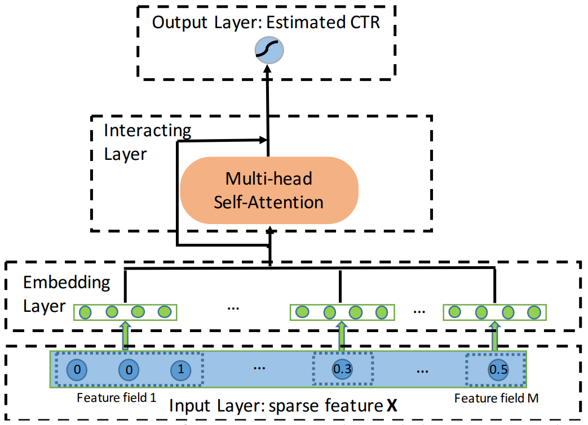

# notes

[CIKM 2020 | 一文详解美团6篇精选论文](https://tech.meituan.com/2020/12/03/cikm-2020-nlp.html)

推荐系统的专门会议：ACM Conference on Recommender Systems ([RecSys](https://dblp.uni-trier.de/db/conf/recsys/index.html))，但是CCF未列入。

[“知识图谱+”系列：知识图谱+图神经网络](https://zhuanlan.zhihu.com/p/358119044)

[TOC]

## 前言

建议做笔记需要提及以下几点：

* 提出了什么网络
* 这个网络的所属类别
* 解决了之前研究者什么难题
* 有什么优点，有什么启发，有什么新颖指出
* 在什么数据集上取得了什么样的效果
* 对于需要精读研究的论文需要做完全的笔记（标题带⭐表示复现与精读）

## 论文 Reading

### —2022-03

#### DKN⭐

原文：WANG H, ZHANG F, XIE X, et al. DKN: Deep knowledge-aware network for news recommendation[C]//Proceedings of the 2018 world wide web conference.2018:1835-1844. 

简介：DKN 算法是由 Wang Hongwei 提出的用于新闻推荐的深度知识网络，借助 KGE(knowledge Graph Embedding) 将图结构信息新闻标题和标题中的实体信息转为空间向量，使用 KCNN 将对应的向量转为 news embedding 和 User embedding 来方便数据的训练；文章还借用了注意力机制来对于候选新闻动态提取用户的点击历史。

关键词：推荐算法，知识图谱，新闻推荐，注意力机制，CTR 预测

解决的问题：

1. 现存的方法都不能够完全发现新闻之间的知识级别(knowledge-level)的联系。（需要使用知识图谱）
2. 对于新闻推荐存在三个问题：时效性，如何从点击历史中提取用户兴趣，不能挖掘知识与知识之间的联系。协同过滤的算法在新闻推荐方面较为低效。

数据集：

1. MIND 微软新闻数据集

我的评价：

1. 梦开始的地方，第一个复现（未复现完）的算法。
1. 缺点就是部分还需要特征工程。
2. 从这篇文章开始，了解到 embedding 的方方面面，以及当前将知识图谱转为 Embedding 的几种方法。
3. 还接触到了注意力机制，以及怎么用，虽然不知道具体的用途。
4. 文章中还存在几处我觉得在 2022 年可以进行改进的地方：
   * 在进行句子表示学习的地方，作者使用的是 CNN 的方法来进行学习。现在 NLP 优秀的算法层出不穷，可以使用 Transformer 或者 Bert 等模型来进行改进
   * 在进行 Attention 的地方说不定可以加几个 Mask 试一试
5. 未来发论文的其他方向：
   * 模型的可解释性，即类似美团外卖中推荐某个东西显示推荐原因。
   * 模型的轻量化，借助最近看的知识蒸馏的方法实现工程上的优化。

论文精读：

​		现存的推荐方法不能完全挖掘新闻之间知识级别的潜在联系，并且推荐结果也只限制于简单的模式而不能够合理扩展。DKN 是基于内容的点击率预测深度学习推荐算法，DKN 的关键组件就是 KCNN，KCNN 能够输出多个通道并且有 word-entity-aligned 卷积神经网络将新闻的语义级别(semantic-level)和知识级别(knowledge-level)的表示方法融合在一起。作者为了能够解决用户有不同兴趣的问题，使用了注意力模块来根据候选新闻来动态从用户点击历史中聚合对应的特征。DKN 算法在微软的新闻数据集 MIND 上取得了 F1 和 AUC 基准上的提高。

​		新闻标题是文本信息，需要将其转为向量空间中方便计算。首先将新闻标题转为 word embedding，然后中提取出新闻中的 Entity ，根据对应 wikiID 在维基百科数据库[^1][^2]中的找到对应的知识图谱，使用知识图谱嵌入 (Knowledge Graph Embedding) 的方法将 entity 词条中的信息转换到向量空间中。常见 KGE 方法有 TransE，TransH, TransR, TransD 方法转为向量，文章中将其称为 entity embedding，作者是在前人的基础上完成转化的。由于只有 word embedding 和 entity embedding 并不能充分体现对应的 entity 在知识图谱中的位置和其周围节点的信息，作者还引入了 context embedding 的概念，即根据 entity 节点周围节点之间的 entity embedding 的加权平均来计算。

#### RippleNet

原文：WANG H, ZHANG F, WANG J, et al. Ripplenet: Propagating user preferences on the knowledge graph for recommender systems[C]//Proceedings of the 27th ACM international conference on information and knowledge management.2018:417-426. 

简介：受到现实生活中水中波纹传播的启发，Wang Hongwei 提出 RippleNet 推荐算法。其使用知识图谱作为边界信息(side information)，结合了基于知识图谱推荐算法两种途径 embedding-based 和 path-based 的优点，将知识图谱中节点之间的相关度计算类似水纹传播一样进行计算，根据上一个 Ripple Set 来计算下一个 Ripple Set 之间的相关度，最终预测用户对应某个 item 的点击率预测。

关键词：推荐系统，知识图谱，CTR 预测，波纹网络

解决的问题：

1. 解决了传统协同过滤算法中存在的数据稀疏性和冷启动问题
2. 当前的 embedding-based 的推荐算法不够直观和高效，path-based 的算法需要依靠手工来刻画特征较为繁琐。RippleNet 结合了两者的优势并且一定程度上解决了两者的问题。
3. RippleNet 在解释性方面有着很好的特点。

数据集：

1. MovieLens-1M
2. Book-Crossing
3. Bing-News

我的评价：

1. 推荐算法领域基于知识图谱的较为经典的论文，值得复现。
2. 相比于 DKN 强化了知识图谱处理的部分。

论文精读（未做）：

#### MKR

原文：WANG H, ZHANG F, ZHAO M, et al. Multi-task feature learning for knowledge graph enhanced recommendation[C]//The world wide web conference.2019:2000-2010. 

简介：MKR 算法是由 Wang Hongwei 提出的基于知识图谱的多任务特征学习的推荐算法，他提出了新的 Cross & Compress 单元将两个任务进行关联，用于建立 item 和 entity 之间的关系，可以从中自动共享潜在的信息特征，并且能够学习 item 之间的高阶联系。作者自己还提出了一种新的 KGE 方法，最终结果也再多个数据集上取得了 SOTA 的结果。

关键词：推荐系统；知识图谱；CTR 预测；Top-K 预测；多任务学习；公式证明

解决的问题：

1. 经典 CF 问题，稀疏性，冷启动
2. PER 严重依赖于手工刻画 meta-paths / meta-graph 的问题
3. DKN 不是一种端对端的训练方式，并且很难将 side information 融入到文本中
4. RippleNet 中存在对于边信息的刻画不足。
5. CKE 方法中 KGE 的方法 (TransR) 在推荐系统的应用中效果不是那么好。

数据集：

* MovieLens-1M
* Book-Crossing
* Last.FM
* Bing-News

我的评价：

1. 作者横向对比了多个基于知识图谱的推荐算法之间的优缺点
2. 作者对于 Cross&Compress 单元有着严格理论证明 (多项式逼近)
3. 文章中使用到了 Negative Sampling (负采样)，还有其他文章提到了 Label Smoothing (标签平滑)，填坑

#### KGNN-LS

原文：WANG H, ZHANG F, ZHANG M, et al. Knowledge-aware graph neural networks with label smoothness regularization for recommender systems[C]//Proceedings of the 25th ACM SIGKDD international conference on knowledge discovery & data mining.2019:968-977. 

简介：KGNN-LS 算法是由 Wang Hongwei 在其 KGNN for RS 的基础上进一步改进，是一种混合推荐方法，结合了 Path-based 和 Embedding-based 两种方法的优点。KGNN-LS 不仅能够捕捉 item 之间的语义信息，还能够提供个性化推荐。

关键词：推荐系统；图神经网络；知识图谱；标签平滑；CTR 预测

解决的问题：

1. 传统 CF 问题
2. 现存方法存在的依赖于手工特征工程，不能够端到端处理以及没有很好的伸缩性的问题
3. 基于 KG 的方法大都采用同构二部图(homogeneous bipartie graph) 或者 uesr/item-similarity graph。
4. 他之前的 KGNN for RS 存在过拟合的问题，这次他使用标签平滑正则化来解决。

数据集：

1. MovieLen-20M
2. Book-Crossing
3. Last.FM
4. Dianping-Food

我的评价：

1. 需要 GNN 的前置知识，理论部分看不懂
2. 有着严格的数学证明在 GNN 中如何让进行 Label Smoothness Regularization，并且证明 LS 相当于在图结构上的 Label Propagation

#### KGAT

原文：WANG X, HE X, CAO Y, et al. Kgat: Knowledge graph attention network for recommendation[C]//Proceedings of the 25th ACM SIGKDD international conference on knowledge discovery & data mining.2019:950-958. 

简介：KGAT 算法是使用注意力机制基于知识图谱的端对端推荐算法，其不仅能够挖掘图谱中的低阶信息，还能够挖掘数据中的高阶隐晦的特征信息。其通过从邻居节点迭代传播 embedding 从而提炼中节点的 embedding，并且能够区分邻居节点的重要程度。

关键词：

解决的问题：

1. FM 的方法不能完全从用户一系列行为中充分挖掘出用户之间协同信号。
2. 先前的基于知识图谱的的方法存在无法充分捕捉数据之间高阶联系的问题。

数据集：

1. Amazon-book
2. Last-FM
3. Yelp2018

我的评价：

#### TGIN

原文：Jiang W, Jiao Y, Wang Q, et al. Triangle Graph Interest Network for Click-through Rate Prediction[C]//Proceedings of the Fifteenth ACM International Conference on Web Search and Data Mining. 2022: 401-409.

简介：TGIN 是由阿里巴巴团队提出的用于推荐系统关于三角图兴趣网络的点击率预测的算法。在 item-item 图中抽取出很多“三角内同构，三角外异构”的三角形，一个三角形内的 item 至少拥有一个共同的属性，然后通过 item 周围的 K-Order 三角形来提取出特征，来得到最终用户点击率预测结果。

关键词：推荐算法，CTR 预测，商品推荐，图神经网络，三角图

解决的问题：

1. 像 YoutubeNet，DeepFM，DIN 等算法只是基于用户的历史数据来总结用户的兴趣特征，但是存在数据稀疏性的问题，并且不能跳脱出用户特定的兴趣特征，不能很好的探索新的感兴趣的领域（信息茧房）
2. 像 RippleNet，KGAT，ATBRG，MTBRN 等算法，虽然结合了图结构，但是其都缺乏一种有效的机制来捕捉用户一些难以捉摸(elusive)的兴趣，更倾向于向用户推荐时髦的、较为相似的的产品。
3. 以上问题即用户难以捉摸的动机(elusive motivation)和推荐多样性限制(diversity)的问题。

数据集：

1. 亚马逊的书籍和电子产品商品的数据集，取得了 state-of-the-art 的成果
2. 阿里巴巴在线广告系统数据集，他家的数据集他说了算。

我的评价：

1. 只看图就知道算法模型对于我来说有点过于复杂了，比如前期的进行 item 之间三角形选取的时候，使用到**行列式点过程**(Determinantal Point Process) 来生成 item 对应的 K-Order 图结构。
2. 对于之前模型存在的无法解决推荐多样性的问题，可以直接在图结构上使用三角图的思想来优化推荐系统的模型。

### 2022-04

#### Wide & Deep

参考：[推荐系统之ctr预估-Wide＆Deep模型解析](https://zhuanlan.zhihu.com/p/74957209)

原文：CHENG H-T, KOC L, HARMSEN J, et al. Wide & deep learning for recommender systems[C]//Proceedings of the 1st workshop on deep learning for recommender systems.2016:7-10. 

简介：Wide & Deep 是应用在 Google Play 应用商店的推荐算法模型，是经过百万人的考验的算法。模型采用了 Wide 的线性模型和 Deep 的深度神经网络模型，同时增强了模型的拟合能力和泛化能力。文中通过 Memorization 和 Generalization 描述了模型的拟合和泛化能力，前者推荐结果较为保守，推荐用户之前有过联系的 item，后者推荐结果趋于多样性。对于 wide 和 deep 两个子模型，文中采用 joint training 的方式将两个模型结合起来。

关键词：推荐算法；CTR 预测；

解决的问题：

1. wide 的模型需要做更多特征工程的处理。
2. deep 的模型在学习稀疏矩阵得到的 embedding 不够高效

数据集：

1. Google Play 自己的数据

我的评价：

1. 文中结合了 wide 和 deep 两种模型的有点，使用 joint training 的方法将两种模型结合起来，吸取了两个模型的优点，同时兼顾了拟合能力和泛化能力。
2. 此模型既不同于 CF-Based 的也不同于 CB-Based 方法，较为独特，缺点就是 wide 部分需要进行特征工程。

#### DeepFM⭐

原文：GUO H, TANG R, YE Y, et al. DeepFM: a factorization-machine based neural network for CTR prediction[C]//Proceedings of the 26th International Joint Conference on Artificial Intelligence.2017:1725-1731. 

简介：DeepFM 是应用在华为应用商店的推荐算法模型。DeepFM 是在 Wide & Deep 上改进而来的算法，是一个端对端的模型，该模型相比于之前的算法模型，能够同时对高阶信息和低阶信息建模，并且无需预训练和进行特征工程。

关键词：推荐算法；CTR 预测；FM 分解机；

解决的问题：

1. 解决之前模型无法同时建模高阶信息和低阶信息的问题。线性模型无法泛化到高阶特征联系中，FM 只能建模高阶信息。
2. Wide & Deep 模型需要手工特征工程的问题，DeepFM无需进行特征工程，并且在 wide 和 deep 部分能够将输入进行共享，无需区分连续型数据和离散型数据。

数据集：

1. Criteo 数据集
2. 华为应用商店数据集

我的评价：

1. DeepFM 在 Wide & Deep 模型的基础上进行了改进，无需进行手工特征工程。
2. DeepFM 可以算是较为经典 FM 的算法，模型看上去也没那么复杂
3. 文中提到神经网络模型 CNN，RNN 都是应用在网格或者序列型的数据上，对于推荐系统上都不尽如人意，可以尝试结合 GNN。

论文精读（待填坑）：

​	

参考读物：

1. [Factorization Machines (d2l.ai)](http://d2l.ai/chapter_recommender-systems/fm.html)
2. [初探Factorization Machine(I). 揭開推薦系統中的明星演算法的神秘面紗](https://yulongtsai.medium.com/factorization-machine-63160bc2c06b)

#### xDeepFM

原文：LIAN J, ZHOU X, ZHANG F, et al. xdeepfm: Combining explicit and implicit feature interactions for recommender systems[C]//Proceedings of the 24th ACM SIGKDD international conference on knowledge discovery & data mining.2018:1754-1763. 

简介：xDeepFM 是基于 DeepFM 推荐算法的基础上改进而来，其不仅能够显式构建特征，还能够隐式学习任意高阶和低阶的特征信息。该模型能够在有界的特征联系上高效学习，并且学习的级别是基于 embedding 向量，经过 CIN 网络、线性网络模型和朴素多层感知机得到最终的预测结果。

关键词：推荐系统；CTR 预测；FM 分解机；

解决的问题：

1. 传统的 cross feature 方法获取优质的特征信息耗费时间和精力较多。
2. 在大型 web 网络上的数据是较为稀疏，很难手工提取出所有的特征；并且手工提取的特征泛化能力较弱。
3. FNN 和 PNN 等模型大都关注建模高阶信息而忽略了低阶信息。
4. 相比于 Wide & Deep 和 DeepFM 的 bit-wise 模型，xDeepFM 模型使用 vector-wise 的方法，属性内的 embedding 向量不会互相影响。

数据集：

1. Criteo 数据集
2. DianPing 数据集
3. Bing News 数据集

我的评价：

1. xDeepFM 基于 Deep & Cross (DCN)模型上进行了改进提出了 CIN 网络模型
2. 也是基于 Deep & Wide 和 DeepFM 模型进行改进，使用 vector-wise 取代 bit-wise 性能更优。

#### Factorization Machines⭐

原文：RENDLE S. Factorization machines[C]//2010 IEEE International conference on data mining.IEEE,2010:995-1000. 

简介：Factorization Machines 是使用分解参数的预测方法，可以在十分稀疏的数据上完成预测的模型。FM 模型能以线性时间复杂度的情况下计算得出结果。FM 模型也是经典的算法，后续的很多算法模型比如 Wide & Deep ，DeepFM，xDeepFM都是基于 FM 模型而来。

关键词：推荐算法；FM 模型；CTR 预测；

解决的问题：

1. SVM 在十分稀疏的数据的情况下会导致预测失败，FM 可以解决稀疏的问题。
2. 作者将 FM 模型的计算时间复杂度从 $O(kn^2)$ 降到 $O(kn)$，极大提高了计算效率。

数据集：

1. 无

我的评价：

1. 十分经典的奠基型论文

#### DCN⭐

原文：WANG R, FU B, FU G, et al. Deep & cross network for ad click predictions[C]//Proceedings of the ADKDD'17.2017:1-7. 

简介：DCN 推荐算法模型全称 Deep & Cross Network，作者提出了新的 CrossNet 来捕捉各个特征之间的交叉特征(Cross Features)，能够在指定范围的n阶特征上进行高效的计算。并且结合了 DNN 来捕捉更加隐性的高阶特征。该推荐算法模型无需先前工作中大量耗时费力的特征工程，并且计算时间复杂度也只是随输入数据的长度线性增加，计算更加高效。

关键词：推荐算法；CTR 预测；Deep & Cross；多项式近似

解决的问题：

1. 无需做大量耗时费力的特征工程，计算更高效。
2. 使用 CrossNet 和 DNN 来捕捉低阶和高阶的特征信息，以及捕捉不易发现的隐性特征。
3. FM 或者 FFM 模型在扩展到高阶特征的时候，参数数量会随着输入量的增加而成倍的增加，计算复杂度高。

数据集：

1. criteo 数据集

我的评价：

1. 相比于之前的 wide & deep 模型，deep 部分几乎没有什么差别，主要区别是 wide 部分和 cross 部分。 wide & deep 是直接将输入数据进行点积就进行计算输出了，cross 部分是将各个特征之间进行点积并且和一个标量权重进行相乘和 Deep 部分的网络参数一起进行训练优化。
2. 与 DCN 较为相似的是 DeepFM 模型，deep 部分同样类似。两者之间的主要区别就是对于特定阶特征的计算部分，对于 DeepFM 比如对于二阶特征 i 和 j 的权重 $w_{ij}$ 分解为两个权重向量之间的点积 $<v_i,v_j>$，而 DCN 部分两交叉项(cross term)之间相乘的权重是对应一个矩阵中的标量，并且可以参数共享，相比与FM部分计算更高效。
2. 作者使用 Weierstrass approximation 多项式近似进行了理论分析。

#### DCN v2⭐

原文：Wang R, Shivanna R, Cheng D, et al. DCN V2: Improved deep & cross network and practical lessons for web-scale learning to rank systems[C]//Proceedings of the Web Conference 2021. 2021: 1785-1797.

简介：DCN v2 是在 DCN 的基础上进行改进而来的推荐算法模型，在原有模型的基础上提高了计算效率，并且相比于之前的模型，DCN v2 成功应用在谷歌的实时 rank 排名系统上。并且 DCN v2 引入了矩阵低秩分解的方法来高效计算算法，能够在保证准确度的基础上提高模型的计算速度。文章作者也使用实验数据证明传统的基于 ReLU 的神经网络在学习高阶特征交叉的时候效率更低。

关键词：推荐算法；Rank 算法；DCN；实时系统；

解决的问题：

1. 初代 DCN 算法在大规模网页流量的基础上无法进行实时运算，计算效率较低。
2. 初代 DCN 在计算输入数据的特征特定的维度处理，不支持任意长度的输入。
3. 该模型不仅在离线模型上取得了 SOTA 的成果，也在在线模型上成功进行实验，能够满足在线推荐的实时性要求。

数据集：

1. criteo 数据集
2. movielens 数据集

我的评价：

1. 很多文章中都使用到了多项式逼近(polynomial approximation)的思想，可以学习一下
2. DCN 和 DCN v2 都是同一个作者，DCN v2 在原先的基础上改进了 CrossNet 的部分并且加入了矩阵低秩分解的点，将 DCN 网络推向了新的高峰。

#### FFM

原文：Juan Y, Zhuang Y, Chin W S, et al. Field-aware factorization machines for CTR prediction[C]//Proceedings of the 10th ACM conference on recommender systems. 2016: 43-50.

简介：在 FM 因子分解机的基础上添加了域(field)的概念，

关键词：推荐算法；CTR 预测；FM 因子分解机；

解决的问题：

1. FM 中特征交叉的方式没有考虑到不同特征之间的共性（同域）和差异性（异域）的问题。
1. FM 中的特征交叉不够细粒度。

数据集：

1. criteo 数据集
2. avazu 数据集

我的评价：

1. FFM 相比于 FM 模型精确度更高，特征刻画更加精细
2. 但是 FFM 模型时间复杂度更高，并且参数较多，必须设置正则化和早停训练策略。
3. Bi-FFM 相比之下参数更少。

参考：

1. [深入FFM原理与实践](https://tech.meituan.com/2016/03/03/deep-understanding-of-ffm-principles-and-practices.html)
2. [FM及FFM算法](https://codeantenna.com/a/ZFbApvJVQH)
3. [推荐系统系列（二）：FFM 算法理论与实践](https://www.6aiq.com/article/1590363925275)

#### Autoint

原文：Song W, Shi C, Xiao Z, et al. Autoint: Automatic feature interaction learning via self-attentive neural networks[C]//Proceedings of the 28th ACM International Conference on Information and Knowledge Management. 2019: 1161-1170.

简介：AutoInt 算法是基于注意力机制的端到端推荐算法模型，可以用于自动显式建模特征之间的高阶和低阶的关联，并且该算法模型相比于之前的模型有着较好的可解释性。作者将注意力机制引入推荐算法领域，根据多头自注意力机制提出了新的 Interacting Layer，既能够将高维稀疏的输入数据映射到低维子空间中，也能够将各个不同的特征融合起来构成高阶特征信息共同训练，并且无需大量手工费时的特征工程。低阶特征通过残差连接来建模，高阶特征通过叠加注意力层数来建模。

关键词：推荐系统；CTR 预测；注意力机制；可解释模型

解决的问题：

1. 对于推荐系统的原始数据存在数据过于稀疏并且维度高的问题，大多数据是离散型或者分类型(categorical)的数据，不易处理和建模，容易导致过拟合。
2. 对于高阶信息，大多 DNN 的算法模型(Wide & Deep, DeepFM)都是隐式建模高阶，可解释性较差
3. 显式建模高阶特征信息的模型(DCN, xDeepFM)不能够很好解释哪些交叉特征是有用的。
4. 作者使用多头注意力机制既能显式建模低阶和高阶信息，并且能够将高维稀疏的向量映射到低维子空间中。

数据集：

1. Criteo 数据集
2. avazu 数据集
3. KDD 12 数据集
4. MovieLens-1M 数据集

我的评价：

1. 所见的基于协同过滤算法中使用注意力机制来替代全连接层深度神经网络来进行建模和训练。
2. 这个模型也是基于协同过滤中具有可解释性特点的模型
2. 随着注意力层的叠加，高阶特征的阶数会指数增长。
3. 建议复现

#### CowClip

原文：Zheng Z, Xu P, Zou X, et al. CowClip: Reducing CTR Prediction Model Training Time from 12 hours to 10 minutes on 1 GPU[J]. arXiv preprint arXiv:2204.06240, 2022.

简介：Cowclip 算法是由字节跳动团队提出的加速训练 CTR 数据集的算法，最高可以从 822 分钟的训练时间缩短到 30 分钟，提高了大概 76.8 倍的训练速度。其主要思想就是在增大训练 batch 的同时对超参数训练速率和正则化参数进行同时缩放，从而达到增大 batch 而不损失精度的效果。该团队在常见的缩放方法比如平方根缩放(sqrt scaling)和线性缩放(Linear Scaling)的基础上，又提出了两个适用于 CTR 数据集上的超参数缩放方法——CowClip 缩放和 $n^2-\lambda$ 缩放，两个算法可以针对在 batch 中出现次数较少的 id 进行修正，最终实验结果表明方法是十分有效的，在大型 CTR 数据集上也取得了优秀的成绩。

关键词：推荐系统；CTR 预测；训练加速

解决的问题：

1. 之前的算法都存在训练速度较慢的原因，在工业界应用方面，较长的训练时间就可能会导致推荐不准确
2. 一般情况下增大训练 batch 可能会导致过拟合的现象，从而导致模型精度下降。
3. CowClip 可以在不损失训练精度的情况下加快训练速度。

数据集：

1. Criteo 数据集
2. Avazu 数据集

我的评价：

1. 对于一些实验室硬件条件较差的同学帮助会很大，并且能够进行加速计算，节约时间成本。

### 2022-05

#### Adaptive Mixtures of Local Experts 

原文：JACOBS R A, JORDAN M I, NOWLAN S J, et al. 1991. Adaptive mixtures of local experts. Neural computation [J], 3: 79-87.

简介：在多目标任务学习的时候，传统的训练方式使模型在相应的场景进行权重更新的时候，也会影响模型对其他场景的权重，叫做干扰效应(interference effect)。作者设计了基于概率的门限模型，最终模型的选取会根据 gating 的输出来选取最适合场景的 experts 组合，使得模型可以和传统模型一样在复杂的不同任务下具有更强的泛化性。对于如何对 experts 和 gating 架构的训练，作者提出了两种思路：

1. 赋予关联学习竞争性，是网络中每个 expert 都可以独立更新权重：
   $$
   E^c=\log\sum_ip_i^ce^{-\frac12||d^c-o_c||^2}
   $$

2. 赋予竞争学习关联性，这种架构的本质就是将学习中网络的神经元替换成独立的 Experts 网络，使得每个 experts 之间的权重变化不会互相影响。
   $$
   F_{moe}=\sum_{i=1}^Ng_i(x)\text{softmax}(f_i(x))
   $$
   其中 $f_i$ 表示每个 expert 的输出，$g_i()$ 使 gating 网络对于输出的选择。

关键词：多专家模型；多任务学习

解决的问题：

1. 传统的训练时候存在的干扰效应(interference effect)。

数据集：无

摘抄的评价：

1. 本文提出的Gating Network具有很强的可扩展性。在Gating的统合作用下，各个experts之间互相独立，那么也可以认为这些Expert Networks可以被随意更改，那么Gating Network这个技术在跨模态系统融合这个方向上就能具有很强的应用性。

   例如，对于一个雷达-视觉融合检测系统来说，实现这样一个复杂系统的过程就可以被简化成：

   * 分别训练一个基于雷达数据的检测网络和一个基于视觉数据的检测网络；
   * 训练一个Gating Network来统合两者的输出。

   因为“软”竞争学习带来的概率整合思路，训练出的完整系统就有可能会具有雷达检测和视觉检测两方的优势。视觉系统弥补雷达系统的不确定性，同时雷达系统增加对天气和遮挡物的鲁棒性。

2. 从另一方面来看，在计算能力允许的条件下，应用了Gating Network的模型也会在理论上具有无限的泛化性，所有可能在实际场景中出现的情况都可以作为子场景以单独训练一个用于该场景的expert。当然，experts的数量可能也会降低模型在实际应用时的性能，毕竟每一个expert都需要输出一个对于输入场景的判断结果，所以也不能认为可以无限的设置experts来提高泛化性和鲁棒性。

参考：

1. [Adaptive Mixtures of Local Experts](https://zhuanlan.zhihu.com/p/423447025)
2. [Google多任务学习模型：Multi-gate Mixture-of-Experts (MMoE, 2018)](https://zhuanlan.zhihu.com/p/434975656)
3. [多目标学习在推荐系统中的应用](https://mp.weixin.qq.com/s?__biz=MzU2ODA0NTUyOQ==&mid=2247491211&idx=2&sn=a11007131f97835d655a4d451920843e&chksm=fc92a43dcbe52d2be58ef7e120d4bbff9ecdd8ffd5f9ebb473a97105c1fa71faadee1b403cf4&scene=126&sessionid=1605064054&key=059149d48d5c3e99fee7200bda4a5e4a7d0f1ab172f270b4a31ee39d0129a2210098dda57b4c275f69eb6ec5d674f4871ffcaef7636fa83bab1fb263f6c9673f88de8b4437ab0ab108b5e757060dc795c0031452e18002915f2f0c738c1f483eece0212fe66ba4aec07cd7b7fba4df7e812592e373fdc1c34e1bbf86d0acc1e1&ascene=1&uin=Mjg1NTU5MTQxMA%3D%3D&devicetype=Windows+10+x64&version=6300002f&lang=zh_CN&exportkey=A77db8rvlMC6aDR5FrUFMBM%3D&pass_ticket=8hNub%2BFu4yLIlzlFzkmkkQMUkX4moojyuksiXcSdcWti8q5%2BiG2QZTCpgM1wGGdz&wx_header=0)

#### InterHAt

原文：Li Z, Cheng W, Chen Y, et al. Interpretable click-through rate prediction through hierarchical attention[C]//Proceedings of the 13th International Conference on Web Search and Data Mining. 2020: 313-321.

简介：InterHAt 是由注意力机制构成的推荐算法模型，借助于当前在 NLP 领域火热的 Transformer 应用在推荐系统上 CTR 预测数据集上并且取得了不错的效果。并且 InterHAt 也有着较低的计算复杂度，使用层级注意力机制(Hierarchical Attention)聚合每一阶数据的特征信息，一层一层堆叠至产生计算高阶的特征信息，能够在不同的语义子空间中捕捉特征关联中的多语义特征信息。并且该模型也有较好的可解释性特点，通过在每一阶特征聚合层计算对于数据不同域的权重大小得到注意力点，提取出关键的域信息。

关键词：推荐系统；注意力机制；可解释性

数据集：

1. criteo 数据集
2. avazu 数据集
3. Frappe 数据集

解决的问题：

1. 之前的模型解释性较差
2. dnn 部分对于计算高阶特征关联的效率较低
3. 对于特征的多语义信息捕捉能力不足

我的评价：

1. 和 autoint 中类似的部分就是对于特征的低阶信息处理，同样只使用注意力机制处理的方式，目前需要对比到底是 crossnet 提取 bound-degree 特征信息的能力强还是注意力机制能力强。
2. 这个模型的可解释性要比 autoInt 中可解释性貌似要强一点

#### MMoE

原文：MA J, ZHAO Z, YI X, et al. Modeling task relationships in multi-task learning with multi-gate mixture-of-experts[C]//Proceedings of the 24th ACM SIGKDD International Conference on Knowledge Discovery & Data Mining.2018:1930-1939. 

简介：MMoE 模型是由谷歌团队提出的基于多任务学习的推荐算法模型，是针对多任务模型通过学习不同的任务之间的联系和差异来提高训练的质量。相对于先前工作中常用的 shared-bottom 模型，MMoE 能够在不加增加模型参数数量的基础上来捕捉不同任务之间的关联和区别，使用专家系统网络是的不同任务之间参数共享，不同任务的 gating 网络可以学习到不同的专家组合，捕捉到任务之间的异同。

关键词：推荐系统；多专家模型；多任务学习

数据集：

1. 人工生成数据集
2. 谷歌内部推荐数据集

解决的问题：

1. 之前多任务学习的模型性能往往不如单任务学习的模型，基于DNN的多任务学习模型通常对数据分布和任务之间的关联比较敏感。
2. 当所有任务之间参数共享过多时候对于单个任务的预测反而有坏处。

我的评价：

1. 多任务学习在很多场景都要用处，比如在进行 embedding 处理的时候，不一定并行架构的输入 embedding 都是一致的，也可以使用 MMOE 来对两个架构进行不同的训练。
2. 借助 EDCN 的想法，可以改进 regulation module。

参考：

1. [详解谷歌之多任务学习模型MMoE(KDD 2018)](https://zhuanlan.zhihu.com/p/55752344)

#### MAIL

原文：FENG P J, PAN P, ZHOU T, et al. Zero shot on the cold-start problem: Model-agnostic interest learning for recommender systems[C]//Proceedings of the 30th ACM International Conference on Information & Knowledge Management.2021:474-483. 

简介：MAIL 双塔框架是由网易云团队提出的针对冷启动问题的推荐算法，MAIL 算法模型与具体的推荐算法模型是无关的，推荐算法模型可以是现存提出的任何推荐算法，MAIL 是在其推荐算法基础上完善和解决冷启动问题的增强。其受到零样本学习(Zero-shot Learning)的启发，设计了双塔结构，一个塔是在零样本的视角下解决冷启动的问题，首先使用双自动编码器进行跨模态重建，从隐藏特征中给新用户获取虚拟行为爱好，然后在另一个塔即排序塔中根据零样本塔来计算用户行为偏好。通过跨模态重建和基于最大平均差异的模态对齐，零样本塔根据老用户的属性将行为偏好迁移到新用户上。基于零样本塔产出的虚拟行为偏好，排序塔可以更好地捕捉新用户的兴趣并进行推荐。

关键词：推荐系统；Rank 算法；冷启动；

数据集：

1. [阿里妈妈数据集](https://tianchi.aliyun.com/dataset/dataDetail?dataId=56)
2. 网易云音乐直播业务数据

解决的问题：

1. 解决冷启动的问题，在网易云音乐业务线上取得了较大的提升

我的评价： 

1. 可以将这个模型与新推荐算法模型(未解决冷启动)结合起来，变成新的模型

参考：

1. [CIKM 2021 | 云音乐提出与模型无关的冷启动推荐框架](https://mp.weixin.qq.com/s/mDNf_n4PQY8slROibmPuQA)

#### DMoE

原文：Eigen D, Ranzato M A, Sutskever I. Learning factored representations in a deep mixture of experts[J]. arXiv preprint arXiv:1312.4314, 2013.

简介：深层多专家模型(DMoE)是由谷歌团队提出的一种学习算法，这种模型能够在不提高计算复杂度的情况下增加 expert 的数量，为输入数据选择最佳训练方法，既保证了模型的泛化性也保证了高效性。作者也了解到在专家系统模型中 gating 任务需要高效使用专家组合策略，每一层专家系统的关注点都是不同的，在第一层 DMoE 主要关注以位置为主的特征，第二层主要关注以类别为主的特征信息。最终实验结果也表明，DMoE 能够在扩大网络模型的基础上，对于输入数据只使用到模型中最适合的一部分而不会导致计算复杂度增加，并且保证了计算高效性。

关键词：多专家模型；

数据集：

1. MNIST
2. Monophone Speech

解决的问题：

1. 在不提高计算复杂度的情况下增加专家的组合数量，在扩大网络模型的同时也保证了计算复杂度高效。

我的评价：

1. 可以把 DCNv2 中的 MoE 转为 DMoE

### 2022-06

#### GateNet

原文：Huang T, She Q, Wang Z, et al. GateNet: gating-enhanced deep network for click-through rate prediction[J]. arXiv preprint arXiv:2007.03519, 2020.

简介：GateNet 是借助 Gate 机制来对 Embedding 层和 MLP 层来进行改造的推荐算法模型。Embedding Gate 是用来从特征级别的层面来选取重要的潜在特征信息，Hidden Gate 是用来对 MLP 层进行改造来自适应控制选取特征来传给下游的层。改进后的很多知名模型比如 DeepFM, xDeepFM 都有一定程度上的提升，但是提升不大。

关键词：推荐系统；CTR 预测；Gate 机制

数据集：

1. ICME
2. Criteo
3. SafeDriver

解决的问题：

1. 相比于之前的模型有较小的提升

我的评价：

1. 提升不大，可以尝试，疑似灌水文章。

#### EDCN

原文：CHEN B, WANG Y, LIU Z, et al. Enhancing Explicit and Implicit Feature Interactions via Information Sharing for Parallel Deep CTR Models[C]//Proceedings of the 30th ACM International Conference on Information & Knowledge Management.2021:3757-3766. 

简介：EDCN 网络是华为技术团队提出的与模型无关的基于并行架构的推荐算法，该算法主要分为两个主要的模块：Bridge Module 和 Regulation Module，分别用于解决大多并行架构存在的 Embedding 过度共享问题以及中间层(比如crossnet和mlp)之间显式特征与隐式特征之间参数共享不足的问题，bridge module 负责将中间层每一层的输出进行融合参数共享，regulation module负责将重新融合后的信息选择分别训练不同的特征数据后再分发给并行架构。作者将这两个模块应用到众多并行架构网络上发现在 DCN 网络上改进效果较优，因此称为 EDCN。

关键词：推荐系统；CTR 预测；

数据集：

1. avazu
2. criteo
3. Huawei Industrial dataset

解决的问题：

1. 中间层显式特征和隐式特征参数共享不足的问题，从而导致梯度过陡的现象。
2. 在 embedding 层参数过度共享的问题。

我的评价：

1. 作者对于其他模型在 criteo 和 avazu 两个数据集上得到的实验结果和对应原论文中的实验结果有很大的出入，比如 DCNv2 中 criteo 的 AUC 为 0.8115，而它为 0.8001。

2. 作者在 DCN 上改进的效果要比在 DCNv2 上改进的效果要好，可能是调参没调好？

3. 总体上来说写作手法还是值得学习的论文。

4. 和 GateNet 的比较

   * Embedding Gate 和 Regulation Module

     相同：两者都是给特征之间赋予不同的权重，算法上比较类似

     不同：前者只有一个gate，输入到并行架构中的值是相同的；后者使用 softmax，并且类似多头注意力机制或者类似使用的多个 gate，输入到并行架构中的值是不同的。

   * Hidden Gate 和 Bridge Module

     Hidden Gate 只是捕捉 mlp 中每一层 bit-wise 的权重，其实我感觉这里并没有什么用处。

     相比之下 Bridge Module 能够融合 mlp 和 crossnet 输出的显式特征和隐式特征进行参数共享，让模型在 back propagation 的时候让梯度变缓；然后通过 regulation module 重新分配给 mlp 和 crossnet。

   相形见绌，GateNet是灌水文章的嫌疑更大了。

### 2207

#### MaskNet

原文：Wang Z, She Q, Zhang J. MaskNet: introducing feature-wise multiplication to CTR ranking models by instance-guided mask[J]. arXiv preprint arXiv:2102.07619, 2021.

#### FiBiNet

原文：Huang T, Zhang Z, Zhang J. FiBiNET: combining feature importance and bilinear feature interaction for click-through rate prediction[C]//Proceedings of the 13th ACM Conference on Recommender Systems. 2019: 169-177.

### 2208

#### DIN

原文：Zhou G, Zhu X, Song C, et al. Deep interest network for click-through rate prediction[C]//Proceedings of the 24th ACM SIGKDD international conference on knowledge discovery & data mining. 2018: 1059-1068.

简介：DIN 网络是由阿里巴巴团队提出的类注意力机制算法，其注意力机制体现在 Embedding 中多值特征下的池化，根据训练目标广告与用户行为历史数据的权重，有效提取中与目标广告相关度较高的特征。作者还提出两种训练技巧，一是使用新型的激活函数 PReLU 和 Dice 来进行模型训练，由于先前大部分工作使用的硬折点(Hard Rectified Point)都是 0，使用 Dice 可以动态调整折点；而是使用 Mini-Batch Aware Regularization (MBA) 正则化来防止过拟合，由于使用的特征具有显著的“**长尾效应**”，即很多feature id只出现了几次，只有小部分feature id出现多次，这在训练过程中增加了很多噪声，并且**加重了过拟合**，而 MBA 算法可以针对长尾效应做出有效的解决方案，并且可以很大程度上减少 L2 正则化的计算复杂度。

关键词：推荐系统；CTR 预测；点击率预测；

数据集：

1. Amazon(Electro)
2. Movie-Lens
3. Alibaba dataset

解决的问题：

1. 解决原先工作中存在的多值特征定长的问题，可以对特征进行灵活处理
2. 使用 PReLU 和 Dice 新型激活函数动态调整折点，更适应不同数据的分布。
3. 使用 MBA 算法解决数据集中特征存在的长尾效应，解决过拟合问题。

我的评价：

1. 这篇文章提出了很多开创性的工作，比如 Dice 激活函数，MBA 正则化算法以及 GAUC 的评估方式都在很多实际生产应用中实践，非常值得学习和复现。
2. 这篇文章的模型算不上复杂，但是其对比的流行数据集较少，比如 Avazu，Criteo等数据集。

#### M5

原文：[多模态多兴趣多场景技术在Disney流媒体推荐召回中的应用](https://mp.weixin.qq.com/s/5d7hXEY1tPmCjqCT2CiZiA)

简介：多模态多兴趣多场景（Multi-Modal Multi-Interest Multi-Scenario Matching，M5）技术的召回模型

关键词：推荐系统；召回模型；

数据集：

我的评价：

1. 现代推荐系统通常遵循“召回-粗排-精排-重排”的多阶段级联范式。找回是作为推荐系统的最底层，找回阶段通常会从候选集合中检索相对少量的相关内容提供给后续阶段进行更细粒度的排序。因此找回阶段决定了总体候选集合的质量，是推荐系统的瓶颈。
2. 早期采用协同过滤的方式进行召回，现大多使用**[双塔模型](https://zhuanlan.zhihu.com/p/358781457)**进行召回。双塔模型分别生成 user 和 item 的 embedding 向量，并且通过内积等方式计算用户对视频的偏好。线上推理阶段工业界采用最近邻检索等方法根据 user embedding 从视频库中检索最相似的视频。双塔模型可以有效利用用户和视频中丰富的特征，捕捉复杂的特征交互提升个性化，允许高效的检索。
3. 文中还提到使用多模态 Embedding：即使用普通的 id embedding 和 cg(content graph) embedding ，后者是采用与图神经网络结合的 embedding 方法，使用 word2vec 以及 GraphSAGE 训练得到 cg embedding。
4. 对于 transformer 导致模型过大的处理，文章在输出上添加 Masked-Language-Modeling(MLM) 模块，随机 mask 掉一部分用户的行为，在 self-attention 模块的输出端对这些 mask 进行重建，性能会得到显著提升并且 scaling 策略也能为模型带来持续的优化。
5. 在多场景融合方面使用 SMoE 以及场景 id 辨别场景之间的不同。

### 2209

#### 特征采集系统 SSL

原文：[Server Side Logging:Hulu推荐系统中的特征漂移问题解决方法](https://mp.weixin.qq.com/s/IMGuvK49sBQosTNpRyQQwg)

前提概要：

1. Data Drift: Data Drift is one of the top reasons model accuracy degrades over time, data drift is the change in model input data that leads to model performance degradation.
2. Causes of data drift:
   * Upstream process changes, the measurement change of sensors
   * data quality issues, such as a broken sensor always reading 0
   * natural drift in the data, such as mean temperature changing with seasons.
   * Change in relation between features or covariate shift.
3. 

简介：作者提出一套适用于 hulu 推荐系统的特征采集系统（Server Side Logging），用于帮助算法工程师构造更好的训练数据集，解决特征漂移带来的模型性能退化的问题，提高模型实际落地的效果。

关键词：推荐系统；特征漂移

数据集：

我的评价：

1. 解决特征漂移的现象一般是在工业界使用场景下，一边是离线推荐，一边是实时推荐。由于两者获取的数据源，负责的开发者不同从而导致数据获取到的信息衡量维度也不一致，从而导致了数据漂移现象的出现。

参考：

1. [What is data drift?](https://docs.microsoft.com/en-us/azure/machine-learning/v1/how-to-monitor-datasets?tabs=python#what-is-data-drift)

#### 推荐算法中的特征工程总结

原文：[推荐算法中的特征工程总结](https://mp.weixin.qq.com/s/mtHZ1HTrOousEO4rYq3FpA)

简介：在 CV，NLP 领域特征工程不那么重要了，在搜推广领域，特征工程仍然对业务效果具有很大的影响。

关键词：推荐系统；特征工程

学习：

1. why？

   误区：

   * 深度学习时代不需要特征工程。在搜广推等领域，特征工程依然是非常重要的，因为这些领域的特征数据主要以关系型结构组织和存储。在关系型数据上的特征生产和变换操作主要由以下两大类型：

     - **基于行的特征变换（row-based）**：新的特征是由同一样本的其他特征变换得到的，比如数值型特征的缩放变换。
     - **基于列的特征变换（column-based）**：对所有样本数据做统计、聚合才能得到，如最大值、最小值、平均值等。

     深度学习可以学习到 row-based 的特征变换，但是很难学习到 column-based 的特征变换。深度学习一次只能接受小批次的样本，无法建模到全局的统计聚合信息，而这些信息通常十分重要。

   * 有了AutoFE工具就不需要手工做特征工程。AutoFE 的研究尚处于初级阶段，**非常依赖**于数据科学家的业务知识、直觉和经验。

   * 特征工程没有技术含量，特征工程的经验沉淀就好比是一个滚雪球的过程，雪球会越滚越大，最终我们会成为一个业务的领域专家，对业务贡献无可代替的价值。（是不是真的，有待思考）

2. 什么是好的特征工程：

   

   首先特征工程的伸缩性要强，支持高基数特征，支持大数据场景下的推荐任务；

   其次特征的设计还要让模型在线预测的时候支持高并发度，预测效率高；

   并且特征的设计要具有灵活性，一个好的特征工程应该适用于多个模型任务；

   特征工程要对数据分布变化有一定的鲁棒性，因为在真实的场景中，数据分布变化在某种程度上来说是难以避免的，比如电商场景下经常会有些大促活动，这些活动的举办就会对数据分布产生影响，能够适应这种变化的特征才称之为一个好特征。

3. 常见特征变换

   * 特征缩放（数值型）

     

     如果不做特征缩放，较大值的特征会支配梯度更新的方向，导致梯度更新在误差超平面上不断震荡，模型学习效率变低，取值范围较大特征会支配距离函数的计算，导致其他特征失去作用。

     对于不同场景下的特征缩放也是挺有讲究的。（详见原文思考题）

   * 对异常值的处理（数值型）

     数据中存在异常值（上图中红色区域）时，用Z-score、Min-max这类特征缩放算法都可能会把转化后的特征值压缩到一个非常窄的区间内，从而使这些特征失去区分度。

     可以使用新的特征变换方法：Robust scaling，$x_{scale}=\frac{x-median(x)}{IQR}$，其中 median 表示中位数，IQR 为四分差（样本中 75% 分位点的值减去 25% 分位点的值），处理后的数据对于较小的值仍然有区分度，对于较大的值应该识别出来然后对齐进行删除或者替换操作。

   * 分箱处理（数值型）

     

     分箱就是将连续特征离散化，以某种形式将特征值映射到几个箱中。比如时间。

     可以引入非线性变换，增强模型性能。原始值和目标值之间可能不存在线性关系，因此转为类别型特征。并且解释性更强。

   * 交叉组合（类别型）

     

     如上图，当特征f1和f2单独存在时都不具备很好的区分性，组合为一个整体就能够做出很好的预测。

     使用 x3 = x1x2

   * 分箱处理（类别型）

     类别型特征有时候也是需要分箱的，尤其是存在高基数特征的时候，不做分箱处理会导致高基数特征相对于低基数特征处于支配地位，并且容易引入噪音，导致模型过拟合。

     通常有以下3种：

     - **基于业务理解**。例如对userID分箱时可以根据职业划分，也可以根据年龄段来划分。
     - **基于特征的频次合并低频长尾部分(Back off)。**
     - **基于决策树模型。**

   * 统计编码（类别型）

     就是找到一个于类别本身以及目标变量相关的统计量来代表类别特征，将类别特征转化为一个小巧密集的实数型特征向量。

     - **Count Encoding，统计某类别型特征发生的频次**。一般需要做特征变换后才能输入给模型，建议的特征变换操作包括Gauss Rank、Binning。
     - **Target Encoding，统计某类别特征的目标转化率**。如目标是点击就统计点击率，目标是成交就统计购买率。同时目标转化率需要考虑置信度问题，比如10次浏览有5次点击和1000次浏览500次点击置信度是不一样的，所以对于小的点击次数我们需要用全局的点击率做一个平滑处理。
     - **Odds Ratio****，可以用来度量用户对某一类目商品的偏好程度相对于其他类目是什么样的水平**。如上图所示，Alice对Bag类别的偏好程度相当于对其他类别偏好程度的0.7906。
     - **Weight of Evidence，度量某类别特征不同分箱下取值与目标的相关程度**。值为正表示正相关，值为负表示负相关。

4. 推荐系统下的特征工程

   通过对用户或商品某些特征在不同的行为类型、不同时间周期、不同的标签上分别统计正负样本数量得到统计特征。

   为防止出现特征穿越，各统计量的统计时间都要放在样本事件的业务时间之前，如上图时间轴所示，Train predictor阶段只能在其之前的Counting部分做统计计数。最终把各粒度的统计量特征变换后的值拼接为一整个特征向量。

### 2210

#### Youtube DNN

原文：Covington P, Adams J, Sargin E. Deep neural networks for youtube recommendations[C] //Proceedings of the 10th ACM conference on recommender systems. 2016: 191-198.

简介：Youtube DNN 是一种比较知名的推荐算法，其主要分为两个部分：Candidate Generation 和 Ranking。Candidate 负责从大规模原始数据中挑选用户感兴趣的视频，Ranking 是对于 Candidate Generation 处理后的视频数据进一步进行细分排序，最终得到推荐结果。

关键词：推荐系统；召回模型；

数据集：

* Youtube 内部数据集

解决的问题：

1. 可以在大规模数据场景下仍然有较好的性能。
1. 以前的推荐算法更偏向于推荐过去的内容，没有好的时效性。Youtube DNN 通过为视频信息添加了 Example Age 时序特征来解决这个问题。
1. 数据过于稀疏导致之前的算法容易过拟合。

我的评价：

1. Youtube DNN 可以算是开创性的推荐算法召回模型了，介绍了漏斗模型的推荐流程，提出塔模型的雏形。
2. Youtube DNN 在 Candidate Generation 部分改正了原先算法中存在的训练问题，即如果对训练集进行随机采样挑选的话，可能存在使用未来的数据预测之前的结果，也可以称为特征穿越，在逻辑和实际应用中都不太合理。
3. Youtube DNN 在Ranking部分还需要进行手工特征工程，其中最大的挑战就是对特征时序部分的特征工程。
4. 在不同特征中如何使用同一类型的 ID 的时候（比如用户观看历史中视频 ID，用户喜欢视频中的视频 ID），应该使用同一种 Embedding 进行处理。

## RS-Wiki

### 1. 推荐系统评测指标

* 准确率(precision)和召回率(recall)

  > 这里的准确率和精确率(accuracy)是不同的。

  

  准确率：即在所有预测为A类的结果中，确实属于A类的比例。
  $$
  P = \frac{TP}{TP+FP}
  $$
  召回率：比如在所有想要给用户推荐的结果中，把用户喜欢的结果推荐出的比例。
  $$
  R = \frac{TP}{TP+FN}
  $$
  通常情况下准确率越高，召回率越低；召回率越高，准确率越低。

  将两个指标进行作图可以得到 P-R 图：

  

  

  对于三个模型得到的 P-R 图，取三者的平衡点(BEP, Break-Even Point)，BEP 值越大表明模型更优。

* F1

* DCG

* AUC

### 2. 常见数据集

数据集介绍：[Recommender Systems Datasets (ucsd.edu)](https://cseweb.ucsd.edu/~jmcauley/datasets.html)

* [MovieLens 数据集](https://grouplens.org/datasets/movielens/)
* [Book-Crossing Dataset](http://www2.informatik.uni-freiburg.de/~cziegler/BX/)
* [criteo 数据集](https://www.kaggle.com/datasets/mrkmakr/criteo-dataset)

### 3. 什么是pairwise？

参考：

1. [pairwise、pointwise 、 listwise算法是什么?怎么理解？主要区别是什么？](https://blog.csdn.net/pearl8899/article/details/102920628)
2. [Pointwise vs. Pairwise vs. Listwise Learning to Rank](https://medium.com/@nikhilbd/pointwise-vs-pairwise-vs-listwise-learning-to-rank-80a8fe8fadfd)

## 其他

### 人物

🔵上海交大王鸿伟

[个人网站](https://hongweiw.net/)，[王鸿伟 - 知乎](https://www.zhihu.com/people/hwwang55/answers) 主要研究图神经网络相关的推荐

🔵其他大神：

[推荐系统干货总结（第二节 相关学者）](https://zhuanlan.zhihu.com/p/34004488)

🔵知乎推荐算法博主

[潜心](https://www.zhihu.com/people/gzy-33-55/posts)

[推荐系统领域的大牛人物（国内、国外）有哪些？ - 知乎 (zhihu.com)](https://www.zhihu.com/question/53496856)

### 推荐读物

1. [研究生发论文是先有idea再做实验，还是先做实验再有idea](https://www.zhihu.com/question/315337121/answer/627502932)

   

2. [没有导师的指导，研究生如何阅读文献、提出创见、写论文？](https://www.zhihu.com/question/23647187/answer/568803695)

   **最开始的时候阅读论文，最好能细致一点，把论文之间的引用关系理清楚，把近几年的发展脉络理清楚。**我当年开始第一个工作的时候，就是把我论文需要引用的二十多篇论文的主要思想、方法都写了下来，把引用关系画成了一个DAG图。**当你入门之后，你需要有快速阅读一篇文章并掌握其核心贡献点的能力**，而不要再花费很多时间来标注。

3. [Recommender Systems  (d2l.ai)](http://d2l.ai/chapter_recommender-systems/index.html)

4. [推荐系统论文阅读 - 简书](https://www.jianshu.com/u/720c6853ff98)

5. [推荐算法文章 - alg](https://www.6aiq.com/member/alg)

3. [推荐系统遇上深度学习系列](https://cloud.tencent.com/developer/user/1622140)

### 点击率预测CTR有什么用

近年来推荐系统的主流形式也变成和广告类似的两步走模式：先召回一个候选队列，然后排序；在排序这一步有很多种不同的策略，比如 pair-wise 的一些分类算法之类，但更多还是类似 facebook、youtube 之类的计算一个分数，然后排序；这个分数里往往也少不了 item 的 pctr 这个关键因子[^3]。

> 和排序算法有关。

现实的CTR算法，往往伴随着在训练时对正样本加权，而在预测时还需要对预估出来的ctr进行校正。（比如华为比赛中的 gauc）

**现实推荐系统也并非只按"预估CTR"排序**

在“排序”阶段，先预估用户对每个候选item的CTR，再按预估ctr对各候选item从大到小排序。这个是最最简单的场景，而现实推荐系统往往是多目标的，并不会只预测ctr并按ctr排序。

- 对于电商推荐，排序不仅要预测用户的点击率，更重要的是预测用户的转化率（CVR）；
- 对于内容推荐，业务关心的除了CTR，还有阅读/观看时长、转发、评论等指标。

一般推荐系统包括召回，粗排，精排（ctr预估），rerank（机制策略）。召回和精排的打分集合是不一样的。召回针对的是全部item，而精排针对的是召回输出的item。因此召回一般是在全部item集合上构建训练样本，而精排一般是基于展现样本来构建训练样本，而这部分样本本身是有偏的。即使精排有能力对全体item进行打分，由于只基于展现样本训练，对于没有展现过的item，预估会有偏差，可能会有问题。

另外推荐系统的排序目标一般是多种多样的，以阿里电商推荐为例，一个主要排序目标是gmv（ctr×cvr×price），同时要兼顾用户体验，考虑多样性等指标，这些仅仅靠一个ctr预估模型是无法做到的。

🔵**召回：**

从全网的item池中筛选与用户相关的item集合，其目标是拉高推荐算法的上限、提高用户粘性，守住相关性的下界，保障用户拥有一个良好的体验。基于上述两点，我们希望召回具备处理数据量大、模型够快的特点。主流的召回方法主要有两大类，一个是基于统计的启发式召回，如协同过滤、swing i2i，利用item 共现性，进行相关召回。另一个是基于深度学习的向量召回方法，如MIND、DSSM、GNN等将user、item表示成向量，利用设定好的距离度量方法，通过向量检索召回top-K item。为了满足不同的业务需求，我们通常会设置多路召回，有针对user冷启动的、针对item冷启动的、针对个性化的等在守住相关性的同时完成其他的业务目标。

>召回处于整个推荐链路的前端，其结果经过粗排、精排、重排的筛选，最终作用于业务指标时，影响力已经大大减弱了，但是召回决定了排序效果的上限，是值得我们好好研究的。

🔵只用 CTR 打分进行排序够吗？

不够，对于新的user、item，ctr模型预估未必足够准确，我们需要另外的策略机制去解决冷启动。

* 把ctr分高的item展示给用户，用户不一定买账。一直看同类型的item用户很快会产生疲劳感。
* 因此根据业务场景的不同，我们有时还要考虑item的多样性，例如通过用MMR、DPP等手段去平衡好相关性和多样性。

### 召回模型

什么是召回：从海量的item中挑选出一小部分作为候选集后，送到排序层用复杂的模型做精排[^5]。

单 Embedding 向量召回：每个 user 和 item 在一个时刻只用一个 embedding 向量表示

* 单塔召回：user和item的embedding向量都出自同一个网络，比如 Youtube DNN
* 双塔召回：user和item的embedding向量分别出自两个网络，比如谷歌的 [NRM](https://storage.googleapis.com/pub-tools-public-publication-data/pdf/6c8a86c981a62b0126a11896b7f6ae0dae4c3566.pdf)
* 长短期兴趣召回：阿里的 [SDM](https://arxiv.org/pdf/1909.00385v2.pdf)

多 Embedding 向量召回：用于用户多兴趣表达

* 阿里的 [MIND](https://arxiv.org/pdf/1904.08030v1.pdf)

树匹配召回(TDM深度树匹配召回（复杂模型+全库搜索）)：

* 阿里的 TDM

目前大部分互联网公司的搜索/推荐/广告系统的召回模块都是采用多路召回，是并发存在的，各路召回模型之间互不影响，最后将所有的召回结果做merge，这样做的原因是每个召回算法的建模出发点都是不一样的，各种召回策略各有利弊，可以相互弥补不足，各取所长，使最终的效果更好，正所谓三个臭皮匠，顶个诸葛亮。

树召回的复杂性和笨重感限制了其在工业界的广泛应用，无论是理论上还是工程上都还有待完善的空间，因此，树召回虽然自称是第3代召回算法，但并不意味着第2代基于向量的召回算法就过时了，就目前看，基于向量的召回仍然是主流，而且在树召回提出之后阿里近两年发表的好几篇论文都是基于向量的召回。至于图召回，网络上对它的评价是有前景的值得探索的一个研究方向。

## 参考文献

[^1]: David Milne and Ian H Witten. 2008. Learning to link with wikipedia. In CIKM. ACM, 509–518.
[^2]:Avirup Sil and Alexander Yates. 2013. Re-ranking for joint named-entity recognition and linking. In Proceedings of the 22nd ACM international conference on Conference on information & knowledge management. ACM, 2369–2374.
[^3]: https://cloud.tencent.com/developer/article/1005051
[^4]: https://www.zhihu.com/question/341529083/answer/817290971
[^5]: [召回算法总结](https://zhuanlan.zhihu.com/p/145645116)

