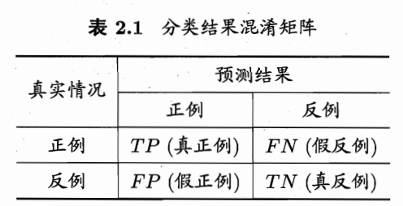
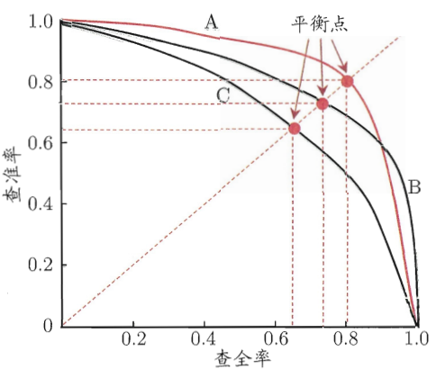
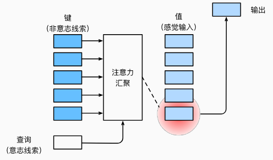
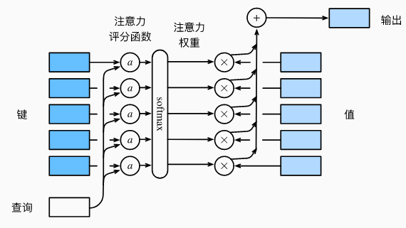
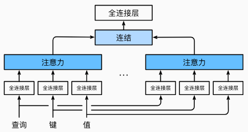
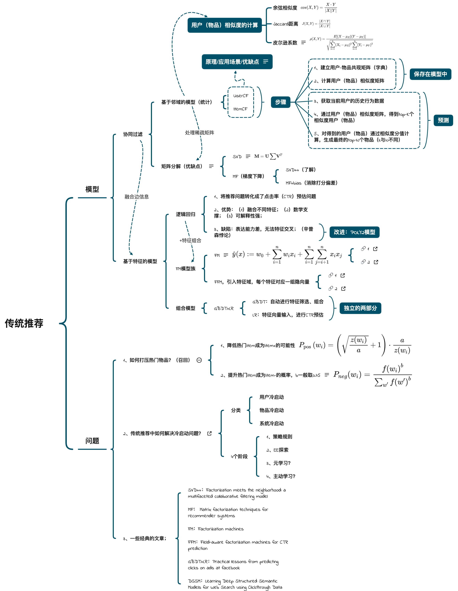

# RecSys Notes

Take notes of the knowledge of recommendation system whatever in the manners of traditional ways or deep learning ways.

## 零. 初步

### 1. 推荐系统评测指标

* 准确率(precision)和召回率(recall)

  > 这里的准确率和精确率(accuracy)是不同的。

  

  准确率：即在所有预测为A类的结果中，确实属于A类的比例。
  $$
  P = \frac{TP}{TP+FP}
  $$
  召回率：比如在所有想要给用户推荐的结果中，把用户喜欢的结果推荐出的比例。
  $$
  R = \frac{TP}{TP+FN}
  $$
  通常情况下准确率越高，召回率越低；召回率越高，准确率越低。

  将两个指标进行作图可以得到 P-R 图：

  

  

  对于三个模型得到的 P-R 图，取三者的平衡点(BEP, Break-Even Point)，BEP 值越大表明模型更优。

* F1

* DCG

### 2. 常见数据集

数据集介绍：[Recommender Systems Datasets (ucsd.edu)](https://cseweb.ucsd.edu/~jmcauley/datasets.html)

* [MovieLens 数据集](https://grouplens.org/datasets/movielens/)
* [Book-Crossing Dataset](http://www2.informatik.uni-freiburg.de/~cziegler/BX/)

## 一. 前置知识

### 1. 注意力机制

#### 1.1 查询 键 值

人类注意力的方式分为自主性和非自主性的注意力两种方式。在注意力机制的背景下，将自主性的提示成为查询(query)。给定任何查询，注意力机制通过注意力汇聚(Attention Pooling)将选择的查询引导至感官输入(sensory inputs)，这种感官输入称为值(value)。

注意力汇聚将给定的查询(自主性提示)和键(非自主性提示)进行匹配，从而引导出最匹配的值。

#### 1.2 注意力汇聚: Nadaraya-Watson 核回归

对于最简单的注意力汇聚就是平均汇聚(平均池化)：
$$
f(x)=\frac1n\sum_{i=1}^ny_i
$$
很显然这个并未考虑输入 $x_i$，Nadaraya-Watson 对其进行了改进，根据输入的位置来对输出进行加权：
$$
f(x)=\sum_{i=1}^n\dfrac{K(x-x_i)}{\sum_{j=1}^nK(x-x_j)}y_i
$$
该公式称为 Nadaraya-Watson 核回归，其中 $K$ 是一个核函数，可以是高斯核等等。

可以将上述公式抽象为：
$$
f(x)=\sum_{i=1}^n\alpha(x,x_i)y_i
$$
其中 x 是查询，$(x_i, y_i)$ 是键值对，查询 $x$ 和键 $x_i$ 之间的关系建模为注意力权重 $\alpha(x,x_i)$，这个权重将分配给每一个对应的值 $y_i$，注意力权重都是一个非负有效的概率分布，且所有权重之和为1。

可以考虑一个高斯核：
$$
K(u)=\dfrac1{2\pi}\exp(-\dfrac{u^2}2)
$$
代入到 Nadaraya-Watson 核回归中可以得到：
$$
\begin{split}\begin{aligned} f(x) &=\sum_{i=1}^n \alpha(x, x_i) y_i\\ &= \sum_{i=1}^n \frac{\exp\left(-\frac{1}{2}(x - x_i)^2\right)}{\sum_{j=1}^n \exp\left(-\frac{1}{2}(x - x_j)^2\right)} y_i \\&= \sum_{i=1}^n \mathrm{softmax}\left(-\frac{1}{2}(x - x_i)^2\right) y_i. \end{aligned}\end{split}
$$
即转化为一个 softmax 函数，如果一个键 $x_i$ 越是接近给定的查询 $x$ ，则其注意力权重越大。

Nadaraya-Watson 核回归是一个无参数的注意力汇聚，在此基础上介绍一个有参数的注意力汇聚：
$$
\begin{split}\begin{aligned}f(x) &=\sum_{i=1}^n \mathrm{softmax}\left(-\frac{1}{2}((x - x_i)w)^2\right) y_i.\end{aligned}\end{split}
$$
加入这个权重就可以进行训练拟合对应的数据了。

#### 1.3 注意力评分函数

在高斯核中的指数部分可以看作**注意力评分函数**(attention scoring function)，相当于 softmax 的参数。因此 Nadaraya-Watson 核回归可以看作 softmax 的加权平均操作，在上小节中 score function 为 $\left(-\frac{1}{2}((x - x_i)w)^2\right)$。这里会介绍两个评分函数：加性注意力(additive attention)和缩放点积注意力(scaled dot-product attention)。

🔵masked softmax

对于注意力机制在生活实际应用中，比如预测下一个时间段的值，并不希望注意力机制计算这个时间段之后的所有值，因此需要对于时间段之后的值进行无效填充，可以将对应的值填充为大负数，经过 softmax 操作之后其对应的注意力权重就为0。

🔵Additive attention

当 query 和 key 的长度不一致的时候，就可以使用 Additive attention 来作为评分函数。即给定 $q\in \R^q, K\in \R^k$，其评分函数为：
$$
a(q,k) =\bold{W}_v^T\tanh (\bold{W}_qq+\bold{W}_kk)\in \R
$$
可学习的参数分别为：$\bold{W}_v, \bold{W}_q,\bold{W}_k$，无 bias。

🔵Scaled dot-product attention

使用点积计算可以得到计算效率更高的评分函数，要求就是 query 和 key 需要具有相同的长度。假设查询和键的所有元素都是独立的随机变量， 并且都满足零均值和单位方差， 那么两个向量的点积的均值为0，方差为d。 为确保无论向量长度如何， 点积的方差在不考虑向量长度的情况下仍然是1， 我们将点积除以 $\sqrt d$， 则*缩放点积注意力*（scaled dot-product attention）评分函数为：
$$
a(\mathbf q, \mathbf k) = \mathbf{q}^\top \mathbf{k}  /\sqrt{d}.
$$

#### 1.4 多头注意力

与其只是用单独的注意力汇聚，也可以独立学习到 h 组不同的线性投影来变换 KQV 并行的送入到注意力汇聚中，最后将 h 个注意力汇聚的输出拼接在一起，通过另一个可以学习的线性投影进行变换来产生最终的输出。

对于每个注意力头 $h_i$ 的计算方法为：
$$
\mathbf{h}_i = f(\mathbf W_i^{(q)}\mathbf q, \mathbf W_i^{(k)}\mathbf k,\mathbf W_i^{(v)}\mathbf v) \in \mathbb R^{p_v},
$$
最后将所有注意力头拼接后进行另一个线性转换：
$$
\begin{split}\mathbf W_o \begin{bmatrix}\mathbf h_1\\\vdots\\\mathbf h_h\end{bmatrix} \in \mathbb{R}^{p_o}.\end{split}
$$

## 二. 协同过滤算法

协同过滤算法(Collaborative Filtering)属于传统推荐算法，其下又可以细分为很多类，如图：

学术界也对于协同过滤算法有很多深入的研究，提出了很多办法，比如基于邻域(neighbor-based)的方法，隐语义模型(latent factor model)，基于图的随机游走算法（random walk on graph）等。其中应用最广泛的就是基于邻域的方法。

### 1. 基于邻域的推荐算法

基于邻域的算法主要分为以下两种：

1. 基于用户的协同过滤算法(UserCF)，给用户推荐和他兴趣相似的用户喜欢的物品
2. 基于物品的协同过滤算法(ItemCF)，给用户推荐和他之前喜欢的物品相似的物品

🔵用户/物品相似度的计算：

1. 余弦相似度

   余弦相似度是通过测量两个向量夹角的余弦值来度量其之间的相似性。其结果和向量的长度无关，只与向量的方向有关。
   $$
   \text{similarity}=\cos(\theta)=\dfrac{A\cdot B}{||A||\ ||B||}
   $$
   对于离散值的计算有：
   $$
   \text{similarity}=\dfrac{|N(u)\cap N(v)|}{\sqrt{|N(u)|\cdot |N(v)|}}
   $$
   比如在用户推荐中，用户 A 对物品 {a, b, d} 有过交互，用户 B 对物品 {a, c} 有过交互，则用户A和用户B之间兴趣的相似度为：
   $$
   s_{AB}=\dfrac{|\{a,b,d\}\cap \{a,c\}|}{\sqrt{|\{a,b,d\}|\cdot |\{a,c\}|}}=\dfrac1{\sqrt6}
   $$
   
2. Jaccard 相似系数

   也可以成为交并比
   $$
   s=\dfrac{|A\cap B|}{|A\cup B|}
   $$

3. 皮尔逊相关系数

   用于度量两个变量 X 和 Y 之间的现象相关程度，值介于-1和1之间，定义为两个变量的协方差除以它们的标准差的乘积：
   $$
   \rho_{X,Y}=\dfrac{\text{cov}(X,Y)}{\rho_X\rho_Y}{\displaystyle ={\frac {\sum \limits _{i=1}^{n}(X_{i}-{\overline {X}})(Y_{i}-{\overline {Y}})}{{\sqrt {\sum \limits _{i=1}^{n}(X_{i}-{\overline {X}})^{2}}}{\sqrt {\sum \limits _{i=1}^{n}(Y_{i}-{\overline {Y}})^{2}}}}}}
   $$
   当 $|\rho|=1$ 时表明两个变量之间有着明显的线性关系，并且当 $\rho=1$ 为正相关，-1 时为负相关。

4. 改进版用户相似度

   最简单的余弦相似度过于粗糙，如果两个用户都曾经买过新华字典，丝毫不能说明他们的兴趣相似，因为绝大部分中国人小时候都买过。如果两个用户对冷门物品采取过同样的行为则更能说明他们兴趣的相似度，因此因该对热门物品推荐进行惩罚：
   $$
   \text{similarity}=\dfrac{\displaystyle\sum_{i\in N(u)\cap N(v)}\frac1{\log_2{1+|N(i)|}}}{\sqrt{|N(u)|\cdot |N(v)|}}
   $$
   

🔵UserCF

> UserCF在实际应用中并不多(2012年《推荐系统实战》)

基于用户的协同过滤算法主要分为两个步骤：

1. 找到和目标用户兴趣度相似的用户集合
2. 找到这个集合中用户喜欢的，且用户没有见过的物品推荐给目标用户

UserCF的缺点：

* 随着网站用户数目越来越多，用户相似度矩阵计算越来越困难，计算复杂度是 $O(n^2)$ 的
* UserCF 的可解释性很差

🔵ItemCF

> ItemCF是当前业界应用最多的算法。Amazon，Netflix，YouTube 等都是基于该算法改进。

基于物品的协同过滤算法是给用户推荐和他们之前喜欢的物品相似的物品。

ItemCF 不是根据计算物品内容来计算物品之间的的相似度，主要是提高分析用户的行为记录计算物品之间的相似度。

ItemCF 主要分为两步：

1. 计算物品之间的相似度
2. 根据物品的相似度和用户的历史行为给用户生成推荐列表

### 2. 基于模型的推荐算法

🔵因子分解机（Factorization Machines）

改进前：
$$
\hat y(x)=\omega_0+\sum_{i=1}^n\omega_ix_i+\sum_{i=1}^n\sum_{j=i+1}^n\omega_{ij}x_ix_j
$$
改进后：
$$
\hat y(x)=\omega_0+\sum_{i=1}^n\omega_ix_i+\sum_{i=1}^n\sum_{j=i+1}^n<v_i,v_j>x_ix_j
$$
将二阶信息中的权重 $w_{ij} $ 分解为 $<v_i,v_j>$ 

改进后的公式时间复杂度为 $O(kn^2)$ 级别的，大佬又将二次项降为线性时间复杂度 $O(kn)$：
$$
\sum_{i=1}^n\sum_{j=i+1}^n<v_i,v_j>x_ix_j=\dfrac12\sum_{f=1}^k((\sum_{i=1}^nv_{i,f}x_i)^2-\sum_{i=1}^n(v_{i,f}x_i)^2)
$$
