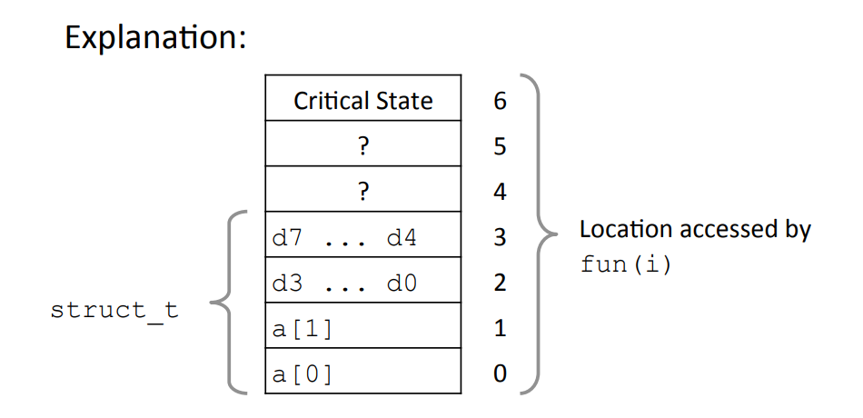
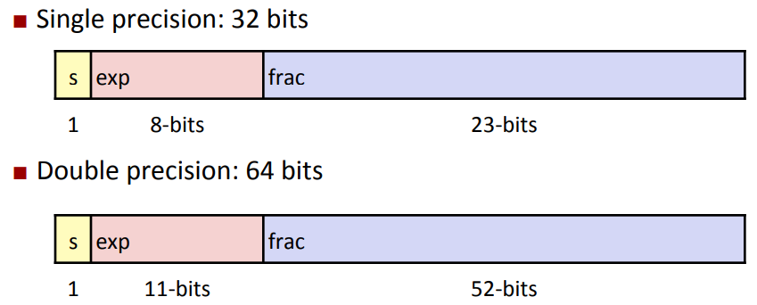
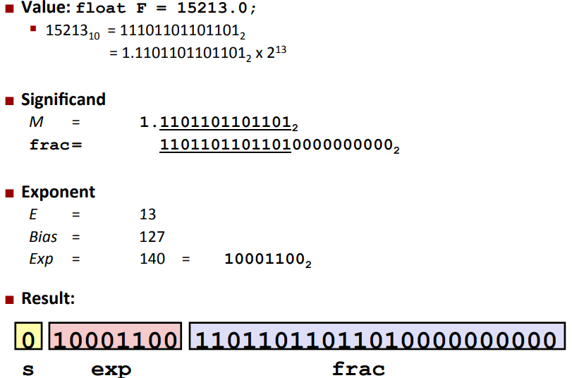
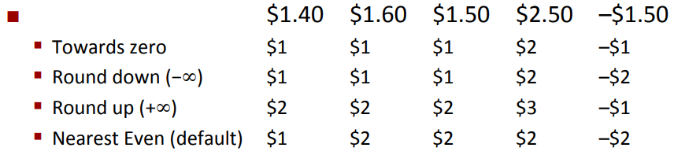
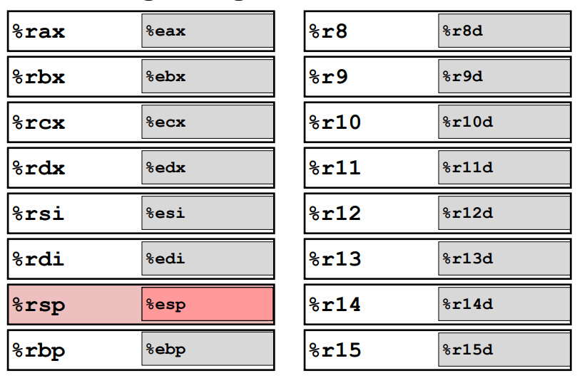
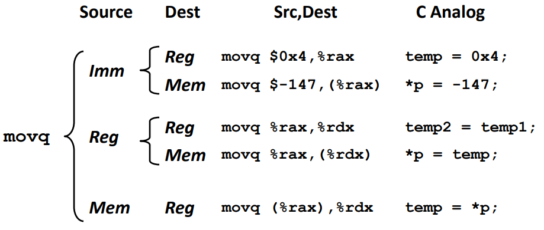
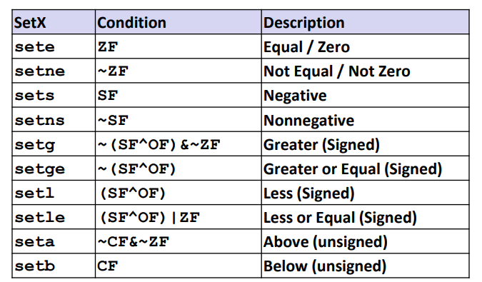
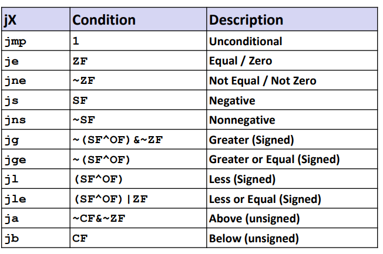

# CSAPP

[TOC]

课程链接：[15-213: Introduction to Computer Systems (cmu.edu)](https://www.cs.cmu.edu/~213/)

15年链接：[15-213: Introduction to Computer Systems / Schedule Fall 2015 (cmu.edu)](https://www.cs.cmu.edu/afs/cs/academic/class/15213-f15/www/schedule.html)

lab 链接：[CS:APP3e, Bryant and O'Hallaron (cmu.edu)](http://csapp.cs.cmu.edu/3e/labs.html)

## 一. 介绍

### 1. 有趣的现象

* 在计算机中是否所有数字都满足 $x^2\ge0$ ？

  对于浮点数来全部满足。对于整数中不一定：

  ```sh
  (gdb) print 40000*40000
  $1 = 1600000000
  (gdb) print 50000*50000
  $2 = -1794967296
  ```

  即计算机中对于 int 存储为 32 位，可能存在溢出的情况。

* 在计算机中是否所有数字满足假发结合律 $(x+y)+z=x+(y+z)$ ？

  对于整数来全部满足，然而对于浮点数就不一定了：

  ```sh
  (gdb) print (1e20+-1e20)+3.14
  $3 = 3.1400000000000001
  (gdb) print 1e20+(-1e20+3.14)
  $4 = 0
  ```

  都源于其使用有限位的组合来表示无限范围的数字，从而导致计算错误的情况。

对于 90% 的情况下都无需考虑这种情况，但是如果遇到系统安全或者火箭设计的时候必须要注意这些情况。

* 在 C/C++ 中对于数组随机访问不会对数组索引进行边界 检查：

  ```c
  typedef struct {
          int a[2];
          double d;
  } struct_t;
  
  double fun(int i) {
          volatile struct_t s;
          s.d = 3.14;
          s.a[i] = 1073741824;
          return s.d;
  }
  ```

  对于不同情况会有以下输出：

  ```sh
  0	->	3.140000
  1	->	3.140000
  2	->	3.140000
  3	->	2.000001
  4	->	3.140000
  5	->	3.140000
  6	->	*** stack smashing detected ***: terminated
  [1]    4500 abort (core dumped)  ./a.out
  ```

  当输入 6 的时候就会导致程序崩溃。

  

  由图所示，当 i 为 0 或者 1 的时候会修改属于其所在的内存区域，当为2，3的时候就是修改 d 所有的内存区域，当为 4，5，6 的时候可能修改了维持程序运行的状态，就会导致程序错误。

* 内存访问策略：

  ```c
  void copyij(int src[][], int dest[][]) {
          for(int i = 0; i < 2048; i++)
                  for(int j = 0; j < 2048; j++)
                          src[i][j] = dest[i][j];
  }
  
  
  void copyji(int src[][], int dest[][]) {
          for(int i = 0; i < 2048; i++)
                  for(int j = 0; j < 2048; j++)
                          src[j][i] = dest[j][i];
  }
  ```

  在这个程序中，前者运行速度要比后者快 20 倍左右。

  对于一个二维数组来说，其在计算机中保存的方式为一片连续空间，按列访问会让指向内存区域的指针不断的跳来跳去，不断计算下一个需要访问内存区域的地址；而按行访问只需要将指针移向下一片内存区域即可。

  

## 二. 数字表示

###  1. 符号数 signed VS unsigned

在 C/C++ 数字比较中，如果类型不同比较就会导致潜在的 bug 。

| 评估方式 |      A       | 关系 |         B         |
| :------: | :----------: | :--: | :---------------: |
| unsigned |      -1      |  >   |         0         |
| unsigned |  2147483647  |  <   |    -2147483648    |
| unsigned | (unsigned)-1 |  >   |        -2         |
|  signed  |  2147483647  |  >   | (int)21477483648U |

因此有以下结论：

* 有符号的正数永远小于转为无符号数字的有符号负数。

* 对于 $-2^{31}=-2147483648$ 来说，在 int 类型中， $-(-2147483648) = -2147483648$，这是需要注意的情况。

* 对于 unsigned 类型来说，不适合反向遍历数组：

    ```c
    unsigned int i = 5;
    for(;i>=0;i++);
    ```

* 因为当 $i=0; i=i-1$ 的时候，$i$ 会等于 $2^{32}-1=4294967295$

* 如果有符号数和无符号数一起运算，有符号数会转换为无符号数。
* `sizeof()` 返回的是无符号数。

### 2. 数字运算

* 溢出

  溢出分为正溢出和负溢出，正溢出是因为两个正数相加结果过大导致溢出得到负数，负溢出是因为两个负数相加结果过小导致溢出得到正数。

  对于有符号数来说有两种溢出，对于无符号数来说只有一种溢出。

* 位运算

  左移右移：左移相当于乘2，右移相当于除以2，但是又有一些细微的区别：

  ```c
  printf("%d,%d\n", 3 / 2, -3 / 2);
  // 1,-1
  printf("%d,%d\n", 3 >> 1, -3 >> 1);
  // 1,-2
  ```

  对于右移一位来说，相当于除以 2 再进行向下取整，比如 $3>>1$ 约为 1.5 但是取 1，-3>>1 约为 -1.5 向下取整取为2。

* 什么时候应该使用无符号数进行运算？

  取模运算，hash 运算等等

### 3. 浮点数

IEEE 754 表示法：



因此一个二进制浮点数可以表示为 $(-1)^sM\cdot2^E$，其中

* s 表示符号位

* exp 表示精度，不能位全 0 也不能为全 1，最终表示的位数为 $E=\text {exp-bias,\ bias}=2^{k-1}-1$。

  |  类别  |   exp    |      E       | bias |
  | :----: | :------: | :----------: | :--: |
  | 单精度 | [1,254]  |  [-126,127]  | 127  |
  | 双精度 | [1,2046] | [-1022,1023] | 1023 |

  

* frac 表示基数 M，其表示范围在 $[1.0,2)$ 之间，有一个隐含前置 1：

  当 frac 为 000...0 时表示 1.0 为最小值，当 frac 为 111...1 时候表示 $(2.0-\epsilon)_2$ 为最大值

举例：




由于 frac 部分始终都有一个隐含前导 1，因此表示数字 0 的时候十分不方便。

IEEE 754 推出非标准表示法，当 exp = 000...0 时候，frac 前导为 0：

* 当 frac 为 000...0 的时候就表示为 0 值，并且由于符号位 s 的存在会有 +0 和 -0 的区分
* 当 frac $\neq$ 000...0 的时候就表示十分接近与 0 的值。

还有几种特殊的值：

* 当 exp 全为 111...1 且 frac = 000...0 的时候就表示无穷大

  比如 $1.0/0.0=-1.0/-0.0=+\infin, 1.0/-0.0=-\infin$

* 当 exp  全为 111...1 且 frac ≠ 000...0 的时候就表示 NaN

  比如 $\infin+\infin$

```c
double a = 1.0/0.0;
double b = 1.0/-0.0;
printf("%lf, %lf, %lf\n", a, b, a+b);
// 输出
// inf, -inf, -nan
```

**舍入方式**：



最特殊的是向最近偶数(Nearest Even)舍入。

> 对于浮点数来说，并不具备加法结合律，比如加数之间相差较大 ，详见<a href='#1. 有趣的现象'>链接</a>.

因此对于程序员来说，如果使用浮点数用于表示变化极大的数据的时候，需要考虑浮点数可能存在的各种 bug 情况，有可能相同的数据在理论上结果完全相同但是实际中会得到不同答案的情况，因此需要格外注意来保证程序的鲁棒性。

 **类型转换**：

|       From       |         To         | Equal |
| :--------------: | :----------------: | :---: |
|       int        |    (int)(float)    | False |
|       int        |   (int)(double)    | True  |
|      float       |  (float)(double)   | True  |
|      double      |  (double)(float)   | False |
|      float       |     -(-float)      | True  |
|  double > float  | - float > - double | True  |
|   d * d >= 0.0   |                    | True  |
| (d + f) - d == f |                    | False |

### 4. 大端和小端存储

大端存储即先将数字的高位到低位依次存储，比如对于数字 0x12345678，在计算机的中大端的表示形式为 `12 34 56 78`；小端存储即先将数字的低位到高位依次存储，存储形式为 `78 56 34 12`。

C/C++判断大小端：

```c
int main() {
    int a = 0x12345678;
    char* b = (char *)&a;
    if (b[0] == 0x78) printf("small endian: %.2x.\n", b[0]);
    else if(b[0] == 0x12) printf("big endian: %.2x.\n", b[0]);
    else printf("error: %.2x.\n", b[0]);
    return 0;
}
```

Java 判断大小端（使用 unsafe 类）：

```java
public static void main(String[] args) throws NoSuchFieldException, IllegalAccessException {
    Field theUnsafe = Unsafe.class.getDeclaredField("theUnsafe");
    theUnsafe.setAccessible(true);
    Unsafe unsafe = (Unsafe) theUnsafe.get(null);
    System.out.println(unsafe);
    long a = unsafe.allocateMemory(8L);
    unsafe.putLong(a,0x12345678);
    byte b = unsafe.getByte(a);
    if (b == 0x12) System.out.println("Big Endian");
    else if (b == 0x78) System.out.println("Small Endian");
    else System.out.println("Error:" + b);
}
```

## 三. 程序机器级别表示

### 1. 汇编语言

将 C/C++ 转译成汇编语言：

```sh
gcc -Og -S sum.c
# -Og 是用于生成便于调试的汇编代码
```

或者通过反汇编得到汇编语言：

```sh
# 编译
gcc sum.c -o sum
# 反汇编
objdump -d sum > sum.d
```

也可以使用 gdb 进行反汇编：

```sh
gdb sum
# disassemble 后面是函数名
disassemble sumstore
```

生成汇编代码如下：

```assembly
    .file   "sum.c"
    .text
    .globl  plus
    .type   plus, @function
plus:
.LFB39:
    .cfi_startproc
    endbr64
    leaq    (%rdi,%rsi), %rax
    ret
    .cfi_endproc
.LFE39:
    .size   plus, .-plus
    .globl  sumstore
    .type   sumstore, @function
sumstore:
.LFB40:
    .cfi_startproc
    endbr64
    pushq   %rbx
    .cfi_def_cfa_offset 16
    .cfi_offset 3, -16
    movq    %rdx, %rbx
    call    plus
    movq    %rax, (%rbx)
    popq    %rbx
    .cfi_def_cfa_offset 8
    ret
    .cfi_endproc
.LFE40:
    .size   sumstore, .-sumstore
    .section    .rodata.str1.1,"aMS",@progbits,1
.LC0:
    .string "%ld + %ld --> %ldd\n"
    .text
    .globl  main
    .type   main, @function
```

其中以 `.` 开头的不是指令，是用于提供给调试器信息有关，方便其定位程序的各个部分。比如 `.globl` 关键字可以用来让一个符号对 Linker 可见，可以供其他链接对象进行使用，告诉编译器后续是一个全局可见的名字，可能是变量也可能是函数名。

在机器级别，基本数据结构基本不存在，是由编译器人工进行构建的。

### 2. x86 指令



大部分寄存器与原有命名时候的用途已无关，但是 rsp 和 rbp 这两个寄存器仍保留了其原有的用途。sp 表示 stack point 即为栈指针，bp 表示 base pointer 表示基指针。

> 对于一般函数来说，第一个参数存放在 %rdi，第二个参数存放到 %rsi 中，从函数中返回结果存放到 %rax 中。

* movq A,B 指令

  为了硬件设计人员的方便，不允许从一个内存位置复制到另一个内存位置，允许的操作目标如下图。

  

  `(%rax)` 表示 rax 寄存器中存储的为一个内存地址，使用 `()` 表示取出这个内存中的数据。

  `D(%rax)` 表示在这个内存地址上进行偏移，然后取出内容，相当于 `(%rax + D)`

  `D(%rax, %rbx, S)` 相当于 `(%rax + s * %rbx + d)`，其中 %rbx 不可以被替换为 rsp, S 只能取 1,2,4,8

* leaq src, dst

  src 一般是一个表达式，用于将表达式计算结果存放到 dst 中。

  对于 `x * 12` 这个操作：

  ```assembly
  leaq (%rdi, %rdi, 2), %rax	# t = x + x * 2
  salq $2, %rax	# t << 2
  ```

* 位标记（在控制流中会关注）

  1. CF，Carry Flag 表示进位标记，用于 unsigned 类型
  2. SF，Sign Flag，用于 signed 类型，表示 if res < 0
  3. ZF，Zero Flag，计算结果为 if res == 0
  4. OF，Overflow Flag，用于 signed 类型，判断补码是否溢出 (a > 0 && b > 0 & res < 0) || (a < 0 && b < 0 && t >= 0)

* cmpq b, a

  相当于计算 a-b 但是不产生计算结果，只改变位标记。

* testq b, a

  用于计算 a&b，一般都是与自己比较，比如 `testq %rax, %rax`

  ZF = 1 if a & b == 0

  SF = 1 if a & b < 0

* set* 指令

  

  `SETNE %rax` 将 ZF 标志取反存放到 rax 寄存器中。

* movzbl %al, %eax

  movzbl 全称 move with zero extension byte to long，将 al 中的值移到 eax 中，并且将剩余位置零。

* J* 跳转指令

  

  `jmp xxx` 表示直接跳转到 xxx 地址处。

  `je xxx` 表示如果 ZF = 1，则跳转到 xxx 处。

  其他类似。

* 

## Appendix

### 1. datalab-wp

1. bitXor，异或运算

   ```c
   /*
    * bitXor - x^y using only ~ and &
    *   Example: bitXor(4, 5) = 1
    *   Legal ops: ~ &
    *   Max ops: 14
    *   Rating: 1
    */
   int bitXor(int x, int y) {
     return ~(~(~x&y)&~(~y&x));
   }
   ```

   根据数字逻辑电路的知识可以知道：异或可以表示为 $A\oplus B=\overline AB+A\overline B$ ，或运算只使用与和非符号可以表示为 $A+B=\overline{\overline A\ \overline B}$ 。

2. tmin，返回 int 类型补码最小值

   ```c
   /*
    * tmin - return minimum two's complement integer
    *   Legal ops: ! ~ & ^ | + << >>
    *   Max ops: 4
    *   Rating: 1
    */
   int tmin(void) {
     return 1 << 31;
   }
   ```

   即 0x80000000

3. isTmax，判断一个数是否是 TMAX

   ```c
   //2
   /*
    * isTmax - returns 1 if x is the maximum, two's complement number,
    *     and 0 otherwise
    *   Legal ops: ! ~ & ^ | +
    *   Max ops: 10
    *   Rating: 1
    */
   int isTmax(int x) {
     return (~!(x+1))&!(~((x+1)^x));
   }
   ```

   判断其是否等于 0x7fffffff。在 int 范围内只有两个数字满足 `(x+1)^x=0xffffffff`，分别是 0x7fffffff 和 0xffffffff。因此只需要接下来区分这两个数字即可。

4. allOddBits，判断所有奇数位是否全为 1

   ```c
   int allOddBits(int x) {
       int a = 0xaa+(0xaa<<8)+(0xaa<<16)+(0xaa<<24);
       return !((x&a)^a);
   }
   ```

   和 0xaaaaaaaa 对比即可。

5. negate，取负数

   ```c
   /*
    * negate - return -x
    *   Example: negate(1) = -1.
    *   Legal ops: ! ~ & ^ | + << >>
    *   Max ops: 5
    *   Rating: 2
    */
   int negate(int x) {
     return ~x+1;
   }
   ```

   负数补码=反码+1

6. 判断是否是 ascii 字符

   ```c
   /*
    * isAsciiDigit - return 1 if 0x30 <= x <= 0x39 (ASCII codes for characters '0' to '9')
    *   Example: isAsciiDigit(0x35) = 1.
    *            isAsciiDigit(0x3a) = 0.
    *            isAsciiDigit(0x05) = 0.
    *   Legal ops: ! ~ & ^ | + << >>
    *   Max ops: 15
    *   Rating: 3
    */
   int isAsciiDigit(int x) {
     return !(x>>4^3) & ( ((x>>3&1)^1) | ( (x>>3&1) & !(x >> 1 & 3)) );
   }
   ```

   首先判断是否是 0x3*，末尾 0 ~ 9 的二进制表示可以表示为 0\*\*\* 和 1000，1001，分别处理这三种情况即可。

7. conditional，使用位运算实现三元运算符

   ```c
   /*
    * conditional - same as x ? y : z
    *   Example: conditional(2,4,5) = 4
    *   Legal ops: ! ~ & ^ | + << >>
    *   Max ops: 16
    *   Rating: 3
    */
   int conditional(int x, int y, int z) {
     return (z&(!!x+~0))+(y&(!x+~0));
   }
   ```

   对于任意一个数字有以下对应表：

   |   x   |  !x  | !!x  |     !!x+~0     |
   | :---: | :--: | :--: | :------------: |
   |   0   |  1   |  0   | -1(0xffffffff) |
   | other |  0   |  1   | 0(0x00000000)  |

   因此上表就将 int 范围内的所有整数映射到两个点上。

   而对于只能含加法运算来实现选择的功能，必然需要实现减法：

   * 当 $x = 0$ 时，值为 $z$，可以看作 $y\&0+z\&\text{0x11111111}$
   * 当 $x\ne 0$ 时，值为 $y$，可以看作 $z\&0+y\&\text{0x11111111}$

8. isLessOrEqual，实现小于等于的功能

   ```c
   int isLessOrEqual(int x, int y) {
       int xs = x >> 31 & 1;
       int ys = y >> 31 & 1;
       int s = !((ys + (~xs+1)) ^ ~0);	// 判断是否符号相同
       int ss = !!((ys+(~xs+1)) ^ 1);	// 判断是否符号不同
       //printf("\n%d-%d-%d\n",xs,ys,s);
       return ss & (s | ((y+(~x+1) >> 31) + 1));
   }
   ```

   首先想到的就是减法运算，但是如果 Tmax - Tmin 就会出现溢出的情况。因此需要首先判断符号，如果 x 是负数 y 是非负数即返回 1；然后再进行减法运算。

9. logicalNeg，不使用 `!` 符号实现逻辑非运算。

   ```c
   /*
    * logicalNeg - implement the ! operator, using all of
    *              the legal operators except !
    *   Examples: logicalNeg(3) = 0, logicalNeg(0) = 1
    *   Legal ops: ~ & ^ | + << >>
    *   Max ops: 12
    *   Rating: 4
    */
   int logicalNeg(int x) {
       x = x | (x << 16);
       x = x | (x << 8);
       x = x | (x << 4);
       x = x | (x << 2);
       x = x | (x << 1);
       return (x >> 31) + 1;
   }
   ```

   判断逻辑非运算即判断数字每一位中是否存在 1，但是只使用 12 个操作数对于 32 位的 int 数字来说，逐位进行比较显然不可能。

   根据思想，只有数字任何一位中存在 1 进行非运算后都为 0。为了减少运算应该采用**分治**的思想。

   将低位的 1 使用或运算全部聚合到高位即可，最终判断最高位是否为 1 即可。

10. howManyBits，计算需要最少使用多少个 bit 来表示某个数字的补码

    ```c
    /* howManyBits - return the minimum number of bits required to represent x in
     *             two's complement
     *  Examples: howManyBits(12) = 5
     *            howManyBits(298) = 10
     *            howManyBits(-5) = 4
     *            howManyBits(0)  = 1
     *            howManyBits(-1) = 1
     *            howManyBits(0x80000000) = 32
     *  Legal ops: ! ~ & ^ | + << >>
     *  Max ops: 90
     *  Rating: 4
     */
    int howManyBits(int x) {
        int b16,b8,b4,b2,b1,b0;
        int sign=x>>31;
        x = (sign&~x)|(~sign&x);//正不变，否则按位取反
        // 不断缩小范围
        b16 = !!(x>>16)<<4;//高十六位是否有1
        x = x>>b16;//如果有（至少需要16位），则将原数右移16位
        b8 = !!(x>>8)<<3;//剩余位高8位是否有1
        x = x>>b8;//如果有（至少需要16+8=24位），则右移8位
        b4 = !!(x>>4)<<2;//同理
        x = x>>b4;
        b2 = !!(x>>2)<<1;
        x = x>>b2;
        b1 = !!(x>>1);
        x = x>>b1;
        b0 = x;
        return b16+b8+b4+b2+b1+b0+1;//+1表示加上符号位
    }
    ```

    同样采用**分治**的思想，如果高位存在则低位必然存在，比较难想到。

11. floatScale2，将 32 位 float 以 IIEEE 754 的表现形式乘以 2

    ```c
    /*
     * floatScale2 - Return bit-level equivalent of expression 2*f for
     *   floating point argument f.
     *   Both the argument and result are passed as unsigned int's, but
     *   they are to be interpreted as the bit-level representation of
     *   single-precision floating point values.
     *   When argument is NaN, return argument
     *   Legal ops: Any integer/unsigned operations incl. ||, &&. also if, while
     *   Max ops: 30
     *   Rating: 4
     */
    unsigned floatScale2(unsigned uf) {
        unsigned mf = 0xff << 23;
        unsigned lf = (1 << 23) - 1;
        unsigned s = (uf & mf) >> 23;
        // inf
        if(s == 0xff)return uf;
        // zero and more smaller
        unsigned ff = uf & lf;
        if(s == 0){
            if(ff == 0)return uf;
            ff *= 2;
            if(ff >= 1 << 23) {
                s +=1;
            }
            ff = ff & lf;
            uf = (uf & ~lf) | ff;
        } else s += 1;
    
        uf = (uf & ~mf) | (s << 23);
        return uf;
    }
    ```

    使用与运算得到 exp 和 frac 部分。如果 exp = 0xff 则表示位无穷大；如果 exp = 0x0 则可能表示 0 或者十分接近 0 的数，对于十分接近 0 的数乘以 2，可能会改变 exp 也有可能不会改变 exp 部分，对于改变 exp 部分的需要将 frac 表示为 1.xxx 的形式，否则仍然是 0.xxx 的形式。对于 exp ≠ 0x0 只需要将 exp +1即可。

12. floatFloat2Int，实现 float 到 int 类型的强转

    ```c
    /*
     * floatFloat2Int - Return bit-level equivalent of expression (int) f
     *   for floating point argument f.
     *   Argument is passed as unsigned int, but
     *   it is to be interpreted as the bit-level representation of a
     *   single-precision floating point value.
     *   Anything out of range (including NaN and infinity) should return
     *   0x80000000u.
     *   Legal ops: Any integer/unsigned operations incl. ||, &&. also if, while
     *   Max ops: 30
     *   Rating: 4
     */
    int floatFloat2Int(unsigned uf) {
        int mf = 0xff << 23, lf = (1 << 23) - 1;
        int fs = uf >> 31 & 1, ms = (uf & mf) >> 23, ls = (uf & lf) | (1 << 23);
        // 过于小的值，直接返回 0
        if (ms <= 126) return 0;
        if (ms >= 159) return 0x80000000u;
        int sh = ms - 127 - 23;
        while(sh != 0) {
            if(sh++ < 0) ls = ls >> 1;
            else if(sh-- > 0) ls = ls << 1;
        }
        return fs == 1 ? - ls : ls;
    }
    ```

    对于 0.xxxx 即 $2^{-x},x\gt 0$ 的数字直接返回 0；对于溢出的数字返回 UMax；然后将 frac 部分进行移位即可，最后再判断以下符号位。

13. floatPower2，实现 $2^x$

    ```c
    /*
     * floatPower2 - Return bit-level equivalent of the expression 2.0^x
     *   (2.0 raised to the power x) for any 32-bit integer x.
     *
     *   The unsigned value that is returned should have the identical bit
     *   representation as the single-precision floating-point number 2.0^x.
     *   If the result is too small to be represented as a denorm, return
     *   0. If too large, return +INF.
     *
     *   Legal ops: Any integer/unsigned operations incl. ||, &&. Also if, while
     *   Max ops: 30
     *   Rating: 4
     */
    unsigned floatPower2(int x) {
        // +INF
        if (x > 127) return 0xff << 23;
        if (x < -126) return 0;
        x = x + 127;
        return x << 23;
    }
    ```

    比较明了。
