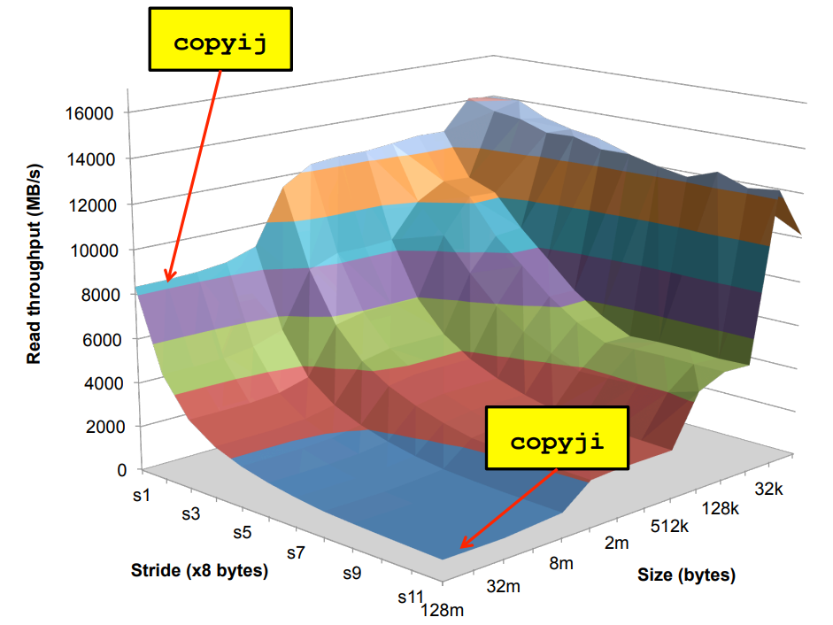

# CSAPP

[TOC]

课程链接：[15-213: Introduction to Computer Systems (cmu.edu)](https://www.cs.cmu.edu/~213/)

15年链接：[15-213: Introduction to Computer Systems / Schedule Fall 2015 (cmu.edu)](https://www.cs.cmu.edu/afs/cs/academic/class/15213-f15/www/schedule.html)

lab 链接：[CS:APP3e, Bryant and O'Hallaron (cmu.edu)](http://csapp.cs.cmu.edu/3e/labs.html)

## 一. 介绍

### 1. 有趣的现象

* 在计算机中是否所有数字都满足 $x^2\ge0$ ？

  对于浮点数来全部满足。对于整数中不一定：

  ```sh
  (gdb) print 40000*40000
  $1 = 1600000000
  (gdb) print 50000*50000
  $2 = -1794967296
  ```

  即计算机中对于 int 存储为 32 位，可能存在溢出的情况。

* 在计算机中是否所有数字满足假发结合律 $(x+y)+z=x+(y+z)$ ？

  对于整数来全部满足，然而对于浮点数就不一定了：

  ```sh
  (gdb) print (1e20+-1e20)+3.14
  $3 = 3.1400000000000001
  (gdb) print 1e20+(-1e20+3.14)
  $4 = 0
  ```

  都源于其使用有限位的组合来表示无限范围的数字，从而导致计算错误的情况。

对于 90% 的情况下都无需考虑这种情况，但是如果遇到系统安全或者火箭设计的时候必须要注意这些情况。

* 在 C/C++ 中对于数组随机访问不会对数组索引进行边界 检查：

  ```c
  typedef struct {
          int a[2];
          double d;
  } struct_t;
  
  double fun(int i) {
          volatile struct_t s;
          s.d = 3.14;
          s.a[i] = 1073741824;
          return s.d;
  }
  ```

  对于不同情况会有以下输出：

  ```sh
  0	->	3.140000
  1	->	3.140000
  2	->	3.140000
  3	->	2.000001
  4	->	3.140000
  5	->	3.140000
  6	->	*** stack smashing detected ***: terminated
  [1]    4500 abort (core dumped)  ./a.out
  ```

  当输入 6 的时候就会导致程序崩溃。

  

  由图所示，当 i 为 0 或者 1 的时候会修改属于其所在的内存区域，当为2，3的时候就是修改 d 所有的内存区域，当为 4，5，6 的时候可能修改了维持程序运行的状态，就会导致程序错误。

* 内存访问策略：

  ```c
  void copyij(int src[][], int dest[][]) {
          for(int i = 0; i < 2048; i++)
                  for(int j = 0; j < 2048; j++)
                          src[i][j] = dest[i][j];
  }
  
  
  void copyji(int src[][], int dest[][]) {
          for(int i = 0; i < 2048; i++)
                  for(int j = 0; j < 2048; j++)
                          src[j][i] = dest[j][i];
  }
  ```

  在这个程序中，前者运行速度要比后者快 20 倍左右。

  对于一个二维数组来说，其在计算机中保存的方式为一片连续空间，按列访问会让指向内存区域的指针不断的跳来跳去，不断计算下一个需要访问内存区域的地址；而按行访问只需要将指针移向下一片内存区域即可。

  

## 二. 数字表示

###  1. 符号数 signed VS unsigned

在 C/C++ 数字比较中，如果类型不同比较就会导致潜在的 bug 。

| 评估方式 |      A       | 关系 |         B         |
| :------: | :----------: | :--: | :---------------: |
| unsigned |      -1      |  >   |         0         |
| unsigned |  2147483647  |  <   |    -2147483648    |
| unsigned | (unsigned)-1 |  >   |        -2         |
|  signed  |  2147483647  |  >   | (int)21477483648U |

因此有以下结论：

* 有符号的正数永远小于转为无符号数字的有符号负数。

* 对于 $-2^{31}=-2147483648$ 来说，在 int 类型中， $-(-2147483648) = -2147483648$，这是需要注意的情况。

* 对于 unsigned 类型来说，不适合反向遍历数组：

    ```c
    unsigned int i = 5;
    for(;i>=0;i++);
    ```

* 因为当 $i=0; i=i-1$ 的时候，$i$ 会等于 $2^{32}-1=4294967295$

* 如果有符号数和无符号数一起运算，有符号数会转换为无符号数。
* `sizeof()` 返回的是无符号数。

### 2. 数字运算

* 溢出

  溢出分为正溢出和负溢出，正溢出是因为两个正数相加结果过大导致溢出得到负数，负溢出是因为两个负数相加结果过小导致溢出得到正数。

  对于有符号数来说有两种溢出，对于无符号数来说只有一种溢出。

* 位运算

  左移右移：左移相当于乘2，右移相当于除以2，但是又有一些细微的区别：

  ```c
  printf("%d,%d\n", 3 / 2, -3 / 2);
  // 1,-1
  printf("%d,%d\n", 3 >> 1, -3 >> 1);
  // 1,-2
  ```

  对于右移一位来说，相当于除以 2 再进行向下取整，比如 $3>>1$ 约为 1.5 但是取 1，-3>>1 约为 -1.5 向下取整取为2。

* 什么时候应该使用无符号数进行运算？

  取模运算，hash 运算等等

### 3. 浮点数

IEEE 754 表示法：


因此一个二进制浮点数可以表示为 $(-1)^sM\cdot2^E$，其中

* s 表示符号位

* exp 表示精度，不能位全 0 也不能为全 1，最终表示的位数为 $E=\text {exp-bias,\ bias}=2^{k-1}-1$。

  |  类别  |   exp    |      E       | bias |
  | :----: | :------: | :----------: | :--: |
  | 单精度 | [1,254]  |  [-126,127]  | 127  |
  | 双精度 | [1,2046] | [-1022,1023] | 1023 |

  

* frac 表示基数 M，其表示范围在 $[1.0,2)$ 之间，有一个隐含前置 1：

  当 frac 为 000...0 时表示 1.0 为最小值，当 frac 为 111...1 时候表示 $(2.0-\epsilon)_2$ 为最大值

举例：


由于 frac 部分始终都有一个隐含前导 1，因此表示数字 0 的时候十分不方便。

IEEE 754 推出非标准表示法，当 exp = 000...0 时候，frac 前导为 0：

* 当 frac 为 000...0 的时候就表示为 0 值，并且由于符号位 s 的存在会有 +0 和 -0 的区分
* 当 frac $\neq$ 000...0 的时候就表示十分接近与 0 的值。

还有几种特殊的值：

* 当 exp 全为 111...1 且 frac = 000...0 的时候就表示无穷大

  比如 $1.0/0.0=-1.0/-0.0=+\infin, 1.0/-0.0=-\infin$

* 当 exp  全为 111...1 且 frac ≠ 000...0 的时候就表示 NaN

  比如 $\infin+\infin$

```c
double a = 1.0/0.0;
double b = 1.0/-0.0;
printf("%lf, %lf, %lf\n", a, b, a+b);
// 输出
// inf, -inf, -nan
```

**舍入方式**：


最特殊的是向最近偶数(Nearest Even)舍入。

> 对于浮点数来说，并不具备加法结合律，比如加数之间相差较大 ，详见<a href='#1. 有趣的现象'>链接</a>.

因此对于程序员来说，如果使用浮点数用于表示变化极大的数据的时候，需要考虑浮点数可能存在的各种 bug 情况，有可能相同的数据在理论上结果完全相同但是实际中会得到不同答案的情况，因此需要格外注意来保证程序的鲁棒性。

 **类型转换**：

|       From       |         To         | Equal |
| :--------------: | :----------------: | :---: |
|       int        |    (int)(float)    | False |
|       int        |   (int)(double)    | True  |
|      float       |  (float)(double)   | True  |
|      double      |  (double)(float)   | False |
|      float       |     -(-float)      | True  |
|  double > float  | - float > - double | True  |
|   d * d >= 0.0   |                    | True  |
| (d + f) - d == f |                    | False |

### 4. 大端和小端存储

大端存储即先将数字的高位到低位依次存储，比如对于数字 0x12345678，在计算机的中大端的表示形式为 `12 34 56 78`；小端存储即先将数字的低位到高位依次存储，存储形式为 `78 56 34 12`。

C/C++判断大小端：

```c
int main() {
    int a = 0x12345678;
    char* b = (char *)&a;
    if (b[0] == 0x78) printf("small endian: %.2x.\n", b[0]);
    else if(b[0] == 0x12) printf("big endian: %.2x.\n", b[0]);
    else printf("error: %.2x.\n", b[0]);
    return 0;
}
```

Java 判断大小端（使用 unsafe 类）：

```java
public static void main(String[] args) throws NoSuchFieldException, IllegalAccessException {
    Field theUnsafe = Unsafe.class.getDeclaredField("theUnsafe");
    theUnsafe.setAccessible(true);
    Unsafe unsafe = (Unsafe) theUnsafe.get(null);
    System.out.println(unsafe);
    long a = unsafe.allocateMemory(8L);
    unsafe.putLong(a,0x12345678);
    byte b = unsafe.getByte(a);
    if (b == 0x12) System.out.println("Big Endian");
    else if (b == 0x78) System.out.println("Small Endian");
    else System.out.println("Error:" + b);
}
```

## 三. 程序机器级别表示

### 1. 汇编语言

将 C/C++ 转译成汇编语言：

```sh
gcc -Og -S sum.c
# -Og 是用于生成便于调试的汇编代码
```

或者通过反汇编得到汇编语言：

```sh
# 编译
gcc sum.c -o sum
# 反汇编
objdump -d sum > sum.d
```

也可以使用 gdb 进行反汇编：

```sh
gdb sum
# disassemble 后面是函数名
disassemble sumstore
```

生成汇编代码如下：

```assembly
    .file   "sum.c"
    .text
    .globl  plus
    .type   plus, @function
plus:
.LFB39:
    .cfi_startproc
    endbr64
    leaq    (%rdi,%rsi), %rax
    ret
    .cfi_endproc
.LFE39:
    .size   plus, .-plus
    .globl  sumstore
    .type   sumstore, @function
sumstore:
.LFB40:
    .cfi_startproc
    endbr64
    pushq   %rbx
    .cfi_def_cfa_offset 16
    .cfi_offset 3, -16
    movq    %rdx, %rbx
    call    plus
    movq    %rax, (%rbx)
    popq    %rbx
    .cfi_def_cfa_offset 8
    ret
    .cfi_endproc
.LFE40:
    .size   sumstore, .-sumstore
    .section    .rodata.str1.1,"aMS",@progbits,1
.LC0:
    .string "%ld + %ld --> %ldd\n"
    .text
    .globl  main
    .type   main, @function
```

其中以 `.` 开头的不是指令，是用于提供给调试器信息有关，方便其定位程序的各个部分。比如 `.globl` 关键字可以用来让一个符号对 Linker 可见，可以供其他链接对象进行使用，告诉编译器后续是一个全局可见的名字，可能是变量也可能是函数名。

在机器级别，基本数据结构基本不存在，是由编译器人工进行构建的。

### 2. x86 指令


大部分寄存器与原有命名时候的用途已无关，但是 rsp 和 rbp 这两个寄存器仍保留了其原有的用途。sp 表示 stack point 即为栈指针，bp 表示 base pointer 表示基指针。

> 对于一般函数来说，第一个参数存放在 %rdi，第二个参数存放到 %rsi 中，从函数中返回结果存放到 %rax 中。

* movq A,B 指令

  为了硬件设计人员的方便，不允许从一个内存位置复制到另一个内存位置，允许的操作目标如下图。

  

  `(%rax)` 表示 rax 寄存器中存储的为一个内存地址，使用 `()` 表示取出这个内存中的数据。

  `D(%rax)` 表示在这个内存地址上进行偏移，然后取出内容，相当于 `(%rax + D)`

  `D(%rax, %rbx, S)` 相当于 `(%rax + s * %rbx + d)`，其中 %rbx 不可以被替换为 rsp, S 只能取 1,2,4,8

* leaq src, dst

  src 一般是一个表达式，用于将表达式计算结果存放到 dst 中。

  对于 `x * 12` 这个操作：

  ```assembly
  leaq (%rdi, %rdi, 2), %rax	# t = x + x * 2
  salq $2, %rax	# t << 2
  ```

* 位标记（在控制流中会关注）

  1. CF，Carry Flag 表示进位标记，用于 unsigned 类型
  2. SF，Sign Flag，用于 signed 类型，表示 if res < 0
  3. ZF，Zero Flag，计算结果为 if res == 0
  4. OF，Overflow Flag，用于 signed 类型，判断补码是否溢出 (a > 0 && b > 0 & res < 0) || (a < 0 && b < 0 && t >= 0)

* cmpq b, a

  相当于计算 a-b 但是不产生计算结果，只改变位标记。

* testq b, a

  用于计算 a&b，一般都是与自己比较，比如 `testq %rax, %rax`

  ZF = 1 if a & b == 0

  SF = 1 if a & b < 0

* set* 指令

  

  `SETNE %rax` 将 ZF 标志取反存放到 rax 寄存器中。

* movzbl %al, %eax

  movzbl 全称 move with zero extension byte to long，将 al 中的值移到 eax 中，并且将剩余位置零。

* J* 跳转指令

  

  `jmp xxx` 表示直接跳转到 xxx 地址处。

  `je xxx` 表示如果 ZF = 1，则跳转到 xxx 处。

  其他类似。

### 3. Procedures

相当于一个函数，解释的话比较类似于执行过程。

通常搭配使用的指令有 `push`，`pop` 以及`call`,  `ret`。

对于 push 操作，无法直接操作立即数，需要首先将立即数存储到寄存器中，然后 push 寄存器。

🔵控制执行流程：

* `call xxx` 相当于将下一条指令的地址 push 到 rsp 中，然后 jmp 到 xxx 地址。
* `ret` 相当于从 rsp 中 pop 出栈中的地址，并且 jmp 回这个地址。

🔵控制传递参数：

对于函数传递参数来说，前 6 个参数分别传递给 rdi, rsi, rdx, rcx, r8, r9 寄存器，之后的参数传递到栈中；返回值传递到 rax 中。对于浮点数会有专门的寄存器。

🔵管理局部参数

通常这些参数和环境变量会存储在栈的每一个对应的栈帧中。 

🔵寄存器保存规则

* `Caller Saved`：调用者在调用 `call` 命令之前将临时值保存到其栈帧中
* `Callee Saved`：被调用者在被调用之前将临时值保存到栈帧中，结束调用时候恢复调用者栈帧中的临时变量。

### 4. 数据结构表示

🔵数组表示

在 C/C++ 中：

```c
int i = 1;
int *p = &i;	// p = x
i ++;	// i = 2
p ++;	// p = x + 4;
```

对于指针进行 `++` 操作，相当于指针跳向下一个 int 有效地址。

学习一维数组，二维数组，结构体在计算机的表示形式。


<p>
    Cmp: Compiles(Y/N)
</p>
<p>
    Null: Possible numm pointer reference(Y/N)
</p>
<p>
    Size Value returned by sizeof()
</p>
<table>
<tr>
    <td>Ord</td>
    <td colspan=3>An</td>
    <td colspan=3>*An</td>
    <td colspan=3>**An</td>
</tr>
<tr>
    <td></td>
    <td>Cmp</td>
    <td>Null</td>
    <td>Size</td>
    <td>Cmp</td>
    <td>Null</td>
    <td>Size</td>
    <td>Cmp</td>
    <td>Null</td>
    <td>Size</td>
</tr>
<tr>
    <td>int A1[3]</td>
    <td>Y</td>
    <td>N</td>
    <td>12</td>
    <td>Y</td>
    <td>N</td>
    <td>4</td>
    <td>N</td>
    <td>-</td>
    <td>-</td>
</tr>
    <tr>
    <td>int *A2[3]</td>
    <td>Y</td>
    <td>N</td>
    <td>24</td>
    <td>Y</td>
    <td>N</td>
    <td>8</td>
    <td>Y</td>
    <td>Y</td>
    <td>4</td>
</tr>
    <tr>
    <td>int (*A3)[3]</td>
    <td>Y</td>
    <td>N</td>
    <td>8</td>
    <td>Y</td>
    <td>Y</td>
    <td>12</td>
    <td>Y</td>
    <td>Y</td>
    <td>4</td>
</tr>
    <tr>
    <td>int (*A4[3])</td>
    <td>Y</td>
    <td>N</td>
    <td>24</td>
    <td>Y</td>
    <td>N</td>
    <td>8</td>
    <td>Y</td>
    <td>Y</td>
    <td>4</td>
</tr>
</table>

其中 A4 的定义与 A2 的相同，`[]` 的优先级要比 `*` 的优先级要高。

而 A3 相当于一个指针，指向一个数组：


🔵结构体表示

```c
struct rec {
    int a[4];
    size_t i;
    struct rec *next;
};
```

对应在计算机中的简易表现形式为：


有以下特点：

1. 足够大来保存各个属性
2. 根据声明顺序在内存中的排列顺序
3. 根据地址和偏移量来定位到对应的属性

**内存对齐**：

> 内存对齐分为三种方式：数据对齐，数据结构填充以及紧缩


为什么需要数据对齐：

1. 现代计算机在数据自然对齐的时候读写内存效率最高。

如何对齐：

1. 主要数据类型为 K 字节，那么数据存储地址必须是 K 的整数倍。

其中主要数据类型的定义为该结构体中最大字节的类型。

如果对于一个结构体，其最终大小不是 K 的整数倍，编译器会在结构体末尾填充字节数来使其成为 K 的整数倍。


需要注意一点的是，最终填充的字节数**也算在**结构体之内。

举例：

```c
#include <stdio.h>

typedef struct {
    char c1;        // 2 + (2) padding
    int i1;         // 4
    char c2;        // 2 + (2) 末尾填充
} a;


typedef struct {
    int i1;         // 4
    char c1;        // 2
    char c2;        // 2
} b;


typedef struct {
    double f1;      // 8
    int a1;         // 4
    int a2;         // 4
    char cc1;       // 1 + (7)
} c;

int main() {
    a a1;
    b b1;
    c c1;
    printf("%ld, %ld, %ld\n", sizeof(a1), sizeof(b1), sizeof(c1));
    // 12, 8, 24
}
```

### 5. 进阶

🔵x86-64 Linux 内存布局


在 Linux 栈是放在最顶层的，栈的地址从高位到低位来增长的。

🔵缓冲区溢出

```c
typedef struct {
    int a[2];
    double d;
} struct_t;

double fun(int i) {
    volatile struct_t s;
    s.d = 3.14;
    s.a[i] = 1073741824;
    return s.d;
}
```

在 C / C++ 中并没有对数组索引进行边界检查，因此很容易出现缓冲区溢出的情况，导致出现重大系统安全漏洞。

大部分缓冲区溢出是试图存储从信息中读取的字符串，但是不知道字符串有多大。很多库函数也不会检查边界，比如 C 中的 `gets()` 函数。

```c
char *gets(char *dest) {
    int c = getchar();
    char *p = dest;
    while(c != EOF && c != '\n') {
        *p++ = c;
        c = getchar();
    }
    *p = '\0';
    return dest;
}
```

缓冲区溢出的关键就是编写的代码无法保证数据的边界是 100% 有限的，从而导致会恶意程序会无限读取信息。

案例：

```c
void echo() {
    char buf[4];
    gets(buf);
    puts(buf);
}
```

对应的汇编代码：

```
4005d6:       48 83 ec 18				sub    $0x18,%rsp
// ===== Canary start ====
4005da:       64 48 8b 04 25 28 00		mov    %fs:0x28,%rax
4005e1:       00 00
4005e3:       48 89 44 24 08			mov    %rax,0x8(%rsp)
// ===== Canary Over ====
4005e8:       31 c0						xor    %eax,%eax
4005ea:       48 89 e7					mov    %rsp,%rdi
4005ed:       e8 ce fe ff ff			callq  4004c0 <gets@plt>
4005f2:       48 89 e7					mov    %rsp,%rdi
4005f5:       e8 96 fe ff ff			callq  400490 <puts@plt>
// ===== Canary start ====
4005fa:       48 8b 44 24 08			mov    0x8(%rsp),%rax
4005ff:       64 48 33 04 25 28 00		xor    %fs:0x28,%rax
// ===== Canary Over ====
400606:       00 00
400608:       74 05						je     40060f <echo+0x39>
// ===== Canary Function
40060a:       e8 91 fe ff ff			callq  4004a0 <__stack_chk_fail@plt>
40060f:       48 83 c4 18				add    $0x18,%rsp
400613:       c3						retq
```

运行结果：

```
$ ./b
12345678
12345678
$ ./b
123456789
123456789
*** stack smashing detected ***: ./b terminated
Aborted
```

由汇编代码可以知道，虽然代码中只给分配了 4 字节的空间，但是在汇编代码中分配了 0x18 字节的空间，因此稍微超出一点范围程序也可以正常运行。在没有系统保护的情况下可以写满 0x18 个字节，这里是因为stack canary 保护的原因只写了 10 字节导致提前异常。

🔵代码注入攻击


在一般情况下，分配的 `char` 数组保存在栈帧中，并且 `gets` 会分配 20 个额外的字节；再紧接着就是上一个函数的返回地址。代码注入的思想就是修改上个函数的返回地址，跳到恶意代码的地址。


怎么防护？

* 使用安全函数比如 fgets() 替代 gets() 函数。

* 系统级别的保护：当程序运行时随机分配栈/堆的地址

* 从硬件层面标记栈上的数据不可被执行

* stack canary，在 canary 部分写入特定字符，等执行完毕后检查 canary 字段字符是否一致，如果不一致就表示缓冲区溢出，从而提前报错。

  

🔵Union

## Appendix

### 1. datalab-wp

1. bitXor，异或运算

   ```c
   /*
    * bitXor - x^y using only ~ and &
    *   Example: bitXor(4, 5) = 1
    *   Legal ops: ~ &
    *   Max ops: 14
    *   Rating: 1
    */
   int bitXor(int x, int y) {
     return ~(~(~x&y)&~(~y&x));
   }
   ```

   根据数字逻辑电路的知识可以知道：异或可以表示为 $A\oplus B=\overline AB+A\overline B$ ，或运算只使用与和非符号可以表示为 $A+B=\overline{\overline A\ \overline B}$ 。

2. tmin，返回 int 类型补码最小值

   ```c
   /*
    * tmin - return minimum two's complement integer
    *   Legal ops: ! ~ & ^ | + << >>
    *   Max ops: 4
    *   Rating: 1
    */
   int tmin(void) {
     return 1 << 31;
   }
   ```

   即 0x80000000

3. isTmax，判断一个数是否是 TMAX

   ```c
   //2
   /*
    * isTmax - returns 1 if x is the maximum, two's complement number,
    *     and 0 otherwise
    *   Legal ops: ! ~ & ^ | +
    *   Max ops: 10
    *   Rating: 1
    */
   int isTmax(int x) {
     return (~!(x+1))&!(~((x+1)^x));
   }
   ```

   判断其是否等于 0x7fffffff。在 int 范围内只有两个数字满足 `(x+1)^x=0xffffffff`，分别是 0x7fffffff 和 0xffffffff。因此只需要接下来区分这两个数字即可。

4. allOddBits，判断所有奇数位是否全为 1

   ```c
   int allOddBits(int x) {
       int a = 0xaa+(0xaa<<8)+(0xaa<<16)+(0xaa<<24);
       return !((x&a)^a);
   }
   ```

   和 0xaaaaaaaa 对比即可。

5. negate，取负数

   ```c
   /*
    * negate - return -x
    *   Example: negate(1) = -1.
    *   Legal ops: ! ~ & ^ | + << >>
    *   Max ops: 5
    *   Rating: 2
    */
   int negate(int x) {
     return ~x+1;
   }
   ```

   负数补码=反码+1

6. 判断是否是 ascii 字符

   ```c
   /*
    * isAsciiDigit - return 1 if 0x30 <= x <= 0x39 (ASCII codes for characters '0' to '9')
    *   Example: isAsciiDigit(0x35) = 1.
    *            isAsciiDigit(0x3a) = 0.
    *            isAsciiDigit(0x05) = 0.
    *   Legal ops: ! ~ & ^ | + << >>
    *   Max ops: 15
    *   Rating: 3
    */
   int isAsciiDigit(int x) {
     return !(x>>4^3) & ( ((x>>3&1)^1) | ( (x>>3&1) & !(x >> 1 & 3)) );
   }
   ```

   首先判断是否是 0x3*，末尾 0 ~ 9 的二进制表示可以表示为 0\*\*\* 和 1000，1001，分别处理这三种情况即可。

7. conditional，使用位运算实现三元运算符

   ```c
   /*
    * conditional - same as x ? y : z
    *   Example: conditional(2,4,5) = 4
    *   Legal ops: ! ~ & ^ | + << >>
    *   Max ops: 16
    *   Rating: 3
    */
   int conditional(int x, int y, int z) {
     return (z&(!!x+~0))+(y&(!x+~0));
   }
   ```

   对于任意一个数字有以下对应表：

   |   x   |  !x  | !!x  |     !!x+~0     |
   | :---: | :--: | :--: | :------------: |
   |   0   |  1   |  0   | -1(0xffffffff) |
   | other |  0   |  1   | 0(0x00000000)  |

   因此上表就将 int 范围内的所有整数映射到两个点上。

   而对于只能含加法运算来实现选择的功能，必然需要实现减法：

   * 当 $x = 0$ 时，值为 $z$，可以看作 $y\&0+z\&\text{0x11111111}$
   * 当 $x\ne 0$ 时，值为 $y$，可以看作 $z\&0+y\&\text{0x11111111}$

8. isLessOrEqual，实现小于等于的功能

   ```c
   int isLessOrEqual(int x, int y) {
       int xs = x >> 31 & 1;
       int ys = y >> 31 & 1;
       int s = !((ys + (~xs+1)) ^ ~0);	// 判断是否符号相同
       int ss = !!((ys+(~xs+1)) ^ 1);	// 判断是否符号不同
       //printf("\n%d-%d-%d\n",xs,ys,s);
       return ss & (s | ((y+(~x+1) >> 31) + 1));
   }
   ```

   首先想到的就是减法运算，但是如果 Tmax - Tmin 就会出现溢出的情况。因此需要首先判断符号，如果 x 是负数 y 是非负数即返回 1；然后再进行减法运算。

9. logicalNeg，不使用 `!` 符号实现逻辑非运算。

   ```c
   /*
    * logicalNeg - implement the ! operator, using all of
    *              the legal operators except !
    *   Examples: logicalNeg(3) = 0, logicalNeg(0) = 1
    *   Legal ops: ~ & ^ | + << >>
    *   Max ops: 12
    *   Rating: 4
    */
   int logicalNeg(int x) {
       x = x | (x << 16);
       x = x | (x << 8);
       x = x | (x << 4);
       x = x | (x << 2);
       x = x | (x << 1);
       return (x >> 31) + 1;
   }
   ```

   判断逻辑非运算即判断数字每一位中是否存在 1，但是只使用 12 个操作数对于 32 位的 int 数字来说，逐位进行比较显然不可能。

   根据思想，只有数字任何一位中存在 1 进行非运算后都为 0。为了减少运算应该采用**分治**的思想。

   将低位的 1 使用或运算全部聚合到高位即可，最终判断最高位是否为 1 即可。

10. howManyBits，计算需要最少使用多少个 bit 来表示某个数字的补码

    ```c
    /* howManyBits - return the minimum number of bits required to represent x in
     *             two's complement
     *  Examples: howManyBits(12) = 5
     *            howManyBits(298) = 10
     *            howManyBits(-5) = 4
     *            howManyBits(0)  = 1
     *            howManyBits(-1) = 1
     *            howManyBits(0x80000000) = 32
     *  Legal ops: ! ~ & ^ | + << >>
     *  Max ops: 90
     *  Rating: 4
     */
    int howManyBits(int x) {
        int b16,b8,b4,b2,b1,b0;
        int sign=x>>31;
        x = (sign&~x)|(~sign&x);//正不变，否则按位取反
        // 不断缩小范围
        b16 = !!(x>>16)<<4;//高十六位是否有1
        x = x>>b16;//如果有（至少需要16位），则将原数右移16位
        b8 = !!(x>>8)<<3;//剩余位高8位是否有1
        x = x>>b8;//如果有（至少需要16+8=24位），则右移8位
        b4 = !!(x>>4)<<2;//同理
        x = x>>b4;
        b2 = !!(x>>2)<<1;
        x = x>>b2;
        b1 = !!(x>>1);
        x = x>>b1;
        b0 = x;
        return b16+b8+b4+b2+b1+b0+1;//+1表示加上符号位
    }
    ```

    同样采用**分治**的思想，如果高位存在则低位必然存在，比较难想到。

11. floatScale2，将 32 位 float 以 IIEEE 754 的表现形式乘以 2

    ```c
    /*
     * floatScale2 - Return bit-level equivalent of expression 2*f for
     *   floating point argument f.
     *   Both the argument and result are passed as unsigned int's, but
     *   they are to be interpreted as the bit-level representation of
     *   single-precision floating point values.
     *   When argument is NaN, return argument
     *   Legal ops: Any integer/unsigned operations incl. ||, &&. also if, while
     *   Max ops: 30
     *   Rating: 4
     */
    unsigned floatScale2(unsigned uf) {
        unsigned mf = 0xff << 23;
        unsigned lf = (1 << 23) - 1;
        unsigned s = (uf & mf) >> 23;
        // inf
        if(s == 0xff)return uf;
        // zero and more smaller
        unsigned ff = uf & lf;
        if(s == 0){
            if(ff == 0)return uf;
            ff *= 2;
            if(ff >= 1 << 23) {
                s +=1;
            }
            ff = ff & lf;
            uf = (uf & ~lf) | ff;
        } else s += 1;
    
        uf = (uf & ~mf) | (s << 23);
        return uf;
    }
    ```

    使用与运算得到 exp 和 frac 部分。如果 exp = 0xff 则表示位无穷大；如果 exp = 0x0 则可能表示 0 或者十分接近 0 的数，对于十分接近 0 的数乘以 2，可能会改变 exp 也有可能不会改变 exp 部分，对于改变 exp 部分的需要将 frac 表示为 1.xxx 的形式，否则仍然是 0.xxx 的形式。对于 exp ≠ 0x0 只需要将 exp +1即可。

12. floatFloat2Int，实现 float 到 int 类型的强转

    ```c
    /*
     * floatFloat2Int - Return bit-level equivalent of expression (int) f
     *   for floating point argument f.
     *   Argument is passed as unsigned int, but
     *   it is to be interpreted as the bit-level representation of a
     *   single-precision floating point value.
     *   Anything out of range (including NaN and infinity) should return
     *   0x80000000u.
     *   Legal ops: Any integer/unsigned operations incl. ||, &&. also if, while
     *   Max ops: 30
     *   Rating: 4
     */
    int floatFloat2Int(unsigned uf) {
        int mf = 0xff << 23, lf = (1 << 23) - 1;
        int fs = uf >> 31 & 1, ms = (uf & mf) >> 23, ls = (uf & lf) | (1 << 23);
        // 过于小的值，直接返回 0
        if (ms <= 126) return 0;
        if (ms >= 159) return 0x80000000u;
        int sh = ms - 127 - 23;
        while(sh != 0) {
            if(sh++ < 0) ls = ls >> 1;
            else if(sh-- > 0) ls = ls << 1;
        }
        return fs == 1 ? - ls : ls;
    }
    ```

    对于 0.xxxx 即 $2^{-x},x\gt 0$ 的数字直接返回 0；对于溢出的数字返回 UMax；然后将 frac 部分进行移位即可，最后再判断以下符号位。

13. floatPower2，实现 $2^x$

    ```c
    /*
     * floatPower2 - Return bit-level equivalent of the expression 2.0^x
     *   (2.0 raised to the power x) for any 32-bit integer x.
     *
     *   The unsigned value that is returned should have the identical bit
     *   representation as the single-precision floating-point number 2.0^x.
     *   If the result is too small to be represented as a denorm, return
     *   0. If too large, return +INF.
     *
     *   Legal ops: Any integer/unsigned operations incl. ||, &&. Also if, while
     *   Max ops: 30
     *   Rating: 4
     */
    unsigned floatPower2(int x) {
        // +INF
        if (x > 127) return 0xff << 23;
        if (x < -126) return 0;
        x = x + 127;
        return x << 23;
    }
    ```

    比较明了。

### 2. Boob Lab - WP

如何使用 GDB：[100个gdb小技巧](https://wizardforcel.gitbooks.io/100-gdb-tips/content/)

1. Phase 1

   首先查看函数 `phase_1` ：

   ```sh
   (gdb) disassemble phase_1
   Dump of assembler code for function phase_1:
   => 0x0000000000400ee0 <+0>:     sub    $0x8,%rsp
      0x0000000000400ee4 <+4>:     mov    $0x402400,%esi
      0x0000000000400ee9 <+9>:     callq  0x401338 <strings_not_equal>
      0x0000000000400eee <+14>:    test   %eax,%eax
      0x0000000000400ef0 <+16>:    je     0x400ef7 <phase_1+23>
      0x0000000000400ef2 <+18>:    callq  0x40143a <explode_bomb>
      0x0000000000400ef7 <+23>:    add    $0x8,%rsp
      0x0000000000400efb <+27>:    retq
   End of assembler dump.
   ```

   可以看到需要通过函数 `strings_not_equal` 函数才能躲过 `explode_bomb`，因此查看 `strings_not_equal` 函数：

   ```sh
   (gdb) disassemble strings_not_equal
   Dump of assembler code for function strings_not_equal:
      0x0000000000401338 <+0>:     push   %r12
      0x000000000040133a <+2>:     push   %rbp
      0x000000000040133b <+3>:     push   %rbx
      0x000000000040133c <+4>:     mov    %rdi,%rbx
      0x000000000040133f <+7>:     mov    %rsi,%rbp
      // 计算 a 字符串的长度
      0x0000000000401342 <+10>:    callq  0x40131b <string_length>
      0x0000000000401347 <+15>:    mov    %eax,%r12d
      // 计算 b 字符串的长度
      0x000000000040134a <+18>:    mov    %rbp,%rdi
      0x000000000040134d <+21>:    callq  0x40131b <string_length>
      0x0000000000401352 <+26>:    mov    $0x1,%edx
      // 比较两个字符串长度，如果不相同就跳到 99 处
      0x0000000000401357 <+31>:    cmp    %eax,%r12d
      0x000000000040135a <+34>:    jne    0x40139b <strings_not_equal+99>
      // 判断字符串是否为空，如果空也返回真（但是一般情况下不可能输入为空字符串）
      0x000000000040135c <+36>:    movzbl (%rbx),%eax
      0x000000000040135f <+39>:    test   %al,%al
      0x0000000000401361 <+41>:    je     0x401388 <strings_not_equal+80>
      0x0000000000401363 <+43>:    cmp    0x0(%rbp),%al
      0x0000000000401366 <+46>:    je     0x401372 <strings_not_equal+58>
      0x0000000000401368 <+48>:    jmp    0x40138f <strings_not_equal+87>
      // =====逐个比较字符串，循环开始 =====
      0x000000000040136a <+50>:    cmp    0x0(%rbp),%al
      0x000000000040136d <+53>:    nopl   (%rax)
      0x0000000000401370 <+56>:    jne    0x401396 <strings_not_equal+94>
      // 判断对比相同，同时+1
      0x0000000000401372 <+58>:    add    $0x1,%rbx
      0x0000000000401376 <+62>:    add    $0x1,%rbp
      0x000000000040137a <+66>:    movzbl (%rbx),%eax
      0x000000000040137d <+69>:    test   %al,%al
      0x000000000040137f <+71>:    jne    0x40136a <strings_not_equal+50>
      // ===== 循环结束 =====
      0x0000000000401381 <+73>:    mov    $0x0,%edx
      0x0000000000401386 <+78>:    jmp    0x40139b <strings_not_equal+99>
      0x0000000000401388 <+80>:    mov    $0x0,%edx
      0x000000000040138d <+85>:    jmp    0x40139b <strings_not_equal+99>
      0x000000000040138f <+87>:    mov    $0x1,%edx
      0x0000000000401394 <+92>:    jmp    0x40139b <strings_not_equal+99>
      0x0000000000401396 <+94>:    mov    $0x1,%edx
      0x000000000040139b <+99>:    mov    %edx,%eax
      0x000000000040139d <+101>:   pop    %rbx
      0x000000000040139e <+102>:   pop    %rbp
      0x000000000040139f <+103>:   pop    %r12
      0x00000000004013a1 <+105>:   retq
   End of assembler dump.
   ```

   通过查看寄存器 rdi 和 rsi 查看函数信息：

   ```sh
   (gdb) x/s $rdi
   0x603780 <input_strings>:       "123"
   (gdb) x/s $rsi
   0x402400:       "Border relations with Canada have never been better."
   ```

   因此可以知道这是对比两个字符串是否相等。到这一步就可以知道 phase 1 的答案了。

   进一步分析 `strings_not_equal` 函数，计算两个字符串的长度，不相同则将 edx 置为 1，返回 rax ，然后逐个对比字符，直至遇到 `\0`。

2. phase 2

   查看 `phase_2` 函数：

   ```sh
   (gdb) disassemble phase_2
   Dump of assembler code for function phase_2:
      0x0000000000400efc <+0>:     push   %rbp
      0x0000000000400efd <+1>:     push   %rbx
      0x0000000000400efe <+2>:     sub    $0x28,%rsp
      0x0000000000400f02 <+6>:     mov    %rsp,%rsi
      0x0000000000400f05 <+9>:     callq  0x40145c <read_six_numbers>
      // 第一位必须是 1
      0x0000000000400f0a <+14>:    cmpl   $0x1,(%rsp)
      0x0000000000400f0e <+18>:    je     0x400f30 <phase_2+52>
      0x0000000000400f10 <+20>:    callq  0x40143a <explode_bomb>
      0x0000000000400f15 <+25>:    jmp    0x400f30 <phase_2+52>
      // 比较索引 arr[i] * 2 == arr[i+1]
      0x0000000000400f17 <+27>:    mov    -0x4(%rbx),%eax
      0x0000000000400f1a <+30>:    add    %eax,%eax
      0x0000000000400f1c <+32>:    cmp    %eax,(%rbx)
      0x0000000000400f1e <+34>:    je     0x400f25 <phase_2+41>
      0x0000000000400f20 <+36>:    callq  0x40143a <explode_bomb>
      0x0000000000400f25 <+41>:    add    $0x4,%rbx
      // 是否达到数组末尾
      0x0000000000400f29 <+45>:    cmp    %rbp,%rbx
      0x0000000000400f2c <+48>:    jne    0x400f17 <phase_2+27>
      0x0000000000400f2e <+50>:    jmp    0x400f3c <phase_2+64>
      // 将数组索引为 1 传给rbx
      0x0000000000400f30 <+52>:    lea    0x4(%rsp),%rbx
      // 将数组索引为 5（0x18=24） 传给rbp
      0x0000000000400f35 <+57>:    lea    0x18(%rsp),%rbp
      0x0000000000400f3a <+62>:    jmp    0x400f17 <phase_2+27>
      0x0000000000400f3c <+64>:    add    $0x28,%rsp
      0x0000000000400f40 <+68>:    pop    %rbx
      0x0000000000400f41 <+69>:    pop    %rbp
      0x0000000000400f42 <+70>:    retq
   End of assembler dump.
   ```

   遇到一个叫 `read_six_numbers` 的函数，查看其代码，可以知道其是读取 6 个数字的函数：

   ```sh
   (gdb) disassemble read_six_numbers
   Dump of assembler code for function read_six_numbers:
      0x000000000040145c <+0>:     sub    $0x18,%rsp
      // rsi 应该是 int* 指针
      0x0000000000401460 <+4>:     mov    %rsi,%rdx
      0x0000000000401463 <+7>:     lea    0x4(%rsi),%rcx
      0x0000000000401467 <+11>:    lea    0x14(%rsi),%rax
      // 将输入字符串存入栈
      0x000000000040146b <+15>:    mov    %rax,0x8(%rsp)
      0x0000000000401470 <+20>:    lea    0x10(%rsi),%rax
      0x0000000000401474 <+24>:    mov    %rax,(%rsp)
      0x0000000000401478 <+28>:    lea    0xc(%rsi),%r9
      0x000000000040147c <+32>:    lea    0x8(%rsi),%r8
      0x0000000000401480 <+36>:    mov    $0x4025c3,%esi
      0x0000000000401485 <+41>:    mov    $0x0,%eax
      0x000000000040148a <+46>:    callq  0x400bf0 <__isoc99_sscanf@plt>
      // 大于 5 个数字才能通过
      0x000000000040148f <+51>:    cmp    $0x5,%eax
      0x0000000000401492 <+54>:    jg     0x401499 <read_six_numbers+61>
      0x0000000000401494 <+56>:    callq  0x40143a <explode_bomb>
      0x0000000000401499 <+61>:    add    $0x18,%rsp
      0x000000000040149d <+65>:    retq
   End of assembler dump.
   ```

   根据对 `phase_2` 函数的分析，答案为 `1 2 4 8 16 32`

3. phase 3

   查看 `phase_3` 函数：

   ```sh
   (gdb) disassemble phase_3
   Dump of assembler code for function phase_3:
   	// 分配一个 24 字节的空间
      0x0000000000400f43 <+0>:     sub    $0x18,%rsp
      // 按照两个地址相差大小，推测是 int 或者 float
      0x0000000000400f47 <+4>:     lea    0xc(%rsp),%rcx
      0x0000000000400f4c <+9>:     lea    0x8(%rsp),%rdx
      // %d %d
      0x0000000000400f51 <+14>:    mov    $0x4025cf,%esi
      0x0000000000400f56 <+19>:    mov    $0x0,%eax
      0x0000000000400f5b <+24>:    callq  0x400bf0 <__isoc99_sscanf@plt>
      // 必须是两个参数
      0x0000000000400f60 <+29>:    cmp    $0x1,%eax
      0x0000000000400f63 <+32>:    jg     0x400f6a <phase_3+39>
      0x0000000000400f65 <+34>:    callq  0x40143a <explode_bomb>
      // 不能大于 7
      0x0000000000400f6a <+39>:    cmpl   $0x7,0x8(%rsp)
      0x0000000000400f6f <+44>:    ja     0x400fad <phase_3+106>
      0x0000000000400f71 <+46>:    mov    0x8(%rsp),%eax
      // ==== 跳转到数组对应的地址 ====
      0x0000000000400f75 <+50>:    jmpq   *0x402470(,%rax,8)
      0x0000000000400f7c <+57>:    mov    $0xcf,%eax
      0x0000000000400f81 <+62>:    jmp    0x400fbe <phase_3+123>
      0x0000000000400f83 <+64>:    mov    $0x2c3,%eax
      0x0000000000400f88 <+69>:    jmp    0x400fbe <phase_3+123>
      0x0000000000400f8a <+71>:    mov    $0x100,%eax
      0x0000000000400f8f <+76>:    jmp    0x400fbe <phase_3+123>
      0x0000000000400f91 <+78>:    mov    $0x185,%eax
      0x0000000000400f96 <+83>:    jmp    0x400fbe <phase_3+123>
      0x0000000000400f98 <+85>:    mov    $0xce,%eax
      0x0000000000400f9d <+90>:    jmp    0x400fbe <phase_3+123>
      0x0000000000400f9f <+92>:    mov    $0x2aa,%eax
      0x0000000000400fa4 <+97>:    jmp    0x400fbe <phase_3+123>
      0x0000000000400fa6 <+99>:    mov    $0x147,%eax
      0x0000000000400fab <+104>:   jmp    0x400fbe <phase_3+123>
      0x0000000000400fad <+106>:   callq  0x40143a <explode_bomb>
      0x0000000000400fb2 <+111>:   mov    $0x0,%eax
      0x0000000000400fb7 <+116>:   jmp    0x400fbe <phase_3+123>
      0x0000000000400fb9 <+118>:   mov    $0x137,%eax
      // 第二个参数与 eax 对比
      0x0000000000400fbe <+123>:   cmp    0xc(%rsp),%eax
      0x0000000000400fc2 <+127>:   je     0x400fc9 <phase_3+134>
      0x0000000000400fc4 <+129>:   callq  0x40143a <explode_bomb>
      0x0000000000400fc9 <+134>:   add    $0x18,%rsp
      0x0000000000400fcd <+138>:   retq
   End of assembler dump.
   ```

   关键部分就是 `jmpq   *0x402470(,%rax,8)` 语句，这里应该是存储的地址数组，根据第一个参数的值跳转的对应的地址，因此查看 `0x402470` 内存：

   ```
   (gdb) x/8xg 0x402470
   0x402470:       0x0000000000400f7c      0x0000000000400fb9
   0x402480:       0x0000000000400f83      0x0000000000400f8a
   0x402490:       0x0000000000400f91      0x0000000000400f98
   0x4024a0:       0x0000000000400f9f      0x0000000000400fa6
   ```

   可以看到分别有 8 个地址，这也解释了为什么第一个参数不能大于 7.

   每个地址对应一个 eax 值，这个 eax 是和第二个参数进行对比，因此本题有多个答案：

   ```
   0 207
   1 311
   2 707
   3 256
   4 389
   5 206
   6 682
   7 327
   ```

4. phase 4

   首先查看 `phase_4` 函数：

   ```sh
   (gdb) disassemble phase_4
   Dump of assembler code for function phase_4:
      0x000000000040100c <+0>:     sub    $0x18,%rsp
      0x0000000000401010 <+4>:     lea    0xc(%rsp),%rcx
      0x0000000000401015 <+9>:     lea    0x8(%rsp),%rdx
      0x000000000040101a <+14>:    mov    $0x4025cf,%esi
      0x000000000040101f <+19>:    mov    $0x0,%eax
      0x0000000000401024 <+24>:    callq  0x400bf0 <__isoc99_sscanf@plt>
      0x0000000000401029 <+29>:    cmp    $0x2,%eax
      0x000000000040102c <+32>:    jne    0x401035 <phase_4+41>
      // 判断第一个参数必须小于等于 15
      0x000000000040102e <+34>:    cmpl   $0xe,0x8(%rsp)
      0x0000000000401033 <+39>:    jbe    0x40103a <phase_4+46>
      0x0000000000401035 <+41>:    callq  0x40143a <explode_bomb>
      // 判断函数 func4
      0x000000000040103a <+46>:    mov    $0xe,%edx
      0x000000000040103f <+51>:    mov    $0x0,%esi
      0x0000000000401044 <+56>:    mov    0x8(%rsp),%edi
      0x0000000000401048 <+60>:    callq  0x400fce <func4>
      0x000000000040104d <+65>:    test   %eax,%eax
      0x000000000040104f <+67>:    jne    0x401058 <phase_4+76>
      // 第二个参数必须为 0
      0x0000000000401051 <+69>:    cmpl   $0x0,0xc(%rsp)
      0x0000000000401056 <+74>:    je     0x40105d <phase_4+81>
      0x0000000000401058 <+76>:    callq  0x40143a <explode_bomb>
      0x000000000040105d <+81>:    add    $0x18,%rsp
      0x0000000000401061 <+85>:    retq
   End of assembler dump.
   ```

   其中出现了判断函数 `func4`，查看：

   ```sh
   (gdb) disassemble func4
   Dump of assembler code for function func4:
      0x0000000000400fce <+0>:     sub    $0x8,%rsp
      0x0000000000400fd2 <+4>:     mov    %edx,%eax
      0x0000000000400fd4 <+6>:     sub    %esi,%eax
      0x0000000000400fd6 <+8>:     mov    %eax,%ecx
      0x0000000000400fd8 <+10>:    shr    $0x1f,%ecx
      0x0000000000400fdb <+13>:    add    %ecx,%eax
      0x0000000000400fdd <+15>:    sar    %eax
      // eax = 7
      0x0000000000400fdf <+17>:    lea    (%rax,%rsi,1),%ecx
      // ecx = 7
      0x0000000000400fe2 <+20>:    cmp    %edi,%ecx
      0x0000000000400fe4 <+22>:    jle    0x400ff2 <func4+36>
      0x0000000000400fe6 <+24>:    lea    -0x1(%rcx),%edx
      0x0000000000400fe9 <+27>:    callq  0x400fce <func4>
      0x0000000000400fee <+32>:    add    %eax,%eax
      0x0000000000400ff0 <+34>:    jmp    0x401007 <func4+57>
      0x0000000000400ff2 <+36>:    mov    $0x0,%eax
      0x0000000000400ff7 <+41>:    cmp    %edi,%ecx
      0x0000000000400ff9 <+43>:    jge    0x401007 <func4+57>
      0x0000000000400ffb <+45>:    lea    0x1(%rcx),%esi
      0x0000000000400ffe <+48>:    callq  0x400fce <func4>
      0x0000000000401003 <+53>:    lea    0x1(%rax,%rax,1),%eax
      0x0000000000401007 <+57>:    add    $0x8,%rsp
      0x000000000040100b <+61>:    retq
   End of assembler dump.
   ```

   大致func4 C语言形式为：

   ```c
   int func4(int a, int b, int c) {
       int eax = c - b;
       eax = (eax + (eax >> 31)) >> 1;
       int ecx = eax + b;
       if(a <= ecx){
           eax = 0;
           if(a>=ecx) {
               return eax;
           } else {
               b = ecx + 1;
               eax = func4(a,b,c);
               eax = eax * 2 +1;
           }
   
       }else {
           eax = func4(a, b, ecx - 1);
           eax = eax * 2;
       }
       return eax;
   }
   ```

   由于最终想要 func4 返回结果为0，其中既要满足 a<= ecx 又要满足 a>= ecx ，则需要 a = ecx，通过计算可以得到 a = 7。

   本函数主要考察的是位运算。

   得到答案 `7 0`

5. phase 5

   查看 `phase_5` 函数：

   ```assembly
   (gdb) disassemble phase_5
   Dump of assembler code for function phase_5:
      0x0000000000401062 <+0>:     push   %rbx
      0x0000000000401063 <+1>:     sub    $0x20,%rsp
      0x0000000000401067 <+5>:     mov    %rdi,%rbx
      0x000000000040106a <+8>:     mov    %fs:0x28,%rax
      0x0000000000401073 <+17>:    mov    %rax,0x18(%rsp)
      0x0000000000401078 <+22>:    xor    %eax,%eax
      // 判断字符串长度是否为 6
      0x000000000040107a <+24>:    callq  0x40131b <string_length>
      0x000000000040107f <+29>:    cmp    $0x6,%eax
      0x0000000000401082 <+32>:    je     0x4010d2 <phase_5+112>
      0x0000000000401084 <+34>:    callq  0x40143a <explode_bomb>
      0x0000000000401089 <+39>:    jmp    0x4010d2 <phase_5+112>
      // 
      0x000000000040108b <+41>:    movzbl (%rbx,%rax,1),%ecx
      0x000000000040108f <+45>:    mov    %cl,(%rsp)
      0x0000000000401092 <+48>:    mov    (%rsp),%rdx
      // 将数字限制在 0-0xf 范围内
      0x0000000000401096 <+52>:    and    $0xf,%edx
      0x0000000000401099 <+55>:    movzbl 0x4024b0(%rdx),%edx
      // char[rax]=str[c&0xf]
      0x00000000004010a0 <+62>:    mov    %dl,0x10(%rsp,%rax,1)
      0x00000000004010a4 <+66>:    add    $0x1,%rax
      // 判断字符串长度是否为 6
      0x00000000004010a8 <+70>:    cmp    $0x6,%rax
      0x00000000004010ac <+74>:    jne    0x40108b <phase_5+41>
      0x00000000004010ae <+76>:    movb   $0x0,0x16(%rsp)
      // 将拼接后的字符串与0x40245e的字符串进行比较是否一致
      0x00000000004010b3 <+81>:    mov    $0x40245e,%esi
      0x00000000004010b8 <+86>:    lea    0x10(%rsp),%rdi
      0x00000000004010bd <+91>:    callq  0x401338 <strings_not_equal>
      0x00000000004010c2 <+96>:    test   %eax,%eax
      0x00000000004010c4 <+98>:    je     0x4010d9 <phase_5+119>
      0x00000000004010c6 <+100>:   callq  0x40143a <explode_bomb>
      0x00000000004010cb <+105>:   nopl   0x0(%rax,%rax,1)
      0x00000000004010d0 <+110>:   jmp    0x4010d9 <phase_5+119>
      0x00000000004010d2 <+112>:   mov    $0x0,%eax
      0x00000000004010d7 <+117>:   jmp    0x40108b <phase_5+41>
      0x00000000004010d9 <+119>:   mov    0x18(%rsp),%rax
      0x00000000004010de <+124>:   xor    %fs:0x28,%rax
      0x00000000004010e7 <+133>:   je     0x4010ee <phase_5+140>
      0x00000000004010e9 <+135>:   callq  0x400b30 <__stack_chk_fail@plt>
      0x00000000004010ee <+140>:   add    $0x20,%rsp
      0x00000000004010f2 <+144>:   pop    %rbx
      0x00000000004010f3 <+145>:   retq
   End of assembler dump.
   ```

   关键点在与 `0x4024b0` 处的数组进行对比，查看其数据：

   ```
   (gdb) x/s 0x4024b0
   0x4024b0 <array.3449>:  "maduiersnfotvbylSo you think you can stop the bomb with ctrl-c"
   ```

   > 这里 char 应该是使用数组定义的，不是使用字符串定义初始化的，所有尾部没有 `\0` 字符。

   `0x40245e` 处的字符串为：

   ```sh
   (gdb) x/s 0x40245e
   0x40245e:       "flyers"
   ```

   所以这个题的思路就是将字符串输入的每个字符和 0xf 作与运算得到的`maduiersnfotvbyl` char 数组的索引，拼接成 flyers。

   因此答案为：`IONEFG` (非唯一)

6. phase_6

   查看 `phase_6` 代码：

   ```assembly
   (gdb) disassemble phase_6
   Dump of assembler code for function phase_6:
      0x00000000004010f4 <+0>:     push   %r14
      0x00000000004010f6 <+2>:     push   %r13
      0x00000000004010f8 <+4>:     push   %r12
      0x00000000004010fa <+6>:     push   %rbp
      0x00000000004010fb <+7>:     push   %rbx
      // 50 字节的栈
      0x00000000004010fc <+8>:     sub    $0x50,%rsp
      0x0000000000401100 <+12>:    mov    %rsp,%r13
      0x0000000000401103 <+15>:    mov    %rsp,%rsi
      0x0000000000401106 <+18>:    callq  0x40145c <read_six_numbers>
      0x000000000040110b <+23>:    mov    %rsp,%r14
      0x000000000040110e <+26>:    mov    $0x0,%r12d
      // ==== 循环 a start ====
      0x0000000000401114 <+32>:    mov    %r13,%rbp
      0x0000000000401117 <+35>:    mov    0x0(%r13),%eax
      // 数字必须小于等于 6 且各不相同
      0x000000000040111b <+39>:    sub    $0x1,%eax
      0x000000000040111e <+42>:    cmp    $0x5,%eax
      0x0000000000401121 <+45>:    jbe    0x401128 <phase_6+52>
      0x0000000000401123 <+47>:    callq  0x40143a <explode_bomb>
      0x0000000000401128 <+52>:    add    $0x1,%r12d
      // 是否遍历完毕 6 个数字
      0x000000000040112c <+56>:    cmp    $0x6,%r12d
      0x0000000000401130 <+60>:    je     0x401153 <phase_6+95>
      // r12d 为索引
      0x0000000000401132 <+62>:    mov    %r12d,%ebx
      // ==== 循环 b start ====
      0x0000000000401135 <+65>:    movslq %ebx,%rax
      // int[rax]
      0x0000000000401138 <+68>:    mov    (%rsp,%rax,4),%eax
      // 不能与第一个元素相同
      0x000000000040113b <+71>:    cmp    %eax,0x0(%rbp)
      0x000000000040113e <+74>:    jne    0x401145 <phase_6+81>
      0x0000000000401140 <+76>:    callq  0x40143a <explode_bomb>
      0x0000000000401145 <+81>:    add    $0x1,%ebx
      0x0000000000401148 <+84>:    cmp    $0x5,%ebx
      0x000000000040114b <+87>:    jle    0x401135 <phase_6+65>   
      0x000000000040114d <+89>:    add    $0x4,%r13
      0x0000000000401151 <+93>:    jmp    0x401114 <phase_6+32>
      // ==== 循环 a/b end ====
      0x0000000000401153 <+95>:    lea    0x18(%rsp),%rsi
      0x0000000000401158 <+100>:   mov    %r14,%rax
      // 使用 7 - 数组中每个元素
      0x000000000040115b <+103>:   mov    $0x7,%ecx
      0x0000000000401160 <+108>:   mov    %ecx,%edx
      0x0000000000401162 <+110>:   sub    (%rax),%edx
      0x0000000000401164 <+112>:   mov    %edx,(%rax)
      0x0000000000401166 <+114>:   add    $0x4,%rax
      0x000000000040116a <+118>:   cmp    %rsi,%rax
      0x000000000040116d <+121>:   jne    0x401160 <phase_6+108>
      
      0x000000000040116f <+123>:   mov    $0x0,%esi
      0x0000000000401174 <+128>:   jmp    0x401197 <phase_6+163>
      // 数组元素 > 1
      0x0000000000401176 <+130>:   mov    0x8(%rdx),%rdx
      0x000000000040117a <+134>:   add    $0x1,%eax
      0x000000000040117d <+137>:   cmp    %ecx,%eax
      0x000000000040117f <+139>:   jne    0x401176 <phase_6+130>
      0x0000000000401181 <+141>:   jmp    0x401188 <phase_6+148>
      // 数组元素 <= 1
      0x0000000000401183 <+143>:   mov    $0x6032d0,%edx
      // long[rsi] = 0x6032d0 5
      0x0000000000401188 <+148>:   mov    %rdx,0x20(%rsp,%rsi,2)
      0x000000000040118d <+153>:   add    $0x4,%rsi
      0x0000000000401191 <+157>:   cmp    $0x18,%rsi
      0x0000000000401195 <+161>:   je     0x4011ab <phase_6+183>
      // ecx 数组的元素 int[rsi]
      0x0000000000401197 <+163>:   mov    (%rsp,%rsi,1),%ecx
      0x000000000040119a <+166>:   cmp    $0x1,%ecx
      0x000000000040119d <+169>:   jle    0x401183 <phase_6+143>
      0x000000000040119f <+171>:   mov    $0x1,%eax
      0x00000000004011a4 <+176>:   mov    $0x6032d0,%edx
      0x00000000004011a9 <+181>:   jmp    0x401176 <phase_6+130>
      // 对 long 数组进行操作，long数组中保存的是地址（类型是long）
      0x00000000004011ab <+183>:   mov    0x20(%rsp),%rbx
      0x00000000004011b0 <+188>:   lea    0x28(%rsp),%rax
      0x00000000004011b5 <+193>:   lea    0x50(%rsp),%rsi
      0x00000000004011ba <+198>:   mov    %rbx,%rcx
      // === 循环 C start === rcx = long[i], rax = &long[i + 1]
      // *(long[0]+8) = long[i+1]
      0x00000000004011bd <+201>:   mov    (%rax),%rdx
      0x00000000004011c0 <+204>:   mov    %rdx,0x8(%rcx)
      0x00000000004011c4 <+208>:   add    $0x8,%rax
      0x00000000004011c8 <+212>:   cmp    %rsi,%rax
      0x00000000004011cb <+215>:   je     0x4011d2 <phase_6+222>
      // =long[i+1]
      0x00000000004011cd <+217>:   mov    %rdx,%rcx
      0x00000000004011d0 <+220>:   jmp    0x4011bd <phase_6+201>
      // ==== 循环 C end ===
      0x00000000004011d2 <+222>:   movq   $0x0,0x8(%rdx)
      0x00000000004011da <+230>:   mov    $0x5,%ebp
      0x00000000004011df <+235>:   mov    0x8(%rbx),%rax
      0x00000000004011e3 <+239>:   mov    (%rax),%eax
      0x00000000004011e5 <+241>:   cmp    %eax,(%rbx)
      0x00000000004011e7 <+243>:   jge    0x4011ee <phase_6+250>
      0x00000000004011e9 <+245>:   callq  0x40143a <explode_bomb>
      0x00000000004011ee <+250>:   mov    0x8(%rbx),%rbx
      0x00000000004011f2 <+254>:   sub    $0x1,%ebp
      0x00000000004011f5 <+257>:   jne    0x4011df <phase_6+235>
      0x00000000004011f7 <+259>:   add    $0x50,%rsp
      0x00000000004011fb <+263>:   pop    %rbx
      0x00000000004011fc <+264>:   pop    %rbp
      0x00000000004011fd <+265>:   pop    %r12
      0x00000000004011ff <+267>:   pop    %r13
      0x0000000000401201 <+269>:   pop    %r14
      0x0000000000401203 <+271>:   retq
   End of assembler dump.
   ```

   对应的 C 语言形式：

   ```c
   void p6(int num[]) {
       // i = r12d
       for(int i = 0; i < 6; i ++) {
           if(num[i] > 6)bomb();
           
           for(int j = i + 1; j <= 5; j ++) {
               if(num[j]==num[i])bomb();
           }
       }
       
   	for(int i = 0; i < 6; i ++) {
           num[i] = 7 - num[i];
       }
       
       // i -- rsi -- 163
       // 过程2
       long ll[6];	// ll - rbx
       for(int i = 0; i < 6; i ++) {
           int rdx = 0x6032d0;
           if(num[i] > 1) {
               int j = 1;	// j -- eax
               do {
                   rdx = rdx + 0x10;	// 处理过
                   j++;
               }while(j != num[i]);
           } 
           ll[i++] = rdx;
       }
       // 过程3
       int rbx = ll[0], rcx = rbx;
       for(int i = 1; i < 5; i++) {
           // 201
           *(rcx + 8) = ll[i];
           rcx = ll[i];
       }
       
       long rbx = (long)(&ll[0]);
       
       for(int i = 1; i < 5; i++) {
           int rax = *(int*)(rbx+8);
           int eax = *(int *)(long*)(rax)
           if(*(rbx) >= eax) {
               rbx = *(long*)(rbx+8);
           } else bomb();
       }
       
   }
   ```

   重要数组信息：

   ```
   (gdb) x/16xg 0x6032d0
   0x6032d0 <node1>:       0x000000010000014c      0x00000000006032e0
   0x6032e0 <node2>:       0x00000002000000a8      0x00000000006032f0
   0x6032f0 <node3>:       0x000000030000039c      0x0000000000603300
   0x603300 <node4>:       0x00000004000002b3      0x0000000000603310
   0x603310 <node5>:       0x00000005000001dd      0x0000000000603320
   0x603320 <node6>:       0x00000006000001bb      0x0000000000000000
   ```

   大致意思就是：

   7 - nums[i] 后的数组假如为 1 2 3 4 5 6 减一之后分别对应数组 [0x6032d0, 0x6032e0, 0x6032f0, 0x603300, 0x603310, 0x603320] 的索引，这些地址分别对应的值为 [0x14c, 0xa8, 0x39c, 0x2b3, 0x1dd, 0x1bb]，由于最后需要要求对数值进行降序排列。

   而且有过程2可以知道需要满足 *(ll[i]) >= **(ll[i+1]) && *(ll[i] + 8) = ll[i+1]，所以：

   

| value |  ll[i]   | *ll[i+1] |
| :---: | :------: | :------: |
| 0x39c | 0x6032f0 |          |
| 0x2b3 | 0x603300 |          |
| 0x1dd | 0x603310 |          |
| 0x1bb | 0x603320 |          |
| 0x14c | 0x6032d0 |          |
| 0xa8  | 0x6032e0 |          |

