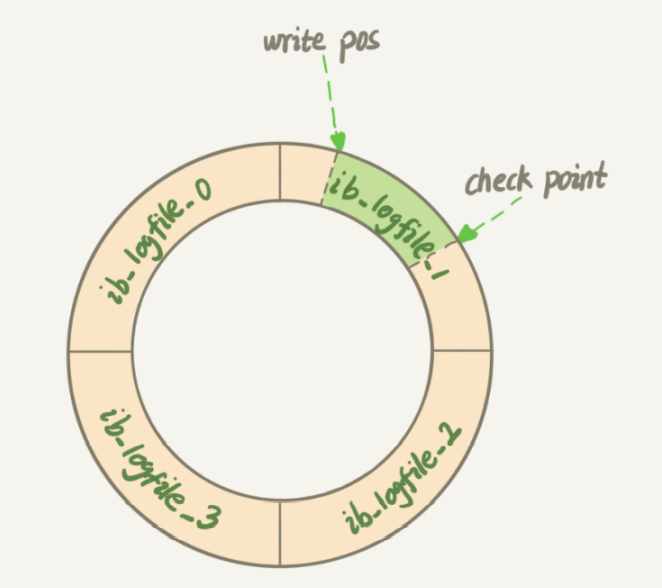

# 数据库笔记

[TOC]

[BV1X64y1x7HT - over](https://www.bilibili.com/video/BV1X64y1x7HT)

锁+主从复制等

[BV1J5411A7ei](https://www.bilibili.com/video/BV1J5411A7ei)

[BV1eD4y1D7pR](https://www.bilibili.com/video/BV1eD4y1D7pR)

## MySQL架构

参考：[MySQL 性能优化](http://blog.timwang.top/2019/08/02/mysql/)


存储引擎：MyISAM, InnoDB，支持的引擎可以使用`show engines`查看。

数据库后缀名为`MYI` -> MyISAM，`ibd` -> InnoDB

| 存储引擎 | 优点                                                         | 缺点                                                         |
| :------- | :----------------------------------------------------------- | :----------------------------------------------------------- |
| InnoDB   | 5.5版本后MySQL默认数据库，支持事务，比MyISAM处理速度稍慢     | 非常复杂，性能较一些简单的引擎要差一点儿。空间占用比较多。   |
| MyISAM   | 高速引擎，拥有极高的插入，查询速度                           | 不支持事务，不支持行锁、崩溃后数据不容易修复                 |
| Archive  | 将数据压缩后存储，非常适合存储大量的独立的，作为历史记录的数据 | 只能进行插入和查询操作，非事务型                             |
| CSV      | 是基于CSV格式文件存储数据（应用于跨平台数据交换）            |                                                              |
| Memory   | 内存存储引擎，拥有极高的插入，更新和查询效率，适用于临时表   | 占用和数据量成正比的内存空间，只在内存上保存数据，意味着数据可能会丢失，并发能力低下。不支持BLOB或TEXT类型的列 |
| Falcon   | 一种新的存储引擎，支持事务处理，传言可能是InnoDB的替代者     |                                                              |

## SQL基础

### 普通查询语句

🔵普通查询：

```sql
select A,B,C,D from t1,t2,t3 where p;
```

🔵去重查询：

```sql
select distinct A,B,C,D from t1,t2,t3 where p;
```

🔵字符串运算：

`%` 匹配任意字符（`NULL`除外）， `_` 匹配一个字符

排序：

```sql
select A,B,C,D from t1,t2,t3 where p order by A desc, B asc;	-- 默认升序
```

🔵限制行数：

```sql
select A,B,C,D from t1,t2,t3 where p limit m,n;	-- 查询从第m行开始的n行数据
select A,B,C,D from t1,t2,t3 where p limit n offset m;
-- 注意 limit 1,1 为第二行
```

🔵范围值查询：

```sql
select * from customer where age between 10 and 20;
```

🔵空值检查：

❗注意：判断空值不能使用`col = NULL`，而应该是`col is NULL`

```sql
select * from toys where price is NULL;
```

逻辑操作符：`OR` , `AND`, `NOT`

范围操作符：`IN`, `LIKE`

🔵正则表达式匹配：               

```sql
select * from customer where tel regexp ".*@qq\\.com";  -- 相当于like的正则表达式版
select * from customer where name binary regexp "Lisa[a-z]{1,3}";  -- 区分大小写的正则
```

🔵拼接字段：`concat()`

```sql
select concat(name,':', tel, '.') as info from customer where p
-- ———————
-- |   info   |
-- ———————
-- | John:53477.|
-- ———————
```

🔵其他字符串函数：

* 删除空格：两边空格`Trim(col)`，左边空格`LTrim(col)`，右边空格`RTrim(col)`
* 字母大小写：`Upper(col)` `Lower(col)`
* 返回字符串长度：`Length(col)`，对应长度为len的字符串`Substring(col, pos, len)`或者`Substring(col, pos)`，这里的`pos`从1开始是第一个字符。

🔵使用子查询

> 多个select语句嵌套

举例：

```sql
select a from t1 where b in (select b from t2 where c = 'x'); -- 子查询过滤
select a (select count(*) from t2 where t1.a = t2.a) from t1; -- 子查询字段
```

**列必须匹配**：外围`where`语句中的列数目必须要和子查询中选择的列要相同，类型要兼容。

🔵组合查询：

> 俗称交、并、差（MySQL不直接支持后两种）

并（`union`, `union all`）：

```sql
select a, b from t1 union select a, b from t2;		-- 自动去重
select a, b from t1 union all select a, b from t2;	-- 不去重
```

交：

```sql
select a, b from t1 inner join t2 using (a, b);		-- 保证这n列的内容相同即可
-- 等价于
select a, b from t1 inner join t2 on t1.a = t2.a and t1.b = t2.b;
```

差：

```sql
select a, b from t1 left join t2 using (a,b) where t2.col is NULL; -- a-b
```

### 聚集过滤

常见的聚集函数`MAX()` `MIN()` `AVG()` `SUM()`，都不将`NULL`值记录在内，`count(col)`也会忽略`NULL`值，`count(*)`除外。

分组过滤：

> 未出现在`group by`子句中的属性，在select子句中必须由聚集函数包围。

```sql
select age, avg(b) from users group by age;	-- 字段b被聚集函数包围
select age, avg(b) from users group by age having age > 20;  -- group by 字段要使用having过滤
select age, avg(b) from users where b > 3 group by age having age > 20 order by age; 
```

> `group by`子句必须出现在`where`子句之后，在`order by`子句之前！`where...group by...order by...`
>
> * `where`是在分组前过滤，`having`是在分组后过滤。
>
> * `order by`是对输出后的结果进行排序，而`group by`不对数据进行排序。

### 表联结(join)

> 有时候联结要比子查询快得多

内部联结：

```sql
select * from users inner join commodity on user.id = commodity.id;
```

外部联结：

```sql
-- left outer join 可简写为 left join
select * from users left join commodity on user.id = commodity.id;
select * from users right join commodity on user.id = commodity.id;
-- 等价于using,但是using在会自动省略相同的列
select * from users right join commodity using(id);
```

### 更改数据(增删改)

insert：

```sql
insert into t1 values (NULL, 'a', 1, true); 	-- 方便但不安全，不能保证表结构改变后也是这个次序
insert into t1 (name, age, is_married) values ('a', 1, true);	-- 安全明确但繁琐
-- 一般不要使用没有明确列的insert的语句
```

insert插入多值：

```sql
-- 单条insert多数据插入要比多个单数据insert效率高
insert into t1 (name, age, is_married) values ('a', 1, true),
											 ('b', 2, false),
											 ('c', 3, false);
-- insert与select配合
insert into t1 (a, b, c) select (d, e, f) from t2 where p;
```

update:

```sql
update t1 set col='a' where p;
update ignore t1 set col='a' where p;	-- update过程中发生错误也继续执行。
-- update 支持case结构
update user set balance = case
    when age < 21 then balance + 100000
    when age >= 21 then balance * 2
    else balance + 9.99
    end
```

delete:

```sql
delete from t1 where p;
truncate t1;			-- 清空；实际上是删除表再重新创建一个表
```

### 创建和操作表

创建：

```sql
create table if not exists t1(
    id int not null auto_increment,									-- 设置自增
    name varchar(255) not null,
    age int not null check (age > 0),								-- 设置check语句
    vendor_id int not null,
    quantity int not null default 1,
    has_commodity bool null,										-- 可空
    update_time timestamp not null default CURRENT_TIMESTAMP,		 -- 设置默认值
   	primary key(id),												-- 设置主键
   	constraint vid_fk foreign key (vendor_id) references t2(id)		 -- 设置外键
   	index(name)														-- 设置索引
)engine=innodb charset=utf8mb4 comment 't1 commment';				 -- 设置引擎和字符编码
```

更改表结构：

可参考：[MySQL ALTER TABLE Statement](https://dev.mysql.com/doc/refman/8.0/en/alter-table.html)

```sql
alter table t2 rename r1;										-- 重命名表
alter table t1 add name varchar(255);							-- 增加一列
alter table t1 drop column name;								-- 删除一列
-- modify 列名 类型， change 旧列名 新列名 类型
alter table t1 modify name varchar(128), change age years int; 	-- 更改列类型
alter table t1 add primary key (id);							-- 添加主键
alter table t1 drop primary key;								-- 删除主键
alter table t1 add index(name),add unique(card_id);				-- 添加普通索引和唯一索引
alter table t1 drop index name									-- 删除索引;
-- 添加外键
alter table t1 add constraint vid_fk foreign key(vid) references vendor(id) on delete [options];
alter table t1 drop constraint vid_fk;							-- 删除外键
```

删除表：

```sql
drop table t1;
```

重命名表：

```sql
rename table t1 to t2;
```

### 约束

🔵check子句：

```sql
create table if not exists t1(
    id int not null auto_increment,									-- 设置自增
    name varchar(255) not null,
    age int not null check (age > 0)								-- 设置check语句
)engine=innodb charset=utf8mb4;		
```

🔵外键约束：

```sql
alter table t1 add constraint vid_fk foreign key(vid) references vendor(id) on delete [options];
```

这里的options包含：（MySQL默认为`restrict`或者`no action`）

* `cascade`：父表update/delete记录时，同步update/delete掉子表的匹配记录 
* `set null`：父表update/delete记录时，将子表上匹配记录的列设为null (子表外键列不为not null)  
* `no action`：如果子表中有匹配的记录，停止对父表对应候选键进行update/delete操作 
* `restrict`：同no action, 都是立即检查外键约束

### 视图

优点：

* 重用SQL语句，简化复杂的SQL操作。
* 使用表的一部分数据，而不是整个表，可以保护数据。

操作视图：

```sql
-- 创建视图
create view uc_view as select * from users inner join commodity on user.id = commodity.id;
drop view uc_view;									-- 删除视图
create or replace view uc_view as select ...;		-- 不存在则创建，存在则替换
show create view uc_view;							-- 展示视图
```

查询操作类似普通表的查询。

> 视图一般用于检索，不用于增删改。

### 存储过程

> 相当于函数，以后再填坑

### 触发器

使用场景：

* 检查用户电话格式是否正确，地址字符是否大写
* 每订购一个产品，从仓库中减少一个产品
* 删除用户时，再存档表中增加一个记录等

支持触发器的语句：`update`, `insert`, `delete`

创建触发器的4个条件：

* 唯一的触发器名字
* 触发器关联的表
* 触发器响应的活动`update`, `insert`, `delete`
* 触发器执行的时机`before`, `after`

> 每个表最多支持6个触发器，

```sql
-- 创建触发器, 在插入表t1之后显示当前时间
create trigger insert_trigger after insert on t1 for each row select now() into @param;
select @param;		-- 显示insert记录后的结构,MySQL5之后不允许返回结果集
-- 删除触发器
drop trigger insert_trigger
-- 使用begin end包围
create trigger del_trigger before delete on orders o for each row
begin
	insert into archives(name, age, balance) values (o.name, o.age, o.balance)
end;
-- before update
create trigger up_tri before update on orders o for each row set o.name = Upper(o.name);
```

### 全局变量

```sql
show character set;							-- 展示支持的所有字符
show variables like 'character%';			-- 查看默认的字符集

show global status like "Innodb_page_size"	-- 查看数据库B+树节点支持的大小
show variables like 'autocommit';			-- 是看是否提交事务
show engine innodb status;					-- 可以查看锁的状态
select @@transaction_isolation;				-- 查看数据库当前隔离级别
```

### 账户安全管理

🔵查看当前数据库的所有用户：

```sql
use mysql;
select user from user;
```

🔵操作用户：

```sql
create user 'jack'@'host' identified by 'passwd';		-- 创建用户, % 表示可以任意主机
drop user jack;										   -- 删除用户
```

🔵授权：

```sql
show grants for root;							-- 查看授权给root的信息
grant select on demo_db.demo_table to jack;		-- 授予jack在demo_db数据库demo_table上查询权限
grant all on demo_db.* to 'jack'@'%';			-- 授予jack在demo_db数据库上所有权限
grant all on *.* to 'jack'@'%';					-- 授予jack所有权限
revoke all on *.* f 'jack'@'%';				-- 撤销jack所有权限
SET PASSWORD FOR 'username'@'host' = PASSWORD('newpassword');	-- 更改用户密码
```

### 导入与导出

🔵导入sql文件：

```sql
mysql -uroot -p -D customer < userinfo.sql		-- 向customer数据库导入表名为userinfo的数据
```

🔵导入csv：

```sql
load data infile '/usr/local/user.csv' 	-- CSV文件存放路径
into table student							-- 要将数据导入的表名
fields terminated by ',' optionally enclosed by '"' escaped by '"'
lines terminated by '\r\n';
```

## 执行计划

explain关键字。

```sql
explain select * from user;
```

输出：

[EXPLAIN Output Format](https://dev.mysql.com/doc/refman/8.0/en/explain-output.html#explain-join-types)

```
id, select_type, `table`, partitions, type,  possible_keys, `key`, key_len, ref, rows, filtered, Extra
1, 'SIMPLE',     'user',  null,       'ALL', null,           null, null,    null, 3,   100,  null
```

`type`：具体的值可以是`system`, `const`, `ref`, `range`, `index`, `all`。从左到右效率逐次降低。`all`代表全表扫描，效率很低，要避免出现`all`。

`key`：选择使用到的索引。

`Extra`：其他的关键信息。

## 索引


索引和实际的数据都是存储在磁盘中，在进行数据读取的时候会优先将索引读取到内存当中。

导入数据的时候不应该使用索引，应用所有数据索引的总时间 < 导入每行数据分别进行添加索引总时间

### 数据结构

索引的数据结构：二叉树、红黑树、Hash表、B树、**B+树**。

🔵B树与B+树的对比：

* B树是从上到下构建树的，B+树是从下到上构建树的
* B+树的叶子节点包含所有的数据信息，支持顺序读取。
* B+树的非叶子节点只存储其子树中的最大值，因此B+树在相同大小的磁盘中能存储更多的索引。
* B+树方便取出某个范围的数据，而B树不方便。

非B树存储当数据变多的时候树会变得非常高。

hash表无法进行范围查询，否则要进行挨个查询。

为什么使用B+树而不使用B树？

* B+树的磁盘读写代价更小。B+树的内部节点并没有指向关键字具体信息的指针，因此其内部节点相对B树更小，通常B+树矮更胖，高度小查询产生的I/O更少。
* B+树查询效率更高。B+树使用双向链表串连所有叶子节点，区间查询效率更高（因为所有数据都在B+树的叶子节点，扫描数据库 只需扫一遍叶子结点就行了），但是B树则需要通过中序遍历才能完成查询范围的查找。
* B+树查询效率更稳定。B+树每次都必须查询到叶子节点才能找到数据，而B树查询的数据可能不在叶子节点，也可能在，这样就会造成查询的效率的不稳定。

如果B+树3-4层都存储满索引，数据量起码有千万级。

MySQL中的B+树索引：

* 非叶子节点不存储data，只存储索引。
* 叶子节点包含索引字段和data

查看mysql中innodb叶节点数量大小：`show global status like "Innodb_page_size"`

查看对应表中的索引：`show index from <table>`

### 聚簇索引和非聚簇索引

- 聚簇索引：数据是和索引存放在一起的，找到索引也就找到了数据。主键索引的叶节点存储的是行数据，二级索引的叶节点存放的是对于存储行的主键值。

  当使用二级索引查找数据的时候，查找到叶节点拿到对应行的主键索引，再通过主键索引查找对应的行(**回表**)

- 非聚簇索引：将数据存储于索引分开结构，索引结构的叶子节点指向了数据的对应行，myisam通过key_buffer把索引先缓存到内存中，当需要访问数据时（通过索引访问数据），在内存中直接搜索索引，然后通过索引找到磁盘相应数据，这也就是为什么索引不在key buffer命中时，速度慢的原因


### 回表、索引覆盖、最左匹配、索引下推

* **回表**：

  id, name, age, gender. 其中id为自增主键索引，name为普通索引。

  `select * from user where name = "john"`。这个表有两个B+树。首先根据name查其B+树得到对应主键id值，在根据id值查询id对应的B+树来检索对应的数据记录，这个过程叫做回表。**尽可能避免回表操作**。`select id from user where name = "john"`，无需回表。

* **索引覆盖**：

  > 更简单理解就是：使用二级索引查询的时候，想要查询的恰好是主键，因此无需回表，这是索引覆盖。

  `select id, name from user where name = "john"`。此操作根据name的值去查询name对应的B+树，能获取到id的值，不需要获取到所有列的值，因此不需要回表，这个过程叫做索引覆盖。使用`explain`会有`using index`的提示，**推荐使用**。

  在某些场景中，可以考虑将所有的列变成组合索引，就无需回表，加快查询速度。

  `select id, name, age from user where name = "john"` 则需要回表。

* **最左匹配：**

  首先解释一下**组合索引**或者**联合索引**：可以选择多个列来共同组成索引，但是要遵循最左匹配原则。

  

  比如对于联合索引 (a,b,c)，其中只有 a | a,b | a,b,c 使用查询索引才会生效。对于 b | c | b, c 这种是不会生效的。

  id, name, age, gender. id为自增主键索引，name， age为联合索引。

  `select * from user where name = "john" and age = 12`		->   会走组合索引

  `select * from user where name = "john"`								->   会走组合索引

  `select * from user where age = 12`										->   不会走组合索引

  `select * from user where age = 12 and name = "john"`		->   会走组合索引，mysql自动优化顺序

* **索引下推**：

  `select * from user where name = "john" and age = 12`

  无索引下推：先根据name过滤并将数据拉取到server层，如何在server层对age进行过滤。

  有索引下推：直接根据两个条件进行过滤，筛选后再返回server层。

### 如何回答优化问题：

1. 加索引
2. 看执行计划`explain`语句
3. 优化sql语句，减少回表，增加索引覆盖，满足最左匹配等问题
4. 分库分表
5. 表结构设计优化

> "在实习或项目过程中做个一段sql优化，一般优化并不是出了问题才进行优化，在进行数据库建模或者数据库设计的时候要预先考虑到一些问题，比如字段的类型，字段的长度等，要创建合适的索引；在发生SQL问题的时候，还需要对SQL语句进行性能监控，观察他的执行计划，索引的创建和维护，SQL语句的调整、参数的设置多方面考虑"， 结合实际进行表达灵活变化。

## 事务，锁，MVCC

```sql
-- 查看事务是否自动提交
show variables like 'autocommit';

-- 设置是否自动提交
set autocommit = 0;		-- 0表示off，1表示on
```

### 事务

<h4>四个特性(ACID)：</h4>

可参考：[深入学习MySQL事务：ACID特性的实现原理](https://www.cnblogs.com/kismetv/p/10331633.html)

🔵原子性（Atomic）：即指事务是一个不可分割的单位，其中的操作要么全部执行，要么就都不执行。其实现是基于undolog(有了undo就能够回滚)。

🔵一致性（Consistency）：数据库的完整性约束没有被破坏，事务执行前后都是合法的数据状态。其实现是**基于其他三个特性**。

🔵隔离性（Isolation）：保证事务的执行尽量不受其他事务的影响。其实现是基于锁机制和MVCC。

🔵持久性（Durability）：证事务提交之后不会因为宕机等其他因素的影响而导致数据丢失。由redolog实现，二阶段提交，WAL(write ahead log)，先写日志，再写数据。

### 并发事务的四个问题：

[并发事务带来的问题](https://www.cnblogs.com/xzsj/p/xzsj-database-transaction.html)

* 丢失数据（Lost to modify）

  指在一个事务读取一个数据时，另外一个事务也访问了该数据，那么在第一个事务中修改了这个数据后，第二个事务也修改了这个数据。这样第一个事务内的修改结果就被丢失，因此称为丢失修改。 例如：事务1读取某表中的数据A=20，事务2也读取A=20，事务1修改A=A-1，事务2也修改A=A-1，最终结果A=19，事务1的修改被丢失。

* 脏读（dirty read）

  当一个事务正在访问数据并且对数据进行了修改，而这种修改还没有提交到数据库中，这时另外一个事务也访问了这个数据，然后使用了这个数据。因为这个数据是还没有提交的数据，那么另外一个事务读到的这个数据是“脏数据”，依据“脏数据”所做的操作可能是不正确的。

  |                    Session-1(RU)                     |              Session-2(RR)              |
  | :--------------------------------------------------: | :-------------------------------------: |
  | begin;<br/>select salary from t1 where id = 1;(5000) |                                         |
  |                                                      | update t1 set salary=4500 where id = 1; |
  |      ❌select salary from t1 where id = 1;(4500)      |                                         |
  |                                                      |                rollback;                |
  |      select salary from t1 where id = 1;(5000)       |                                         |

  处于Read-Uncommited模式下的会话一会出现脏读的情况。

* 不可重复读（unrepeatable read）

  指在一个事务内多次读同一数据。在这个事务还没有结束时，另一个事务也访问该数据。那么，在第一个事务中的两次读数据之间，由于第二个事务的修改导致第一个事务两次读取的数据可能不太一样。**这就发生了在一个事务内两次读到的数据是不一样的情况**，因此称为不可重复读。

  在RC隔离机制下，每次在进行快照读(select)的时候每次都会生成新的readview，在RR隔离机制下，只有第一次读的时候才会生成新的readview，来避免不可重复读的问题。

  |                    Session-1(RC)                     |              Session-2(RR)              |
  | :--------------------------------------------------: | :-------------------------------------: |
  | begin;<br/>select salary from t1 where id = 1;(5000) |                                         |
  |                                                      | update t1 set salary=4500 where id = 1; |
  |      select salary from t1 where id = 1;(5000)       |                                         |
  |                                                      |                 commit;                 |
  |      ❌select salary from t1 where id = 1;(4500)      |                                         |
  |                       commit;                        |                                         |

* 幻读（phantom read）

  幻读与不可重复读类似。它发生在一个事务（T1）读取了几行数据，接着另一个并发事务（T2）插入了一些数据时。在随后的查询中，可能使用到了`insert` `delete` `update`语句更新了readview，第一个事务（T1）就会发现多了一些原本不存在的记录，就好像发生了幻觉一样，所以称为幻读。

  解决方法：添加表锁。

总结：

|     隔离级别     | 脏读 | 不可重复读 | 幻读 |
| :--------------: | :--: | :--------: | :--: |
| READ-UNCOMMITTED |  √   |     √      |  √   |
|  READ-COMMITTED  |  ×   |     √      |  √   |
| REPEATABLE-READ  |  ×   |     ×      |  √   |
|   SERIALIZABLE   |  ×   |     ×      |  ×   |

### 锁：

MySQL中锁大致可以分为全局锁、表锁和行锁三类。

* 全局锁：全局锁即对整个数据库实例加锁。使用命令 `flush tables with read lock`，就可以将整个数据库处于只读状态，使用全局锁的典型场景就是做全库逻辑备份。

* 表锁：MySQL 中有表级别的锁有两种：表锁和元数据锁(meta data lock, MDL)。

  表锁的语法是 `lock tables t1 read/write`，可以使用 `unlock tables` 主动释放锁。

  MDL 锁(MySQL 5.5 之后)不需要显式调用，在访问一个表的时候会自动被加上。当对表进行增删改查的时候加 MDL 读锁，党对表的结构进行变更的时候加 MDL 读锁。MDL锁即用来保证表结构的一致性。

* 行锁：并不是所有引擎都支持行锁（不如 MyISAM），在 InnoDB 事务中，行锁是在需要的时候才加上，当代事务结束才释放，也是两阶段锁协议。

```sql
show engine innodb status;	-- 可以查看锁的状态
```

分类：从对数据操作粒度上可分为表锁和行锁，从操作类型上可分为读锁（共享锁）和写锁（排他锁）。

🔵InnoDB行锁

对于update，delete，insert语句，innoDB会自动添加排他锁，普通select语句不会，可以使用以下语句加锁。

```sql
-- 共享锁
select * from t1 where col = 'condition' lock in share mode;
-- 排他锁
select * from t1 where col = 'condition' for update;
```

🔵行锁升级为表锁

```sql
-- 假定name为varchar类型，但是这里的1996为数字类型，会导致索引失效，行锁升级为表锁。
update t1 set age = 20 where name = 1996;
```

🔵间隙锁的影响

当使用范围条件查询而不是相等条件进行查询的时候，在请求共享或排他锁同时，innoDB会对符合条件的数据进行加锁，对于键值在条件范围内但不存在的记录，叫做“间隙”，InnoDB也会对这个间隙加锁，即间隙锁（next-key锁）

|              session-1               |                  session-2                  |
| :----------------------------------: | :-----------------------------------------: |
|          set autocommit=0;           |              set autocommit=0;              |
| update t1 set name="Q" where id < 4; |                                             |
|                                      | insert into t1 (id, name)values(2, "ring"); |
|               commit;                |                                             |

对于session-2中的`insert`语句中，其id<4，满足session1中间隙的条件，因此会阻塞直至session-1提交。

🔵查看InnoDB行锁的争用情况

`show status like 'innodb_row_lock%'`

```sh
mysql> show status like "innodb_row_lock%";
+-------------------------------+-------+
| Variable_name             | Value |
+-------------------------------+-------+
| Innodb_row_lock_current_waits | 0		|		# 当前为等待行锁的数量
| Innodb_row_lock_time			| 0		|		# 总锁定时长
| Innodb_row_lock_time_avg		| 0		|		# 每次等待平均时长
| Innodb_row_lock_time_max		| 0		|
| Innodb_row_lock_waits			| 0		|		# 系统启动后一共等待的次数
+-------------------------------+-------+
5 rows in set (0.00 sec)
```

🔵死锁以及死锁检测


出现死锁后的两种策略：

1. 等待直到超时，可以通过参数：`innodb_lock_wait_timeout` 进行设置，默认值 50s。
2. 死锁检测后主动回滚死锁链条中的一个事务。设置参数 `innodb_deadlock_detect` 表示开启这个逻辑。

一般情况下，使用第一种策略的等待时间是很难决定的，因此正常情况下通常采用第二种策略。

### MVCC

> Multi-Version Concurrency Control(多版本并发控制). 围绕InnoDB展开，不支持MyISAM。为了在并发控制的情况提高读写效率。

**当前读**：读取到的数据总是最新的数据。

什么时候会触发当前读？

```sql
select * from user lock in share mode;			-- select ... lock in share mode
select * from user for update;				    -- select ... for update
update ...
delete ...
insert ...
```

**快照读**：读取到的是历史版本的记录。

什么时候会触发快照读？

```sql
select ...   -- 朴素select语句
```

<h4>mvcc的组成部分</h4>

1. 隐藏字段：每一行的字段上都有用户不可见的字段

   * `DB_TRX_ID`：创建或者最后一次修改该记录的事务ID
   * `DB_ROW_ID`：即为隐藏主键，6字节的row id。
   * `DB_ROLL_PTR`：事务回滚指针，事务失败的话需要回滚到上一个历史记录，需要配合`undolog`使用。

   | name | age  | gender | DB_TRX_ID | DB_ROW_ID | DB_ROLL_PTR |
   | :--: | :--: | :----: | :-------: | :-------: | :---------: |
   | john |  18  | female |     1     |     1     |    null     |

   

2. undolog(回滚日志)

   如果使用update语句，会将更改的数据保存到undolog中。一个undolog会存储多个历史记录，多个事务对同一条事务进行处理的时候，会形成一个历史记录链表。

   问题：当有多个历史记录的时候，可重复读读取的是哪一个历史记录？

3. readview(读视图)

   事务在进行快照读的时候产生的读视图。

   其包含几个组件：

   * `trx_list`：系统活跃的事务ID
   * `up_limit_id`：列表中事务最小的ID
   * `low_limit_id`：系统尚未分配的下一个事务ID

   **举例：**
   情况1：

   | 事务1  | 事务2   |          事务3          |
   | :----: | :----: | :---------------------: |
   | begin; | begin; |         begin;          |
   |        |        | update ...;<br/>commit; |
   |        | 快照读 |                         |

   情况2：

   | 事务1  | 事务2   |          事务3          |
   | :----: | :----: | :---------------------: |
   | begin; | begin;<br/>快照读 |         begin;          |
   |        |        | update ...;<br/>commit; |
   |        | 快照读 |                         |

   **问题**：在RR隔离级别下，这两种情况下是否能读到最新的值？

   **readview生成时机**：

   * 在RC隔离机制下，每次在进行快照读的时候每次都会生成新的readview。
   * 在RR隔离机制下，只有第一次读的时候才会生成新的readview。

   **可见性原则算法**：

   > 当进行快照读的时候

   1. 如果`DB_TRX_ID` < `up_limit_id`， 则表示当前事务在此记录的事务发生之后开启，`DB_TRX_ID`所在记录当然对当前事务可见，如果大于等于进入下一步；
   2. 如果`DB_TRX_ID` > `low_limit_id`，则表示当前事务还发生在此记录所提交的事务之前，`DB_TRX_ID`所在的记录在`readview`生成之后才出现的，那么对当前事务不可见，如果小于进入下一步
   3. 判断`DB_TRX_ID`是否仍在活跃事务中，如果在，则表示还在`readview`的生成时刻，还没有commit，修改的数据当前事务是不可见的，如果事务在`readview`生成之前`commit`是可见的，生成之后不可见。

   分析：

   * 当前`trx_list`为事务`1, 2`，`up_limit_id`为`1`，`low_limit_id`为`4`（因为事务3已经提交）
   * 所修改记录对应的隐藏字段`DB_TRX_ID`值为`3`。
   * 因此在情况1下是可以读取到最新值，在情况2下不可以读到最新值。

   > 如果事务中存在一次当前读的时候，下一次再进行快照读的时候会更新readview。这个现象叫“幻读”，在RR事务中需要配合间隙锁来解决幻读的问题。

### 隔离级别

参考：

[彻底搞懂 MySQL 事务的隔离级别 - 阿里云社区](https://developer.aliyun.com/article/743691)

[Innodb中的事务隔离级别和锁的关系 - 美团技术团队](https://tech.meituan.com/2014/08/20/innodb-lock.html)

>MySQL的事务隔离级别一共有四个，分别是读未提交(RU, read uncommitted)、读已提交(RC, read committed)、可重复读(RR, repeatable read)以及可串行化(Serializable)。
>
>MySQL的隔离级别的作用就是让事务之间互相隔离，互不影响，这样可以保证事务的一致性。

隔离级别比较与对性能的影响：可串行化>可重复读>读已提交>读未提交

MySQL默认的事务隔离级别是RR可重复读。

查看MySQL的事务级别：`select @@transaction_isolation;`

* READ-UNCOMMITTED(读取未提交)： 最低的隔离级别，允许读取尚未提交的数据变更，可能会导致脏读、幻读或不可重复读。
* READ-COMMITTED(读取已提交)： 只允许读取并发事务已经提交的数据，可以阻止脏读，但是幻读或不可重复读仍有可能发生。
* REPEATABLE-READ(可重复读)： 对同一字段的多次读取结果都是一致的，除非数据是被本身事务自己所修改，可以阻止脏读和不可重复读，但幻读仍有可能发生。
* SERIALIZABLE(可串行化)： 最高的隔离级别，完全服从ACID的隔离级别。所有的事务依次逐个执行，这样事务之间就完全不可能产生干扰，也就是说，该级别可以防止脏读、不可重复读以及幻读。

## MySQL 进阶

### 1. 一条SQL查询语句是如何执行的


注意：MySQL 8 之后将其中的查询缓存模块删除。

其实就是考察对MySQL整体架构的了解。

在当客户端连接到数据库的时候，首先到查询缓存中查找是否命中，之前的查询结果会以 K-V 对的形式缓存在内存中，如果命中直接返回客户端。在MySQL 8.0 之前的话会查询缓存的流程，8.0 之后就没有查询缓存这个模块了。如果没有命中缓存，就开始真正执行SQL语句了，首先会经过分析器，来对SQL语句进行词法分析，查看SQL语句中是否有语句错误；经过分析器之后会进入优化器，分析SQL语句的执行逻辑和执行效率，选择一个较优的执行方案；经过优化器之后进入SQL语句执行器，开始执行的时候会判断该用户是否有对应的执行权限，如果有权限，执行器就会根据这个表的引擎定义，调用对应的存储引擎接口，最终返回SQL语句执行的结果。

### 2. 一条SQL更新语句是怎么执行的

参考：

1. [必须了解的mysql三大日志-binlog、redo log和undo log](https://segmentfault.com/a/1190000023827696)

对于SQL更新语句来说，查询语句走过的流程更新语句还是要走一遍，但是与之不同的是，更新流程还涉及两个重要的日志模块：redolog(重做日志) 和 binlog(归档日志)。

🔵重要的日志 redolog

redolog 是 InnoDB 引擎层特有的日志，记录的是**物理日志**（即SQL语句执行后的结果）。

在MySQL中更新操作存在一个问题，如果每一次更新操作都写进磁盘，首先磁盘要找到对应的那条记录然后在更新，整个过程中IO成本和查找成本都很高，为了解决这个问题，MySQL 的设计者使用了 WAL(write-Ahead logging) 技术，技术关键就是**先写日志，再写磁盘**。

redolog 包括两部分：内存中的日志缓存(redolog cache)和磁盘上的日志文件(redolog file)，向将记录写入到缓冲区，后续某个时机写入磁盘。具体来说，当更新一条记录的时候，InnoDB引擎首先会将记录写至redolog中并且更新内存缓存，这个时候就算更新完成了，同时 InnoDB 引擎会在系统比较空闲的时候将这个操作记录更新到磁盘中。

❓redolog 何时将缓存刷盘？

用户空间的缓冲区是无法直接写入磁盘的，中间必须经过操作系统的内核空间缓冲区(OS buffer)。因此 redolog buffer 刷盘的过程是先将 redolog buffer 写入 os buffer，然后通过系统调用 fsync() 将其刷到 redolog file。


redolog buffer 写入 redolog file的时机可以通过 `innodb_flush_log_at_trx_commit ` 参数进行配置：

* 0（延时写）：事务提交时不会立即将 redolog buffer 写入到 os buffer，而是每秒写入 os buffer 并且调用 fsync() 写入到 redolog file 中。系统崩溃的时候只会丢失 1s 的数据。
* 1（实时写，实时刷）：每次提交都会将 redolog buffer -> os buffer -> redolog file。即使系统崩溃也不会丢失数据，但是 IO 性能较差。
* 2（实时写，延迟刷）：每次提交都仅进行 redolog buffer -> os buffer，然后每秒执行 os buffer -> redolog file。

❓ 如果 redolog 被写满了怎么办？

在 InnoDB 中 redolog 是大小固定的。假如配置了一组 4 个文件，每个文件大小是 1GB，那么 redolog 就可以记录 4 GB 的操作。如果 redolog 写满就不得不将部分redolog中的数据写入磁盘，然后才能继续更新。



其中 write pos 标识当前记录的位置，checkpoint 是当前擦除的位置，擦除记录前首先要将记录更新到磁盘文件。如果 write pos 之间还有空的部分，就表示还可以继续记录新的 redolog，否则就需要停止新的更新操作，将 redolog 中的数据同步到磁盘中，将 checkpoint 推进。

如果期间数据库发生异常崩溃，之间提交的记录也不会丢失，因此 MySQL 具有崩溃后保证数据安全(crash-safe)的能力。

🔵重要的日志 binlog

binlog 是 server 层的日志，用于记录数据库执行的写入性操作（不包括查询），以二进制的方式保存在磁盘中，记录的是**逻辑日志**（可以简单理解为就是sql语句）。

binlog 是通过追加的方式写入的，可以通过 `max_binlog_size` 参数设置每个 binlog 文件的大小，当大小达到给定值之后，会生成新的文件来保存日志。

❓为什么要有两个日志

最初 MySQL 并没有 InnoDB 引擎，最初的 MyISAM 引擎没有 crash-safe 能力，binlog 日志只能用于归档。

binlog 的使用场景：

1. 主从复制：在 Master 端开启 binlog，然后将 binlog 发送给各个 slave，slave 端重放 binlog 从而达到主从数据一致。
2. 数据恢复：通过使用 `mysqlbinlog` 工具来恢复数据。

binlog 的刷盘时机：

对于 innodb 引擎而言，只有在事务提交的时候才会记录 binlog，那么 什么时候将 binlog 刷盘呢？ MySQL通过控制参数 `sync_binlog` 控制刷盘时机，取值范围是 `0-N`:

* 0：不强制要求，由系统自行判断何时写入磁盘
* 1：每次 commit 的时候都要将 binlog 写入磁盘
* N：每 N 个事务提交，才会将 binlog 写入磁盘

binlog 的日志格式（通过参数 `binlog-format` 指定）：

* `STATEMENT`：即SQL语句，mysql 5.7.7 之前的默认选项
* `ROW`：基于行的复制，仅记录那条数据被修改了
* `MIXED`：上述两者的混合模式，`STETEMENT` 模式无法复制的操作使用 ROW 模式保存。

🔵redolog 和 binlog 的区别

|          | redolog                              | binlog                                          |
| -------- | ------------------------------------ | ----------------------------------------------- |
| 文件大小 | redolog 文件大小是固定的             | binlog 可以通过参数进行调整每个binlog文件的大小 |
| 实现方式 | InnoDB引擎层实现的                   | server 层实现的，所有引擎都可以使用             |
| 记录方式 | redolog 采用的是循环写的方式进行记录 | binlog 是通过追加的方式进行记录                 |
| 使用场景 | redolog 可以进行崩溃恢复             | binlog 用于主从复制和数据恢复                   |
| 记录内容 | redolog 记录的是物理日志             | binlog 记录的是逻辑日志                         |

🔵更新语句的执行流程

1. 执行器调用引擎接口找到 ID = 2 的一行。由于 ID 是主键，引擎直接用 B+ 树找到对应的行。如果 ID = 2 的行数据在内存中，直接返回给执行器，否则从磁盘读取到内存中再返回。
2. 执行器拿到引擎提供的数据之后，进行update执行。
3. 引擎将这行新数据更新到 redolog buffer中，此时 redolog 处于 prepare 状态，等待执行器完成后随时提交事务。
4. 执行器生成这个 binlog，并将 binlog 写入磁盘
5. 执行器调用引擎的提交事务接口，引擎将 redolog 状态改成提交状态，更新完成。


其中深色表示在执行器中执行，浅色表示在引擎中执行。

🔵两阶段提交

在进行更新语句写入 redolog 中时候，redolog 的状态分为 prepare 和 commit 状态，这就是两阶段提交。

为什么要进行两阶段提交？

假设如果不用两阶段提交：

* 如果先写 redolog 再写 binlog：如果在写 binlog 的时候系统崩溃，会出现重放redolog存在而重放binlog不存在的数据。
* 如果先写 binlog 再写 redolog：由于崩溃之后，redolog 中的这个事务无效，然后 binlog 中却存在这个数据，导致数据不一致。

如果使用两阶段提交，如果 binlog 中不存在对应的标识事务的 XID，redolog 就进行回滚，存在就进行提交。

### 3. 事务隔离级别的实现

参考：

1. [深入理解MySQL底层事务隔离级别的实现原理](https://cloud.tencent.com/developer/article/1892952)

`begin` 和 `start transaction with consistent snapshot` 的区别：

* 前者是当执行第一个操作SQL语句的时候才会启动事务，第一句快照读时生成一致性视图
* 后者是立马开启事务并且立即生成一致性视图

在 MySQL 中 每条记录在更新的时候都会同时记录一条回滚操作。事务每次开启之间，都会从数据库中获取一个自增长的事务 ID，可以根据事务 ID 判断事务执行的先后顺序。


基于 MVCC 查询一条记录的流程：

1. 获取事务自己的版本号
2. 获取到 read view
3. 查询得到的数据记录，比较记录事务 ID 与 read view 中事务 ID
4. 如果不符合 Read View 可见性原则，使用 Undolog 中的记录历史快照返回符合规则的数据

InnoDB 实现 MVCC 使用过 Read View + Undo Log 实现的，Undolog 保存了记录的历史快照，Read view 中可见性原则保证了当前版本数据是否可见。

在 RC 隔离级别下，每一次查询都会生成一个新的 read view，而在 RR 隔离级别下，只有第一次查询会生成 read view；对于更新操作**都**会更新 read view。

具体样例可以参考引用链接。

🔵隔离可见性原则：

1. 版本未提交，不可见； 
2. 版本已提交，但是是在视图创建后提交的，不可见
3. 版本已提交，而且是在视图创建前提交的，可见。

### 4. InnoDB索引

索引分类**主键索引**和**非主键索引**。每个字段索引都对应一个B+树，主键索引叶子节点中存储的是整行数据，而非主键索引叶子节点中存储的是主键的值，因此索引分为**聚簇索引**和**非聚簇索引**（二级索引）。

❓什么情况下适合使用业务字段做主键（KV 场景）

1. 只有一个索引
2. 且该索引是唯一索引

使用索引的时候需要考虑回表、索引覆盖、最左匹配以及索引下推的情况。

❓为什么需要重建索引

索引可能因为删除或者页分裂的原因导致数据页有空洞，重建索引的过程会创建新的索引，这样页面的利用率会更高，索引更加紧凑且省空间。

❓选择唯一索引还是普通索引

1. 查询：

   唯一索引和普通索引的查询性能差别基本不大，唯一索引在 B+ 树上查到一个结果就会返回，普通索引会一直查找满足条件的所有记录，即使数据在下一个数据页上，对于 CPU 来说也可以忽略不计。

2. 更新：

   当更新数据页的时候，如果数据页在内存中就可以直接更新；如果不在数据页中，InnoDB 会考虑首先将更新操作缓存在 change buffer 中，等到下次查询到这个数据页的时候再将 change buffer 中的数据更新到数据页中。将 change buffer 更新到数据页的过程叫做 merge，数据库进行正常关闭的时候也会进行 merge 操作。显然如果将更新操作记录在 change buffer 中会减少读磁盘并且执行速度会提高，可以提高内存利用率。change buffer 是使用 buffer pool 中的内存，可以通过 `innodb_change_buffer_max_size` 参数设置 change buffer 占用 buffer pool 的比例。

   如果更新目标不在内存中：

   * 对于唯一索引，首先需要将数据页读取到内存中，判断是否有冲突，然后决定插入记录。
   * 对于普通索引，将记录更新到 change buffer 中，完毕。

   很明显change buffer 减少了磁盘 io 。

因此建议在选择唯一索引和普通索引的时候，如果写多读少，还是尽量选择普通索引；如果业务更新模式是数据写入后马上进行查询，即使使用了 change buffer，查询的时候会立马 merge，这非但磁盘 io 次数不会减少，反而会增加 change buffer 访问的次数。

### 5. 数据库锁

❓如何安全的给表加字段


对于上图中的例子，Session A B 查询操作会给表 t 加入 MDL 读锁，因此 Session C 中该表表结构的操作需要阻塞等待执行完毕。轮到 Session C 执行后会将此表加入 MDL 写锁，之后的业务操作都会被阻塞，假如业务对于表 t 的查询频繁，查询超时后会一直进行重试，导致这个库的线程很快会爆掉。

解决此问题的就是需要解决长事务不提交就会一直占着 MDL 锁。可以考虑暂停 DDL 或者 kill 掉这个长事务。较为理想的机制是在 alter table 的时候设定等待的事件，如果在指定事件拿到 MDL 写锁就好，拿不到就不要阻塞后面的业务语句。之后通过重试命令重复这个操作。

```
ALTER TABLE tbl_name NOWAIT add column ...
ALTER TABLE tbl_name WAIT N add column ... 
```

🔵同一事务中语句不同的执行顺序也会影响性能

> 如果你的事务中需要锁多个行， 要把最可能造成锁冲突、最可能影响并发度的锁尽量往后放。

假设你负责实现一个电影票在线交易业务，顾客 A 要在影院 B 购买电影票。这个业务需要涉及到以下操作：

1. 从顾客 A 账户余额中扣除电影票价
2. 给影院 B 的账户余额增加这张电影票价
3. 记录一条交易日志。

如果同时有另外一个顾客 C 要在影院 B 买票，那么这两个事务冲突的部分就是语句 2 了。因为它们要更新同一个影院账户的余额，需要修改同一行数据。由于行锁都是在事务提交的时候才会释放，假如按照 312 的顺序那么影响影院账户余额的行锁事件就会表少，最大程度上减少了事务之间锁的等待，提高了并发度。

❓如何解决死锁导致的热点行性能问题

每个被事务锁住的线程，都要判断自己的加入会不会导致了死锁，这是 O(n) 的操作。假如有 1000 个并发线程同时更新一行，那么死锁检测操作就是 $O(n^2)$ 级别的，即使未检测出死锁也要耗费大量 CPU 资源，因此会看到 CPU 利用率很高但是处理不了几个事务。

如何解决：

1. 对于根本不会出现死锁的业务，可以临时把死锁检测关掉（有风险）。
2. 控制并发度，考虑中间件。
3. 将一行数据改成逻辑上的多行。以影院账户为例可以考虑余额放在多条记录上，影院的账户总额等于多个记录的值的总和。

## 其他

### 其他链接

[面试官:讲讲mysql表设计要注意啥? - 知乎](https://zhuanlan.zhihu.com/p/73260510)

[MySQL 面试题](https://www.jishuchi.com/read/mysql-interview/2791)

[大众点评订单系统分库分表实践](https://tech.meituan.com/2016/11/18/dianping-order-db-sharding.html)
