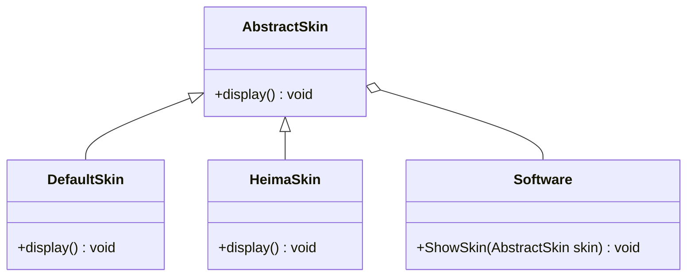

# 设计模式

2021.07.29 02:25

[TOC]

[设计模式之美](https://time.geekbang.org/column/intro/100039001) -> 对应资源 -> [BDPan: 密码6666](https://pan.baidu.com/s/1bSL6twuY3JGqkb66n09zAQ )

[Go设计模式24-总结](https://lailin.xyz/post/go-design-pattern.html)  [极客时间对于的go实现](https://github.com/mohuishou/go-design-pattern)

[BV1Np4y1z7BU](https://www.bilibili.com/video/BV1Np4y1z7BU) P10

## 初识

### 代码质量标准

1. 可维护性
2. 可读性
3. 可扩展性
4. 灵活性
5. 简洁性
6. 可复用性
7. 可测试性

### 设计模式类型

1. 创建型（5种）

  用于描述怎么创建对象，将对象的创建和使用分离。

  常用的有：单例模式、工厂模式（工厂方法和抽象工厂）、建造者模式。
  不常用的有：原型模式。

2. 结构型（7种）

    将类和对象按照某种布局组成更大的结构

    常用的有：代理模式、桥接模式、装饰者模式、适配器模式。
    不常用的有：门面模式、组合模式、享元模式。

3. 行为型（11种）

    描述类和对象之间怎么相互协作共同完成单独无法完成的任务。

    常用的有：观察者模式、模板模式、策略模式、职责链模式、迭代器模式、状态模式。
    不常用的有：访问者模式、备忘录模式、命令模式、解释器模式、中介模式。

### 类与类之间的关系

[类图语法](https://mermaid-js.github.io/mermaid/#/classDiagram)

1. 关联关系

   单向关联

   ```mermaid
   classDiagram
   	Customer <-- Address
   	Customer: +Address address
   	class Address{
   		+String country
   		+String province
   	}
   ```

   双向关联

   ```mermaid
   classDiagram
   	Customer <--> Product
   	Customer: +List~Product~ products
   	class Product{
   		+Customer customer
   	}
   ```

   自关联

   ```mermaid
   classDiagram
   	Node <-- Node
   	Node: +Node subNode

2. 聚合关系

   聚合关系表示，成员对象是整体对象的一部分，成员对象可以脱离整体对象而独立存在

   ```mermaid
   classDiagram
   	University o-- Teacher
   	University: -List~Teacher~ techs
   	Teacher: -String name
   	Teacher: +name() void
   ```

3. 组合关系

   是一种更强烈的聚合关系。整体对象可以控制部分对象的生命周期，部分对象不能脱离整体对象存在。

   (实心菱形表示)

   ```mermaid
   classDiagram
   	Head *-- Mouth
   	Head: +Mouth mouth
   ```

4. 依赖关系

   Driver的drive方法种使用到Car类，耦合度较低的

   ```mermaid
   classDiagram
   	Driver <.. Car
   	Car: +move() void
   	Driver: +String name
   	Driver: +drive(Car car) void
   ```

5. 继承关系

   耦合度最大的关系

   ```mermaid
   classDiagram
   	Animal <|-- Dog
   	Animal <|-- Cat
   ```

6. 实现关系

   ```mermaid
   classDiagram
   	Animal <|.. Dog
   	Animal <|.. Cat
   	Animal: +eat() void
   	Dog: +eat() void
   	Cat: +eat() void
   	<<interface>> Animal
   ```

## 软件设计原则

> 为了提高软件系统的可维护性和可复用性，增加可扩展性和灵活性。

### 开闭原则

**对扩展开放，对修改关闭。**

以输入法的皮肤为例：

`DefaultSkin`和`HeimaSkin`继承`AbstractSkin`，是继承关系。

`Software`来展示输入法的皮肤`ShowSkin()`，是聚合关系。



