# 设计模式

2021.07.29 02:25

[TOC]

[设计模式之美](https://time.geekbang.org/column/intro/100039001) -> 对应资源 -> [BDPan: 密码6666](https://pan.baidu.com/s/1bSL6twuY3JGqkb66n09zAQ )

[Go设计模式24-总结](https://lailin.xyz/post/go-design-pattern.html)  [极客时间对于的go实现](https://github.com/mohuishou/go-design-pattern)

[BV1Np4y1z7BU](https://www.bilibili.com/video/BV1Np4y1z7BU) P45

## 初识

### 代码质量标准

1. 可维护性
2. 可读性
3. 可扩展性
4. 灵活性
5. 简洁性
6. 可复用性
7. 可测试性

### 设计模式类型

1. 创建型（5种）

  用于描述怎么创建对象，将对象的创建和使用分离。

  常用的有：单例模式、工厂模式（工厂方法和抽象工厂）、建造者模式。
  不常用的有：原型模式。

2. 结构型（7种）

    将类和对象按照某种布局组成更大的结构

    常用的有：代理模式、桥接模式、装饰者模式、适配器模式。
    不常用的有：门面模式、组合模式、享元模式。

3. 行为型（11种）

    描述类和对象之间怎么相互协作共同完成单独无法完成的任务。

    常用的有：观察者模式、模板模式、策略模式、职责链模式、迭代器模式、状态模式。
    不常用的有：访问者模式、备忘录模式、命令模式、解释器模式、中介模式。

### 类与类之间的关系

[类图语法](https://mermaid-js.github.io/mermaid/#/classDiagram)

1. 关联关系

   单向关联

   ```mermaid
   classDiagram
   	Customer <-- Address
   	Customer: +Address address
   	class Address{
   		+String country
   		+String province
   	}
   ```

   双向关联

   ```mermaid
   classDiagram
   	Customer <--> Product
   	Customer: +List~Product~ products
   	class Product{
   		+Customer customer
   	}
   ```

   自关联

   ```mermaid
   classDiagram
   	Node <-- Node
   	Node: +Node subNode

2. 聚合关系

   聚合关系表示，成员对象是整体对象的一部分，成员对象可以脱离整体对象而独立存在

   ```mermaid
   classDiagram
   	University o-- Teacher
   	University: -List~Teacher~ techs
   	Teacher: -String name
   	Teacher: +name() void
   ```

3. 组合关系

   是一种更强烈的聚合关系。整体对象可以控制部分对象的生命周期，部分对象不能脱离整体对象存在。

   (实心菱形表示)

   ```mermaid
   classDiagram
   	Head *-- Mouth
   	Head: +Mouth mouth
   ```

4. 依赖关系

   Driver的drive方法种使用到Car类，耦合度较低的

   ```mermaid
   classDiagram
   	Driver <.. Car
   	Car: +move() void
   	Driver: +String name
   	Driver: +drive(Car car) void
   ```

5. 继承关系

   耦合度最大的关系

   ```mermaid
   classDiagram
   	Animal <|-- Dog
   	Animal <|-- Cat
   ```

6. 实现关系

   ```mermaid
   classDiagram
   	Animal <|.. Dog
   	Animal <|.. Cat
   	Animal: +eat() void
   	Dog: +eat() void
   	Cat: +eat() void
   	<<interface>> Animal
   ```

## 六大设计原则

> 为了提高软件系统的可维护性和可复用性，增加可扩展性和灵活性。

### 开闭原则

**对扩展开放，对修改关闭。**

以输入法的皮肤为例：

`DefaultSkin`和`HeimaSkin`继承`AbstractSkin`，是继承关系。

`Software`来展示输入法的皮肤`ShowSkin()`，是聚合关系。

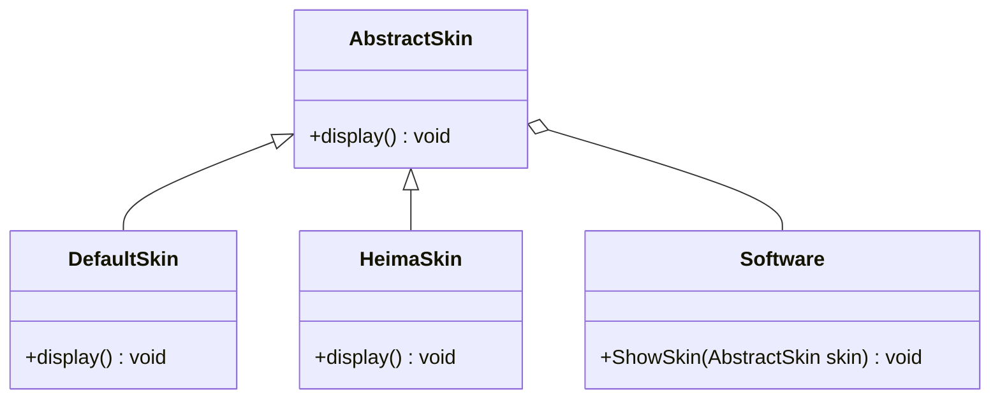

### 里氏代换原则

> 里氏代换原则(Liskov Substitution Principle LSP)
>
> 子类继承父类，尽量不要重写父类方法。

以正方形不是长方形为例

Square继承Rectangle，RectangleDemo依赖于Rectangle。

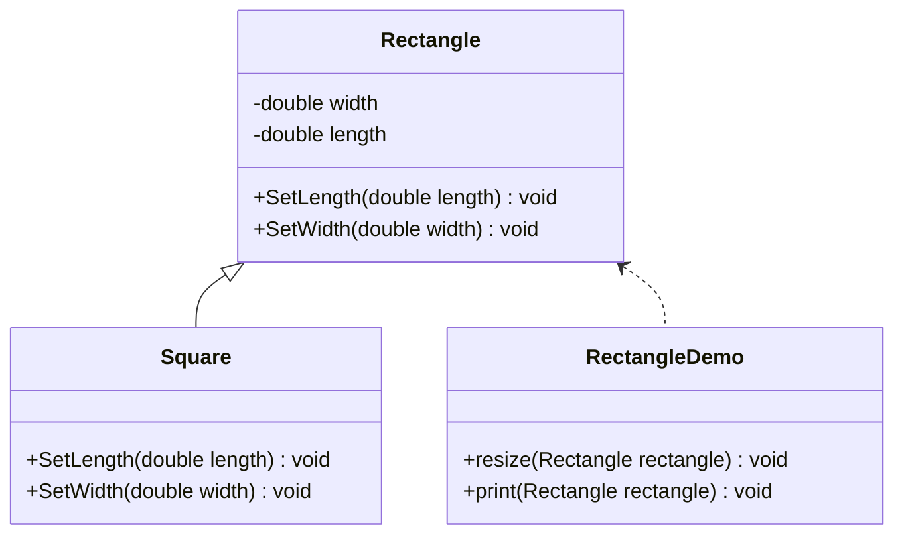

代码案例：

Rectangle类

```java
public class Rectangle {
    private double width;
    private double length;

    public double getWidth() { return width; }

    public void setWidth(double width) { this.width = width; }

    public double getLength() { return length; }

    public void setLength(double length) { this.length = length; }
}
```

Square类：

```java
public class Square extends Rectangle{
    @Override
    public void setWidth(double width) {
        super.setWidth(width);
        super.setLength(width);
    }

    @Override
    public void setLength(double length) {
        this.setWidth(length);
    }
}
```

Demo执行类

```java
public class RectangleDemo {
    // 里氏代换原则
    public static void main(String[] args) {
        Rectangle rectangle = new Rectangle();
        rectangle.setLength(10);
        rectangle.setWidth(20);
        resize(rectangle);
        print(rectangle);

        // New a Square
        System.out.println("===========");
        Square square = new Square();
        square.setWidth(15);
        resize(square);     // 这里会死循环
        print(square);
    }

    public static void resize(Rectangle rectangle){
        // 当才发现长小于宽时候伸长
        while (rectangle.getLength() <= rectangle.getWidth()){
            rectangle.setLength(rectangle.getLength() + 1);
        }
    }

    public static void print(Rectangle rectangle){
        System.out.println(rectangle.getWidth() + " " + rectangle.getLength());
    }
}
```

在这个案例中，对于长方形类使用resize方法是没有任何问题的，但是如果使用对于子类正方形使用`resize()`方法，就会出现问题，会对正方形的长和宽一同进行设置，导致死循环。因此在resize方法中，长方形的参数不能被正方形替换，所以`Rectangle`和`Square`类之间违反了里氏代换原则，继承关系不存在，因此正方形不是长方形。


因此需要重新设计程序，抽象出一个`Quadrilateral`四边形接口，让正方形和长方形实现此接口。

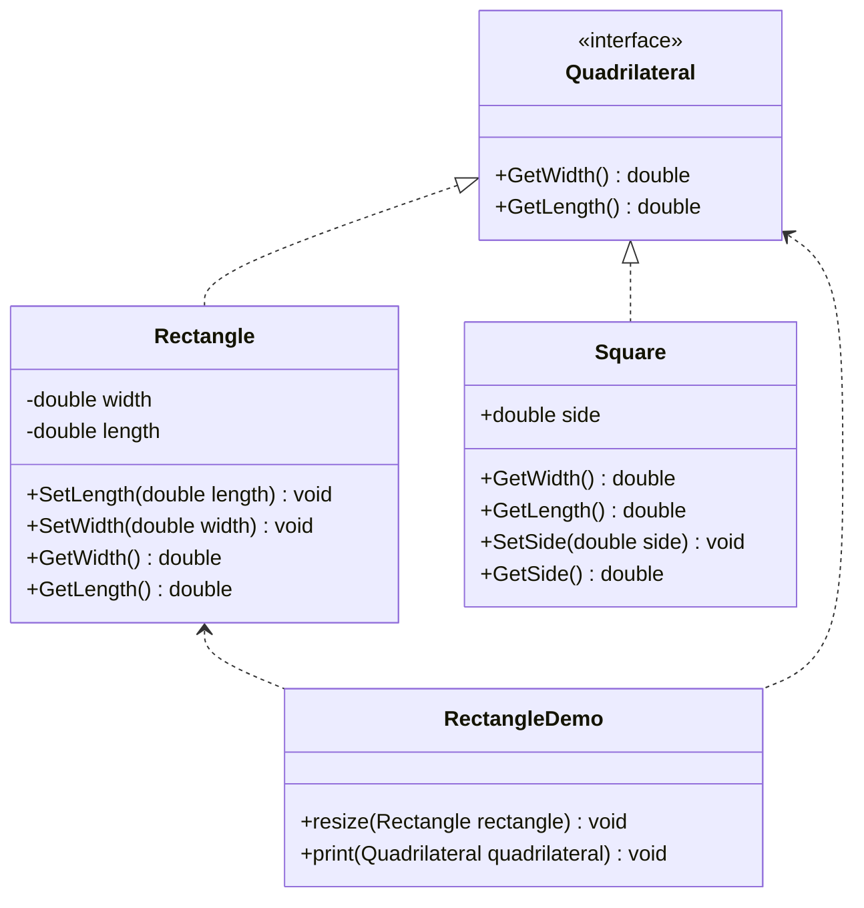

对于resize函数只对长方形生效。

### 依赖倒换原则

> 依赖倒换原则(Dependence Inversion Principle,DIP)
>
> 对抽象进行编程，而不是对实现进行编程。开闭原则的另一种实现。

举例：计算机的关系

其他配件与计算机都是关联关系。

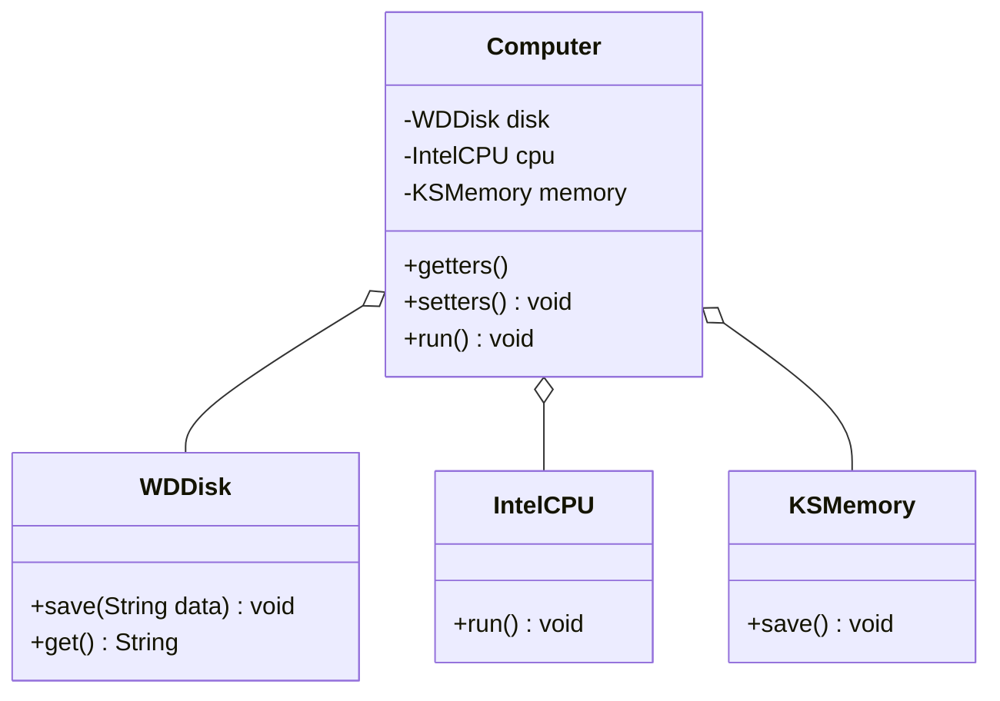

存在一个问题：就是用户不能自定义自己喜欢的配件，比如CPU想用AMD的，就还得修改代码。

因此需要重构代码，就硬盘、CPU、内存抽象成一个接口。

不同品牌的配件实现对应的接口。

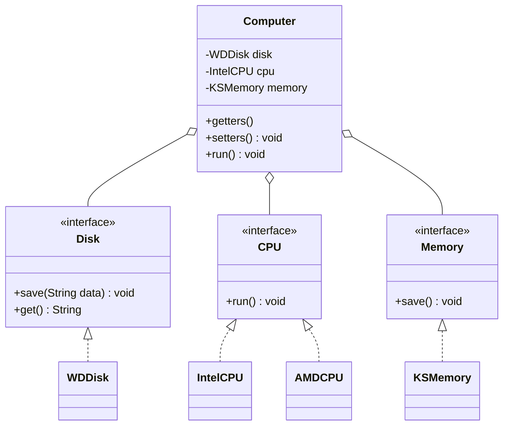

### 接口隔离原则

>接口隔离原则（interface-segregation principles，ISP）
>
>客户端不应该被迫依赖于它不使用的方法，一个类对另一个类应该建立在最小的接口上。

存在问题：

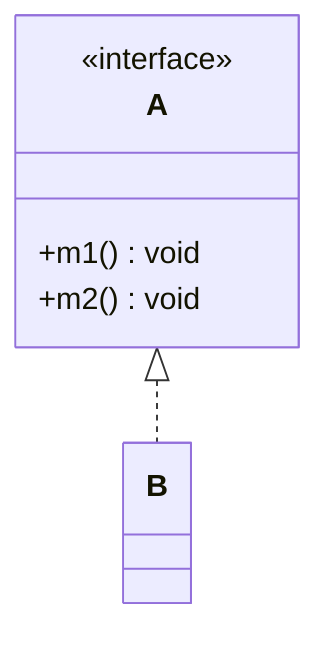

B类实现的A类之后，B类就拥有了A类所有的方法，但是B类只想使用A类的`m1`方法，不想拥有`m2`方法，却被迫拥有`m2`方法，因此不符合ISP原则。

**改进**：

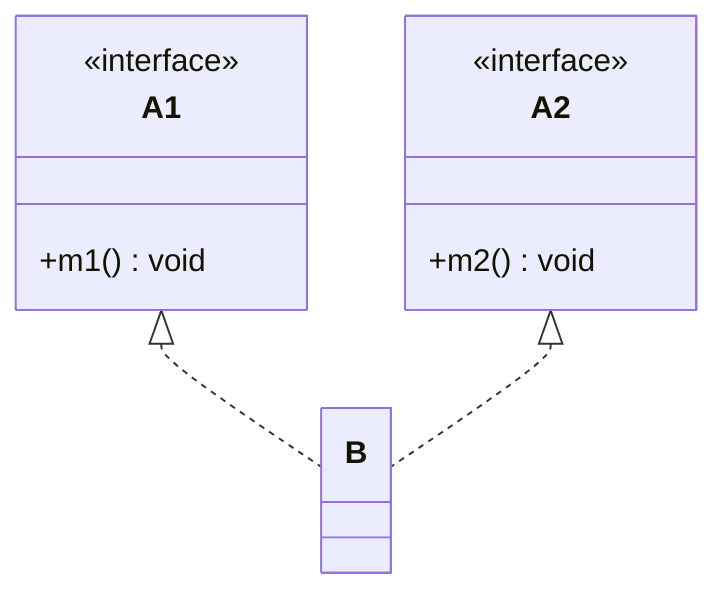

### 迪米特原则

> 迪米特法则（Law of Demeter, LOD），又称最少知识原则
>
> 如果两个类之间无须直接调用，就不应该相互调用，应该使用第三方来转发此调用

举例：明星和经纪人的关系

组合关系

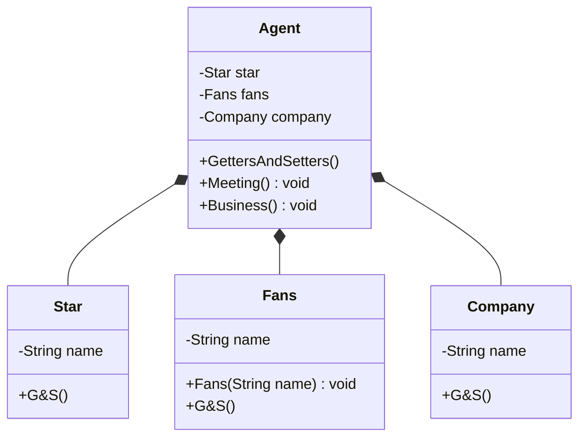

### 合成复用关系

>组合/聚合复用原则（Composite/Aggregate Reuse Principle，CARP）

尽量使用合成或者聚合的关联关系来实现，其次才考虑继承关系。

继承复用的子父类耦合度较高

举例：汽车分类管理程序

汽车分类很多：按动力分，汽油和电动；按颜色分，红白等色；

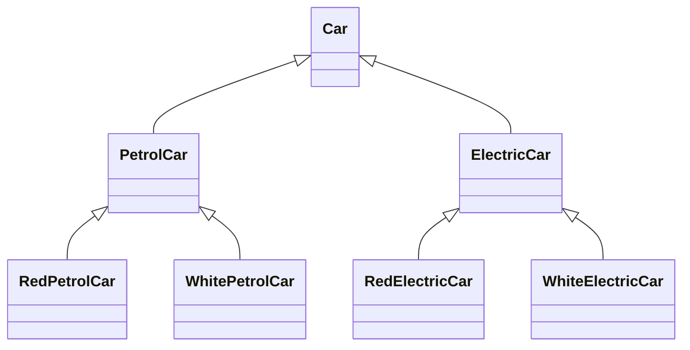

这种就产生了很多子类，如果还有新的分类，子类将特别多，因此改为聚合复用。

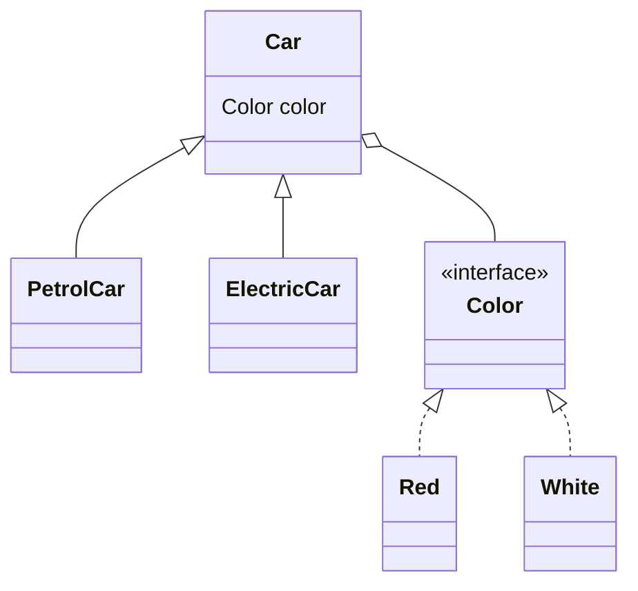

## 设计模式—创建者模式

> 主要关注点是：将对象的创建和使用分离

### 1. 单例模式

提供了一种创建对象的绝佳方式；这种方法这涉及一个类，并且只能创建单个对象，提供了一种外界只能访问其唯一对象的方式，不需要实例化该类的对象。

单例模式的角色：

* 单例类，只能创建一个对象的类
* 访问类：是使用单例类

分为两类：

* 饿汉式

  > 类加载的时候该实例就会被创建，但是如果一直不用就会造成内存浪费

  1. 静态成员变量的方式创建

     使用`private`修饰默认构造函数，使其无法创建对象。

     使用静态方法来返回静态成员。

     ```java
     public class Singleton {
         private Singleton() {}
     
         private static Singleton instance = new Singleton();
         
         public static Singleton getInstance() {
             return instance;
         }
     }
     ```

  2. 使用静态代码块的方式实现

     ```java
     public class Singleton {
         // 饿汉式2
         private Singleton() {}
     
         private static Singleton instance;
     
         static {
             instance = new Singleton();
         }
     
         public static Singleton getInstance() {
             return instance;
         }
     }
     ```

* 懒汉式

  首次使用实例的时候才会创建

  1. 方式一（==线程不安全==）

     ```java
     public class Singleton {
         // 懒汉式1，存在线程不安全的问题
         private Singleton() {}
     
         private static Singleton instance;
     
         public static Singleton getInstance(){
             if (instance == null)instance = new Singleton();
             return instance;
         }
     }
     ```

  2. 方式二（线程安全）

     ```java
     public class Singleton {
         // 懒汉式2
         private Singleton() {}
     
         private static Singleton instance;
     
         public static synchronized Singleton getInstance(){
             if (instance == null)instance = new Singleton();
             return instance;
         }
     }
     ```

  3. 方式三（双重检查锁）

     对于`getInstance()`方法来说，大部分情况都是读操作，而读操作的是线程安全的，因此没必要在每次读取的时候加一个锁，需要调整加锁的时机，即双重检查锁。

     ❓这里为什么需要两个if？

     ```java
     public class Singleton {
         private Singleton () {}
     
         private static volatile Singleton instance;
     
         public static Singleton getInstance() {
             if (instance == null){
                 synchronized (Singleton.class){
                     if (instance == null){
                         instance = new Singleton();
                     }
                 }
             }
             return instance;
         }
     }
     ```

     > 添加`volataile`关键字后在多线程下还能保持安全，保证实例化是顺序！

  4. 方式四（静态内部类方式）

     实例由静态内部类创建，由于JVM在加载外部类的时候，是不会加载内部类的，只有将内部类的属性/方法被调用时才会加载，并且初始化静态属性；

     并且静态属性被`static`关键字修饰，保证只被实例化一次，并且严格保证实例化的顺序。

     ```java
     public class Singleton {
         // 懒汉式3 静态内部类方式
         private Singleton() {}
     
         private static class SingletonHolder{
             private static final Singleton INSTANCE = new Singleton();
         }
     
         public static Singleton getInstance(){
             return SingletonHolder.INSTANCE;
         }
     }
     ```

  5. 方式五（枚举方式==最推荐==）

     > 枚举类型线程安全，并且只会装载一次，唯一一个不会被破坏的方式

​				属于恶汉式（不考虑内存空间）

<h4>单例模式存在的问题</h4>

破坏单例模式：使用序列化和反射，使得单例模式创建多个对象。

🔵序列化破坏单例模式：

> 对于`Singleton`类需要实现`Serializable`接口，在输出序列化对象之后再进行读取两次，就会获取到不同地址引用的对象，从而破坏单例模式。

```java
public class Destroy {
    public static void main(String[] args) throws Exception {
        OutputObj();
        Singleton ins1 = readObj();
        Singleton ins2 = readObj();
        System.out.println(ins1 == ins2);   // false
    }

    public static Singleton readObj() throws Exception {
        ObjectInputStream ois = new ObjectInputStream(new FileInputStream("./a.txt"));
        return (Singleton) ois.readObject();
    }

    public static void OutputObj() throws IOException {
        ObjectOutputStream oos = new ObjectOutputStream(new FileOutputStream("./a.txt"));
        Singleton ins = Singleton.getInstance();
        oos.writeObject(ins);
    }
}
```

🔵反射破坏单例模式

> 看不太懂，太菜了

```java
// 反射破坏单例模式
public class Destroy {
    public static void main(String[] args) throws Exception {
        // 1 获取Singleton字节码对象
        Class clazz = Singleton.class;
        // 2 获取无参构造方法对象
        Constructor cons = clazz.getDeclaredConstructor();
        // 3 取消访问检查
        cons.setAccessible(true);
        // 4 创建Singleton对象
        Singleton s1 = (Singleton) cons.newInstance();
        Singleton s2 = (Singleton) cons.newInstance();
        System.out.println(s1 == s2);   // false
    }
}
```

🔵解决被序列化反射破坏单例模式的问题

* 解决序列化

  在`Singleton`对象中添加`readResolve()`方法，在反序列化时被反射调用，如果定义了这个方法，就返回这个方法的值；如果没有定义就返回新new出来的对象。
  
  ```java
  public class Singleton implements Serializable {
      // 饿汉式1
      private Singleton() {
      }
  
      private static Singleton instance = new Singleton();
  
      public static Singleton getInstance() {
          return instance;
      }
  
      // Repair 修复这个bug
      public Object readResolve(){
          return getInstance();
      }
  }
  ```

* 解决反射

  ```java
  public class Singleton {
      // 饿汉式1
      private static boolean flag = false;
  
      private Singleton() {
          // 修复反射
          synchronized (Singleton.class){
              if (flag){
                  throw new RuntimeException("不能创建多个实例");
              }
              flag = true;
          }
      }
  
      private static Singleton instance = new Singleton();
  
      public static Singleton getInstance() {
          return instance;
      }
  }
  ```

<h4>Singleton案例——Runtime类</h4>

> Runtime类使用的就是单例设计模式

代码：

```java
public class Runtime {
    private static final Runtime currentRuntime = new Runtime();

    /**
     * Returns the runtime object associated with the current Java application.
     * Most of the methods of class {@code Runtime} are instance
     * methods and must be invoked with respect to the current runtime object.
     *
     * @return  the {@code Runtime} object associated with the current
     *          Java application.
     */
    public static Runtime getRuntime() {
        return currentRuntime;
    }

    /** Don't let anyone else instantiate this class */
    private Runtime() {}
    
    // ...
}
```

简单使用`Runtime`类

```java
public class RuntimeDemo {
    public static void main(String[] args) throws IOException {
        Runtime runtime = Runtime.getRuntime();

        Process exec = runtime.exec("ipconfig");
        InputStream is = exec.getInputStream();
        byte arr[] = new byte[1024*1024 * 100];
        int len = is.read(arr);
        String s = new String(arr, 0, len, "GBK");
        System.out.println(s);

        System.out.println("Java虚拟机的内存总量：" + runtime.totalMemory());
        //  Java虚拟机的内存总量：264241152
        System.out.println("Java虚拟机试图使用的最大内存量：" + runtime.maxMemory());
        // Java虚拟机试图使用的最大内存量：4200595456
    }
}
```

### 2. 工厂模式

举例设计一个咖啡点餐系统

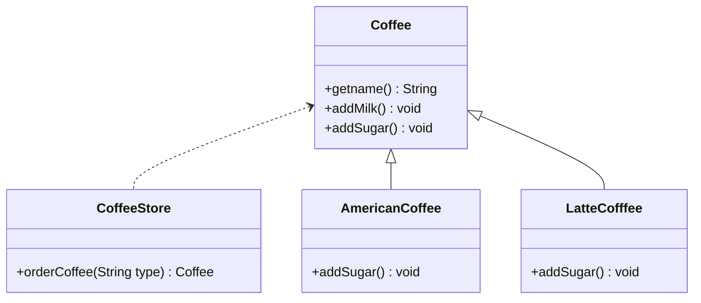

对应代码：

```java
public class CoffeeStore {
    public Coffee orderCoffee(String type){
        Coffee coffee;
        if (type.equals("american"))coffee = new AmericanCoffee();
        else if(type.equals("latte")) coffee = new LatteCoffee();
        else throw new RuntimeException("No this type of coffee.");

        coffee.addMilk();
        coffee.addSugar();

        return coffee;
    }
}
```

存在的问题：

如果新添加一种咖啡，就需要在`CoffeeStore`类中进行重新修改代码，这就违背了开闭原则，引用一个工厂来进行解耦合。

<h4>简单工厂模式</h4>

> 严格上来说，简单工厂模式不是一种设计模式，而是一个编程习惯

分为以下角色：

* 抽象产品：（interface）定义了产品的规范，描述了其主要特性和功能
* 具体产品：（实现接口）实现和继承抽象产品的子类
* 具体工厂：提供创建产品的方法

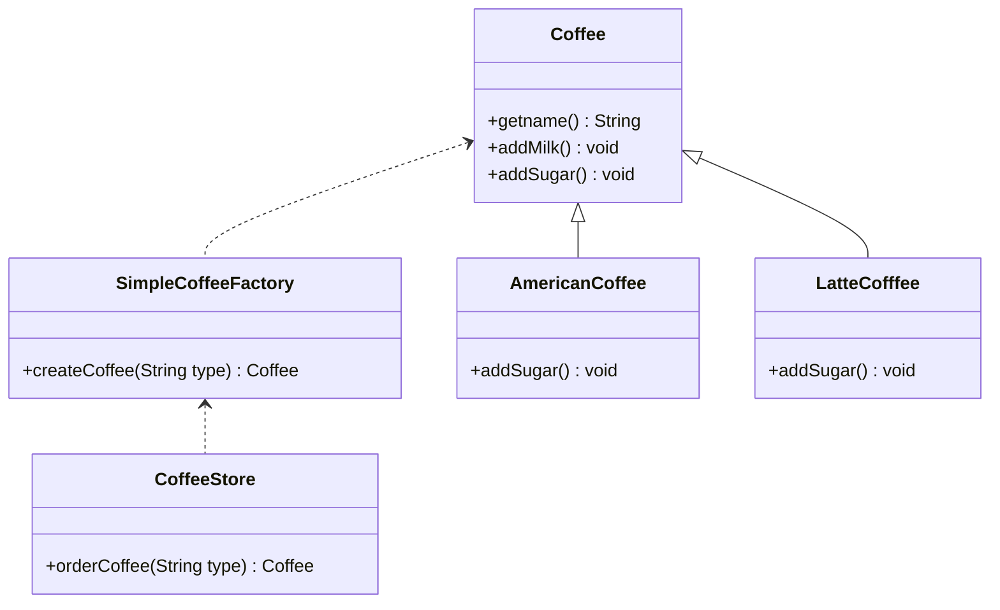

对应代码：

工厂中的代码和原来`CoffeeStore`创建`Coffee`的代码类似。

> 也可以将`orderCoffee`方法设置为静态方法，方便调用，不需要再创建工厂对象。

```java
package com.yz.pattern.creator.factory.simpleFactory;

public class CoffeeStore {
    public Coffee orderCoffee(String type){
        SimpleCoffeeFactory factory = new SimpleCoffeeFactory();
        Coffee coffee = factory.createCoffee(type);
        coffee.addMilk();
        coffee.addSugar();
        return coffee;
    }
}
```

优缺点：

* 这样就解除了`CoffeeStore`和`Coffee`的实现类耦合。
* 产生了新的`SimpleCoffeeFactory`和`Coffee`的实现类耦合，还是违背了开闭原则。

<h4>工厂方法模式</h4>

角色：

* 抽象产品：（interface）定义了产品的规范，描述了其主要特性和功能
* 具体产品：（实现接口）实现和继承抽象产品的子类
* 抽象工厂：创建者提供创建具体工厂来创建实例
* 具体工厂：实现创建产品的接口，提供创建产品的方法

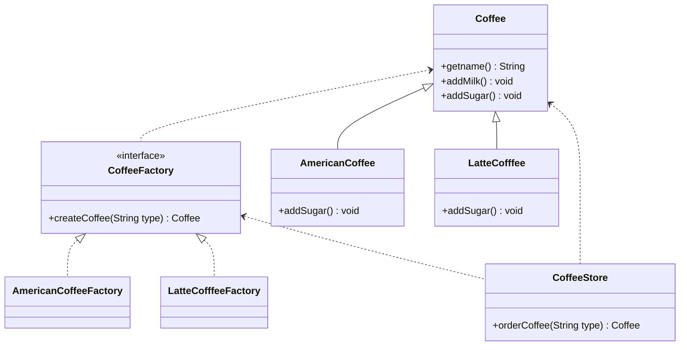

优缺点：

* 用户需要知道具体工厂名称就可以得到对应的产品；增加新产品的时候只需要添加对应的具体工厂类即可，满足开闭原则
* 缺点：每增加一个产品就需要实现一个具体工厂类，增加了复杂类

<h4>抽象工厂模式</h4>

之前的工厂模式只考虑一类产品，而抽象工厂模式将要考虑的是**多级别产品的生产**

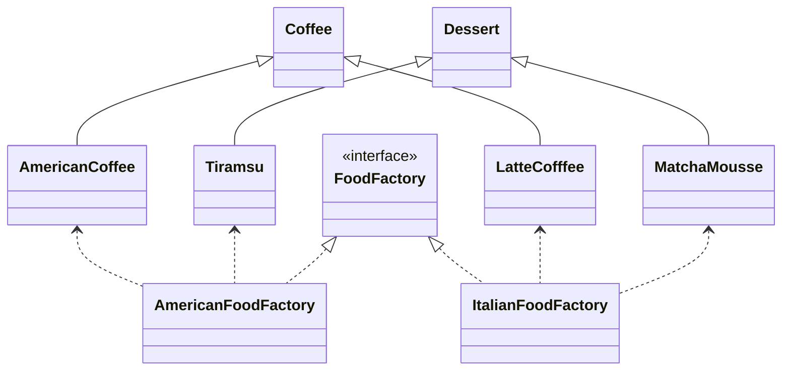

如果还要增加一个产品的话，所有的类都可能需要修改。

使用场景：需要创建的对象是一系列的产品族，换的是一整套的系统

<h4>工厂模式之模式扩展</h4>

在开发中有一种固定的开发套路：**简单模式+配置文件接触耦合**，类似Spring框架，利用反射的机制进行对象取出。

第一步：定义配置文件

```java
american=com.yz.pattern.creator.factory.config_factory.AmericanCoffee
latte=com.yz.pattern.creator.factory.config_factory.LatteCoffee
```

第二步：编写Factory类：

```java
public class CoffeeFactory {

    private static HashMap<String, Coffee> map = new HashMap<>();

    // 加载文件只需要加载一次
    static {
        Properties p = new Properties();
        InputStream is = CoffeeFactory.class.getClassLoader().getResourceAsStream("bean.properties");
        try {
            p.load(is);
            // 创建对应的对象
            Set<Object> keySet = p.keySet();
            for (Object k : keySet) {
                String className = p.getProperty((String) k);
                Coffee coffee = (Coffee) Class.forName(className).getDeclaredConstructor().newInstance();
                map.put((String) k, coffee);
            }
        } catch (Exception e) {
            e.printStackTrace();
        }

    }

    public static Coffee createCoffee(String name) {
        Coffee coffee = map.get(name);
        return coffee;
    }
}
```

<h4>JDK源码扩展——Collection.iterator方法</h4>


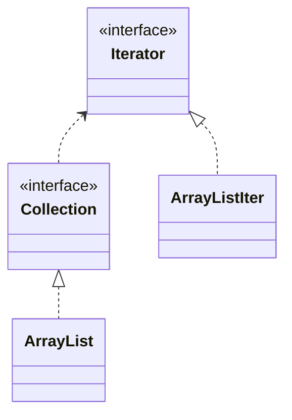

`Iterator`就是抽象产品类，`ArrayList$Iter`属于具体产品；`Collection`是抽象工厂类，`ArrayList`就是具体工厂。

### 3. 原型模式

> 用一个已经创建好的实例作为原型，提供复制该原型对象来创建一个和原型对象相同的新对象

结构：

* 抽象原型类：规定原型对象必须实现的`clone()`方法
* 具体原型类：实现抽象原型对象中的`clone()`方法，他是可被复制的对象
* 访问类：使具体原型类中的`clone()`方法来复制新的对象

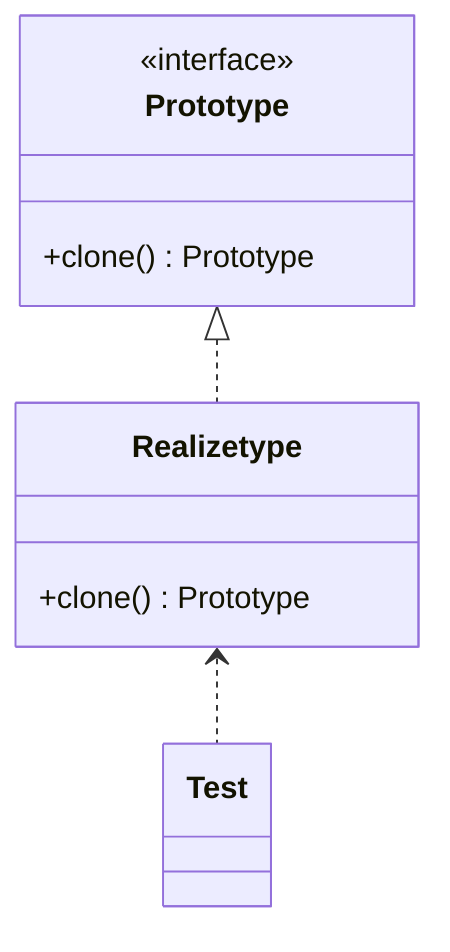

<h4>实现-浅克隆</h4>

> 克隆分为浅克隆和深克隆，浅克隆中非基本属性，仍指向原有属性中的对象地址

在Java中`Cloneable`就是克隆抽象原型类，克隆的对象不是通过`new`来创建的。

```java
package com.yz.pattern.creator.prototype.demo1;

public class RealizeType implements Cloneable{
    @Override
    protected RealizeType clone() throws CloneNotSupportedException {
        System.out.println("Copy!");
        return (RealizeType) super.clone();
    }
}
```

测试：

```java
public class Test {
    public static void main(String[] args) throws CloneNotSupportedException {
        RealizeType t = new RealizeType();
        RealizeType clone = t.clone();
        System.out.println(clone == t);					// false
        System.out.println(clone.person == t.person);   // true 浅克隆
    }
}
```

<h4>实现-深克隆</h4>

这种情况的话需要使用对象流(`ObjectOutputStream, ObjectInputStream`)

> 对于具体原型和其引用属性都需要实现`Serializable`才能够序列化

```java
public class RealizeType implements Cloneable, Serializable {

    public Person person;

    public RealizeType() {
        this.person = new Person();
    }

    @Override
    protected RealizeType clone() throws CloneNotSupportedException {
        RealizeType realizeType = null;
        try {
            ObjectOutputStream oos = new ObjectOutputStream(new FileOutputStream("./objClone"));
            oos.writeObject(this);
            oos.close();

            ObjectInputStream ois = new ObjectInputStream(new FileInputStream("./objClone"));
            realizeType = (RealizeType) ois.readObject();
            return realizeType;
        } catch (IOException | ClassNotFoundException e) {
            e.printStackTrace();
        }
        return realizeType;
    }
}
```

