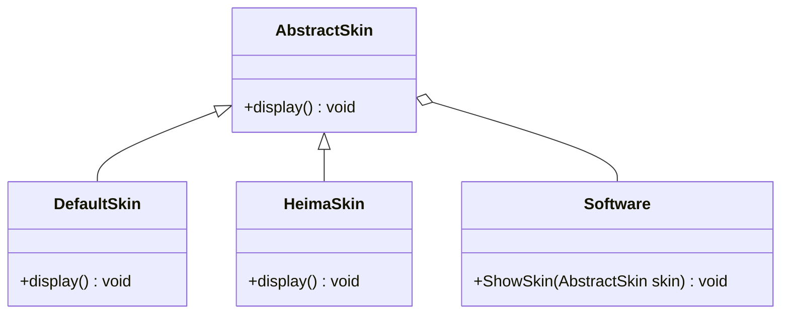
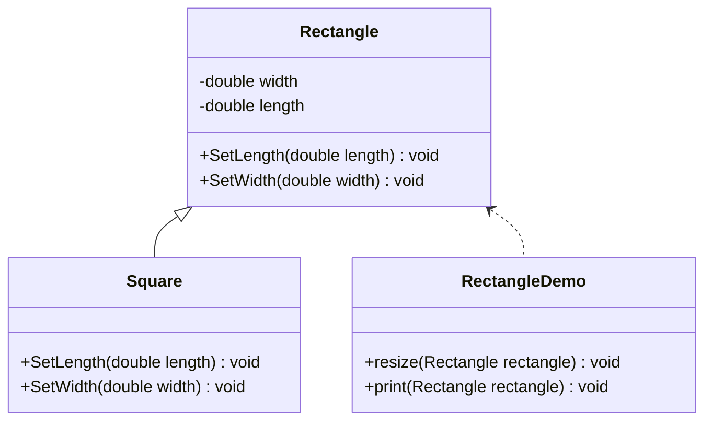
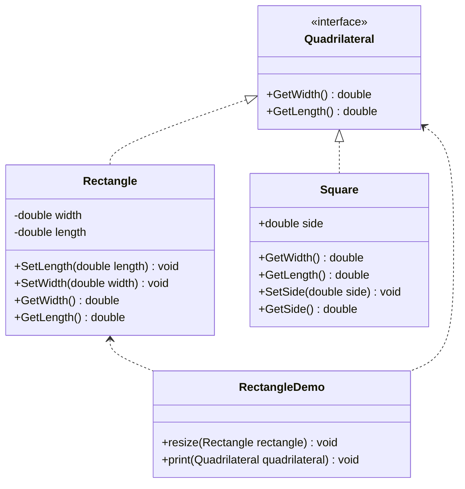
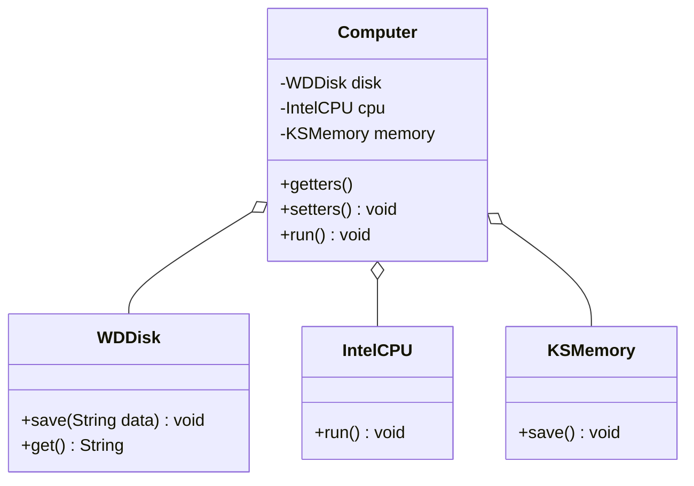
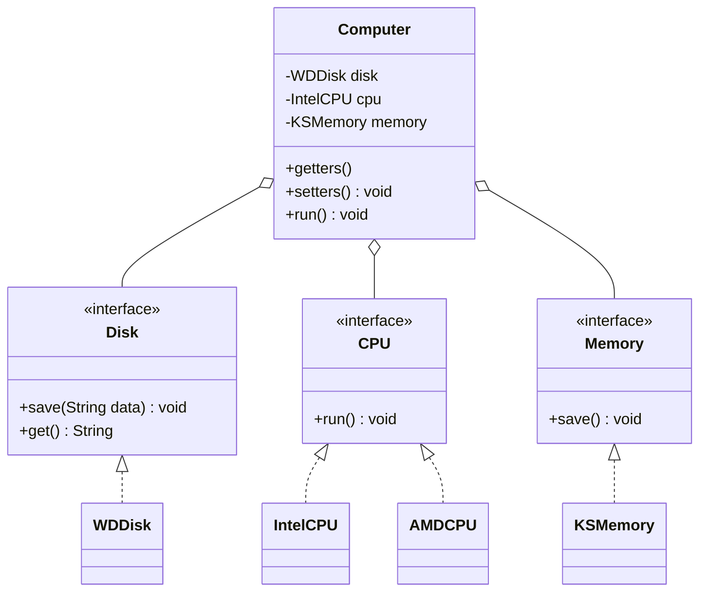
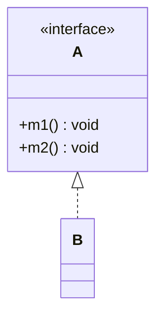
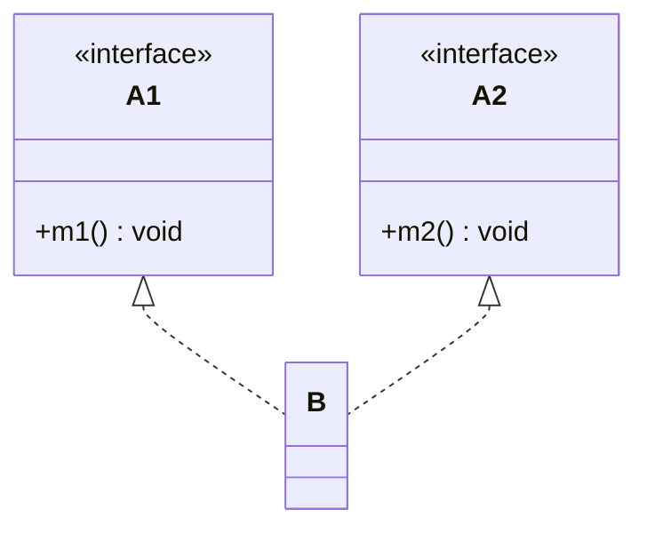
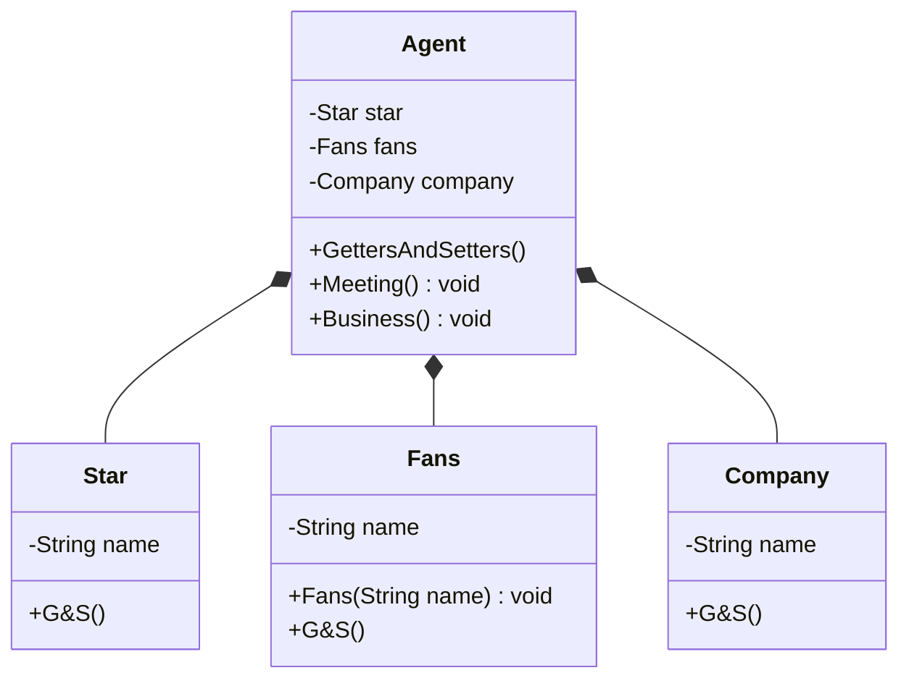
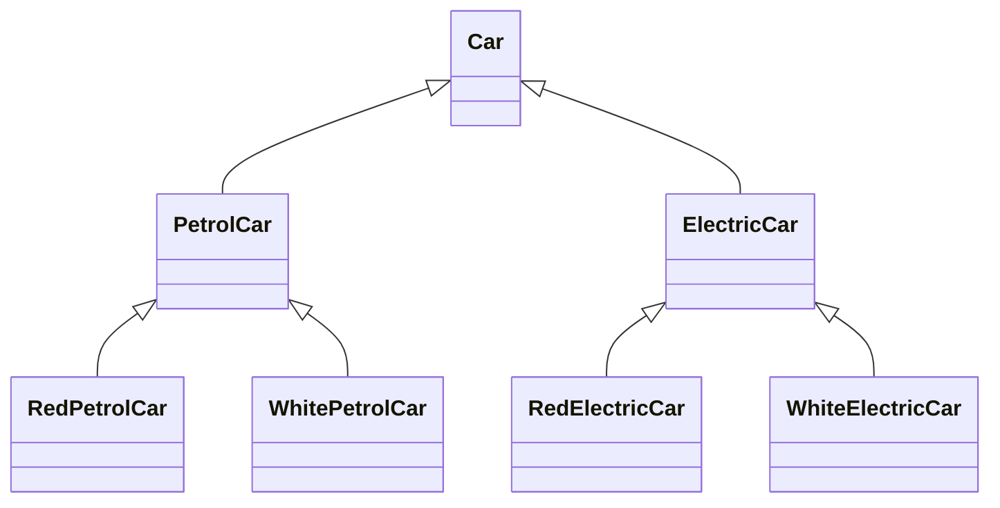
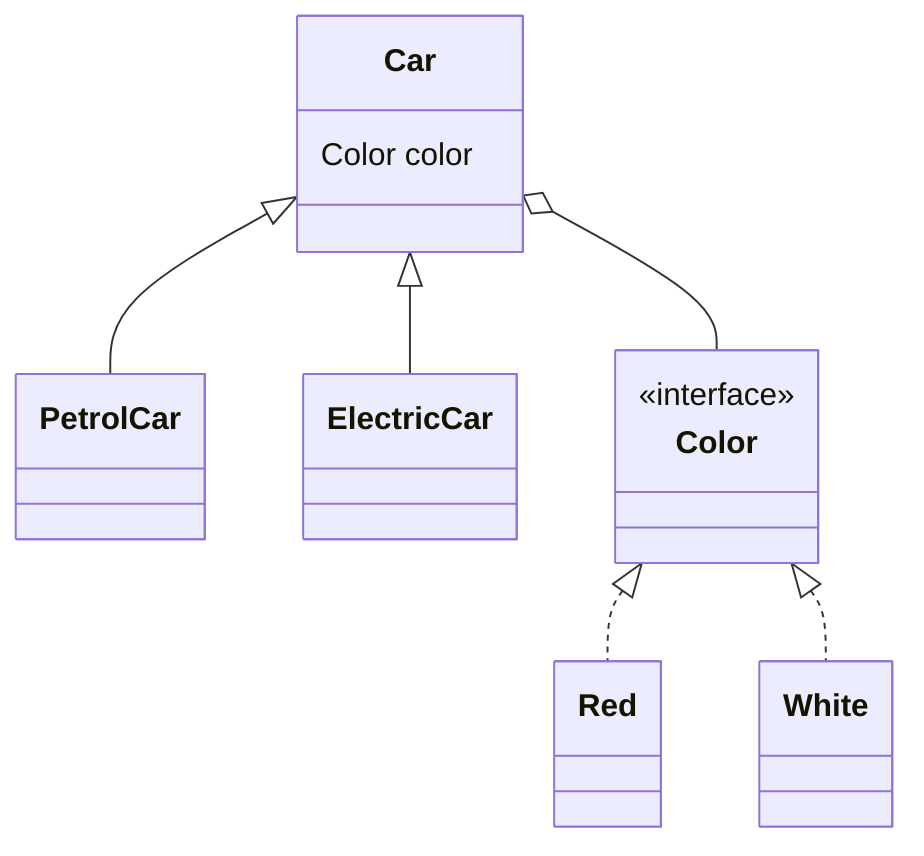

# 设计模式

2021.07.29 02:25

[TOC]

[设计模式之美](https://time.geekbang.org/column/intro/100039001) -> 对应资源 -> [BDPan: 密码6666](https://pan.baidu.com/s/1bSL6twuY3JGqkb66n09zAQ )

[Go设计模式24-总结](https://lailin.xyz/post/go-design-pattern.html)  [极客时间对于的go实现](https://github.com/mohuishou/go-design-pattern)

[BV1Np4y1z7BU](https://www.bilibili.com/video/BV1Np4y1z7BU) P10

## 初识

### 代码质量标准

1. 可维护性
2. 可读性
3. 可扩展性
4. 灵活性
5. 简洁性
6. 可复用性
7. 可测试性

### 设计模式类型

1. 创建型（5种）

  用于描述怎么创建对象，将对象的创建和使用分离。

  常用的有：单例模式、工厂模式（工厂方法和抽象工厂）、建造者模式。
  不常用的有：原型模式。

2. 结构型（7种）

    将类和对象按照某种布局组成更大的结构

    常用的有：代理模式、桥接模式、装饰者模式、适配器模式。
    不常用的有：门面模式、组合模式、享元模式。

3. 行为型（11种）

    描述类和对象之间怎么相互协作共同完成单独无法完成的任务。

    常用的有：观察者模式、模板模式、策略模式、职责链模式、迭代器模式、状态模式。
    不常用的有：访问者模式、备忘录模式、命令模式、解释器模式、中介模式。

### 类与类之间的关系

[类图语法](https://mermaid-js.github.io/mermaid/#/classDiagram)

1. 关联关系

   单向关联

   ```mermaid
   classDiagram
   	Customer <-- Address
   	Customer: +Address address
   	class Address{
   		+String country
   		+String province
   	}
   ```

   双向关联

   ```mermaid
   classDiagram
   	Customer <--> Product
   	Customer: +List~Product~ products
   	class Product{
   		+Customer customer
   	}
   ```

   自关联

   ```mermaid
   classDiagram
   	Node <-- Node
   	Node: +Node subNode

2. 聚合关系

   聚合关系表示，成员对象是整体对象的一部分，成员对象可以脱离整体对象而独立存在

   ```mermaid
   classDiagram
   	University o-- Teacher
   	University: -List~Teacher~ techs
   	Teacher: -String name
   	Teacher: +name() void
   ```

3. 组合关系

   是一种更强烈的聚合关系。整体对象可以控制部分对象的生命周期，部分对象不能脱离整体对象存在。

   (实心菱形表示)

   ```mermaid
   classDiagram
   	Head *-- Mouth
   	Head: +Mouth mouth
   ```

4. 依赖关系

   Driver的drive方法种使用到Car类，耦合度较低的

   ```mermaid
   classDiagram
   	Driver <.. Car
   	Car: +move() void
   	Driver: +String name
   	Driver: +drive(Car car) void
   ```

5. 继承关系

   耦合度最大的关系

   ```mermaid
   classDiagram
   	Animal <|-- Dog
   	Animal <|-- Cat
   ```

6. 实现关系

   ```mermaid
   classDiagram
   	Animal <|.. Dog
   	Animal <|.. Cat
   	Animal: +eat() void
   	Dog: +eat() void
   	Cat: +eat() void
   	<<interface>> Animal
   ```

## 六大设计原则

> 为了提高软件系统的可维护性和可复用性，增加可扩展性和灵活性。

### 开闭原则

**对扩展开放，对修改关闭。**

以输入法的皮肤为例：

`DefaultSkin`和`HeimaSkin`继承`AbstractSkin`，是继承关系。

`Software`来展示输入法的皮肤`ShowSkin()`，是聚合关系。



### 里氏代换原则

> 里氏代换原则(Liskov Substitution Principle LSP)
>
> 子类继承父类，尽量不要重写父类方法。

以正方形不是长方形为例

Square继承Rectangle，RectangleDemo依赖于Rectangle。



代码案例：

Rectangle类

```java
public class Rectangle {
    private double width;
    private double length;

    public double getWidth() { return width; }

    public void setWidth(double width) { this.width = width; }

    public double getLength() { return length; }

    public void setLength(double length) { this.length = length; }
}
```

Square类：

```java
public class Square extends Rectangle{
    @Override
    public void setWidth(double width) {
        super.setWidth(width);
        super.setLength(width);
    }

    @Override
    public void setLength(double length) {
        this.setWidth(length);
    }
}
```

Demo执行类

```java
public class RectangleDemo {
    // 里氏代换原则
    public static void main(String[] args) {
        Rectangle rectangle = new Rectangle();
        rectangle.setLength(10);
        rectangle.setWidth(20);
        resize(rectangle);
        print(rectangle);

        // New a Square
        System.out.println("===========");
        Square square = new Square();
        square.setWidth(15);
        resize(square);     // 这里会死循环
        print(square);
    }

    public static void resize(Rectangle rectangle){
        // 当才发现长小于宽时候伸长
        while (rectangle.getLength() <= rectangle.getWidth()){
            rectangle.setLength(rectangle.getLength() + 1);
        }
    }

    public static void print(Rectangle rectangle){
        System.out.println(rectangle.getWidth() + " " + rectangle.getLength());
    }
}
```

在这个案例中，对于长方形类使用resize方法是没有任何问题的，但是如果使用对于子类正方形使用`resize()`方法，就会出现问题，会对正方形的长和宽一同进行设置，导致死循环。因此在resize方法中，长方形的参数不能被正方形替换，所以`Rectangle`和`Square`类之间违反了里氏代换原则，继承关系不存在，因此正方形不是长方形。


因此需要重新设计程序，抽象出一个`Quadrilateral`四边形接口，让正方形和长方形实现此接口。



对于resize函数只对长方形生效。

### 依赖倒换原则

> 依赖倒换原则(Dependence Inversion Principle,DIP)
>
> 对抽象进行编程，而不是对实现进行编程。开闭原则的另一种实现。

举例：计算机的关系

其他配件与计算机都是关联关系。



存在一个问题：就是用户不能自定义自己喜欢的配件，比如CPU想用AMD的，就还得修改代码。

因此需要重构代码，就硬盘、CPU、内存抽象成一个接口。

不同品牌的配件实现对应的接口。



### 接口隔离原则

>接口隔离原则（interface-segregation principles，ISP）
>
>客户端不应该被迫依赖于它不使用的方法，一个类对另一个类应该建立在最小的接口上。

存在问题：



B类实现的A类之后，B类就拥有了A类所有的方法，但是B类只想使用A类的`m1`方法，不想拥有`m2`方法，却被迫拥有`m2`方法，因此不符合ISP原则。

**改进**：



### 迪米特原则

> 迪米特法则（Law of Demeter, LOD），又称最少知识原则
>
> 如果两个类之间无须直接调用，就不应该相互调用，应该使用第三方来转发此调用

举例：明星和经纪人的关系

组合关系



### 合成复用关系

>组合/聚合复用原则（Composite/Aggregate Reuse Principle，CARP）

尽量使用合成或者聚合的关联关系来实现，其次才考虑继承关系。

继承复用的子父类耦合度较高

举例：汽车分类管理程序

汽车分类很多：按动力分，汽油和电动；按颜色分，红白等色；



这种就产生了很多子类，如果还有新的分类，子类将特别多，因此改为聚合复用。



