# 设计模式

2021.07.29 02:25

[TOC]

[设计模式之美](https://time.geekbang.org/column/intro/100039001) -> 对应资源 -> [BDPan: 密码6666](https://pan.baidu.com/s/1bSL6twuY3JGqkb66n09zAQ )

[Go设计模式24-总结](https://lailin.xyz/post/go-design-pattern.html)  [极客时间对于的go实现](https://github.com/mohuishou/go-design-pattern)

[BV1Np4y1z7BU](https://www.bilibili.com/video/BV1Np4y1z7BU?p=137) P137

推荐网站：https://refactoringguru.cn/

## 初识

### 代码质量标准

1. 可维护性
2. 可读性
3. 可扩展性
4. 灵活性
5. 简洁性
6. 可复用性
7. 可测试性

### 设计模式类型

1. 创建型（5种）

  用于描述怎么创建对象，将对象的创建和使用分离。

  常用的有：单例模式、工厂模式（工厂方法和抽象工厂）、建造者模式。
  不常用的有：原型模式。

2. 结构型（7种）

    将类和对象按照某种布局组成更大的结构

    常用的有：代理模式、桥接模式、装饰者模式、适配器模式。
    不常用的有：外观模式、组合模式、享元模式。

3. 行为型（11种）

    描述类和对象之间怎么相互协作共同完成单独无法完成的任务。

    常用的有：观察者模式、模板模式、策略模式、职责链模式、迭代器模式、状态模式。
    不常用的有：访问者模式、备忘录模式、命令模式、解释器模式、中介模式。

### 类与类之间的关系

[类图语法](https://mermaid-js.github.io/mermaid/#/classDiagram)

1. 关联关系

   单向关联

   ```mermaid
   classDiagram
   	Customer <-- Address
   	Customer: +Address address
   	class Address{
   		+String country
   		+String province
   	}
   ```

   双向关联

   ```mermaid
   classDiagram
   	Customer <--> Product
   	Customer: +List~Product~ products
   	class Product{
   		+Customer customer
   	}
   ```

   自关联

   ```mermaid
   classDiagram
   	Node <-- Node
   	Node: +Node subNode

2. 聚合关系

   聚合关系表示，成员对象是整体对象的一部分，成员对象可以脱离整体对象而独立存在

   ```mermaid
   classDiagram
   	University o-- Teacher
   	University: -List~Teacher~ techs
   	Teacher: -String name
   	Teacher: +name() void
   ```

3. 组合关系

   是一种更强烈的聚合关系。整体对象可以控制部分对象的生命周期，部分对象不能脱离整体对象存在。

   (实心菱形表示)

   ```mermaid
   classDiagram
   	Head *-- Mouth
   	Head: +Mouth mouth
   ```

4. 依赖关系

   Driver的drive方法种使用到Car类，耦合度较低的

   ```mermaid
   classDiagram
   	Driver <.. Car
   	Car: +move() void
   	Driver: +String name
   	Driver: +drive(Car car) void
   ```

5. 继承关系

   耦合度最大的关系

   ```mermaid
   classDiagram
   	Animal <|-- Dog
   	Animal <|-- Cat
   ```

6. 实现关系

   ```mermaid
   classDiagram
   	Animal <|.. Dog
   	Animal <|.. Cat
   	Animal: +eat() void
   	Dog: +eat() void
   	Cat: +eat() void
   	<<interface>> Animal
   ```

## 六大设计原则

> 为了提高软件系统的可维护性和可复用性，增加可扩展性和灵活性。

### 开闭原则

**对扩展开放，对修改关闭。**

以输入法的皮肤为例：

`DefaultSkin`和`HeimaSkin`继承`AbstractSkin`，是继承关系。

`Software`来展示输入法的皮肤`ShowSkin()`，是聚合关系。

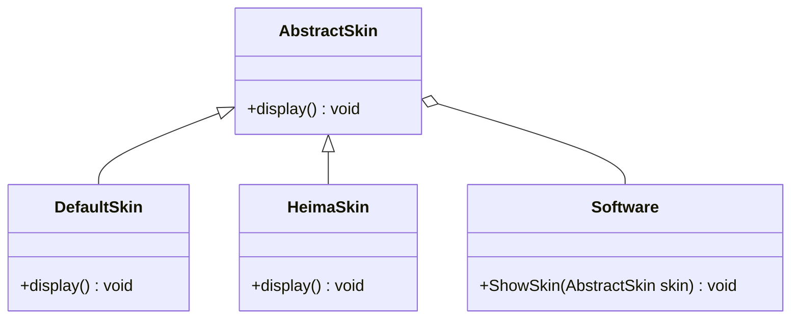
```mermaid
classDiagram
	AbstractSkin <|-- DefaultSkin
	AbstractSkin <|-- HeimaSkin
	AbstractSkin o-- Software
	AbstractSkin: +display() void
	DefaultSkin: +display() void
	HeimaSkin: +display() void
	Software:+ShowSkin(AbstractSkin skin) void
```

### 里氏代换原则

> 里氏代换原则(Liskov Substitution Principle LSP)
>
> 子类继承父类，尽量不要重写父类方法。

以正方形不是长方形为例

Square继承Rectangle，RectangleDemo依赖于Rectangle。

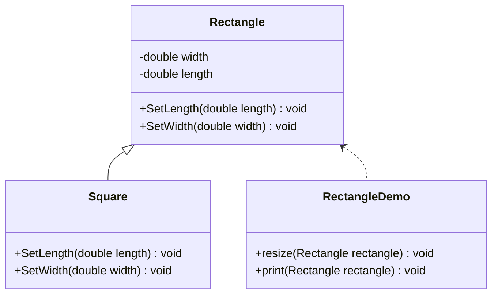
```mermaid
classDiagram
	Rectangle <|-- Square
	Rectangle <.. RectangleDemo
	
	RectangleDemo: +resize(Rectangle rectangle) void
	RectangleDemo: +print(Rectangle rectangle) void
	
	class Rectangle{
		-double width
		-double length
		+SetLength(double length) void
		+SetWidth(double width) void
	}
	
	class Square{
		+SetLength(double length) void
		+SetWidth(double width) void
	}
```

代码案例：

Rectangle类

```java
public class Rectangle {
    private double width;
    private double length;

    public double getWidth() { return width; }

    public void setWidth(double width) { this.width = width; }

    public double getLength() { return length; }

    public void setLength(double length) { this.length = length; }
}
```

Square类：

```java
public class Square extends Rectangle{
    @Override
    public void setWidth(double width) {
        super.setWidth(width);
        super.setLength(width);
    }

    @Override
    public void setLength(double length) {
        this.setWidth(length);
    }
}
```

Demo执行类

```java
public class RectangleDemo {
    // 里氏代换原则
    public static void main(String[] args) {
        Rectangle rectangle = new Rectangle();
        rectangle.setLength(10);
        rectangle.setWidth(20);
        resize(rectangle);
        print(rectangle);

        // New a Square
        System.out.println("===========");
        Square square = new Square();
        square.setWidth(15);
        resize(square);     // 这里会死循环
        print(square);
    }

    public static void resize(Rectangle rectangle){
        // 当才发现长小于宽时候伸长
        while (rectangle.getLength() <= rectangle.getWidth()){
            rectangle.setLength(rectangle.getLength() + 1);
        }
    }

    public static void print(Rectangle rectangle){
        System.out.println(rectangle.getWidth() + " " + rectangle.getLength());
    }
}
```

在这个案例中，对于长方形类使用resize方法是没有任何问题的，但是如果使用对于子类正方形使用`resize()`方法，就会出现问题，会对正方形的长和宽一同进行设置，导致死循环。因此在resize方法中，长方形的参数不能被正方形替换，所以`Rectangle`和`Square`类之间违反了里氏代换原则，继承关系不存在，因此正方形不是长方形。


因此需要重新设计程序，抽象出一个`Quadrilateral`四边形接口，让正方形和长方形实现此接口。

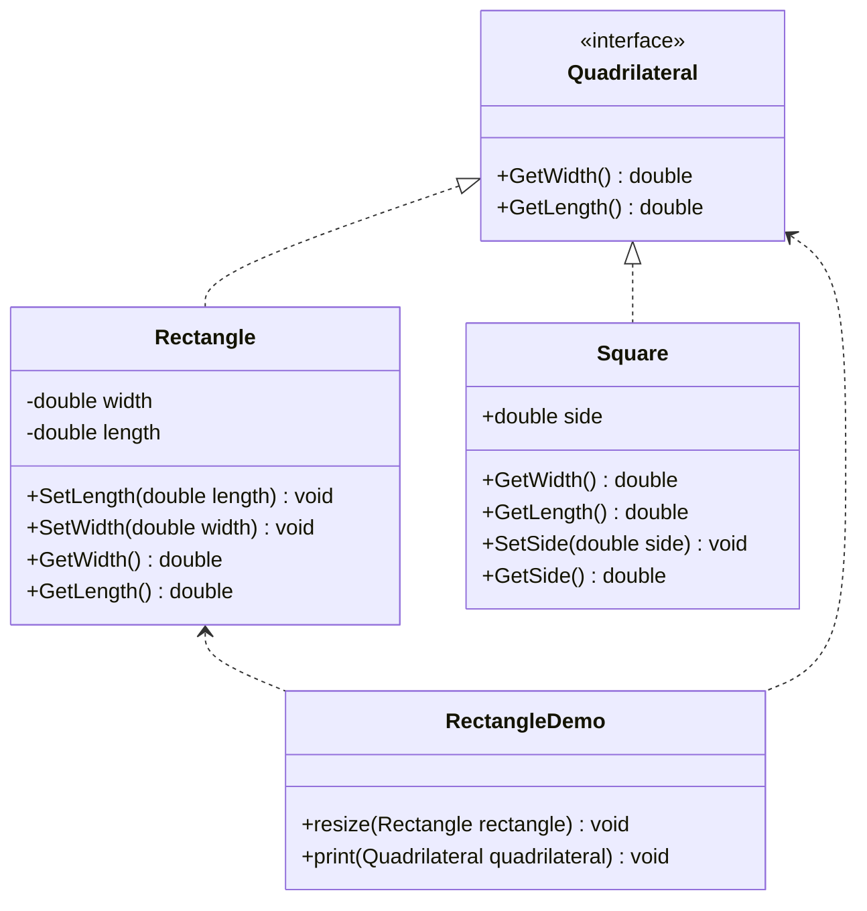
```mermaid
classDiagram
	Quadrilateral <|.. Rectangle
	Quadrilateral <|.. Square
	Rectangle <.. RectangleDemo
	Quadrilateral <.. RectangleDemo
	
	RectangleDemo: +resize(Rectangle rectangle) void
	RectangleDemo: +print(Quadrilateral quadrilateral) void
	
	class Quadrilateral{
		+GetWidth() double
		+GetLength() double
	}
	
	class Rectangle{
		-double width
		-double length
		+SetLength(double length) void
		+SetWidth(double width) void
		+GetWidth() double
		+GetLength() double
	}
	
	class Square{
		+double side
		+GetWidth() double
		+GetLength() double
		+SetSide(double side) void
		+GetSide() double
	}
	<<interface>> Quadrilateral
```

对于resize函数只对长方形生效。

### 依赖倒换原则

> 依赖倒换原则(Dependence Inversion Principle,DIP)
>
> 对抽象进行编程，而不是对实现进行编程。开闭原则的另一种实现。

举例：计算机的关系

其他配件与计算机都是关联关系。

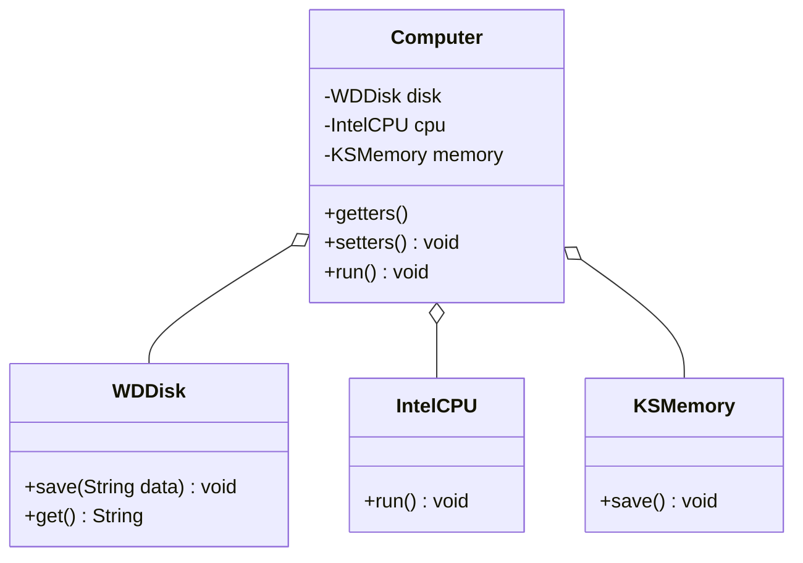
```mermaid
classDiagram
	Computer o-- WDDisk
	Computer o-- IntelCPU
	Computer o-- KSMemory
	
	class Computer{
		-WDDisk disk
		-IntelCPU cpu
		-KSMemory memory
		+getters()
		+setters() void
		+run() void		
	}
	
	class WDDisk{
		+save(String data)void
		+get()String
	}
	
	class IntelCPU{
		+run() void
	}
	
	class KSMemory{
		+save() void
	}
```

存在一个问题：就是用户不能自定义自己喜欢的配件，比如CPU想用AMD的，就还得修改代码。

因此需要重构代码，就硬盘、CPU、内存抽象成一个接口。

不同品牌的配件实现对应的接口。

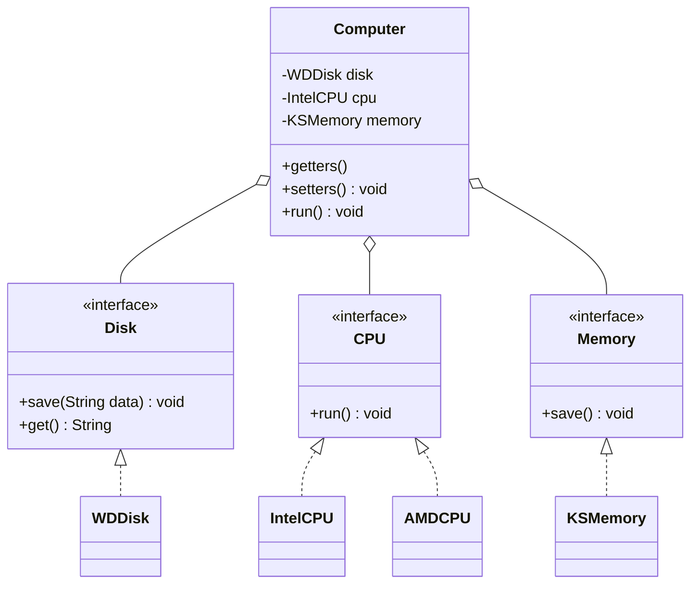
```mermaid
classDiagram
	Computer o-- Disk
	Computer o-- CPU
	Computer o-- Memory
	
	class Computer{
		-WDDisk disk
		-IntelCPU cpu
		-KSMemory memory
		+getters()
		+setters() void
		+run() void		
	}
	
	<<interface>> Disk
	<<interface>> CPU
	<<interface>> Memory
	
	Disk <|.. WDDisk
	CPU <|.. IntelCPU
	CPU <|.. AMDCPU
	Memory <|.. KSMemory
	
	class Disk{
		+save(String data)void
		+get()String
	}
	
	class CPU{
		+run() void
	}
	
	class Memory{
		+save() void
	}
```

### 接口隔离原则

>接口隔离原则（interface-segregation principles，ISP）
>
>客户端不应该被迫依赖于它不使用的方法，一个类对另一个类应该建立在最小的接口上。

存在问题：

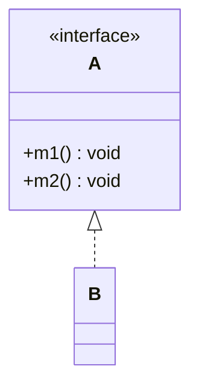
```mermaid
classDiagram
	A <|.. B
	A: +m1() void
	A: +m2() void
	<<interface>> A
```

B类实现的A类之后，B类就拥有了A类所有的方法，但是B类只想使用A类的`m1`方法，不想拥有`m2`方法，却被迫拥有`m2`方法，因此不符合ISP原则。

**改进**：

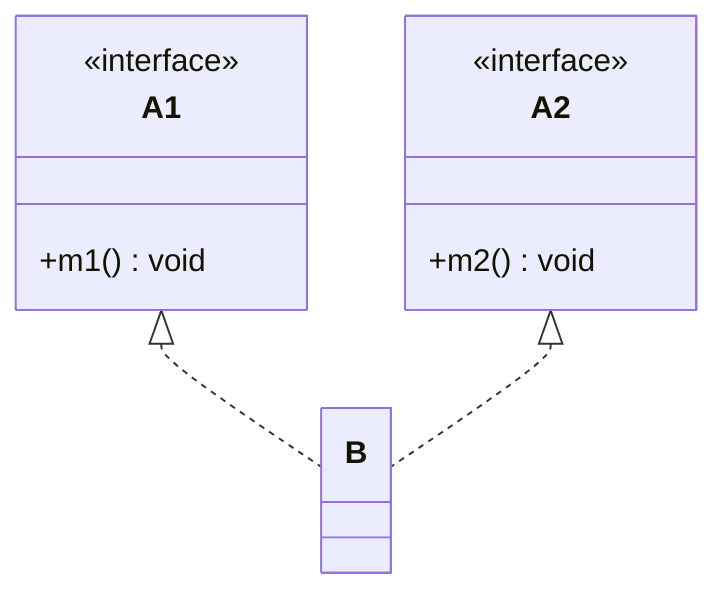
```mermaid
classDiagram
	A1 <|.. B
	A2 <|.. B
	A1: +m1() void
	A2: +m2() void
	<<interface>> A1
	<<interface>> A2
```

### 迪米特原则

> 迪米特法则（Law of Demeter, LOD），又称最少知识原则
>
> 如果两个类之间无须直接调用，就不应该相互调用，应该使用第三方来转发此调用

举例：明星和经纪人的关系

组合关系

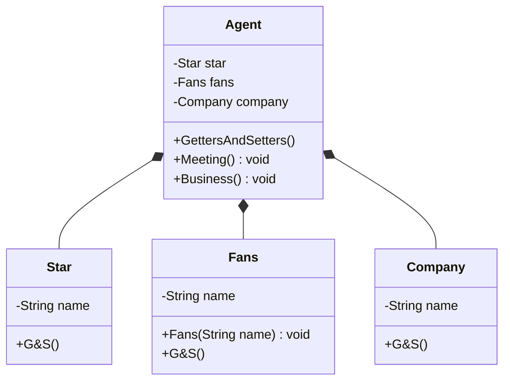
```mermaid
classDiagram
	Agent *-- Star
	Agent *-- Fans
	Agent *-- Company

	class Agent{
		-Star star
		-Fans fans
		-Company company
		+GettersAndSetters()
		+Meeting() void
		+Business() void
	}
	
	class Star{
		-String name
		+G&S()
	}
	
	class Fans{
		-String name
		+Fans(String name) void
		+G&S()
	}
	
	class Company{
		-String name
		+G&S()
	}
```

### 合成复用关系

>组合/聚合复用原则（Composite/Aggregate Reuse Principle，CARP）

尽量使用合成或者聚合的关联关系来实现，其次才考虑继承关系。

继承复用的子父类耦合度较高

举例：汽车分类管理程序

汽车分类很多：按动力分，汽油和电动；按颜色分，红白等色；

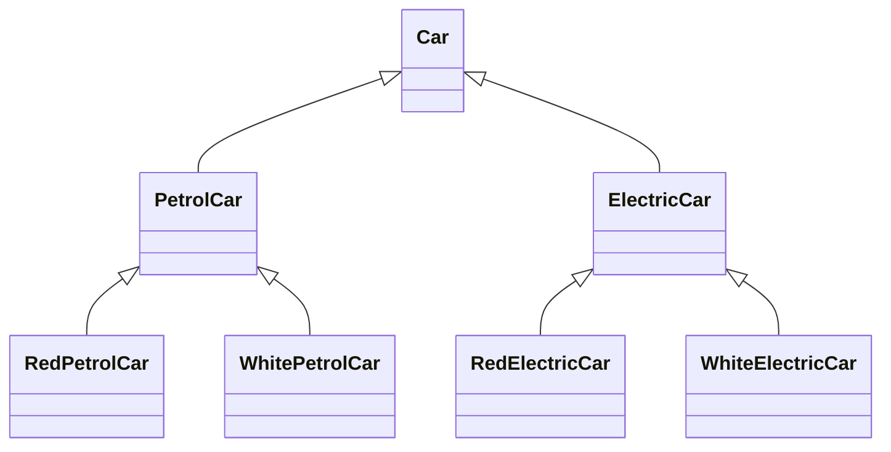
```mermaid
classDiagram
	Car <|-- PetrolCar
	Car <|-- ElectricCar
	PetrolCar <|-- RedPetrolCar
	PetrolCar <|-- WhitePetrolCar
	ElectricCar <|-- RedElectricCar
	ElectricCar <|-- WhiteElectricCar
```

这种就产生了很多子类，如果还有新的分类，子类将特别多，因此改为聚合复用。

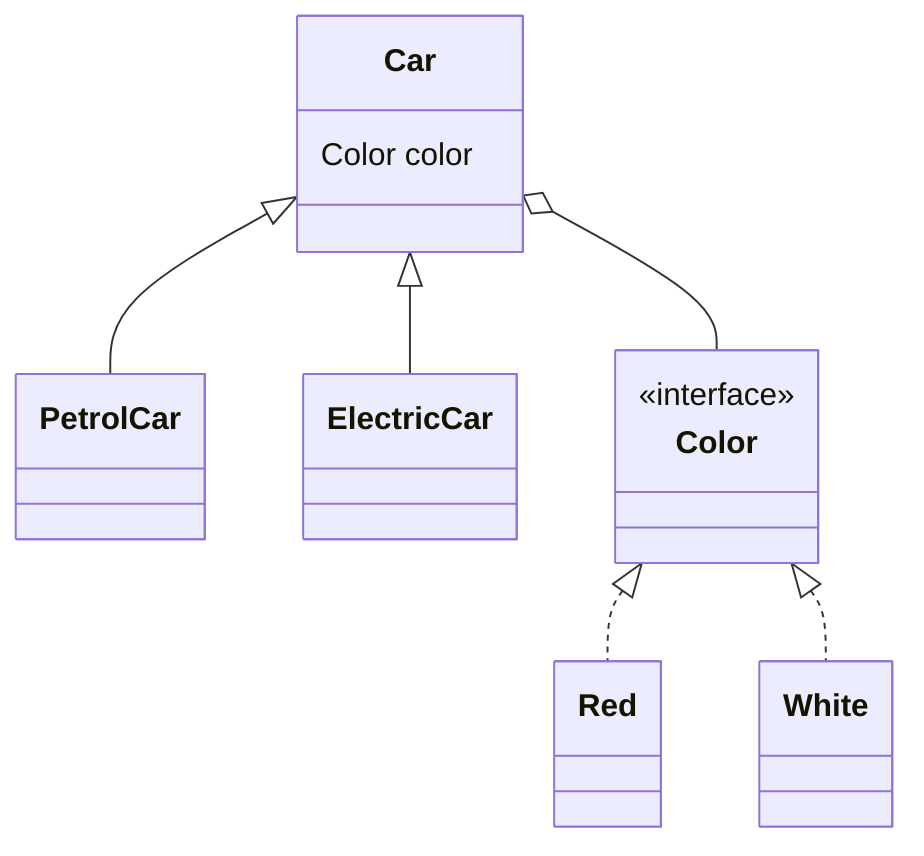
```mermaid
classDiagram
	Car <|-- PetrolCar
	Car <|-- ElectricCar
	Car: Color color
	class Color
	<<interface>> Color
	Color <|.. Red
	Color <|.. White
	Car o-- Color
```

## 设计模式—创建者模式

> 主要关注点是：将对象的创建和使用分离

### 1. 单例模式

提供了一种创建对象的绝佳方式；这种方法这涉及一个类，并且只能创建单个对象，提供了一种外界只能访问其唯一对象的方式，不需要实例化该类的对象。

单例模式的角色：

* 单例类，只能创建一个对象的类
* 访问类：是使用单例类

分为两类：

* 饿汉式

  > 类加载的时候该实例就会被创建，但是如果一直不用就会造成内存浪费

  1. 静态成员变量的方式创建

     使用`private`修饰默认构造函数，使其无法创建对象。

     使用静态方法来返回静态成员。

     ```java
     public class Singleton {
         private Singleton() {}
     
         private static Singleton instance = new Singleton();
         
         public static Singleton getInstance() {
             return instance;
         }
     }
     ```

  2. 使用静态代码块的方式实现

     ```java
     public class Singleton {
         // 饿汉式2
         private Singleton() {}
     
         private static Singleton instance;
     
         static {
             instance = new Singleton();
         }
     
         public static Singleton getInstance() {
             return instance;
         }
     }
     ```

* 懒汉式

  首次使用实例的时候才会创建

  1. 方式一（==线程不安全==）

     ```java
     public class Singleton {
         // 懒汉式1，存在线程不安全的问题
         private Singleton() {}
     
         private static Singleton instance;
     
         public static Singleton getInstance(){
             if (instance == null)instance = new Singleton();
             return instance;
         }
     }
     ```

  2. 方式二（线程安全）

     ```java
     public class Singleton {
         // 懒汉式2
         private Singleton() {}
     
         private static Singleton instance;
     
         public static synchronized Singleton getInstance(){
             if (instance == null)instance = new Singleton();
             return instance;
         }
     }
     ```

  3. 方式三（双重检查锁）

     对于`getInstance()`方法来说，大部分情况都是读操作，而读操作的是线程安全的，因此没必要在每次读取的时候加一个锁，需要调整加锁的时机，即双重检查锁。

     ❓这里为什么需要两个if？

     ```java
     public class Singleton {
         private Singleton () {}
     
         private static volatile Singleton instance;
     
         public static Singleton getInstance() {
             if (instance == null){
                 synchronized (Singleton.class){
                     if (instance == null){
                         instance = new Singleton();
                     }
                 }
             }
             return instance;
         }
     }
     ```

     > 添加`volataile`关键字后在多线程下还能保持安全，保证实例化是顺序！

  4. 方式四（静态内部类方式）

     实例由静态内部类创建，由于JVM在加载外部类的时候，是不会加载内部类的，只有将内部类的属性/方法被调用时才会加载，并且初始化静态属性；

     并且静态属性被`static`关键字修饰，保证只被实例化一次，并且严格保证实例化的顺序。

     ```java
     public class Singleton {
         // 懒汉式3 静态内部类方式
         private Singleton() {}
     
         private static class SingletonHolder{
             private static final Singleton INSTANCE = new Singleton();
         }
     
         public static Singleton getInstance(){
             return SingletonHolder.INSTANCE;
         }
     }
     ```

  5. 方式五（枚举方式）

     > 枚举类型线程安全，并且只会装载一次，唯一一个不会被破坏的方式

​				属于恶汉式（不考虑内存空间）

<h4>单例模式存在的问题</h4>

破坏单例模式：使用序列化和反射，使得单例模式创建多个对象。

🔵序列化破坏单例模式：

> 对于`Singleton`类需要实现`Serializable`接口，在输出序列化对象之后再进行读取两次，就会获取到不同地址引用的对象，从而破坏单例模式。

```java
public class Destroy {
    public static void main(String[] args) throws Exception {
        OutputObj();
        Singleton ins1 = readObj();
        Singleton ins2 = readObj();
        System.out.println(ins1 == ins2);   // false
    }

    public static Singleton readObj() throws Exception {
        ObjectInputStream ois = new ObjectInputStream(new FileInputStream("./a.txt"));
        return (Singleton) ois.readObject();
    }

    public static void OutputObj() throws IOException {
        ObjectOutputStream oos = new ObjectOutputStream(new FileOutputStream("./a.txt"));
        Singleton ins = Singleton.getInstance();
        oos.writeObject(ins);
    }
}
```

🔵反射破坏单例模式

> 看不太懂，太菜了

```java
// 反射破坏单例模式
public class Destroy {
    public static void main(String[] args) throws Exception {
        // 1 获取Singleton字节码对象
        Class clazz = Singleton.class;
        // 2 获取无参构造方法对象
        Constructor cons = clazz.getDeclaredConstructor();
        // 3 取消访问检查
        cons.setAccessible(true);
        // 4 创建Singleton对象
        Singleton s1 = (Singleton) cons.newInstance();
        Singleton s2 = (Singleton) cons.newInstance();
        System.out.println(s1 == s2);   // false
    }
}
```

🔵解决被序列化反射破坏单例模式的问题

* 解决序列化

  在`Singleton`对象中添加`readResolve()`方法，在反序列化时被反射调用，如果定义了这个方法，就返回这个方法的值；如果没有定义就返回新new出来的对象。
  
  ```java
  public class Singleton implements Serializable {
      // 饿汉式1
      private Singleton() {
      }
  
      private static Singleton instance = new Singleton();
  
      public static Singleton getInstance() {
          return instance;
      }
  
      // Repair 修复这个bug
      public Object readResolve(){
          return getInstance();
      }
  }
  ```

* 解决反射

  ```java
  public class Singleton {
      // 饿汉式1
      private static boolean flag = false;
  
      private Singleton() {
          // 修复反射
          synchronized (Singleton.class){
              if (flag){
                  throw new RuntimeException("不能创建多个实例");
              }
              flag = true;
          }
      }
  
      private static Singleton instance = new Singleton();
  
      public static Singleton getInstance() {
          return instance;
      }
  }
  ```

<h4>Singleton案例——Runtime类</h4>

> Runtime类使用的就是单例设计模式

代码：

```java
public class Runtime {
    private static final Runtime currentRuntime = new Runtime();

    /**
     * Returns the runtime object associated with the current Java application.
     * Most of the methods of class {@code Runtime} are instance
     * methods and must be invoked with respect to the current runtime object.
     *
     * @return  the {@code Runtime} object associated with the current
     *          Java application.
     */
    public static Runtime getRuntime() {
        return currentRuntime;
    }

    /** Don't let anyone else instantiate this class */
    private Runtime() {}
    
    // ...
}
```

简单使用`Runtime`类

```java
public class RuntimeDemo {
    public static void main(String[] args) throws IOException {
        Runtime runtime = Runtime.getRuntime();

        Process exec = runtime.exec("ipconfig");
        InputStream is = exec.getInputStream();
        byte arr[] = new byte[1024*1024 * 100];
        int len = is.read(arr);
        String s = new String(arr, 0, len, "GBK");
        System.out.println(s);

        System.out.println("Java虚拟机的内存总量：" + runtime.totalMemory());
        //  Java虚拟机的内存总量：264241152
        System.out.println("Java虚拟机试图使用的最大内存量：" + runtime.maxMemory());
        // Java虚拟机试图使用的最大内存量：4200595456
    }
}
```

### 2. 工厂模式（2种）

举例设计一个咖啡点餐系统

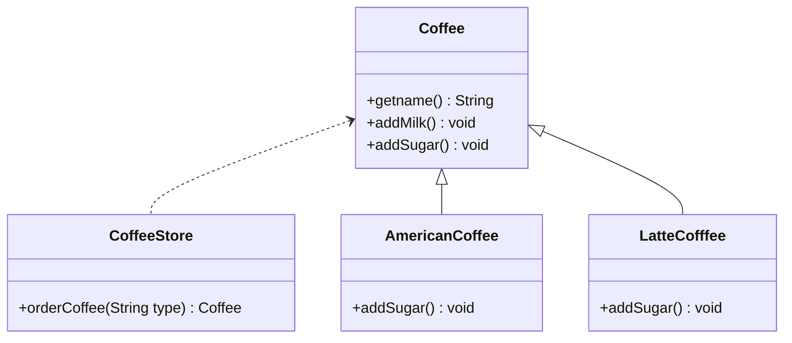
```mermaid
classDiagram
	Coffee <.. CoffeeStore
	Coffee <|-- AmericanCoffee
	Coffee <|-- LatteCofffee
	CoffeeStore: +orderCoffee(String type) Coffee
	class Coffee{
		+getname() String
		+addMilk() void
		+addSugar() void
	}
	AmericanCoffee:+addSugar() void
	LatteCofffee:+addSugar() void
```

对应代码：

```java
public class CoffeeStore {
    public Coffee orderCoffee(String type){
        Coffee coffee;
        if (type.equals("american"))coffee = new AmericanCoffee();
        else if(type.equals("latte")) coffee = new LatteCoffee();
        else throw new RuntimeException("No this type of coffee.");

        coffee.addMilk();
        coffee.addSugar();

        return coffee;
    }
}
```

存在的问题：

如果新添加一种咖啡，就需要在`CoffeeStore`类中进行重新修改代码，这就违背了开闭原则，引用一个工厂来进行解耦合。

<h4>简单工厂模式</h4>

> 严格上来说，简单工厂模式不是一种设计模式，而是一个编程习惯

分为以下角色：

* 抽象产品：（interface）定义了产品的规范，描述了其主要特性和功能
* 具体产品：（实现接口）实现和继承抽象产品的子类
* 具体工厂：提供创建产品的方法

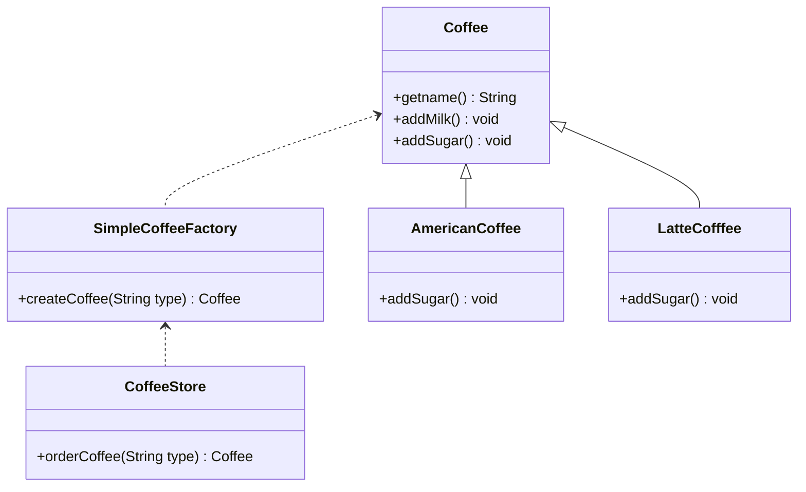
```mermaid
classDiagram
	Coffee <.. SimpleCoffeeFactory
	SimpleCoffeeFactory <..  CoffeeStore
	Coffee <|-- AmericanCoffee
	Coffee <|-- LatteCofffee
	CoffeeStore: +orderCoffee(String type) Coffee
	class Coffee{
		+getname() String
		+addMilk() void
		+addSugar() void
	}
	class SimpleCoffeeFactory{
		+createCoffee(String type) Coffee
	}
	AmericanCoffee:+addSugar() void
	LatteCofffee:+addSugar() void
```

对应代码：

工厂中的代码和原来`CoffeeStore`创建`Coffee`的代码类似。

> 也可以将`orderCoffee`方法设置为静态方法，方便调用，不需要再创建工厂对象。

```java
package com.yz.pattern.creator.factory.simpleFactory;

public class CoffeeStore {
    public Coffee orderCoffee(String type){
        SimpleCoffeeFactory factory = new SimpleCoffeeFactory();
        Coffee coffee = factory.createCoffee(type);
        coffee.addMilk();
        coffee.addSugar();
        return coffee;
    }
}
```

优缺点：

* 这样就解除了`CoffeeStore`和`Coffee`的实现类耦合。
* 产生了新的`SimpleCoffeeFactory`和`Coffee`的实现类耦合，还是违背了开闭原则。

<h4>工厂方法模式</h4>

角色：

* 抽象产品：（interface）定义了产品的规范，描述了其主要特性和功能
* 具体产品：（实现接口）实现和继承抽象产品的子类
* 抽象工厂：创建者提供创建具体工厂来创建实例
* 具体工厂：实现创建产品的接口，提供创建产品的方法

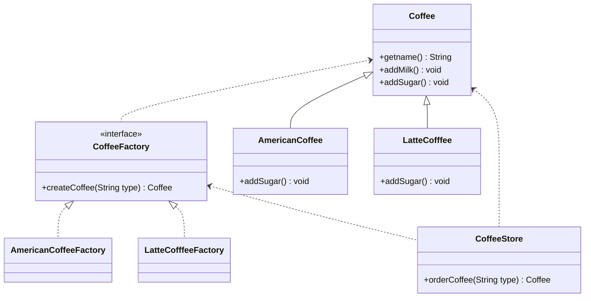
```mermaid
classDiagram
	Coffee <.. CoffeeFactory
	Coffee <|-- AmericanCoffee
	Coffee <|-- LatteCofffee
	CoffeeFactory <|.. AmericanCoffeeFactory
	CoffeeFactory <|.. LatteCofffeeFactory
		CoffeeFactory <..  CoffeeStore
	Coffee <..  CoffeeStore
	CoffeeStore: +orderCoffee(String type) Coffee
	class Coffee{
		+getname() String
		+addMilk() void
		+addSugar() void
	}
	class CoffeeFactory{
		+createCoffee(String type) Coffee
	}
	AmericanCoffee:+addSugar() void
	LatteCofffee:+addSugar() void
	<<interface>> CoffeeFactory
```

优缺点：

* 用户需要知道具体工厂名称就可以得到对应的产品；增加新产品的时候只需要添加对应的具体工厂类即可，满足开闭原则
* 缺点：每增加一个产品就需要实现一个具体工厂类，增加了复杂类

<h4>抽象工厂模式</h4>

之前的工厂模式只考虑一类产品，而抽象工厂模式将要考虑的是**多级别产品的生产**

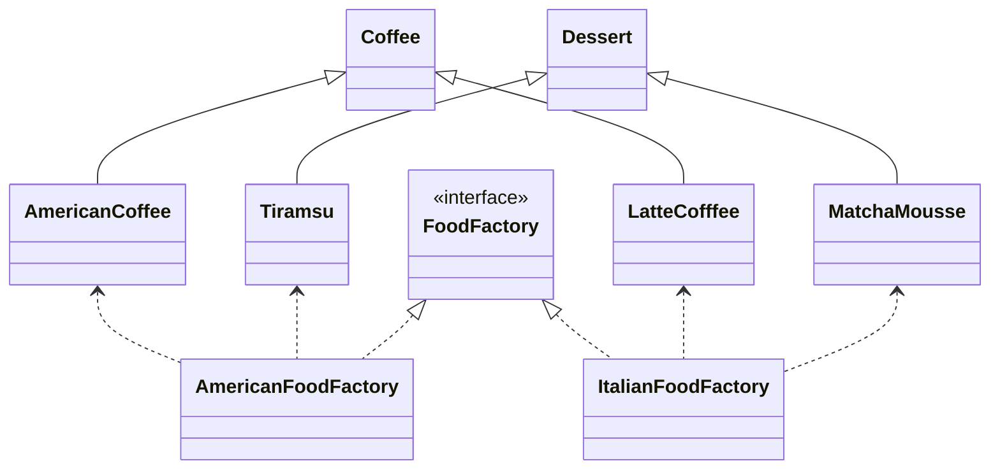
```mermaid
classDiagram
	Coffee <|-- AmericanCoffee
	Coffee <|-- LatteCofffee
	Dessert <|--Tiramsu
	Dessert <|--MatchaMousse
	
	AmericanCoffee <.. AmericanFoodFactory
	Tiramsu <.. AmericanFoodFactory
	
	FoodFactory <|.. AmericanFoodFactory
	FoodFactory <|.. ItalianFoodFactory
	
	LatteCofffee <.. ItalianFoodFactory
	MatchaMousse <.. ItalianFoodFactory
	
	<<interface>> FoodFactory

```

如果还要增加一个产品的话，所有的类都可能需要修改。

使用场景：需要创建的对象是一系列的产品族，换的是一整套的系统

<h4>工厂模式之模式扩展</h4>

在开发中有一种固定的开发套路：**简单模式+配置文件接触耦合**，类似Spring框架，利用反射的机制进行对象取出。

第一步：定义配置文件

```java
american=com.yz.pattern.creator.factory.config_factory.AmericanCoffee
latte=com.yz.pattern.creator.factory.config_factory.LatteCoffee
```

第二步：编写Factory类：

```java
public class CoffeeFactory {

    private static HashMap<String, Coffee> map = new HashMap<>();

    // 加载文件只需要加载一次
    static {
        Properties p = new Properties();
        InputStream is = CoffeeFactory.class.getClassLoader().getResourceAsStream("bean.properties");
        try {
            p.load(is);
            // 创建对应的对象
            Set<Object> keySet = p.keySet();
            for (Object k : keySet) {
                String className = p.getProperty((String) k);
                Coffee coffee = (Coffee) Class.forName(className).getDeclaredConstructor().newInstance();
                map.put((String) k, coffee);
            }
        } catch (Exception e) {
            e.printStackTrace();
        }

    }

    public static Coffee createCoffee(String name) {
        Coffee coffee = map.get(name);
        return coffee;
    }
}
```

<h4>JDK源码扩展——Collection.iterator方法</h4>


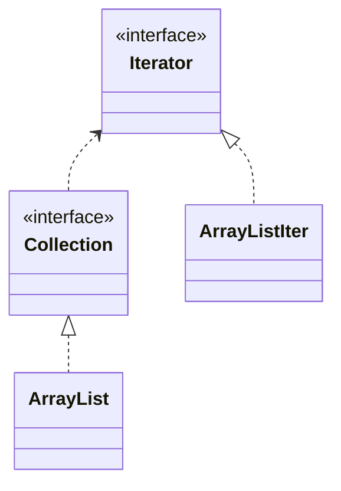
```mermaid
classDiagram
	Iterator <.. Collection
	<<interface>> Collection
	<<interface>> Iterator
	Collection <|.. ArrayList
	Iterator <|.. ArrayListIter
```

`Iterator`就是抽象产品类，`ArrayList$Iter`属于具体产品；`Collection`是抽象工厂类，`ArrayList`就是具体工厂。

### 3. 原型模式

> 用一个已经创建好的实例作为原型，提供复制该原型对象来创建一个和原型对象相同的新对象

结构：

* 抽象原型类：规定原型对象必须实现的`clone()`方法
* 具体原型类：实现抽象原型对象中的`clone()`方法，他是可被复制的对象
* 访问类：使具体原型类中的`clone()`方法来复制新的对象

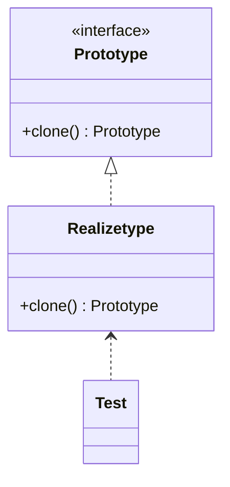
```mermaid
classDiagram
	Prototype <|.. Realizetype
	Realizetype <.. Test
	class Prototype{
		+clone() Prototype
	}
	class Realizetype{
		+clone() Prototype
	}
	<<interface>> Prototype
```

<h4>实现-浅克隆</h4>

> 克隆分为浅克隆和深克隆，浅克隆中非基本属性，仍指向原有属性中的对象地址

在Java中`Cloneable`就是克隆抽象原型类，克隆的对象不是通过`new`来创建的。

```java
package com.yz.pattern.creator.prototype.demo1;

public class RealizeType implements Cloneable{
    @Override
    protected RealizeType clone() throws CloneNotSupportedException {
        System.out.println("Copy!");
        return (RealizeType) super.clone();
    }
}
```

测试：

```java
public class Test {
    public static void main(String[] args) throws CloneNotSupportedException {
        RealizeType t = new RealizeType();
        RealizeType clone = t.clone();
        System.out.println(clone == t);					// false
        System.out.println(clone.person == t.person);   // true 浅克隆
    }
}
```

<h4>实现-深克隆</h4>

这种情况的话需要使用对象流(`ObjectOutputStream, ObjectInputStream`)

> 对于具体原型和其引用属性都需要实现`Serializable`才能够序列化

```java
public class RealizeType implements Cloneable, Serializable {

    public Person person;

    public RealizeType() {
        this.person = new Person();
    }

    @Override
    protected RealizeType clone() throws CloneNotSupportedException {
        RealizeType realizeType = null;
        try {
            ObjectOutputStream oos = new ObjectOutputStream(new FileOutputStream("./objClone"));
            oos.writeObject(this);
            oos.close();

            ObjectInputStream ois = new ObjectInputStream(new FileInputStream("./objClone"));
            realizeType = (RealizeType) ois.readObject();
            return realizeType;
        } catch (IOException | ClassNotFoundException e) {
            e.printStackTrace();
        }
        return realizeType;
    }
}
```

### 4. 建造者模式

> 将一个复杂对象的构建与表示分离

构造有builder来负责，装配有director来负责。

建造者模式中的四个角色：

* 抽象建造者类（builder）：接口规定实现复杂对象部分的创建
* 具体建造者类（ConcreteBuilder）：实现builder接口，完成具体创建不同部件。
* 产品类（product）：要创造的复杂的对象。
* 指挥者类（Director）：保证部分完成创建。

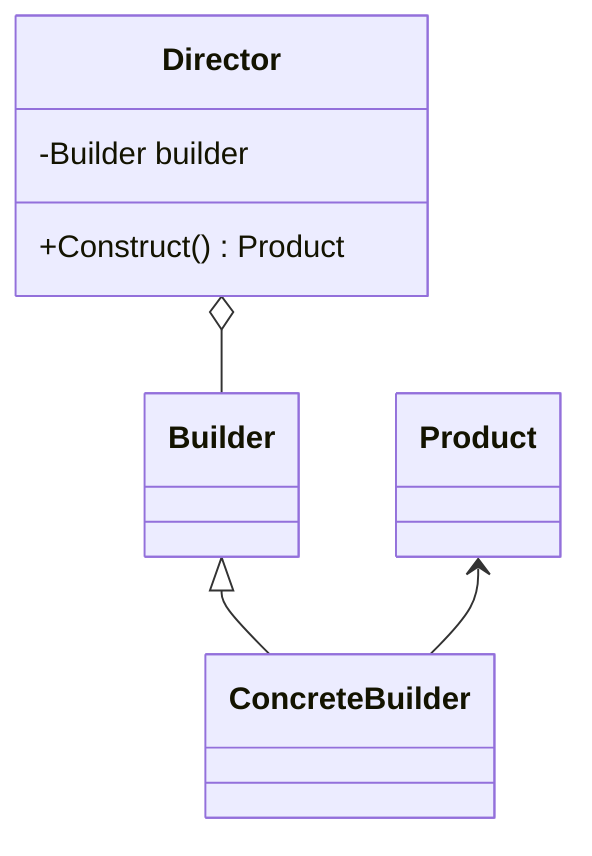
```mermaid
classDiagram
	Director o-- Builder
	Director: -Builder builder
	Director: +Construct() Product
	Builder <|-- ConcreteBuilder
	Product <-- ConcreteBuilder
```

举例（创建自行车案例）：

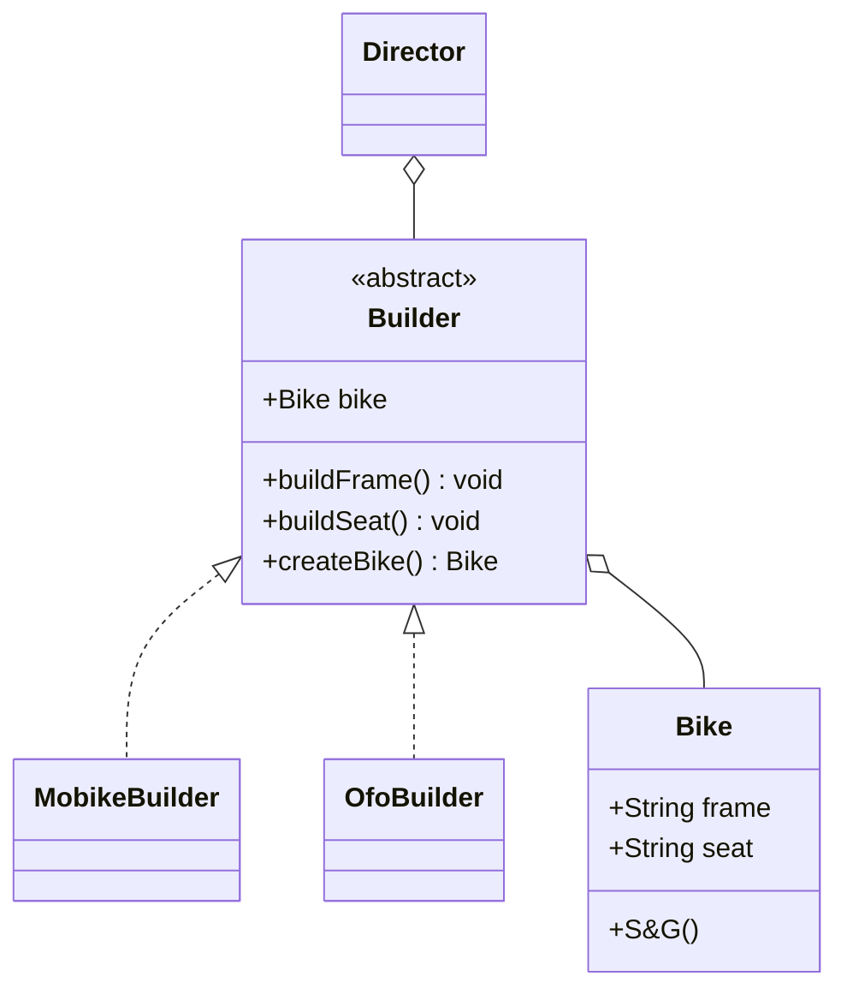
```mermaid
classDiagram
	class Builder{
		+Bike bike
		+buildFrame() void
		+buildSeat() void
		+createBike() Bike
	}
	class Bike{
		+String frame
		+String seat
		+S&G()
	}
	
	<<abstract>> Builder
	Builder <|.. MobikeBuilder
	Builder <|.. OfoBuilder
	Builder o-- Bike
	Director o-- Builder
```

**优缺点**：

* 封装性很好，客户端不需要了解产品内部的细节，符合开闭原则。
* 建造者模式的产品大部分情况下需要有较多的共同点。

**使用场景：**

在其产品的各个部分经常面临发生剧烈的变化，使得他们组合在一起的时候算法又十分的稳定。

<h4>模式扩展</h4>

在开发中还有一种常用的方式，就是当一个类构造器需要传入多个参数的时候，如果创造这个类就会导致代码的可读性很差，而且容易引入错误，需要使用建造者模式对代码进行重构。

改造前：

```java
public class Phone {
    private String camera, cpu, screen, battery;

    @Override
    // Getter and Setters And toString method.
}

public class Test{
    public static void main(String[] args) {
        Phone phone = new Phone("Leica", "Intel", "JDF", "NingDeEra");
        System.out.println(phone);
    }
}
```

如果参数更多的话，就会导致代码的可读性变差，成本升高。

新创建方式：

```java
public class Phone {
    private String camera, cpu, screen, battery;

    private Phone(Builder builder) {
        this.camera = builder.camera;
        this.cpu = builder.cpu;
        this.screen = builder.screen;
        this.battery = builder.battery;
    };

    public static final class Builder{
        private String camera, cpu, screen, battery;

        public Builder camera(String camera){
            this.camera = camera;
            return this;
        }
        public Builder cpu(String cpu){
            this.cpu = cpu;
            return this;
        }
        public Builder screen(String screen){
            this.screen = screen;
            return this;
        }
        public Builder battery(String battery){
            this.battery = battery;
            return this;
        }

        public Phone build(){
            return new Phone(this);
        }
    }
}
// Main
    public static void main(String[] args) {
        Phone phone = new Phone.Builder()
                .camera("Leca")
                .cpu("Amd")
                .screen("jdf")
                .battery("NingDe")
                .build();
        System.out.println(phone);
    }
```

可以链式调用，无需指定对应的顺序和方法，并且清楚明了。

### 5. 总结与对比

* 工厂模式和建造者模式

  工厂方法注重的是整体的创建方式，而建造者模式注重的是组件的创建方法。

* 抽象工厂模式和建造者模式

  抽象工厂是注重于对产品家族的创建；建造者模式是按照步骤来构建产品。

## 设计模式—结构性模式

结构性模式是将类和对象按照某种布局组成更大的结构，分为类结构型模式和对象型结构模式。

分为7种：

* 代理模式
* 适配器模式
* 装饰者模式
* 桥接模式
* 外观模式
* 组合模式
* 享元模式

### 1. 代理模式

由于某些原因需要给某个对象提供一个代理以控制该对象的访问，访问对象不适合直接访问和引用目标对象，代理对象是访问对象和目标对象的中介。

Java中的代理又分为动态代理和静态代理。动态代理又分为JDK代理和CGLib代理。

结构：

* 抽象主题（Subject）类：定义了代理对象需要实现的具体方法
* 真实主题（Real Subject）类：代理对象所代理的真实对象
* 代理（Proxy）类

<h4>静态代理：</h4>

类图（火车站买票样例）：

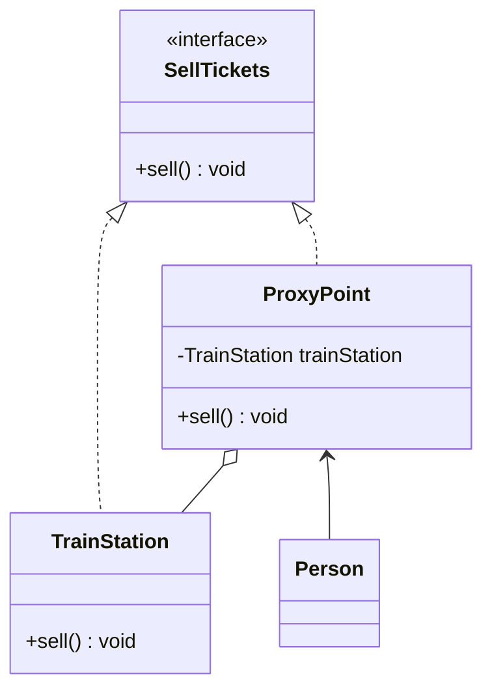
```mermaid
classDiagram
	SellTickets <|.. TrainStation
	SellTickets <|.. ProxyPoint
	ProxyPoint o-- TrainStation
	SellTickets: +sell() void
	ProxyPoint: -TrainStation trainStation
	ProxyPoint: +sell() void
	TrainStation: +sell() void
	ProxyPoint <-- Person
	<<interface>> SellTickets
```

即在`ProxyPoint`类中的`sell`方法调用`TrainStation`类中的`sell`方法。

<h4>JDK动态代理：</h4>

没有代理类，而是在JDK运行的过程中进行代理。使用的JDK中的`java.reflection.Proxy`包中的对象，使用的是`newProxyInstance`方法来实现，需要添加的功能在对象的`InvocationHandler`的`invoke`方法实现。

实现一个proxyFactory

```java
public class ProxyFactory {

    private SellTickets trainStation = new TrainStation();

    public SellTickets getProxyObj() {
        SellTickets instance = (SellTickets) Proxy.newProxyInstance(
                trainStation.getClass().getClassLoader(),
                trainStation.getClass().getInterfaces(),
                new InvocationHandler() {
                    /*
                    Object proxy 就是要返回的代理对象
                    Method method 就是对接口中进行封装的方法
                    Object[] args 调用方法的实际参数
                    返回值：就是方法的返回值
                     */
                    @Override
                    public Object invoke(Object proxy, Method method, Object[] args) throws Throwable {
                        // invoke
                        Object obj = method.invoke(trainStation, args);
                        if (method.getName().equals("sell")){
                            System.out.println("代理买票收取费用");
                        }
                        return obj;
                    }
                });
        /*
        (ClassLoader loader,            类加载器，加载代理类
          Class<?>[] interfaces,        代理类的接口对象
          reflect.InvocationHandler h   代理对象调用的处理程序
         */
        return instance;
    }
}
```

<h4>CGLib动态代理：</h4>

JDK动态代理是必须要定义类的接口，对于没有接口的类因此就需要CGLib代理。

添加依赖：

```xml
<dependency>
    <groupId>cglib</groupId>
    <artifactId>cglib</artifactId>
    <version>3.3.0</version>
</dependency>
```

使用Enhancer来进行代理设置：

1. 创建Enhancer对象
2. 设置目标代理类
3. 设置回调函数，实现`MethodInterceptor`
4. 实现`intercept`函数，其他类似JDK静态代理。

```java
public class ProxyFactory implements MethodInterceptor {

    public TrainStation trainStation = new TrainStation();

    public TrainStation getProxtObj() {
        // 创建Enhancer对象，类似jdk中的Proxy
        Enhancer enhancer = new Enhancer();
        // 设置目标类字节码
        enhancer.setSuperclass(TrainStation.class);
        // 设置callback
        enhancer.setCallback(this);
        // 创建代理对象
        TrainStation o = (TrainStation) enhancer.create();
        return o;
    }

    @Override
    public Object intercept(Object o, Method method, Object[] objects, MethodProxy methodProxy) throws Throwable {
//        System.out.println(o.getClass().getName());
        if (method.getName().equals("sell")) System.out.println("Proxy fees.");
        method.invoke(trainStation, objects);
        return null;
    }
}
```

<h4>优缺点</h4>

CGLib是动态生成目标类的子类，JDK1.8后效率高于CGlib代理。静态代理要比动态代理麻烦。

* 代理对象可以对原来的类起到保护的作用
* 用于类功能的扩展
* 增加了系统的复杂度

使用场景：

* 远程代理，类似rpc
* 防火墙代理
* 保护代理

### 2. 适配器模式

适配器：比如出国旅游的话，各个国家电压标准不同，需要使用到不同的适配器。手机充电器也类似。

> 将一个类的接口，转换为另一个类的接口，使得原有不能一起使用的类可以共同工作。分为类适配器和对象适配器模式。

结构：

* 目标Target接口：当前业务所期待的接口（类似欧洲国家的插座）
* 适配者Adaptee类：被访问或者适配现存组件的类（）
* 适配器Adapter类：转换器类，把适配者的接口转为目标接口

<h4>类适配器模式</h4>

举例（读卡器案例）：

一台电脑只能读取SD卡，如果要读取TF卡就需要使用到适配器模式

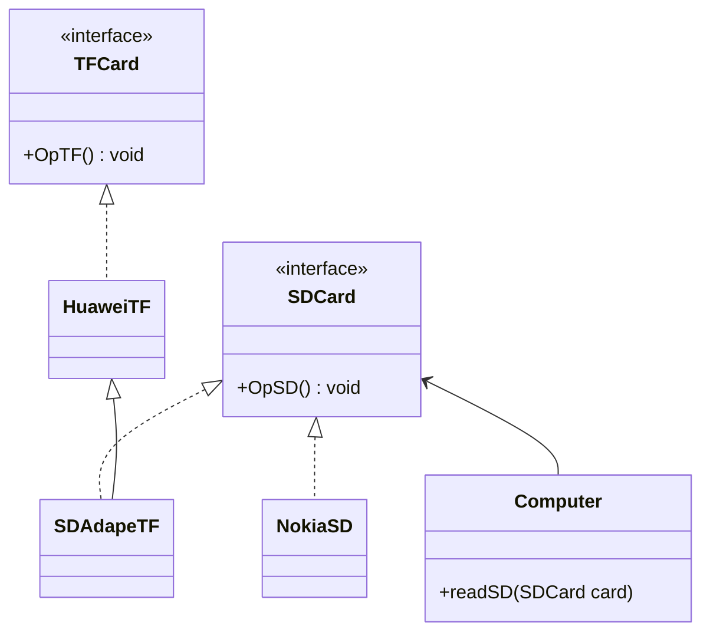
```mermaid
classDiagram
	class SDCard{
		+OpSD() void
	}
	<<interface>> SDCard
	SDCard <|.. NokiaSD
	SDCard <|.. SDAdapeTF
	SDCard <-- Computer
	Computer: +readSD(SDCard card)
	HuaweiTF <|-- SDAdapeTF
	class TFCard{
		+OpTF() void
	}
	<<interface>> TFCard
	TFCard <|.. HuaweiTF
	
	
```

这个类适配器**继承**了`HuaweiTF`类和**实现**了`SDCard`类，类适配器明显违反了合成复用原则，如果新添加一个TF卡，就还需要修改代码。

<h4>对象适配器</h4>

对类适配器进行修改，对于`TFCard`采用聚合的方式进行处理：

```mermaid
classDiagram
	class SDCard{
		+OpSD() void
	}
	<<interface>> SDCard
	SDCard <|.. NokiaSD
	SDCard <-- Computer
	Computer: +readSD(SDCard card)
	SDCard <|.. SDAdapeTF
	TFCard o-- SDAdapeTF
	SDAdapeTF: -TFCard tfcard
	class TFCard{
		+OpTF() void
	}
	<<interface>> TFCard
	TFCard <|.. HuaweiTF
```

<h4>应用场景</h4>

* 旧的系统需要应用到新的系统，进行无缝对接

在JDK中`Reader`字符流和`InputStream`字节流的适配使用的是`StreamDecoder`, `StreamDecoder`继承了`Reader`聚合了`InputStream` 。

### 3. 装饰者模式

在不改变现有的对象结构模式下，动态的增加一些功能。

结构：

* 抽象构件（Component）定义一个抽象接口
* 具体构件（Concrete Component）实现抽象构件
* 抽象装饰（Decorate）继承或者实现抽象构件，并且包含具体构件的实例，可以通过其子类扩展具体构件的功能
* 具体装饰（ConcreteDecorate）实现抽象装饰的方法

案例：

```mermaid
classDiagram
	class FastFood{
		-float price;
		-String desc;
		+GAS() void
		+cost() float
	}
	
	class FriedNoodle{
		+cost() float
	}
	
	class FriedRice{
		+cost() float
	}
	
	FastFood <|-- FriedNoodle
	FastFood <|-- FriedRice
	
	class Decorator{
		+FastFood fastfood
		+G_S()
		+Decorator(FastFood ff, float price, String desc)
	}
	
	FastFood <|-- Decorator
	Decorator o-- FastFood
	class Egg{
		+Egg(FastFood ff) void
		+cost() void
	}
	
	class Bacon{
		+Bacon(FastFood ff) void
		+cost() void
	}
	
	Decorator <|-- Egg
	Decorator <|-- Bacon
```

> 注意！这里的装饰器`Decorator`**继承并且聚合**`FastFood`

这种方法增强了扩展性，使用子类包含父类实例的方法，减少了类的数量，十分灵活，并且装饰者和被装饰者可以独立扩展，互不影响。

使用场景：

* 每增加一个类，就会产生很多类的组合。

在JDK中的`Writer, InputStreamWriter, FileWriter, BufferedWriter, BufferdInputStream`就是这种关系。

<h4>代理和装饰者之间的关系</h4>

相同点：

* 都要实现和目标类的接口
* 在类中都要声明目标对象
* 可以增强目标方法

不同点：

* 装饰者类是为了增强目标（由外部传入），代理类用于隐藏目标对象（由代理类构建）

### 4. 桥接模式

> 每次在添加一个维度的时候都需要新增多个子类，会造成类爆炸，扩展不灵活。

结构：

* 抽象化角色（Abstraction）：定义抽象类，并且包含一个实现化对象的引用。
* 扩展抽象化（Refined Abstraction）角色：抽象化角色的子类，实现父类的业务方法，通过组合关系实现。
* 实现化（Implementor）角色：定义实现化角色的接口，供扩展抽象化角色调用
* 具体实现化（Concrete Implementor）角色：具体实现。

案例（视频播放器）：

比如需要开发一个跨平台的播放器，可以在不同的操作系统上播放不同的格式的视频类型，比如AVI，RMVB，WMV和MP4格式等。

```mermaid
classDiagram
	class OS{
		+VideoFile video
		+play(string file) void
	}
	<<abstract>> OS
	OS <|-- Win
	OS <|-- Mac
	OS o-- VideoFile
	class VideoFile{
		+decode(string file) void
	}
	AVIFile --|> VideoFile
	MP4File --|> VideoFile
```

桥接模式提高了模块的可扩展性，降低了耦合性；使用组合关系代替继承关系，避免了类爆炸的情况；

### 5. 外观模式

> 外观模式（Facade Pattern）隐藏系统的复杂性，并向客户端提供了一个客户端可以访问系统的接口。这种类型的设计模式属于结构型模式，它向现有的系统添加一个接口，来隐藏系统的复杂性。

也是**迪米特法则**的典型应用。

结构：

* 外观（Facade）角色：为多个子系统提供一个共同的接口
* 子系统（Sub system）角色：内部系统的实现细节。

案例（智能音箱）：

使用智能音箱来控制灯、电视、冰箱和空调等。

```mermaid
classDiagram
	class SmartVoice{
		+TV tv
		+Light light
		+AirConditioner ac
		+Control() void
	}
	SmartVoice o-- TV
	SmartVoice o-- Light
	SmartVoice o-- AC
	SmartVoice <-- Person
```

特点：

* 降低了子系统和客户端之间的耦合性
* 屏蔽了复杂子系统的细节
* 但是不符合开闭原则，子系统发生改变，外观也需要进行改变。

举例：

在tomcat中，`HttpServletRequest`分别由两个子类`RequestFacade`和`Request`，并且`RequestFacade`聚合了`Request`。

### 6. 组合模式

> 组合模式（Composite Pattern）又名部分整体模式，用于把一组相似的对象当作一个单一的对象。组合模式依据属性结构来进行组合对象，用来表示部分以及整体的层次，创建了对象组的树形结构。

结构中主要分为三个角色：

* 抽象根节点（Component）：定义系统各层次对象的共有方法和属性，可以预先定义一些默认行为和属性。
* 树枝节点（Composite）：定义树枝节点的行为，可以存储子节点，组合树枝节点和叶子节点的树形结构。
* 叶子节点（Leaf）：叶子节点对象，其下再无分支，是系统层次遍历的最小单位。

案例（软件菜单）：

​		在访问管理系统时候，经常可以看到菜单，一个菜单可以包含子菜单项，也可以包含具有子菜单项的菜单。类似于文件管理的结构。目的就是给定一个菜单，打印其所有子菜单项。

```mermaid
classDiagram
	class MenuComponent {
		+String name
		+int level
		+add(MenuComponent menu) void
		+remove() void
		+getChild()
	}
	
	class Menu{
		-List<MenuCompoent> menuList
		+add(MenuComponent menu) void
		+remove() void
		+getChild() MenuComponent
	}
	
	class MenuItem {
		+MenuItem(String name, int level)
	}
	MenuComponent <|-- Menu
	Menu o-- MenuComponent
	MenuComponent <|-- MenuItem
	MenuComponent <-- Client
	
```

组合模式又可以分为两类，一个是透明组合模式，另一个是安全组合模式。

但是透明组合模式是不够安全，叶子对象与树枝节点有着本质的区别，因为叶子节点不能进行添加和删除节点。

特点：

* 组合模式可以清晰的定义分层次的复杂对象
* 在组合模式中添加节点都很方便，符合开闭原则

### 7. 享元模式

> 享元模式(Flyweight)，运用共享模式来有效的支持大量细粒度对象的复用。通过共享已经存在的对象来大幅度减少需要创建对象的数量，避免大量相似对象的开销，提高系统资源的利用率。

享元模式中存在以下两种状态：

1. 内部状态，不会随着环境的改变而改变的共享部分
2. 外部状态，随环境改变而改变的私有部分。

享元模式中的角色：

* 抽象享元角色（Flyweight）：通常是一个接口或者抽象类，在抽象享元类中声明了享元类的公共方法，向外界提供享元对象的内部数据，也可以设置外部状态。
* 具体享元角色（Concrete Flyweight）：实现抽象享元类；在具体享元类中为内部状态提供了存储空间。可以结合单例模式来设计具体享元类，为每个具体享元类提供唯一的享元对象。
* 非享元角色（Non-sharable Flyweight）：不共享的数据部分
* 享元工厂（Flyweight Factory）：负责创建和管理享元角色。创建享元对象的时候，工厂应该检查系统中是否存在要求的对象，如果存在则之间返回；不存在则创建新的享元对象。

案例（俄罗斯方块）：

​	对于俄罗斯方块，有L型，左L型，正方形，I型等方块。

```mermaid
classDiagram
	class AbstractBox{
		+getShape() String
		+display(String color) void
	}
	
	class BoxFactory {
		-HashMap map
		+getInstance() BoxFactory
		+getBox(String key) AbstractBox
	}
	
	AbstractBox <|-- IBox
	AbstractBox <|-- LBox
	AbstractBox <|-- SBox
	BoxFactory o-- AbstractBox
	AbstractBox <-- Client
	BoxFactory <-- Client
```

优缺点：

* 极大的减少了内存中相似或者相同对象的数目，节约了系统资源，提高系统性能
* 享元模式的外部状态独立，不影响内部状态

Integer 类中在-128~127之间的数字就使用了享元模式。自动装箱和拆箱就使用了 `valueOf` 方法

```java
public static Integer valueOf(int i) {
    if (i >= IntegerCache.low && i <= IntegerCache.high)
        return IntegerCache.cache[i + (-IntegerCache.low)];
    return new Integer(i);
}
```

## 设计模式—行为型模式

用于描述多个类和对象之间协作共同完成任务。

### 1. 模板方法模式

> 模板方法(Template Method)模式，在设计系统时候已经直到算法所需的关键步骤，而且确定了执行顺序，但是某些步骤的具体实现还是未知，或者某些步骤的实现与具体的环境相关。

即在子类可以不改变算法结构的基础上重定义该算法的某些特定步骤。

结构：

* 抽象(Abstract)类：负责给出算法的轮廓和骨架，有模板方法和若干基本方法构成。
  * 模板方法：定义了算法的骨架
  * 基本方法：是模板方法的组成部分，有可以分为三类
    * 抽象方法sad
    * 钩子方法，在抽象类中已经实现，用于判断的逻辑方法和需要子类重写的空方法
* 具体(Concrete)子类：实现定义的模板方法和钩子方法，是实现顶级逻辑的基础。

案例：

​	炒菜的步骤是固定的，分为倒油、热油、倒蔬菜、调理品、翻炒等步骤。

```mermaid
classDiagram
	class AbstractClass{
		+cook() void
		+pourOil() void
		+heatOil() void
		+useVegetable() void
		+fry()
	}
	
	class CookPotato{
		+useVegetable() void
	}
	
	class CookTomato{
		+useVegetable() void
	}
	
	AbstractClass <|-- CookPotato
	AbstractClass <|-- CookTomato
```

特点：

1. 提高了代码的复用性
2. 实现了反转控制，即可以通过父类来调用子类的操作，符合开闭原则。
3. 会导致子类的个数增加

在 JDK 中 InputStream 类就使用了模板方法的模式。

### 2. 策略模式

> 策略(Strategy)模式，该模式定义了一系列的算法，是他们之间可以相互切换，且算法的变换不会影响使用算法的用户。策略模式属于对象行为模式，它提高对算法进行封装，吧使用的算法责任和实现分割，并委派给不同的对象对这些算法进行管理。

系统需要动态的选择某个算法时使用策略模式。

结构：

* 抽象策略(Strategy)模式：接口或者抽象类。
* 具体策略(Concrete Strategy)：实现接口，提供具体的算法实现和行为。
* 环境(Context)类：持有一个策略类的应用，最终给客户端进行使用。

案例：

​	促销互动，公司针对不同的节日推出不同的促销活动，由促销员将活动展示给用户。

```mermaid
classDiagram
	class Strategy {
		+show() void
	}
	
	Strategy <|-- StrategyA
	Strategy <|-- StrategyB
	Strategy <|-- StrategyC
	class SalesMan{
		-Strategy strategy
		+saleManShow() void
	}
	
	SalesMan o-- Strategy
```

特点：

* 策略类之间可以自由切换，易于扩展
* 客户端必须知道所有的策略类，可以通过使用享元模式类减少对象的数量。

JDK 中的 Comparator 类。

### 3. 命令模式

> 命令(Command)模式，将一个请求封装成一个对象，使发出的请求和执行人物的责任分割开。这样两者之间通过命令对象进行沟通，方便将命令对象进行传递、存储、调用以及管理。

结构：

1. 抽象命令(Command)类：定义命令的接口，声明执行的方法
2. 具体命令(Concrete Command)角色：具体的命令，实现命令接口，持有接收者。
3. 接收者(Receiver)角色：真正执行命令的对象。
4. 调用者(Invoker)角色：要求命令对象执行请求，通常会持有命令对象，可以持有很多的命令对象。

案例（服务员案例）：

顾客将订单交给招待员，招待员将订单交给柜台，柜台将订单交给初始做饭。

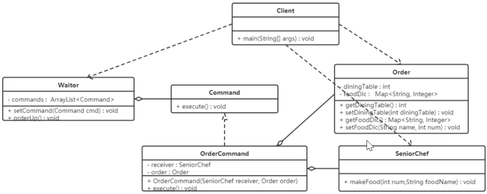

特点：

1. 降低了系统的耦合度，实现了调用操作的对象和实现的对象解耦。
2. 使用命令模式可能会导致过多的具体命令类，系统结构更加复杂。
3. 适合调用者和接收者之间解耦，适合命令的撤销和恢复操作。

在 JDK 中 Runnable 担当命令的角色，Thread 充当的是调用者的角色，start就是执行方法。

### 4. 责任链模式

> 又名职责链模式(Chain of Responsibility Pattern)，为了避免请求处理者与多个请求处理者耦合在一起，将所有的请求处理者通过前一对象记住下一个对象的引用而连成一条链；当有请求发送的时候，请求可以沿着这条链传递，直到有对象满足处理它为止。

生活中经常会出现一个请求有多个对象可以进行处理，但每个对象的处理条件或者权限不同。例如公司员工请假，可以批假的领导有很多，但是不同领导能批准的天数不同，员工必须根据自己要请假的天数找不同的领导去签名。

结构：

1. 抽象处理(Handler)者：定义处理请求的接口，包含抽象方法和后继连接
2. 具体处理(Concrete Handler)者：实现抽象处理者的处理方法，判断是否处理本次请求，如果不可用则交给后继者处理
3. 客户(Client)类：创建处理链，并向连头的具体处理者对象提交请求

案例（请假处理流程）：

```mermaid
classDiagram
	class Handler {
		# NUM_ONE = 1: int
		# NUM_THREE = 3: int
		# NUM_SEVEN = 7: int
		- numStart: int
		- numEnd : int
		- nextHandler : Handler
		+setNextHandler(Handler h) void
		+submit(Request r) void
		+handleReq(Request r) void 
	}
	<<abstract>> Handler
	Handler o-- Handler
	Handler <|-- GroupLeader
	Handler <|-- Manager
	Handler <|-- CEO
	Request <-- Handler
```

特点：

* 降低了请求发送者和接收者的耦合度
* 增强了系统的可扩展类和灵活性，简化了对象之间的连接
* 不能保证每个请求都被处理，请求可能涉及多个对象，如果职责链过长，会有性能问题。


### 5. 状态模式

> 状态(State)模式，对于有状态的对象，把复杂的判断逻辑流程交给不同的状态对象中，允许对象在内部状态发生变化的时候改变其行为。

案例：通过按钮来控制电梯的状态（开门，关门，停止，运行）。每一种状态的改变，都有可能根据其他情况来更新处理，比如运行状态的时候就不允许进行开门。

```mermaid
classDiagram
	class ILift {
		+ OpenState=1
		+ CloseState=2
		+ RunningState=3
		+ StopState=4
		+setState(int state) void
		+open()
		+close()
		+stop()
		+run()
	}
	<<interface>> ILift
	ILift <|-- Lift
```

对应的代码：

```java
@Override
public void open() {
    switch (state) {
        case CLOSING_STATE:
            System.out.println("电梯open from closing");
            this.setState(OPENING_STATE);
            break;
        case STOPPING_STATE:
            System.out.println("电梯open from stop");
            this.setState(OPENING_STATE);
            break;
        case RUNNING_STATE:
            break;
    }
}
```

存在的问题，这里需要很多的switch语句，可扩展性很差，耦合度较高，如果新增加一种状态就会导致需要重构代码。

结构：

* 环境(Context)角色：定义了客户程序需要的接口，维护当前的状态，并将与状态相关的操作委托给响应的对象处理。
* 抽象状态(State)角色：定义了一个接口，用于封装环境对象中特定状态对应的行为。
* 具体(Concrete State)状态：用于实现抽象状态所对应的行为。

案例：对上述电梯案例进行改进

```mermaid
classDiagram
	class LiftState {
		#Context context
		+setContext(Context ctx) void
		+open()
		+close()
		+stop()
		+run()
	}
		class Context {
		+OpenningState os
		+ClosingState cs
		+RunnningState rs
		+StoppingState ss
		+getLiftState() LiftState
		+setLiftState(LiftState state)
		+open() void
		+close() void
		+stop() void
		+run() void
	}
	
	LiftState <|-- OpenningState
	LiftState <|-- ClosingState
	LiftState <|-- RunnningState
	LiftState <|-- StoppingState
	
	
	Context o-- OpenningState
	Context o-- ClosingState
	Context o-- RunnningState
	Context o-- StoppingState
	

```

特点：

* 允许将某个状态有关的行为都放在一个类中，并且可以方便的增加新的状态，只需要改变对象的状态即可改变对象的行为。
* 状态的增加必然会增加类和对象的数量。
* 对开闭原则支持并不好

使用场景：

* 一个对象的行为取决于它的状态，运行时必须根据状态来改变它的行为。

### 6. 观察者模式

> 观察者模式（Observer Pattern）。比如，当一个对象被修改时，则会自动通知依赖它的对象。又称为发布-订阅(Publish/Subscribe)模式，定义了一对多的依赖关系让多个观察者对象同时监听某一个主题的对象。当这个主题的对象发生状态变化的时候，会通知所有的观察者对象，是观察者对象能够自动更新自己。

结构：

* 抽象主题(Subject)角色：为被观察者，抽象主题角色将所有的观察者对象存放在一个集合中，每个主题都可以有任意数量的观察者，也可以增加和删除观察者对象
* 具体主题(Concrete Subject)角色：被被观察者的具体实现，向所有的观察者发送通知
* 抽象观察(Observer)者：定义了更新接口，收到通知的时候进行更新行为
* 具体观察(Concrete Observer)者：具体观察者的实现

具体案例（微信公众号）：

​	即微信公众号内容更新的时候会通知所有关注该公众号的所有用户。

```mermaid
classDiagram
	class Observer {
		+update(String msg) void
	}
	<<interface>> Observer
	class WXUser{
		-String name
		+update(String msg) viud
	}
	
	class Subject{
		+attach(Observer o) void
		+detach(Observer o) void
		+notify(String msg) void
	}
	
	<<interface>> Subject
	class OfficialAccount{
		-List WXUsers
		+attach() void
		+detach() void
		+notify() void
	}
	
	Observer <|-- WXUser
	Subject <|-- OfficialAccount
	OfficialAccount o-- Observer
```

特点：

* 降低了目标和观察者对象之间的耦合关系，收发消息属于广播机制。
* 如果观察者对象较多的话，收到消息会有延迟
* 如果被观察者有循环依赖的话，可能会导致循环调用导致系统崩溃。(A->B->A)

JDK 中的实现，`java.util.Observable` 和 `java.util.Observer` 分别定义了被观察者和观察者对象，只要实现其子类就可以编写观察者实例。

### 7. 中介者模式

>中介者模式（Mediator Pattern）是用来降低多个对象和类之间的通信复杂性。这种模式提供了一个中介类，该类通常处理不同类之间的通信，并支持松耦合，使代码易于维护。

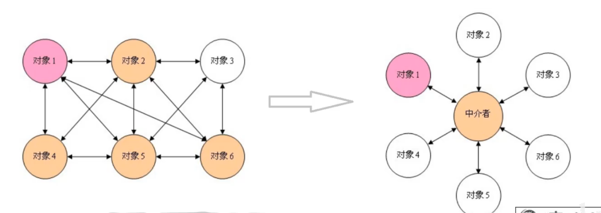

前者如果修改一个类的话，其他的多个类也需要进行改变，类之间关系较为复杂，代码维护成本也高。中介者模式就是为了解决这个问题，用于封装一系列对象之间的交互，使原有类之间的耦合关系变低。

结构：

* 抽象中介者(Mediator)角色：中介者类的接口定义，提供对象注册和转发的方法。
* 具体中介(Concrete Mediator)者：定义同事对象的一个 List，调节同时之间的交互关系
* 抽象同事类(Colleague)对象：同事类接口，需要保存中介者对象，提供同事对象交互的抽象方法。
* 具体同事(Concrete Colleague)类：抽象同事类角色的实现，处理同事对象之间的交互。

具体案例（租房案例）：

```mermaid
classDiagram
	class Mediator{
	+contact(Person p, String msg)
	}
	<<interface>> Mediator
	
	class MediatorImpl {
	-HouseOwner owner
	-Tenant tenant
	+contact(Person p, String msg) void
	}
	Mediator <|-- MediatorImpl
	
	class Person{-Mediator m}
	
	class Tenant{
	+contact(String msg) void
	}
	class HouseOwner{
	+contact(String msg) void
	}
	
	Person <-- Tenant
	Person <-- HouseOwner
	MediatorImpl o-- Tenant
	MediatorImpl o-- HouseOwner
	Mediator o-- Person
```

特点：

* 对于多个对象之间的关联起到了松散耦合的作用，不用像之前的“牵一发而动全身”
* 可以对多个对象集中进行管理，一对多关系变为一对一的关系。

### 8. 迭代器模式

> 迭代器(Iterator)模式，提供一个对象来顺序访问聚合对象中的一系列数据，而且不暴露聚合对象的内部表示

结构：

* 抽象聚合(Aggregate)角色：定义存储、添加、删除聚合元素以及创建迭代器对象的接口。
* 具体聚合(Concrete Aggregate)角色：实现抽象聚合类，返回具体迭代器的实例
* 抽象迭代器(Iterator)角色：定义访问和遍历聚合元素的接口，通常包含 `hasNext()` 和 `next()` 方法。
* 具体迭代器角色：实现抽象迭代器，完成对聚合对象的遍历并且记录当前位置。

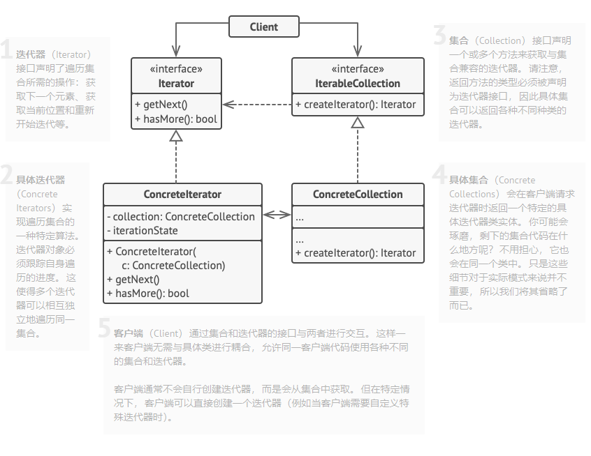

特点：

* 支持一不同的方式遍历一个聚合对象，满足开闭原则
* 但是增加了类的个数，一定程度上增加了系统的复杂度

### 9. 访问者模式

> 访问者(Visitor)模式，封装了一些作用于某种数据结构中各元素的操作，它可以在不改变这个数据结构的前提下，定义作用于这些元素的新操作。

结构：

* 抽象访问者(Visitor)角色：定义了对元素访问的行为，理论上方法个数与元素的类相同。
* 具体访问者角色：具体行为
* 抽象元素角色：定义接受访问者的方法(accept)，每个元素都可被访问者访问。
* 具体元素角色：
* 对象结构角色：即数据结构，元素的组织方式。

案例：

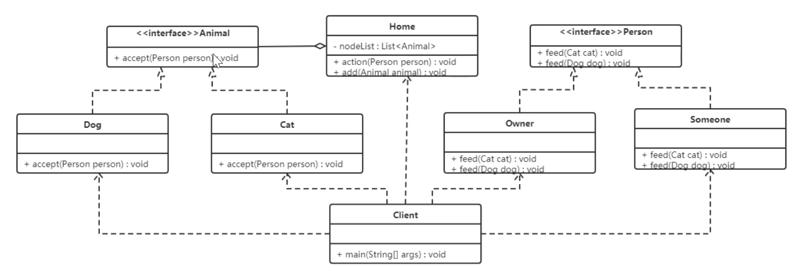

优缺点：

* 扩展性好，可以在不改变对象数据结构的基础上，增加对元素的操作功能。
* 复用性好，并且分离了无关行为
* 对象结构变化困难，每增加一个元素类，就需要增加一个操作对应元素类的方法，违反了开闭原则。

使用场景：

* 对象结构稳定，其操作算法经常变化的程序
* 对象结构中需要提供多种不同且不相关的操作，而且要避免这些操作改变对象的结构。

扩展——静态分派和动态分派（双分派）。

### 10. 备忘录模式

> 备忘录(memento)模式，提供了一种状态恢复的实现机制。当新的状态存在问题时候，用户可以方便地回到特定的历史步骤，可以使用暂时存储起来的备忘录将状态复原。

可以在不破坏封装性的前提下，捕获对象的内部状态，在该对象之外保存这个状态，一边以后需要时恢复。

结构：

* 发起人（Originator）角色：记录当前角色的内部状态信息，提供创建备忘录和恢复备忘录数据的功能。
* 备忘录（memento）角色：负责存储发起人的内部状态，在需要的时候提供内部状态给发起人。
* 管理者（Caretaker）角色：提供保存和获取备忘录功能，但不能对备忘录的内容进行访问和修改。

有两个等效的接口：

* 窄接口：只允许对备忘录对象进行保存和获取
* 狂接口：允许对备忘录对象进行访问和修改

游戏案例：打 boss 失败，玩家可以恢复到打 boss 之前的状态

🔵白箱备忘录

白箱即对任何对象都提供一个宽接口。

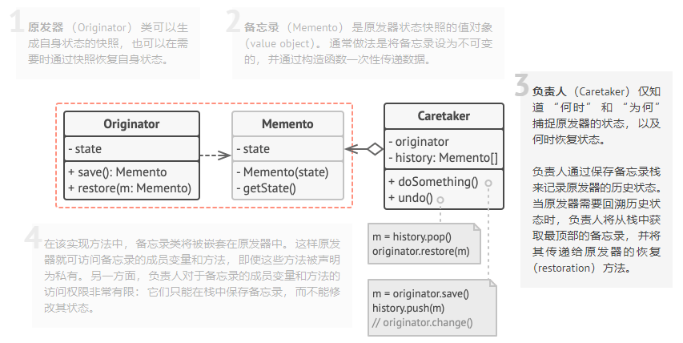

🔵黑箱备忘录

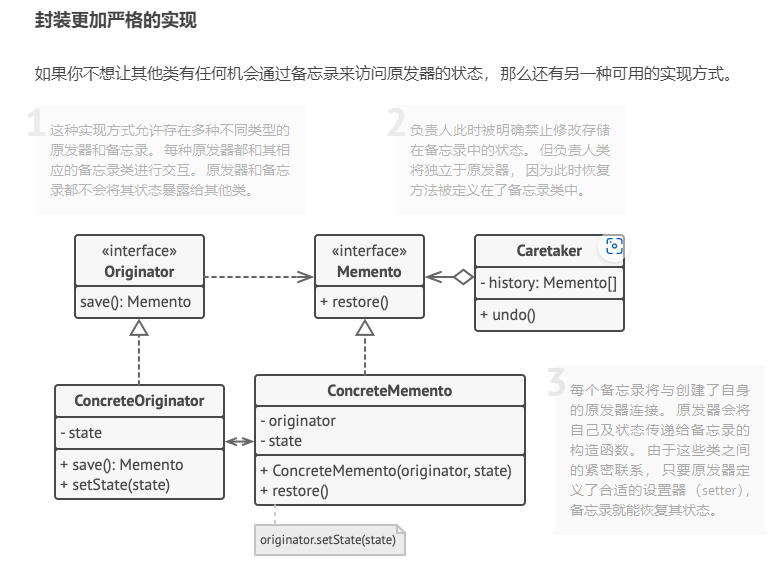

特点：

* 提供了可以恢复历史状态的机制
* 黑箱备忘录实现了内部状态的封装
* 符合单一职责原则
* 如果需要保存的状态信息过多，会占用较大的系统资源

