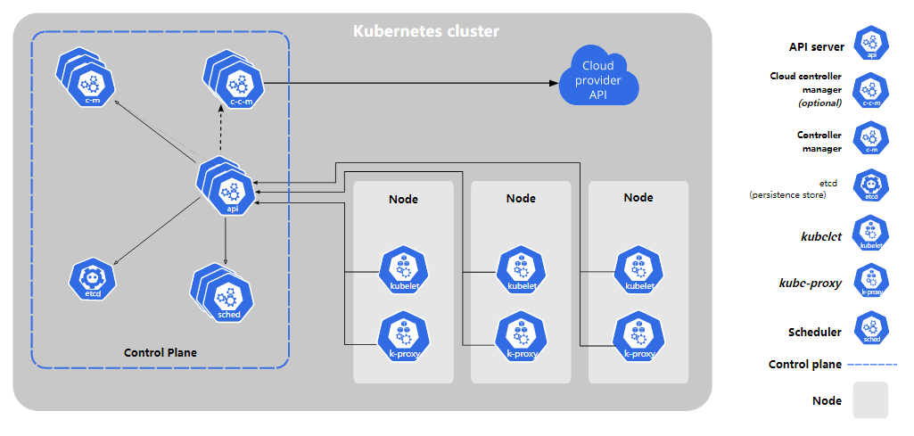
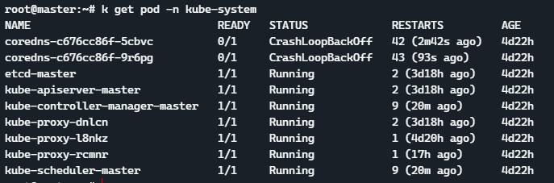
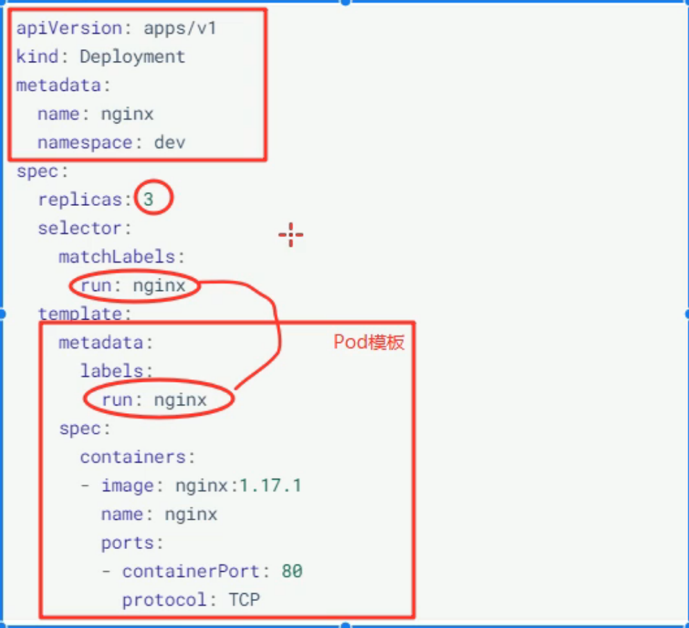
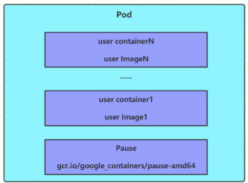
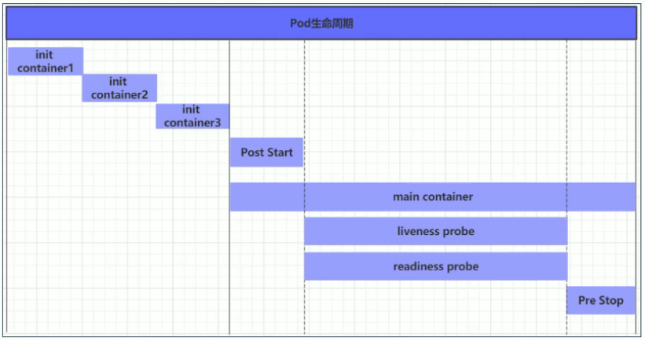

# Kubernetes 笔记

[TOC]

2022/11/29

[BV1Qv41167ck](https://www.bilibili.com/video/BV1Qv41167ck?p=35) P35

## 0x0 介绍

kubernetes 集群主要是由**控制节点**(master)和**工作节点**(node)构成，每个节点上都会安装不同的组件。



* master：集群控制，负责集群决策
  * kuberctl: 控制程序
  * apiserver：资源操作的唯一入口，用于接收用户输入的命令，提供认证、授权、API注册和发现的机制。
  * scheduler：负责集群资源的调度，按照预定的调度策略将 pod 调度到相应的 node 节点上。
  * ControllerManager：负责维护集群的状态，比如程序部署安排、故障检测、自动扩展等
  * etcd：负责存储集群中各种资源的信息
* node：数据控制，负责提供运行环境
  * kubelet：负责维护容器的生命周期，控制docker 来创建、更新、销毁容器
  * kubeProxy：负责集群内部的服务发现和负载均衡
  * Docker：负责节点上的容器的各种操作。

## 0x1. 安装

### 0. 准备

首先需要配置一主两从的环境，准备主机配置 hosts

```
10.0.0.3	master01
10.0.0.4	node01
10.0.0.5	node02
```

关闭防火墙，dnsmasq, swap 分区：

```sh
systemctl disable --now firewalld
systemctl disable --now dnsmasq
swapoff -a && sysctl -w vm.swappiness=0
```

注释swap代码：

```sh
vim /etc/fstab
#/swap.img      none    swap    sw      0       0
```

安装 ntpdate 来同步时间:

```sh
apt install ntpdate
ln -sf /usr/share/zoneinfo/Asia/Shanghai /etc/localtime
echo 'Asia/Shanghai' > /etc/timezone
ntpdate time2.aliyun.com
```

将同步任务加到开机自启动：

```sh
crontab -e
# 输入以下指令
*/5 * * * * ntpdate time2.aliyun.com
```

配置 limit：

```sh
# 用于配置 shell 可支配的资源数目
ulimit -SHn 65535
```

禁用 iptables，因为 k8s 和 docker 在运行的时候会产生大量的 iptables 规则，为了不让系统规则和他们混淆，直接关闭系统的规则

```sh
systemctl stop iptables
```

修改 linux 内核参数，添加网桥过滤和地址转发功能：

```sh
# vim /etc/sysctl.d/kubernetes.conf
net.bridge.bridge-nf-call-ip6tables = 1
net.bridge.bridge-nf-call-iptables = 1
net.ipv4.ip_forward = 1

cat <<EOF | tee /etc/sysctl.d/k8s.conf
net.bridge.bridge-nf-call-iptables  = 1
net.bridge.bridge-nf-call-ip6tables = 1
net.ipv4.ip_forward                 = 1
EOF
sysctl -p
```

运行以下指令：

```sh
# 重新加载配置
sysctl -p
# 加载网桥过滤模块
modprobe br_netfilter
```

配置 ipvs 功能，因为 k8s 中 service 由两种代理模型，一种是基于 iptables 的，另一种是基于 ipvs 的。后者性能更高：

```sh
apt install ipset ipvsadm

# 写入脚本
cat << EOF > /etc/sysconfig/modules/ipvs.modules
#!/bin/bash
modprobe -- ip_vs
modprobe -- ip_vs_rr
modprobe -- ip_vs_wrr
modprobe -- ip_vs_sh
modprobe -- nf_conntrack	# 内核4.18之后用这行
modprobe -- nf_conntrack_ipv4
EOF

# 添加执行权限
chmod +x /etc/sysconfig/modules/ipvs.modules
# 执行脚本
/bin/bash /etc/sysconfig/modules/ipvs.modules
# 查看是否配置完成
lsmod | grep -e ip_vs -e nf_conn
```

### 1. 安装 docker

参考：[Install Docker on Ubuntu](https://docs.docker.com/engine/install/ubuntu/)，[国内镜像安装](https://mirrors.bfsu.edu.cn/help/docker-ce/)

```sh
apt install ca-certificates curl gnupg lsb-release
mkdir -p /etc/apt/keyrings
echo "deb [arch=$(dpkg --print-architecture) signed-by=/etc/apt/keyrings/docker.gpg] https://download.docker.com/linux/ubuntu $(lsb_release -cs) stable" | sudo tee /etc/apt/sources.list.d/docker.list > /dev/null

apt-get update
apt-get install docker-ce docker-ce-cli containerd.io docker-compose-plugin

systemctl enable docker
```

由于 docker 在 k8s 1.24 之后不再是默认运行时，需要安装 cri-dockerd

```sh
wget https://ghproxy.com/https://github.com/Mirantis/cri-dockerd/releases/download/v0.2.5/cri-dockerd_0.2.5.3-0.ubuntu-jammy_amd64.deb
dpkg -i cri-dockerd_0.2.5.3-0.ubuntu-jammy_amd64.deb
sed -i -e 's#ExecStart=.*#ExecStart=/usr/bin/cri-dockerd --network-plugin=cni --pod-infra-container-image=registry.aliyuncs.com/google_containers/pause:3.8#g' /usr/lib/systemd/system/cri-docker.service
systemctl daemon-reload
systemctl enable cri-docker
```

### 2. 安装 k8s 组件

[kubernetes镜像_阿里巴巴](https://developer.aliyun.com/mirror/kubernetes?spm=a2c6h.13651102.0.0.b3761b11TtN9Mq)

```sh
curl https://mirrors.aliyun.com/kubernetes/apt/doc/apt-key.gpg | apt-key add - 
cat <<EOF >/etc/apt/sources.list.d/kubernetes.list
deb https://mirrors.aliyun.com/kubernetes/apt/ kubernetes-xenial main
EOF
apt-get update
apt-get install -y kubelet kubeadm kubectl

systemctl enable kubelet
```

配置 kubelet：

```sh
vim /etc/sysconfig/kubelet

KUBELET_CGROUP_ARGS="--cgroup-driver=systemd"
KUBE_PROXY_MODE="ipvs"
```

### 3. 创建集群

在 master 节点上运行：

```sh
kubeadm init \
--kubernetes-version=v1.25.4 \
--pod-network-cidr=10.244.0.0/16 \
--service-cidr=10.96.0.0/12 \
--apiserver-advertise-address=192.168.233.100
```

注意：版本设置成自己的版本，apiserver 设置成master的ip地址。

如果出现错误，执行以下指令后重新运行。

```sh
rm /etc/containerd/config.toml 
systemctl restart containerd
```

拉取所需镜像：

```sh
$ kubeadm config images list

registry.k8s.io/kube-apiserver:v1.25.4
registry.k8s.io/kube-controller-manager:v1.25.4
registry.k8s.io/kube-scheduler:v1.25.4
registry.k8s.io/kube-proxy:v1.25.4
registry.k8s.io/pause:3.8
registry.k8s.io/etcd:3.5.5-0
registry.k8s.io/coredns/coredns:v1.9.3
```

定义镜像，然后从阿里云拉取（注意里面的版本和上面对应）：

```sh
images=(
    kube-apiserver:v1.25.4
    kube-controller-manager:v1.25.4
    kube-scheduler:v1.25.4
    kube-proxy:v1.25.4
    pause:3.8
    etcd:3.5.5-0
    coredns:v1.9.3
)

for n in ${images[@]}; do
	docker pull registry.cn-hangzhou.aliyuncs.com/google_containers/$n
	docker tag registry.cn-hangzhou.aliyuncs.com/google_containers/$n	k8s.gcr.io/$n
	docker rmi registry.cn-hangzhou.aliyuncs.com/google_containers/$n
done
```

---

🔵k8s 1.25的集群初始化方法：

```sh
kubeadm config images pull --cri-socket=unix:///var/run/cri-dockerd.sock \
             --image-repository registry.aliyuncs.com/google_containers

kubeadm init --image-repository registry.aliyuncs.com/google_containers --apiserver-advertise-address=192.168.233.100 --service-cidr=10.96.0.0/12 --pod-network-cidr=10.244.0.0/16 --cri-socket /var/run/cri-dockerd.sock
```

在 master 节点产生 token 让 node 节点加入：

```sh
> kubeadm token create --print-join-command
kubeadm join 192.168.233.100:6443 --token m22sdu.lb5gye6e7owj48xf --discovery-token-ca-cert-hash sha256:cc96de7b2f1a6f15e4699422cd4c4bd54a8995f308b3372178eb514cf86c44c9
```

在 node 节点上加入集群：

```sh
kubeadm join 192.168.233.100:6443 --token m22sdu.lb5gye6e7owj48xf --discovery-token-ca-cert-hash sha256:cc96de7b2f1a6f15e4699422cd4c4bd54a8995f308b3372178eb514cf86c44c9 --cri-socket /var/run/cri-dockerd.sock
```

在 master 节点上查看节点信息：

```sh
mkdir -p $HOME/.kube
sudo cp -i /etc/kubernetes/admin.conf $HOME/.kube/config
sudo chown $(id -u):$(id -g) $HOME/.kube/config

> kubectl get nodes
NAME     STATUS     ROLES           AGE     VERSION
master   NotReady   control-plane   11m     v1.25.4
node-1   NotReady   <none>          9m19s   v1.25.4
node-2   NotReady   <none>          8m56s   v1.25.4
```

可以看到各个及其的状态还是 NotReady 的状态，还需要安装网络插件。kubernetes 支持多种网络插件，比如 flannel，calico，canal 等，任选一种即可。

> 操作只需要在 master 节点上运行即可，插件使用的是 DaemonSet 控制器，会在每个节点上都运行

现在下载并且使用 flannel 配置文件：

```sh
wget https://raw.githubusercontent.com/coreos/flannel/master/Documentation/kube-flannel.yml
kubectl apply -f kube-flannel.yml
```

由于使用的网址是 docker.io 在墙内可能会安装不成功，将 flannel 换位 jmgao1983/flannel：

```yml
- name: install-cni
#image: flannelcni/flannel:v0.20.2 for ppc64le and mips64le (dockerhub limitations may apply)
#image: docker.io/rancher/mirrored-flannelcni-flannel:v0.20.2
image: jmgao1983/flannel:v0.20.2
command:
- cp
args:
- -f
- /etc/kube-flannel/cni-conf.json
- /etc/cni/net.d/10-flannel.conflist
volumeMounts:
- name: cni
mountPath: /etc/cni/net.d
- name: flannel-cfg
mountPath: /etc/kube-flannel/
containers:
- name: kube-flannel
#image: flannelcni/flannel:v0.20.2 for ppc64le and mips64le (dockerhub limitations may apply)
#image: docker.io/rancher/mirrored-flannelcni-flannel:v0.20.2
image: jmgao1983/flannel:v0.20.2
```

如果未下载成功则直接使用 docker pull 下来：

```sh
docker pull jmgao1983/flannel:v0.20.2
```

查看状态：

```sh
kubectl describe pod -n kube-flannel
kubectl get pods -n kube-system
```

如果是在不行就使用科学上网的方法（添加代理）：

```sh
# 代理设置成自己的代理端口
export https_proxy=http://192.168.233.1:9999
export http_proxy=http://192.168.233.1:9999
export all_proxy=socks5://192.168.233.1:9999
```

### 4. 服务部署

测试部署 nginx

```sh
# 部署 nginx
kubectl create deployment nginx --image=nginx
# 暴露端口
kubectl expose deployment nginx --port=80 --type=NodePort
```

查看部署情况：

```sh
root@master:~# kubectl get pods
NAME                    READY   STATUS    RESTARTS   AGE
nginx-76d6c9b8c-6bw72   1/1     Running   0          5m11s
root@master:~# kubectl get service
NAME         TYPE        CLUSTER-IP      EXTERNAL-IP   PORT(S)        AGE
kubernetes   ClusterIP   10.96.0.1       <none>        443/TCP        76m
nginx        NodePort    10.102.23.201   <none>        80:30237/TCP   2m32s
```

暴露端口在 `30237` ，访问 master ip + 端口即可。

## 0x3 资源管理

在 kubernets 中所有内容都是资源，用户需要通过操作资源来对 k8s 进行管理。k8s 中最小管理单元不是容器而是 pod，所以只能将容器放在 pod 中，k8s 也不会之间管理 pod，而是通过 `pod 控制器` 来管理 pod。

pod 想要对外开放，就需要 `service` 来进行处理；如果想要持久化就需要 `volume` 来进行管理。

### 1. kubectl 命令

kubectl 式 k8s 集群命令行工具，用于对集群本身进行管理，并且能够在集群上进行容器化应用的安装和部署，kubectl 命令语法如下：

```sh
kubectl [command] [type] [name] [flags]
```

command: 指定要对资源执行的操作，比如 create、get、delete

* 基本命令：

  | 命令    | 翻译 | 命令作用     |
  | ------- | ---- | ------------ |
  | create  | 创建 | 创建一个资源 |
  | edit    | 编辑 | 编辑一个资源 |
  | get     | 获取 | 获取一个资源 |
  | patch   | 更新 | 更新一个资源 |
  | delete  | 删除 | 删除一个资源 |
  | explain | 解释 | 展示资源文档 |

* 运行和调试

  | 命令         | 翻译     | 命令作用                   |
  | ------------ | -------- | -------------------------- |
  | run          | 运行     | 在集群中运行一个指定的镜像 |
  | expose       | 暴露     | 暴露资源为Service          |
  | **describe** | 描述     | 显示资源内部信息           |
  | logs         | 日志     | 输出容器在Pod中的日志      |
  | attach       | 缠绕     | 进入运行中的容器           |
  | exec         | 执行     | 执行容器中的一个命令       |
  | cp           | 复制     | 在Pod内外复制文件          |
  | rollout      | 首次展示 | 管理资源的发布             |
  | scale        | 规模     | 扩（缩）容Pod的数量        |
  | autoscale    | 自动调整 | 自动调整Pod的数量          |

* 其他命令：

  | 命令  | 翻译 | 命令作用               |
  | ----- | ---- | ---------------------- |
  | apply | 应用 | 通过文件对资源进行配置 |
  | label | 标签 | 更新资源上的标签       |
  | cluster-info | 集群信息 | 显示集群信息                 |
  | version      | 版本     | 显示当前Client和Server的版本 |

type：指定资源类型，比如 deployment、pod、service

* 集群级别资源：

  | 资源名称   | 缩写 | 资源作用     |
  | ---------- | ---- | ------------ |
  | nodes      | no   | 集群组成部分 |
  | namespaces | ns   | 隔离Pod      |

* pod 资源：

  | 资源名称 | 缩写 | 资源作用 |
  | -------- | ---- | -------- |
  | Pods     | po   | 装载容器 |

* pod 资源控制器：

  | 资源名称                 | 缩写   | 资源作用    |
  | ------------------------ | ------ | ----------- |
  | replicationcontrollers   | rc     | 控制Pod资源 |
  | replicasets              | rs     | 控制Pod资源 |
  | deployments              | deploy | 控制Pod资源 |
  | daemonsets               | ds     | 控制Pod资源 |
  | jobs                     |        | 控制Pod资源 |
  | cronjobs                 | cj     | 控制Pod资源 |
  | horizontalpodautoscalers | hpa    | 控制Pod资源 |
  | statefulsets             | sts    | 控制Pod资源 |

* 服务发现：

  | 资源名称 | 缩写 | 资源作用        |
  | -------- | ---- | --------------- |
  | services | svc  | 统一Pod对外接口 |
  | ingress  | ing  | 统一Pod对外接口 |

* 存储资源：

  | 资源名称               | 缩写 | 资源作用 |
  | ---------------------- | ---- | -------- |
  | volumeattachments      |      | 存储     |
  | persistentvolumes      | pv   | 存储     |
  | persistentvolumeclaims | pvc  | 存储     |

* 配置资源：

  | 资源名称   | 缩写 | 资源作用 |
  | ---------- | ---- | -------- |
  | configmaps | cm   | 配置     |
  | secrets    |      | 配置     |

name：指定资源的名称，大小写敏感

flags：指定额外的可选参数

```sh
kubectl get pod
kubectl get pod pod-name
# 查看 pod 详细信息
kubectl get pod pod-name -o wide
# 以 yaml 的形式查看 pod
kubectl get pod pod_name -o yaml
```

### 2. 资源管理方式

* 命令式对象管理：直接使用命令去操作 k8s 资源，简单但是只能操作活动对象，无法审计和追踪

  ```sh
  kubectl run nginx-pod --image=nginx --port=80
  ```

* 命令式对象配置：通过命令配置和配置文件去操作 k8s 资源，项目大的时候配置文件多，比较麻烦

  ```sh
  # 创建
  kubectl create -f nginx-pod.yaml
  # 更新
  kubectl patch -f nginx-pod.yaml
  # 删除
  kubectl delete -f nginx-pod.yaml
  ```

* 声明式对象配置：通过 `apply` 命令和配置文件去操作 k8s 资源，支持目录操作，意外情况下难以调试

  ```sh
  # 相比于上面只适用于创建和更新资源
  kubectl apply -f nginx-pod.yaml

> 在 node 节点上如何运行 kubectl：
>
> kubectl 的运行是需要配置的，它的配置文件是 `$HOME/.kube`，在 node 节点上运行的话需要配置和 master 节点上相同的文件，在 master 节点上执行 `scp -r ~/.kube node:~/`，然后就可以在 node 节点上运行了。

## 0x4 实战入门

### 1. Namespace

Namespace 是 k8s 中用于**多套环境的资源隔离**或者**多租户资源隔离**。默认情况下所有 pod 是可以进行互相访问的，在实际生产环境中可能不想让两个 pod 之间进行互相访问，因此可以建立两个不同的 namespace 中，来方便对不同资源的隔离使用和管理。还可以实现不同 namespace 资源配额。

k8s 会默认设置几个 namespace：

```sh
> k get ns
NAME              STATUS   AGE
default           Active   4d22h	# 所有未指定 ns 都会被分配到这个组
kube-flannel      Active   4d22h
kube-node-lease   Active   4d22h		# 用于集群节点之间的心跳维护
kube-public       Active   4d22h	# 这个所有资源可以被所有人访问包括未认证用户
kube-system       Active   4d22h	# 所有由 k8s 系统创建的资源都存在这个 ns 下
```

查看 namespace 具体信息：

```sh
> k describe ns default
Name:         default
Labels:       kubernetes.io/metadata.name=default
Annotations:  <none>
Status:       Active

No resource quota.

No LimitRange resource.
```

resouce quote 就是表示对 namespace 的资源配额，LimitRange 表示针对 namespace 中每个组件的资源配额。

* 创建 / 删除 namespace：

  ```sh
  kubectl create ns dev
  kubectl delete ns dev
  ```

* 使用 yaml 来配置 namespace：

  ```yml
  apiVersion: v1
  kind: Namespace
  metadata:
    name: dev
  ```

  然后执行对应的创建和删除命令：

  ```sh
  kubectl create -f a.yaml
  kubectl delete -f a.yaml
  ```

### 2. Pod

pod 是 k8s 集群中进行管理的最小单元，程序必须要部署在容器中，而容器必须部署在 pod 中。一个 pod 可以存多个容器。

查看 pod：



查看 pod 详情：

```sh
> k get pod nginx-76d6c9b8c-6bw72 -o wide
NAME                    READY   STATUS    RESTARTS        AGE     IP           NODE     NOMINATED NODE   READINESS GATES
nginx-76d6c9b8c-6bw72   1/1     Running   1 (4d22h ago)   4d22h   10.244.2.5   node-2   <none>           <none>
```

pod 访问：

```sh
curl 10.244.2.5:80
```

pod 删除：

```sh
k delete pod nginx-76d6c9b8c-6bw72
```

当然这样是无法删除的，在进行 `kubctl run deployment` 的时候创建的是 **pod 控制器**，因此需要删除对应的 pod 控制器才能删除对应的 pod。

```sh
> k get deployment
NAME    READY   UP-TO-DATE   AVAILABLE   AGE
nginx   1/1     1            1           21m
> k delete deployment nginx
```

也可以使用 yaml 文件进行创建删除 pod

### 3. Label

用于为资源添加表示，用来对他们进行区分和选择。

特点：

* 标签一般都是以 KV 的形式添加到各个对象上
* 一个资源对象可以有任意数量个 label

定义完标签之后还需要使用标签选择器：

* 基于等式的：name=slave, env != production
* 基于集合的：name in (master, slave), tier not in (test, production)

查看标签：

```sh
kubectl get pod -n dev --show-labels
```

添加标签：

```sh
kubectl label pod nginx -n dev version=1.0
```

更新标签：

```sh
kubectl label pod nginx -n dev version=1.0 --overwrite
```

筛选标签：

```sh
kubectl get pods -l "version=1.0" -n dev --show-labbels
```

删除标签：使用减号 `-` 进行删除

```sh
kubectl label pod nginx -n dev version-
```

配置文件：在 `metadata` 中添加标签

```yml
...
metadata:
  name: nginx01
  namespace: dev
  labels:
    version: 1.0
...
```

### 4. Depolyment

k8s 中 pod 是最小控制单元，一般都是通过 pod 控制器来完成对 pod 的管理。

创建：

```sh
kubectl run [name] --image=nginx --port=80 --replicas=3 -n dev
```

replicas: 表示创建的数量

查看 pod 控制器：

```sh
k get deployment,pod -n dev
k describe deployment [name]
```

删除：对应的 pod 也会被删除

```sh
k delete deployment [name]
```

对应的配置文件：



### 5. Service

每一个 pod 都会分配一个单独的 IP，然而却存在两个问题：

1. Pod IP 会随着 pod 的重建而变化
2. Pod IP 仅是集群内部的 IP，外部无法访问

因此 k8s 设计 service 来解决这个问题，可以方便的实现服务发现和负载均衡。

创建一个 service ：

```sh
kubectl expose deploy [deploy-name] --name=[srv-name] --type=ClusterIP --port=[srv-port] --target-port=[pod-port] -n [namespace]
```

type: `ClusterIP ` 只能在集群内部进行访问，`NodePort` 可以在集群外部进行访问

删除 svc：

```sh
kubectl delete svc [svc-name]
```

设置配置：

```yml
apiVersion: v1
kind: Service
metadata:
  name: svc-nginx
  namespace: dev
spec:
  ports:
  - port: 80
   protocol: TCP
   targetPort: 80
  selector:
   run: nginx
  type: ClusterIP
```

## 0x5 Pod 详解

主要是学习 pod yml 配置和原理。



```yml
apiVersion: v1
kind: Pod
metadata:
  generateName: nginx-65df995dc8-
  labels:
    pod-template-hash: 65df995dc8
    run: nginx
  name: nginx-65df995dc8-drlzw
  namespace: dev
spec:
  containers:
  - image: nginx
    imagePullPolicy: Always
    name: nginx
    ports:
    - containerPort: 80
      protocol: TCP
    resources: {}
    terminationMessagePath: /dev/termination-log
    terminationMessagePolicy: File
    volumeMounts:
    - mountPath: /var/run/secrets/kubernetes.io/serviceaccount
      name: kube-api-access-74j7r
      readOnly: true
```

### 1. 结构和定义

Pod 有一个根容器即 Pause 容器，每个 pod 都会有一个根容器，有以下两个作用：

* 以它为依据来评估整个 pod 的健康状态

* 可以在根容器上设置 IP 地址，其他容器都共享这个 IP 来实现 Pod 内部网络通信。

  > 这是 Pod 内部的通信，Pod 之间的通讯采用虚拟二层网络技术来实现（Flannel）

如何查看 Pod yml 配置：使用 `explain` 指令

```sh
k explain pod
k explain pod.metadata
```

查看其他属性：

```sh
k api-versions
k api-resources
```

metadata 元数据：主要用于资源表示和说明，常用的有 name、namespace、labels 等

spec 是资源配置中**最重要**的一部分，用于对各种资源配置的详细描述：

* containers <[]Object>	容器列表、用于定义容器的详细信息
* nodeName <String\>      根据 name 的值将 pod 调度到指定的 node 节点上
* nodeSelector <Map[]>   可以根据定义的信息将 pod 调度到对应的标签 node 上
* hostNetwork  <bool\>    是否使用主机网络模式，默认为 false，如果设置为 true 表示使用宿主机网络
* volumes     <[]Object>   存储卷，用于定义 pod 上挂载的存储信息
* restartPolicy  <String\>   重启策略，表示 pod 在遇到故障的时候的处理策略

### 2. Pod 配置

> 主要讲解 `spec` 配置

```yaml
apiVersion: v1
kind: Pod
metadata:
  name: pod-base
  namespace: dev
  labels:
  	user: john
spec:
  containers:
  - image: nginx:1.17.1			# 容器拉取镜像名称
  	name: nginx01
  	imagePullPolicy: Always		# 镜像拉取策略
  	command: ["/bin/sh", "-c", "sleep 3"]	# 容器启动时候需要执行的命令
  	args: [""]
  	env: 					# 设置容器中的环境变量
  	- name: "username"
  	  value: "admin"
  	ports:				# 容器需要暴露的端口列表
  	- name: nginx-port
  	  containerPort: 80
  	resources:			# 对 pod 进行资源限额和设置
  - image: busybox
  	name: busybox01
```

镜像拉取策略：

* Always： 总是从远程仓库拉取镜像（如果不指定版本号或者为 `latest` ，则为默认）
* IfNotPresent：本地有则用本地，没有则从远处拉取（如果指定了版本号非 `latest`，则为默认）
* Never：只使用本地镜像，没有就报错

容器端口设置 `ports` ：

* name: 端口号名称，必须保证唯一
* containerPort：容器需要监听的端口
* hostPort：主机上公开的端口，一般忽略
* hostIP：需要绑定的主机 IP，一般忽略
* protocol：端口协议，必须是 UDP、TCP、SCTP，默认TCP

资源限额和配给 `resources`：

> 如果不对容器资源进行限制，可能会出现吃掉大量资源导致其他容器无法运行

* limits：用于限制容器的**最大**占用资源，如果超过限制就会被终止并且重启
* requests：如果设置**最小**资源不够则无法启动

```yaml
limits:
	cpu: "2"	# 核数
	memory: "10Gi"	/ "500Mi"
```

### 3. 生命周期

生命周期：pod 从创建到终止的过程



1. pod 创建过程

   * 用户通过 kubectl 或者其他 api 客户端提交需要创建的 pod 信息给 apiserver
   * apiserver 开始生成 pod 对象的信息，并将信息存入 etcd，然后返回开始创建信息至客户端
   * apiserver 开始反应 etcd 中 pod 对象的变化，使用 watch 机制来跟踪检查 apiserver 的变动
   * 调度器收到信息后开始为 pod 分配主机并且向 apiserver 更新信息
   * node 节点上的 kubelet 发现有 pod 调度过来，尝试调用 docker 启动容器并返回结果到 apiserver
   * apiserver 将接收到的 pod 状态存入到 etcd 中

2. 运行初始化容器(initialized container)过程

   初始化容器用于做主容器的前置工作，去必须允许完成直至结束，若初始化容器运行失败那么 k8s 需要重启知道成功完成。初始化容器必须按照定义的顺序执行，当完成前一个的时候后一个才会执行。

   其适用的场景：用于提供主容器镜像中不具备的程序或者代码；将各个容器串行执行，比如先开启 mysql 和 redis 之后才能开启 nginx。

   案例：

   ```yaml
   apiVersion: v1
   kind: Pod
   metadata:
     name: pod-base
     namespace: dev
     labels:
     	user: john
   spec:
     containers:
     - image: nginx:1.17.1			# 容器拉取镜像名称
     	name: nginx01
     	ports:				# 容器需要暴露的端口列表
     	- name: nginx-port
     	  containerPort: 80
     initContainers:
     - name: test-mysql	# 等待 mysql 启动才执行 redis 检测
      image: busybox:1.30
      command: ['sh', '-c', 'until ping 192.168.109.201 -c 1; do echo waiting for mysql..; sleep 2; done;']
     - name: test-redis	# 等待 redis 启动才执行拉取 nginx
      image: busybox:1.30
      command: ['sh', '-c', 'until ping 192.168.109.203 -c 1; do echo waiting for mysql..; sleep 2; done;']
   ```

3. 运行主容器(main container)过程

   a.  容器启动后钩子(post start)、容器终止前钩子(pre stop)

   b.  容器的存活性探测(liveness probe)、就绪性探测(readiness probe)

   k8s 允许在钩子函数处执行用户自定义代码，支持三种形式：

   Exec 命令模式：

   ```yml
   ...
     livenessProbe:
        exec:
           command:
             -	cat
             -	/tmp/healthy
   ...
   ```

   TCPSocket 模式：

   ```yml
   ……
      livenessProbe:
         tcpSocket:
            port: 8080
   ……
   ```

   HTTPGet 模式：

   ```yml
   ……
      livenessProbe:
         httpGet:
            path: / #URI地址
            port: 80 #端口号
            host: 127.0.0.1 #主机地址
            scheme: HTTP #支持的协议，http或者https
   ……
   ```

4. pod 终止过程

   * 用户向 apiServer 发送删除 pod 对象的命令
   * apiServer 中的 pod 对象信息会随着时间的推移而更新，在宽限期内(默认 30s)，pod 被视为 dead
   * 将 pod 标记为 terminating 状态
   * kubelet 在监控的 pod 对象转为 terminating 状态同时启动 pod 关闭过程
   * 端点控制器监控到 pod 对象的关闭行为时将其所有匹配到此段点的 service 资源的端点列表中删除
   * 如果定义了 preStop 钩子处理器，则在标记为 terminating状态后执行钩子函数
   * pod 对象中的进程收到停止信号，超过宽限期后强行删除未停止的进程
   * 此时 pod 对用户不可见

在生命周期中会存在 5 种状态：

* 挂起（pending）： apiserver 已经创建 pod 资源对象，处于尚未调度或者下载镜像的过程
* 运行中（running）：pod 已经被调度至某个节点，并且所有容器都已经被 kubelet 创建完成
* 成功（succeeded）：pod 种所有容器都被成功终止并且不会被重启
* 失败（Failed）：所有容器都已经终止，但至少有一个容器终止失败，及容器返回了非 0 值的退出状态。
* 未知（unknown）：apiserver 无法正常获取 pod 对象的状态信息，通常由网络通信失败所导致
