# Netty 编程

2022-03-22

[BV1py4y1E7oA](https://www.bilibili.com/video/BV1py4y1E7oA?p=139) P139

Reactor 原理

[Reactor Netty Reference Guide](https://projectreactor.io/docs/netty/release/reference/index.html#_metrics_7)

部分图片来源于黑马程序员讲义。

[TOC]

## 一. NIO 基础

> NIO: non-blocking io. 非阻塞IO.

### 1. 三大组件(Channel, Buffer, Selector)

🔵Channel


channel 有点类似stream，是读写数据的双向通道， 可以从 channel 中将数据读入 buffer，也可以将 buffer 中的数据写入 channel 。

常见的channel：`FileChannel`, `DatagramChannel`, `SocketChannel`, `ServerSocketChannel`。

🔵Buffer

常见的Buffer有 `ByteBuffer(MappedByteBuffer, DirectByteBuffer,...)`, `ShortBuffer`, `IntBuffer`等类型。

🔵Selector

服务器设计分为：多线程版和线程池版。多线程版是每个线程处理一个 Socker IO 请求；在线程池版下，一个线程仅能处理一个Socket的连接，仅适合短连接场景。

而对于 Selector 模式的服务器设计，其工作在非阻塞模式下，作用就是配合一个线程来管理多个channel，selector 可以用来监听多个 Channel 的状态，适用于连接数多但是流量低 (low traffic) 的场景。

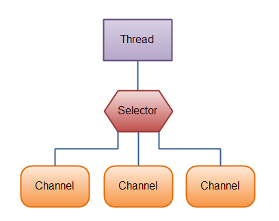

### 2. ByteBuffer

🔵基础使用：

```java
@Slf4j
public class ByteBufferDemo {
    public static void main(String[] args) {
        try(FileChannel channel = new FileInputStream("data.txt").getChannel()) {
            // 准备缓冲区
            ByteBuffer buffer = ByteBuffer.allocate(10);
            StringBuilder sb = new StringBuilder();
            // 从channel中读取数据到buffer中
            int len;
            while ((len = channel.read(buffer)) != -1) {    
                // read 方法读取到末尾的时候回返回-1
                buffer.flip();  // 将读取数据的指针指向0，即文本开头
                while (buffer.hasRemaining()) {
                    byte b = buffer.get();
                    sb.append((char)b);
                }
                buffer.clear(); // 将 buffer 切换为写模式
                log.debug("读取到的字节数： {}, 读取的数据: {}", len, sb);
            }
        } catch (IOException e) {
            e.printStackTrace();
        }
    }
}
```

ByteBuffer 的正确使用方法：

1. 先向 buffer 中写入数据，例如调用`channel.read(buffer)`
2. 调用`flip()`方法将 buffer 切换到**读模式**
3. 从 buffer 中读取数据，例如调用 `buffer.get()`
4. 如果将文件读取完毕则结束，否则进入步骤5
5. 调用 `clear()` 或者 `compact()` 方法切换到写模式，继续向 buffer 中写入数据，重复步骤1。

🔵ByteBuffer 的内部结构

ByteBuffer 有三个重要属性：

* capacity 即表示 buffer 的容量
* position 即表示 buffer 当前的写入/读取位置
* limit 在写模式下即为最大容量的位置，在读模式下为当前读取数据的最大边界。

可以直接输出 ByteBuffer 对象查看其信息：`java.nio.HeapByteBuffer[pos=5 lim=16 cap=16]`

初始 ByteBuffer，或者使用 clear 方法后：

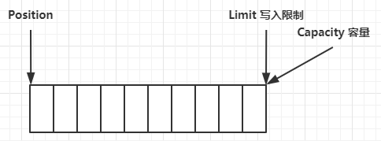

写入数据：

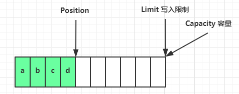

开始读模式后，position 指针归零，并且 limit 位置发送变化：

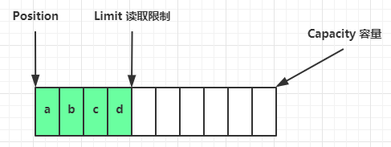

使用 `compact()` 方法，即在未完全读取数据后继续写数据的情况，将已读取的数据清除：

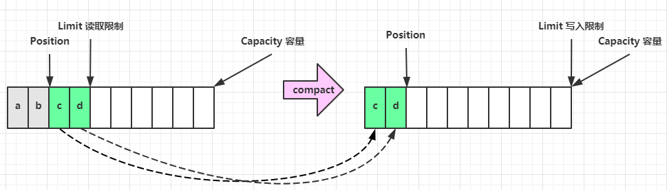

🔵ByteBuffer 常用函数

* 分配空间：

  1. `ByteBuffer.allocate(16)`，属于类`java.nio.HeapByteBuffer`，分配的是Java堆内存，读写效率低，收到GC的影响。
  2. `ByteBuffer.allocateDirect(16)`，属于类`java.nio.DirectByteBuffer`，分配的是系统内存，读写效率高，不受GC的影响，分配效率较低，有可能造成内存泄漏。

* 写入数据：

  可以使用 `channel.read()` 或者 `buffer.put()`方法

* 读取数据：

  可以使用 Channel 的 write 方法，或者是调用 buffer 自己的 get 方法。

  如果想重复读取数据的话，可以使用 `rewind()` 方法将position指针重新归零；

  使用 `get(int i)`的方法，但是其不会移动 position 指针。

  还可以使用 `mark()` 和 `reset()` 方法，相当于是对 `rewind()` 方法的强化。mark 相当记录当前 position 的位置，reset 则将 position 重置到 mark 的位置。

* 字符串和 ByteBuffer 的相互转换

  注意：后两种方式会直接将 ByteBuffer 置为读模式。

  ```java
  static void stringWithByteBuffer() {
      ByteBuffer buffer = ByteBuffer.allocate(16);
      // 1. 字符串转 ByteBuffer
      buffer.put("hello".getBytes());
  
      // 2. 使用 StandardCharsets 来进行处理
      ByteBuffer buffer2 = StandardCharsets.UTF_8.encode("hello");
      
      // 3. 使用 wrap 方法
      ByteBuffer buffer3 = ByteBuffer.wrap("hello".getBytes());
  
      // Bytebuffer 转换为 String
      buffer.flip();
      System.out.println(StandardCharsets.UTF_8.decode(buffer));
      System.out.println(StandardCharsets.UTF_8.decode(buffer2));
      System.out.println(StandardCharsets.UTF_8.decode(buffer3));
  }
  ```

🔵分散读和集中写

分散读，比如读取字符串 `onetwothree` ，切分为三个字符串，可以使用省时省力的方法分散读来进行读取。

```java
static void scatteringRead() {
    try (FileChannel channel = new RandomAccessFile("words.txt", "r").getChannel()) {
        ByteBuffer b1 = ByteBuffer.allocate(3);
        ByteBuffer b2 = ByteBuffer.allocate(3);
        ByteBuffer b3 = ByteBuffer.allocate(5);
        channel.read(new ByteBuffer[]{b1, b2, b3});
        b1.flip();
        b2.flip();
        b3.flip();
        System.out.println(StandardCharsets.UTF_8.decode(b1));
        System.out.println(StandardCharsets.UTF_8.decode(b2));
        System.out.println(StandardCharsets.UTF_8.decode(b3));

    } catch (IOException e) {
    }
}
```

集中写，将多个数据一起写入文件：

```java
static void gatheringWrite() {
    try (FileChannel channel = new RandomAccessFile("words2.txt", "rw").getChannel()) {
        ByteBuffer b1 = StandardCharsets.UTF_8.encode("hello");
        ByteBuffer b2 = StandardCharsets.UTF_8.encode("world");
        ByteBuffer b3 = StandardCharsets.UTF_8.encode("你好");
        channel.write(new ByteBuffer[] {b1, b2, b3});
    } catch (IOException e) {
    }
}
```

🔵粘包半包分析

参考：[硬核图解|tcp为什么会粘包？](https://segmentfault.com/a/1190000039691657)

出现粘包最有可能的原因就是基于**字节流**的特点，这是因为字节流与字节流之间的传出没有任何的边界，导致上一个发的数据包和下一个发的数据包粘在一起。

早些年网络不发达的情况，一般有**Nagle算法**来防止客户端放松过小的数据包，从而有可能导致在发送端发生粘包的问题。如果关闭**Nagle算法**（`TCP_NODELAY=1`）后还是有可能产生粘包的问题，比如在 TCP 接收端，应用层未及时取走信息，因此可能会导致在 TCP Recv Buffer 信息堆积，从而导致 TCP 粘包。

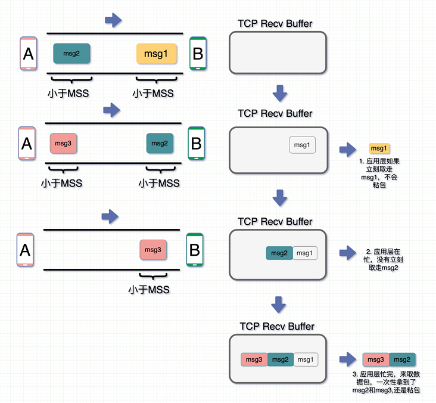

### 3. 文件编程

其只能工作在阻塞模式下。

由 `FileInputStream` 获取的 Channel 只能读，由 `FileOutputStream` 获取的 Channel 只能进行写；通过 `RandomAccessFile` 获取的 Channel 既能读也能写。

正确的写入姿势：

```java
while(buffer.hasRemaining()) {
    channel.write(buffer);
}
```

关闭尽可能使用 `try..with..catch` 来进行关闭。

🔵Channel 之间传输数据

其传输的效率较高，底层都会使用操作系统的**零拷贝**进行优化。

```java
public class FileChannelTransfer {
    public static void main(String[] args) {
        try (
                FileChannel from = new FileInputStream("data.txt").getChannel();
                FileChannel to = new FileOutputStream("to.txt").getChannel();
        ) {
            from.transferTo(0, from.size(),to);
        } catch (IOException e) {
            e.printStackTrace();
        }
    }
}
```

但是有个缺点，其传输的最大限制就是 2GB。

如果传输的文件大小大于 2GB， 就需要进行优化。

🔵Path 和 Paths 类

还支持 `.` 以及 `..` 代表本目录和上一级目录。

```java
public static void main(String[] args) {
    Path source = Paths.get("/usr/local/bin/a");
    log.info("Filename:{}, Pathname: {}", source.getFileName(), source.getParent());
    Path other = Paths.get("D:/a/b/c/../d");
    System.out.println(other.normalize());  // D:\a\b\d
}
```

🔵Files 类

这个类需要配合 Path 和 Paths 类来一起进行使用。可以检查文件是否存在、创建目录、复制、删除以及移动文件等操作。

```java
@Slf4j(topic = "Files")
public class FilesDemo {
    public static void main(String[] args) {
        // 判断文件是否存在
        Path source = Paths.get("./data.txt");
        System.out.println(Files.exists(source));
        // 创建一级目录，如果目录已存在或者创建多级目录会抛异常
        Path dir = Paths.get("./beauties");
        try {
            Files.createDirectory(dir);
        } catch (IOException e) {
            e.printStackTrace();
        }
        // 创建多级目录
        Path dirs = Paths.get("./girls/aaron");
        try {
            Files.createDirectories(dirs);
        } catch (IOException e) {
            e.printStackTrace();
        }
        // 拷贝文件，如果文件已经存在会抛出异常
        Path target = Paths.get("./data_copy.txt");
        try {
            Files.copy(source,target);
            // 会覆盖已存在的文件
            Files.copy(source,target, StandardCopyOption.REPLACE_EXISTING);
        } catch (IOException e) {
            e.printStackTrace();
        }
    }
}
```

🔵遍历增删改查文件夹

使用方法 `walkFileTree()` 和 `walk()` ，两者不同之处就是前者使用匿名内部类的方式来进行操作，后者返回的是一个 Stream 流进行操作。

```java
public static void main(String[] args) throws IOException {
    Path src = Paths.get("E:\\Notes\\allmarkdown");
    AtomicInteger dirCount = new AtomicInteger();
    AtomicInteger fileCount = new AtomicInteger();
    Files.walkFileTree(src, new SimpleFileVisitor<Path>() {
        @Override
        public FileVisitResult preVisitDirectory(Path dir, BasicFileAttributes attrs) throws IOException {
            dirCount.incrementAndGet();
            log.debug("---> {}", dir);
            return super.preVisitDirectory(dir, attrs);
        }

        @Override
        public FileVisitResult visitFile(Path file, BasicFileAttributes attrs) throws IOException {
            fileCount.incrementAndGet();
            log.debug("{}", file);
            return super.visitFile(file, attrs);
        }
    });

    log.debug("files: {}, dirs: {}", fileCount, dirCount);
}
```

对于遍历删除非空多级文件，可以在访问文件的时候删除文件，访问文件夹后(post)再删除文件夹。

### 4. 网络编程

分为阻塞、非阻塞、多路复用等方式。

🔵简单阻塞与非阻塞服务器

单线程阻塞服务器：

```java
public static void main(String[] args) throws IOException {
    // 使用 nio 来理解阻塞模式
    // 0. 创建ByteBuffer
    ByteBuffer buffer = ByteBuffer.allocate(16);
    // 1. 创建服务器
    ServerSocketChannel ssc = ServerSocketChannel.open();
    // 2. 绑定监听端口
    ssc.bind(new InetSocketAddress(8888));
    // 3. 连接集合
    List<SocketChannel> channels = new ArrayList<>();
    while (true) {
        // 4. accept 用于建立与客户端的连接，SocketChannel 用于同客户端之间的通信
        // 是在阻塞模式下，如果没有连接进来会一直阻塞
        SocketChannel sc = ssc.accept();
        channels.add(sc);
        // 5. 接收客户端的数据
        for (SocketChannel channel : channels) {
            channel.read(buffer);   // read 也是阻塞方法，直到服务器端收到客户端的信息
            buffer.flip();
            log.info("Server recv msg: {}", StandardCharsets.UTF_8.decode(buffer));
            buffer.clear();
        }
    }
}
```

单线程的阻塞服务器会在两个地方进行阻塞，一个是在 accept 与客户端建立连接的时候，另一次是在等待客户端发送消息 read 的时候。很明显，如果期间有其他的客户端连接进来，或者其他的客户端发送消息，就可能会导致信息丢失或者是很长时间才能响应的现象，因此单线程的阻塞服务器很不合理。

将阻塞服务器改为非阻塞服务器。

通过设置`ServerSocketChannel.configureBlocking(false);` 设置服务器为非阻塞模式，每次建立连接 accept 的时候就不会一直阻塞了；设置`SockerChannel.configureBlocking(false);` 用来设置服务器和客户端之间的连接为非阻塞模式，每次从 channel 中 read 的时候如果为空则直接返回0。

```java
static void nioServer() throws IOException {
    // 单线程非阻塞模式
    // 0. 创建ByteBuffer
    ByteBuffer buffer = ByteBuffer.allocate(16);
    // 1. 创建服务器
    ServerSocketChannel ssc = ServerSocketChannel.open();
    ssc.configureBlocking(false);   // 设置服务器为非阻塞模式
    // 2. 绑定监听端口
    ssc.bind(new InetSocketAddress(8888));
    // 3. 连接集合
    List<SocketChannel> channels = new ArrayList<>();
    while (true) {
        // 4. accept 用于建立与客户端的连接，SocketChannel 用于同客户端之间的通信
        // 是在非阻塞模式下，如果没有连接进来返回null
        log.debug("Waiting client...");
        SocketChannel sc = ssc.accept();
        if (sc != null) {
            log.debug("Client {} is in", sc);
            sc.configureBlocking(false);    // 设置连接也为非阻塞模式
            channels.add(sc);
        }
        // 5. 接收客户端的数据
        for (SocketChannel channel : channels) {
            int len = channel.read(buffer);// read 非阻塞方法，无数据会返回0
            if (len != 0) {
                buffer.flip();
                log.info("Server recv msg: {}", StandardCharsets.UTF_8.decode(buffer));
                buffer.clear();
            }
        }
    }
}
```

相比于非阻塞模式，可以及时的接收来自客户端的连接和客户端的信息，但是会存在一个轮询检查，会在无连接的时候也会一直检查客户端的连接，就会导致对于系统 CPU 资源的浪费。

🔵多路复用 Selector

Selector 的作用就是监听 Channel 的事件状态，在没有事件发生的时候还可以阻塞，防止 CPU 进行空转。

Selector 关注的事件有四种：

1. accept 事件：会在客户端有请求连接的时候就会触发。
2. connect 事件：是**客户端**连接建立后触发。
3. read 事件：表示服务器端的可读事件。
4. write 事件：表示服务器端的可写事件。

Selector 是根据 `SelectionKey` 来判断事件的类型，Selector 处理消息分为以下几步：

1. 创建 Selector 对象，设置 SocketChannel 并且设置为非阻塞模式
2. 绑定 SocketChannel 和 Selector，设置 SelectionKey 关注什么事件
3. Selector 对象调用 `Select()` 方法阻塞等待事件发生
4. 遍历 Selector 的 selectedKeys 并且根据事件类型来处理事件

示例代码：

```java
static void selectorServer() throws IOException, InterruptedException {
    // 1. 创建 Selector, 管理多个 Channel
    Selector selector = Selector.open();

    ServerSocketChannel ssc = ServerSocketChannel.open();
    ssc.configureBlocking(false);   // 设置服务器为非阻塞模式
    ByteBuffer buffer = ByteBuffer.allocate(16);
    // 2. 建立 selector 和 Channel 之间的联系
    // SelectionKey 是事件发生的时候可以知道哪个 Channel 的
    SelectionKey sscKey = ssc.register(selector, 0, null);
    // 指明这个 sscKey 只关注 accept 事件
    sscKey.interestOps(SelectionKey.OP_ACCEPT);
    log.debug("Register Accept Key: {}", sscKey);

    ssc.bind(new InetSocketAddress(8888));
    while (true) {
        // 3. select 方法，没有事件发生，会一直阻塞
        // 如果存在未处理的方法，select 方法不会阻塞
        selector.select();
        // 4. 处理事件，包含了所有发生的事件
        Iterator<SelectionKey> iter = selector.selectedKeys().iterator();
        while (iter.hasNext()) {
            SelectionKey key = iter.next();
            // 处理完 key 一定要删除，否则无法处理其他信息
            iter.remove();
            log.debug("Keys Len: {}", selector.selectedKeys().size());
            // 5. 区分事件类型
            if (key.isAcceptable()) {
                ServerSocketChannel channel = ((ServerSocketChannel) key.channel());
                SocketChannel sc = channel.accept();
                sc.configureBlocking(false);    // 设置连接非阻塞
                SelectionKey scKey = sc.register(selector, 0, null);
                scKey.interestOps(SelectionKey.OP_READ);
                log.debug("Set scKey: {}", scKey);
                log.info("A connection: {}", sc.getRemoteAddress());
            } else if (key.isReadable()) {
                try {
                    SocketChannel channel = (SocketChannel) key.channel();

                    int len = channel.read(buffer);
                    // 如果读取到 -1, 就表示客户端已经断开
                    if (len == -1) key.cancel();
                    else {
                        buffer.flip();
                        log.debug("Server recv msg: {}", StandardCharsets.UTF_8.decode(buffer));
                        buffer.clear();
                    }
                }catch (Exception e) {
                    e.printStackTrace();
                    // 客户端断开，从 selector 的 key 中删除
                    key.cancel();
                }
            }
        }
    }
}
```

注意：

* 当 Selector 中存在消息的时候，如果不处理，`select()` 方法就不会阻塞。使用 `key.channel()` 或者 `key.cancel()` 方法来进行消费消息。
* 遍历 selectedKeys 可以使用迭代器的形式。并且由于 selector 在消费完对应 Key 的事件后，并不会主动将这个 Key 从 selectedKeys 集合中删除，因此需要手动对 Key 进行删除。
* 对于 SocketChannel 一定要设置为非阻塞模式工作状态，否则会报错。
* 客户端在断开连接的时候会触发 read 事件。如果是非主动断开，服务器端会触发 read 事件并且报错；如果是主动断开，会触发 read 事件，并且 read 方法返回值为 **-1** 。因此需要是哟 `key.cancel()` 方法将其从服务器端 selector 中将对应的 Key 删除，否则一直会报错。
* 在使用 ByteBuffer 的时候读模式之后如果还要进行写操作一定要转为写模式。

🔵消息边界问题

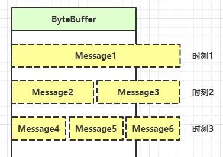

对于第一种情况需要对 ByteBuffer 进行扩容。对于第二、三中情况就需要对解决数据包切分的问题。

1. 可以采用固定消息长度，数据包大小一致，服务器按预定的长度进行读取，缺点就是浪费带宽和空间。
2. 另一种思路就是按分隔符进行拆分，缺点就是读取的效率较低。
3. TLV / LTV格式，根据后续消息的大小来分配 ByteBuffer 的空间。即 HTTP 1.1 或者 HTTP 2.0 格式。

第三种方式在 Netty 中会有很好的封装，这里为了简单使用第二种的形式来对案例进行教学，即使用 ByteBuffer 的 Compact 方法来进行操作。

使用 ByteBuffer 可能存在的问题：

1. 就是对于数据包过长的情况下，虽然切分了数据包，但是组合之后数据包过大会超过 ByteBuffer 所能存储的大小，因此需要对 ByteBuffer 进行扩容操作。
2. ByteBuffer 并不是线程安全的，对于不同的 SocketChannel，都有可能接收消息，但是其消息不能存放在一起；因此需要引用一个**附件**(attachment)来进行存储每个 SocketChannel 收发的消息内容。

在进行 `SocketChannel.register()` 的时候可以直接设置 Key 需要监听的操作和 attachment。

```java
ByteBuffer buffer = ByteBuffer.allocate(16);
sc.register(selector, SelectionKey.OP_READ, buffer);
```

获取对应的 attachment 或者重新设置 attachment：

```java
ByteBuffer buffer = (ByteBuffer) key.attachment();
key.attach(buffer);	// 重新设置 attachment 
key.attach(null);
```

当需要发送的内容实在过多的时候，就会发生向 ByteBuffer 中写入数据失败的情况，因此就需要关注可写事件(`OP_WRITE`)，等到下次可以继续写入的时候再进行。

Selector 中一个 Key 可以通过加运算或者是**或运算**添加关注默写操作，如果想要取关某些操作则使用减法。

🔵NIO 多线程优化

之前存在的问题：

1. 未能充分利用多核 CPU
2. 单线程处理事件，但是某个事件如果耗费事件过长，就会出现阻塞事件过长的情况

可以使用一个 Boss Selector 来管理网络的连接 Accept，用多个 Worker 来管理频繁的读写操作，分工明确。

```java
@Slf4j(topic = "MServer")
public class MultiThreadServer {
    public static void main(String[] args) throws IOException {
        Thread.currentThread().setName("boss");
        ServerSocketChannel scc = ServerSocketChannel.open();
        scc.configureBlocking(false);

        Selector boss = Selector.open();

        scc.register(boss, SelectionKey.OP_ACCEPT);
        scc.bind(new InetSocketAddress(8888));

        Worker worker0 = new Worker("Worker-0");


        while (true) {
            boss.select();
            Iterator<SelectionKey> iter = boss.selectedKeys().iterator();
            while (iter.hasNext()) {
                SelectionKey key = iter.next();
                iter.remove();
                if (key.isAcceptable()) {
                    SocketChannel sc = scc.accept();
                    log.info("Con: {}", sc.getRemoteAddress());
                    sc.configureBlocking(false);
                    worker0.register(sc);   // 注册
                }
            }
        }
    }

    static class Worker implements Runnable {
        private Thread thread;
        private Selector selector;
        private String name;
        private boolean start;
        private ConcurrentLinkedQueue<Runnable> queue = new ConcurrentLinkedQueue<>();

        public Worker(String name) {
            this.name = name;
        }

        public void register(SocketChannel sc) throws IOException {
            if (!start) {	// 保证线程只开启一次
                thread = new Thread(this, name);
                selector = Selector.open();
                thread.start();
                start = true;
            }

            queue.add(() -> {	// 添加注册事件
                sc.register(selector, SelectionKey.OP_READ);
            });

            selector.wakeup(); // 打断 select 阻塞，执行 register 操作
        }

        @Override
        public void run() {
            while (true) {
                try {
                    selector.select();
                    Runnable task = queue.poll();
                    if (task != null) {
                        // 如果队列中有需要注册是事件则执行
                        task.run();
                    }

                    Iterator<SelectionKey> iter = selector.selectedKeys().iterator();
                    while (iter.hasNext()) {
                        // ... 正常的读取信息操作，此处省略
                    }
                } catch (IOException e) {
                    e.printStackTrace();
                }
            }
        }
    }
}
```

worker 的数量最好设置为 CPU 核心的数量，参考[阿姆达尔定理](https://zh.wikipedia.org/wiki/%E9%98%BF%E5%A7%86%E8%BE%BE%E5%B0%94%E5%AE%9A%E5%BE%8B)

### 5. NIO vs BIO

参考书籍：UNIX 网络编程-卷1

🔵IO模型

IO 模型主要分为五类：阻塞 IO，非阻塞 IO 、多路复用模型、信号驱动 IO、异步 IO 模型。其中多路复用又分为单线程多路复用，单线程多路复用配合多线程读写业务复用（工作池、线程池、进程池等版本）等等。

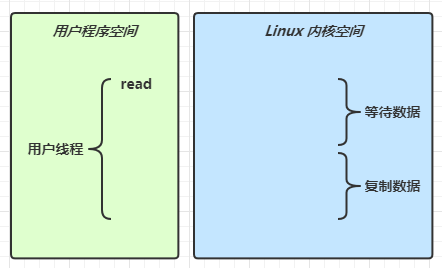

当读请求发送来的时候，阻塞 IO 会等待操作系统等待对应网络请求到达后，并且复制数据后才会返回数据；而非阻塞 IO 会一直请求直到网络数据到达，但是在操作系统复制数据的时候非阻塞 IO 还是会阻塞等待复制完毕。

同步和异步的区别：异步需要的线程至少有两个。

🔵零拷贝

零拷贝（Zero-Copy）是一种 I/O 操作优化技术，可以快速高效地将数据从文件系统移动到网络接口，而不需要将其从内核空间复制到用户空间。

对于简单的几句Java代码：

```java
File f = new File("helloword/data.txt");
RandomAccessFile file = new RandomAccessFile(file, "r");

byte[] buf = new byte[(int)f.length()];
file.read(buf);

Socket socket = ...;
socket.getOutputStream().write(buf);
```

但是其在操作系统层面需要进行的操作很多，内部工作流程如下：

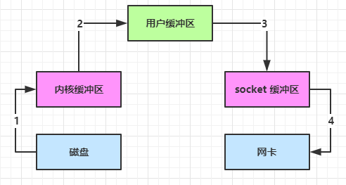

首先需要将对应磁盘上的文件读取到内核缓冲区中，然后再复制到 Java 程序的用户缓冲区中，开始向网络中发送数据的时候，还需要将数据复制到 Socket 的缓冲区中，然后操作系统准备发送网络数据的时候，还需要将 Socket 中的数据复制到网卡中去。

这个过程中发生了 3 次用户态和内核态的切换，以及 4 次复制操作，耗费的系统资源较多。

**NIO 优化：**

在 Java 中 ByteBuffer 可以直接通过分配系统内存来减少一次内存的复制，使用方法 `allocateDirect()` 来进行分配。

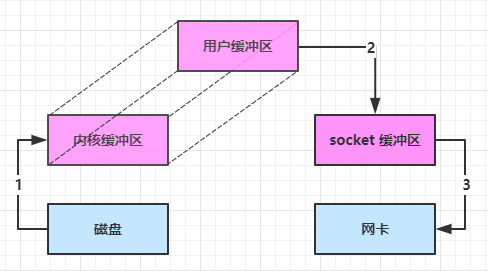

**进一步优化：**

在 Java 中如果存在两个 Channel 之间通过 transferTo / transferFrom 进行传输数据的时候，在 Linux 2.1 之后会提供的 sendFile 方法，操作系统会使用 DMA 的方式来将缓冲区的数据进行读写到磁盘或者网卡中。

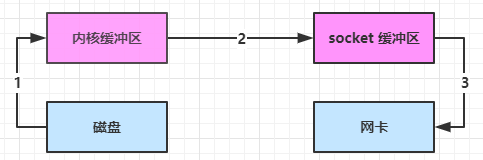

而在 Linux 2.4 之后，在 Java 调用 transferTo 方法后，操作系统会将内核缓冲区中的数据使用 DMA 的方式直接写入到网卡中，有了更少的用户态和内核态之间的切换，并且也减少了 CPU 之间的计算和传输。

另外还有一点需要注意的是：由于缓冲区的限制，零拷贝只适合小文件的传输和拷贝。

### 6. AIO

异步 IO

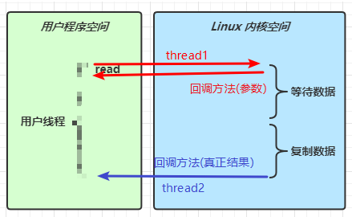

文件读取异步 IO：

默认文件 AIO 使用的线程都是守护线程，因此需要保持非守护线程的存活才能保证接收到消息。

```java
@Slf4j
public class AioDemo1 {
    public static void main(String[] args) throws IOException {
        try{
            AsynchronousFileChannel s = 
                AsynchronousFileChannel.open(
                	Paths.get("1.txt"), StandardOpenOption.READ);
            ByteBuffer buffer = ByteBuffer.allocate(2);
            log.debug("begin...");
            s.read(buffer, 0, null, new CompletionHandler<Integer, ByteBuffer>() {
                @Override
                public void completed(Integer result, ByteBuffer attachment) {
                    log.debug("read completed...{}", result);
                    buffer.flip();
                    debug(buffer);
                }

                @Override
                public void failed(Throwable exc, ByteBuffer attachment) {
                    log.debug("read failed...");
                }
            });

        } catch (IOException e) {
            e.printStackTrace();
        }
        log.debug("do other things...");
        System.in.read();
    }
}
```

还有网络异步 IO，由于在 Linux 环境下，网络的异步 IO 是由多路复用模拟实现的，因此效率较低而且实现需要注意的点也较多，现实中比较少用。

## 二. Netty 基础

Netty 是基于异步的、基于事件驱动的网络应用框架，可以用于开发高性能的网络应用服务器。相当于网络应用开发中的 Spring。

Netty 有自己的协议，可以解决 TCP 传输的问题如粘包等，可以解决在 Linux 中epoll 空轮询导致 CPU 100% 占用的问题。

为什么 Netty 要使用异步：

异步并未缩短响应事件，其提高的是 IO 请求的吞吐量。

### 1. 基础使用

搭建服务器需要为其设置组件，事件驱动器，通道实现以及事件实现等方法。

搭建服务器：

```java
public class HelloServer {
    public static void main(String[] args) {
        // 1. 服务器启动器，用于组转 netty 的组件
        new ServerBootstrap()
                // 2. BossEventLoop WorkerEventLoop(Selector, thread)
                .group(new NioEventLoopGroup())
                // 3. 使用的服务器 ServerChannel 的通道实现
                .channel(NioServerSocketChannel.class)
                // 4. 选择不同的角色的分工操作，比如 Boss 负责连接，worker 负责读写
                .childHandler(new ChannelInitializer<NioSocketChannel>() {
                    // 5. ChannelInitializer 发原则代表和客户端进行数据读写通道的初始化
                    // 用于负责添加别的 Handler
                    @Override
                    protected void initChannel(NioSocketChannel ch) throws Exception {
                        // 6. 添加具体的 handler
                        ch.pipeline().addLast(new StringDecoder()); // 将 ByteBuf 转为字符串
                        // 自定义的 handler
                        ch.pipeline().addLast(new ChannelInboundHandlerAdapter() {
                            @Override   // 读事件
                            public void channelRead(ChannelHandlerContext ctx, Object msg) throws Exception {
                                // 打印经过 StringDecoder 转化后的字符串
                                System.out.println(msg);
                            }
                        });

                    }
                })
                .bind(20001);    // 监听的端口
    }
}
```

搭建客户端：

```java
public class HelloClient {
    public static void main(String[] args) throws InterruptedException {
        new Bootstrap()
                .group(new NioEventLoopGroup())
                .channel(NioSocketChannel.class)
                .handler(new ChannelInitializer<NioSocketChannel>() {
                    @Override   // 在连接后被调用
                    protected void initChannel(NioSocketChannel ch) throws Exception {
                        ch.pipeline().addLast(new StringEncoder());
                    }
                })
                .connect(new InetSocketAddress("localhost", 20001))
                .sync()	// 阻塞方法，直到连接建立
                .channel()
                .writeAndFlush("Hello world");
    }
}
```

### 2. Netty 组件

🔵 EventLoop / EventLoopGroup

EventLoop 本质是单线程执行器（同时维护一个 Selector），用于处理 Channel 中源源不断的 IO 请求。 

EventLoopGroup 是一组 EventLoop，Channel 一般调用 EventLoopGroup 这个中的 register 方法来绑定其中一个 EventLoop，这个 Channel 上的后续 io 事件**都**是由这个 EventLoop 来完成（保证了 IO 事件处理时候的线程安全）。

其是接口，常见的实现有：

* NioEventLoopGroup，用于处理 IO 事件，普通任务以及定时任务
* DefaultEventLoopGroup，用于处理普通任务，定时任务

EventLoop 提交普通任务和定时任务：

```java
@Slf4j
public class TestEventLoop {
    public static void main(String[] args) {
        // 可以指定线程数，每个线程对应一个 EventLoop
        EventLoopGroup group = new NioEventLoopGroup(2);
        // 获取下一个 EventLoop 对象
        System.out.println(group.next());
        System.out.println(group.next());
        System.out.println(group.next());
        System.out.println(group.next());
        // 执行普通任务
        group.next().execute(() -> {
            log.debug("OK");
        });

        // 执行定时任务
        group.next().scheduleAtFixedRate(() -> log.debug("Kimoji"), 1, 1, TimeUnit.SECONDS);
    }
}
```

**EventLoopGroup 中的职责细分：**

职责细分优化可以分为两个部分：

1. 给服务器进行设置的时候需要分为两个角色，Boss 和 Worker 分别用于管理客户端连接和 IO 读写操作。再给 Server 指定 Group 的时候因此可以传入两个参数，前者就是 Boss ，Netty 会分配单独的线程来保证其执行，后者是 Worker， 用户可以根据自己的需求来分配对应的线程数。

   ```java
   new ServerBootstrap()
           // 前者就是 boss 只负责分工，后者管理读写
           .group(new NioEventLoopGroup(), new NioEventLoopGroup(2))
   ```

2. 之前的简单案例相当于单线程多路复用，当在处理客户端的 IO 请求的时候如果处理事件过长就会影响其他客户端 IO 请求操作的执行。因此对于重量级 IO 请求，模型应该改为单线程多路复用+多线程 IO 操作的模型。在 Netty 中也支持这样的操作，在进行流水线处理的时候默认指定的就是 NIO 自己对应的 NioEventLoopGroup，也可以指定用户自己创建的 NioEventLoopGroup。

   需要注意的一点就是 pipline 之间 handler 信息的传输需要设置 `ctx.fireChannelRead()` / `super.channelRead(ctx, msg)`，否则下一个 handler 接收不到对应的消息。

   ```java
   EventLoopGroup group = new DefaultEventLoopGroup();
   
   // ... 省略中间代码
   
   ch.pipeline()
           .addLast("handler-1", new ChannelInboundHandlerAdapter() {
               @Override
               public void channelRead(ChannelHandlerContext ctx, Object msg) {
                   log.debug("NioEventLoopGroup 接收到大任务，交给其他EventLoopGroup");
                   ctx.fireChannelRead(msg);   // 将消息传给下一个 handler
               }
           })
           .addLast(group, "Handler-2", new ChannelInboundHandlerAdapter() {
               @Override
               public void channelRead(ChannelHandlerContext ctx, Object msg) {
                   ByteBuf buf = (ByteBuf) msg;
                   log.debug(buf.toString(Charset.defaultCharset()));
               }
           });
   ```

示意图：

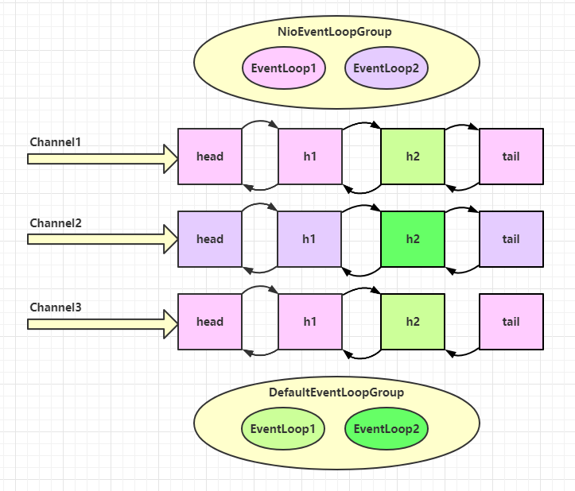

完整代码：

```java
public static void main(String[] args) {

    EventLoopGroup group = new DefaultEventLoopGroup();

    new ServerBootstrap()
            // 前者就是 boss 只负责分工，后者管理读写
            .group(new NioEventLoopGroup(), new NioEventLoopGroup(2))
            .channel(NioServerSocketChannel.class)
            .childHandler(new ChannelInitializer<NioSocketChannel>() {
                @Override
                protected void initChannel(NioSocketChannel ch) throws Exception {
                    ch.pipeline()
                            .addLast("handler-1", new ChannelInboundHandlerAdapter() {
                                @Override
                                public void channelRead(ChannelHandlerContext ctx, Object msg) throws Exception {
                                    log.debug("NioEventLoopGroup 接收到大任务，交给其他EventLoopGroup");
                                    ctx.fireChannelRead(msg);   // 将消息传给下一个 handler
                                }
                            })
                            .addLast(group, "Handler-2", new ChannelInboundHandlerAdapter() {
                                @Override
                                public void channelRead(ChannelHandlerContext ctx, Object msg) throws Exception {
                                    ByteBuf buf = (ByteBuf) msg;
                                    log.debug(buf.toString(Charset.defaultCharset()));
                                }
                            });
                }
            })
            .bind(20001);
}
```

🔵 Channel

Channel 的主要方法：

* close() 用于关闭 Channel
* closeFuture() 用于处理 channel 的关闭
  * sync 方法是同步等待 channel 的关闭
  * addListener 的方法是异步等待 channel 的关闭
* pipline() 用于给 Channel 添加处理器
* write() 是将数据写入 Channel，但是不会立即发送，需要使用 flush() 方法才会发送。想要直接发送可以使用 writeAndFlsuh() 方法。

在客户端，Channel 的 connect 方法是异步非阻塞的，其返回的对象是 ChannelFuture 类型，调用 sync 方法可以同步阻塞等待 NIO 线程 Channel 建立连接完毕后返回其对象；第二种获取 Channel 的方法是使用方法 addListener() 来异步获取 Channel 对象。

```java
public static void main(String[] args) throws InterruptedException {
    ChannelFuture cf = new Bootstrap()
            .group(new NioEventLoopGroup())
            .channel(NioSocketChannel.class)
            .handler(new ChannelInitializer<NioSocketChannel>() {
                @Override   // 在连接后被调用
                protected void initChannel(NioSocketChannel ch) throws Exception {
                    ch.pipeline().addLast(new StringEncoder());
                }
            })
            .connect(new InetSocketAddress("localhost", 20001));

    // 方式1 同步获取
    Channel channel = cf.sync().channel();
    // 方式2 异步获取
    cf.addListener((ChannelFutureListener)cf2 -> {
        Channel channel = cf2.channel();
        channel.writeAndFlush("Hello world");
    });
}
```

优雅关闭 Channel，并且关闭 Channel 之后关闭 Java 程序：:

```java
NioEventLoopGroup group = new NioEventLoopGroup();

// ... 省略中间代码

// 第一种办法
ChannelFuture closeFuture = channel.closeFuture();
log.debug("Waiting close...");
closeFuture.sync(); // 等待 channel.close()
log.debug("Channel closed...");
group.shutdownGracefully();

// 第二种方法
closeFuture.addListener((ChannelFutureListener) channelFuture -> {
    log.debug("Channel closed...");
    group.shutdownGracefully();
});
```

🔵 Future & Promise

JDK 和 Netty 中都有 Future 这个类，Netty 中是继承 JDK 中的 Future 类，Promise 又对 Netty Future 类进行了扩展。

* jdk Future 只能同步等待任务结束（或成功、或失败）才能得到结果
* netty Future 可以同步等待任务结束得到结果，也可以异步方式得到结果，但都是要等任务结束
* netty Promise 不仅有 netty Future 的功能，而且脱离了任务独立存在，只作为两个线程间传递结果的容器

JDK future:

```java
static void jdkFuture() throws ExecutionException, InterruptedException {
    ExecutorService service = Executors.newFixedThreadPool(2);
    log.debug("Wait");
    Thread.sleep(1000);
    Future<Integer> submit = service.submit(() -> {
        try {
            Thread.sleep(1000);
            return 50;
        } catch (InterruptedException e) {
            e.printStackTrace();
            return 30;
        }
    });
    Integer integer = submit.get();
    log.info("{}", integer);
}
```

Netty future：

```java
static void nettyFuture() throws ExecutionException, InterruptedException {
    NioEventLoopGroup group = new NioEventLoopGroup();
    Future<Integer> future = group.next().submit(() -> {
        try {
            Thread.sleep(1500);
        } catch (InterruptedException e) {
            e.printStackTrace();
        }
        return 20;
    });

    System.out.println(future.getNow());    // 立即获取
    System.out.println(future.get());   // 阻塞获取
}
```

Promise:

```java
static void testPromise() throws ExecutionException, InterruptedException {
    EventLoop eventLoop = new NioEventLoopGroup().next();
    DefaultPromise<Integer> promise = new DefaultPromise<>(eventLoop);

    new Thread(() -> {
        try {
            log.debug("Starting...");
            int i = 1 / 0;
            Thread.sleep(1000);
            promise.setSuccess(20);
        } catch (Exception e) {
            e.printStackTrace();
            promise.setFailure(e);
        }
    }).start();

    System.out.println(promise.get());
}
```

🔵 Handler & Pipeline

ChannelHandler 用来处理 Channel 上的各种事件，分为入站(读)和出站(写)两种操作，所有的 Handler 连成一起就是 Pipeline。

* 入站一般要继承 ChannelInboundHandlerAdapter 的类，主要用于读取客户端数据，写回结果。
* 出站一般要继承 ChannelOutboundHandlerAdapter 的类，主要对写回结果进行加工。
* 双向数据一般要继承 ChannelDuplexHandler 的类，用于双向数据传输处理加工。

在添加 Pipeline 的 Handler 的时候，Netty 会自动添加两个 Handler ： Head 和 Tail Handler。

Pipeline 的执行顺序：

* 入站的操作是正序执行，出站的操作逆序执行

对于入站 Handler 之间的消息传递，需要调用 `super.channelRead()` / `ctx.fireChannelRead()` 操作才能传递给下一个 Handler，如果下一个 Handler 没有收到消息，就**不会执行**和继续向下传递消息了。入站和出站之间的 Handler 之间不需要进行信息传递。

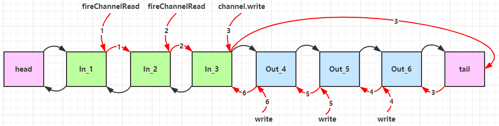

Channel.writeAndFlush() 和 ctx.writeAndFlush() 的区别：

* 前者是将信息流写入 tail Handler，数据流要通过所有的出站 Handler
* 后者是将信息流写入当前的 Handler，数据流直接向前传找出站的 Handler

Netty 中为了调试 Pipeline 方便，提供了 EmbeddedChannel 类来进行调试。

🔵ChannelHandlerContext

1. Context.close() 和 Channel.close() 的区别：

   ```java
   ChannelPipeline p = ...;
   p.addLast("A", new SomeHandler());
   p.addLast("B", new SomeHandler());
   p.addLast("C", new SomeHandler());
   ...
   
   public class SomeHandler extends ChannelOutboundHandlerAdapter {
       @Override
       public void close(ChannelHandlerContext ctx, ChannelPromise promise) {
           ctx.close(promise);
       }
   }
   ```

   * `Channel.close()` 会触发 `C.close()` , `B.close()`, `A.close()`, 然后再关闭 channel
   *  `C.close()` 会触发  `B.close()`, `A.close()`, 然后再关闭 channel
   * 以此类推

   主动关闭 Channel 之后触发 Inbound 事件 `channelUnregistered()`

2. 


### 3. ByteBuf

🔵创建

Netty 中的 ByteBuf 是可以动态扩容的。读写分为两个指针，不用像 ByteBuffer 切换读写模式

```java
public static void main(String[] args) {
    // 创建，默认是直接内存
    ByteBuf buf = ByteBufAllocator.DEFAULT.buffer();
    buf.writeBytes("Hello world".getBytes(StandardCharsets.UTF_8));
    log.info("{}", buf);
    // 分为直接内存和 Java 堆内存
    ByteBufAllocator.DEFAULT.heapBuffer();
    ByteBufAllocator.DEFAULT.directBuffer();
    // io.netty.buffer.PooledUnsafeDirectByteBuf
}
```

ByteBuf 也是支持分配直接内存和 Java 堆内存的，默认情况下 ByteBuf 分配的是系统的直接内存。

⭐一般情况下创建 ByteBuf 实在 pipeline 中创建，因此**强烈推荐**以下创建方法：

```java
ctx.alloc().buffer(32);
```

🔵池化

池化的最大意义就是在可以重用 ByteBuf，在高并发的情况下，池化的功能更节约内存，也可以减少内存溢出的可能。Netty 4.1 之后默认会开启池化功能。可以通过设置系统的环境变量来进行设置：

```
-Dio.netty.allocator.type={unpooled | pooled}
```

🔵读取和写入

ByteBuf 的写入支持多种类型。

```java
public static void main(String[] args) {
    ByteBuf buf = ByteBufAllocator.DEFAULT.buffer();
    buf.writeInt(6);
    buf.writeBytes("aka. QZQ".getBytes(StandardCharsets.UTF_8));
    // 读取
    log.info("{}", buf.toString(StandardCharsets.UTF_8));
    log.info("{}", buf);
    log.info("{}", buf.readInt());
    int left = buf.writerIndex() - buf.readerIndex();
    log.info("{}", buf.readBytes(left).toString(Charset.defaultCharset()));
}
```

输出：

```
11:03:53.496 [main] INFO Buffer -    aka. QZQ
11:03:53.496 [main] INFO Buffer - PooledUnsafeDirectByteBuf(ridx: 0, widx: 12, cap: 256)
11:03:53.496 [main] INFO Buffer - 6
11:03:53.496 [main] INFO Buffer - aka. QZQ
```

🔵内存回收

未池化的 Java 堆内存由 JVM 来进行回收，直接内存由系统来进行回收；池化的 ByteBuf 回收机制较为复杂，由ByteBuf 池来进行回收，基本规则就是谁是 ByteBuf 的最后使用者，谁负责回收 release。

🔵Slice 数据切片

```java
public static void main(String[] args) {
    ByteBuf buf = ByteBufAllocator.DEFAULT.buffer(10);
    buf.writeBytes("abcdefghij".getBytes(StandardCharsets.UTF_8));

    ByteBuf f1 = buf.slice(0, 5);
    ByteBuf f2 = buf.slice(5, 5);
    f1.setByte(2, 'q');

    log.info("{}", buf.toString(Charset.defaultCharset()));
    log.info("{}", f1.toString(Charset.defaultCharset()));
    log.info("{}", f2.toString(Charset.defaultCharset()));
}
```

输出：

```
11:17:31.621 [main] INFO Buffer - abqdefghij
11:17:31.621 [main] INFO Buffer - abqde
11:17:31.621 [main] INFO Buffer - fghij
```

其底层使用的是零拷贝的思想，切片之后的 ByteBuf 并未发送任何的内存复制，使用的还是原始 ByteBuf 的内存，切片后维护堵路的 read，write 指针。

**注意**：切片后的产生新的 ByteBuf 有使用限制，比如不能增加长度等；如果原有的 ByteBuf 释放内存后，新的 ByteBuf 也会受到影响，可以使用 `retain()` 方法让引用数量加一，不被回收内存。

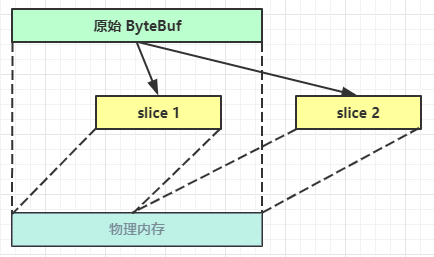

其他方法：

* duplicate() 还是零拷贝，使用的还是原有的内存数据。(感觉没什么用)
* copy() 是深拷贝，与原有的数据无关了

##  三. Netty 进阶

### 1. 粘包半包

由于 TCP 协议存在的问题，并且由于滑动窗口的存在，窗口大小决定了数据包的大小，因此会产生粘包和半包的问题。

🔵产生原因：（TCP 是流式协议，无消息边界）

粘包：

* 现象：发送 abc def 两个数据包，接收到 abcdef 合在一起的数据包
* 原因：
  * 应用层接收方设置的 ByteBuf 过大
  * TCP 层面可能由于接收方处理不及时且滑动窗口较大，多个消息会一并缓冲在窗口中
  * Nagle 算法优化，发送方数据包过小

半包：

* 现象：发送 abcdef，接收到 abc def 两个数据包
* 原因：
  * 应用层接收方的 ByteBuf 设置过小
  * TCP 发送方的报文大于滑动窗口剩余大小，只能发送前部分，后部分放到下一个数据包发
  * MSS 的限制：发送数据包大小超过 MSS 限制之后，会对数据包进行切分 （MTU - 40）

🔵解决方法：

1. 短连接（❌）：

   发送一次数据包就建立一次连接，发送完毕即关闭连接，缺点就是效率太低，不能解决半包问题

   ```java
   @Override
   public void channelActive(ChannelHandlerContext ctx) throws Exception {
       // channel 连接建立触发
       ByteBuf buffer = ctx.alloc().buffer(16);
       buffer.writeBytes("abcdefghijklmnop".getBytes(StandardCharsets.UTF_8));
       ch.writeAndFlush(buffer);
       super.channelActive(ctx);
       // 关闭
       ctx.channel().close();
   }
   ```

2. 定长解码器（❌）：

   每次发送一个数据包，发送固定长度的数据，如果小于固定长度就使用 padding，大小固定长度就切分。

   缺点就是浪费空间。使用的类： `FixedLengthFrameEncoder`

3. 行编码器（❌）：

   就是使用行分隔符来解决，缺点就是需要转移，并且效率较低，需要扫描对应的分割字符。

   使用的类：`LineBasedFrameEncoder` / `DelimiterBasedFrameEncoder`

4. 基于 head 和 body 的编码器：

   类似 Http 协议，有 Content-Length 来标注数据包的大小，也有类似 headers 等数据头。

   使用的类：`LengthFiledFrameDecoder`

### 2. 协议的设计与解析

Netty 的内部集成了很多协议，可以使用 Netty 自带的协议来编写高性能的网络编程。

🔵 HTTP 协议

这个是一个搭建 HTTP 服务器的小 Demo，服务器和客户端之间的信息的编码解码使用 `HttpServerCodec` 类来进行处理，它看可以 Inbound 也是 Outbound 信息处理。

在接收 HTTP 的请求之后，会获得两个消息，一个是 `HttpRequest` 请求头的信息，另一个是 `HttpContent` 请求体的数据，需要判断获取消息的类型来进行处理。

也可以使用 `SimpleChannelInboundHandler` 类来进行消息处理，其是根据泛型指定的类型来进行消息处理，如果是对应的类型则处理，如果不是则处理交给下一个 Handler 来进行处理。

```java
@Slf4j(topic = "TestHttp")
public class TestHttp {
    public static void main(String[] args) {
        NioEventLoopGroup boss = new NioEventLoopGroup(1);
        NioEventLoopGroup worker = new NioEventLoopGroup();
        ChannelFuture cf = new ServerBootstrap()
                .group(boss, worker)
                .channel(NioServerSocketChannel.class)
                .childHandler(new ChannelInitializer<NioSocketChannel>() {
                    @Override
                    protected void initChannel(NioSocketChannel ch) throws Exception {
                        ChannelPipeline pl = ch.pipeline();
                        pl.addLast(new LoggingHandler());
                        pl.addLast(new HttpServerCodec());
                        pl.addLast(new SimpleChannelInboundHandler<HttpRequest>() {
                            // HttpRequest 是处理请求头
                            @Override
                            protected void channelRead0(ChannelHandlerContext ctx, HttpRequest req) throws Exception {
                                log.info("请求URI: {}", req.uri());
                                DefaultFullHttpResponse rsp = new DefaultFullHttpResponse(req.protocolVersion(), HttpResponseStatus.OK);
                                byte[] msg = "<h2>hello world</h2>".getBytes(StandardCharsets.UTF_8);
                                rsp.headers().setInt(CONTENT_LENGTH, msg.length);
                                rsp.content().writeBytes(msg);
                                ctx.writeAndFlush(rsp);
                            }
                        });
                    }
                }).bind(80);
    }
}
```

🔵 自定义协议的要素

* 魔数，用来第一事件判定是否未无效的数据包，比如 Java 字节码文件开头是 `CA FE`
* 版本号，可以支持协议的升级
* 序列化算法，消息正文到底采用的是那种序列化和发序列化的方式
* 指令的类型，是登录、注册、单聊、群聊等根业务相关。
* 请求序号，为了双工通信，提供异步能力
* 正文长度
* 消息正文

Demo:

```java
// ByteBuf 与 指定类之间的转换
@Slf4j
public class MessageCodec extends ByteToMessageCodec<Message> {
    private final byte[] MAGIC = {0xF, 0xA, 0xD, 0xE};

    @Override
    protected void encode(ChannelHandlerContext ctx, Message msg, ByteBuf buf) throws Exception {
        buf.writeBytes(MAGIC);  // Magic Number
        buf.writeByte(1);   // Version
        // Serialize algorithm. JDK-0, JSON-1
        buf.writeByte(0);
        // message type
        buf.writeByte(msg.getMessageType());
        // Request order
        buf.writeInt(msg.getSequenceId());
        // Nonsense, for padding
        buf.writeByte(0xff);
        // Content length
        ByteArrayOutputStream bos = new ByteArrayOutputStream();
        ObjectOutputStream oos = new ObjectOutputStream(bos);
        oos.writeObject(msg);
        byte[] bytes = bos.toByteArray();
        buf.writeInt(bytes.length);
        // Content
        buf.writeBytes(bytes);
    }

    @Override
    protected void decode(ChannelHandlerContext ctx, ByteBuf buf, List<Object> list) throws Exception {
        int magic = buf.readInt();
        byte version = buf.readByte();
        byte serialType = buf.readByte();
        byte msgType = buf.readByte();
        int reqOrder = buf.readByte();
        buf.readByte();
        int len = buf.readInt();
        byte[] content = new byte[len];
        buf.readBytes(content, 0, len);
        Message msg = null;
        if (serialType == 0) {
            ByteArrayInputStream bis = new ByteArrayInputStream(content);
            ObjectInputStream ois = new ObjectInputStream(bis);
            msg = (Message) ois.readObject();
            log.info("{}", msg);

        }
        // Netty 约定解析出来的数据需要加入 list，给下一个 handler 使用
        list.add(msg);
    }
}
```

测试代码：

```java
EmbeddedChannel chan = new EmbeddedChannel(
        new LengthFieldBasedFrameDecoder(1024, 12, 4, 0, 0),
        new LoggingHandler(),
        new MessageCodec()
);
```

`LengthFieldBasedFrameDecoder` 用来解决粘包半包的问题。

🔵 复用 Handler

对于多个 Channel，如果想要复用某个 Handler，能不能只创建一个实例，然后多个 Channel 复用呢？

有些 Handler 是可以进行复用的，比如 `LoggingHandler` 是充分考虑了线程安全性的，`LengthFieldBasedFrameDecoder` 却并未考虑，因为前者只是使用打印数据信息，后者需要存储数据来防止出现粘包半包现象的出现，如果后者复用，就会让多个 Channel 获取到的信息混在一起，分不清楚信息的边界。

在 Netty 中有注解 `@Sharable` 标注的 Handler 就表示可以进行多个 Handler 复用，只需要创建一个实例即可。

### 3. 序列化算法

```java
public interface Serializer {
    <T> T deserialize(Class<T> clazz, byte[] bytes);

    <T> byte[] serialize(T obj);

    enum Algorithm implements Serializer {
        JSON {
            @Override
            public <T> T deserialize(Class<T> clazz, byte[] bytes) {
                String json = new String(bytes, StandardCharsets.UTF_8);
                return new Gson().fromJson(json, clazz);
            }

            @Override
            public <T> byte[] serialize(T obj) {
                String s = new Gson().toJson(obj);
                return s.getBytes(StandardCharsets.UTF_8); 
            }
        }
    }
}
```

### 4. 参数优化

对于客户端和服务器端，都可以对某些参数进行指定。可以使用方法 `option()` 或者 `childOption()`来进行指派。

对于客户端，`option` 时用于给 SocketChannel 来进行配置。对于服务器端 `option` 时用于给 ServerSocketChannel 进行配置参数，`childOption` 用于给 SocketChannel 进行配置参数。

🔵CONNECT_TIMEOUT_MILLIS

用于客户端建立连接时如果在指定毫秒内未建立连接，则抛出异常。

```java
new Bootstrap()
        .group(group)
        .channel(NioSocketChannel.class)
        .option(ChannelOption.CONNECT_TIMEOUT_MILLIS, 5000)
```

🔵SO_BACKLOG

用于服务器端，用于控制 linux 下半连接队列和全连接队列。

半连接队列大小通过在 `/proc/sys/net/ipv4/tcp_max_syn_backlog` 进行指定

全连接队列大小在 `/proc/sys/net/core/somaxconn` 进行指定，在使用 listen 函数时，内核会根据传入的 backlog 函数与系统中的参数比较取较小值，如果全连接队列满了，server 会发送一个拒绝连接的错误信息到 clent。

在 linux 不仅需要在 Netty 中进行设置，还需要再系统文件中进行配置，否则就会取最小值。

```java
new ServerBootstrap()
        .group(boss, worker)
        .channel(NioServerSocketChannel.class)
        .option(ChannelOption.SO_BACKLOG, 1024);
```

🔵TCP_NODELAY

是否开启 Nagle 算法，默认开启(false)。

🔵SO_SNDBUF & SO_REVBUF

属于 SocketChannel 参数，指定发送缓冲区和接收缓冲区的大小，现在系统会自动调整，尽量不需要指定。

🔵ALLOCATOR

属于 SocketChannel 参数，用于分配 ByteBuf。

一般分配的类型就是池化的直接内存(PooledUnsafeDirectedByteBuf)

🔵RCVBUF_ALLOCATOR

属于 SocketChannel 参数，对于 IO 类的 ByteBuf 强制使用直接内存，用于控制 netty 控制缓冲区的大小。

## 四 Netty 应用

### 1. 自动重连

Netty 连接到断开事件：REGISTERED -> ACTIVE -> READ COMPLETE -> INACTIVE -> UNREGISTERED

实现客户端在与服务器端断连后自动重新连接（空闲检测）：

根据上述事件触发时间点来看，应该在 `channelUnregistered` 事件触发后进行重连操作。

Client：

```java
@Slf4j(topic = "c.UptimeClient")
public class UptimeClient {
    private static final Bootstrap client = new Bootstrap();

    public static void main(String[] args) {
        EventLoopGroup group = new NioEventLoopGroup();
        client.group(group)
                .channel(NioSocketChannel.class)
                .remoteAddress("localhost", 20001)
                .handler(new ChannelInitializer<SocketChannel>() {
                    @Override
                    protected void initChannel(SocketChannel ch) throws Exception {
                        ChannelPipeline p = ch.pipeline();
                        p.addLast(new IdleStateHandler(10, 0, 0));
                        p.addLast(new UptimeClientHandler());
                    }
                });
        client.connect();
    }

    public static void connect() {
        client.connect().addListener((ChannelFutureListener) future -> {
            if (future.cause() != null) {
                log.error("Failed to connect server, err", future.cause());
            }
        });
    }
}
```

Handler：

```java
@Slf4j(topic = "c.UptimeClient")
public class UptimeClientHandler extends ChannelInboundHandlerAdapter {
    @Override
    public void channelActive(ChannelHandlerContext ctx) throws Exception {
        log.debug("Connected to server: {}", ctx.channel().remoteAddress());
    }

    @Override
    public void channelInactive(ChannelHandlerContext ctx) throws Exception {
        log.debug("Disconnected to server: {}", ctx.channel().remoteAddress());

    }

    @Override
    public void channelUnregistered(ChannelHandlerContext ctx) throws Exception {
        log.debug("Channel Unregistered");
        ctx.channel().eventLoop().schedule(UptimeClient::connect, 5, TimeUnit.SECONDS);
    }

    @Override
    public void userEventTriggered(ChannelHandlerContext ctx, Object evt) throws Exception {
        if (evt instanceof IdleStateEvent) {
            IdleStateEvent event = (IdleStateEvent) evt;
            if (event.state() == IdleState.READER_IDLE) {
                System.out.println("Disconnecting server due to READER_IDLE");
                ctx.close();
            }
        }
    }

    @Override
    public void exceptionCaught(ChannelHandlerContext ctx, Throwable cause) throws Exception {
        cause.printStackTrace();
        ctx.close();
    }
}
```

重连过程：

​		首先连接到服务器，如果客户端在指定时间内未收到客户端的消息，则触发 `IdleStateEvent` 的 `READER_IDLE` 信号，信号触发 `userEventTriggered` 事件，在这个事件中进行 channel 关闭，等待 Channel Inactive，之后再等待 ChannelUnregisterd 事件触发与 eventLoopGroup 注销之后，重新进行连接。

### 2. TLS 加密

参考：

1. [SSL/TLS应用示例](https://www.jianshu.com/p/710f70a99cbc)
2. [SSL / TLS 工作原理和详细握手过程 ](https://segmentfault.com/a/1190000021559557)

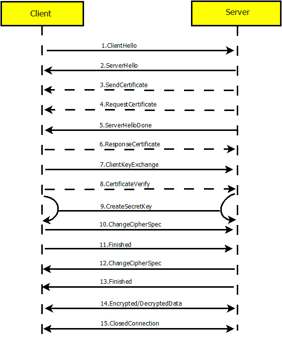

客户端和服务器端握手协议（双向认证）：

1. ClientHello——客户端发送所支持的 SSL/TLS 的最高协议版本号和所支持的加密算法集合给服务器端
2. ServerHello——服务器端选定双方都支持的 SSL/TLS 协议版本和加密方法及压缩方法返回客户端。
3. SendCertificate——服务器端发送服务器端证书给客户端
4. RequestCertificate——（双向）服务器端请求客户端证书
5. ServerHelloDone——服务器端通知客户端初始协商结束
6. ResponseCertificate——（双向）客户端向服务器端发送客户端证书
7. ClientKeyExchange——客户端使用服务器端公钥，对客户端的公钥和密钥种子进行加密后发送给服务器
8. CerticateVerify——（双向）客户端用私钥生成数字签名发送给服务器端，让其通过客户端公钥进行验证
9. CreateSecretKey——通讯双方基于密钥种子等信息生成通讯密钥
10. ChangeCipherSpec——客户端通知服务器端已将通讯方式切换为加密模式
11. Finished——客户端已做好加密通讯的准备
12. ChangeCipherSpec——服务器端通知客户端已将通讯方式切换为加密模式
13. Finished——服务器端已做好加密通讯的准备
14. Encrypted / Decrypted Data——双方使用客户端密钥，通过对称加密算法对通讯内容加密
15. ClosedConnection——通信结束，断开连接

🔵数字证书：在进行非对称加密通信中，不能直接传输公钥，如果被公钥被中间人拦截或者篡改还是会造成信息泄密。因此在传输的时候需要使用数字签名，使用服务器端的私钥对证书中的信息进行加密得到数字签名，然后将证书和数字签名一并发给客户端，客户端通过证书中的公钥解密数字签名，然后对比解密结果和证书中的信息进行比对证书是否受到篡改。

🔵生成证书：

1. 创建CA根证书管理员

   ```sh
   openssl genrsa -aes256 -out ca.key 2048	# 生成 CA 管理员私钥
   openssl req -sha256 -new -x509 -days 3650 -key ca.key -out ca.crt -subj "/C=CN/ST=SHANGHAI/O=2MW/CN=2Mw"	# 生成证书
   ```

   需要设置 CA 密钥的密码，在生成证书的时候还需要使用

   DN 字段：C 表示 country，ST 表示州或者省，L 表示城市，O 表示证书持有者组织，CN 证书持有者姓名

2. 为服务器生成证书申请：

   ```sh
   openssl genrsa -aes256 -out server.key 2048	# 生成服务器端私钥
   openssl rsa -in server.key -out server_unsecure.key	# (可选)导出无密码的私钥
   openssl req -sha256 -new -key server.key -subj "/C=CN/ST=Shang\Hai/O=2MwOrg/CN=2MwServer" -out server.csr	# 生成证书申请文件
   ```

   为服务器生成证书申请文件，交给CA来进行签名。也可以使用自己的 key 进行签名。

3. CA 为服务器证书进行签名：

   ```sh
   openssl x509 -req -days 3650 -in server.csr -CA ca.crt -CAkey ca.key -out server.crt
   ```

4. 由于 netty 4 不支持 pkcs12 格式的私钥，所以需要将其转为 pkcs8 格式的私钥

   ```sh
   openssl pkcs8 -topk8 -in server.key -out server.pk8 -nocrypt
   ```

   

🔵Netty 配置：

将 CA 证书、服务器证书和服务器密钥移动到 resource 目录下：

服务器端配置（服务器端需要配置三个文件）：

```java
@Slf4j(topic = "c.SecureServer")
public class SecureChatServer {

    private static SelfSignedCertificate ssc = null;
    private static SslContext sslCtx;

    static {
        try {
            // 获取 resource 目录
            String path = SecureChatServer.class.getClassLoader().getResource("").getPath();
            File cert = new File(path + "server.crt");
            File key = new File(path + "server.pk8");
            File root = new File(path + "ca.crt");
            ssc = new SelfSignedCertificate();
            sslCtx = SslContextBuilder.forServer(cert, key) // 设置服务器公钥和私钥
                    .trustManager(root) // 设置 CA 证书
                    .clientAuth(ClientAuth.NONE).build();   // 设置单向认证
        } catch (CertificateException | SSLException e) {
            e.printStackTrace();
        }
    }


    public static void main(String[] args) {
        EventLoopGroup boss = new NioEventLoopGroup();
        EventLoopGroup worker = new NioEventLoopGroup();
        ServerBootstrap server = new ServerBootstrap()
                .group(boss, worker)
                .channel(NioServerSocketChannel.class)
                .handler(new LoggingHandler(LogLevel.INFO))
                .childHandler(new ChannelInitializer<SocketChannel>() {
                    @Override
                    protected void initChannel(SocketChannel ch) throws Exception {
                        ChannelPipeline p = ch.pipeline();
                        p.addLast(sslCtx.newHandler(ch.alloc()));
                        p.addLast(new DelimiterBasedFrameDecoder(8192, Delimiters.lineDelimiter()));
                        p.addLast(new StringDecoder());
                        p.addLast(new StringEncoder());
                        p.addLast(new SecureChatServerHandler());
                    }
                });
        try {
            ChannelFuture future = server.bind(20001).sync();
            future.channel().closeFuture().sync();
        } catch (InterruptedException e) {
            e.printStackTrace();
        } finally {
            boss.shutdownGracefully();
            worker.shutdownGracefully();
        }
    }
}
```

客户端配置（客户端只需要配置ca证书）：

```java
@Slf4j(topic = "c.SecureClient")
public class SecureChatClient {
    static SslContext sslCtx;

    static {
        try {
            String path = SecureChatClient.class.getClassLoader().getResource("").getPath();
            File root = new File(path + "ca.crt");
            sslCtx = SslContextBuilder.forClient()
                    .trustManager(root).build();
        } catch (SSLException e) {
            e.printStackTrace();
        }
    }

    public static void main(String[] args) {
        NioEventLoopGroup group = new NioEventLoopGroup();
        Bootstrap client = new Bootstrap().group(group)
                .channel(NioSocketChannel.class)
                .remoteAddress("localhost", 20001)
                .handler(new ChannelInitializer<SocketChannel>() {
                    @Override
                    protected void initChannel(SocketChannel ch) throws Exception {
                        ChannelPipeline p = ch.pipeline();
                        p.addLast(sslCtx.newHandler(ch.alloc()));
                        p.addLast(new DelimiterBasedFrameDecoder(8192, Delimiters.lineDelimiter()));
                        p.addLast(new StringDecoder());
                        p.addLast(new StringEncoder());
                        p.addLast(new SecureChatClientHandler());
                    }
                });

        try {
            ChannelFuture cf = client.connect().sync();

            Channel channel = cf.channel();
            BufferedReader reader = new BufferedReader(new InputStreamReader(System.in));

            while (true) {
                String s = reader.readLine();
                if ("bye".equalsIgnoreCase(s)) {
                    channel.close();
                    break;
                }
                channel.writeAndFlush(s + "\n");
            }

            channel.closeFuture().sync();
        } catch (InterruptedException | IOException e) {
            e.printStackTrace();
        } finally {
            group.shutdownGracefully();
        }
    }
}
```

### 3. 服务器群发

可以维护一个 ChannelGroup 的类，当有连接进来的时候将 channel 加入 group，当发送消息的时候只需每个遍历 writeAndFlush 即可。

```java
@Slf4j(topic = "c.SecureServer")
public class SecureChatServerHandler extends SimpleChannelInboundHandler<String> {

    static final ChannelGroup channels = new DefaultChannelGroup(GlobalEventExecutor.INSTANCE);

    @Override
    public void channelActive(ChannelHandlerContext ctx) throws Exception {
        ctx.pipeline().get(SslHandler.class).handshakeFuture().addListener(future -> {
            String hostName = InetAddress.getLocalHost().getHostName();
            String cipherSuite = ctx.pipeline().get(SslHandler.class).engine().getSession().getCipherSuite();
            ctx.writeAndFlush("Welcome to " + hostName + " secure chat service\n");
            ctx.writeAndFlush("Protected by " + cipherSuite + "\n");
            channels.add(ctx.channel());
        });
    }

    @Override
    public void channelInactive(ChannelHandlerContext ctx) throws Exception {
        log.debug("有一个用户断开 : {}", ctx.channel().remoteAddress());
        channels.remove(ctx.channel());
    }

    @Override
    protected void channelRead0(ChannelHandlerContext ctx, String s) throws Exception {
        // Send msg to other channels
        log.debug("[{}]: {}", ctx.channel().remoteAddress(), s);
        for (Channel c : channels) {
            StringBuilder sb = new StringBuilder("[");
            if (c != ctx.channel()) sb.append(ctx.channel().remoteAddress());
            else sb.append("YOU");
            sb.append("]").append(s).append("\n");
            c.writeAndFlush(sb.toString());
        }

        if ("bye".equals(s.toLowerCase(Locale.ROOT))) {
            ctx.close();
        }
    }

    @Override
    public void exceptionCaught(ChannelHandlerContext ctx, Throwable cause) throws Exception {
        cause.printStackTrace();
        ctx.close();
    }
}
```

### 4. UDP 数据报和组播

使用的 Channel 是 NioDatagramChannel，并且如果需要使用多播的话需要添加 Option - SO_BROADCAST，来开启 IP 多播。发送和接收到的数据包为 DatagramPacket。

bind(0) 的话是随意绑定一个端口。

发送方：

```java
@Slf4j(topic = "c.UdpClient")
public class UdpClient {
    public static void main(String[] args) {
        EventLoopGroup group = new NioEventLoopGroup();
        Bootstrap client = new Bootstrap()
                .group(group)
                .channel(NioDatagramChannel.class)
                .option(ChannelOption.SO_BROADCAST, true)
                .handler(new SimpleChannelInboundHandler<DatagramPacket>() {
                    @Override
                    protected void channelRead0(ChannelHandlerContext ctx, DatagramPacket msg) throws Exception {
                        String resp = msg.content().toString(StandardCharsets.UTF_8);
                        if (resp.startsWith("QOTM: ")) {
                            log.debug("{}", resp.substring(6));
                            ctx.close();
                        }
                    }
                });

        try {
            Channel channel = client.bind(0).sync().channel();
            ByteBuf buffer = channel.alloc().buffer();
            buffer.writeCharSequence("QOTM?", StandardCharsets.UTF_8);
            InetSocketAddress recipient = SocketUtils.socketAddress("255.255.255.255", 20001);
            channel.writeAndFlush(new DatagramPacket(buffer, recipient)).sync();
            if (!channel.closeFuture().await(5000)) {
                log.error("Failed to get message from server: {}", "Timeout");
            }
        } catch (InterruptedException e) {
            e.printStackTrace();
        }
    }
}
```

接收方和发送方都是使用的 `Bootstrap` 而不是 `ServerBootstrap` 。都需要绑定 NioDatagramChannel ，并且设置多播的 Option。

### 5. HTTP 协议

<a href="#2. 协议的设计与解析">详见</a>

## 五 Netty 源码

### 1. 服务器启动流程

1. init & register 处理

   JDK 中的 ServerSocketChannel 和 Netty 中的 NioServerSocketChannel 是怎么联系起来的？

   ​	NioServerSocketChannel 会在 register 事件中作为 ServerSocketChannel 附件进行绑定。

   ```java
   serverSocketChannel.register(selector, 0, niossc);
   ```

   init 和 register 事件都在 `AbstractBootstrap` 类中的 dobind 方法中定义：

   ```java
   private ChannelFuture doBind(final SocketAddress localAddress) {
       // init & register
       final ChannelFuture regFuture = this.initAndRegister();
       final Channel channel = regFuture.channel();
       if (regFuture.cause() != null) {
           return regFuture;
       } else if (regFuture.isDone()) {
           ChannelPromise promise = channel.newPromise();
           doBind0(regFuture, channel, localAddress, promise);
           return promise;
       } else {
           final AbstractBootstrap.PendingRegistrationPromise promise = new AbstractBootstrap.PendingRegistrationPromise(channel);
           regFuture.addListener(new ChannelFutureListener() {
               public void operationComplete(ChannelFuture future) throws Exception {
                   Throwable cause = future.cause();
                   if (cause != null) {
                       promise.setFailure(cause);
                   } else {
                       promise.registered();
                       AbstractBootstrap.doBind0(regFuture, channel, localAddress, promise);
                   }
   
               }
           });
           return promise;
       }
   }
   ```

   其中 init 操作包括：

   * 创建 NioServerSocketChannel
   * 添加 NioServerSocketChannel 初始化 handler

   register 操作包括：

   * 将 register 操作进行 boss 线程切换到 nio
   * 将 原生的 ssc 注册到 selector 上，并且将 nio-ssc 与原始 ssc 进行绑定。
   * 执行 niossc 上的 handler 事件

2.  regFuture 等待回调 dobind0

   等待注册完毕后，设置 promise 成功，register 成功结束后，调用 dobind0。

   dobind0 的操作：

   * 绑定原生 ssc 的端口号
   * 触发 active 事件，使原始 ssc 关注 OP_ACCEPT 事件

### 2. NioEventLoop

NioEventLoop 的重要组成：Selector，线程，任务队列。

NioEventLoop 进处理 io 事件，也能处理普通任务，定时任务等。

1. Selector 何时创建

   NioEventLoop 中会有两个 selector：

   ```java
   public final class NioEventLoop extends SingleThreadEventLoop {
       private Selector selector;
       private Selector unwrappedSelector;
       private SelectedSelectionKeySet selectedKeys;
       private volatile int ioRatio = 50;
       // 父类中的属性
       private final Queue<Runnable> taskQueue;
       private volatile Thread thread;
       private final Executor executor;
       // 其他属性省略
       NioEventLoop(/*参数忽略*/) {
           // 其他忽略
           NioEventLoop.SelectorTuple selectorTuple = this.openSelector();
           this.selector = selectorTuple.selector;
           this.unwrappedSelector = selectorTuple.unwrappedSelector;
       }
   }
   ```

   多个任务会存放在 taskQueue 中，thread 会取出任务逐个执行。

   Selector 会在 NioEventLoop 构造方法中直接创建

   ❓问：为什么会有两个 selector？

   NIO 中原生的 selector 中 selectionKeys 内部使用Set 进行实现，遍历的效率较低，因此 netty 中对 selectionKeys 进行使用**数组**进行重新实现，遍历效率较高。

2. nio 线程何时启动

   当首次调用 EventLoop 的 execute 方法的时候就会启动，之后会一直启动等待任务。

3. 提交普通任务会不会结束 selector 阻塞

   具体代码在 NioEventLoop.run() 方法中，EventLoop 不仅需要处理 selector 的信息，还有处理 io 事件、普通任务以及定时任务等。因此当存在其他任务的时候会调用 `selector.wakeup()` 方法结束 select() 方法的阻塞。

   并且由于 wakeup() 方法是重量级锁的操作，因此需要设置一个 **wakenUp** cas 操作避免 wakeup() 方法在多线程情况下被频繁调用，只需要唤醒一次即可。

4. 由于 NioEventLoop.run() 是一个死循环，因此什么时候会进入 `SELECT` 分支？

   ```java
   for (;;) {
       try {
           int strategy;
           try {
               strategy = selectStrategy.calculateStrategy(selectNowSupplier, hasTasks());
               switch (strategy) {
               case SelectStrategy.CONTINUE:
                   continue;
   
               case SelectStrategy.BUSY_WAIT:
                   // fall-through to SELECT since the busy-wait is not supported with NIO
   
               case SelectStrategy.SELECT:
                   long curDeadlineNanos = nextScheduledTaskDeadlineNanos();
                   if (curDeadlineNanos == -1L) {
                       curDeadlineNanos = NONE; // nothing on the calendar
                   }
                   nextWakeupNanos.set(curDeadlineNanos);
                   try {
                       if (!hasTasks()) {
                           strategy = select(curDeadlineNanos);
                       }
                   } finally {
                       // This update is just to help block unnecessary selector wakeups
                       // so use of lazySet is ok (no race condition)
                       nextWakeupNanos.lazySet(AWAKE);
                   }
                   // fall through
               default:
               }
           } catch (IOException e) {
               // If we receive an IOException here its because the Selector is messed up. Let's rebuild
               // the selector and retry. https://github.com/netty/netty/issues/8566
               rebuildSelector0();
               selectCnt = 0;
               handleLoopException(e);
               continue;
           }
   
           selectCnt++;
           // 其他
       }
   }
   ```

   当前没有任务的时候才会进入 SELECT 分支。进入 SELECT 分支会阻塞多久？如果没有定时任务就会延迟 1-1.5s；如果有定时任务，就会等待定时任务结束后。

5. nio 空轮询的bug在哪里体现，如何解决？

   nio 空轮询的bug会在即使没有超时，也不会阻塞，从而导致空轮询。

   Netty 中使用了 selectCnt 变量检查空轮询是否产生，如果变量次数超过阈值，就会触发空轮询检查修复，重新赋值新的 selector。

   > JDK 在linux环境下的selector会出现空轮询的bug

6. ioRatio 控制什么？100 有什么用

   用于控制分配给 io 事件的处理时间。100的话并没有什么用处，其会让其他普通执行完毕，反而会降低 io 事件处理的效率。

### 3. accept 和 read流程

🔵accept流程

1. select() 阻塞直到事件发生
2. 遍历处理 selectedKeys
3. 拿到一个key，判断事件类型是否为 accept
4. 创建 socketChannel，设置为非阻塞
5. 将 SocketChannel 注册到 selector
6. 关注 selectionKey 的 read 事件

🔵read 流程

1. select() 阻塞直到事件发生
2. 遍历处理 selectedKeys
3. 拿到一个key，判断事件类型是否为 read
4. 读取操作

## 六. Scalable IO in Java

参考：[Scalable-IO-in-Java](https://www.researchgate.net/profile/Doug-Lea/publication/268341114_Scalable_IO_in_Java/links/546e473a0cf2b5fc1760729f/Scalable-IO-in-Java.pdf)

### 1. 可伸缩网络服务

大部分网络服务请求都分为：读取、解码、处理、编码、发送这几个流程。

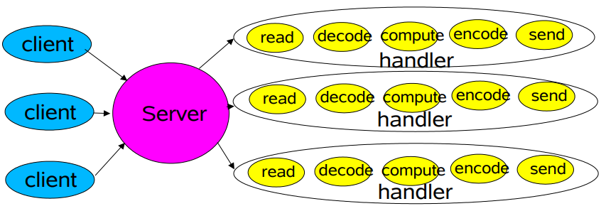

可伸缩性的目标：

1. 负载增加的情况下能够优雅降级
2. 硬件提高，性能也提高
3. 满足其他高可用和高性能的目标：低延时，流量高峰能正常运作，可以调节服务质量
4. 分治通常是达到可伸缩目标的最好方法

分治方法：

1. 将过程拆分成一个个小任务，每个人物之间没有阻塞
2. 允许是可以执行

事件驱动处理（更高效但是很难编程）：

1. 占用较少资源，不需要对每个客户端都分配一个线程
2. 更少开销，更少的上下文切换，更少的锁
3. 分配较慢，需要手工绑定事件
4. 必须将每个操作拆分成简单的非阻塞行为，但是无法阻止所有的阻塞（GC，缺页等）

### 2. Reactor 模式

先介绍 java.nio 中几个重要的角色：

* Channels：用于连接文件，socket等，可以进行非阻塞读
* Buffers：如同数组可以被 Channel 进行读写
* Selectors: 用来告诉 Channel 是否有 IO 事件
* SelectionKeys：用于维持 IO 事件的状态和绑定监听

🔵单 Reactor 单线程模型

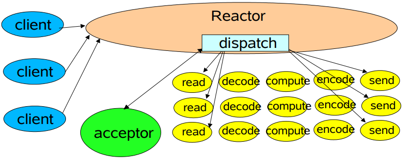

Reactor 就相当于服务器，Selector 用于监听服务器端的连接请求，如果有连接请求的话，将连接任务 dispatch 给 Acceptor 用于建立于客户端之间的连接，随后在创建 Handler 线程用于处理与客户端之间的业务处理。

特点：

1. 模型简单，全部都在同一个线程中执行
2. 存在性能问题，只有一个线程无法发挥多核 CPU 的性能，很容易导致性能瓶颈。
3. 在处理 Handler 业务的时候不能够处理其他事件，容易造成不能接收和处理外界信息的现象。

Reactor 代码：

```java
public class Reactor implements Runnable {
    final Selector selector;
    final ServerSocketChannel ssc;

    Reactor(int port) throws IOException {
        selector = Selector.open();
        ssc = ServerSocketChannel.open();
        ssc.socket().bind(new InetSocketAddress(port));
        ssc.configureBlocking(false);   // NIO
        SelectionKey sk = ssc.register(selector, SelectionKey.OP_ACCEPT);
        sk.attach(new Acceptor());
    }

    @Override
    public void run() {
        try {
            while (!Thread.interrupted()) {
                selector.select();
                Set<SelectionKey> keys = selector.selectedKeys();
                for (SelectionKey key : keys) dispatch(key);
                keys.clear();
            }
        } catch (IOException e) {
            e.printStackTrace();
        }
    }

    void dispatch(SelectionKey k) {
        Runnable r = (Runnable) k.attachment();
        if (r != null) r.run();
    }

    class Acceptor implements Runnable {
        @Override
        public void run() {
            try {
                SocketChannel sc = ssc.accept();
                if (sc != null) new Handler(selector, sc);
            } catch (IOException e) {
                e.printStackTrace();
            }
        }
    }
}
```

Handler 代码（用于处理读取、解码、处理、编码、发送）：

```java
public final class Handler implements Runnable {
    final SocketChannel socketChannel;
    final SelectionKey key;
    ByteBuffer input = ByteBuffer.allocate(256);
    ByteBuffer output = ByteBuffer.allocate(256);
    static final int READING = 0, SENDING = 1;
    int state = READING;

    Handler(Selector selector, SocketChannel sc) throws IOException {
        socketChannel = sc;
        sc.configureBlocking(false);
        key = socketChannel.register(selector, 0);
        key.attach(this);
        key.interestOps(SelectionKey.OP_READ);
        selector.wakeup();
    }

    @Override
    public void run() {
        try {
            if (state == READING) read();
            else write();
        } catch (IOException e) {
            e.printStackTrace();
        }
    }

    void read() throws IOException {
        socketChannel.read(input);
        System.out.println("Processing");
        state = SENDING;
        key.interestOps(SelectionKey.OP_WRITE);
    }

    void write() throws IOException {
        socketChannel.write(output);
        key.cancel();
    }

}
```

🔵单 Reactor 多线程模式

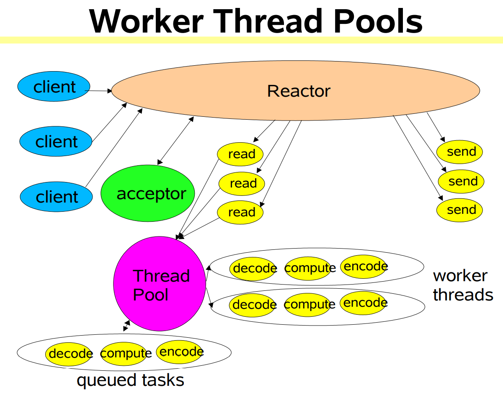

即将 Handler 放进线程池中，这个模型可以充分利用多核 CPU 的处理能力，但是多线程之间的数据共享和访问会比较负载，Reactor 在单线程中处理所有连接与事件的监听以及事件分发，在高并发场景中容易出行性能瓶颈，多线程仅仅解决了业务处理的压力。

代码：

```java
public class MthreadHandler implements Runnable {
    final SocketChannel sc;
    final SelectionKey key;
    ByteBuffer input = ByteBuffer.allocate(256);
    ByteBuffer output = ByteBuffer.allocate(256);
    static final int READING = 0, SENDING = 1, PROCESSING = 2;
    int state = READING;

    ExecutorService pool = Executors.newFixedThreadPool(4);

    MthreadHandler(Selector selector, SocketChannel sc) throws IOException {
        this.sc = sc;
        sc.configureBlocking(false);
        key = sc.register(selector, 0);
        key.attach(this);
        key.interestOps(SelectionKey.OP_READ);
        selector.wakeup();
    }

    @Override
    public void run() {
        try {
            if (state == READING) read();
            else write();
        } catch (IOException e) {
            e.printStackTrace();
        }
    }

    synchronized void read() throws IOException {
        sc.read(input);
        pool.submit(this::process);
        state = SENDING;
        key.interestOps(SelectionKey.OP_WRITE);
    }

    synchronized void write() throws IOException {
        sc.write(output);
        key.cancel();
    }

    synchronized void process(){
        System.out.println("Processing");
    }
    
}
```

🔵多 Reactor 多线程模型

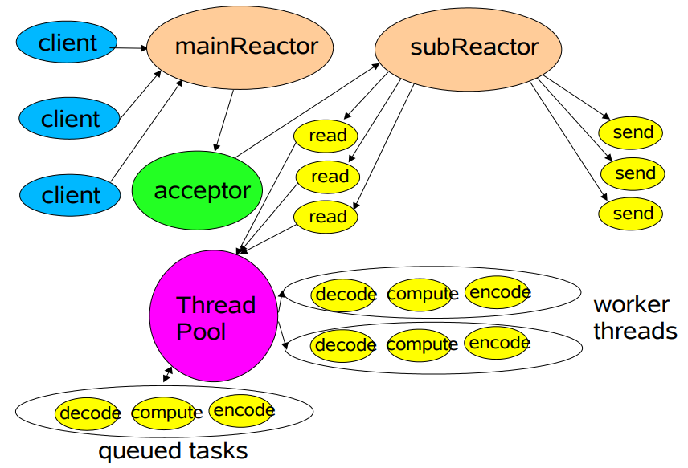

为了充分利用资源对于多 CPU 的机器，可以将 Reactor 分为两个部分：

1. mainReactor 主要负责监听 serverSocket 用于处理新连接的建立，将建立的 SocketChannel 指定注册给 subReactor
2. subReactor 维护自己的 selector，基于 mainReactor 注册的 socketChannel 多路分离 IO 读写事件，读写网络数据，handler 事件等交给 worker 线程执行。 

## 六. IO 复用模型

> fd: file descriptor 文件描述符

### 流 IO操作 阻塞

流：可以进行IO操作的内核对象，比如文件、管道、套接字，流的入口(fd)

IO操作：对流的操作

阻塞等待：不能很好的处理多个IO请求，同一时间同一时刻只能处理一个阻塞监听。

多路IO复用：既能阻塞等待不占用资源，又能同一时刻监听多个IO请求。


### IO复用

如何解决大量IO读写请求：

* 阻塞+多线程/多进程

  

  不可取，需要开辟很多资源

* 非阻塞+忙轮询

  会占用很多资源，相当于一直`while`循环。

* Select方法

  ```python
  while true:
  	select(stream[])	# 阻塞
  	
      for i in stream:
          read(i)
  ```

  会告诉你有事件发生，但不会告诉你时间具体信息。

* epoll方法

  ```python
  while True:
      stream[] = epoll_wait(epoll_fd)
      for i in strem[]:
          # Read..
  ```

  

什么是epoll：IO多路复用技术，只关心“活跃”的请求，能够处理大量的连接请求(**系统可以打开的最大文件数目**)。

```sh
Linux中可以打开的最大文件数码
[root ~]# cat /proc/sys/fs/file-max
183917
```

### 模型一 单线程accept(无IO复用)


当服务端处于读写状态的时候，对于其他客户端23的请求是无响应的，处理完毕之后才能接受限一个请求。

非并发模型，串行服务器，最大网络请求量为1，并发量为1。

### 模型二 单线程Accept+多线程读写业务(无IO复用)


client给server连接的时候，server会分配一个线程同该client进行读写操作，然后server会立马回到accept阻塞状态，可以继续处理下一个请求，继续分配线程与下一个客户端处理。

特点：支持了并发，一个客户端同一个线程进行处理，server处理的内聚性比较高。客户端数量增多，线程也增多。对于高并发情景，收到硬件的瓶颈；对于长连接，服务器需要保存心跳连接，占用连接和线程开销；适用于客户端数量不多的场景。

### 模型三 单线程多路IO复用


**分析：**

1. 主线程创建`ListenFd`之后，采用多路IO复用机制如(select, epoll)进行IO状态的阻塞监控。有Client1客户端的连接请求，IO复用机制检测后`ListenFd`出发读事件，则进行Accept建立连接，并将新生产的`ConnFd1`加入到监听IO的集合中。
2. Client1再次进行读写操作业务的时候，主线程中的多路IO复用会触发服务器端的读写事件业务。
3. 当服务器正在进行client1的读写业务的时候，其他客户端的连接请求和读写请求会阻塞，不能够及时响应。

特点：

* 使用单流程监听多个客户端的读写状态模型，不需要1：1的线程数量关系。
* 阻塞IO，可以极大利用CPU
* 可以监听多个客户端的请求业务，但是同一时间只能处理一个客户端的业务。
* 当有大量的客户端请求的时候，由于业务串行执行，会存在排队等待的现象，并发量还是为1。

### 模型四 单线程多路IO复用+多线程读写业务（工作池）

> 使用不是很多

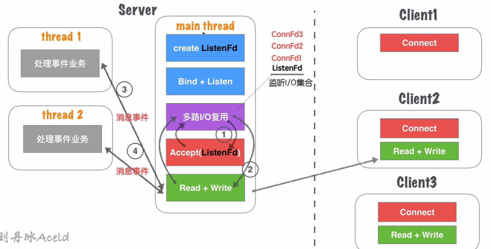

跟模型三类似，只是减少了多路io复用的排队时间。将业务使用异步处理。

读写业务为1，处理事件业务为worker的数量。

### 模型五 单线程多路IO复用+多线程多路IO复用(线程池)

> 常用


**模型分析：**

1. 服务器在启动监听之前，需要开启固定数量N的线程，用线程池来进行管理
2. 主线程创建`ListenFd`之后，会采用多路IO复用机制(select, epoll)的状态进行阻塞监控。有客户端请求连接的时候，IO复用机制ListenFd出发读机制，进行Accept连接，并且将新生成的`connFd1`分发给线程池中的某个线程进行监听。
3. 线程池中的每个线程也启用多路IO复用，用来监听有主线程分发下来的socket套接字。
4. thread监听各自分发的，并且各自处理。

特点：

* 将模型三中业务处理分散到多个线程当中，可以监听的数量成倍增加；之前监控的数量取决于主线程的机制限制（select为1024，epoll与内存大小有关 约3-6W），建议N的大小与CPU的核心数量为1：1。
* 虽然监听的并发数量提升，但是最高的读写并行通道为N，并且多个处于同一个Thread的客户端仍会有延迟。

### 模型五 单线程多路IO复用+多线程多路IO复用(进程池)

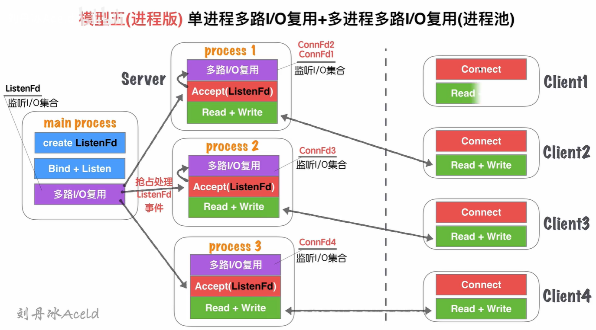

main process只是监听ListenFd状态，⼀旦触发读事件(有新连接请求). 通过⼀些IPC(进程间通信：如信 号、共享内存、管道)等, 让各⾃⼦进程Process竞争Accept完成链接建⽴，并各⾃监听。

多进程内存资源空间占⽤稍微⼤⼀些，多进程模型安全稳定型较强，这也是因为各⾃进程互不⼲扰的特点导致。

### 模型六 单线程多路IO复用+多线程多路IO复用+多线程读写业务

>单线程多路IO复用用于分发connFd，多线程多路IO复用用于分发业务，最后一个多线程用于处理读写业务

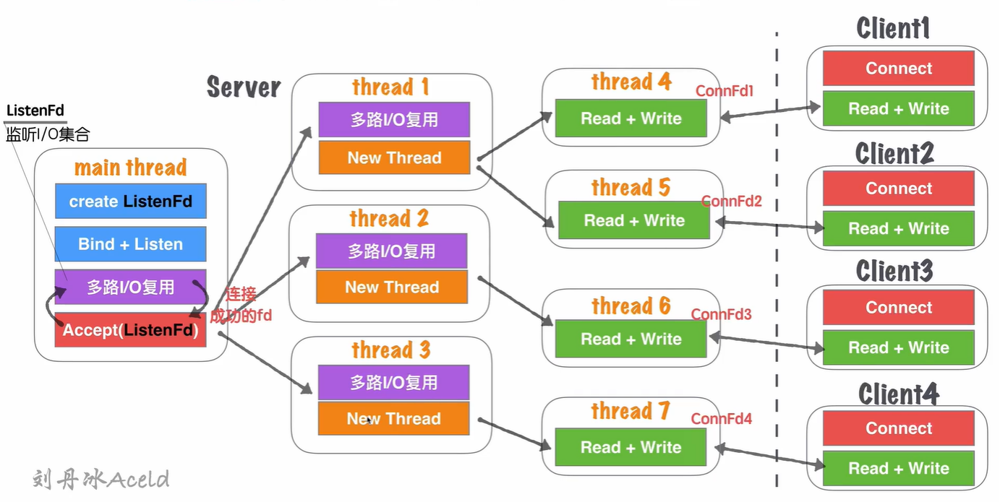

在模型五基础上，除了能够保证同时响应最⾼的并发数，⼜能够解决读写并⾏通道的局限问题。同⼀时刻的读写并⾏通道，达到了最⼤化极限， ⼀个客户端可以对应⼀个单独的执⾏流程处理读写业务，读写并⾏通道与客户端的数量1：1关系。

**该模型过于理想化**，一味要求CPU核⼼数数量⾜够⼤。如果硬件CPU数量可数，那么该模型就造成⼤量的CPU切换的成本浪费。因为为了保证读写并⾏通道和客户 端是1：1的关系，就要保证server开辟的thread的数量与客户端⼀致。


