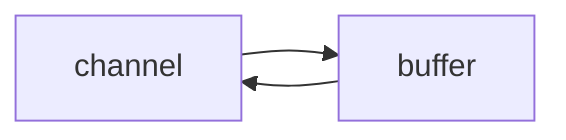

# Netty 编程

2022-03-22

[BV1py4y1E7oA](https://www.bilibili.com/video/BV1py4y1E7oA) P22

Reactor 原理

部分图片来源于黑马程序员讲义。

## 一. NIO 基础

> NIO: non-blocking io. 非阻塞IO.

### 1. 三大组件(Channel, Buffer, Selector)

🔵Channel



channel 有点类似stream，是读写数据的双向通道， 可以从 channel 中将数据读入 buffer，也可以将 buffer 中的数据写入 channel 。

常见的channel：`FileChannel`, `DatagramChannel`, `SocketChannel`, `ServerSocketChannel`。

🔵Buffer

常见的Buffer有 `ByteBuffer(MappedByteBuffer, DirectByteBuffer,...)`, `ShortBuffer`, `IntBuffer`等类型。

🔵Selector

服务器设计分为：多线程版和线程池版。多线程版是每个线程处理一个 Socker IO 请求；在线程池版下，一个线程仅能处理一个Socket的连接，仅适合短连接场景。

而对于 Selector 模式的服务器设计，其工作在非阻塞模式下，作用就是配合一个线程来管理多个channel，selector 可以用来监听多个 Channel 的状态，适用于连接数多但是流量低 (low traffic) 的场景。


### 2. ByteBuffer

🔵基础使用：

```java
@Slf4j
public class ByteBufferDemo {
    public static void main(String[] args) {
        try(FileChannel channel = new FileInputStream("data.txt").getChannel()) {
            // 准备缓冲区
            ByteBuffer buffer = ByteBuffer.allocate(10);
            StringBuilder sb = new StringBuilder();
            // 从channel中读取数据到buffer中
            int len;
            while ((len = channel.read(buffer)) != -1) {    
                // read 方法读取到末尾的时候回返回-1
                buffer.flip();  // 将读取数据的指针指向0，即文本开头
                while (buffer.hasRemaining()) {
                    byte b = buffer.get();
                    sb.append((char)b);
                }
                buffer.clear(); // 将 buffer 切换为写模式
                log.debug("读取到的字节数： {}, 读取的数据: {}", len, sb);
            }
        } catch (IOException e) {
            e.printStackTrace();
        }
    }
}
```

ByteBuffer 的正确使用方法：

1. 先向 buffer 中写入数据，例如调用`channel.read(buffer)`
2. 调用`flip()`方法将 buffer 切换到**读模式**
3. 从 buffer 中读取数据，例如调用 `buffer.get()`
4. 如果未将文件读取完毕则结束，否则进入步骤5
5. 调用 `clear()` 或者 `compact()` 方法切换到写模式，继续向 buffer 中写入数据，重复步骤1。

🔵ByteBuffer 的内部结构

ByteBuffer 有三个重要属性：

* capacity 即表示 buffer 的容量
* position 即表示 buffer 当前的写入/读取位置
* limit 在写模式下即为最大容量的位置，在读模式下为当前读取数据的最大边界。

可以直接输出 ByteBuffer 对象查看其信息：`java.nio.HeapByteBuffer[pos=5 lim=16 cap=16]`

初始 ByteBuffer，或者使用 clear 方法后：


写入数据：


开始读模式后，position 指针归零，并且 limit 位置发送变化：


使用 `compact()` 方法，即在未完全读取数据后继续写数据的情况，将已读取的数据清除：


🔵ByteBuffer 常用函数

* 分配空间：

  1. `ByteBuffer.allocate(16)`，属于类`java.nio.HeapByteBuffer`，分配的是Java堆内存，读写效率低，收到GC的影响。
  2. `ByteBuffer.allocateDirect(16)`，属于类`java.nio.DirectByteBuffer`，分配的是系统内存，读写效率高，不受GC的影响，分配效率较低，有可能造成内存泄漏。

* 写入数据：

  可以使用 `channel.read()` 或者 `buffer.put()`方法

* 读取数据：

  可以使用 Channel 的 write 方法，或者是调用 buffer 自己的 get 方法。

  如果想重复读取数据的话，可以使用 `rewind()` 方法将position指针重新归零；

  使用 `get(int i)`的方法，但是其不会移动 position 指针。

  还可以使用 `mark()` 和 `reset()` 方法，相当于是对 `rewind()` 方法的强化。mark 相当记录当前 position 的位置，reset 则将 position 重置到 mark 的位置。

* 字符串和 ByteBuffer 的相互转换

  注意：后两种方式会直接将 ByteBuffer 置为读模式。

  ```java
  static void stringWithByteBuffer() {
      ByteBuffer buffer = ByteBuffer.allocate(16);
      // 1. 字符串转 ByteBuffer
      buffer.put("hello".getBytes());
  
      // 2. 使用 StandardCharsets 来进行处理
      ByteBuffer buffer2 = StandardCharsets.UTF_8.encode("hello");
      
      // 3. 使用 wrap 方法
      ByteBuffer buffer3 = ByteBuffer.wrap("hello".getBytes());
  
      // Bytebuffer 转换为 String
      buffer.flip();
      System.out.println(StandardCharsets.UTF_8.decode(buffer));
      System.out.println(StandardCharsets.UTF_8.decode(buffer2));
      System.out.println(StandardCharsets.UTF_8.decode(buffer3));
  }
  ```

🔵分散读和集中写

分散读，比如读取字符串 `onetwothree` ，切分为三个字符串，可以使用省时省力的方法分散读来进行读取。

```java
static void scatteringRead() {
    try (FileChannel channel = new RandomAccessFile("words.txt", "r").getChannel()) {
        ByteBuffer b1 = ByteBuffer.allocate(3);
        ByteBuffer b2 = ByteBuffer.allocate(3);
        ByteBuffer b3 = ByteBuffer.allocate(5);
        channel.read(new ByteBuffer[]{b1, b2, b3});
        b1.flip();
        b2.flip();
        b3.flip();
        System.out.println(StandardCharsets.UTF_8.decode(b1));
        System.out.println(StandardCharsets.UTF_8.decode(b2));
        System.out.println(StandardCharsets.UTF_8.decode(b3));

    } catch (IOException e) {
    }
}
```

集中写，将多个数据一起写入文件：

```java
static void gatheringWrite() {
    try (FileChannel channel = new RandomAccessFile("words2.txt", "rw").getChannel()) {
        ByteBuffer b1 = StandardCharsets.UTF_8.encode("hello");
        ByteBuffer b2 = StandardCharsets.UTF_8.encode("world");
        ByteBuffer b3 = StandardCharsets.UTF_8.encode("你好");
        channel.write(new ByteBuffer[] {b1, b2, b3});
    } catch (IOException e) {
    }
}
```

🔵粘包半包分析

参考：[硬核图解|tcp为什么会粘包？](https://segmentfault.com/a/1190000039691657)

出现粘包最有可能的原因就是基于**字节流**的特点，这是因为字节流与字节流之间的传出没有任何的边界，导致上一个发的数据包和下一个发的数据包粘在一起。

早些年网络不发达的情况，一般有**Nagle算法**来防止客户端放松过小的数据包，从而有可能导致在发送端发生粘包的问题。如果关闭**Nagle算法**（`TCP_NODELAY=1`）后还是有可能产生粘包的问题，比如在 TCP 接收端，应用层未及时取走信息，因此可能会导致在 TCP Recv Buffer 信息堆积，从而导致 TCP 粘包。


### 3. 文件编程

其只能工作在阻塞模式下。

由 `FileInputStream` 获取的 Channel 只能读，由 `FileOutputStream` 获取的 Channel 只能进行写；通过 `RandomAccessFile` 获取的 Channel 既能读也能写。

正确的写入姿势：

```java
while(buffer.hasRemaining()) {
    channel.write(buffer);
}
```

关闭尽可能使用 `try..with..catch` 来进行关闭。

🔵Channel 之间传输数据

其传输的效率较高，底层都会使用操作系统的**零拷贝**进行优化。

```java
public class FileChannelTransfer {
    public static void main(String[] args) {
        try (
                FileChannel from = new FileInputStream("data.txt").getChannel();
                FileChannel to = new FileOutputStream("to.txt").getChannel();
        ) {
            from.transferTo(0, from.size(),to);
        } catch (IOException e) {
            e.printStackTrace();
        }
    }
}
```

但是有个缺点，其传输的最大限制就是 2GB。

如果传输的文件大小大于 2GB， 就需要进行优化。

🔵Path 和 Paths 类

还支持 `.` 以及 `..` 代表本目录和上一级目录。

```java
public static void main(String[] args) {
    Path source = Paths.get("/usr/local/bin/a");
    log.info("Filename:{}, Pathname: {}", source.getFileName(), source.getParent());
    Path other = Paths.get("D:/a/b/c/../d");
    System.out.println(other.normalize());  // D:\a\b\d
}
```

🔵Files 类

这个类需要配合 Path 和 Paths 类来一起进行使用。可以检查文件是否存在、创建目录、复制、删除以及移动文件等操作。

```java
@Slf4j(topic = "Files")
public class FilesDemo {
    public static void main(String[] args) {
        // 判断文件是否存在
        Path source = Paths.get("./data.txt");
        System.out.println(Files.exists(source));
        // 创建一级目录，如果目录已存在或者创建多级目录会抛异常
        Path dir = Paths.get("./beauties");
        try {
            Files.createDirectory(dir);
        } catch (IOException e) {
            e.printStackTrace();
        }
        // 创建多级目录
        Path dirs = Paths.get("./girls/aaron");
        try {
            Files.createDirectories(dirs);
        } catch (IOException e) {
            e.printStackTrace();
        }
        // 拷贝文件，如果文件已经存在会抛出异常
        Path target = Paths.get("./data_copy.txt");
        try {
            Files.copy(source,target);
            // 会覆盖已存在的文件
            Files.copy(source,target, StandardCopyOption.REPLACE_EXISTING);
        } catch (IOException e) {
            e.printStackTrace();
        }
    }
}
```

🔵遍历增删改查文件夹

使用方法 `walkFileTree()` 和 `walk()` ，两者不同之处就是前者使用匿名内部类的方式来进行操作，后者返回的是一个 Stream 流进行操作。

```java
public static void main(String[] args) throws IOException {
    Path src = Paths.get("E:\\Notes\\allmarkdown");
    AtomicInteger dirCount = new AtomicInteger();
    AtomicInteger fileCount = new AtomicInteger();
    Files.walkFileTree(src, new SimpleFileVisitor<Path>() {
        @Override
        public FileVisitResult preVisitDirectory(Path dir, BasicFileAttributes attrs) throws IOException {
            dirCount.incrementAndGet();
            log.debug("---> {}", dir);
            return super.preVisitDirectory(dir, attrs);
        }

        @Override
        public FileVisitResult visitFile(Path file, BasicFileAttributes attrs) throws IOException {
            fileCount.incrementAndGet();
            log.debug("{}", file);
            return super.visitFile(file, attrs);
        }
    });

    log.debug("files: {}, dirs: {}", fileCount, dirCount);
}
```

对于遍历删除非空多级文件，可以在访问文件的时候删除文件，访问文件夹后(post)再删除文件夹。