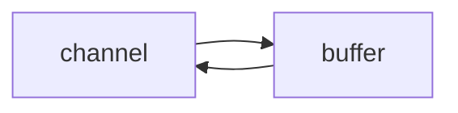

# Netty 编程

2022-03-22

[BV1py4y1E7oA](https://www.bilibili.com/video/BV1py4y1E7oA?p=75) P75

Reactor 原理

部分图片来源于黑马程序员讲义。

## 一. NIO 基础

> NIO: non-blocking io. 非阻塞IO.

### 1. 三大组件(Channel, Buffer, Selector)

🔵Channel



channel 有点类似stream，是读写数据的双向通道， 可以从 channel 中将数据读入 buffer，也可以将 buffer 中的数据写入 channel 。

常见的channel：`FileChannel`, `DatagramChannel`, `SocketChannel`, `ServerSocketChannel`。

🔵Buffer

常见的Buffer有 `ByteBuffer(MappedByteBuffer, DirectByteBuffer,...)`, `ShortBuffer`, `IntBuffer`等类型。

🔵Selector

服务器设计分为：多线程版和线程池版。多线程版是每个线程处理一个 Socker IO 请求；在线程池版下，一个线程仅能处理一个Socket的连接，仅适合短连接场景。

而对于 Selector 模式的服务器设计，其工作在非阻塞模式下，作用就是配合一个线程来管理多个channel，selector 可以用来监听多个 Channel 的状态，适用于连接数多但是流量低 (low traffic) 的场景。


### 2. ByteBuffer

🔵基础使用：

```java
@Slf4j
public class ByteBufferDemo {
    public static void main(String[] args) {
        try(FileChannel channel = new FileInputStream("data.txt").getChannel()) {
            // 准备缓冲区
            ByteBuffer buffer = ByteBuffer.allocate(10);
            StringBuilder sb = new StringBuilder();
            // 从channel中读取数据到buffer中
            int len;
            while ((len = channel.read(buffer)) != -1) {    
                // read 方法读取到末尾的时候回返回-1
                buffer.flip();  // 将读取数据的指针指向0，即文本开头
                while (buffer.hasRemaining()) {
                    byte b = buffer.get();
                    sb.append((char)b);
                }
                buffer.clear(); // 将 buffer 切换为写模式
                log.debug("读取到的字节数： {}, 读取的数据: {}", len, sb);
            }
        } catch (IOException e) {
            e.printStackTrace();
        }
    }
}
```

ByteBuffer 的正确使用方法：

1. 先向 buffer 中写入数据，例如调用`channel.read(buffer)`
2. 调用`flip()`方法将 buffer 切换到**读模式**
3. 从 buffer 中读取数据，例如调用 `buffer.get()`
4. 如果未将文件读取完毕则结束，否则进入步骤5
5. 调用 `clear()` 或者 `compact()` 方法切换到写模式，继续向 buffer 中写入数据，重复步骤1。

🔵ByteBuffer 的内部结构

ByteBuffer 有三个重要属性：

* capacity 即表示 buffer 的容量
* position 即表示 buffer 当前的写入/读取位置
* limit 在写模式下即为最大容量的位置，在读模式下为当前读取数据的最大边界。

可以直接输出 ByteBuffer 对象查看其信息：`java.nio.HeapByteBuffer[pos=5 lim=16 cap=16]`

初始 ByteBuffer，或者使用 clear 方法后：


写入数据：


开始读模式后，position 指针归零，并且 limit 位置发送变化：


使用 `compact()` 方法，即在未完全读取数据后继续写数据的情况，将已读取的数据清除：


🔵ByteBuffer 常用函数

* 分配空间：

  1. `ByteBuffer.allocate(16)`，属于类`java.nio.HeapByteBuffer`，分配的是Java堆内存，读写效率低，收到GC的影响。
  2. `ByteBuffer.allocateDirect(16)`，属于类`java.nio.DirectByteBuffer`，分配的是系统内存，读写效率高，不受GC的影响，分配效率较低，有可能造成内存泄漏。

* 写入数据：

  可以使用 `channel.read()` 或者 `buffer.put()`方法

* 读取数据：

  可以使用 Channel 的 write 方法，或者是调用 buffer 自己的 get 方法。

  如果想重复读取数据的话，可以使用 `rewind()` 方法将position指针重新归零；

  使用 `get(int i)`的方法，但是其不会移动 position 指针。

  还可以使用 `mark()` 和 `reset()` 方法，相当于是对 `rewind()` 方法的强化。mark 相当记录当前 position 的位置，reset 则将 position 重置到 mark 的位置。

* 字符串和 ByteBuffer 的相互转换

  注意：后两种方式会直接将 ByteBuffer 置为读模式。

  ```java
  static void stringWithByteBuffer() {
      ByteBuffer buffer = ByteBuffer.allocate(16);
      // 1. 字符串转 ByteBuffer
      buffer.put("hello".getBytes());
  
      // 2. 使用 StandardCharsets 来进行处理
      ByteBuffer buffer2 = StandardCharsets.UTF_8.encode("hello");
      
      // 3. 使用 wrap 方法
      ByteBuffer buffer3 = ByteBuffer.wrap("hello".getBytes());
  
      // Bytebuffer 转换为 String
      buffer.flip();
      System.out.println(StandardCharsets.UTF_8.decode(buffer));
      System.out.println(StandardCharsets.UTF_8.decode(buffer2));
      System.out.println(StandardCharsets.UTF_8.decode(buffer3));
  }
  ```

🔵分散读和集中写

分散读，比如读取字符串 `onetwothree` ，切分为三个字符串，可以使用省时省力的方法分散读来进行读取。

```java
static void scatteringRead() {
    try (FileChannel channel = new RandomAccessFile("words.txt", "r").getChannel()) {
        ByteBuffer b1 = ByteBuffer.allocate(3);
        ByteBuffer b2 = ByteBuffer.allocate(3);
        ByteBuffer b3 = ByteBuffer.allocate(5);
        channel.read(new ByteBuffer[]{b1, b2, b3});
        b1.flip();
        b2.flip();
        b3.flip();
        System.out.println(StandardCharsets.UTF_8.decode(b1));
        System.out.println(StandardCharsets.UTF_8.decode(b2));
        System.out.println(StandardCharsets.UTF_8.decode(b3));

    } catch (IOException e) {
    }
}
```

集中写，将多个数据一起写入文件：

```java
static void gatheringWrite() {
    try (FileChannel channel = new RandomAccessFile("words2.txt", "rw").getChannel()) {
        ByteBuffer b1 = StandardCharsets.UTF_8.encode("hello");
        ByteBuffer b2 = StandardCharsets.UTF_8.encode("world");
        ByteBuffer b3 = StandardCharsets.UTF_8.encode("你好");
        channel.write(new ByteBuffer[] {b1, b2, b3});
    } catch (IOException e) {
    }
}
```

🔵粘包半包分析

参考：[硬核图解|tcp为什么会粘包？](https://segmentfault.com/a/1190000039691657)

出现粘包最有可能的原因就是基于**字节流**的特点，这是因为字节流与字节流之间的传出没有任何的边界，导致上一个发的数据包和下一个发的数据包粘在一起。

早些年网络不发达的情况，一般有**Nagle算法**来防止客户端放松过小的数据包，从而有可能导致在发送端发生粘包的问题。如果关闭**Nagle算法**（`TCP_NODELAY=1`）后还是有可能产生粘包的问题，比如在 TCP 接收端，应用层未及时取走信息，因此可能会导致在 TCP Recv Buffer 信息堆积，从而导致 TCP 粘包。


### 3. 文件编程

其只能工作在阻塞模式下。

由 `FileInputStream` 获取的 Channel 只能读，由 `FileOutputStream` 获取的 Channel 只能进行写；通过 `RandomAccessFile` 获取的 Channel 既能读也能写。

正确的写入姿势：

```java
while(buffer.hasRemaining()) {
    channel.write(buffer);
}
```

关闭尽可能使用 `try..with..catch` 来进行关闭。

🔵Channel 之间传输数据

其传输的效率较高，底层都会使用操作系统的**零拷贝**进行优化。

```java
public class FileChannelTransfer {
    public static void main(String[] args) {
        try (
                FileChannel from = new FileInputStream("data.txt").getChannel();
                FileChannel to = new FileOutputStream("to.txt").getChannel();
        ) {
            from.transferTo(0, from.size(),to);
        } catch (IOException e) {
            e.printStackTrace();
        }
    }
}
```

但是有个缺点，其传输的最大限制就是 2GB。

如果传输的文件大小大于 2GB， 就需要进行优化。

🔵Path 和 Paths 类

还支持 `.` 以及 `..` 代表本目录和上一级目录。

```java
public static void main(String[] args) {
    Path source = Paths.get("/usr/local/bin/a");
    log.info("Filename:{}, Pathname: {}", source.getFileName(), source.getParent());
    Path other = Paths.get("D:/a/b/c/../d");
    System.out.println(other.normalize());  // D:\a\b\d
}
```

🔵Files 类

这个类需要配合 Path 和 Paths 类来一起进行使用。可以检查文件是否存在、创建目录、复制、删除以及移动文件等操作。

```java
@Slf4j(topic = "Files")
public class FilesDemo {
    public static void main(String[] args) {
        // 判断文件是否存在
        Path source = Paths.get("./data.txt");
        System.out.println(Files.exists(source));
        // 创建一级目录，如果目录已存在或者创建多级目录会抛异常
        Path dir = Paths.get("./beauties");
        try {
            Files.createDirectory(dir);
        } catch (IOException e) {
            e.printStackTrace();
        }
        // 创建多级目录
        Path dirs = Paths.get("./girls/aaron");
        try {
            Files.createDirectories(dirs);
        } catch (IOException e) {
            e.printStackTrace();
        }
        // 拷贝文件，如果文件已经存在会抛出异常
        Path target = Paths.get("./data_copy.txt");
        try {
            Files.copy(source,target);
            // 会覆盖已存在的文件
            Files.copy(source,target, StandardCopyOption.REPLACE_EXISTING);
        } catch (IOException e) {
            e.printStackTrace();
        }
    }
}
```

🔵遍历增删改查文件夹

使用方法 `walkFileTree()` 和 `walk()` ，两者不同之处就是前者使用匿名内部类的方式来进行操作，后者返回的是一个 Stream 流进行操作。

```java
public static void main(String[] args) throws IOException {
    Path src = Paths.get("E:\\Notes\\allmarkdown");
    AtomicInteger dirCount = new AtomicInteger();
    AtomicInteger fileCount = new AtomicInteger();
    Files.walkFileTree(src, new SimpleFileVisitor<Path>() {
        @Override
        public FileVisitResult preVisitDirectory(Path dir, BasicFileAttributes attrs) throws IOException {
            dirCount.incrementAndGet();
            log.debug("---> {}", dir);
            return super.preVisitDirectory(dir, attrs);
        }

        @Override
        public FileVisitResult visitFile(Path file, BasicFileAttributes attrs) throws IOException {
            fileCount.incrementAndGet();
            log.debug("{}", file);
            return super.visitFile(file, attrs);
        }
    });

    log.debug("files: {}, dirs: {}", fileCount, dirCount);
}
```

对于遍历删除非空多级文件，可以在访问文件的时候删除文件，访问文件夹后(post)再删除文件夹。

### 4. 网络编程

分为阻塞、非阻塞、多路复用等方式。

🔵简单阻塞与非阻塞服务器

单线程阻塞服务器：

```java
public static void main(String[] args) throws IOException {
    // 使用 nio 来理解阻塞模式
    // 0. 创建ByteBuffer
    ByteBuffer buffer = ByteBuffer.allocate(16);
    // 1. 创建服务器
    ServerSocketChannel ssc = ServerSocketChannel.open();
    // 2. 绑定监听端口
    ssc.bind(new InetSocketAddress(8888));
    // 3. 连接集合
    List<SocketChannel> channels = new ArrayList<>();
    while (true) {
        // 4. accept 用于建立与客户端的连接，SocketChannel 用于同客户端之间的通信
        // 是在阻塞模式下，如果没有连接进来会一直阻塞
        SocketChannel sc = ssc.accept();
        channels.add(sc);
        // 5. 接收客户端的数据
        for (SocketChannel channel : channels) {
            channel.read(buffer);   // read 也是阻塞方法，直到服务器端收到客户端的信息
            buffer.flip();
            log.info("Server recv msg: {}", StandardCharsets.UTF_8.decode(buffer));
            buffer.clear();
        }
    }
}
```

单线程的阻塞服务器会在两个地方进行阻塞，一个是在 accept 与客户端建立连接的时候，另一次是在等待客户端发送消息 read 的时候。很明显，如果期间有其他的客户端连接进来，或者其他的客户端发送消息，就可能会导致信息丢失或者是很长时间才能响应的现象，因此单线程的阻塞服务器很不合理。

将阻塞服务器改为非阻塞服务器。

通过设置`ServerSocketChannel.configureBlocking(false);` 设置服务器为非阻塞模式，每次建立连接 accept 的时候就不会一直阻塞了；设置`SockerChannel.configureBlocking(false);` 用来设置服务器和客户端之间的连接为非阻塞模式，每次从 channel 中 read 的时候如果为空则直接返回0。

```java
static void nioServer() throws IOException {
    // 单线程非阻塞模式
    // 0. 创建ByteBuffer
    ByteBuffer buffer = ByteBuffer.allocate(16);
    // 1. 创建服务器
    ServerSocketChannel ssc = ServerSocketChannel.open();
    ssc.configureBlocking(false);   // 设置服务器为非阻塞模式
    // 2. 绑定监听端口
    ssc.bind(new InetSocketAddress(8888));
    // 3. 连接集合
    List<SocketChannel> channels = new ArrayList<>();
    while (true) {
        // 4. accept 用于建立与客户端的连接，SocketChannel 用于同客户端之间的通信
        // 是在非阻塞模式下，如果没有连接进来返回null
        log.debug("Waiting client...");
        SocketChannel sc = ssc.accept();
        if (sc != null) {
            log.debug("Client {} is in", sc);
            sc.configureBlocking(false);    // 设置连接也为非阻塞模式
            channels.add(sc);
        }
        // 5. 接收客户端的数据
        for (SocketChannel channel : channels) {
            int len = channel.read(buffer);// read 非阻塞方法，无数据会返回0
            if (len != 0) {
                buffer.flip();
                log.info("Server recv msg: {}", StandardCharsets.UTF_8.decode(buffer));
                buffer.clear();
            }
        }
    }
}
```

相比于非阻塞模式，可以及时的接收来自客户端的连接和客户端的信息，但是会存在一个轮询检查，会在无连接的时候也会一直检查客户端的连接，就会导致对于系统 CPU 资源的浪费。

🔵多路复用 Selector

Selector 的作用就是监听 Channel 的事件状态，在没有事件发生的时候还可以阻塞，防止 CPU 进行空转。

Selector 关注的事件有四种：

1. accept 事件：会在客户端有请求连接的时候就会触发。
2. connect 事件：是**客户端**连接建立后触发。
3. read 事件：表示服务器端的可读事件。
4. write 事件：表示服务器端的可写事件。

Selector 是根据 `SelectionKey` 来判断事件的类型，Selector 处理消息分为以下几步：

1. 创建 Selector 对象，设置 SocketChannel 并且设置为非阻塞模式
2. 绑定 SocketChannel 和 Selector，设置 SelectionKey 关注什么事件
3. Selector 对象调用 `Select()` 方法阻塞等待事件发生
4. 遍历 Selector 的 selectedKeys 并且根据事件类型来处理事件

示例代码：

```java
static void selectorServer() throws IOException, InterruptedException {
    // 1. 创建 Selector, 管理多个 Channel
    Selector selector = Selector.open();

    ServerSocketChannel ssc = ServerSocketChannel.open();
    ssc.configureBlocking(false);   // 设置服务器为非阻塞模式
    ByteBuffer buffer = ByteBuffer.allocate(16);
    // 2. 建立 selector 和 Channel 之间的联系
    // SelectionKey 是事件发生的时候可以知道哪个 Channel 的
    SelectionKey sscKey = ssc.register(selector, 0, null);
    // 指明这个 sscKey 只关注 accept 事件
    sscKey.interestOps(SelectionKey.OP_ACCEPT);
    log.debug("Register Accept Key: {}", sscKey);

    ssc.bind(new InetSocketAddress(8888));
    while (true) {
        // 3. select 方法，没有事件发生，会一直阻塞
        // 如果存在未处理的方法，select 方法不会阻塞
        selector.select();
        // 4. 处理事件，包含了所有发生的事件
        Iterator<SelectionKey> iter = selector.selectedKeys().iterator();
        while (iter.hasNext()) {
            SelectionKey key = iter.next();
            // 处理完 key 一定要删除，否则无法处理其他信息
            iter.remove();
            log.debug("Keys Len: {}", selector.selectedKeys().size());
            // 5. 区分事件类型
            if (key.isAcceptable()) {
                ServerSocketChannel channel = ((ServerSocketChannel) key.channel());
                SocketChannel sc = channel.accept();
                sc.configureBlocking(false);    // 设置连接非阻塞
                SelectionKey scKey = sc.register(selector, 0, null);
                scKey.interestOps(SelectionKey.OP_READ);
                log.debug("Set scKey: {}", scKey);
                log.info("A connection: {}", sc.getRemoteAddress());
            } else if (key.isReadable()) {
                try {
                    SocketChannel channel = (SocketChannel) key.channel();

                    int len = channel.read(buffer);
                    // 如果读取到 -1, 就表示客户端已经断开
                    if (len == -1) key.cancel();
                    else {
                        buffer.flip();
                        log.debug("Server recv msg: {}", StandardCharsets.UTF_8.decode(buffer));
                        buffer.clear();
                    }
                }catch (Exception e) {
                    e.printStackTrace();
                    // 客户端断开，从 selector 的 key 中删除
                    key.cancel();
                }
            }
        }
    }
}
```

注意：

* 当 Selector 中存在消息的时候，如果不处理，`select()` 方法就不会阻塞。使用 `key.channel()` 或者 `key.cancel()` 方法来进行消费消息。
* 遍历 selectedKeys 可以使用迭代器的形式。并且由于 selector 在消费完对应 Key 的事件后，并不会主动将这个 Key 从 selectedKeys 集合中删除，因此需要手动对 Key 进行删除。
* 对于 SocketChannel 一定要设置为非阻塞模式工作状态，否则会报错。
* 客户端在断开连接的时候会触发 read 事件。如果是非主动断开，服务器端会触发 read 事件并且报错；如果是主动断开，会触发 read 事件，并且 read 方法返回值为 **-1** 。因此需要是哟 `key.cancel()` 方法将其从服务器端 selector 中将对应的 Key 删除，否则一直会报错。
* 在使用 ByteBuffer 的时候读模式之后如果还要进行写操作一定要转为写模式。

🔵消息边界问题


对于第一种情况需要对 ByteBuffer 进行扩容。对于第二、三中情况就需要对解决数据包切分的问题。

1. 可以采用固定消息长度，数据包大小一致，服务器按预定的长度进行读取，缺点就是浪费带宽和空间。
2. 另一种思路就是按分隔符进行差分，缺点就是读取的效率较低。
3. TLV / LTV格式，根据后续消息的大小来分配 ByteBuffer 的空间。即 HTTP 1.1 或者 HTTP 2.0 格式。

第三种方式在 Netty 中会有很好的封装，这里为了简单使用第二种的形式来对案例进行教学，即使用 ByteBuffer 的 Compact 方法来进行操作。

使用 ByteBuffer 可能存在的问题：

1. 就是对于数据包过长的情况下，虽然切分了数据包，但是组合之后数据包过大会超过 ByteBuffer 所能存储的大小，因此需要对 ByteBuffer 进行扩容操作。
2. ByteBuffer 并不是线程安全的，对于不同的 SocketChannel，都有可能接收消息，但是其消息不能存放在一起；因此需要引用一个**附件**(attachment)来进行存储每个 SocketChannel 收发的消息内容。

在进行 `SocketChannel.register()` 的时候可以直接设置 Key 需要监听的操作和 attachment。

```java
ByteBuffer buffer = ByteBuffer.allocate(16);
sc.register(selector, SelectionKey.OP_READ, buffer);
```

获取对应的 attachment 或者重新设置 attachment：

```java
ByteBuffer buffer = (ByteBuffer) key.attachment();
key.attach(buffer);	// 重新设置 attachment 
key.attach(null);
```

当需要发送的内容实在过多的时候，就会发生向 ByteBuffer 中写入数据失败的情况，因此就需要关注可写事件(`OP_WRITE`)，等到下次可以继续写入的时候再进行。

Selector 中一个 Key 可以通过加运算或者是**或运算**添加关注默写操作，如果想要取关某些操作则使用减法。

🔵NIO 多线程优化

之前存在的问题：

1. 未能充分利用多核 CPU
2. 单线程处理事件，但是某个事件如果耗费事件过长，就会出现阻塞事件过长的情况

可以使用一个 Boss Selector 来管理网络的连接 Accept，用多个 Worker 来管理频繁的读写操作，分工明确。

```java
@Slf4j(topic = "MServer")
public class MultiThreadServer {
    public static void main(String[] args) throws IOException {
        Thread.currentThread().setName("boss");
        ServerSocketChannel scc = ServerSocketChannel.open();
        scc.configureBlocking(false);

        Selector boss = Selector.open();

        scc.register(boss, SelectionKey.OP_ACCEPT);
        scc.bind(new InetSocketAddress(8888));

        Worker worker0 = new Worker("Worker-0");


        while (true) {
            boss.select();
            Iterator<SelectionKey> iter = boss.selectedKeys().iterator();
            while (iter.hasNext()) {
                SelectionKey key = iter.next();
                iter.remove();
                if (key.isAcceptable()) {
                    SocketChannel sc = scc.accept();
                    log.info("Con: {}", sc.getRemoteAddress());
                    sc.configureBlocking(false);
                    worker0.register(sc);   // 注册
                }
            }
        }
    }

    static class Worker implements Runnable {
        private Thread thread;
        private Selector selector;
        private String name;
        private boolean start;
        private ConcurrentLinkedQueue<Runnable> queue = new ConcurrentLinkedQueue<>();

        public Worker(String name) {
            this.name = name;
        }

        public void register(SocketChannel sc) throws IOException {
            if (!start) {	// 保证线程只开启一次
                thread = new Thread(this, name);
                selector = Selector.open();
                thread.start();
                start = true;
            }

            queue.add(() -> {	// 添加注册事件
                sc.register(selector, SelectionKey.OP_READ);
            });

            selector.wakeup(); // 打断 select 阻塞，执行 register 操作
        }

        @Override
        public void run() {
            while (true) {
                try {
                    selector.select();
                    Runnable task = queue.poll();
                    if (task != null) {
                        // 如果队列中有需要注册是事件则执行
                        task.run();
                    }

                    Iterator<SelectionKey> iter = selector.selectedKeys().iterator();
                    while (iter.hasNext()) {
                        // ... 正常的读取信息操作，此处省略
                    }
                } catch (IOException e) {
                    e.printStackTrace();
                }
            }
        }
    }
}
```

worker 的数量最好设置为 CPU 核心的数量，参考[阿姆达尔定理](https://zh.wikipedia.org/wiki/%E9%98%BF%E5%A7%86%E8%BE%BE%E5%B0%94%E5%AE%9A%E5%BE%8B)

### 5. NIO vs BIO

参考书籍：UNIX 网络编程-卷1

🔵IO模型

IO 模型主要分为五类：阻塞 IO，非阻塞 IO 、多路复用模型、信号驱动 IO、异步 IO 模型。其中多路复用又分为单线程多路复用，单线程多路复用配合多线程读写业务复用（工作池、线程池、进程池等版本）等等。


当读请求发送来的时候，阻塞 IO 会等待操作系统等待对应网络请求到达后，并且复制数据后才会返回数据；而非阻塞 IO 会一直请求直到网络数据到达，但是在操作系统复制数据的时候非阻塞 IO 还是会阻塞等待复制完毕。

同步和异步的区别：异步需要的线程至少有两个。

🔵零拷贝

零拷贝（Zero-Copy）是一种 I/O 操作优化技术，可以快速高效地将数据从文件系统移动到网络接口，而不需要将其从内核空间复制到用户空间。

对于简单的几句Java代码：

```java
File f = new File("helloword/data.txt");
RandomAccessFile file = new RandomAccessFile(file, "r");

byte[] buf = new byte[(int)f.length()];
file.read(buf);

Socket socket = ...;
socket.getOutputStream().write(buf);
```

但是其在操作系统层面需要进行的操作很多，内部工作流程如下：


首先需要将对应磁盘上的文件读取到内核缓冲区中，然后再复制到 Java 程序的用户缓冲区中，开始向网络中发送数据的时候，还需要将数据复制到 Socket 的缓冲区中，然后操作系统准备发送网络数据的时候，还需要将 Socket 中的数据复制到网卡中去。

这个过程中发生了 3 次用户态和内核态的切换，以及 4 次复制操作，耗费的系统资源较多。

**NIO 优化：**

在 Java 中 ByteBuffer 可以直接通过分配系统内存来减少一次内存的复制，使用方法 `allocateDirect()` 来进行分配。


**进一步优化：**

在 Java 中如果存在两个 Channel 之间通过 transferTo / transferFrom 进行传输数据的时候，在 Linux 2.1 之后会提供的 sendFile 方法，操作系统会使用 DMA 的方式来将缓冲区的数据进行读写到磁盘或者网卡中。


而在 Linux 2.4 之后，在 Java 调用 transferTo 方法后，操作系统会将内核缓冲区中的数据使用 DMA 的方式直接写入到网卡中，有了更少的用户态和内核态之间的切换，并且也减少了 CPU 之间的计算和传输。

另外还有一点需要注意的是：由于缓冲区的限制，零拷贝只适合小文件的传输和拷贝。

### 6. AIO

异步 IO


文件读取异步 IO：

默认文件 AIO 使用的线程都是守护线程，因此需要保持非守护线程的存活才能保证接收到消息。

```java
@Slf4j
public class AioDemo1 {
    public static void main(String[] args) throws IOException {
        try{
            AsynchronousFileChannel s = 
                AsynchronousFileChannel.open(
                	Paths.get("1.txt"), StandardOpenOption.READ);
            ByteBuffer buffer = ByteBuffer.allocate(2);
            log.debug("begin...");
            s.read(buffer, 0, null, new CompletionHandler<Integer, ByteBuffer>() {
                @Override
                public void completed(Integer result, ByteBuffer attachment) {
                    log.debug("read completed...{}", result);
                    buffer.flip();
                    debug(buffer);
                }

                @Override
                public void failed(Throwable exc, ByteBuffer attachment) {
                    log.debug("read failed...");
                }
            });

        } catch (IOException e) {
            e.printStackTrace();
        }
        log.debug("do other things...");
        System.in.read();
    }
}
```

还有网络异步 IO，由于在 Linux 环境下，网络的异步 IO 是由多路复用模拟实现的，因此效率较低而且实现需要注意的点也较多，现实中比较少用。

## 二. Netty 基础

Netty 是基于异步的、基于事件驱动的网络应用框架，可以用于开发高性能的网络应用服务器。相当于网络应用开发中的 Spring。

Netty 有自己的协议，可以解决 TCP 传输的问题如粘包等，可以解决在 Linux 中epoll 空轮询导致 CPU 100% 占用的问题。

为什么 Netty 要使用异步：

异步并未缩短响应事件，其提高的是 IO 请求的吞吐量。

### 1. 基础使用

搭建服务器需要为其设置组件，事件驱动器，通道实现以及事件实现等方法。

搭建服务器：

```java
public class HelloServer {
    public static void main(String[] args) {
        // 1. 服务器启动器，用于组转 netty 的组件
        new ServerBootstrap()
                // 2. BossEventLoop WorkerEventLoop(Selector, thread)
                .group(new NioEventLoopGroup())
                // 3. 使用的服务器 ServerChannel 的通道实现
                .channel(NioServerSocketChannel.class)
                // 4. 选择不同的角色的分工操作，比如 Boss 负责连接，worker 负责读写
                .childHandler(new ChannelInitializer<NioSocketChannel>() {
                    // 5. ChannelInitializer 发原则代表和客户端进行数据读写通道的初始化
                    // 用于负责添加别的 Handler
                    @Override
                    protected void initChannel(NioSocketChannel ch) throws Exception {
                        // 6. 添加具体的 handler
                        ch.pipeline().addLast(new StringDecoder()); // 将 ByteBuf 转为字符串
                        // 自定义的 handler
                        ch.pipeline().addLast(new ChannelInboundHandlerAdapter() {
                            @Override   // 读事件
                            public void channelRead(ChannelHandlerContext ctx, Object msg) throws Exception {
                                // 打印经过 StringDecoder 转化后的字符串
                                System.out.println(msg);
                            }
                        });

                    }
                })
                .bind(20001);    // 监听的端口
    }
}
```

搭建客户端：

```java
public class HelloClient {
    public static void main(String[] args) throws InterruptedException {
        new Bootstrap()
                .group(new NioEventLoopGroup())
                .channel(NioSocketChannel.class)
                .handler(new ChannelInitializer<NioSocketChannel>() {
                    @Override   // 在连接后被调用
                    protected void initChannel(NioSocketChannel ch) throws Exception {
                        ch.pipeline().addLast(new StringEncoder());
                    }
                })
                .connect(new InetSocketAddress("localhost", 20001))
                .sync()	// 阻塞方法，直到连接建立
                .channel()
                .writeAndFlush("Hello world");
    }
}
```

### 2. Netty 组件

🔵 EventLoop / EventLoopGroup

EventLoop 本质是单线程执行器（同时维护一个 Selector），用于处理 Channel 中源源不断的 IO 请求。 

EventLoopGroup 是一组 EventLoop，Channel 一般调用 EventLoopGroup 这个中的 register 方法来绑定其中一个 EventLoop，这个 Channel 上的后续 io 事件**都**是由这个 EventLoop 来完成（保证了 IO 事件处理时候的线程安全）。

其是接口，常见的实现有：

* NioEventLoopGroup，用于处理 IO 事件，普通任务以及定时任务
* DefaultEventLoopGroup，用于处理普通任务，定时任务

EventLoop 提交普通任务和定时任务：

```java
@Slf4j
public class TestEventLoop {
    public static void main(String[] args) {
        // 可以指定线程数，每个线程对应一个 EventLoop
        EventLoopGroup group = new NioEventLoopGroup(2);
        // 获取下一个 EventLoop 对象
        System.out.println(group.next());
        System.out.println(group.next());
        System.out.println(group.next());
        System.out.println(group.next());
        // 执行普通任务
        group.next().execute(() -> {
            log.debug("OK");
        });

        // 执行定时任务
        group.next().scheduleAtFixedRate(() -> log.debug("Kimoji"), 1, 1, TimeUnit.SECONDS);
    }
}
```

**EventLoopGroup 中的职责细分：**

职责细分优化可以分为两个部分：

1. 给服务器进行设置的时候需要分为两个角色，Boss 和 Worker 分别用于管理客户端连接和 IO 读写操作。再给 Server 指定 Group 的时候因此可以传入两个参数，前者就是 Boss ，Netty 会分配单独的线程来保证其执行，后者是 Worker， 用户可以根据自己的需求来分配对应的线程数。

   ```java
   new ServerBootstrap()
           // 前者就是 boss 只负责分工，后者管理读写
           .group(new NioEventLoopGroup(), new NioEventLoopGroup(2))
   ```

2. 之前的简单案例相当于单线程多路复用，当在处理客户端的 IO 请求的时候如果处理事件过长就会影响其他客户端 IO 请求操作的执行。因此对于重量级 IO 请求，模型应该改为单线程多路复用+多线程 IO 操作的模型。在 Netty 中也支持这样的操作，在进行流水线处理的时候默认指定的就是 NIO 自己对应的 NioEventLoopGroup，也可以指定用户自己创建的 NioEventLoopGroup。

   需要注意的一点就是 pipline 之间 handler 信息的传输需要设置 `ctx.fireChannelRead()` / `super.channelRead(ctx, msg)`，否则下一个 handler 接收不到对应的消息。

   ```java
   EventLoopGroup group = new DefaultEventLoopGroup();
   
   // ... 省略中间代码
   
   ch.pipeline()
           .addLast("handler-1", new ChannelInboundHandlerAdapter() {
               @Override
               public void channelRead(ChannelHandlerContext ctx, Object msg) {
                   log.debug("NioEventLoopGroup 接收到大任务，交给其他EventLoopGroup");
                   ctx.fireChannelRead(msg);   // 将消息传给下一个 handler
               }
           })
           .addLast(group, "Handler-2", new ChannelInboundHandlerAdapter() {
               @Override
               public void channelRead(ChannelHandlerContext ctx, Object msg) {
                   ByteBuf buf = (ByteBuf) msg;
                   log.debug(buf.toString(Charset.defaultCharset()));
               }
           });
   ```

示意图：


完整代码：

```java
public static void main(String[] args) {

    EventLoopGroup group = new DefaultEventLoopGroup();

    new ServerBootstrap()
            // 前者就是 boss 只负责分工，后者管理读写
            .group(new NioEventLoopGroup(), new NioEventLoopGroup(2))
            .channel(NioServerSocketChannel.class)
            .childHandler(new ChannelInitializer<NioSocketChannel>() {
                @Override
                protected void initChannel(NioSocketChannel ch) throws Exception {
                    ch.pipeline()
                            .addLast("handler-1", new ChannelInboundHandlerAdapter() {
                                @Override
                                public void channelRead(ChannelHandlerContext ctx, Object msg) throws Exception {
                                    log.debug("NioEventLoopGroup 接收到大任务，交给其他EventLoopGroup");
                                    ctx.fireChannelRead(msg);   // 将消息传给下一个 handler
                                }
                            })
                            .addLast(group, "Handler-2", new ChannelInboundHandlerAdapter() {
                                @Override
                                public void channelRead(ChannelHandlerContext ctx, Object msg) throws Exception {
                                    ByteBuf buf = (ByteBuf) msg;
                                    log.debug(buf.toString(Charset.defaultCharset()));
                                }
                            });
                }
            })
            .bind(20001);
}
```

🔵 Channel

Channel 的主要方法：

* close() 用于关闭 Channel
* closeFuture() 用于处理 channel 的关闭
  * sync 方法是同步等待 channel 的关闭
  * addListener 的方法是异步等待 channel 的关闭
* pipline() 用于给 Channel 添加处理器
* write() 是将数据写入 Channel，但是不会立即发送，需要使用 flush() 方法才会发送。想要直接发送可以使用 writeAndFlsuh() 方法。

在客户端，Channel 的 connect 方法是异步非阻塞的，其返回的对象是 ChannelFuture 类型，调用 sync 方法可以同步阻塞等待 NIO 线程 Channel 建立连接完毕后返回其对象；第二种获取 Channel 的方法是使用方法 addListener() 来异步获取 Channel 对象。

```java
public static void main(String[] args) throws InterruptedException {
    ChannelFuture cf = new Bootstrap()
            .group(new NioEventLoopGroup())
            .channel(NioSocketChannel.class)
            .handler(new ChannelInitializer<NioSocketChannel>() {
                @Override   // 在连接后被调用
                protected void initChannel(NioSocketChannel ch) throws Exception {
                    ch.pipeline().addLast(new StringEncoder());
                }
            })
            .connect(new InetSocketAddress("localhost", 20001));

    // 方式1 同步获取
    Channel channel = cf.sync().channel();
    // 方式2 异步获取
    cf.addListener((ChannelFutureListener)cf2 -> {
        Channel channel = cf2.channel();
        channel.writeAndFlush("Hello world");
    });
}
```

优雅关闭 Channel，并且关闭 Channel 之后关闭 Java 程序：:

```java
NioEventLoopGroup group = new NioEventLoopGroup();

// ... 省略中间代码

// 第一种办法
ChannelFuture closeFuture = channel.closeFuture();
log.debug("Waiting close...");
closeFuture.sync(); // 等待 channel.close()
log.debug("Channel closed...");
group.shutdownGracefully();

// 第二种方法
closeFuture.addListener((ChannelFutureListener) channelFuture -> {
    log.debug("Channel closed...");
    group.shutdownGracefully();
});
```

🔵 Future & Promise

JDK 和 Netty 中都有 Future 这个类，Netty 中是继承 JDK 中的 Future 类，Promise 又对 Netty Future 类进行了扩展。

* jdk Future 只能同步等待任务结束（或成功、或失败）才能得到结果
* netty Future 可以同步等待任务结束得到结果，也可以异步方式得到结果，但都是要等任务结束
* netty Promise 不仅有 netty Future 的功能，而且脱离了任务独立存在，只作为两个线程间传递结果的容器

JDK future:

```java
static void jdkFuture() throws ExecutionException, InterruptedException {
    ExecutorService service = Executors.newFixedThreadPool(2);
    log.debug("Wait");
    Thread.sleep(1000);
    Future<Integer> submit = service.submit(() -> {
        try {
            Thread.sleep(1000);
            return 50;
        } catch (InterruptedException e) {
            e.printStackTrace();
            return 30;
        }
    });
    Integer integer = submit.get();
    log.info("{}", integer);
}
```

Netty future：

```java
static void nettyFuture() throws ExecutionException, InterruptedException {
    NioEventLoopGroup group = new NioEventLoopGroup();
    Future<Integer> future = group.next().submit(() -> {
        try {
            Thread.sleep(1500);
        } catch (InterruptedException e) {
            e.printStackTrace();
        }
        return 20;
    });

    System.out.println(future.getNow());    // 立即获取
    System.out.println(future.get());   // 阻塞获取
}
```

Promise:

```java
static void testPromise() throws ExecutionException, InterruptedException {
    EventLoop eventLoop = new NioEventLoopGroup().next();
    DefaultPromise<Integer> promise = new DefaultPromise<>(eventLoop);

    new Thread(() -> {
        try {
            log.debug("Starting...");
            int i = 1 / 0;
            Thread.sleep(1000);
            promise.setSuccess(20);
        } catch (Exception e) {
            e.printStackTrace();
            promise.setFailure(e);
        }
    }).start();

    System.out.println(promise.get());
}
```

🔵 Handler & Pipeline

ChannelHandler 用来处理 Channel 上的各种事件，分为入站(读)和出站(写)两种操作，所有的 Handler 连成一起就是 Pipeline。

* 入站一般要继承 ChannelInboundHandlerAdapter 的子类，主要用于读取客户端数据，写回结果。
* 出站一般要继承 ChannelOutboundHandlerAdapter 的子类，主要对写回结果进行加工。

在添加 Pipeline 的 Handler 的时候，Netty 会自动添加两个 Handler ： Head 和 Tail Handler。

Pipeline 的执行顺序：

* 入站的操作是正序执行，出站的操作逆序执行

对于入站 Handler 之间的消息传递，需要调用 `super.channelRead()` / `ctx.fireChannelRead()` 操作才能传递给下一个 Handler，如果下一个 Handler 没有收到消息，就**不会执行**和继续向下传递消息了。入站和出站之间的 Handler 之间不需要进行信息传递。


Channel.writeAndFlush() 和 ctx.writeAndFlush() 的区别：

* 前者是将信息流写入 tail Handler，数据流要通过所有的出站 Handler
* 后者是将信息流写入当前的 Handler，数据流直接向前传找出站的 Handler

Netty 中为了调试 Pipeline 方便，提供了 EmbeddedChannel 类来进行调试。

### 3. ByteBuf

🔵创建

Netty 中的 ByteBuf 是可以动态扩容的。读写分为两个指针，不用像 ByteBuffer 切换读写模式

```java
public static void main(String[] args) {
    // 创建，默认是直接内存
    ByteBuf buf = ByteBufAllocator.DEFAULT.buffer();
    buf.writeBytes("Hello world".getBytes(StandardCharsets.UTF_8));
    log.info("{}", buf);
    // 分为直接内存和 Java 堆内存
    ByteBufAllocator.DEFAULT.heapBuffer();
    ByteBufAllocator.DEFAULT.directBuffer();
    // io.netty.buffer.PooledUnsafeDirectByteBuf
}
```

ByteBuf 也是支持分配直接内存和 Java 堆内存的，默认情况下 ByteBuf 分配的是系统的直接内存。

⭐一般情况下创建 ByteBuf 实在 pipeline 中创建，因此**强烈推荐**以下创建方法：

```java
ctx.alloc().buffer(32);
```

🔵池化

池化的最大意义就是在可以重用 ByteBuf，在高并发的情况下，池化的功能更节约内存，也可以减少内存溢出的可能。Netty 4.1 之后默认会开启池化功能。可以通过设置系统的环境变量来进行设置：

```
-Dio.netty.allocator.type={unpooled | pooled}
```

🔵读取和写入

ByteBuf 的写入支持多种类型。

```java
public static void main(String[] args) {
    ByteBuf buf = ByteBufAllocator.DEFAULT.buffer();
    buf.writeInt(6);
    buf.writeBytes("aka. QZQ".getBytes(StandardCharsets.UTF_8));
    // 读取
    log.info("{}", buf.toString(StandardCharsets.UTF_8));
    log.info("{}", buf);
    log.info("{}", buf.readInt());
    int left = buf.writerIndex() - buf.readerIndex();
    log.info("{}", buf.readBytes(left).toString(Charset.defaultCharset()));
}
```

输出：

```
11:03:53.496 [main] INFO Buffer -    aka. QZQ
11:03:53.496 [main] INFO Buffer - PooledUnsafeDirectByteBuf(ridx: 0, widx: 12, cap: 256)
11:03:53.496 [main] INFO Buffer - 6
11:03:53.496 [main] INFO Buffer - aka. QZQ
```

🔵内存回收

未池化的 Java 堆内存由 JVM 来进行回收，直接内存由系统来进行回收；池化的 ByteBuf 回收机制较为复杂，由ByteBuf 池来进行回收，基本规则就是谁是 ByteBuf 的最后使用者，谁负责回收 release。

🔵Slice 数据切片

```java
public static void main(String[] args) {
    ByteBuf buf = ByteBufAllocator.DEFAULT.buffer(10);
    buf.writeBytes("abcdefghij".getBytes(StandardCharsets.UTF_8));

    ByteBuf f1 = buf.slice(0, 5);
    ByteBuf f2 = buf.slice(5, 5);
    f1.setByte(2, 'q');

    log.info("{}", buf.toString(Charset.defaultCharset()));
    log.info("{}", f1.toString(Charset.defaultCharset()));
    log.info("{}", f2.toString(Charset.defaultCharset()));
}
```

输出：

```
11:17:31.621 [main] INFO Buffer - abqdefghij
11:17:31.621 [main] INFO Buffer - abqde
11:17:31.621 [main] INFO Buffer - fghij
```

其底层使用的是零拷贝的思想，切片之后的 ByteBuf 并未发送任何的内存复制，使用的还是原始 ByteBuf 的内存，切片后维护堵路的 read，write 指针。

**注意**：切片后的产生新的 ByteBuf 有使用限制，比如不能增加长度等；如果原有的 ByteBuf 释放内存后，新的 ByteBuf 也会受到影响，可以使用 `retain()` 方法让引用数量加一，不被回收内存。


其他方法：

* duplicate() 还是零拷贝，使用的还是原有的内存数据。(感觉没什么用)
* copy() 是深拷贝，与原有的数据无关了

##  三. Netty 进阶

### 1. 粘包半包

由于 TCP 协议存在的问题，并且由于滑动窗口的存在，窗口大小决定了数据包的大小，因此会产生粘包和半包的问题。

🔵产生原因：（TCP 是流式协议，无消息边界）

粘包：

* 现象：发送 abc def 两个数据包，接收到 abcdef 合在一起的数据包
* 原因：
  * 应用层接收方设置的 ByteBuf 过大
  * TCP 层面可能由于接收方处理不及时且滑动窗口较大，多个消息会一并缓冲在窗口中
  * Nagle 算法优化，发送方数据包过小

半包：

* 现象：发送 abcdef，接收到 abc def 两个数据包
* 原因：
  * 应用层接收方的 ByteBuf 设置过小
  * TCP 发送方的报文大于滑动窗口剩余大小，只能发送前部分，后部分放到下一个数据包发
  * MSS 的限制：发送数据包大小超过 MSS 限制之后，会对数据包进行切分 （MTU - 40）

🔵解决方法：

1. 短连接（❌）：

   发送一次数据包就建立一次连接，发送完毕即关闭连接，缺点就是效率太低，不能解决半包问题

   ```java
   @Override
   public void channelActive(ChannelHandlerContext ctx) throws Exception {
       // channel 连接建立触发
       ByteBuf buffer = ctx.alloc().buffer(16);
       buffer.writeBytes("abcdefghijklmnop".getBytes(StandardCharsets.UTF_8));
       ch.writeAndFlush(buffer);
       super.channelActive(ctx);
       // 关闭
       ctx.channel().close();
   }
   ```

2. 定长解码器（❌）：

   每次发送一个数据包，发送固定长度的数据，如果小于固定长度就使用 padding，大小固定长度就切分。

   缺点就是浪费空间。使用的类： `FixedLengthFrameEncoder`

3. 行编码器（❌）：

   就是使用行分隔符来解决，缺点就是需要转移，并且效率较低，需要扫描对应的分割字符。

   使用的类：`LineBasedFrameEncoder` / `DelimiterBasedFrameEncoder`

4. 基于 head 和 body 的编码器：

   类似 Http 协议，有 Content-Length 来标注数据包的大小，也有类似 headers 等数据头。

   使用的类：`LengthFiledFrameDecoder`