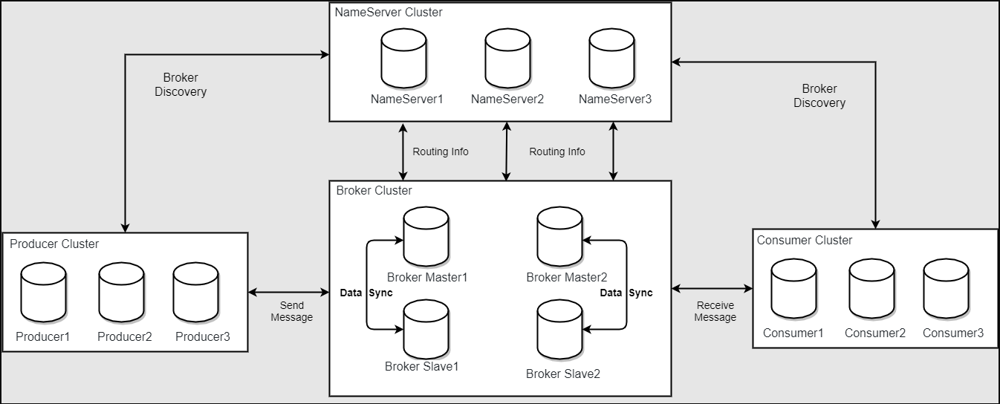
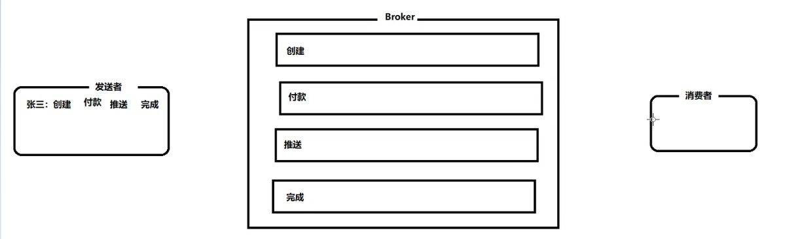
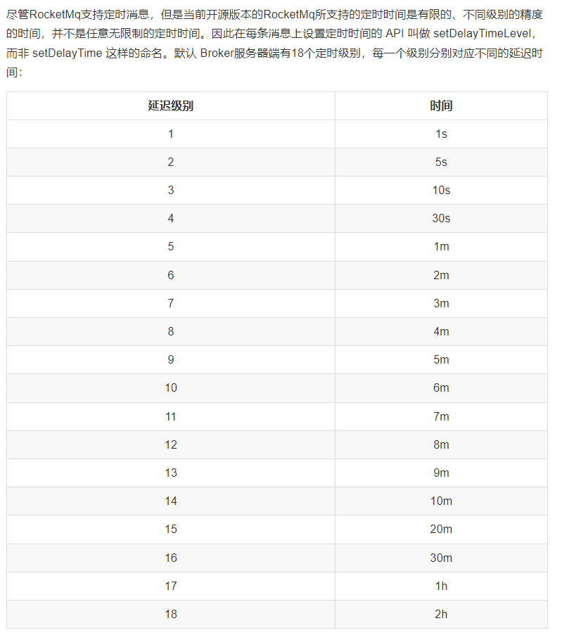
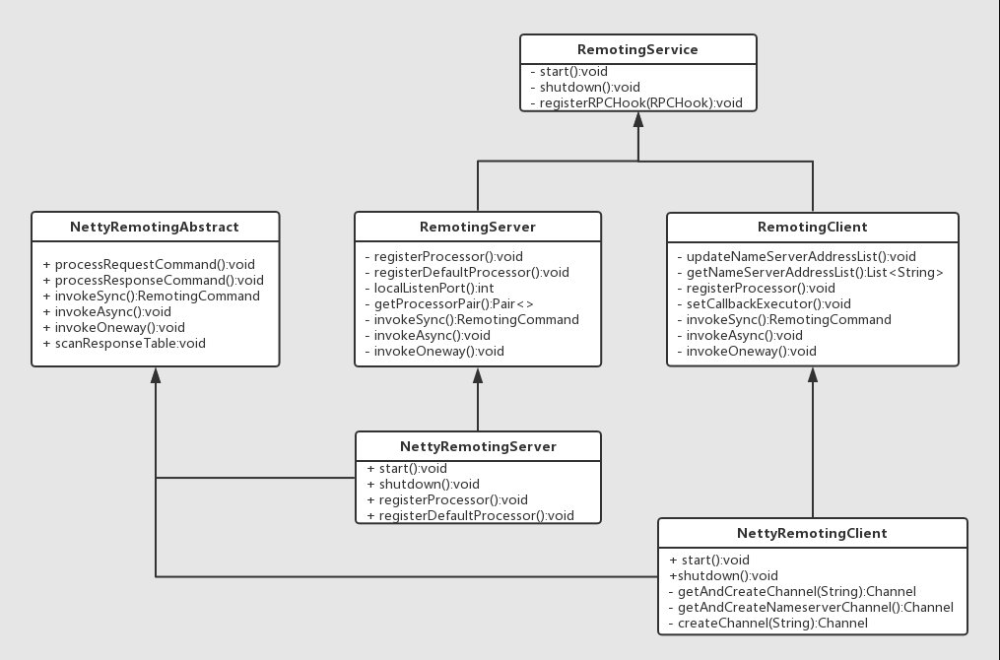

# RocketMQ

[TOC]

[BV1L4411y7mn](https://www.bilibili.com/video/BV1L4411y7mn?p=29) P29

MQ 消息队列可以进行限流削峰，异步解耦，数据收集。

下载链接：[Link](https://www.apache.org/dyn/closer.cgi?path=rocketmq/4.9.3/rocketmq-all-4.9.3-bin-release.zip)

## 一. RocketMQ 基础

### 1. 初步

启动RocketMQ：

1. 启动 Name Server

   ```sh
   nohup sh bin/mqnamesrv &
   tail -f ~/logs/rocketmqlogs/namesrv.log
   ```

2. 启动 Broker 连接 name server

   ```sh
   nohup sh bin/mqbroker -n localhost:9876 &
   tail -f ~/logs/rocketmqlogs/broker.log
   ```

可以通过 `jps` 来查看是否启动成功。如果未启动成功可以是由于设备硬件原因导致，可以通过在 RocketMQ 的bin 目录下修改 `runbroker.sh` 以及 `runserver.sh` 中的 JVM 中配置进行修改，其中 JVM 中内存的设置默认为：

```
JAVA_OPT="${JAVA_OPT} -server -Xms8g -Xmx8g"
```

关闭 name server 和 broker：

```sh
sh bin/mqshutdown namesrv
sh bin/mqshutdown broker
```

测试发送消息和接受消息：

1. 首先需要对接收方和发送方都需要配置环境变量

   ```sh
   export NAMESRV_ADDR=localhost:9876
   ```

2. 使用 RocketMQ 中的 demo 进行发送和接收消息

   ```sh
   # 发送消息
   sh bin/tools.sh org.apache.rocketmq.example.quickstart.Producer
   # 接收消息
   sh bin/tools.sh org.apache.rocketmq.example.quickstart.Consumer
   ```

### 2. RocketMQ 介绍



RocketMQ 中角色介绍：

1. NameServer：NameServer 是 Broker 的管理者，Broker 需要主动上报自己的信息到 NameServer
2. Broker：用于暂存和传输消息。Broker Master主要负责写操作，Slave 主要负责写操作。
3. Producer：主要职责是发送消息，首先询问 NameServer 找到对应的 Broker，然后向 Broker 发送消息。
4. Consumer：主要职责是接收消息，询问 NameServer 找到对应的 Broker，然后向 Broker 拿去消息。消费者分为拉取式消费(Pull Consumer)和推动式消费(Push Consumer)。拉取式消费式应用主动调用 Consumer 中的从 broker 中拿取消息，主动权式由应用控制；推动式消费是 Broker 收到消息后主动推送给消费端，这种消费消息一般实时性较高。
5. Topic：消息的种类。
6. Message Queue：相当于是 Topic 的分区，用于并行消息发送和消息处理。

RocketMQ 集群特点：

1. NameServer 是几乎无状态的节点，可以集群部署，节点之间无任何信息同步。
2. Broker 之间分为 Master 和 Slave 节点，一个 Master 可以对应多个 Slave 节点，但一个 Slave 只能有一个 Master。BrokerId 中 0 表示 Master，其他表示 Slave。
3. Producer 和 NameServer 集群中其中一个节点建立长连接，从 NameServer 中获取 Topic 的路由信息

RocketMQ 集群搭建方式：

由以上可知，RocketMQ 集群搭建的核心就是对 Broker 集群的搭建，对 Broker 集群搭建的方式分为以下几种：

1. 单 Master 模式：不可靠，不应该叫做集群。
2. 多 Master 模式：集群无 Slave 全是 Master，配置简单
3. 多 Master 多 Slave (异步)：即 Master 和 Slave 之间同步数据的方式是异步的。
4. 多 Master 多 Slave (同步)：性能会比异步的方式要低一些。

### 3. RocketMQ 集群搭建

集群搭建 Demo：

| 序号 | ip            | 角色               | 架构模式        |
| ---- | ------------- | ------------------ | --------------- |
| 1    | 192.168.1.100 | nameserver, broker | Master1, Slave2 |
| 2    | 192.168.1.103 | nameserver, broker | Master2, Slave1 |

1. 配置网络信息

   ```sh
   vim /etc/hosts
   ```

   添加以下配置：

   ```
   # rocketmq address
   # === name server
   192.168.1.100 rmq-ns1
   192.168.1.103 rmq-ns2
   # === master / slave
   192.168.1.100 rmq-m1
   192.168.1.100 rmq-s2
   192.168.1.103 rmq-m2
   192.168.1.103 rmq-s1
   ```

   重启网卡：

   ```sh
   systemctl restart network	# centos
   systemctl restart NetworkManager # ubuntu
   ```

   测试域名是否正确配置：

   ```sh
   ping rmq-ns1
   ping rmq-ns2
   ```

2. 关闭防火墙

   rocketmq 常用的端口有：9876(ns)，10911(master)，11011(slave)

   ```sh
   # 直接禁用
   systemctl stop firewall-cmd
   firewall-cmd --state
   systemctl disable firewall-cmd
   # 或者选择开放某些端口
   firewall-cmd --add-port=9876/tcp --permenant
   firewall-cmd --add-port=10911/tcp --permenant
   firewall-cmd --add-port=11011/tcp --permenant
   firewall-cmd --reload
   ```

3. 配置环境变量：

   ```sh
   vim /etc/profile
   ```

   添加以下内容：

   ```
   ROCKETMQ_HOME=/opt/rocketmq-4.9.3
   PATH=$PATH:$ROCKETMQ_HOME/bin
   export PATH
   ```

   使环境变量生效：

   ```sh
   source /etc/profile
   ```

4. 创建消息存储路径（消息持久化存储的位置）

   ```sh
   mkdir /usr/local/rocketmq/store
   cd /usr/local/rocketmq/store
   mkdir commitlog consumequeue index
   ```

5. Broker 文件配置

   Master 配置：

   ```
   # cluster name
   brokerClusterName=rmq-cluster
   brokerName=broker-a
   # 0 -> Master, other -> Slave
   brokerId=0
   # Name server address
   namesrvAddr=rmq-ns1:9876;rmq-ns2:9876
   # create the topic which the server doesn't exists, the default number of queue.
   defaultTopicQueueNums=4
   # 是否允许broker自动创建topic，建议线下开启，向上关闭
   autoCreateTopicEnable=true
   # 是否允许broker自动创建订阅组，建议线下开启，线上关闭
   autoCreateSubscriptionGroup=true
   # Broker 对外监听的端口
   listenPort=10911
   # 删除文件的时间点-04:00
   deleteWhen=04
   # 文件保留时间，默认48小时，这里是120小时
   fileReservedTime=120
   # commitLog 每个文件的默认大小，默认为1G
   mapedFileSizeCommitLog=1073741824
   # ConsumeQueue 每个文件默认存储的数据数目，默认 30w
   mapedFileSizeConsumeQueue=300000
   # 检测物理文件磁盘空间
   diskMaxUsedSpaceRatio=88
   # 消息持久化的路径
   storePathRootDir=/usr/local/rocketmq/store
   # commitLog 持久化的路径
   storePathCommitLog=/usr/local/rocketmq/store/commitlog
   # 消息队列持久化的路径
   storePathConsumeQueue=/usr/local/rocketmq/store/consumequeue
   # 消息索引存储路径
   storePathIndex=/usr/local/rocketmq/store/index
   # checkpoint 文件存储路径
   storePathCheckpoint=/usr/local/rocketmq/store/checkpoint
   # abort 文件存储路径
   storePathAbort=/usr/local/rocketmq/store/abort
   # 限制消息的大小
   maxMessageSize=65536
   
   # Broker 的角色
   # ASYNC_MASTER / SYNC_MASTER / SLAVE
   brokerRole=SYNC_MASTER
   # 刷盘的方式 SYNC_FLUSH  ASYNC_FLUSH
   flushDiskType=SYNC_FLUSH
   ```

   对于 Slave 的配置只需要修改 brokerId，brokerRole，listenPort以及flushDiskType，Master 刷盘的方式为同步刷盘，Slave 的刷盘方式为异步刷盘。不同的 Master 之间记得修改名称。

   **注意**：同一主机下的不同的broker持久化的路径也需要进行改变，比如 store1，store2。

6. 启动 NameServer 和 Broker

   ```sh
   # 启动 nameserver
   nohup sh mqnamesrv &
   # 启动 master1 和 slave2
   nohup sh mqbroker -c /opt/rocketmq-4.9.3/conf/2m-2s-sync/broker-a.properties &
   nohup sh mqbroker -c /opt/rocketmq-4.9.3/conf/2m-2s-sync/broker-b-s.properties &
   # 启动另一个主机的 master2 和 slave1
   nohup sh mqbroker -c /opt/rocketmq-4.9.3/conf/2m-2s-sync/broker-b.properties &
   nohup sh mqbroker -c /opt/rocketmq-4.9.3/conf/2m-2s-sync/broker-a-s.properties &
   ```

   查看是否启动成功：

   ```sh
   [root@localhost rocketmq-4.9.3]# jps
   11028 BrokerStartup
   11015 BrokerStartup
   11016 NamesrvStartup
   11197 Jps
   ```

### 4. MQAdmin 的使用

也可以直接使用dashboard

### 5. 集群监控平台

链接：[apache/rocketmq-dashboard](https://github.com/apache/rocketmq-dashboard)

```sh
git clone https://github.com/apache/rocketmq-dashboard.git
# 进入到dashboard目录，进行编译
mvn clean package -Dmaven.test.skip=true
java -jar target/rocketmq-dashboard-1.0.1-SNAPSHOT.jar
```

在mvn编译之前需要到源代码中的 `application.yml` 中添加 namesrv 的地址。当然不添加也可以，在进入网页中的配置也行。

然后进入网页 [localhost:8080](http://localhost:8080/#/) 即可访问查看 dashboard。

### 6. RocketMQ 消息可靠性

RocketMQ 支持消息的高可靠性，影响消息可靠性的几种情况：

1. Broker 的非正常关闭
2. Broker 异常 Crash
3. OS Crash
4. 机器断电，但是能立即恢复供电
5. 机器无法开机（可能是 CPU、主板、内存等关键设备损坏）
6. 磁盘设备损坏

其中前四种情况属于硬件资源可立即恢复的情况，RocketMQ 在这四种情况下能保证消息不丢失，或者丢失少量数据（依赖的刷盘方式是同步还是异步）。后两种情况属于单点故障并且无法恢复，一旦发生在单点上的消息全部丢失。RocketMQ 在这两种情况下，通过异步复制，可以保证 99% 的数据不跌是，但是仍然会存在极少量消息的跌势。通过同步双写技术可以完全避免单点，同步双写势必影响性能，适合对消息可靠性极高的场合，例如与 Monkey 相关的应用。（RocketMQ 3.0 之后开始支持同步双写）

### 7. 消息重试与消息重投

🔵消息重试（针对消费组）

Consumer 消费消息失败之后，要提供一种重试机制，让消息再消费一次。Consumer 消费消息失败通常可以认为有以下几种情况：

1. 消息本身原因：例如反序列化失败，消息数据本身无法处理（例如花费充值中当前消息的手机号被注销等）。这种错误通常需要跳过这条消息然后再消费其他消息，如果立即重试消费，99% 也不会成功，所以最好提供一种定时重试机制，即过 10s 后再重试。
2. 由于依赖的下游应用服务不可用，例如db连接不可用，外系统网络不可达等情况。遇到这种错误，即使跳过当前失败的消息，消费其他消息同样会报错。这种情况建议应用 sleep 30s 左右再消费下一条消息，可以减轻 Broker 重试消息的压力。

RocketMQ 会为每个消费组都设置一个 Topic 名称为 `%RETRY% + consumerGroup` 的重试队列用于暂时保存因为各种异常导致 Consumer 端无法消费的消息。不同的重试队列有着不同的重试级别，重试次数越多投递延时越大。RocketMQ 对于消息重试的处理先保存到 Topic 名称为 `SCHEDULE_TOPIC_XXXX` 的延时队列中，后台定时任务会按照对应事件进行延时后重新保存到 `%RETRY% + consumerGroup` 重试队列中。

🔵消息重投（针对生产者）

生产者在发送消息的时候，同步消息失败会重投，异步消息有重试，oneway 没有任何保证。消息重投是保证消息尽可能发送成功并且不丢失，但可能会造成消息重复，消息重复在 RocketMQ 中是无法避免的问题。消息重复在一般情况下是不会发生的，当出现消息量大、网络抖动，消息重复就会是大概率的事件。另外生产者主动重发、consumer 负载的变化也会导致消息重复。如下可以设置消息重试的策略：

1. retryTimesWhenSendFailed：同步发送失败重投次数，默认为2。生产者不会选择上次失败的 broker，会尝试向其他的 broker 发送，最大程度保证消息不丢失。超过重投次数会抛出异常，由客户端来保证消息不丢失。
2. retryTimesWhenSendAsyncFailed:异步发送失败重试次数，异步重试不会选择其他broker，仅在同一个broker上做重试，不保证消息不丢。
3. retryAnotherBrokerWhenNotStoreOK:消息刷盘（主或备）超时或slave不可用（返回状态非SEND_OK），是否尝试发送到其他broker，默认false。十分重要消息可以开启。

### 8. 流量控制

流量控制分为生产者流控和消费组流控。生产者流控是因为 broker 的处理能力达到了瓶颈，消费组流控是因为消费能力达到了瓶颈。

生产者流控：

- commitLog文件被锁时间超过osPageCacheBusyTimeOutMills时，参数默认为1000ms，返回流控。
- 如果开启transientStorePoolEnable == true，且broker为异步刷盘的主机，且transientStorePool中资源不足，拒绝当前send请求，返回流控。
- broker每隔10ms检查send请求队列头部请求的等待时间，如果超过waitTimeMillsInSendQueue，默认200ms，拒绝当前send请求，返回流控。
- broker通过拒绝send 请求方式实现流量控制。

注意，生产者流控，不会尝试消息重投。

消费者流控：

- 消费者本地缓存消息数超过pullThresholdForQueue时，默认1000。
- 消费者本地缓存消息大小超过pullThresholdSizeForQueue时，默认100MB。
- 消费者本地缓存消息跨度超过consumeConcurrentlyMaxSpan时，默认2000。

消费者流控的结果是降低拉取频率。

### 9. 死信队列

死信队列是用于处理无法被正常消费的消息，当一条消息初次消费失败的时候，消息队列会自动进行消息重试；达到最大重试次数之后，若消费依然失败，则表明消费组在正常情况下无法正确的消费该消息，此时消息队列不会立即丢弃该消息，而是将这个消息发送的该消费者对应的特殊队列中。

RocketMQ 将这种在正常情况下无法被消费的消息称为死信消息(Dead-Letter Message)，这个特殊队列称为死信队列(Dead-Letter Queue)。在 RocketMQ 中可以通过使用 console 控制台对死信队列中的消息进行重发来是的消费者实例再次进行消费。

## 二. RocketMQ 消息发送

首先需要导入maven依赖：

```xml
<dependency>
    <groupId>org.apache.rocketmq</groupId>
    <artifactId>rocketmq-client</artifactId>
    <version>4.9.3</version>
</dependency>
```

生产者消息发送步骤：

1. 创建消息生产者Producer，并且制定生产者组名
2. 指定 NameServer 地址
3. 启动 Producer
4. 创建消息对象，指定主题 Topic，Tag和消息体
5. 发送消息
6. 关闭生产者 Producer

消息消费者步骤：

1. 创建消费者 Consumer，指定消费者组名
2. 指定 NameServer 地址
3. 订阅主题 Topic 和 Tag
4. 设置回调函数处理消息
5. 启动消费者 Consumer

### 1. 基本demo

🔵生产者发送消息：

1. 发送同步消息：

   ```java
   public class SyncProducer {
       // 发送同步消息
       public static void main(String[] args) throws Exception {
           DefaultMQProducer producer = new DefaultMQProducer("group1");
           producer.setNamesrvAddr(Config.getNameServersString());
           producer.start();
   
           for (int i = 0; i < 10; i++) {
               // 指定 topic， tag， 消息内容
               Message msg = new Message("base", "tag1", ("Hello world_" + i).getBytes(StandardCharsets.UTF_8));
               SendResult result = producer.send(msg);
               System.out.println(result);
               TimeUnit.SECONDS.sleep(1);
           }
   
           producer.shutdown();
       }
   }
   ```

2. 发送异步消息

   发送同步和异步消息之间的区别就是在 `send` 函数中添加回调函数即可。

   ```java
   public class AsyncProducer {
       public static void main(String[] args) throws Exception {
           DefaultMQProducer producer = new DefaultMQProducer("group1");
           producer.setNamesrvAddr(Config.getNameServersString());
           producer.start();
           for (int i = 0; i < 10; i++) {
               Message msg = new Message("base", "tag2", ("[Async] Hello world_" + i).getBytes(StandardCharsets.UTF_8));
               producer.send(msg, new SendCallback() {
                   @Override
                   public void onSuccess(SendResult sendResult) {
                       System.out.println("发送成功 " + sendResult);
                   }
   
                   @Override
                   public void onException(Throwable throwable) {
                       System.out.println("发送失败，出现错误: " + throwable);
                   }
               });
   
               TimeUnit.SECONDS.sleep(1);
           }
           producer.shutdown();
       }
   }
   ```

3. 发送单向消息

   发送单向消息的流程和之前一模一样，只不过发送的时候使用的函数时 `sendOneway()`，无需结果的接收，比如写入日志等操作。

🔵消费者接收消息

消费者的模式可以分为广播模式和负载均衡模式，默认为负载均衡模式。

对于每个消息都被消费者消费一遍就是广播模式；一个消息只能被一个消费者消费就是负载均衡模式。

1. 负载均衡模式：

   ```java
   public class BaseConsumer {
       public static void main(String[] args) throws Exception {
           DefaultMQPushConsumer consumer = new DefaultMQPushConsumer("group1");
           consumer.setNamesrvAddr(Config.getNameServersString());
           consumer.subscribe("base", "tag1");
           consumer.registerMessageListener((MessageListenerConcurrently) (msgs, ctx) -> {
               msgs.forEach(i -> {
                   System.out.println(new String(i.getBody()));
               });
               return ConsumeConcurrentlyStatus.CONSUME_SUCCESS;
           });
           consumer.start();
       }
   }
   ```

2. 广播模式：

   需要设置消息模式：`consumer.setMessageModel(MessageModel.BROADCASTING)`

   ```java
       public static void main(String[] args) throws Exception {
           DefaultMQPushConsumer consumer = new DefaultMQPushConsumer("group1");
           consumer.setNamesrvAddr(Config.getNameServersString());
           consumer.subscribe("base", "tag1");
           consumer.setMessageModel(MessageModel.BROADCASTING);
           consumer.registerMessageListener((MessageListenerConcurrently) (msgs, ctx) -> {
               msgs.forEach(i -> {
                   System.out.println(new String(i.getBody()));
               });
               return ConsumeConcurrentlyStatus.CONSUME_SUCCESS;
           });
           consumer.start();
       }
   ```

### 2. 顺序消息

参考：

1. [Order Message](https://rocketmq.apache.org/docs/order-example/)
2. [消息顺序 - Github](https://github.com/apache/rocketmq/blob/master/docs/cn/features.md#2-消息顺序)

消息有序指的是进行消息消费的时候，能够按照发送的顺序来进行消费。顺序消息分为两类，全局顺序消息和分区顺序消息。

* 全局顺序是对于指定的一个 Topic，所有消息按照严格的 FIFO 顺序进行发布和消费。
* 分区顺序是对于指定的一个 Topic，所有消息根据 sharding key 进行区块分区。同一分区内的消息按照严格的 FIFO 顺序进行发布和消费。其中 Sharding key 是顺序消息中用来区分不同分区的关键字段，和普通消息的 Key 是完全不同的概念。



一个 Broker 中含有多个消息队列，生产者和消费者都是采用多线程的方式从消息队列中生产消息和消费消息。

可以采用局部有序的方式来保证对某个业务顺序的保证，为某个业务分配特定的消息队列。

生产者：

```java
public class OrderedProducer {
    public static void main(String[] args) throws Exception {
        DefaultMQProducer producer = new DefaultMQProducer("g1");
        producer.setNamesrvAddr(Config.getNameServersString());
        producer.start();
        String[] tags = {"TagA", "TagB", "TagC", "TagD", "TagE"};
        for (int i = 0; i < 100; i++) {
            int orderId = i % 10;
            Message msg = new Message("OrderedTopic", "TagA", "KEY_" + i, ("Hello RocketMQ_" + orderId + "_" + i).getBytes(StandardCharsets.UTF_8));
            SendResult res = producer.send(msg, new MessageQueueSelector() {
                @Override
                public MessageQueue select(List<MessageQueue> list, Message message, Object o) {
                    Integer orderId = (Integer) o;
                    int index = orderId % list.size();
                    // 返回选取的 MQ
                    return list.get(index);
                }
            }, orderId);

            System.out.println(res);
        }
        producer.shutdown();
    }
}
```

生产者根据某些特定的符号选择对应的消息队列。

消费者使用 `MessageListenerOrderly` 类来进行消费，这个类会为对每个消息队列分配单独的消费线程。

```java
@Slf4j
public class OrderedConsumer {
    public static void main(String[] args) throws Exception {
        DefaultMQPushConsumer consumer = new DefaultMQPushConsumer("g1");
        consumer.setNamesrvAddr(Config.getNameServersString());
        consumer.setConsumeFromWhere(ConsumeFromWhere.CONSUME_FROM_FIRST_OFFSET);
        consumer.subscribe("OrderedTopic", "TagA || TagC || TagD");
        consumer.registerMessageListener(new MessageListenerOrderly() {
            @Override
            public ConsumeOrderlyStatus consumeMessage(List<MessageExt> list, ConsumeOrderlyContext ctx) {
                list.forEach(i -> {
                    log.debug("Recv msg: {}", new String(i.getBody()));
                });
                return ConsumeOrderlyStatus.SUCCESS;
            }
        });
        consumer.start();
    }
}
```

### 3. 定时消息

当生产者生产一个消息的时候，并不会被立即消费，而是等待特定时间后再去消费。在RocketMQ 中消息的级别分为18个级别。



只需要设置 message 的 `setDelayTimeLevel` 即可。

```java
public static void main(String[] args) throws Exception {
    //  省略 ...
    msg.setDelayTimeLevel(3);
    //  省略 ...
    }
    producer.shutdown();
}
```

### 4. 发送批量消息

即将多个 Message 放到 List 中。

当然发送批量消息的时候还需要注意，发送消息的大小超过4MB的时候，最好将消息进行分割。

可以参考官网的代码：[Batch Example - Apache RocketMQ](https://rocketmq.apache.org/docs/batch-example/)

```java
public class ListSplitter implements Iterator<List<Message>> {
    private final int SIZE_LIMIT = 1024 * 1024 * 4;
    private final List<Message> messages;
    private int currIndex;

    public ListSplitter(List<Message> messages) {
        this.messages = messages;
    }

    @Override
    public boolean hasNext() {
        return currIndex < messages.size();
    }

    @Override
    public List<Message> next() {
        int startIndex = getStartIndex();
        int nextIndex = startIndex;
        int totalSize = 0;
        for (; nextIndex < messages.size(); nextIndex++) {
            Message msg = messages.get(nextIndex);
            int tmpSize = calcMessageSize(msg);
            if (tmpSize + totalSize > SIZE_LIMIT) break;
            else totalSize += tmpSize;
        }
        List<Message> subList = messages.subList(startIndex, nextIndex);
        currIndex = nextIndex;
        return subList;
    }

    private int getStartIndex() {
        Message currMsg = messages.get(currIndex);
        int tmpSize = calcMessageSize(currMsg);
        while (tmpSize > SIZE_LIMIT) {  // 遇到大于 SIZE_LIMIT 的消息直接扔掉
            currIndex += 1;
            Message msg = messages.get(currIndex);
            tmpSize = calcMessageSize(msg);
        }
        return currIndex;
    }

    private int calcMessageSize(Message msg) {
        int tmpSize = msg.getTopic().length() + msg.getBody().length;
        Map<String, String> properties = msg.getProperties();
        for (Map.Entry<String, String> entry : properties.entrySet()) {
            tmpSize += entry.getKey().length() + entry.getValue().length();
        }
        tmpSize += 20;
        return tmpSize;
    }
}
```

### 5. 发送过滤消息

分为两种过滤方式：Tag过滤和SQL过滤。

1. Tag过滤：

   ```java
   consumer.subscribe("DelayTopic", "TagA || TagC || TagD");
   ```

   如果想要全部接收该Topic下的所有tag，则使用 `*` 进行匹配。

2. SQL过滤：

   RocketMQ只定义了一些基本语法来支持这个特性。你也可以很容易地扩展它。

   - 数值比较，比如：**>，>=，<，<=，BETWEEN，=；**
   - 字符比较，比如：**=，<>，IN；**
   - **IS NULL** 或者 **IS NOT NULL；**
   - 逻辑符号 **AND，OR，NOT；**

   常量支持类型为：

   - 数值，比如：**123，3.1415；**
   - 字符，比如：**'abc'，必须用单引号包裹起来；**
   - **NULL**，特殊的常量
   - 布尔值，**TRUE** 或 **FALSE**

   SQL 过滤需要在 properties 文件配置，默认是不支持 SQL92

   ```properties
   #是否支持根据属性过滤 如果使用基于标准的sql92模式过滤消息则改参数必须设置为true
   enablePropertyFilter=true
   ```

   生产者对消息进行标识：

   ```java
   Message msg = new Message("FilterTopic", "tag", msg);
   msg.putUserProperty("a", String.valueOf(i));
   ```

   消费者对消息进行过滤：

   ```java
   consumer.subscribe("FilterTopic", MessageSelector.bySql("a between 2 and 5"));
   ```

### 6. 事务消息

参考：[rocketmq 事务消息](https://github.com/apache/rocketmq/blob/master/docs/cn/design.md#5-事务消息)


对于生产者没有提交的消息，消费者是短暂不可见的，只要事务被提交之后，消费者才可见。

事务消息大致方案分为两个流程：正常事务的发送以及提交，事务消息的补偿流程。

* 事务消息的发送以及提交
  1. 发送 half 消息
  2. 服务端响应 half 消息并且写入结果
  3. 根据发送结果执行本地事务，如果执行失败，此时 half 消息对业务不可见，本地逻辑不执行
  4. 根据本地事务的状态执行 commit 或者 rollback
* 事务消息的补偿流程
  1. 对于没有 commit 或者 rollback 的事务消息(pending 状态的消息)，向服务器端发送一次**回查**
  2. Producer 收到回查消息，检查回查消息对应本地事务的状态
  3. 根据本地事务状态，重新 commit 或者 rollback

事务消息共有三种状态，提交状态、回滚状态、中间状态：

- TransactionStatus.CommitTransaction: 提交事务，它允许消费者消费此消息。
- TransactionStatus.RollbackTransaction: 回滚事务，它代表该消息将被删除，不允许被消费。
- TransactionStatus.Unknown: 中间状态，它代表需要检查消息队列来确定状态。

事务生产者：

事务生产者需要添加事务监听器，当事务得到 broker 对于 half 消息回应时候以及回查的时候进行处理。

```java
public class TProducer {
    public static void main(String[] args) throws Exception {
        TransactionListener listener = new TransactionListenerImpl();
        TransactionMQProducer producer = new TransactionMQProducer("TG1");
        producer.setNamesrvAddr(Config.getNameServersString());
        ExecutorService service = new ThreadPoolExecutor(2, 5, 100,
                TimeUnit.SECONDS, new ArrayBlockingQueue<>(2000), r -> {
                    Thread thread = new Thread(r);
                    thread.setName("client-transaction-msg-check-thread");
                    return thread;
                });
        producer.setExecutorService(service);
        producer.setTransactionListener(listener);
        producer.start();

        String[] tags = new String[] {"TagA", "TagB", "TagC", "TagD", "TagE"};
        for (int i = 0; i < 10; i++) {
            try {
                Message msg = new Message("TopicTest1234", tags[i % tags.length], "KEY" + i,
                                ("Hello RocketMQ " + i).getBytes(RemotingHelper.DEFAULT_CHARSET));
                SendResult sendResult = producer.sendMessageInTransaction(msg, null);
                System.out.printf("%s%n", sendResult);
                Thread.sleep(10);
            } catch (MQClientException | UnsupportedEncodingException e) {
                e.printStackTrace();
            }
        }
        for (int i = 0; i < 100000; i++) {
            Thread.sleep(1000);
        }
        producer.shutdown();
    }
}
```

生产者监听器：

需要对两个事件进行实现，`executeLocalTransaction` 是用于事务执行的，分为以下三种情况：

* `LocalTransactionState.UNKNOW`，对事件进行不处理，之后会收到 broker 的回查
* `LocalTransactionState.COMMIT_MESSAGE`，对事件进行 commit
* `LocalTransactionState.ROLLBACK_MESSAGE`，对事件进行 rollback

`checkLocalTransaction` 是用于对 broker 回查事件的回应。

```java
public class TransactionListenerImpl implements TransactionListener {
    private AtomicInteger tIndex = new AtomicInteger(0);
    private ConcurrentHashMap<String, Integer> localTrans = new ConcurrentHashMap<>();

    // 对某个事务进行执行
    @Override
    public LocalTransactionState executeLocalTransaction(Message message, Object o) {
        int value = tIndex.getAndIncrement();
        int status = value % 3;
        localTrans.put(message.getTransactionId(), status);
        return LocalTransactionState.UNKNOW;
    }

    // 回查
    @Override
    public LocalTransactionState checkLocalTransaction(MessageExt msg) {
        Integer status = localTrans.get(msg.getTransactionId());
        if (null != status) {
            switch (status) {
                case 0:
                    return LocalTransactionState.UNKNOW;
                case 1:
                    return LocalTransactionState.COMMIT_MESSAGE;
                case 2:
                    return LocalTransactionState.ROLLBACK_MESSAGE;
            }
        }
        return LocalTransactionState.COMMIT_MESSAGE;
    }
}
```

## 三. RocketMQ 设计

### 1. 消息存储


消息存储时 RocketMQ 中最为复杂而且最为重要的一部分。

🔵消息存储的整体架构

消息存储架构图主要由以下三个消息存储相关的文件构成：

1. CommitLog：是消息主题以及元数据的存储主题，存储 Producer 端写入的消息内容，消息内容不是定长的。单个文件大小默认为1G，文件名长度为20位，左边补零，剩余为其实偏移量，比如00000000000000000000表示第一个文件，起始偏移量为0，文件大小为1G=1073741824；当第一个文件写满第二个文件为00000000001073741824，其实偏移量为1073741824，以此类推。消息主要是顺序写入日志文件，当文件写满后继续写入下一个文件。
2. ConsumeQueue：消息消费队列，目的是要提高消息消费的性能。由于 RocketMQ 是基于 topic 的订阅模式，消息消费是针对 topic 进行的，如果遍历 CommitLog 文件中根据 topic 检索信息是低效的。消费者是 根据 ConsumeQueue 来查找带消费的消息。其中 ConsumeQueue 作为消费消息的索引，其保存了指定 Topic 下队列消息在 CommitLog 中的起始物理偏移量 offset、消息大小 size 和消息 tag 的 HashCode。ConsumeQueue文件可以看作是基于 topic 的 CommitLog 索引文件。因此 consumequeue 文件夹的组织目录如下，有 topic/queue/file 三层组织结构，具体的存储路径为 $HOME/store/consumequeue/{topic}/{queueid}/{fileName}。同样 consumequeue 文件采取定长设计，每一个条目共 20 字节，分别为 8 字节的 commitLog物理偏移量、4字节的消息长度、8字节的 tag hashcode，单文件由 30w 个条目组成，可以像数组一样随机访问每一个条目，每个consumequeue 文件大小约为5.72M。
3. IndexFile：即索引文件，其提供了可以通过 key 或者时间区间来查询消息的方法。index具体的存储路径为 $HOME/store/index/{fileName}，文件名的创建是根据时间戳命名的，固定的单个 IndexFile 文件大小约为 400M，一个 IndexFile 可以保存2000W个索引，IndexFile 的底层存储设计为在文件系统中的 HashMap 结构，因此 RocketMQ 索引文件的底层实现为 hash 索引。

可以看出 RocketMQ 采用的是混合型存储结构，多个 Topic 的消息实体内容都存储于一个CommitLog中，即为 Broker 单个实例下所有的队列公用一个日志数据文件(CommitLog)来存储。这种混合存储结构针对 Producer 和 Consumer 分别采用了数据和索引部分相分离的存储结构，Producer 发送消息至 Broker，然后 Broker 通过使用同步或者异步的方式对消息进行刷盘持久化保存到 CommitLog 文件中。只要消息被刷盘持久化到磁盘文件中，Producer 发送的消息就不会消失。这样 Consumer 就能够消费消息，当无法拉取到消息的时候，可以等下一次消息拉取，同时服务端也支持长轮询模式，如果一个消息拉取请求失败之后，Broker 允许等待 30s 的时候，只要这段时间内有新的消息到达就直接返回消费端。

RocketMQ 具体做法是使用 Broker 端的后台服务线程——ReputMessageService 不停的分发请求并且异步构建 ConsumeQueue 和 IndexFile 数据。

🔵页缓存与内存映射

页缓存(Page Cache)是 OS 对文件的缓存用于加速对文件的读写。程序对文件的顺序读写几乎接近于内存的读写速度，主要原因就是由于操作系统使用 PageCache 机制对读写访问操作进行的性能优化，将一部分的数据用作 PageCache。

* 数据写入：OS 首先会写入到 Cache 内，随后通过异步方式由 pdflush 内核线程将 Cache 内的数据刷盘到物理磁盘上。
* 数据读取：如果读取文件未命中 PageCache，OS 在从物理磁盘中访问文件的同时会顺序对其他相邻数据块进行预读取。

RocketMQ 主要通过 MappedByteBuffer 对文件进行读写操作。其中利用了 NIO 中 FileChannel 模型将磁盘上的物理文件直接映射到用户态的内存地址中（Mmap 的方式减少了传统 IO 将磁盘文件数据在操作系统内核地址空间缓冲区和用户应用程序地址空间缓冲区之间来回拷贝的性能开销），这对文件的操作转化为了对内存地址进行操作，从而极大地提高了文件读写效率（正因为需要使用内存映射机制，RocketMQ的文件存储都是用定长结构存储，方便一次将整个文件映射至内存）。

🔵消息刷盘


刷盘两种方式，同步刷盘和异步刷盘。

1. 同步刷盘：只有在消息真正持久化到磁盘后，RocketMQ 的 Broker 端才会真正返回给 Producer 端。同步刷盘可靠性较高，但是性能会有影响，一般适用于金融业务较多。
2. 异步刷盘：能够充分利用 OS 的 PageCache 优势，只要消息写入 PageCache 即可将成功的 ACK 返回到 Producer 端。消息刷盘采用后台异步线程提交的方式进行，降低了读写延迟，提高了MQ 的性能和吞吐量

### 2. 通信机制

参考：[通信机制](https://github.com/apache/rocketmq/blob/master/docs/cn/design.md#2-通信机制)

RocketMQ 消息队列集群主要包括 NameServers、Broker(Master/Slave)、Producer、Consumer 这4个角色，其在 Netty 的基础上自定义了通信协议并且扩展了通信模块，基本通讯流程如下：

1. Broker 启动之后需要将自己注册到 NameServer；随后每隔 30s 上报 Topic 路由信息。
2. Producer 发送消息时候，需要根据消息的 Topic 从本地缓存的 TopicPublishInfoTable 中获取路由信息。如果没有则从 NameServer 上获取，同时 Producer 会每隔 30s 向 NameServer 拉取一次路由信息。
3. Producer 根据获取到的路由信息选择一个消息队列进行消息发送； Broker 接收消息后并且落盘。
4. Consumer 根据路由信息，完成客户端的负载均衡之后，选择其中一个或者几个消息队列来拉取消息并且进行消费。



### 3. 负载均衡

RocketMQ 中负载均衡分为两种：

1. Producer 端发送消息时候的负载均衡
2. ⭐Consumer 端订阅消息时候的负载均衡

🔵Producer的负载均衡

Producer 发送消息会首先根据 Topic 找到对应的路由信息，RocketMQ 在默认方式下选择一个消息队列发送消息，具体容错策略在 `MQFaultStrategy` 类中定义。其中有一个 `sendLatencyFaultEnable` 开关变量，如果开启会在随机递增取模的基础上，过滤掉不可用的 Broker。这里的 Latency Fault Tolerance 就是指对之前发生失败的 Broker 进行一定时间的退避；如果关闭就只会进行随机递增取模选择消息队列。Latency Fault Tolerance 机制是实现消息发送高可用的关键所在。

🔵Consumer的负载均衡

Consumer 端由两种消费模式(pull/push)，其实 push 模式只是对 pull 模式的一种封装，本质就是消息拉取线程从服务器上拉取到一批消息之后，然后**立马**继续尝试拉取消息；如果未拉取到消息，则延迟一会继续拉取。这两种消费模式都需要 Consumer 知道从哪个消息队列中获取到消息。因此非常有必要在 Consumer 端进行负载均衡，即需要在 Broker 端中的多个消息队列分配给同一个消费者组中的哪些 Consumer 进行消费。

* Consumer 端心跳包

  Consumer 启动后会通过定时任务不断向 RocketMQ 集群中所有的 Broker 发送心跳包（包含消息消费分组名称、订阅关系集合、消息通信模式和客户端id等信息）。Broker 在收到 Consumer 的心跳消息后，会将其维护在 ConsumerManager 的本地缓存变量——ConsumerTable中，同时将封装后的客户端网络通道信息保存在本地缓存变量——ChannelInfoTable中，为之后做 Consumer 端负载均衡提供可以依据的元数据信息。

* Consumer 端实现负载均衡的核心类 —— `RebalanceImpl` 类

  Consumer 实例中启动 MQClientInstance 实例部分，会完成负载均衡服务线程——`RebalanceService` 的启动（每隔20s执行一次）。`RebalanceService` 线程的 run 方法中最终调用的是 `RebalanceImpl` 中的 `rebalanceByTopic()` 方法，这个方法会根据消费者通信类型（广播模式/集群模式）做出不同的逻辑处理。 以下是**集群模式**下主要处理流程：

  1. 从`rebalanceImpl` 的实例的属性 `topicSubscribeInfoTable` 中获取该 Topic 主题下消息消费队列集合

  2. 根据 topic 和 consumerGroup 为参数调用 `MQClientFactory.findConsumerIdList()` 方法向 Broker 端获取该消费组下消费者 Id 列表

  3. 对 topic 下的消费队列、消费者id进行排序，然后容消息队列分配策略算法（默认是消息队列的平均分配算法）计算出待拉取的消息队列。这里的平均分配算法类似于分页算法，将所有的消息队列排序当作**记录**，将所有 consumer 排序当作**页数**，并且求出每一页需要包含的平均大小和每个页面记录的范围，最后遍历整个范围计算出房前 consumer 端应该配分配到的消息队列。

     

  4. 最后调用 `updateProcessQueueTableInRebalance()` 方法，将分配到的消息队列集合与 processQueueTable 做过滤对比。

     

     红色表示与分配到的消息队列集合中互不包含的部分，绿色表示交集部分。

消息消费队列在同一消费组不同消费者之间的负载均衡，其核心设计理念是在一个消息消费队列在同一时间只允许被同一消费组内的一个消费者消费，一个消息消费者能同时消费多个消息队列。

### 4. 事务消息


事务消息的处理分为两个部分：正常事务消息的发送和提交流程、事务补偿流程。

事务消息设计有以下几个要点

1. 事务消息在一阶段对用户不可见

   如果消息是 half 消息，RMQ 将备份原消息的 topic 和消费队列，然后改变主题为 `RMQ_SYS_TRANS_HALF_TOPIC`。由于消费者并未订阅该主题，因此消费者无法消费 half 类型的消息，然后 RocketMQ 会开启一个定时任务，从 topic 为 `RMQ_SYS_TRANS_HALF_TOPIC` 中拉取消息进行消费，根据生产者组获取一个服务提供者发送回查事务的状态请求，根据事务状态来决定提交或者回滚。

   代码见[此处](#6. 事务消息)

2. Commit 和 Rollback 操作以及 Op 的引入

   在一阶段之后，如果是 commit 则用户可见，如果是 rollback 则需要撤销一阶段的消息。其中 Op 消息适用于标识当前事务消息的状态，如果一条事务消息没有对应的 Op 消息，则说明这个事务状态可能还在等待，或者二阶段失败了。

3. Op 消息的存储以及对应关系

   

4. Half 消息的索引构建

   在执行二阶段Commit操作时，需要构建出Half消息的索引。一阶段的Half消息由于是写到一个特殊的Topic，所以二阶段构建索引时需要读取出Half消息，并将Topic和Queue替换成真正的目标的Topic和Queue，之后通过一次普通消息的写入操作来生成一条对用户可见的消息。所以RocketMQ事务消息二阶段其实是利用了一阶段存储的消息的内容，在二阶段时恢复出一条完整的普通消息，然后走一遍消息写入流程。

5. 处理二阶段失败的消息

   如果在RocketMQ事务消息的二阶段过程中失败了，例如在做Commit操作时，出现网络问题导致Commit失败，那么需要通过一定的策略使这条消息最终被Commit。RocketMQ采用了一种补偿机制，称为“回查”。

   rocketmq并不会无休止的的信息事务状态回查，默认回查15次，如果15次回查还是无法得知事务状态，rocketmq默认回滚该消息。

### 5. 消息查询

RocketMQ 支持的消息查询方式有两种：

1. 按照 MessageID 查询消息

   MessageID 长度为16字节，其中包含了消息存储主机地址(IP和端口)，消息 Commit Log Offset。Client 从 MessageID 中解析出 broker 的地址和提交日志的偏移地址后封装成一个 RPC 请求后通过 Remoting 通信层发送。Broker 根据对应消息找到记录。

2. 按照 Message Key 查询消息

   根据Key进行查询消息是基于 IndexFile 索引文件实现的，其逻辑结构类似 JDK 中 HashMap 的实现。索引文件的具体结构如下：

   

   如果消息的properties中设置了UNIQ_KEY这个属性，就用 topic + “#” + UNIQ_KEY的value作为 key 来做写入操作。如果消息设置了KEYS属性（多个KEY以空格分隔），也会用 topic + “#” + KEY 来做索引。

   其中的索引数据包含了Key Hash/CommitLog Offset/Timestamp/NextIndex offset 这四个字段，一共20 Byte。NextIndex offset 即前面读出来的 slotValue，如果有 hash冲突，就可以用这个字段将所有冲突的索引用链表的方式串起来了。Timestamp记录的是消息storeTimestamp之间的差，并不是一个绝对的时间。整个Index File的结构如图，40 Byte 的Header用于保存一些总的统计信息，4\*500W的 Slot Table并不保存真正的索引数据，而是保存每个槽位对应的单向链表的头。20\*2000W 是真正的索引数据，即一个 Index File 可以保存 2000W个索引。

## 四. RocketMQ 最佳实践

### 1. 生产者

生产者发送失败会直接抛出异常，发送消息成功会有多个状态：

- **SEND_OK**：消息发送成功。要注意的是消息发送成功也不意味着它是可靠的。要确保不会丢失任何消息，还应启用同步Master服务器或同步刷盘，即SYNC_MASTER或SYNC_FLUSH。

- **FLUSH_DISK_TIMEOUT**：消息发送成功但是服务器刷盘超时。此时消息已经进入服务器队列（内存），只有服务器宕机，消息才会丢失。消息存储配置参数中可以设置刷盘方式和同步刷盘时间长度，如果Broker服务器设置了刷盘方式为同步刷盘，即FlushDiskType=SYNC_FLUSH（默认为异步刷盘方式），当Broker服务器未在同步刷盘时间内（默认为5s）完成刷盘，则将返回该状态——刷盘超时。

- **FLUSH_SLAVE_TIMEOUT**：消息发送成功，但是服务器同步到Slave时超时。此时消息已经进入服务器队列，只有服务器宕机，消息才会丢失。如果Broker服务器的角色是同步Master，即SYNC_MASTER（默认是异步Master即ASYNC_MASTER），并且从Broker服务器未在同步刷盘时间（默认为5秒）内完成与主服务器的同步，则将返回该状态——数据同步到Slave服务器超时。

- **SLAVE_NOT_AVAILABLE**：消息发送成功，但是此时Slave不可用。如果Broker服务器的角色是同步Master，即SYNC_MASTER（默认是异步Master服务器即ASYNC_MASTER），但没有配置slave Broker服务器，则将返回该状态——无Slave服务器可用。

Producer的send方法本身支持内部重试，重试逻辑如下：

- 至多重试2次。
- 如果同步模式发送失败，则轮转到下一个Broker，如果异步模式发送失败，则只会在当前Broker进行重试。这个方法的总耗时时间不超过sendMsgTimeout设置的值，默认10s。
- 如果本身向broker发送消息产生超时异常，就不会再重试。

如果业务对消息可靠性要求比较高，建议应用增加相应的重试逻辑：比如调用send同步方法发送失败时，则尝试将消息存储到db，然后由后台线程定时重试，确保消息一定到达Broker。

### 2. 消费者

🔵消息幂等

RocketMQ 无法避免消息重复(Exactly-Once)，如果业务对消息重复比较敏感，无比在业务层进行去重处理。可以借助关系型数据库中 primary key 或者 unique key 的来进行标识。

在实际场景中，可能会出现消息相同但是不同 msgId 的情况，比如消费者主动重发、客户端重投导致的重复，这种情况需要使用业务字段进行重复消费。

🔵消费速度慢解决方案

1. 提高消费并行度

   * 在同一 Consumer Group 下，增加 Consumer 实例的数量来提高并行度（如果超过订阅队列的数量就会无效）。
   * 增加单个 Consumer 的消费并行线程，通过修改参数 consumeThreadMin、consumeThreadMax实现。

2. 批量消费

   某些业务流程如果支持批量方式消费，则可以很大程度上提高消费吞吐量，例如订单扣款类应用，一次处理一个订单耗时 1s，一次处理 10 个订单可能也只耗时 2s，这样即可大幅度提高消费的吞吐量，通过设置 consumer的 consumeMessageBatchMaxSize 返个参数，默认是 1，即一次只消费一条消息，例如设置为 N，那么每次消费的消息数小于等于 N。

3. 跳过非重要消息

   发生消息堆积时，如果消费速度一直追不上发送速度，如果业务对数据要求不高的话，可以选择丢弃不重要的消息。例如，当某个队列的消息数堆积到100000条以上，则尝试丢弃部分或全部消息，这样就可以快速追上发送消息的速度。示例代码如下：

   ```java
   public ConsumeConcurrentlyStatus consumeMessage(
           List<MessageExt> msgs,
           ConsumeConcurrentlyContext context) {
       long offset = msgs.get(0).getQueueOffset();
       String maxOffset =
               msgs.get(0).getProperty(Message.PROPERTY_MAX_OFFSET);
       long diff = Long.parseLong(maxOffset) - offset;
       if (diff > 100000) {
           // TODO 消息堆积情况的特殊处理
           return ConsumeConcurrentlyStatus.CONSUME_SUCCESS;
       }
       // TODO 正常消费过程
       return ConsumeConcurrentlyStatus.CONSUME_SUCCESS;
   }    
   ```

4. 优化消息消费过程

   举例如下，某条消息的消费过程如下：

   - 根据消息从 DB 查询【数据 1】
   - 根据消息从 DB 查询【数据 2】
   - 复杂的业务计算
   - 向 DB 插入【数据 3】
   - 向 DB 插入【数据 4】

   这条消息的消费过程中有4次与 DB的 交互，如果按照每次 5ms 计算，那么总共耗时 20ms，假设业务计算耗时 5ms，那么总过耗时 25ms，所以如果能把 4 次 DB 交互优化为 2 次，那么总耗时就可以优化到 15ms，即总体性能提高了 40%。所以应用如果对时延敏感的话，可以把DB部署在SSD硬盘，相比于SCSI磁盘，前者的 RT 会小很多。

🔵其他消费建议

参考：[其他消费建议](https://github.com/apache/rocketmq/blob/master/docs/cn/best_practice.md#24-其他消费建议)

### 3. Broker

Broker 角色分为 ASYNC_MASTER（异步主机）、SYNC_MASTER（同步主机）以及SLAVE（从机）。如果对消息的可靠性要求比较严格，可以采用 SYNC_MASTER加SLAVE的部署方式。如果对消息可靠性要求不高，可以采用ASYNC_MASTER加SLAVE的部署方式。如果只是测试方便，则可以选择仅ASYNC_MASTER或仅SYNC_MASTER的部署方式。

Broker 的配置：

| 参数名                  | 默认值                 | 说明                                                         |
| ----------------------- | ---------------------- | ------------------------------------------------------------ |
| listenPort              | 10911                  | 接受客户端连接的监听端口                                     |
| namesrvAddr             | null                   | nameServer 地址                                              |
| brokerIP1               | 网卡的 InetAddress     | 当前 broker 监听的 IP                                        |
| brokerIP2               | 跟 brokerIP1 一样      | 存在主从 broker 时，如果在 broker 主节点上配置了 brokerIP2 属性，broker 从节点会连接主节点配置的 brokerIP2 进行同步 |
| brokerName              | null                   | broker 的名称                                                |
| brokerClusterName       | DefaultCluster         | 本 broker 所属的 Cluser 名称                                 |
| brokerId                | 0                      | broker id, 0 表示 master, 其他的正整数表示 slave             |
| storePathRootDir        | $HOME/store/           | 存储根路径                                                   |
| storePathCommitLog      | $HOME/store/commitlog/ | 存储 commit log 的路径                                       |
| mappedFileSizeCommitLog | 1024 * 1024 * 1024(1G) | commit log 的映射文件大小                                    |
| deleteWhen              | 04                     | 在每天的什么时间删除已经超过文件保留时间的 commit log        |
| fileReservedTime        | 72                     | 以小时计算的文件保留时间                                     |
| brokerRole              | ASYNC_MASTER           | SYNC_MASTER/ASYNC_MASTER/SLAVE                               |
| flushDiskType           | ASYNC_FLUSH            | SYNC_FLUSH/ASYNC_FLUSH SYNC_FLUSH 模式下的 broker 保证在收到确认生产者之前将消息刷盘。ASYNC_FLUSH 模式下的 broker 则利用刷盘一组消息的模式，可以取得更好的性能。 |

### 4. 客户端配置

客户端(生产者/消费者)首先要找到 Name Server 才能够找到 Broker。

RocketMQ可以令客户端找到Name Server, 然后通过Name Server再找到Broker。如下所示有多种配置方式，优先级由高到低，高优先级会覆盖低优先级。

- 代码中指定Name Server地址，多个namesrv地址之间用分号分割

  ```java
  producer.setNamesrvAddr("192.168.0.1:9876;192.168.0.2:9876");  
  
  consumer.setNamesrvAddr("192.168.0.1:9876;192.168.0.2:9876");
  ```

- Java启动参数中指定Name Server地址

  ```
  -Drocketmq.namesrv.addr=192.168.0.1:9876;192.168.0.2:9876
  ```

- 环境变量指定Name Server地址

  ```sh
  export   NAMESRV_ADDR=192.168.0.1:9876;192.168.0.2:9876
  ```

- HTTP静态服务器寻址（默认 / 推荐）

  客户端启动后，会定时访问一个静态HTTP服务器，地址如下：http://jmenv.tbsite.net:8080/rocketmq/nsaddr，这个URL的返回内容如下：

  ```
  192.168.0.1:9876;192.168.0.2:9876
  ```

  客户端默认每隔2分钟访问一次这个HTTP服务器，并更新本地的Name Server地址。URL已经在代码中硬编码，可通过修改/etc/hosts文件来改变要访问的服务器，例如在/etc/hosts增加如下配置：

  ```
  10.232.22.67    jmenv.tbsite.net
  ```

  推荐使用HTTP静态服务器寻址方式，好处是客户端部署简单，且Name Server集群可以热升级。

其他详细配置：[客户端配置](https://github.com/apache/rocketmq/blob/master/docs/cn/best_practice.md#52-客户端配置)

## 五. RocketMQ on Dledger

之前的 broker 多副本架构如果 master 挂掉的话，slave 不会自动变成 master。因此之后 RocketMQ 采用基于 dledger 构建 raft 协议来构建多副本架构，这样就拥有了自动故障处理能力。


