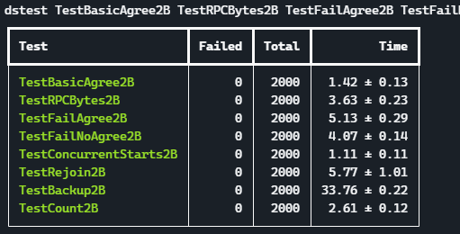

# 分布式系统

[TOC]

课程链接：

* [6.824 Schedule: Spring 2020 ](http://nil.csail.mit.edu/6.824/2020/schedule.html)
* [6.824 Schedule: Spring 2021](http://nil.csail.mit.edu/6.824/2021/schedule.html)，2021 添加了 lab 2D，设置更合理

推荐翻译：

* [Simviso MIT6.824 翻译](https://www.simtoco.com/#/albums?id=1000019)
* [MIT6.824 GItbook 翻译](https://mit-public-courses-cn-translatio.gitbook.io/mit6-824) 对应 Github [huihongxiao/MIT6.824](https://github.com/huihongxiao/MIT6.824)

## 零. 简介

分布式系统的核心就是通过网络来使一群计算机互相通信来完成一系列连贯的任务。

在尝试构建分布式系统之前，可以尝试使用其它方法来进行解决，因为分布式系统很难。

为什么需要构建分布式系统：

* 并行化处理，大量 CPU、内存、硬盘可以一起进行工作
* 容错处理，如果一台发生故障，可以切换到另一台计算机
* 物理原因
* 安全原因，将事情隔离多个事件来共同计算

分布式系统为什么难：

* 需要进行并发处理
* 可能遇到部分机器故障
* 性能问题

通常情况下，使用分布式系统就是为了获取更高的**性能**，获取性能就需要对数据进行**分片**在各服务器上进行处理，在多服务器的情况下就避免不了可能会出现**故障**，出现故障就需要对分布式系统有较好的**容错**性，想要更高容错性就需要进行**复制**，复制过程中可能会由于其他环境原因出现**不一致**的情况，需要高一致性的系统就会导致**低性能**。因此设计一个分布式系统需要考虑方方面面既要兼顾系统的可靠性还要兼顾系统的性能，所以分布式系统很难。

> 在看课之前必须读过整篇论文，否则看课没什么意义。

## 一. MapReduce

MapReduce: 用户使用 `map` 函数根据键值对产生一系列的**过渡键值对**(intermediate key/value pairs)，然后根据 `reduce` 函数将具有相同过渡键(intermediate key)的过渡值(intermediate value)合并。

由于数据量十分庞大，只有在数百个或者数千个机器上进行计算才能在合理的时间内完成，然而中间产生的问题比如如何并行计算、分布存储数据、错误处理，都让本来简单的算法在分布式系统上需要很复杂的代码才能实现，并且代码过于晦涩难懂，因此产生了 MapReduce。

MapReduce 使用**函数式模型**(Functional Model)，隐藏了棘手的并行化、容错、数据分布以及负载均衡的细节，可以轻松地进行大规模并行计算，并且使用**再执行**(re-execution)作为原语机制进行容错。

### 1. 编程模型

计算就是根据输入的键值对来生成输出的键值对，MapReduce 有两个关键的函数即 `Map` 和 `Reduce`。假设 MapReduce 用来计数一堆文档中字母出现的次数。

* `Map` 函数，由用户进行编写，用于将输入键值对产生过渡键值对，MapReduce 库将具有相同过渡键的过渡值传递给 `Reduce` 函数。以计数为例，Map 函数伪代码可以写为：

  ```python
  def map(key, value):
      # key 文档名，value 文档内容
      for word in value:
          EmitIntermediate(word, "1");
  ```

  `Map` 函数所作工作相当于：`(k1, v1) -> list(k2, v2)`

* `Reduce` 函数，也是由用户进行编写，用于接收一个过渡键以及对应的一系列过渡值，然后将这些过渡值合并。通常情况下，每次 `Reduce` 函数调用返回 0 或 1 个值。以计数为例，Reduce 函数伪代码可以写为：

  ```python
  def reduce(key, values):
      # key 字母，values 表示 key 对应所有的过渡值
      res = 0
      for value in values:
          res += int(value)
      Emit(str(res))
  ```

  `Reduce` 函数所作工作相当于：`(k2, list(v2)) -> newvalue`

### 2. 执行细节


<center><i>图1-1</i></center>

图1-1展示了 MapReduce 的整体流程图，当用户进程调用 MapReduce 的时：

1. 用户进程中的 MapReduce 库首先将输入文件划分为 $M$ 个 16 ~ 64 MB 的小文件，并且用户进程 fork 出众多子进程。
2. 其中 Master 进程是最特殊的，用来为其他子进程分配任务。划分为 $M$ 个小文件就有 $M$ 个 `Map` 任务，并且假设有 $R$ 个 `Reduce` 任务。Master 随机选取其中一个空闲 worker 来进行分配任务。
3. Map worker 从小文件中读取内容，从文件中解析键值对并且将其传给用户定义的 `Map` 函数，将 `Map` 函数产生的过渡键值对缓冲在内存中。
4. Map worker 会定期将缓冲的键值对写入本地磁盘，然后使用分区函数（比如 $hash(key)\%R$ ）将其分为 $R$ 份用于 reduce worker 进行处理。写入本地磁盘后将包含 $R$ 个临时文件的信息传递回 Master，然后 Master 将 `Map` 好的文件位置转发给 reduce worker。
5. 当 master 通知 reduce worker 过渡键值对的存储位置之后，reduce worker 通过 RPC 来读取数据。当 reduce worker 读取完所有过渡键值对会对其进行排序，这样相同 key 的数据就可以分组在一起。这里的排序工作是必要的，因为其他的键也会分配到相同的 reduce task 中，如果所需排序数据过于庞大，也可以使用外部排序。
6. reduce worker 为每个过渡键遍历所有过渡值，然后将 key 和所有的 values 都传递给用户定义的 `Reduce` 函数，然后将结果输出到这个 reduce task 分区中。
7. 当所有 map 和 reduce worker 结束之后，master 唤醒用户进程。

最终 reduce worker 产生了 $R$ 个输出文件，一般情况下用户不需要将这 $R$ 个输出文件合并，而是转入下一个 MapReduce 任务或者其他的分布式任务中。

🔵Master 的数据结构：

在 MapReduce 任务中，Master 起到很重要的枢纽作用，并且维护了几种数据结构。

* 对于每个 map 或者 reduce 任务都有三种状态：idle, in-process, completed. 

* 对于每个 worker 还应该有身份标识。
* 对于已完成的 map 任务，master 还应该保存 $R$ 个过渡键值对数据的位置和大小，然后将这些任务将给正在运行的 reduce worker。

### 3. 容错处理

容错处理看重的能力：

* 可用性(Availablity)：当遇到故障的时候，系统会继续运行并且提供完好的服务。
* 可恢复性(recoverablity)：当发生故障的时候，系统会对其自行进行修复并且继续运行。比如可能需要保存 checkpoint 落盘。

由于 MapReduce 库是为成百上千个服务器处理大规模数据而设计的，因此容错能力必须好。在 MapReduce 任务中，可能出现 worker 故障和 master 故障。

* Master 故障

  由于 master 节点只有一个，==因此不太可能发生故障[^Q1]==，如果 master 故障 MR 任务会直接终止运算。master 节点也会定期向磁盘写入以上提到 master 数据结构信息的 checkpoint，因此当 master 故障恢复的时候可以从上一次状态继续运行。客户端如果遇到这种情况可以重新提交 MR 任务。

* Worker 故障

  Master 会定期向 worker 发送心跳包，如果在特定时间内 worker 未进行回应，master 会将 worker 标记为已故障。

  在 worker 上成功完成 map 或者 reduce 任务时应该重置为 idle 状态，worker 任务失败的时候也应该被重置为 idle 状态，方便进行重新调度。

  在 Map worker 上已完成的任务需要重新执行，因为 map 任务的结果存储在故障机器的硬盘上并且不可访问了，因此需要重新执行；==在 reduce worker 上已完成的任务不需要重新执行，因为其结果就保存在全局文件系统上[^Q2]==。

  如果一个集群中很多机器由于网络维护全部失联，MapReduce Master 会重新执行调度这些集群处理的任务，直到任务完成。

* 出现故障时候的处理机制

  在确定 map 和 reduce 函数都是确定性函数的时候，在不发生任何故障的情况下函数的在不同机器上的分布式实现产生的结果都是一致的。MapReduce 将 `Map` 和 `Reduce` 函数定义为原子性的，如果 master 重复收到已完成的 Map 任务信息，master 会选择忽略；否则 master 会将 $R$ 个文件的信息存放在其数据结构中。

> 还有一点需要注意的是，谷歌的 MR 任务是跑在其 Google File System 的基础上，当对于一堆大型文件进行 MR 任务处理的时候，在 GFS 各个机器上已经有文件的备份，因此无需占用额外的网络带宽。

如果 MR 任务中极个别 worker 上可能由于机器原因（网络带宽、CPU 占用过高、读写能力较差）导致整体任务执行时间变长，当 MR 任务进入末尾阶段，master 会将还在运行的任务进行备份执行（即在其他机器也运行），谷歌工程师发现如果开启备份执行会有效提高整体任务执行的速度。

### 4. 功能扩展

🔵 Combiner 函数

在单词计数例子中，可能会出现很多 <the, 1> 的情况，而这一个 map 任务就会传到单独的 reduce 任务中，对于在文章中 the 单词数量较多的情况，用户可以实现 `Combiner` 函数进行合并。

`Combiner` 函数在 map 任务阶段运行，不过通常阶段下 `Combiner` 函数和 `Reduce` 函数大部分实现是一致的，最主要的区别就在于输出部分， `Combiner` 函数输出在过渡文件中， `Reduce` 函数输出在最终输出文件中。

Combiner 函数会显著提高特定 MapReduce 任务。

🔵 跳过坏记录

对于某些无法产生结果的记录，可以选择忽略。因为有可能是第三方库的问题，也有可能是系统段错误等问题造成的，有时候业务允许的情况下忽略一些记录也是可以的。

🔵 其他功能

在 Map 函数或者 Reduce 函数中可以添加其他功能比如计数功能、日志功能等，使用单独的 worker 定期传给 master。（这里需要注意的是，其他功能有可能会被备份调度(backup task)的时候重执行）

## 二. GFS


Google File System 是为大规模分布式数据密集型应用而涉及的可伸缩式的分布式文件系统。它与之前所有的分布式文件系统有以下 4 点不同：

* GFS 将组件故障当作一个常规事件而不是异常事件。对于数以百计并且参差不齐的硬件设施来说，无法保证这些硬件在任何事件都能够正常运行。因此常规监控、错误检测、故障容错以及自动恢复对于一个系统来说是十分重要的。
* 在通常情况下，文件是十分巨大的。
* 大部分文件修改方式是用过**追加**的方式而不是在源文件基础上进行修改。一旦对文件写入完毕，文件就变成只读的形式。
* 应用程序和文件系统 API 的协同涉及提高了整个系统的灵活性。GFS 对于强一致性的要求不高，因此减轻了文件系统对应用程序的苛刻要求，大大简化的 GFS 的设计。

### 1. 设计总览

GFS 的设计前提：

* GFS 假设系统运行的硬件都是容易损坏的，因此 GFS 必须提供监控、检测、容灾以及自我恢复的功能。
* 只有两种类型的读：大规模流式读取和小规模随机读取。
* 支持大规模顺序写和小规模随机写。但是随机写不保证其运行效率
* 支持多客户的并发写入，在客户端无需实现同步机制。
* 网络的高带宽优先级要高于网络低延迟
* GFS 是为存储大型数据的设计的，不是为小型数据库（比如银行只需要存储用户余额的）设计的。

GFS 支持普通的文件操作和额外的快照功能(snapshot)和并发记录追加(record append)的功能。

**GFS 的架构**：一个 GFS 集群是有**单个** master 节点和多个 chunkserver 组成。机器上每个文件都被分为固定大小的块(chunks)，默认64MB，每个块都由 master 分配一个唯一而且不可变的 64 位 ID 组成。为了保险起见，每个块都要在多个 chunkserver 上进行备份。客户端在获取文件的时候首先从 master 节点查看 chunkserver 的元信息(metadata)，然后根据元信息去 chunkserver 存取文件。

**单 master 节点**：采用单 master 节点的设计方式可以大大简化设计方案，并且由于大部分读写操作不在 master 节点上进行，所有单 master 节点不会成为性能瓶颈。并且设计 GFS 的初衷就是最小化与 master 节点的交互操作。

**元数据(metadata)**：在 master 节点主要存储三种类型元信息（文件和块的命名空间，文件到块的映射，块其他备份的位置），所有这些元信息都保存在 master 节点的内存中。并且元数据占用的内存空间小，不必担心会因为 chunk 过多导致 master 节点的内存不够用（2003 年）。

**操作日志**：对于 GFS 来说，操作日志十分重要。当响应客户端请求之前，必须将对应日志进行持久化存储到本地和远程，才能够返回响应操作。当日志的长度到达一定长度的时候，master 节点会生成快照，然后可以记录新的日志文件。

### 2. 一致性模型

GFS 采用的是一种较为宽松的一致性模型，在保证系统运行的同时也能较为简单和高效。GFS 在实现分布式系统宽松的一致性模型基础上，使用三个方法保证系统设计简单的特点：

1. 写数据主要依靠追加的方式而不是覆写，因为追加的方式要比随机写的方式更高效和更有弹性
2. 写时自我验证机制。由于 GFS 实现的是较为宽松的一致性模型，采用的是至少添加一次(append-at-least-once)的追加方案，因此可能会出现数据冗余重复的情况，因此需要实现数据块验证和识别的方法来识别重复冗余的数据块。
3. 自我识别机制，作用同2.

### 3. 数据交互细节

这一节主要介绍客户端、master、chunkserver如何实现数据修改、原子追加以及快照功能。

<h4>3.1. 租约(lease)和修改顺序</h4>

租约的设计初衷就是为了降低 master 节点的管理开销。由于每一次修改操作都会在多个备份服务器上执行，因此在多个备份服务器上使用租约来维护一致性修改顺序。

master 节点会授权租约给一个 chunkserver，这个 chunkserver 被称为 primary replica 即主备份服务器，和这个 chunkserver 关联的其他备份服务器都附属于主备份服务器，所有副备份服务器的修改操作都由主备份服务器的指令进行分发。通常情况下租约时长为 60 秒，每次通过心跳检测就可以延长租约。具体流程如图：


1. 客户端首先询问 master 哪些 chunkserver 拥有对应数据块的租约和其他备份服务器的位置。如果没有服务器拥有租约即没有 primary 服务器，则 master 选择拥有这个 chunk 最新版本号的服务器作为 primary。
2. master 告诉客户端主副备份服务器的位置。
3. 客户端将数据发送给所有主副备份服务器。客户端可以根据网络拓扑来寻找最近的服务器，而不是直接推给主备份服务器。为了能够最大化网络带宽的利用率，传输数据采用线性传输的方式(即一对一传输)，并且为了防止出现网络瓶颈的问题，每个备份服务器向**最近**的服务器进行数据传输。
4. 一旦所有的备份服务器都接收到数据，客户端像主备份服务器发送**写请求**。主备份服务器分配连续的序列号给所有修改过的块，并且以序列号顺序写入本地状态。
5. 主备份服务器转发写请求给所有副备份服务器，副备份服务器也以序列号的顺序写入本地状态。
6. 写入本地状态完毕后，副备份服务器回复 primary 已完成所有操作。
7. primary 返回给客户端。如果期间发生错误，即写入 primary 成功但是写入副备份服务器失败，就认为客户端的写入请求失败，需要重复请求。

<h4>3.2 原子追加记录</h4>

以往的文件写的方式需要指定偏移位置和数据，而追加记录的方式只需要指定数据即可。

<h4>3.3 快照</h4>

GFS 采用 copy-on-write 的方式来实现快照功能。当 master 收到快照请求的时候，会首先撤回所有将要进行快照数据块的租约，这保证了所有随后对该数据块的写请求先暂停等待新的租约发放。

当进行快照处理后，如果客户端想要对一个数据块 C 进行修改，则需要创建新的块 C' 进行写入。

### 4. Master 节点操作

master 节点的作用：命名空间管理，替换策略，创建新数据块，系统范围内的协调保证数据块被完全备份，负载均衡以及回收未使用区域。

<h4>4.1 命名空间管理和锁</h4>

很多 master 的操作是比较耗时的，于此同时 GFS 不希望阻塞其他操作，因此运行并发操作并且使用锁来保证操作的串行化。

在对文件进行操作的时候，比如文件所在目录为 `/a/b/c/d/leaf`，需要对目录 `/a`, `/a/b`, `/a/b/c` ... 添加读锁，对 `/a/b/c/d/leaf` 添加读锁或者写锁。

<h4>4.2 检测旧数据</h4>

master 节点维护着两张映射表：

* 文件名 -> 一组 chunk handle
* chunk handle -> 一组 chunkserver，版本号，主备份服务器，租约

如果一个 chunkserver 故障并且错过很多修改操作，那么就会出现旧数据的情况。因此对于每一个数据块应该维护一个 chunk version number 的标志来区分最新数据和旧数据。

### 5. 容错和故障检测

<h4>5.1 高可用</h4>

GFS 保证高可用有两个十分有用的策略：快速恢复和数据备份。

🔵快速恢复

master 和 chunkserver 都能保存他们的状态，并且无论他们怎么结束的都能在几秒之内启动。

🔵数据块备份

每个数据块都在不同的区域进行备份，用户可以指定不同的备份等级，默认情况下备份的数目是 3. 

🔵master 备份

备份 master 节点的数据用于可靠性保证。master 节点的操作和快照备份在多个机器上。客户端连接 master 之间只使用 DNS 代称来防止出现 master 节点切换。

<h4>5.2 数据完整性</h4>

每个 chunkserver 都是用 checksum 来检测损坏的数据。如果一个数据块的 checksum 和元信息中保存的不相同，chunkserver 就会返回一个错误给 master，客户端会向其他的备份服务器发起请求。

> TODO 重复数据笔记

### 6. GFS 改进

想让 GFS 进一步实现强一致性，有以下几点改进之处：

1. 可以让 chunkserver 处理重复请求
2. 如果副备份服务器出现故障的话，应该更换新的服务器
3. master 负载会较大

## 三. Fault-Tolerant VM


本文主要讲的是基于在副备份 VM 上重复执行主 VM 上的操作来实现故障容错的虚拟机技术。

传统的故障容错方法：保持一个备份服务器一直可用，当主节点宕机的时候这个备份服务器立马取而代之。这个备份服务器必须时刻维持和主服务器完全一致的状态，备份服务器必须复制主服务器的一切状态包括：CPU、内存、IO设备等状态信息。**缺点**：需要两台机器之间的**带宽必须很大**才能够确保在主服务器挂掉之前将信息全部传回副服务器。

由于 CPU 频率的不断提升，保证机器按照特定的顺序执行指令几乎是不可能的，而虚拟机正是运行在虚拟机监控程序上的，因此保证指令的顺序十分方便，因此使用状态的形式(state-machine)来维护机器的状态这种方法效果十分良好。

并且使用虚拟机的形式，对于一些非确定性(non-deterministic)操作比如取当前时间、取随机数等操作，hypervisor 可以控制不同 VM 的输入从而达到让所有的虚拟机都能得到相同的结果（只支持单核处理器）。

### 1. 设计总览

在正常工作的时候，所有客户端的请求都发送到主服务器上，主服务器的所有操作通过**日志通道(Logging Channel)**发送给备份服务器，但是备份服务器的输出会被抛弃。主从服务器之间只传输外部事件和外部输入。

<h4>1.1 确定性重演(deterministic replay)实现</h4>

通常会有很多不确定操作：系统中断、处理器的读写周期、随机数等操作等会影响主从服务器的状态。确定性重演面临三个问题：

* 如何正确捕捉输入并且能够将非确定输入转换到确定性输出
* 如何正确将输入应用到备份服务器
* 如何在确保上述条件满足的情况不会影响执行性能，并且不会对系统产生副作用。

对于不确定事件比如虚拟中断，hypervisor 也会将中断以数据流的形式传给备份服务器，因此可以在备份服务器上进行重演。

<h4>1.2 容错协议</h4>


输出结果要求：当备份服务器取代主服务器之后，备份服务器将会继续执行，并且结果需要和原先主服务器发送给外部客户端的结果保持完全一致。

主服务器输出准则：只有当备份服务器接收并且应用主服务器发送的日志之后，主服务器才会对客户端的请求响应结果。

注意：在发生宕机的情况下，无法保证所有的输出只会输出一次。

由于未使用两阶段提交(Two Phase Commit, 2PC)，备份服务器并无法知道主服务器是在输出之前还是之后崩溃的，由于使用的是 TCP 协议，可以在协议层面解决重复包和丢包的问题。

主从服务器都会有一个日志缓存池(log buffer)，用于缓冲日志。对于主服务器来说，如果缓冲区填满之后就必须停止执行直到缓冲区的日志发送到备份服务器，对于备份服务器如果收到空的日志记录也会停止执行直到新的日志到来。对于出现缓冲区填满的情况大部分情况是由于备份服务器执行太慢的原因导致，因此在选择备份服务器重演的时候必须选择与主服务器执行速度大致一致的机器。

如果对于备份服务器执行速度是在是太慢的情况，VMWare 会降低主服务器的执行速度。当然这种情况很少会发生，只有在服务器压力很大的情况下才会发生。

<h4>1.3 检测故障和故障处理</h4>

当主服务器挂掉之后，备份服务器取代主服务器。但是会有一点延迟，因为备份服务器接收到日志之后，并未执行到恰当的时机，因此需要等到备份服务器将所有的日志消息全部处理之后才能够完全取代主服务器。并且 VMWare 底层对于机器级别的信息也会进行处理，比如会将原先主服务器的 MAC 赋值给备份服务器。

检测故障：主从服务器之间使用 UDP 进行心跳检测通信，除了主从服务器之外，VMWare 还有一个 Monitor 来监控从主服务器发送到备份服务器的日志和备份服务器发送给主服务器的答复包。

脑裂问题(split-brain)：然而之前的检测并不能解决脑裂问题，vm-ft 中使用共享存储的形式来解决脑裂问题，由于主从机器都是共享存储设备的，因此使用原子操作 test-and-set 来设置对应的文件标识，如果未设置成功就会一直尝试直到成功。 

## 四. Raft


### 1. 设计总览

Paxos 晦涩难懂，因此设计之初将易于理解作为 Raft 的首要设计理念，相比于其他一致性算法有以下特点：

* 强领导：日志记录只会从 Leader 到 Follower，Leader 命令必须服从，不得有任何异议。
* 领导选举：使用随机计时器来选举 Leader，Follower 采用一人一票的形式进行选举，需要半数以上的机器投票给一位候选者，候选者即可当选，在实际生产中总会因为种种原因导致机器故障，因此全票当选极其罕见。
* 成员更迭：使用联合共识的方法来进行

一致性算法通常都是基于复制状态机(replicated status machines)，其在分布式系统用于解决故障容灾的问题。复制状态机的实现是基于备份日志的。

一致性算法需要具有以下几个属性：

* 安全：在所有非拜占庭条件下(比如网络延迟、丢包、重复包、乱序包等)决不返回错误的结果。
* 可用性：只要大部分服务器可以用就可以提供服务。
* 通常情况下，只要大部分服务器都接受来自客户端的指令之后就可以返回响应请求了，少部分服务器的不一致不会影响整个系统的性能。

### 2. 实现细节


Raft 将一致性问题分解为三个部分：选举 Leader、复制日志以及安全性。

在 Raft 中服务器的角色只有三个：Leader、Follower 以及 Candidate，三种角色的转换状态如下：


Follower 总是被动的，从不主动发出信息，只是简单回应 candidate 和 Leader 的指令。Raft 使用任期号来标识数据是否是新的还是陈旧的，当低的任期号发来的时候会直接拒绝，当更高的任期号发送来的时候：

* Follower 会更新当前的任期号，将 Leader 改为任期号更高的 Leader，并且将日志同步到最新
* Candidate 和 Leader 同样会更新当前任期号，并且会转为 Follower。

服务器之间使用 RPC 进行交流，会使用到 3 中 RPC：

1. RequestVote，用于 Candidate 向 Followers 发送投票请求
2. AppendEntries，用于 Leader 发送给 Followers 日志信息，用于备份日志和心跳请求
3. InstallSnapshot，对于已经进行压缩的日志，Leader 就将快照发送给 Follower

🔵Leader 选举

Raft 使用心跳机制来触发选举。

Follower 状态的改变：

* 当处于初始状态的时候，所有服务器都是 Follower 的状态，如果在一段时间内未收到 Candidate 或者 Leader 的心跳包，那么就会增加自己的任期称为 Candidate 向其他所有服务器申请投票 RequestVote RPC，这段时间也称为选举超时时间(election timeout)。

Candidate 状态的改变：

* 赢得选举成为 Leader
* 更高任期号发送来成为 Follower
* 当前任期 Candidate 既没赢也没输选举，那么就会增加任期，重新开始一轮新的选举。

为了不让 Followers 同一时间全部转为 Candidate，因此 Raft 使用随机选举超时时间来防止这一情况发生，比如设置时间在 150-300ms 内。

🔵日志备份


一旦 Leader 选举完成后，就开始服务客户端请求，当客户端发送来请求的时候，Raft 会做出以下步骤：

1. Leader 接收到客户端的请求，并将这个请求以追加的方式添加到日志记录中
2. Leader 将新收到的日志分发给所有的 Follower
3. Follower 接受到日志后添加的队列中，并且返回成功信息给 Leader
4. Leader 接收到大多数服务器的成功信息后，将日志 **commit**。
5. 当日志成功提交后，将结果返回给客户端

每个日志中包含的信息有：日志在队列中的索引，日志提交的任期号以及具体请求内容。

如何判断日志已提交：

* 对于 Leader 来说，只要大多数服务器都成功备份这条日志后就可以成为已提交的日志。
* 对于 Follower 来说，如果这条日志在 Leader 已提交，那么在 Follower 上这条日志也可以提交了。

存储日志的规则：

* 对于相同的日志，其应该具有相同的任期号和索引，并且日志内容也应该保持一致。
* 对于相同的日志，其之前的所有日志也应该保持完全一致。

如何保持 Leader 和 Follower 日志同步（AppendEntries RPC）：

* 找到 Leader 和 Follower 完全一致的日志索引，删除 Follower 中这个日志索引后的所有日志，从这个索引开始将 Leader 日志同步。

🔵安全性

当 Leader 已经提交多个日志之后突然挂掉，然后已经挂掉很久的 Follower 变成了 Leader，就会发送新的日志覆盖掉其他已经提交过的日志，那么就会导致不同的机器执行过不同顺序的指令。

安全性的要求就是在选举 Leader 的时候添加一个限制，不能让能力低下的候选者当选 Leader。

即最重要的准则：最新已提交的日志不可以被覆盖，必须在这些机器中选出 Leader。

对于 Candidate 当选的限制：

* 如果 Candidate 最后的日志比大多数服务器的日志都要新，得到票数够之后就可以当选。因为这些大多数新的日志都是已经提交过的，向客户端已经做出响应的，木已成舟无法改变事实，因此应该选择尊重。

如何判断日志是最新的：

* 如果两个日志任期号不同，则任期大的为最新的
* 如果两个任期号相同，日志索引大的为最新的

在 Leader 提交日志之前挂掉会发生什么事情？

1. 其实 Raft 本身并不知道日志是否已经被提交，Raft 的工作模式就是少数服从多数，当多数服务器上存在这个日志的时候就可以认为这个日志“被提交”，具体是否已经提交要根据服务器中的状态变量 commitIndex 来决定。
2. 但是这会导致客户端因为无法收到回复从而重复发送请求，对于任何分布式系统来说，都无法避免重复请求的问题，因此需要使用其他功能来保证请求的幂等性。

提交之前任期的日志：

* 对于旧任期的日志不能直接提交，由于不知道这个日志之前是否已经被提交过或者已经复制在大部分机器上，所以需要等待本任期的日志提交之后，才能够确认之前的日志已经提交，否则会出现 Figure8 的情况，在 Lab 3C 中的 `TestFigure8Unreliable2C` 可以体现。

### 3. 持久化

论文中有三种变量需要持久化存储。为什么需要对这三个变量进行持久化？：

* Log，在服务器恢复的时候，可以快速构建重放 Log 中日志的内容。Leader 在发送给 Follower 之前需要进行持久化，Follower 在返回 Leader 之前需要进行持久化。
* CurrentTerm，需要在每一个任期中保证只有一个 Leader
* VoteFor，同样是为了保证一个任期中只有一个 Leader，如果在同一个任期中有两个 Candidate 先后在服务器恢复前后发送投票请求，就会导致出现脑裂的情况，因此必须要进行持久化。

### 4. 快照和日志紧缩


随着客户端的请求越来越多，服务器累积的日志长度可能会达到百万级别的数目，如果 Leader 突然崩溃恢复后需要从头开始进行日志重演，这可能会耗费几个小时以上，最终导致服务器的可用性问题，因此需要使用它快照功能进行日志紧缩操作。


当 Follower 请求已经快照索引之前的日志，或者 Follower 实在是落后太多了，Leader 应该向 Follower 发送安装快照请求。

在 Raft 中所有的服务器都可以自行生成快照，Leader 只有在 Follower 的日志实在落后太多的时候才会向其发送 InstallSnapshot RPC 请求。虽然这种独立生成快照的方法会削弱 raft 强领导的属性，但是会更节省资源和处理更简单，因为只有 Leader 生成快照会有两个缺点：

* 发送快照十分耗费带宽资源，更节省资源的方法就是直接让每个服务器自己生成快照。
* 只有 Leader 生成快照会让 Leader 的处理逻辑更加复杂

## 五. Zookeeper


> Zookeeper 为大型系统设计的无阻塞协作分布式系统，相比于 raft，zookeeper 可以用于构建更具有通用性的分布式系统，并且相比于 raft 其处理读请求的能力要更强。

强一致性准则，也称为线性一致性 (linearizability)。

### 1. 基本介绍

**简述**：Zookeeper 包含的功能有群发消息、共享注册、多备份的分布式锁以及中心化服务。ZK 使用一种事件驱动的机制来实现无阻塞特性，和分布式文件系统中的缓存验证类似，用来提供一种简单并且强力的分布式协作服务。

**使用场景**：ZK 中每个客户端的请求都是以 FIFO 的顺序进行执行，并且以线性一致性的顺序修改 ZK 状态。这种设计能够让 ZK 十分高性能处理流水线的**读请求**，ZK 适合处理**读写请求比例为 2:1 ~ 100:1 的场景**，并且可以实现每秒处理百万级别的请求，ZK 在本地处理读请求。

特性：

* 在 ZK 中不去实现特定的原语操作，而是采用更加灵活的方式，让开发者决定原语操作。
* ZK **摈弃传统阻塞式原语(锁)**，而是通过采用操作类似文件系统的**非阻塞数据文件(wait-free data objects)**，客户端采用异步的方式来提交请求，因此在同一时间内可以做很多事情。传统的方式可能会存在处理快的机器会被处理慢机器影响执行效率。
* 只有写操作是线性一致性的。

保证一致性协作的重要两点：

* 保证客户端指令都是以 FIFO 的顺序出入
* 线性一致性写操作

并且为了保证写操作满足线性一致性，ZK 中实现的以 Leader 为基础的原子广播协议 ZAB。

### 2. 具体理论


<h4>0x1. Znode</h4>

ZK 为客户端抽象出数据节点的概念即 znode，根据层级关系来组织在一起。znode 有两种类型：

* 常规 znode：客户端可以显式创建和删除常规 znode
* 临时 znode：也可以显式创建和删除，系统会在客户端和服务器之间的会话结束后自动删除。

ZK 实现监控器让客户端在不需要发送请求的情况下定时收到数据变化的通知。当客户端向 ZK 发送读请求并且设置 `watch` 标志位的时候，当对应数据发送变化的时候服务器会向该客户端发送通知。

ZK 的层级命名空间在为不同应用分配命名空间子树和为这些子树设置读写权限的时候十分有用。

<h4>0x2. Client API</h4>

这些所有的 API 有同步也有异步版本的。

* `create(path, data, flags)`：在对应的路径下创建 znode，并且存储对应的数据 data，并且设置对应的标志位（常规 or 临时znode、序列号等），并且返回新的 znode。
* `delete(path, version)`：删除指定版本号的 znode
* `exists(path, watch)`：如果对应路径存在则返回真，否则返回假。`watch` 用于让客户端给对应的 znode 设置监听器。
* `getData(path, watch)`：返回这个 znode 的所有信息比如元数据、版本号等等。`watch` 标志位同上。
* `setData(path, data, version)`：向该路径下对应版本号的 znode 进行写操作。
* `getChildren(path, watch)`：返回该 znode 节点下所有的 children。
* `sync(path)`：用于等待所有正在挂起的更新操作传播到服务器上，只要有写操作，就会一直阻塞。

所有更新操作都使用版本号来进行对比，对比成功之后才会进行更新。ZK 还提供了当方法版本号为 -1 的时候表示该操作无需对比版本号。

<h4>0x3. 一致性保证</h4>

ZK 保证两个基本顺序：

* 线性一致性写：所有更新 ZK 状态的写操作请求都是线性的。
* FIFO 客户端请求：所有来自指定客户端的请求都是按客户端发送时候的顺序执行。

> 需要注意的是这里的线性一致性指的是异步线性一致性(Async-linearizability)

当 leader 开始掌控系统的时候，必须要修改很多系统参数配置，并且只有在配置完成后通知其他 worker 开始工作。那么就产生了两点需求：

* 当 leader 需要修改配置的时候，不希望其他进程使用将要修改的配置文件
* 在配置文件更新完毕之前 leader 崩溃了，不希望其他进程使用这部分配置。

<h4>0x4. 原语样例</h4>

ZK 的执行顺序保证允许高效推理系统状态，监控器允许高效等待。

* 配置管理

  ZK 可以在分布式应用中实现动态配置。所有进程通过读取 znode 来获取对应的配置，并且设置监视器 watch 标志位为 true，当配置发送改变的时候重新获取配置并且设置 watch 为 true。

* 成员管理

  可以利用临时节点来完成成员管理，对于组来说可以创建父节点，每个组成员为子节点，当成员离线对话结束后 ZK 会自动删除节点信息。其中节点信息可以保存其 IP 地址、端口号等等。

  如果想要查看组成员只需要查看组节点下所有的子节点信息即可，添加 `watch` 标志位可以动态查看成员变化。

* 锁机制

  ZK 虽然不使用锁，但是可以实现锁操作。可以创建指定路径下的临时 znode，如果创建成功就表示获得锁，如果创建失败就向其添加 `watch` 标志位，当该 znode 节点被删除的时候就会通知对应的客户端，其他客户端收到消息重新创建锁。

  但是这种方法会导致**羊群效应**(herd effect)，如果有很多客户端都在争抢这个锁，但是最终只能有一个客户端获取锁，会消耗很多资源。

  可以将所有锁的请求的进行排队，按照序列号进行排序，当一个客户端释放锁的时候，只有下一个序列号触发，后一个序列号的客户端设置前一个序列号客户端 znode 的 `watch` 标志位为 true。

  锁操作：

  ```
  LOCK
  	1. n = create(l + "lock-", EHEMERAL|SEQUENTIAL)
  	2. C = getChildren(l, false)
  	3. if n is lowert znode in C, exit
  	4. p = znode in C ordered just before n(precedence sequence number)
  	5. if exists(p, true) wait for watch event
  	6. goto 2
  UNLOCK
  	1. delete(n)
  ```

* 读写锁

  ```
  WRITE LOCK:
  	1. n = create(l + "write-", EHEMERAL|SEQUENTIAL)
  	2. C = getChildren(l, false)
  	3. if n is lowert znode in C, exit
  	4. p = znode in C ordered just before n(precedence sequence number)
  	5. if exists(p, true) wait for watch event
  	6. goto 2
  
  READ LOCK:
  	1. n = create(l + "read-", EHEMERAL|SEQUENTIAL)
  	2. C = getChildren(l, false)
  	3. if not write lock before n in C, exit
  	4. p = precedent write znode before n in C
  	5. if exists(p, true) wait for watch event
  	6. goto 3
  ```

缺点：但是这个实现的锁不能算是真正意义上的锁，假如 A 持有锁并且对某文件进行写操作中途故障会释放掉锁，下一个服务器来对该文件查看的时候会看到 A 处理一半时候的样子，这对于其他要求较高的系统是很难进行容忍的，后者需要为前者擦屁股，因此需要根据实际需要来使用 Zookeeper，这种锁算是一种 soft lock.

### 3. 实现细节

对于一个 ZK 集群，其中任何一个服务器都可以响应客户端，对于读请求该服务器可以在本地直接运行，对于写请求通过一致性协议进行处理。ZK 集群中收到客户端的写请求后都会转发给 Leader。

其实 Zookeeper 无法保证对于每个 replica 中的数据是最新的，那么其向客户端响应的读请求不一定是最新的，因此 ZK 不算是完全线性一致性的系统。Zookeeper 选择在强一致性和性能之间进行了取舍，之可以说算是**写线性一致性**。

ZK 服务器在响应客户端的请求之后，会将最新的日志 ID 标识 zxid 传输给客户端，当客户端向集群发送请求的时候会附带这个标识。如果此时 A 服务器宕机之后，客户端会转而向集群中的另一个机器发送请求，由于 ZK 集群中每个机器的执行速度不尽相同，如果新的服务器处理日志的速度较慢，那么这个读请求不会立即响应，直到处理到 zxid 标识的日志之后才会处理这个读请求。

## 六. Aurora

P36

## X. Labs

[Lab 引导](http://nil.csail.mit.edu/6.824/2021/labs/guidance.html)

### 1. MapReduce

[6.824 Lab 1](http://nil.csail.mit.edu/6.824/2021/labs/lab-mr.html)

目标：需要实现能够调用 Map 和 Reduce 应用的 worker 程序来读取和写入文件，coordinator 程序来为 worker 进程分配任务并且解决任务失败的 worker（相当于 master 进程）。使用 MapReduce 程序来实现一个单词计数的软件。

具体分工：

* Worker：向 Coordinator 请求任务，从多个文件中读取输入文件，并且将 Map 结果输出到多个文件中。
* Coordinator：如果 worker 耗费时间过长(10s)就会将任务分配给其他 worker。

具体实现：

1. 心跳机制：Worker 和 Master 之间必须确保两者全都存活，需要使用心跳机制来维护两者之间的联系。对于超时离线的 worker 应该将其正在进行的任务进行回首，对于已超时 worker 发来的其他请求应进行回绝。
2. 资源区分：对于 Master 来说必须分清楚哪些资源会是共享资源，如果是共享资源需要保证资源访问修改时的一致性，RPC访问资源是多线程访问的，因此需要进行加锁保护，也属于操作原子性的保证。
3. 操作隔离性：对于一个操作需要使用事务性的视角进行看待，如果这个操作其中一步未成功，那么该操作中之前所有操作对于系统的影响都应该撤销，防止对其他操作进行干扰，可以先将暂时的结果写在缓冲区和 `/tmp` 作为临时文件，等待事务全部成功再将对应文件改名即可。
4. 操作超时：对于操作超时的 worker 的任务也应该进行回收。
5. 优雅退出：在 `early_exit` 测试中，有三个 worker 和一个 master，如果其中一个程序退出就认为整个 MapReduce 任务结束，就会将此时输出的结果和 4 个程序最终结束后输出的结果进行比对，如果一个 worker 结束后其他 worker 任务事务成功还未写入 `mr-out-*` 文件，那么两个文件之间就会存在差异。英因此需要一个优雅的退出流程：等待所有 Reduce 任务完成 -> Master 收到所有任务全部完成 -> Master 退出 -> Reduce 退出。因此优雅退出的核心要素是只有所有任务都完成，才能有程序退出。
6. 故障和容错：在进行 MapReduce 任务时候，某些 worker 可能会因为不同因素从而导致崩溃，因此 Master 必须通过心跳机制来检测 worker 是否仍正常工作，如果未正常工作则需要回收崩溃 worker 的任务重新分配给其他的 worker。

### 2. Raft

Link：[Lab 2: Raft](http://nil.csail.mit.edu/6.824/2021/labs/lab-raft.html)

实现 raft 引导：[Students' Guide to Raft](https://thesquareplanet.com/blog/students-guide-to-raft/)

raft 可视化：[Raft Github](https://raft.github.io/), [Raft Guild](http://thesecretlivesofdata.com/raft/)

debug 美化：[Debugging by Pretty Printing](https://blog.josejg.com/debugging-pretty/) 日志美化，可以更方便的根据日志来调试程序

* 美化文件：[dslog.py](https://gist.github.com/JJGO/e64c0e8aedb5d464b5f79d3b12197338)，事前需要将文章中的 `Debug` 函数添加。
* 调试文件：[dstest.py](https://gist.github.com/JJGO/0d73540ef7cc2f066cb535156b7cbdab)，测试 raft 程序健壮性的**必需**程序，对于分布式系统来说，跑一次测试通过并不能代表什么，只有经过上千次的考验才能够检验分布式系统的强壮性。

<h4>0x1. Lab 2A</h4>


目的：实现 Leader 选举部分。

知识点：

* 在进行分布式系统构建的时候，需要分清楚哪些资源是共享变量（多个线程可能会同时读写的变量），对于共享变量的读写必须要进行加锁。

* 使用 `sync.Cond` 或者 `sync.WaitGroup` 来实现线程之间的同步。比如 Candidate 在收集选票的时候，需要票数大于一半就可以成为 Leader 了。`sync.Cond` 适合模糊的条件上线程之间的同步，`sync.WaitGroup` 适合具体条件的线程之间同步。

  ```go
  cond := sync.NewCond(&rf.mu)
  
  for i := range rf.peers {
      go func() {
          // 向各个服务器发送请求投票的消息
          // 如果收到消息
          cond.Broadcast()
      }()
  }
  
  // 3. Wait vote process to finish
  rf.mu.Lock()
  for 票数是否够 {
      cond.Wait()
  }
  // 票数够，则成为 leader
  rf.mu.Unlock()
  ```

* 对于 RPC 来说可能会返回结果、返回调用错误（比如404这类，非业务逻辑错误）、以及网络丢包响应时间过长的情况，应该对这几种情况进行分类

* 对于粗粒度的锁可以使用 `defer` 来进行释放锁

  ```go
  mu.Lock()
  defer mu.Unlock()
  ```

  对于细粒度的锁，应该在 `break` ，`return`  或者其他退出作用域的语句之前释放锁

  ```go
  mu.Lock()
  if condition {
      mu.Unlock()
      break
  }
  mu.Unlock()
  ```

* 需要注意会产生死锁的情况，比如两个都需要锁的函数之间的调用

  ```go
  var mu sync.Mutex
  func A() {
      mu.Lock()
      // deadlock here
      B()
      // ....
      mu.Unlock()
  }
  
  func B() {
      mu.Lock()
      // ....
      mu.Unlock()
  }
  ```

* 对于必须在指定时间内执行完毕的操作，可以使用 `context.WithTimeout` 来进行处理。如果指定 RPC 调用时间实在太长，可能由于发出这个网络数据包的时候恰好断网了一刹那，因此需要结束重试。如果处理函数请求 rpc 时间过长，需要根据 `ctx.Err()` 来判断外部是否给其发送结束信号。

  ```go
  // 5 秒之内未完成则退出流程
  ctx, cancel := context.WithTimeout(context.TODO(), 5*time.Second)
  
  // 处理函数需要有 context 变量
  go func(ctx context.Context) {
      // do something
      if ok {
          // if before ddl and granted
          rpc() // 耗时的 rpc
          if ctx.Err() == nil {
              // 如果事情提前完成，则进行主动关闭
              cancel()
          } else {
              // 超时，外部发送超时信号
          }
          
      } else {
          // if ok is false, receive timeout
      }
  }(ctx)
  
  select {
      case <-ctx.Done():
          if ctx.Err() == context.Canceled {
              // 主动退出的处理
              cond.Broadcast()
          } else if ctx.Err() == context.DeadlineExceeded {
              // timeout, then enter next round request
              timeout = true
          }
  }
  ```
  

<h4>0x2. Lab 2B</h4>




目的：来实现向 Leader 和 Follower 之间提交日志记录。

知识点：

* 在进行最终结果测试的时候可以将 Debug 信息进行删除，来提高测试程序的速度（不过影响不大）。
* 在使用 `dstest` 进行程序测试的时候尽可能保证有空闲的 CPU 时间，否则设置协程 / 线程过多可能会导致某个线程等待时间过长，即使心跳包正常收到也会因为操作系统时间片切换的原因从而程序逻辑判断超时。
* 要善用 `go -race` flag，用来检测临界资源，防止竞态出现过多。
* 对于 context 包的使用，在使用 `context.WithTimeout` 的时候，在已经超时的时候，context 会通过 `ctx.Err()` 函数进行传递，对应的处理函数不会立即停止，需要在处理函数中耗时的 rpc 请求后判断是否已经超时。

<h4>0x3. Lab 2C</h4>


(由于机器比较烂，可能存在 CPU 调度原因导致的错误，所以错误在可接受的范围之内，最低的可用率为 99.85%)

目的：实现 Raft 状态持久化和 Follower 日志落后太多的优化。

知识点：

* 需要对论文中 Figure 8 部分进行处理之前任期未提交的日志，如果进行实现后在 Lab2B 中的 `TestFailNoAgree2B` 可能会不通过，这是正常情况。
* 在没有 Snapshot 的情况下需要完成对于落后很多的 Follower 进行快速优化 NextIndex 数组，如果每次减一会导致超时过长。

<h4>0x4. Lab 2D</h4>


目标：编写具有快照功能的 Raft

知识点：

* 在开启 Lab2D 之前需要将日志索引策略进行更新，不能根据日志在对应数组中的真实索引作为日志当前的索引，由于在进行快照后需要将过时的日志进行删除，那么原有的日志索引策略就会失效。

* 在进行快照的时候，其中最重要的一点就是**暂停**所有 Commit / Apply 操作。因为在程序中 Apply 和向 service 层发送快照通知是使用的同一个 Channel，service 层在处理快照请求的时候也会记录快照时 Apply，如果完成快照之前已经将 CommandApply 就会导致 Apply 增加，从而导致不一致的情况。

  需要保证的线程之前同步顺序如下：

  

  具体实现如下： 

  ```
  // Applying an empty message to keep a sequence when meet snapshot:
  // ApplyCommand(n) -> Snapshot -> ApplySnapshot -> CondInstallSnapshot -> Apply Command(n+1)
  // If not met snapshot, it causes nothing.
  // If met snapshot, it will block the channel before service call `Snapshot`.
  // The snapshot wait group will add one, then empty message and ApplySnapshot message will
  // be queued in channel before next ApplyCommand message queue in.
  ```

  在代码实现的时候使用既不是 CommandApply 也不是 SnapshotApply 的信息来进行不同线程之前的同步。

* 在本次可能会出现死锁的情况，因此需要将一些粗粒度的锁优化为细粒度的锁。


<h4>0x5. All</h4>

```sh
11.00s user 3.04s system 3% cpu 7:38.64 total
```

### KV Server

强一致性准则，也称为线性一致性 (linearizability)。

不显山不显水，让弱者慕强。

## Appendix

[^Q1]: 为什么不太可能发生故障
[^Q2]: reduce worker 是执行在哪个机器上？

