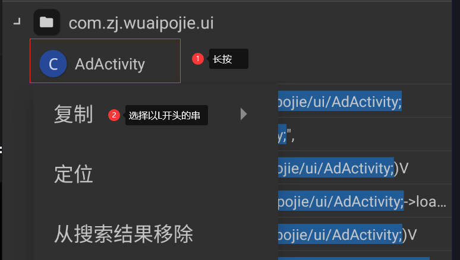
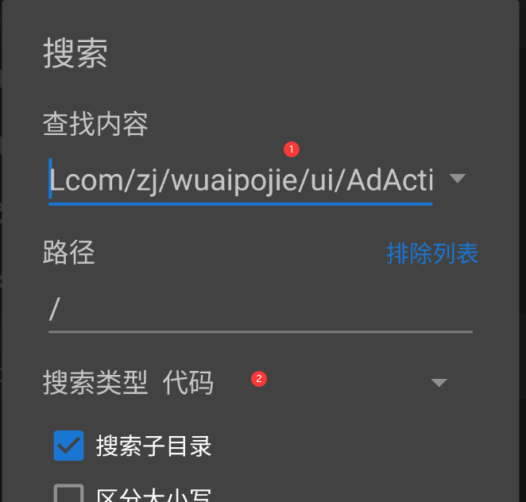
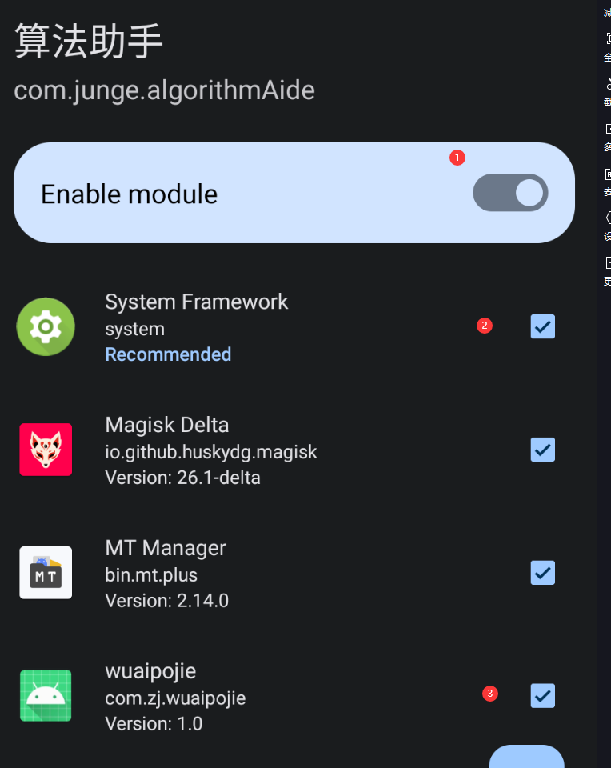
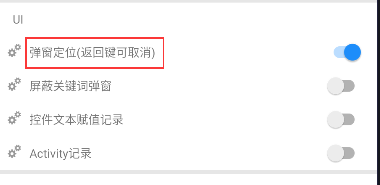
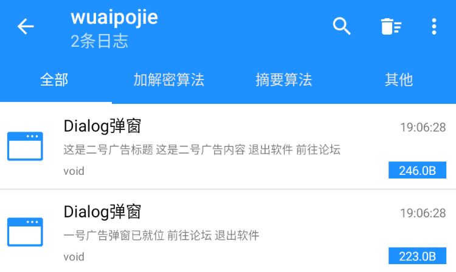
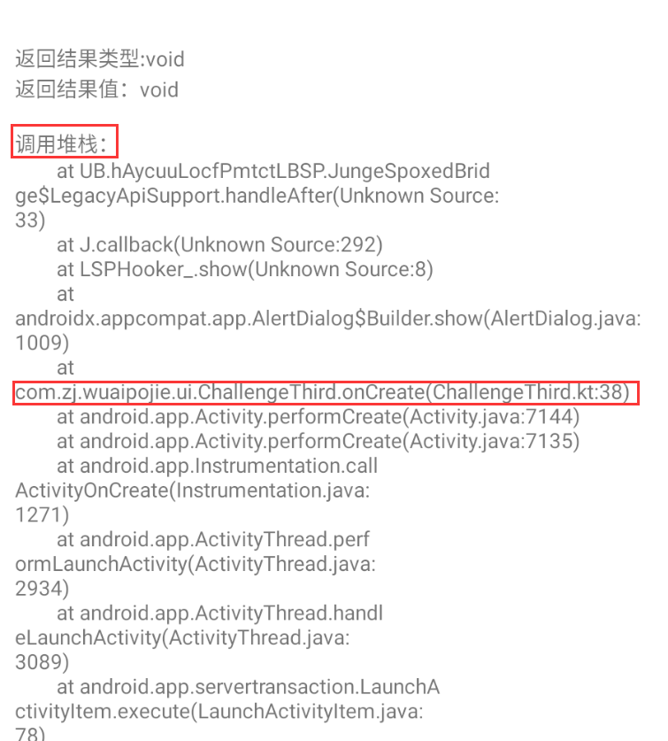

# 安卓逆向

[TOC]

## 0x1. 环境准备

参考文章：

* [适用于几乎所有安卓模拟器(7+)安装magisk的教程-简单无脑向](https://www.52pojie.cn/thread-1583586-1-1.html)
* [《安卓逆向这档事》一、模拟器环境搭建](https://www.52pojie.cn/thread-1695141-1-1.html)

所需环境：

* 雷电模拟器（需要开启Root权限）
* [Magisk](https://github.com/topjohnwu/Magisk/releases) （在雷电9上需要安装Magisk Delta版本）
  * **MagiskSU**：为应用程序提供 root 访问权限
  * **Magisk 模块**：通过安装模块修改只读分区
  * **MagiskHide**：从根检测 / 系统完整性检查中隐藏 Magisk(Shamiko)
  * **MagiskBoot** : 最完整的安卓启动镜像解包和重新打包工具
* [LSPosed](https://github.com/LSPosed/LSPosed/releases) （在 Magisk 重安装）

### 0x2. 初始Smali语法

准备环境：

* Jadx，电脑端APK逆向
* 核心破解APK：方便开发者去除系统APK签名验证

样例代码：

```java
.method private static final onCreate$lambda-2(Lkotlin/jvm/internal/Ref$IntRef;Lcom/zj/wuaipojie/ui/ChallengeSecond;Landroid/widget/ImageView;Landroid/widget/ImageView;Landroid/widget/ImageView;Landroid/view/View;)Z
    .registers 7

    .line 33
    iget p0, p0, Lkotlin/jvm/internal/Ref$IntRef;->element:I

    const/4 p5, 0x1

    const/16 v0, 0xa

    if-ge p0, v0, :cond_15
```

* `Z`：方法名後的符號，Z 表示返回值是 boolean 類型。
* `.registers` 表示寄存器的數量，一般不需要改動，如果需要改動代碼需要保證該數量大於所使用的數量。
* `v0 / v1 / ...`: 表示本地寄存器
* `p0 / p1 / ...`: 表示函數參數，非靜態方法中的 `p0` 表示 `this`, 靜態方法中表示第一個參數。

### 0x3. 去广告

#### a. Activity去广告

**熟悉Activity的生命周期**

* `OnCreate`：当创建的时候的回调
* `OnResume`：返回该Activity或者从后台变成前台时候的回调。

大致广告页的启动流程：启动Activity->广告Activity->主页Activity

优化思路：

1. 修改加载时间

   * 使用 MT 管理器的Activity记录器
   * 找到对应的广告 Activity 全限定类名
   * 根据全限定类名找到对应类文件，将延时时间修改为0

2. Activity切换定位，直接修改XML文件（一般不推荐）

   Activity的信息全部保存在 `AndroidManifest.xml`文件中：

   ```xml
   <activity
             android:label="@7F10001B"
             <-- 修改此处的名称即可-->
             android:name="com.zj.wuaipojie.ui.MainActivity"
             android:exported="true">
       <intent-filter>
           <action android:name="android.intent.action.MAIN" />
           <category android:name="android.intent.category.LAUNCHER" />
       </intent-filter>
   </activity>
   ```

3. 修改Intent的Activity类名

   * 首先获取该Activity的Smali代码类名：

     

     比如：`Lcom/zj/wuaipojie/ui/AdActivity;`

   * 在代码中搜索：

     

#### b. Fragment组件弹窗

比如强制更新、广告等。

思路：

* 修改XML中的version code

* Hook弹窗+修改 dex 弹窗代码（使用算法助手开启弹窗定位）

  1. 首先需要在 LSPosed 框架中开启算法助手的权限，并且开启算法助手想要调试的程序

     

  2. 打开弹窗定位

     

  3. 开启应用，查看日志中的调用堆栈

     

     

  4. 找到项目类路径下的代码，在MT中搜索对应的方法名定位到具体的代码，注释即可

* 图片遮挡修改：

  1. 首先使用开发者助手抓取APP的布局信息
  2. 定位到具体的组件ID
  3. 在MT中使用**XML搜索**的十六进制对应的**资源ID**
  4. 将宽度和高度改为0即可 / 或者将组件设置为隐形 `android:visibility="gone"`

* 抓包修改响应体