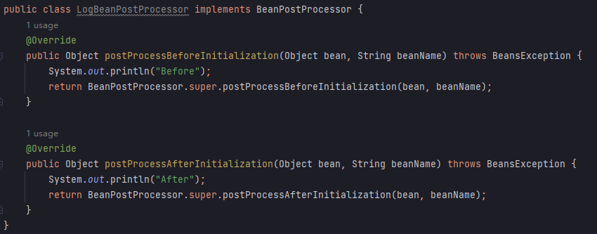

# 深入理解Spring

[TOC]

Start: 2023/01/16-2023/01/19

Video: [BV1Ft4y1g7Fb](https://www.bilibili.com/video/BV1Ft4y1g7Fb)

## 0x1. 初步

### 1. 为什么使用 Spring

当对于业务进行需求扩展的时候，比如将数据库从MySQL改为psql，不得不修改以前的代码，从而导致破坏以前代码的逻辑，从而需要重新进行测试CICD等流程，违反了OCP开闭原则（对扩展开放，对修改关闭）和DIP依赖反转原则（面向抽象编程）。

```java
class UserService {
    // UserDao 是接口，后面不 new 具体实现类
    private UserDao userDao;
}
```

但是 `userDao` 为 null，程序无法正常运行。就需要**控制反转**(IoC)进行处理，即不在程序中采用硬编码的方式创建方式和维护对象之间关系。

而 Spring 框架实现了控制反转的编程思想，**依赖注入**(DI)就是控制反转中十分著名的实现方式之一。

依赖注入有两种实现方式：Set注入和构造注入方式

```java
class UserService {
    // UserDao 是接口，后面不 new 具体实现类
    private UserDao userDao;
    
    // 构造方法注入
    UserService(UserDao userDao) {
        this.userDao = userDao;
    }
    
    // Set 注入
    public setUserDao(UserDao userDao) {
        this.userDao = userDao;
    }
}
```

### 2. Spring简介

Spring 含有 8 大模块，并且是非侵入性的（不依赖其他框架）。

Spring 也是一个对象容器，在 Spring 中对象可以称为 Bean，Spring 包含并且管理对象的配置和生命周期，可以创建单个或者多个的实例。

添加依赖：

```xml
<dependency>
    <groupId>org.springframework</groupId>
    <artifactId>spring-context</artifactId>
    <version>6.0.4</version>
</dependency>
```

在 `resources` 目录下创建一个 bean 的xml文件夹，开始配置 bean：

```xml
<?xml version="1.0" encoding="UTF-8"?>
<beans xmlns="http://www.springframework.org/schema/beans"
       xmlns:xsi="http://www.w3.org/2001/XMLSchema-instance"
       xsi:schemaLocation="http://www.springframework.org/schema/beans http://www.springframework.org/schema/beans/spring-beans.xsd">
    <bean id="userBean" class="com.yz.beans.User"/>
</beans>
```

其中 bean 有两个重要的属性：`id` 和 `class`，`id` 是 bean 的唯一标识符，`class` 是 bean 的类名。

通过 xml 文件创建 bean 对象并且使用：

1. 首先需要创建 spring 容器，通过创建 xml 对应的对象 `ClassPathXmlApplicationContext` 并且指定配置文件在资源目录下的路径
2. 使用 `getBean` 方法获取配置文件中的 id 得到对象。

```java
public void testA() {
    // 1. 首先需要创建容器，启动 spring
    ApplicationContext context = new ClassPathXmlApplicationContext("spring.xml");
    // 2. 获取对象
    Object userBean = context.getBean("userBean");
    System.out.println(userBean);
}
```

Spring 是如何创建对象的？ Spring 是通过反射机制来创建对象的，并且 Bean 的存储是存放在一个 Map 集合中，key 即为 id。

也可以创建 JDK 自带的对象：

```xml
<bean id="date" class="java.util.Date"/>
```

对应 Java 代码：

```java
public void testDate() {
    ApplicationContext ctx = new ClassPathXmlApplicationContext("spring.xml");
    Date date = ctx.getBean("date", Date.class);
    System.out.println(date);
}
```

如果对应 id 不存在，程序直接报错。

`ApplicationContext` 接口的父接口是 `BeanFactory`，是一个能生产 bean 的工厂对象，Spring 的 IoC 容器底层使用了工厂模式，底层实现就是 XML 解析 + 工厂模式 + 反射机制。

Spring 在初始化容器的时候就会创建对象，而不是在获取对象的时候。

## 0x2 控制反转 IoC

### 1. 简单注入

🔵注入方式：

1. set 注入，必须要有 set 方法

   对象文件：

   ```java
   public class User {
       int age;
       String name;
       Dog dog;
   
       public void setDog(Dog dog) {
           this.dog = dog;
       }
   
       public void setAge(int age) {
           this.age = age;
       }
   
       public void setName(String name) {
           this.name = name;
       }
   }
   ```

   xml 文件：

   ```xml
   <bean id="userBean" class="com.yz.beans.User">
       <property name="age" value="12"/>
       <property name="name" value="小萌"/>
       <property name="dog" ref="dogBean"/>
   </bean>
   ```

2. 构造注入，必须要有对应的构造方法

   索引和参数必须对应

   ```xml
   <bean id="userJackBean" class="com.yz.beans.User">
       <constructor-arg index="0" value="22"/>
       <constructor-arg index="1" value="Jack"/>
       <constructor-arg index="2" ref="dogBean"/>
   </bean>
   ```

对象类型使用 `ref` 进行引用，简答类型使用 `value` 进行设置。

Spring 注入中的简单类型：基本类型+包装类(`int`, `Integer`)、枚举、CharSequence、Number类、Date、Temporal、URI、URL、Locale、Class类。

🔵数组注入

简单类型数组注入：

```xml
<!-- String[] -->
<bean id="dogBean" class="com.yz.beans.Dog">
    <property name="actions">
        <array>
            <value>eat</value>
            <value>shit</value>
            <value>run</value>
        </array>
    </property>
</bean>
```

复杂类型注入：

```xml
<!-- Person[] -->
<bean id="dogBean" class="com.yz.beans.Dog">
    <property name="actions">
        <array>
            <ref bean="b1"/>
            <ref bean="b2"/>
            <ref bean="b3"/>
        </array>
    </property>
</bean>
```

List / Set 注入：将 `array` 标签改为 `list` / `set` 即可

```xml
<!-- List / Set -->
<bean id="dogBean" class="com.yz.beans.Dog">
    <property name="actions">
        <list>
            <value>eat</value>
            <value>shit</value>
            <value>run</value>
        <list>
    </property>
</bean>
```

Map 注入：

```xml
<!-- Map -->
<bean id="dogBean" class="com.yz.beans.Dog">
    <property name="actions">
        <map>
            <entry key="k" value="v"/>
            <entry key-ref="k" value-ref="v"/>
        </map>
    </property>
</bean>
```

Properties 注入：

```xml
<!-- Map -->
<bean id="dogBean" class="com.yz.beans.Dog">
    <property name="actions">
        <props>
            <prop key="k">v</prop>
        </props>
    </property>
</bean>
```

null 和 空字符串注入：配置中不给属性就是 `null`，或者使用 `<null/>` 标签

```xml
<property name="age">
	<null/>
</property>
<!-- 空字符串 -->
<property name="name" value="">
```

### 2. 命名空间注入

🔵p 命名空间注入：基于 set 方法

在 beans 标签属性中添加 `xmlns:p="http://www.springframework.org/schema/p"`

```xml
<bean id="dogBean" class="com.yz.beans.Dog"/>
<bean id="userBean" class="com.yz.beans.User" p:age="18" p:dog-ref="dogBean"/>
```

🔵c 命名空间注入：

基于构造方法，用于简化构造注入

在 beans 标签属性中添加 `xmlns:c="http://www.springframework.org/schema/c"`

```xml
<bean id="dogBean" class="com.yz.beans.Dog"/>
<bean id="userBean" class="com.yz.beans.User" c:_0 ="18" c:dog-ref="dogBean"/>
```

### 3. 自动装配

> 基于 set 方法

Spring 还可以完成自动化注入即自动装配(autowire)，可以根据名称进行装配，也可以根据类名进行装配。

ByName：被装配的 bean 必须和 set 后的名字一致

```xml
<bean id="dog" class="com.yz.beans.Dog"/>
<bean id="userBean" class="com.yz.beans.User" autowire="byName">
    <!-- 简单类型需要指定 -->
    <property name="age">18</property>
    <!-- 复杂类型 Dog 则根据 autowire 自动绑定 -->
</bean>
```

ByType 根据类型进行注入：id 可以任意指定，只要存在对应类型的 bean 即可进行绑定

```xml
<bean id="dog111" class="com.yz.beans.Dog"/>
<bean id="userBean" class="com.yz.beans.User" autowire="byType">
    <!-- 简单类型需要指定 -->
    <property name="age">18</property>
    <!-- 复杂类型 Dog 则根据 autowire 自动绑定 -->
</bean>
```

但是 ByType 的对应类型的实例**只能有一个**！

### 4. 多配置文件

为了防止配置文件过大，读取时间过长。

一般分为主配置文件和子配置文件。主配置文件是用来包含其他配置文件，不定义对象，用于导入其他配置文件。

```
配置文件目录
ba04
	spring-total.xml
	spring-student.xml
	spring-school.xml
```

student和schoold的xml文件只保存自己的bean，类似上述的配置。

在total主配置文件中进行配置：

```xml
<beans xmlns="http://www.springframework.org/schema/beans"
       xmlns:xsi="http://www.w3.org/2001/XMLSchema-instance"
       xsi:schemaLocation="http://www.springframework.org/schema/beans http://www.springframework.org/schema/beans/spring-beans.xsd">
    <!--   classpath需要在target目录下的classes进行寻找 -->

    <import resource="classpath:ba04/spring-student.xml"/>
    <import resource="classpath:ba04/spring-school.xml"/>
    
    <!-- 可以进行包含关系进行通配符匹配 -->
    <!-- 但是主配置文件不能与这个文件名匹配，比如不可以是spring-total.xml  -->
    <import resource="classpath:ba04/spring-*.xml"/>
</beans>
```

### 5. 引入 properties 文件

在 beans 属性中添加 `xmlns:context="http://www.springframework.org/schema/context"`，以及 `http://www.springframework.org/schema/context http://www.springframework.org/schema/context/spring-context.xsd`

使用 `context:property-placeholder` 引入对应的 properties 文件，

```properties
# user.properties
user.habit=aka.dropilin
user.age=22
```

xml 文件为：

```xml
<beans xmlns="http://www.springframework.org/schema/beans"
       xmlns:xsi="http://www.w3.org/2001/XMLSchema-instance"
       xmlns:context="http://www.springframework.org/schema/context"
       xsi:schemaLocation="http://www.springframework.org/schema/beans http://www.springframework.org/schema/beans/spring-beans.xsd
                            http://www.springframework.org/schema/context http://www.springframework.org/schema/context/spring-context.xsd">
    <context:property-placeholder location="user.properties"/>
    <bean id="u" class="com.yz.beans.User">
        <property name="name" value="${user.habit}"/>
        <property name="age" value="${user.age}"/>
    </bean>

</beans>
```

### 6. IoC 注解

> 注解的方式要比 XML 的方式更受欢迎

🔵原理：即使用反射机制来读取注解的值。

自定义注解：

```java
@Target({ElementType.FIELD, ElementType.TYPE})
@Retention(RetentionPolicy.RUNTIME)
public @interface Meng {
    String value();
}
```

测试代码：

```java
public void testA() throws Exception {
    Class<?> clazz = Class.forName("org.yz.beans.User");
    if (clazz.isAnnotationPresent(Meng.class)) {
        Meng annotation = clazz.getAnnotation(Meng.class);
        String value = annotation.value();
        System.out.println(value);
    }
}
```

通过 `isAnnotationPresent` 方法来获取对应的注解是否存在，如果存在则获取注解，并且获取对应的值。

那怎么对所有的源码文件进行扫描注解？知道要扫描的包，如果有注解则创建对象

1. 根据 `ClassLoader` 的 `getSystemClassLoader()` 方法获取项目根目录
2. 将项目根目录和包名进行拼接得到对应扫描包下的所有文件
3. 然后逐个扫描所有文件即可

🔵声明 Bean 的注解

主要包括 4 个注解：这四个作用都是一样的，后三个只是前三个的别名，用于增强可读性

* `@Component`：用在普通类的上面
* `@Controller`：放在控制器的上面
* `@Service`：放在service的实现类上，创建service对象
* `@Repository`：（用在持久层类上），放在dao层实现类上，表示创建dao对象

如果将 Value 只置空的话默认值是类名小写。

要求：需要为 Spring 指定扫描哪些包下的文件

```xml
<?xml version="1.0" encoding="UTF-8"?>
<beans xmlns="http://www.springframework.org/schema/beans"
       xmlns:xsi="http://www.w3.org/2001/XMLSchema-instance"
       xmlns:context="http://www.springframework.org/schema/context"
       xsi:schemaLocation="http://www.springframework.org/schema/beans http://www.springframework.org/schema/beans/spring-beans.xsd http://www.springframework.org/schema/context https://www.springframework.org/schema/context/spring-context.xsd">

    <!--找到包和子包中所有的注解，按照注解创建对象，给属性赋值-->
    <context:component-scan base-package="com.yz.ba01"/>
    <!--导入多个包，用;或者,来分割多个包名-->
    <context:component-scan base-package="com.yz.ba02;com.yz.ba03,com.yz.ba04"/>
    <!--直接指定父包名，会扫描子包-->
    <context:component-scan base-package="com.yz"/>

</beans>
```

🔵选择实例化 Bean 方式

* 白名单模式：

  比如说只对 `@Service` 标注的类进行实例化

  ```xml
  <context:component-scan base-package="com.yz" user-default-filters="false">
      <context:include-filter type="annotation" expression="org.springframeword.stereotype.Service"/>
  </context:component-scan>
  ```

  设置 `user-default-filters` 为 false 之后，所有的标注都不会被实例化，在使用 include-filter 将 Service 添加到白名单之后，只会有 `@Service` 注解生效。

* 黑名单模式：

  黑名单则设置 `user-default-filters` 为 true，使用 exclude-filter 标签进行过滤。

  ```xml
  <context:exclude-filter type="annotation" expression="org.springframeword.stereotype.Service"/>
  ```

🔵负责为属性注入的注解：

* `@Value`：用于注入简单类型的属性，并且可以不写 set 方法。如果写 set 方法，注解也可以写在 set 方法上。并且也可以写在构造方法上。

  ```java
  @Component
  public class User {
      String name;
  
      public User(@Value("John") String name) {
          this.name = name;
      }
  }
  ```

* `@Autowired`：默认是 byType，如果是 byName 的话需要配合 `@Qualifier` 使用。

  ```java
  @Autowired
  @Qualifier("daoForMySQL")
  ```

* `@Resource`：（**推荐使用**）这个是 JDK 扩展包中的注解，默认装配只 byName，未指定 name 的时候使用属性名作为 name，未找到 name 使用 byType。

  对于 JDK8 以上其使用需要引入依赖：

  ```xml
  <dependency>
      <groupId>jakarta.annotation</groupId>
      <artifactId>jakarta.annotation-api</artifactId>
      <version>2.1.1</version>
  </dependency>
  ```

  对于 Spring5 改为将 `jakarta` 改为 `javax` 即可。

🔵全注解开发

对于注解还需要写 `component-scan` xml 标签，可以使用全注解开发：

```java
@Configuration
@ComponentScan({"org.yz"})
@PropertySource({"test.properties"})
public class SpringConfig {
}
```

上述配置了扫描的包和对应的 Properties 文件案例，对应 Bean 代码为：

```java
@Component
public class User {
    @Value("${dog.name}")
    String name;

    public User() {
    }
}
```

在使用这个类名配置的时候创建 Spring 容器时候需要使用类 `AnnotationConfigApplicationContext`：

```java
public void testB() {
    ApplicationContext ac = new AnnotationConfigApplicationContext(SpringConfig.class);
    Object user = ac.getBean("user");
    System.out.println(user);
}
```

---

为了防止多个 Bean 存放在同一个配置文件中，Spring 支持引入配置来防止代码混乱：

```java
@Configuration
public class ConfigA {

    @Bean
    public A a() {
        return new A();
    }
}

@Configuration
@Import(ConfigA.class)
public class ConfigB {

    @Bean
    public B b() {
        return new B();
    }
}

```

🔵其他注解

* `@Bean`：手动将创建的对象添加到 Spring 中 IoC 容器管理

  ```java
  @Bean
  public JdbcTemplate jdbcTemplate(DataSource source) {
      return new JdbcTemplate(source);
  }
  
  @Bean
  public DruidDataSource druidDataSource() {
      DruidDataSource dataSource = new DruidDataSource();
      dataSource.setDriverClassName("com.mysql.cj.jdbc.Driver");
      dataSource.setUsername("root");
      dataSource.setPassword("root");
      dataSource.setUrl("jdbc:mysql://172.29.97.205:3306/test");
      return dataSource;
  }
  
  @Bean
  public DataSourceTransactionManager dataSourceTransactionManager(DataSource dataSource) {
      return new DataSourceTransactionManager(dataSource);
  }
  ```

  对于 `@Bean` 修饰的方法对应 bean 名称即为方法名，如果 bean 出现在方法参数的时候会自动 Autowire。

* `@Lazy`：懒加载 Bean 只有在使用的时候才会创建对象。如果当前 bean 如果被其他 bean 所依赖，那么会立即加载。

  ```java
  @Component
  @Lazy
  public class User {
  }
  ```

* `@PostConstruct` 和 `@PreDestroy`：用于 Bean 声明周期 `init-method` 和 `destroy-method` 执行的操作。或者直接在 `@Bean` 中设置。

## 0x3 Beans 对象

### 1. Bean 作用域

使用两个 `getBean` 来获取对象

```java
ApplicationContext ac = new ClassPathXmlApplicationContext("spring-scope.xml");
User u = ac.getBean("user", User.class);
User u2 = ac.getBean("user", User.class);
System.out.println(u);
System.out.println(u2);
```

输出：

```
com.yz.beans.User@3eb738bb
com.yz.beans.User@3eb738bb
```

两个获取的都是同一个对象。

Spring 默认情况下是单例的，在 Spring 初始化的时候就初始化了，每次返回的都是同一个对象。

当将 `scope` 设置为 `prototype` 就可以进行原型对象创建多例，默认为 `singleton` 为单例，在 Spring 初始化的时候不会进行创建对象，只有在使用的时候才会进行创建。

> scope 还支持 `request` 和 `session` 等的值，当为 web 项目引入 springmvc 的时候就可以使用
>
> * request：一次请求中对应一个 bean
> * session：一次会话对应一个 bean
> * application：一个应用对应一个 bean
> * websocket：一个 ws 生命周期对应一个 bean

```xml
<bean id="user" class="com.yz.beans.User" scope="prototype">
    <property name="name" value="小俊"/>
    <property name="age" value="18"/>
</bean>
```

输出：

```
com.yz.beans.User@31190526
com.yz.beans.User@662ac478
```

🔵自定义 scope

还支持自定义 scope，这里演示一个线程对应一个 bean

```xml
<bean class="org.springframework.beans.factory.config.CustomScopeConfigurer">
    <property name="scopes">
        <!--   将对应的 threadScope 注册到 scope 中   -->
        <map>
            <entry key="threadScope">
                <bean class="org.springframework.context.support.SimpleThreadScope"/>
            </entry>
        </map>
    </property>
</bean>

<bean id="user" class="com.yz.beans.User" scope="threadScope">
    <property name="name" value="小俊"/>
    <property name="age" value="18"/>
</bean>
```

对应的 Java 代码：

```java
public void testA() {
    ApplicationContext ac = new ClassPathXmlApplicationContext("spring-scope.xml");
    System.out.println(ac.getBean("user", User.class));
    System.out.println(ac.getBean("user", User.class));
    new Thread(() -> {
        System.out.println(ac.getBean("user", User.class));
        System.out.println(ac.getBean("user", User.class));
    }).start();
}
```

输出：

```
com.yz.beans.User@55b0dcab
com.yz.beans.User@55b0dcab
com.yz.beans.User@6ec5e77d
com.yz.beans.User@6ec5e77d
```

### 2. Bean 实例化方式

1. 通过构造方法实例化

   在进行 Spring 上下文加载的时候使用无参构造方法进行实例化对象。

2. 通过简单工厂模式实例化（不太好）

   ```xml
   <bean id="uf" class="com.yz.beans.UserFactory" factory-method="get"/>
   ```

   通过简单工厂模式类来进行创建对象，`factory-method` 中填写对应的**静态**方法。每次获取的对象仍是同一个对象，需要另外写一个工厂类来进行实例化。

   ```
   com.yz.beans.User@3c9754d8
   com.yz.beans.User@3c9754d8
   ```

3. 通过具体工厂模式进行实例化（不太好）

   ```xml
   <bean id="userFactory" class="com.yz.beans.UserFactory"/>
   <bean id="user" factory-bean="userFactory" factory-method="get"/>
   ```

   通过指定具体工厂类和其非静态的创建实例方法来获取 bean

4. 通过 FactoryBean 接口进行实例化

   第二种和第三种其中的方法都是需要我们自己实现的，这一种需要继承 FactoryBean 接口即可，相当于对于前两种的简化版本。

   ```java
   public class DogFactory implements FactoryBean<Dog> {
       @Override
       public Dog getObject() throws Exception {
           return new Dog();
       }
   
       @Override
       public Class<?> getObjectType() {
           return Dog.class;
       }
   
       // 用于指定创建对象是否是单例
       @Override
       public boolean isSingleton() {
           return FactoryBean.super.isSingleton();
       }
   }
   ```

   xml 配置：

   ```xml
   <bean id="dog" class="com.yz.beans.DogFactory"/>
   ```

   只需要指定工厂类就可以创建具体对象。

> BeanFactory 和 FactoryBean 的区别：
>
> * BeanFactory 是 Bean 的工厂，是 Spring IoC 的顶级对象，负责创建管理 Bean 对象
> * FactoryBean 是一个 Bean，能够辅助 Spring 中实例化其他 Bean 对象。

### 3. Bean 生命周期 ※

用于了解 Bean 什么时候创建、销毁以及两者前后做了什么事情。具体生命周期研究可以在 `AbstractAutowireCapableBeanFactory` 中的 `doCreateBean()` 方法进行查看。

Bean 的生命周期：

1. 实例化 Bean （调用无参数构造方法）

2. Bean 的属性赋值（调用 set 方法）

3. 检查 Bean 是否实现 `Aware` 的相关接口 `BeanNameAware` (用于传递 bean 名称)、`BeanClassLoaderAware`(用于传递 bean 类加载器)、`BeanFactoryAware` (用于传递 Bean 工厂)，并设置相关依赖。

4. 初始化 Bean 之前（需要使用 `BeanPostProcessor` 的 `before` 方法）

   

   这个 BeanPostProcessor 会对整个 xml 文件中的对象起作用

5. 检查 Bean 是否实现 `InitializingBean` 方法，并且调用对应接口方法

6. 初始化 Bean（调用 bean 的 init 方法，需要自己配），在 xml 中使用 `init-method` 指定初始化方法名称

7. 初始化 Bean 之后（需要使用 `BeanPostProcessor` 的 `after` 方法）

8. 使用 Bean

9. 检查 Bean 是否实现 `DisposableBean` 接口，并且调用相关方法。

10. 销毁 Bean（调用 bean 的 destroy 方法，需要自己配），在 xml 中使用 `init-method` 指定销毁方法名称

```xml
<!--  BeanPostProcessor  -->
<bean class="com.yz.beans.LogBeanPostProcessor"/>
<bean id="u" class="com.yz.beans.User" init-method="initBean" destroy-method="destroyBean"/>
```

> 对于 Bean 的作用域不同，其生命周期也不同。Spring 只对于 singleton 的对象进行完整的生命周期管理，对于其他类型的作用域，Spring 只进行创建初始化管理，其他就不管理了。

对于自己创建的对象，如何纳入 Spring 进行管辖？

```java
@Test
public void testD() {
    User user = new User();
    System.out.println(user);
    DefaultListableBeanFactory factory = new DefaultListableBeanFactory();
    factory.registerSingleton("user", user);
    System.out.println(factory.getBean("user", User.class));
}
```

### 4. Bean 循环依赖问题

A依赖B，B依赖A就会产生循环依赖问题。

比如对于 Set 注入：

```xml
<bean id="a" class="com.yz.beans.A">
    <property name="b" ref="b"/>
</bean>

<bean id="b" class="com.yz.beans.B">
    <property name="a" ref="a"/>
</bean>
```

由于两者**都是 singleton 模式**下，在 Spring 容器加载的时候就将对象创建进行 Bean 实例化，当 Bean 创建完毕后曝光，就是会将所有实例化的 Bean 存到缓存中，再对属性进行赋值。对象实例化和对象属性赋值是分两阶段进行的。

如果**都**是在 prototype 情况下会报错 `BeanCurrentlyInCreationException`，如果其中任意一个是 singleton 的就不会异常。

> 对于构造方法注入下，由于需要有对象才能进行赋值，始终停留在 Bean 实例化阶段，因此循环依赖会依然存在，无法解决。

### 5. IoC反射原理

调用方法四要素：调用对象，调用方法，参数和返回值。

```java
public void testA() throws Exception {
    // 获取类
    Class<?> clazz = Class.forName("com.yz.reflect.SomeService");
    // 要素1：对象
    Object o = clazz.newInstance();
    // 要素2：方法
    Method doSome = clazz.getDeclaredMethod("doSome", String.class, int.class);
    // 要素3+4：参数和返回值
    Object ret = doSome.invoke(o, "ok", 123);
    System.out.println(ret);
}
```

通过反射机制可以获取方法名，属性以及属性的类型。

## 0x4 AOP 切面编程

增加功能就是切面，一般都是非业务功能，比如日志、事务、安全等**交叉业务**。

### 1. JDK/CGLIB动态代理

当对象需要保护或者需要对某个对象进行功能增强的时候就需要使用代理来进行。

代理模式分为静态代理和动态代理。

静态代理的缺点就是需要对每个接口都需要进行手动添加功能，对于重复的代码无法解决。动态代理是添加了字节码生成技术，在不修改原有代码的基础上，增加功能，减少重复代码，专注于业务逻辑。动态代理分为 JDK 动态代理、 CGLIB 动态代理和 Javassist 动态代理技术。

> 但是 JDK 动态代理只能代理接口。CGLIB 可以代理接口和类，并且使用**继承**的关系来完成动态代理，底层效率更高。

🔵JDK动态代理

首先需要实现 Proxy 增强的功能：实现`InvocationHandler`的类：

```java
public class MyInvocationHandler implements InvocationHandler {

    private Object target;  // SomeServiceImpl类

    public MyInvocationHandler(Object target) {	// 使用构造方法来接受对应的类
        this.target = target;
    }

    @Override
    public Object invoke(Object proxy, Method method, Object[] args) throws Throwable {
        // 通过代理对象执行方法的时候，会调用这个invoke
        Object res = null;
        // 在目标方法执行前的动作
        System.out.println("Time:" + new Date());
        // 执行目标类的方法，通过这个method实现
        method.invoke(target, args);
        // 在目标方法执行后的动作
        System.out.println("Status: OK.");
        // 返回目标方法的执行结果
        System.out.println(method.getName());
        return res;
    }
}
```

在执行的时候借助proxy创建实例并且执行方法`Proxy.newProxyInstance`即可：

```java
public class Main {
    public static void main(String[] args) {
        // 创建目标
        SomeService target = new SomeServiceImpl();
        // 创建InvovationHandler对象
        InvocationHandler handler = new MyInvocationHandler(target);
        // 重新生成SomeService对象，proxy创建代理
        SomeService proxy = (SomeService) Proxy.newProxyInstance(target.getClass().getClassLoader(),
                target.getClass().getInterfaces(), handler);
        // 执行方法
        proxy.DoOther();
    }
}
```

新需求：如果只需要给`DoSome()`方法添加上面两个业务，其他的方法不需要添加。

只需要在`invoke`函数中添加一个判断方法名的语句即可：

```java
@Override
public Object invoke(Object proxy, Method method, Object[] args) throws Throwable {
    // 通过代理对象执行方法的时候，会调用这个invoke
    Object res = null;
    String methodName = method.getName();
    if ("DoSome".equals(methodName)){
        // 在目标方法执行前的动作
        System.out.println("Time:" + new Date());
        // 执行目标类的方法，通过这个method实现
        method.invoke(target, args);
        // 在目标方法执行后的动作
        System.out.println("Status: OK.");
        // 返回目标方法的执行结果
    }
    return res;
}
```

🔵CGLIB动态代理

首先需要引入依赖：

```xml
<dependency>
    <groupId>cglib</groupId>
    <artifactId>cglib</artifactId>
    <version>3.3.0</version>
</dependency>
```

对于高版本 JDK 需要对运行环境进行配置（JDK17失效，直接使用 Spring 的 AOP 吧）：

* VM Options:` --add-opens java.base/java.lang=ALL-UNNAMED`
* Program Parameters: `--add-opens java.base/sun.net.util=ALL-UNNAMED`

需要为目标类添加增强代码：

```java
public class LogInterceptor implements MethodInterceptor {
    public Object intercept(Object o, Method method, Object[] objects, MethodProxy methodProxy) throws Throwable {
        System.out.println("pre...");
        Object ret = methodProxy.invoke(o, objects);
        System.out.println("after...");
        return ret;
    }
}
```

使用：

```java
public static void main(String[] args) {
    Enhancer enhancer = new Enhancer();
    // 2. 将需要增强的目标类传给 enhancer
    enhancer.setSuperclass(Cock.class);
    // 3. 设置回调
    enhancer.setCallback(new LogInterceptor());
    // 4. 生成 proxy 对象
    Cock cock = (Cock) enhancer.create();
    cock.howl();
}
```

### 2. AOP简介

AOP 有七个要点：

* 连接点 joinpoint：插入其他业务代码的位置，比如方法执行前后，异常抛出后
* 切点 pointcut：目标方法
* 通知 advice：即具体代码，分为前/后置通知、环绕通知、异常代码(catch)、最终通知(finally)。
* 切面 Aspect：切点 + 通知
* 其他 ....

切面表达式： 用于匹配方法的表达式

```java
execution(modifiers? ret-type declaring-type?name(param) throws?)
// execution(访问权限， 方法返回值， 方法声明（参数） 异常类型)
```

* modifiers：表示访问权限类型，不写的默认表示 4 中权限(public, private, protected, default)
* **ret-type **：表示返回值类型，必需
* declaring-type：表示全限定类名，可选。两个点 `..` 表示当前包和子包下的所有类
* **name(param)**：表示函数名（参数类型和个数），必需。name可以使用通配符，比如 `set*`，param 为 `()` 表示无参方法，`(..)` 表示任意方法，`(*)` 表示只有一个参数的方法，`(*, String)` 表示第一个参数随意，第二个参数是 String 的方法。
* throws：表示抛出异常的类型
* ?表示可选部分

### 3. Spring AOP

通常结合 AspectJ 来进行使用，首先添加依赖：

```xml
<dependency>
    <groupId>org.springframework</groupId>
    <artifactId>spring-aspects</artifactId>
    <version>5.3.9</version>
</dependency>
```

在 Spring Config 上需要设置 AspectJ 自动扫描 `@EnableAspectJAutoProxy`：

```java
@Configuration
@ComponentScan({"org.yz"})
@EnableAspectJAutoProxy
public class SpringConfig {
}
```

添加切点代码：切点表达式这家拍卖行 `org.yz.beans..*` 表示当前包和子包下所有类所有方法都添加前置通知。并且需要使用 `@Aspect` 标注其是一个切面类。

```java
@Component
@Aspect
public class LogAspect {
    @Before("execution(* org.yz.beans..*(..))")
    public void before() {
        System.out.println("前置通知");
    }
}
```

🔵其他通知：

* 前置通知 `@Before` 

* 后置通知 `@AfterReturning`

* 环绕通知 `@Around`，在前置之前，后置之后。

  >可以在目标方法前和后面都可以使用，能够修改目标方法的执行结果。相当于JDK动态代理
  >
  >参数：ProceedingJoinPoint，父类是JoinPoint。等同于JDK动态代理的Method
  >
  >功能强大，不只能修改引用类型，还能改数值类型。

  实例代码：

  ```java
  @Around("execution(* com.yz.service.*..DoAround())")
  public Object myAround(JoinPoint jp) throws Throwable {
  
      Object o = null;
      System.out.println("Before");
      o = jp.proceed();  // 相当 method.invoke();，并且用o接受目标方法的返回值
      System.out.println("After");
      return 11;	// 返回11
  }
  
  // Do Around 的值，返回值为0
  @Override
  public int DoAround() {
      System.out.println("=========DoAround========");
      return 0;
  }
  ```

  测试代码：

  ```java
  @Test
  public void test03(){
      String config = "ac.xml";
      ApplicationContext ac = new ClassPathXmlApplicationContext(config);
      SomeService proxy = (SomeService) ac.getBean("SomeService");
      Object u = proxy.DoAround();
      System.out.println("得到返回值"+u);	// 将目标方法的返回值改为 11
  }
  /*
  Before
  =========DoAround========
  After
  得到返回值11
  */
  ```

* 异常通知(catch) `@AfterThrowing`

  ```java
  @AfterThrowing(value = "execution(* com.yz.service.*..DoAround())", throwing = "ex")
  public void myAfterThrowing(Exception ex){
      System.out.println("发生异常，发送邮件");
  }
  ```

* 最终通知(finally) `@After`

🔵其他注解：

* `@Order(int)`：用于多个切点使用在同一个方法上的时候的优先级，数值越小优先级越高。

* `@Pointcut`：用于复用切点表达式

  ```java
  @Pointcut("execution(* com.yz.service.*..DoAfter())")
  public void mypt(){
      //无需代码
  }
  
  @After("mypt()")
  public void myAfter(){
      System.out.println("Job clear.");
  }
  ```

## 0x5 Spring事务

在一个业务中，通常是多条 DML 语句共同联合才能完成，这些必须全部成功整个事务才会成功，才能保证数据的安全。

### 1. JDBC template

将 `JdbcTemplate` 对象添加到 Spring 中进行管理：

```java
@Configuration
@ComponentScan("org.tx")
@EnableAspectJAutoProxy
//@Import({JdbcTemplate.class})
public class SpringConfig {

    @Bean
    public JdbcTemplate jdbcTemplate(DataSource source) {
        return new JdbcTemplate(source);
    }
}
```

测试结果：

```java
public void testApp() throws SQLException {
    AnnotationConfigApplicationContext ac = new AnnotationConfigApplicationContext(SpringConfig.class);
    JdbcTemplate jdbcTemplate = ac.getBean("jdbcTemplate", JdbcTemplate.class);
    // query
    String sql = "SELECT * FROM t_user";
    List<User> result = jdbcTemplate.query(sql, new BeanPropertyRowMapper<>(User.class));
    for (User user : result) {
        System.out.println(user);
    }
}
```

使用 Druid 连接池，就无需自己编写获取数据源，首先需要添加依赖。

```xml
<dependency>
    <groupId>com.alibaba</groupId>
    <artifactId>druid</artifactId>
    <version>1.2.6</version>
</dependency>
```

添加 Bean：

```java
@Bean
public DruidDataSource druidDataSource() {
    DruidDataSource dataSource = new DruidDataSource();
    dataSource.setDriverClassName("com.mysql.cj.jdbc.Driver");
    dataSource.setUsername("root");
    dataSource.setPassword("root");
    dataSource.setUrl("jdbc:mysql://localhost:3306/test");
    return dataSource;
}
```

### 2. Spring 声明式事务接口

其实现事务由两种方式：

* 编程式事务：即通过代码的方式来实现事务管理。（基本不用）
* 声明式事务：
  * 基于注解的方式
  * 基于 XML 的配置方式。

其中重要的是 `PlatformTransactionManager` 接口，其有两个实现：

* `DataSourceTransactionManager`：支持 jdbcTemplate、Mybatis等的事务管理
* `JtaTransactionManager`：支持分布式事务管理

首先需要使用注解 `@EnableTransactionManagement` 开启事务管理和创建事务管理器对象：

```java
@Configuration
@ComponentScan("org.tx")
@EnableAspectJAutoProxy
@EnableTransactionManagement
public class SpringConfig {

    @Resource
    private DataSource dataSource;

    @Bean
    public DruidDataSource druidDataSource() {
        DruidDataSource dataSource = new DruidDataSource();
        dataSource.setDriverClassName("com.mysql.cj.jdbc.Driver");
        dataSource.setUsername("root");
        dataSource.setPassword("root");
        dataSource.setUrl("jdbc:mysql://172.29.97.205:3306/test");
        return dataSource;
    }

    @Bean
    public DataSourceTransactionManager dataSourceTransactionManager() {
        return new DataSourceTransactionManager(dataSource);
    }
}
```

在对应的方法或者类上添加 `@Transactional` 注解开启事务，会自动提交和回滚。这个实现基于 AOP 。

```java
@Override
@Transactional
public void transfer(int aUser, int bUser, double money) {
    Account accountA = accountDao.selectByID(aUser);
    if (accountA.getBalance() < money) {
        throw new RuntimeException("Balance not sufficient.");
    }

    Account accountB = accountDao.selectByID(bUser);
    accountA.setBalance(accountA.getBalance() - money);
    accountB.setBalance(accountB.getBalance() + money);
    int cnt = accountDao.update(accountA);
    String s = null;	// 报错，会自动回滚
    s.trim();
    cnt += accountDao.update(accountB);
    if (cnt != 2) {
        throw new RuntimeException("Transfer failed.");
    }

}
```

### 3. Spring 事务属性

Spring 事务包含很多属性，重要的属性如下：

```java
public @interface Transactional {
    @AliasFor("transactionManager")
    String value() default "";

    @AliasFor("value")
    String transactionManager() default "";

    String[] label() default {};

    Propagation propagation() default Propagation.REQUIRED;

    Isolation isolation() default Isolation.DEFAULT;

    int timeout() default -1;

    String timeoutString() default "";

    boolean readOnly() default false;

    Class<? extends Throwable>[] rollbackFor() default {};

    String[] rollbackForClassName() default {};

    Class<? extends Throwable>[] noRollbackFor() default {};

    String[] noRollbackForClassName() default {};
}
```

1. `propagation`：传播行为，对于 `A()` 中调用了 `B()`，如果 B 中没有事务那么 B 是否需要纳入事务的管理？因此需要对于 B 的事务进行分情况处理
   * `REQUIRED`：支持当前事务，如果 B 中不存在事务则新创建一个事务，由则加入 A 的事务
   * `SUPPORTS`：有则加入 A 的事务，没有则不管
   * `MANDATORY`：有则加入，没有则抛出异常
   * `REQUIRES_NEW`：不管有无直接开启新事务，新事务和旧事务之间**不存在嵌套关系**，之前的事务会挂起
   * `NOT_SUPPORTED`：以非事务的方式运行，如果存在事务存在就挂起当前事务
   * `NEVER`：以非事务的方式运行，如果存在事务则派出异常
   * `NESTED`：如果当前正有一个事务正在运行，则 B 运行在一个嵌套事务中。被嵌套的事务可以独立于外层事务提交或回滚。如果外层事务不存在，和 REQUIRED 一样。

2. `isolation`：隔离级别

3. `timeout`：超时

   超时的定义：该事务中所有执行 DML 语句的时间没有在指定时间内完成的话作为超时。

   即最后一条 DML 语句之前的时间，之后业务代码的时间不会记录。

   ```java
   // 计入时间
   Thread.sleep(1000);
   accountDao.selectByID(aUser);
   // 不计入，因为之后没有 DML 语句
   Thread.sleep(1000);
   ```

4. `readOnly`：是否为只读事务，只允许 `SELECT` 语句

   可以启动 Spring 的优化策略，提高 SELECT 语句的执行效率。

5. `rollbackFor` 如果出现某种异常才回滚

   ```java
   @Transactional(rollbackFor = {RuntimeException.class})
   ```

   `noRollbackFor` 类似，即发生某种异常时候也不回滚。

## 0x6 Spring 工具

### 1. 资源读取

可以获取文件资源、类路径资源和网络资源

```java
Resource template = ctx.getResource("some/resource/path/myTemplate.txt");
Resource template = ctx.getResource("classpath:some/resource/path/myTemplate.txt");
Resource template = ctx.getResource("file:///some/resource/path/myTemplate.txt");
Resource template = ctx.getResource("https://myhost.com/resource/path/myTemplate.txt");
```

具体表格如下：

| Prefix     | Example                          | Explanation                                                  |
| :--------- | :------------------------------- | :----------------------------------------------------------- |
| classpath: | `classpath:com/myapp/config.xml` | Loaded from the classpath.                                   |
| file:      | `file:///data/config.xml`        | Loaded as a `URL` from the filesystem. See also [`FileSystemResource` Caveats](https://docs.spring.io/spring-framework/docs/current/reference/html/core.html#resources-filesystemresource-caveats). |
| https:     | `https://myserver/logo.png`      | Loaded as a `URL`.                                           |
| (none)     | `/data/config.xml`               | Depends on the underlying `ApplicationContext`.              |

可以作为 Bean 的属性：

```java
public class MyBean {

    @Value("classpath:some/resource/path/myTemplate.txt")
    private Resource template;
	 
    public setTemplate(Resource template) {
        this.template = template;
    }

    // ...
}
```

### 2. Spring 表达式 Spel

十分强大

类型转换：

```java
ExpressionParser parser = new SpelExpressionParser();

// evaluates to "Hello World"
String helloWorld = (String) parser.parseExpression("'Hello World'").getValue();

// evaluates to "Tony's Pizza"
String pizzaParlor = (String) parser.parseExpression("'Tony''s Pizza'").getValue();

double avogadrosNumber = (Double) parser.parseExpression("6.0221415E+23").getValue();

// evaluates to 2147483647
int maxValue = (Integer) parser.parseExpression("0x7FFFFFFF").getValue();

boolean trueValue = (Boolean) parser.parseExpression("true").getValue();

Object nullValue = parser.parseExpression("null").getValue();

// evaluates to a Java list containing the four numbers
List numbers = (List) parser.parseExpression("{1,2,3,4}").getValue(context);

List listOfLists = (List) parser.parseExpression("{{'a','b'},{'x','y'}}").getValue(context);

// evaluates to a Java map containing the two entries
Map inventorInfo = (Map) parser.parseExpression("{name:'Nikola',dob:'10-July-1856'}").getValue(context);

Map mapOfMaps = (Map) parser.parseExpression("{name:{first:'Nikola',last:'Tesla'},dob:{day:10,month:'July',year:1856}}").getValue(context);
```

获取类型：

```java
Class dateClass = parser.parseExpression("T(java.util.Date)").getValue(Class.class);

Class stringClass = parser.parseExpression("T(String)").getValue(Class.class);

boolean trueValue = parser.parseExpression(
        "T(java.math.RoundingMode).CEILING < T(java.math.RoundingMode).FLOOR")
        .getValue(Boolean.class);
```

