# Algorithm

[TOC]

## 前言

### 刷题网站：

* Leetcode：[Leetcode](https://leetcode-cn.com/problemset/algorithms/)
* acwing：[acwing](https://www.acwing.com/)
* 剑指Offer：[剑指Offer link](https://leetcode-cn.com/problem-list/xb9nqhhg/)
* 牛客网：[牛客网](https://www.nowcoder.com/exam/oj)

## 一. 基础算法

### 1. 链表

#### a. 有环链表

🔵如何判断链表有环：

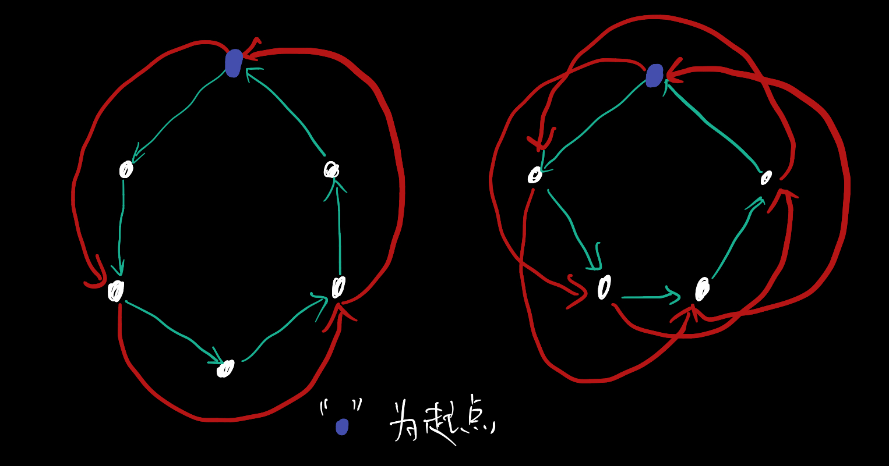

龟兔赛跑算法（快慢指针）：

刚开始指针A和指针B指向链表头，A每向前走一步，B就向前走两步。

如果无环，B会首先变成null空指针，B指针不可能追上A。

当B距离A有1个距离时，下一次迭代两者一定会相遇。

当B距离A有2个距离的时候，经过一次迭代就会变成第一种情况，因此一定会相遇。

**结论**：只要两者在环中，最后都一定会相遇。

🔵如何确定有环链表的起点：

由上面结论可推，当将环中的起点断开为链表的时候，在链表前半段的时候A不可能追上B，在后半段的时候根据初中数学之后可得两者最终在终点才能相遇，因此可得A与B每次相遇的地点都相同。

当第一次相遇的时候开始记录，第二次相遇的时候记录A走过的距离为 $K$ ，即得环的长度 $K$。

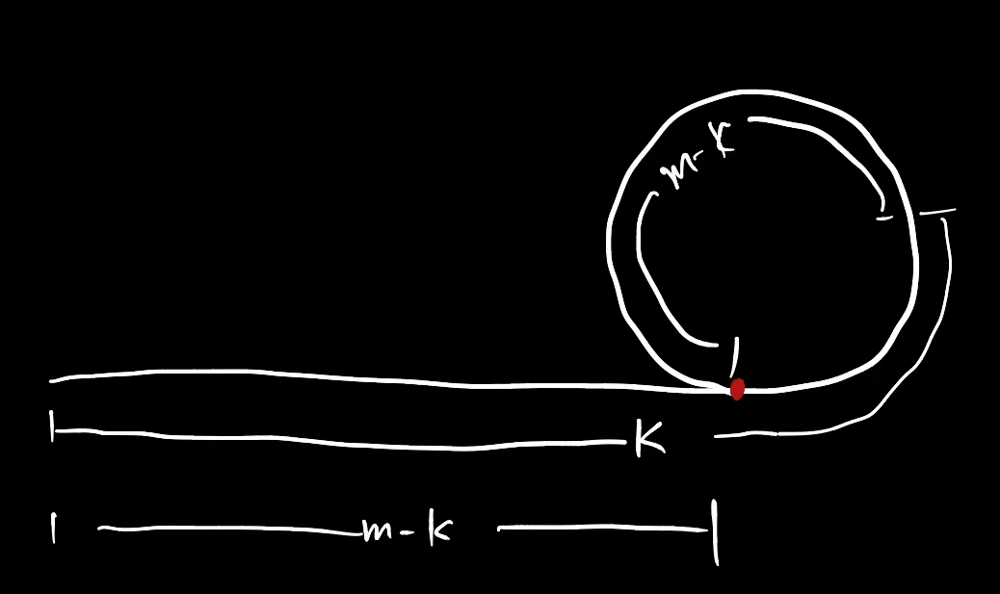

由于环的长度为 $K$，设链表的长度为 $m$，因此让A和B同时回到链表起点，先让B走K步；然后A和B同时出发，当B指针与A指针相遇时，即可得到环头。

#### b. 链表的数组表示法

题目：

* [单链表](https://www.acwing.com/problem/content/828/)

一般情况下对于链表的表示方法都是使用结构体的形式，创建的时候采用的是new的方法。然而这种方式对于数据量较大的情况就寄了，会导致TLE等情况，因此需要更加快速的方法来创建数组。

这里采用数组的方式来进行表示链表，用 $e[n]$ 存储链表中的信息，$en[n]$ 表示链表中对应下一个节点的索引。

并且使用链表的数组表示法可以了解到第 K 次插入的信息，因为每次插入就会将节点放在数组尾部。

```c++
const int N = 100010;
int head = 0, e[N], en[N], pos = 1;
int m;

// 头插法
void goHead(int n) {
    e[pos] = n;
    en[pos] = head;
    head = pos++;
}

// 在第 i 个位置上插入节点 n
void insert(int i, int n) {
    e[pos] = n;
    en[pos] = en[i];
    en[i] = pos++;
}

// 删除第 i 次操作的节点
void del(int i) {
    if (i == 0) {
        head = en[head];
//        en[head] = en[en[head]];
    }
    else en[i] = en[en[i]];
}
```


### 2. 双指针

题目：

* [三数之和](https://leetcode-cn.com/problems/3sum/)
* [最接近的三数之和](https://leetcode-cn.com/problems/3sum-closest/)
* [日志统计](https://www.acwing.com/problem/content/1240/)
* [11. 盛最多水的容器](https://leetcode.cn/problems/container-with-most-water/)

### 3. 二分

题目：

* [789. 数的范围 (模板题)](https://www.acwing.com/problem/content/791/)

思想：

1. 确定一个区间，使得答案一定在区间内。
2. 找一个性质满足两点：
   * 性质具有二段性，前段满足条件，后段不满足条件
   * 答案是具有分界点的

比如整数二分。

找区间左端点时：$\text{mid}=\dfrac{l+r}{2}$，找区间右端点的时候：$\text{mid}=\dfrac{l+r+1}{2}$

因为对于奇数除以2的时候默认向下取整。因此找左端点的时候默认端点靠左，找右端点的时候计算mid时候需要加一，让右端点的范围更加靠右。

```c
#include<cstdio>
#include<cstring>

int n, q;

int s[100010];

int main(){
	scanf("%d%d", &n, &q);
	for(int i=0;i<n;i++)scanf("%d", &s[i]);
	for(int i = 0; i < q; i ++){
		int t;
		scanf("%d", &t);
		
		int l = 0, r = n - 1;
		while(l < r){		// 找左端点
			int mid = l + r >> 1;
			if(s[mid] >= t) r = mid;
			else l = mid + 1;
		}
		
		if(s[r] == t){
			printf("%d ", r);
			r = n - 1;
			while(l < r){	// 找右端点
				int mid = l + r + 1 >> 1; // l = mid +1向上取整
				if(s[mid] <= t) l = mid;
				else r = mid - 1;
			}
			printf("%d\n", r);
		}else{
			printf("-1 -1\n");
		}
	} 
	return 0;
}
```

### 4. 前缀和与差分数组

题目：

* [前缀和 (模板)](https://www.acwing.com/problem/content/797/)
* [子矩阵的和 (模板)](https://www.acwing.com/problem/content/798/)
* [差分 (模板)](https://www.acwing.com/problem/content/799/)
* [差分矩阵 (模板)](https://www.acwing.com/problem/content/800/)

🔵前缀和：

查询一个数组中间某段序列的和。

欲求$\displaystyle\sum_{i=l}^ra[i]$，设$S[j]=\displaystyle\sum_{i=0}^ja[i]$，则$\displaystyle\sum_{i=l}^ra[i]=S[r]-S[l-1]$。

扩展二维矩阵和。

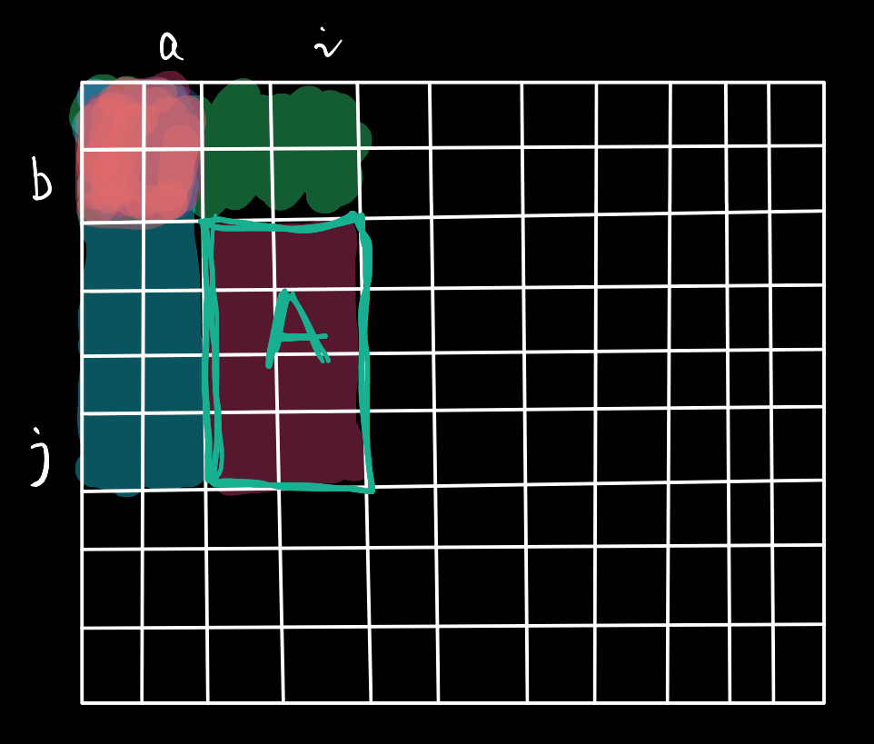

A区域之和=$S[i][j]-s[a][j]-s[i][b]+s[a][b]$

🔵差分数组

对于一个数组，要对中间 $[l,r]$ 都加上某个常数$c$，然后求最终的序列。

思想：利用前缀和的逆思想。对于原数组$a[i]$中加某个常数$c$，其对应的前缀和数组$s[i:n]$都需要加上C。因此可以利用这种逆思想将对应的数组看成前缀和数组，前缀和中的原数组即为差分数组。

构造差分数组的公式：$c[i]=a[i]-a[i-1]$，若要对区间 $[l,r]$ 都要加上某个常数C，则只需要 $c[l]+c$，$c[r+1]-c$即可，最终汇总数组 $c$ 的前缀和数组即可得到最终的序列。时间复杂度由原来的 $O(n^2)$ 将为了 $O(n)$。

```c++
#include <bits/stdc++.h>
using namespace std;
const int SZ = 100005;

int n, m;

int arr[SZ];
/*  */
int main() {

    scanf("%d%d", &n, &m);
    for (int i = 1; i <= n; i++) {
        scanf("%d", &arr[i]);
    }
    # 注意这里要倒序减
    for (int i = n; i >= 1; i--) {
        arr[i] -= arr[i-1];
    }

    while (m--) {
        int a, b, v;
        scanf("%d%d%d", &a, &b, &v);
        arr[a] += v;
        arr[b+1] -= v;
    }

    for (int i = 1; i <= n; i++) {
        arr[i] += arr[i-1];
        printf("%d ", arr[i]);
    }

    return 0;
}
```

🔵差分矩阵

和差分数组原理一样。

```c++
#include <bits/stdc++.h>

using namespace std;

const int SZ = 1005;

int n, m, q;

int arr[SZ][SZ];

int main()
{

    scanf("%d%d%d", &n, &m, &q);
    for (int i = 1; i <= n; i++)
        for (int j = 1; j <= m; j++)
            scanf("%d", &arr[i][j]);

    for (int i = n; i > 0; i--)
    {
        for (int j = m; j > 0; j--)
        {
            arr[i][j] = arr[i][j] - arr[i][j - 1] - arr[i - 1][j] + arr[i - 1][j - 1];
        }
    }
    int x1, y1, x2, y2, v;
    while (q--)
    {
        scanf("%d%d%d%d%d", &x1, &y1, &x2, &y2, &v);
        arr[x1][y1] += v;
        arr[x1][y2 + 1] -= v;
        arr[x2 + 1][y1] -= v;
        arr[x2 + 1][y2 + 1] += v;
    }

    for (int i = 1; i <= n; i++)
    {
        for (int j = 1; j <= m; j++)
        {
            arr[i][j] += arr[i - 1][j] + arr[i][j - 1] - arr[i - 1][j - 1];
            printf("%d ", arr[i][j]);
        }
        printf("\n");
    }

    return 0;
}
```

### 5. LRU缓存

题目：

* [146. LRU 缓存 - 力扣（LeetCode）](https://leetcode.cn/problems/lru-cache/)

要求：首先需要初始化缓存容量，然后 `get` 和 `put` 缓存必须要以 $O(1)$ 的时间复杂度进行。

方法：使用**哈希表**和**双向链表**进行实现。哈希表用于 $O(1)$ 时间复杂度的存取，用来通过键来映射其在双向链表中的位置；双向链表用于维护插入的键值对，靠近头部为最近使用的，靠近尾部为最久未使用的。

```java
class LRUCache {
    class DoubleLink {
        DoubleLink pre, next;
        int key, val;

        DoubleLink() {}

        DoubleLink(DoubleLink pre, DoubleLink next, int key, int val) {
            this.key = key;
            this.pre = pre;
            this.next = next;
            this.val = val;
        }
    }

    DoubleLink head = new DoubleLink(), tail = new DoubleLink();
    int cap = 0, len = 0;
    Map<Integer, DoubleLink> map = new HashMap<>();

    public LRUCache(int capacity) {
        cap = capacity;
        head.next = tail;
        tail.pre = head;
    }

    void addToHead(int key, int val) {
        DoubleLink tmp = head.next;
        DoubleLink node = new DoubleLink(head, tmp, key, val);
        head.next = node;
        tmp.pre = node;
        len++;
        map.put(key, node);
    }

    void removeNode(DoubleLink node) {
        if (node == head) return;
        node.pre.next = node.next;
        node.next.pre = node.pre;
        map.remove(node.key);
        len--;
    }

    public int get(int key) {
        DoubleLink v = map.get(key);
        if (v == null) return -1;
        removeNode(v);
        addToHead(key, v.val);
        return v.val;
    }

    public void put(int key, int value) {
        DoubleLink v = map.get(key);
        if (v == null) {
            if (len == cap) removeNode(tail.pre);
        } else removeNode(v);
        addToHead(key, value);
    }

}
```

样例：Python中有 `collections.OrderedDict`，Java 中有 `LinkedHashMap`

### 6. 摩尔投票法

* 例题：[169. 多数元素](https://leetcode.cn/problems/majority-element/)

用于选出数目大于 $\lfloor n/2 \rfloor$ 的元素，如果使用一人一票的形式进行选举，那么大于一半数目的候选人必然会胜出，即使这种形式在中国不会发生。

```java
public int majorityElement(int[] nums) {
    int candidate = nums[0], cnt = 0;
    for (int num : nums) {
        if (num == candidate) cnt++;
        else {
            if (cnt == 0) {
                candidate = num;
                cnt++;
            } else cnt--;
        }
    }
    return candidate;
}
```

### 7. 高精度算法

<h4>a. 高精度加法</h4>

对于长数字需要进行倒序存储，将个位存储在 0 索引位置，每加一个将进位记录。

```c++
#include <bits/stdc++.h>

using namespace std;

vector<char> add(vector<char> &a, vector<char> &b) {
    int t = 0;
    int i = 0, j = 0;
    vector<char> res;
    while (i < a.size() || j < b.size()) {
        if (i < a.size()) t += a[i++] - '0';
        if (j < b.size()) t += b[j++] - '0';
        res.push_back((t % 10) + '0');
        t /= 10;
    }

    if(t) res.push_back(t);
    return res;
}

int main() {

    string a, b;
    cin >> a >> b;

    vector<char> l, r;

    for (int i = a.size() - 1; i >= 0; i--) l.push_back(a[i]);
    for (int i = b.size() - 1; i >= 0; i--) r.push_back(b[i]);
    
    auto res = add(l, r);
    for (int i = res.size() - 1; i >= 0; i--) printf("%c", res[i]);
    return 0;
}
```

<h4>b. 高精度减法</h4>

难点：**借位**。

思想：

1. 规定只能大数减小数，需要实现比较函数 `cmp`
2. 通过使用借位变量来记录减法时候的借位（`sub` 函数）
3. 最后要去除高位无效 0

```c++
#include <bits/stdc++.h>

using namespace std;

// 用于比较 a 和 b 那个大
int cmp(vector<int> &a, vector<int> &b)
{
    vector<int> ans;
    if (a.size() == b.size())
    {
        int sz = a.size();
        for (int i = sz - 1; i >= 0; i--)
        {
            if (a[i] > b[i])
                return 1;
            else if (a[i] < b[i])
                return -1;
        }

        return 0;
    }
    else
    {
        return a.size() > b.size() ? 1 : -1;
    }
}

vector<int> sub(vector<int> &a, vector<int> &b)
{
    vector<int> ans;
    for (int i = 0, t = 0; i < a.size(); i++) {
        t = a[i] - t;   // t 表示借位
        if (i < b.size()) t = t - b[i];
        ans.push_back((t + 10) % 10);
        if (t < 0) t = 1;
        else t = 0;
    }

    while (ans.size() > 1 && ans.back() == 0) ans.pop_back();
    
    return ans;
}

int main()
{

    string a, b;
    cin >> a >> b;
    
    vector<int> l, r;
    
    for (int i = a.size() - 1; i >= 0; i--)
        l.push_back(a[i] - '0');
    for (int i = b.size() - 1; i >= 0; i--)
        r.push_back(b[i] - '0');
    
    if (cmp(l, r) > -1)
    {
        auto res = sub(l, r);
        for (int i = res.size() - 1; i >= 0; i--)
            printf("%d", res[i]);
    }
    else
    {
        auto res = sub(r, l);
        printf("-");
        for (int i = res.size() - 1; i >= 0; i--)
            printf("%d", res[i]);
    }
    
    return 0;
}
```


<h4>c. 高精度乘法</h4>

大整数 $\times$ 小整数：

和传统算法的不同就是将大整数的每一位和小整数**整体**来做乘法。

```c++
#include <bits/stdc++.h>

using namespace std;

int main() {

    string a;
    int b;
    cin >> a >> b;
    vector<int> arr;
    for (int i = 0; i < a.size(); i++) arr.insert(arr.begin(), a[i] - '0');
    int t = 0;
    for (int i = 0; i < a.size(); i++) {
        t = arr[i] * b + t;
        arr[i] = t % 10;
        t = t / 10;
    }

    while (t) {
        arr.push_back(t % 10);
        t = t / 10;
    }

    while (arr.size() > 1 && arr.back() == 0) arr.pop_back();

    for (int i = arr.size()-1; i >= 0; i--) 
        printf("%d", arr[i]);
    
    
    return 0;
}
```

### 8. 离散化

模板：[区间和](https://www.acwing.com/problem/content/804/)

特指整数有序离散化，通过将值域范围很大但是数量较少的数字。

比如数字的范围可能是 $[-10^9, 10^9]$ 之间，但是数字的数量较少，由于不可能开这么大的数组，需要将数字映射到 [0, n] 之间.

将所有的插入和查询的数字全部添加的列表中，然后经过排序和去重得到每个数字对应的唯一映射。

查询操作使用二分查找即可。

```c++
#include <iostream>
#include <vector>
#include <algorithm>

using namespace std;

typedef pair<int, int> PII;

const int N = 300010;

int n, m;
int a[N], s[N];

vector<int> alls;
vector<PII> add, query;

int find(int x) {
    int l = 0, r = alls.size() - 1;
    while (l < r) {
        int mid = l + r >> 1;
        if (alls[mid] >= x) r = mid;
        else l = mid + 1;
    }
    return r + 1;
}

int main()
{
    // 其他操作 ...

    for (int i = 0; i < m; i ++ ) {
        alls.push_back(l);
        alls.push_back(r);
    }

    // 去重
    sort(alls.begin(), alls.end());
    alls.erase(unique(alls.begin(), alls.end()), alls.end());

    // 处理插入
    for (auto item : add) {
        int x = find(item.first);
        a[x] += item.second;
    }

    // 预处理前缀和
    for (int i = 1; i <= alls.size(); i ++ ) s[i] = s[i - 1] + a[i];

    // 处理询问
    for (auto item : query) {
        int l = find(item.first), r = find(item.second);
        cout << s[r] - s[l - 1] << endl;
    }

    return 0;
}
```

### 9. 并查集

用于快速处理一下操作：

* 将两个集合合并，可以近乎 $O(1)$ 的时间复杂度完成操作
* 询问两个集合是否在一个集合中

基本思想：

1. 每个集合使用树来进行表示，树根编号就是整个集合的编号。
2. 每个节点存储其父节点

如何判断树根：树根的父节点标记为自身。

如何保证时间复杂度近乎 $O(1)$ ：路径压缩。

代码：

```c++
#include <bits/stdc++.h>

using namespace std;

const int SZ = 1e5+10;

int n, m;

int p[SZ];

// 查找所属集合
int find(int x) {
    if (p[x] != x) p[x] = find(p[x]);
    return p[x];
}

int main() {

    scanf("%d%d", &n, &m);
    for (int i = 1; i <= n; i++) p[i] = i;
    char op[2];
    int a, b;
    while (m--) {
        scanf("%s%d%d", op, &a, &b);
        if (*op == 'M') {
            // 修改所属集合
            p[find(a)] = p[find(b)];
        } else {
            printf(find(a) == find(b) ? "Yes\n" : "No\n");
        }
    }

    return 0;
}
```

### 10. 哈希 / 字符串哈希

哈希冲突的概率怎么最小，在进行取模的时候要取一个**质数**，并且尽量里 2 的整数次幂尽可能远。

在进行哈希的时候需要靠**负数取模**的情况。

核心代码：

```c++
const int SZ = 100003;

int n;

int h[SZ], e[SZ], en[SZ], idx = 0;

void insert(int x) {
    int k = (x % SZ + SZ) % SZ;
    e[++idx] = x;
    en[idx] = h[k];
    h[k] = idx;
}

bool find(int x) {
    int k = (x % SZ + SZ) % SZ;
    int idx = h[k];
    while (idx != -1 && e[idx] != x) {
        idx = en[idx];
    }
    return idx != -1;
}
```

字符串哈希方式：字符串前缀哈希法

> 用于快速判断两个字符串是否相等，算是 KMP 的劲敌。

对于一个字符串 ABCDEFGABC

hash(1) 表示对于 A 的哈希值

hash(2) 表示对于 AB 的哈希值

hash(3) 表示对于 ABC 的哈希值

hash(4) 表示对于 ABCD 的哈希值

而在计算哈希值的是否通常使用 p 进制来进行计算，通常 p 的取值为 $131, 13331$ （按照经验得出的，不容易发生哈希冲突）。

hash(1) = 'A'

hash(2) = hash(1) * $p^1$ +  'B'

hash(i) = hash(i-1) * $p^{i-1}$ + s[i]

如何得到 DEF 的哈希值呢？

hash(DEF) = hash(ABCDEF) - hash(ABC) * $p^k$，其中  $p^k$ 就表示 hash(ABC000) 和 hash(ABC) 之间的商，用于进制处理对齐。

通过总结得到对于字符串 s[i:j] 之间的哈希计算为：
$$
hash(i, j) = hash(j) - hash(i-1) * p^{j-i+1}
$$
最终哈希的值保存大小在 $[0, 2 ^{64}-1]$ 范围之内，在 C++ 需要使用 `unsigned long long` 类型。

## 二. 堆栈队列

### 1. hint

对于堆和队列两种数据结构，其操作只涉及到头和尾，因此对于已经有头和尾指针的情况下，就无需进行其他多余操作。

例题：[剑指 Offer 09. 用两个栈实现队列](https://leetcode-cn.com/problems/yong-liang-ge-zhan-shi-xian-dui-lie-lcof/)

### 2. 单调栈

例题：
* [42. 接雨水](https://leetcode-cn.com/problems/trapping-rain-water/)
* [84. 柱状图中最大的矩形](https://leetcode-cn.com/problems/largest-rectangle-in-histogram/)
* [316. 去除重复字母](https://leetcode-cn.com/problems/remove-duplicate-letters/)

即维持一个单调递增或者递减的栈，新加入的元素比栈顶元素小(大)。

模板（单调不增栈）：

```java
public int monotonicStack(int[] height) {
    if (height.length <= 2) return 0;
    Stack<Integer> stack = new Stack<>();
    int ans = 0;
    stack.push(0);
    int i = 1;
    while (i < height.length) {
        while (!stack.empty() && height[i] > height[stack.peek()]) {
            Integer pop = stack.pop();
            if (!stack.empty()) {
                // 处理逻辑
                int h = Math.min(height[i], height[stack.peek()]) - height[pop];
                ans += h * (i - stack.peek() - 1);
            }
        }
        stack.push(i++);
    }
    return ans;
}
```

### 3. 滑动窗口

使用用于解决找最优子串或者最优子数组的问题。

例题：

* [无重复字符的最长子串](https://leetcode-cn.com/problems/longest-substring-without-repeating-characters/)
* [最小覆盖子串](https://leetcode.cn/problems/minimum-window-substring/)

滑动窗口可以用来解决序列或者数组中的循环问题，可以将嵌套循环问题转换为单循环问题，降低时间复杂度。滑动窗口也可以看作是一个队列，只涉及到数据某段序列的头和尾操作。

```java
int l = 0, r = 0, bl = 0, br = 0x7fffffff;
while (r <= slen) {
    if (condition) {
        // 业务代码
        l++;
    } else {
        // 业务dai
        r++;
    }
}
```

### 4. 单调队列


### 5. 中缀表达式

中缀表达式求值来说，相对于表达式中序遍历。如何确定运算符之间的优先级是其中的关键。

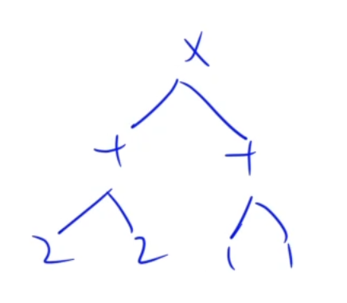

思想：对于等式 A op B，无法知道 B 后面的操作符和当前 op 的优先级大小关系，得确定之后的操作符才能决定当前是否能够计算。


## 三. 树和森林

### 1. 树状数组和线段树

题目：

* [1264. 动态求连续区间和 (模板)](https://www.acwing.com/problem/content/1266/)

应用于单点修改和区间查询，时间复杂度为 $O(\log n)$

🔵树状数组

* $O(\log n)$快速求前缀和。
* 在某个位置的数，加上一个数

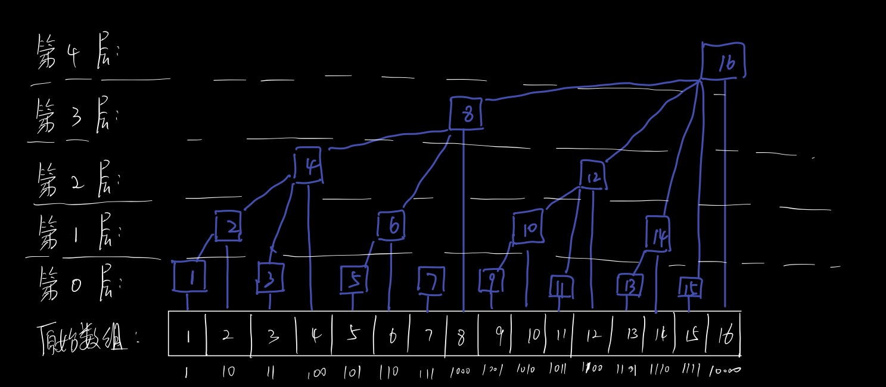

树状数组的层数是有对应位置数字二进制末尾几个零决定。

树状数组有三个必要操作：`lowbit(x), add(), query()`，分别表示特定计算，对某个元素添加一个值以及查询前缀和。其中$\text{lowbit(x)}=x\&-x$。其查询前缀和以及进去区间修改的时间复杂度为$O(\log n)$

> 下标从 1 开始使用。

求位置索引`x`之前序列前缀和：

```c
for(int i=x;i>0;i-=lowbit(i))res+=c[i];
```

在位置索引`x`添加数值`v`后需要进行的序列修改：

```c
for(int i = x; i <= n; i += lowbit(x))c[i]+=v;
```

模板：

```c++
#include "iostream"
#include "cstdio"
#include "algorithm"

using namespace std;

typedef long long ll;

const int N = 100010;
int n, m;
int tr[N];

int lowbit(int x) {
    return x & -x;
}

void add(int t, int x) {
    for (int i = t; i <= n; i += lowbit(i)) tr[i] += x;
}

ll query(int t) {
    ll ans = 0;
    for (int i = t; i > 0; i -= lowbit(i)) {
        ans += tr[i];
    }
    return ans;
}

int main() {
    cin >> n >> m;
    for (int i = 1; i <= n; ++i) {
        int item;
        scanf("%d", &item);
        add(i, item);
    }
    int k, a, b;
    while (m--) {
        scanf("%d%d%d", &k, &a, &b);
        if (k) add(a, b);
        else cout << query(b) - query(a - 1) << endl;
    }
}
```

🔵线段树

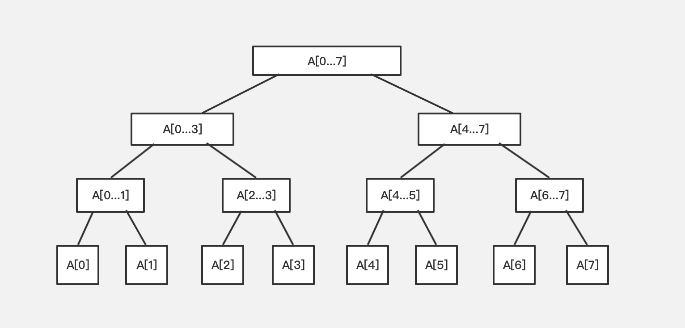

其维持的就是结构体数组，结构体中记录数组的边界和所保存的值。

基础线段树有四个操作：`pushup()`根据子节点的信息来更新父节点，`build()`构造线段树，`modify()`单点修改，`query()`区间查询。

模板：

```c++
#include "cstdio"

const int N = 100010;
int arr[N];
struct Node {
    int l, r;
    int sum;
} tr[N * 4 + 1];
int n, m;

void pushup(int u) {
    tr[u].sum = tr[u << 1].sum + tr[u << 1 | 1].sum;
}

// 
void build(int u, int l, int r) {
    if (l == r) tr[u] = {l, r, arr[l]};
    else {
        tr[u] = {l, r};
        int mid = l + r >> 1;
        build(u << 1, l, mid), build(u << 1 | 1, mid + 1, r);
        pushup(u);
    }
}

void modify(int u, int t, int x) {
    if (tr[u].l == tr[u].r)tr[u].sum += x;
    else {
        int mid = tr[u].l + tr[u].r >> 1;
        if (t <= mid) modify(u << 1, t, x);
        else modify(u << 1 | 1, t, x);
        pushup(u);
    }
}

int query(int u, int l, int r) {
    if (tr[u].l >= l && tr[u].r <= r)return tr[u].sum;
    int mid = tr[u].l + tr[u].r >> 1;
    int sum = 0;
    if (l <= mid) sum = query(u << 1, l, r);
    if (r > mid) sum += query(u << 1 | 1, l, r);
    return sum;
}

int main() {
    scanf("%d%d", &n, &m);
    for (int i = 1; i <= n; ++i) scanf("%d", &arr[i]);
    build(1, 1, n);
    int k, a, b;
    for (int i = 0; i < m; ++i) {
        scanf("%d%d%d", &k, &a, &b);
        if (k) modify(1, a, b);
        else printf("%d\n", query(1, a, b));
    }
}
```

### 2. 树的直径(wait)

例题：[1207. 大臣的旅费](https://www.acwing.com/problem/content/1209/)

### 3. 二叉搜索树

例题：

* [99. 恢复二叉搜索树](https://leetcode.cn/problems/recover-binary-search-tree/)

二叉搜索树(Binary Search Tree, BST)，对于任何一个节点来说都满足：

* 左节点 < 根节点 < 右节点

还有一点需要注意的是，根节点的值要大于左子树上**所有**节点的值，小于右子树上**所有**节点的值。

二叉树的中序遍历是有序数组。

### 4. 树的遍历

参考：[【动画模拟】二叉树神级遍历！（Morris）](https://zhuanlan.zhihu.com/p/384818393)

Morris 遍历：时间复杂度 O(n) 空间复杂度为 O(1) 的遍历算法。

<video class="ztext-gif GifPlayer-gif2mp4 css-1xeqk96" src="https://vdn6.vzuu.com/SD/9a417b62-d808-11eb-a943-3a59b0f1499a.mp4?pkey=AAWHY1DPj6pVOZWyQqSqtDEizfp6jK99IvG7Wcj8-XRTdfh9sG5FcjoABObt41-Zogj2coTbP3E_BD75tqmbtZgs&amp;c=avc.0.0&amp;f=mp4&amp;pu=078babd7&amp;bu=078babd7&amp;expiration=1766852505&amp;v=ks6" data-thumbnail="https://pic2.zhimg.com/v2-13ee533cb4dc235f16e735c3dc8ff71d_b.jpg" poster="https://pic2.zhimg.com/v2-13ee533cb4dc235f16e735c3dc8ff71d_b.jpg" data-size="normal" preload="metadata" loop="" playsinline="" __idm_id__="122883"></video>

前序遍历代码：

```java
class Solution {
    public List<Integer> preorderTraversal(TreeNode root) {
        List<Integer> list = new ArrayList<>();
        if (root == null) {
            return list;
        }
        TreeNode p1 = root; TreeNode p2 = null;
        while (p1 != null) {
            p2 = p1.left;
            if (p2 != null) {
                //找到左子树的最右叶子节点
                while (p2.right != null && p2.right != p1) {
                    p2 = p2.right;
                }
                //添加 right 指针，对应 right 指针为 null 的情况
                if (p2.right == null) {
                    list.add(p1.val);
                    p2.right = p1;
                    p1 = p1.left;
                    continue;
                }
                //对应 right 指针存在的情况，则去掉 right 指针
                p2.right = null;
            } else {
                list.add(p1.val);
            }
            //移动 p1
            p1 = p1.right;
        }
        return list;
    }
}
```

### 5. Trie前缀树

例题：

* [模板](https://www.acwing.com/problem/content/837/)

使用数组来表示前缀树，son 第一维表示节点信息，第二位表示子节点的数目，cnt 用于表示到该节点的数目，idx 用于插入新的节点信息。

```c++
#include <bits/stdc++.h>

using namespace std;

const int SZ = 1e5+10;

int n;


int son[SZ][26], cnt[SZ], idx = 0;

void insert(char *s) {
    int p = 0;
    for (int i = 0; s[i]; i++) {
        char u = s[i] - 'a';
        if (!son[p][u]) son[p][u] = ++idx;
        p = son[p][u];
    }
    cnt[p]++;
}

int query(char *s) {
    int p = 0;
    for (int i = 0; s[i]; i++)
    {
        char u = s[i] - 'a';
        if (!son[p][u]) return 0;
        p = son[p][u];
    }
    return cnt[p];
}

int main() {

    scanf("%d", &n);
    char op[2], s[SZ]; 
    for (int i = 1; i <= n; i++) {
        scanf("%s%s", op, s);
        if (*op == 'I') {
            insert(s);
        } else {
            printf("%d\n", query(s));
        }
    }
    
    return 0;
}
```

## 四. 图论

### 1. 拓扑排序

对于一个图来说：

* 如果存在环，那么就不是有向无环图，就不存在拓扑排序
* 如果是有向无环图，那么存在拓扑排序并且最终结果不止一种。

拓扑排序的时间复杂度为 $O(m+n)$，其中 m, n 分别表示图的节点数和边数。

使用 BFS 的形式来进行拓扑排序：

```java
public boolean canFinish(int numCourses, int[][] prerequisites) {
    int[] indegree = new int[numCourses];
    List<Integer>[] children = new List[numCourses];
    for (int i = 0; i < numCourses; i++) {
        children[i] = new ArrayList<Integer>();
    }

    for (int[] p : prerequisites) {
        indegree[p[0]]++;   // 记录入度
        children[p[1]].add(p[0]);   // 记录子节点
    }
    
    List<Integer> ans = new ArrayList<>();
    
    int cnt = numCourses;
    while (cnt >= 0) {
        int s = 0;
        // 找到入度为0的节点
        while (s < numCourses && indegree[s] != 0) s++;
        // 添加到排序结果中
        ans.add(s);
        // 存在环，退出
        if (s == numCourses) return false;
        // 移除该节点，并且减少子节点入度1
        for (Integer item : children[s]) {
            indegree[item]--;
        }
        // 标记为已遍历过
        indegree[s] = -1;
        cnt--;
    }
    return true;
}
```

## 五. 递归分治

### 2. 全排列

无序版：

```c
void permutation(int *a, int low, int high){
    if(low==high){
        for (int i = 0; i <= high; ++i) printf("%d ",a[i]);
        printf("\n");
    }else{
        for (int i = low; i <= high; ++i) {
            swap(&a[low],&a[i]);
            permutation(a,low +1, high);
            swap(&a[low],&a[i]);	//再换回来
        }
    }
}
```

有序版：

```c++
int n;
int path[N];

void dfs(int u, int state)
{
    if (u == n)
    {
        // 输出
        for (int i = 0; i < n; i ++ ) printf("%d ", path[i]);
        puts("");
        return;
    }

    for (int i = 0; i < n; i ++ )
        if (!(state >> i & 1)) {	// state 相当于 bool 数组，用于标识第 i 位是否用过
            path[u] = i + 1;
            dfs(u + 1, state + (1 << i));
        }
}
```


### 3. 下一个全排列/字典序

例题：[31. 下一个排列](https://leetcode-cn.com/problems/next-permutation/)

步骤一：由排列计算出字典序值：

设给定的$\{1,2,...,n\}$的排列为 $\pi$ ，设其字典序的值为 $\text{rank}(\pi,n)$，那么其对应的字典序值显然存在：
$$
(\pi[1]-1)\cdot(n-1)!\le \text{rank}(\pi,n)\le \pi[1]\cdot(n-1)!-1
$$
设 $r$ 为 $\pi$ 在以$\pi[1]$ 开头的所有排列中的序号，那么就可以得到 $r$ 也是集合 $\{1,2,...,n\}-\{\pi[1]\}$ 中序列为 $[\pi[2],\pi[3]],...\pi[n]$ 的序号。那么将 $\pi$ 中所有大于 $\pi[1]$ 的元素都减一就会得到集合$\{1,2,...,n-1\}$的排列 $\pi'$，其字典序也是 $r$ ，由此就得到计算$\text{rank}(\pi,n)$的递归公式：
$$
\text{rank}(\pi,n)=(\pi[1]-1)\cdot(n-1)!+\text{rank}(\pi',n-1)
$$
其中$\pi'[i]=\begin{cases}\pi[i+1]-1,&\pi[i+1]>\pi[i]\\\pi[i+1],&\pi[i+1]<\pi[i]\end{cases}$

步骤二：由排列计算出下一个排列：

由一个字典序找到下一个字典序，比如序列 *26458173*，首先改变的数值一定是从个位开始。不改变个位以上的值能否将序列增大？不能；不改变十位以上的值只改变“73”能否将序列的值增大？不能；不改变百位以上的值只改变“173”能否将序列的值增大？可以，因为存在序列“317，371...” > "173"。观察可以得到以下规律，即找到下标为 $i$ 的数字满足 $a[i]<a[i+1]$，且对于 $i+1$ 之后的序列都有 $a[i+1]>a[i+2]>\cdots>a[n]$。找到下标 $i$ 之后如何从“317，371，713，731”中找到最适合的序列？显然这个序列是“317”。因此还应该找到下标 $j$ 满足 $a[j]$ 刚好大于 $a[i]$即 $a[j+1],a[j+2],...,a[n]<a[i],a[j]>a[i]$，然后 $\text{swap}(a[i],a[j])$，将 $a[i+1:n]$ 进行逆序处理即可得到下一个数列。

程序如下：

```c++
#include <bits/stdc++.h>
#define MAX 20+5
using namespace std;

int a[MAX],b[MAX],fac[MAX];

int dictIndex(int a[], int n){	//计算字典序
    int s = 0;
    for (int j = 0; j < n; ++j) {
        for(int i=j+1;i<n;i++)if(a[i]>a[j])a[i]--;	//对a[j+1:n]大于a[j]元素进行-1
        s+=(a[j]-1)*fac[n-j-1];		// 加每层的序号 (π[i]-1)*(n-i-1)!
    }
    return s;
}


int main(){
    int n;
    scanf("%d",&n);
    fac[0]=1;
    for(int i=0;i<n;i++){
        fac[i+1]=(i+1)*fac[i];
        scanf("%d",&b[i]);
        a[i]=b[i];
    }
    cout<<dictIndex(a,n)<<endl;	//得到字典序
    int i=n-2;
    while(b[i]>b[i+1])i--;	//找到可以增大的序号
    int j=i+1;
    while(j+1<n&&b[j+1]>b[i])j++;
    swap(b[i],b[j]);		//找到可以交换的序号
    i++,j=n-1;
    while(i<j)swap(b[i++],b[j--]);	//对a[i+1:n]进行逆序处理
    for (int k = 0; k < n; ++k) cout<<b[k]<<" ";//输出
    return 0;
}
```

### 4. 第 K 个全排列字典序

例题：[60. 排列序列](https://leetcode.cn/problems/permutation-sequence/)

找到长度为 $n$ 的字典序全排列中第 $K$ 个序列，序列由 $[1..n]$ 组成为 $a_1a_2...a_n$。

因此可以知道：

* 以 1 为 $a_1$ 的排列一共有 $(n-1)!$ 种情况。
* 以 12 为 $a_1a_2$ 的排序一共有 $(n-2)!$ 种情况。

因此可以推出 $a_1$：

* 当 $K\le(n-1)!$ 首位元素为值最小的元素；
* 当 $(n-1)!\le K\le2\cdot(n-1)!$ 首位元素为值第2小的元素；
* 因此 $m\cdot(n-1)!\le K\le(m+1)\cdot(n-1)!$ 首位元素为值第 $m+1$ 小的元素。

那么对于 $a_m$ 呢($m>1$)？

* 将序列中前 $m-1$ 个元素排除，当 $K\le(n-m-1)!$ 时，第 $m$ 个元素为排除序列后值最小的元素；
* 依此类推

确定 $a_1$ 后，如果 $K = m\cdot(n-1)! + 1$ 时，无论 $m$ 取何值，后续序列 $a_2a_3...a_n$ 都是递增的。

因此对于 $a_2a_3...a_n$ 都是相当于第 $1$ 个排列，因此对于 $K$ 需要进一步处理为 $K = K\mod(n-1)!$，并且由于 $K \ge 1$，取模运算可能存在为 0 的情况，因此当 $K$ 可能为 0 时取 $K = (n-1)!$

```java
public class Solution {
    // 阶乘
    private final int[] stage = new int[10];
    // 可选顺序序列
    private List<Character> g = new ArrayList<>();

    public String getPermutation(int n, int k) {
        stage[0] = 1;
        for (int i = 0; i < n; i++) {
            g.add((char) ('0' + i + 1));
            stage[i + 1] = (i + 1) * stage[i];
        }
        StringBuilder sb = new StringBuilder();
        for (int level = 0; level < n; level++) {
            int mod = stage[n - 1 - level];	// (n-1)!
            if (k >= mod) {
                sb.append(g.remove((k - 1) / mod));
                k = k % mod == 0 ? mod : k % mod;
            } else {
                sb.append(g.remove(0));
            }
        }
        return sb.toString();
    }
}
```

### 5. 非重复子集

例题：[90. 子集 II](https://leetcode.cn/problems/subsets-ii/)

```
输入：nums = [1,2,2]
输出：[[],[1],[1,2],[1,2,2],[2],[2,2]]
```

只需要保证最终输出数组结果每个位置的数字不重复即可，如果重复直接进行跳过。

```java
private void dfs(int[] num, int level, List<Integer> item) {
    int len = num.length;
    if (level == len) {
        ans.add(new ArrayList<>(item));
    } else {
        int p = num[level];
        // Select
        item.add(p);
        dfs(num, level + 1, item);
        item.remove(item.size() - 1);
        // Not Select
        // 在同一个位置上不能有相同的数字
        while (level < len && num[level] == p) level++;
        dfs(num, level, item);
    }
}
```

## 六. 贪心

贪心算法出题形式不定，并且证明较难。


## 七. 动态规划

### 1. 背包问题

视频讲解：https://www.bilibili.com/video/BV1qt411Z7nE

🔵01背包问题

> 每个物品只能选或者不选两种情况

使用 $f[i][j]$ 来表示轮到选择第 $i$ 个物品的时候体积为 $j$ 的价值，则可以得到dp方程：
$$
f(i,j)=\begin{cases}f(i-1,j),&\text{discard}\\f(i-1,j-v[i])+w[i],&\text{selected}\end{cases}
$$
初次得到：

```c++
#include<iostream>
using namespace std;

const int N = 1010;
int w[N],v[n],dp[N][N];	//w价值数组，v体积数组，dp数组

int main(){
    int n,m;	//物品数量，最大容积
    cin>>n>>m;
    for(int i=1;i<=n;i++)cin>>v[i]>>w[i];
    for(int i=1;i<n;i++){
        for(int j=0;j<=m;j++){
            dp[i][j]=dp[i-1][j];
            if(j>=v[i])
                dp[i][j]=max(dp[i][j],dp[i-1][j-v[i]]+w[i]);
        }
    }
    int res=0;
    for(int i=0;i<=m;i++)res = max(res,dp[n][m]);
    cout<<res<<endl;
    return 0;
}
```

优化空间：

```c++
#include<iostream>
using namespace std;

const int N = 1010;
int w[N],v[N],dp[N];	//w价值数组，v体积数组，dp数组

int main(){
    int n,m;	//物品数量，最大容积
    cin>>n>>m;
    for(int i=1;i<=n;i++)cin>>v[i]>>w[i];
    for(int i=1;i<=n;i++)
        for(int j=m;j>=v[i];j--){
            dp[j]=max(dp[j],dp[j-v[i]]+w[i]);
    		//采用倒序就不会导致dp[i-1][j-v[i]]的值改变
    		//如果这里的倒序改成正序，循环体不变，那就导致二维时候dp[i-1][j-v[i]]发生改变
             //那就变成完全背包问题了
        }
    cout<<dp[m]<<endl;
    return 0;
}
```

结果的值为01背包最后的最优结果为背包体积小于等于m的情况，如果想要找体积恰好为m的情况，需要将$dp[0]=0$之外，其他$dp[i]=-\infin$即可。

🔵完全背包问题

>每件物品可以选无限次

思路：由于每个物品都可以选无数次，那就将在遍历每个物品的时候一直选，直到选满背包的体积为止。设$dp[i],(i\le V)$ 为体积，每次遍历一个物品，依次更新 $dp[i+k*v[i]]=dp[i]+k*w[i]$，其中 $k$ 值满足 $0\le k\le M,\ i+M*v[i]\le V\le i+(M+1)*v[i]$

```c++
for(int i = 0; i < n; i++){	//依次选取物品
    for(int j = m; j >= v[i]; j--){	//依次从最大值开始减
        for(int k = 1; k * v[i] <= j; k++){	//依次选取k个物品i
            f[j] = max(f[j],f[j - k * v[i]] + k * w[i]);
        }
    }
}
```

优化时间复杂度：

```c++
#include<iostream>
using namespace std;
const int N = 1010;
int dp[N];

int main(){
    int n,m;
    cin>>n>>m;
    for(int i=0;i<n;i++){
        int v,w;
        cin>>v>>w;
        for(int j=v;j<=m;j++) //从低开始计算
            dp[j] = max(dp[j],dp[j-v]+w);	
        	//此时就包含了取(k-1)个物品i的情况，数学归纳证明
    }
    cout<<dp[m]<<endl;
    return 0;
}
```

🔵多重背包问题

> 每个物品选择的上限次数不同

有了前面两道的基础，这道题就简单了

未优化：O(n^3^)https://www.acwing.com/problem/content/4/

```c++
#include<iostream>
using namespace std;
const int N = 1010;
int dp[N];

int main(){
    int n,m;
    cin>>n>>m;
    for(int i=0;i<n;i++){
        int v,w,cnt;
        cin>>v>>w>>cnt;
        for(int j=m;j>=v;j--){
            for(int k=1;k<=cnt&&k*v<=j;k++)		//就是完全背包的O(n^3)样例，加个cnt限制即可
                dp[j] = max(dp[j],dp[j-k*v]+k*w);
        }
    }
    cout<<dp[m]<<endl;
    return 0;
}
```

**二进制优化：**https://www.acwing.com/problem/content/5/

> 思考如何将混合背包问题转化成01背包问题

由于多重背包问题限制了每个物品的最多拿取的次数，因此不如使用拆分的思想将m个相同的物品 $i$，套用01背包O(n^2^)的解法实现时间复杂度的减少。

假如一个物品 $i$ 价值为 $w$ 有 $10$ 个，那么根据二进制来讲10个用4个二进制数来进行表示，最高为1010。每次进行分割的时候可以分为1，2，4，8个。由于1+2+4+8=15超过了10，因此最后一个8可以用3来替换。那么10以内的数字就可以用1，2，4，3表示为：

1 = 1

2 = 2	3 = 1 +2

4 = 4	5 = 1 + 4	6 = 2 + 4

7 = 1 + 2 + 4	8 = 1 + 4 + 3	9 = 2 + 4 + 3	10 = 1 + 2 + 4 + 3

这样每个数字只出现了一遍，但是经过组合之后仍可以凑满从 $0\sim10$所有的数字，因此在内层循环中的复杂度就减为了 $O(\log_2 n)$ 数量级，对于$dp[i]$ 来说，如果 $dp[i]$ 值更新，那么就选取某个基数，如果未更新就不选取即可，总之最大值为10。

```c++
#include <bits/stdc++.h>

using namespace std;
const int N = 2020;

int dp[N];

struct Good{
    int v,w;
};

int main(){
    int n,m;
    cin>>n>>m;
    vector<Good> goods;
    for(int i=0;i<n;i++){
        int v,w,s;
        cin>>v>>w>>s;
        for(int k=1;k<=s;k*=2){
            s-=k;
            goods.push_back({k*v,k*w});
        }
        if(s>0)goods.push_back({s*v,s*w});
    }
    for(auto good:goods)
        for(int i=m;i>=good.v;i--)
            dp[i] = max(dp[i],dp[i-good.v] + good.w);
    cout<<dp[m]<<endl;
}
```

### 2. 编辑距离

链接：[72. 编辑距离 - 力扣（LeetCode）](https://leetcode.cn/problems/edit-distance/)

编辑距离算法是用作机器翻译和语音识别评价标准的基本算法。

很明显这是一道动态规划问题，如何**拆解子问题**是本题的关键。

如果按照自底向上的方法来拆解子问题，对于长度为 m 的 word1 和长度为 n 的 word2 的比较，就应该先比较 word1[m-1] 和 word2[n-1]，如果 word1[m-1] == word2[n-1]，就只需看前面的无需任何操作，以此类推；

dp\[i\]\[j\] 表示 word1[1..i] 和 word2[1..j] 所需要最少的匹配次数。

因此状态转移式为：

dp[i]\[j\] = 

* if word1[i] == word2[j]，dp[i]\[j\] = dp[i-1]\[j-1\]
* 如果使用使用插入策略：则使得插入字符与 word2[j] 相同，则只取决于 dp[i]\[j-1\]
* 如果使用使用删除策略：则只取决于 dp[i-1]\[j\]
* 如果使用使用修改策略：则使得修改字符与 word2[j] 相同，则只取决于 dp[i-1]\[j-1\]

```java
private int[][] dp = new int[505][505];

public int minDistance(String word1, String word2) {
    int m = word1.length(), n = word2.length();
    if(m == 0) return n;
    if(n == 0) return m;
    for (int i = 0; i < m; i++) {
        dp[i + 1][0] = i + 1;

        for (int j = 0; j < n; j++) {
            if (i == 0) dp[0][j + 1] = j + 1;
            if (word1.charAt(i) == word2.charAt(j)) {
                dp[i + 1][j + 1] = dp[i][j];
            } else {
                dp[i + 1][j + 1] = 1 + 
                    Math.min(
                    	Math.min(dp[i + 1][j], dp[i][j + 1])
                    , dp[i][j]);
            }
        }
    }
    return dp[m][n];
}
```

## 八. 排序

### 1. 快速排序

```c
void quicksort(int *a, int low, int high){
    if(low >= high)return;
    int x = a[(low + high) / 2], i = low - 1,j = high + 1;
    while(i<j){
        do i++; while(a[i]<x);	//与x相同的情况会直接略过
        do j--; while(a[j]>x);
        if(i<j)swap(a[i],a[j]);
    }
    quicksort(low, j);	//最终a[j]<x,a[i]>x,因此分界点为j
    quicksort(j+1, high);
}
```

经典版快排：

```java
private void quicksort(int[] num, int l, int r) {
    if (l >= r) return;
    int tmp = num[l], i = l, j = r;
    while (i < j) {
        while (i < j && num[j] > tmp) j--;
        num[i] = num[j];
        while (i < j && num[i] <= tmp) i++;
        num[j] = num[i];
    }
    num[i] = tmp;
    quicksort(num, l, i - 1);
    quicksort(num, i + 1, r);
}
```

### 2. 桶排序

例题：

* [164. 最大间距](https://leetcode.cn/problems/maximum-gap/)

> 使用前提：数据均匀分布。桶的数量=$\sqrt n$

```c++
void bucketSort(int *a, int n){
    int bucketCounts = sqrt(n) + 1;
    vector<node*> buckets(bucketCounts,new node(0));
    for(int i=0;i<n;i++){
        node* head = buckets[a[i]/bucketCounts];
        head = insert(head,a[i]); //这里是有序插入
    }
    node* h;
    for(int i=0;i<n;i++)h=merge(buckets[i]);//有序合并各个桶的链表
    while(h!=NULL){//输出
        cout<<h->data<<" ";
        h = h->next;
    }
}
```

### 3. 基数排序

例题：

* [164. 最大间距](https://leetcode.cn/problems/maximum-gap/)

```java
void baseSort(int[] arr) {
    int exp = 1;
    int max = Arrays.stream(arr).max().getAsInt();
    int len = arr.length;
    int[] buf = new int[len];
    while (max >= exp) {
        int[] cnt = new int[10];
        for (int j : arr) {
            int digit = (j / exp) % 10;
            cnt[digit]++;
        }

        // 获取到每个桶最终在数组中最后位置的索引
        for (int i = 1; i < cnt.length; i++) {
            cnt[i] += cnt[i - 1];
        }

        // 由于索引的位置是以减小的顺寻，因此使用倒序插入，因为大的元素在后面
        for (int i = len - 1; i >= 0; i--) {
            int digit = (arr[i] / exp) % 10;
            buf[--cnt[digit]] = arr[i];
        }

        System.arraycopy(buf, 0, arr, 0, len);
        exp *= 10;
    }
}
```

### 4. 归并排序

特点：能看到阶段性的排序结果

```c++
int tmp[N];

void ms(int q[], int l, int r) {
    if (l >= r) return;
    int mid = l + r >> 1;
    ms(l, mid);
    ms(mid+1, r);
    
    int i = l, j = mid + 1, k = 0;
    while (i <= mid && j <= r) {
        if (q[i] <= q[j]) tmp[k++] = q[i++];
        else tmp[k++] = q[j++];
    }
    
    while (i <= mid) tmp[k++] = q[i++];
    while (j <= r) tmp[k++] = q[j++];
    
    for (int m = 0; m < k; m++) q[l+m] = tmp[m];
}
```

#### a. 逆序对问题

在数组中的两个数字，如果前面一个数字大于后面的数字，则这两个数字组成一个逆序对。输入一个数组，求出这个数组中的逆序对的总数。

```
输入: [7,5,6,4]
输出: 5
```

由于求解逆序对数目需要对比数字之间和顺序，而在归并排序中可以观察到每个阶段中的变化特征。

在归并过程中使用分治的方法将数组拆成 left 和 right 两部分，然后比较 left[i] 和 right[j]，如果 right[j] < left[i]，那就就说明有 mid - i + 1 个逆序对。

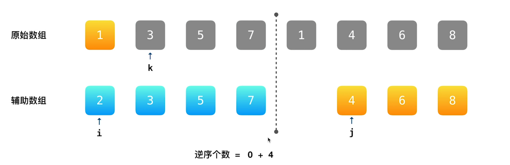

只需要在归并排序中加入一行代码即可找到所有逆序对。

```python
class Solution:
    def reversePairs(self, nums: List[int]) -> int:
        self.ans = 0
        def ms(nums, l, r, tmp):
            if l >= r:
                return
            mid = (l + r) >> 1
            ms(nums, l, mid, tmp)
            ms(nums, mid + 1, r, tmp)
            if tmp[mid] > tmp[mid+1]:
                i, j = l, mid + 1
                for k in range(l, r + 1):
                    if i == mid + 1:
                        tmp[k] = nums[j]
                        j += 1
                    elif j == r + 1:
                        tmp[k] = nums[i]
                        i += 1
                    elif nums[i] <= nums[j]:
                        tmp[k] = nums[i]
                        i += 1
                    else:
                        tmp[k] = nums[j]
                        j += 1
                        self.ans += mid - i + 1
            nums[l:r+1] = tmp[l:r+1]
        
        ms(nums, 0, len(nums)-1, nums[:])
        
        return self.ans
```

### 5. 堆排序

适用于找前 k 个数。

堆的本质是一个二叉树，小根堆的根节点小于子节点。最主要的操作就是 `down` 操作。

```c++
#include<bits/stdc++.h>

const int N = 100005;

int q[N];

int sz;

int n, m;

using namespace std;

void down(int q[], int x) {
    if (x < 1) return;
    int t = x;
    if (x * 2 <= sz && q[x*2] < q[t]) t = x * 2;
    if (x * 2 + 1 <= sz && q[x * 2 + 1] < q[t]) t = x * 2 + 1;
    if (t != x) {
        swap(q[t], q[x]);
        down(q, t);
    }
}
 
int main() {
    scanf("%d%d", &n, &m);
    for (int i = 1; i <= n; i++) scanf("%d", &q[i]);
    sz = n;
    for (int i = n / 2; i > 0; i--) down(q, i);
    while (m--) {
        printf("%d ", q[1]);
        q[1] = q[sz--];
        down(q, 1);
    }
}
```

## 九. 数论

### 1. 大数取余

题目：[JJoffer-14](https://leetcode-cn.com/problems/jian-sheng-zi-ii-lcof/)

🔵前置知识（余数的性质）：

* 恒等性：$(a\mod n) \mod n = a\mod n$
* 逆运算：$[(-a\mod n)+(a\mod n)]\mod n=0$
* 分配律：
  * $(a+b)\mod n=[(a\mod n)+(b\mod n)]\mod n$
  * $ab\mod n=[(a\mod n)(b\mod n)]\mod n$

🔵循环取余法
$$
x^a \mod  p = [(x ^{a-1} \mod  p)(x \mod  p)] \mod  p=[(x ^{a-1} \mod  p)x] \mod  p
$$
🔵快速幂求余
$$
{x^a \mod  p = }
\begin{cases}
(x^2 \mod  p)^{a // 2} \mod  p &  \text{, $a$ 为偶数} \\
{[(x \mod  p)(x ^{a-1} \mod  p)] \mod  p = [x(x^2 \mod  p)^{a//2}] \mod  p} & \text{, $a$ 为奇数} \\
\end{cases}
$$

### 2. 最大公约数和最小公倍数

最大公约数(greatest common division)和最小公倍数(Least common multiple)的关系：
$$
\text{lcm}(a,b)=\dfrac{a\cdot b}{\gcd(a,b)}
$$


最大公约数：

```c++
int gcd(int a,int b){
    if(b)while((a%=b)&&(b%=a));
    return a+b;
}

int gcd(int a, int b){
    return b ? gcd(b, a % b) : a;
}
```

最小公倍数：

```c++
int lcm(int a,int b){
    return a*b/gcd(a,b);
}
```

### 3. 因式分解定理

对于任意数$N$都有：
$$
N = P_1^{\alpha_1}\times P_2^{\alpha_2}\times ...\times P_k^{\alpha_k}
$$
其中 $P$ 为质数，$\alpha$ 为正整数

### 4. 质数数

* 埃氏筛选法

  由希腊数学家厄拉多塞提出，简称埃氏筛。

  对于一个质数 $x$ 来说，其整数倍 $2x, 3x$ 一定不是质数，直接遍历到末尾即可。

  优化：对于 $x$ 来说，如果 $y<x$，那么当遍历到 $x$ 的时候，$y\cdot x$ 已经被标记，那么直接可以从 $x\cdot x$ 进行标记。

  ```java
  public int countPrimes(int n) {
      boolean[] isPrime = new boolean[n];
      Arrays.fill(isPrime, true);
      int ans = 0;
      for (int i = 2; i < n; ++i) {
          if (isPrime[i]) {
              ans += 1;
              if ((long) i * i < n) {
                  for (int j = i * i; j < n; j += i) {
                      isPrime[j] = false;
                  }
              }
          }
      }
      return ans;
  }
  ```

  

* 线筛法

  可以在 $O(n)$ 的时间复杂度内求得 $1\sim n$ 中所有的质数以及每个数的最小质因子。

  ```c
  #include "bits/stdc++.h"
  
  using namespace std;
  
  const int N = 1000010;
  vector<int> primes;
  bool st[N]; // true - 合数; false - 质数
  int min_factor[N];
  
  
  void getPrimes(int n) {
      // get all the primes which lower equal than n.
      for (int i = 2; i <= n; ++i) {  // 虽然由两层循环但是其时间复杂度确实为O(n)
          if (!st[i]) min_factor[i] = i, primes.push_back(i);
          for (int j = 0; i * primes[j] <= n; ++j) {
              st[i * primes[j]] = true;
              min_factor[i * primes[j]] = primes[j];  // 记录最小质因子
              // 之后两个数字不互质就表示所得乘积不是由最小质因子乘法得到
              // 因此需要break
              if (i % primes[j] == 0) break;
          }
      }
  }
  
  int main() {
      getPrimes(20000);
      for (int i = 2; i < 100; ++i) {
          if(!st[i])cout<<i<< endl;
      }
  }
  ```

  性质：

  1. 被筛选掉的一定是质数，并且是由其最小质因子筛选掉的。（可以根据这个性质得到其最小质因子）
  2. 所有的合数一定会被筛掉！因为只有在碰到其最小质因子就会筛掉，因此不会遗漏。

### 5. 约数

由于对于任意数$N$都有：
$$
N = P_1^{\alpha_1}\times P_2^{\alpha_2}\times ...\times P_k^{\alpha_k}
$$
其中 $P$ 为质数，$\alpha$ 为正整数。

数字 $N$ 约数性质有：

* 约数个数就是 $(\alpha_1+1)(\alpha_2+1)\cdots (\alpha_k+1)$ 
* 所有约数之和是 $\displaystyle \sum_{i=0}^{\alpha_1}P_1^i\cdot\sum_{i=0}^{\alpha_2}P_2^i\cdots\sum_{i=0}^{\alpha_k}P_k^i$


## 十. 枚举与哈希

### 1. 原地哈希

参考：[原地哈希](https://blog.css8.cn/post/4942471.html)

题目：

* [41. 缺失的第一个正数](https://leetcode.cn/problems/first-missing-positive/)

对于一个长度为 n 的数组，所有数的范围都在 $[0,n-1]$ 并且都不相同，使用 $O(n)$ 的时间复杂度进行排序。

原地哈希的思想：

* 如果 $a[i] \neq i$，那么将数字a[i]放置到索引为a[i]的位置上，即 $\text{swap}(a[i], a[a[i]])$。

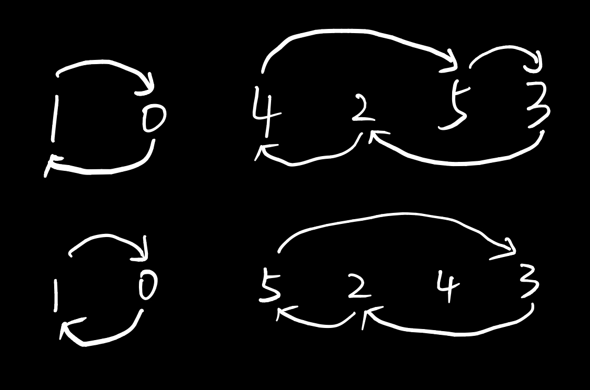

代码：

```java
private void inplaceHash(int[] arr) {
    for (int i = 0; i < arr.length; i++) {
        while (arr[i] != i)
            swap(arr[i], arr[arr[i]]);
    }
}
```

## 十一. 字符串

### 1. manacher 算法

参考：https://www.bilibili.com/video/BV1L54y1D7pa

例题：[5. 最长回文子串 - 力扣](https://leetcode-cn.com/problems/longest-palindromic-substring/)

寻找字符串中的最长回文子串(非子序列)的线性算法。

首先是对字符串的预处理，由于回文串的长度可能是基数或者偶数，因此由中心展开的时候会不方便，因此需要进行填充，比如 "aa" 需要填充为 "#a#a#"。

manacher算法中有几个重要的概念定义：

1. maxRight，即基于中心点所能延申最长回文串的右边界下标。
2. mirror，即当循环遍历 i < maxRight 的时候在这个回文串中的对称下标。

使用 p[] 数组来记录当前中心点向右所能延申的最大长度，其数值也是以当前为中心点回文串的长度。

当 i ≥ maxRight 的时候，老老实实进行中心扩散；

当 i < maxRight 的时候，可以根据对称的思想来进行简化计算。

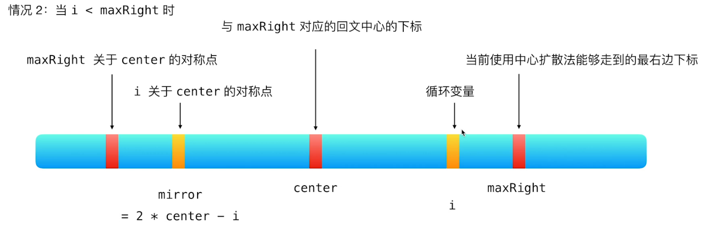

因此当 i < maxRight 的时候，可以分为以下三种清空：

1. 当 p[mirror] < maxRight - i 时，以两者为中心的回文串都被主回文串包裹，p[i] = p[mirror]
2. 当 p[mirror] = maxRight - i 时，p[i] 的长度至少是 p[mirror] 然后进行中心扩散，扩散完之后更新maxRight 和 center
3. 当 p[mirror] > maxRight - i 时，p[i] = maxRight - i

🔵其他：记忆回文串

```java
boolean[][] isPalin = new boolean[len][len];
for (int i = 0; i < len; i++) isPalin[i][i] = true;
for (int i = 1; i < len; i++) {
    for (int j = 0; j < i; j++) {
        boolean b = s.charAt(i) == s.charAt(j);
        if (j == i - 1) isPalin[j][i] = b;
        else isPalin[j][i] = b && isPalin[j + 1][i - 1];
    }
}
```

### 2. KMP 算法

**普通**情况下建议使用Sunday算法，极端情况下使用 KMP 算法，因为 KMP 算法最坏时间复杂度为 O(m+n)。

对于两个字符串 s 和 p，找到 p 在 s 中匹配的位置。

next 数组使用找匹配字符串中的前缀和后缀的长度，比如 next[j] 表示 p[1:j] 字符串中前缀和后缀完全相同时的前缀的末尾索引（严格子串），如果 next 数组从 1 开始计算也表示前缀的长度。

当 s 和 p 进行比较的时候，如果 s[i] != p[j+1] 的时候，j = next[j] 找到相同的前缀位置，就可以继续比较了。

```c++
const int N = 1000010;

int n, m;
char s[N], p[N];
int ne[N];

int main()
{
    cin >> m >> p >> n >> s;
    
    // 1. 找 next 的数组
    ne[0] = -1;
    for (int i = 1, j = -1; i < m; i ++ ) {
        while (j >= 0 && p[j + 1] != p[i]) j = ne[j];
        if (p[j + 1] == p[i]) j ++ ;
        ne[i] = j;
    }
    
    // 2. 在 s 中找 p
    for (int i = 0, j = -1; i < n; i ++ ) {
        while (j != -1 && s[i] != p[j + 1]) j = ne[j];
        if (s[i] == p[j + 1]) j ++ ;
        if (j == m - 1) {
            cout << i - j << ' ';
            j = ne[j];
        }
    }

    return 0;
}
```

### 3. Sunday 算法

参考：[字符串匹配算法原理讲解(Hash、KMP、BM、Sunday) ](https://juejin.cn/post/6844904176036610062#heading-10)

平均时间复杂度为 $O(n)$，最坏时间复杂度为 $O(mn)$。

Sunday 算法理解起来要比 KMP 和 BM 算法要更容易。Sunday 匹配算法是从左往右匹配，在匹配失败的时候关注主串中参与匹配的最末位的下一位字符，规则为：

* 如果该字符未在子串中出现，则子串右移的长度为子串长度+1
* 如果字符在子串中出现，则将主串中该字符与子串中最后一次出现该字符的位置进行对齐

Sunday 算法需要构建一个偏移表，存储每个字符的偏移量。

设文本串S为"ATTAAGGCACATAC"，模式串P为"ACAT"，模式串中字符的偏移量为:

```
shift[A] = 4 - max(A的位置) = 4 - 2 = 2

shift[C] = 4 - max(C的位置) = 4 - 1 = 3

shift[T] = 4 - max(t的位置) = 4 - 3 = 1

shift[其他] = 4 + 1 = 5
```

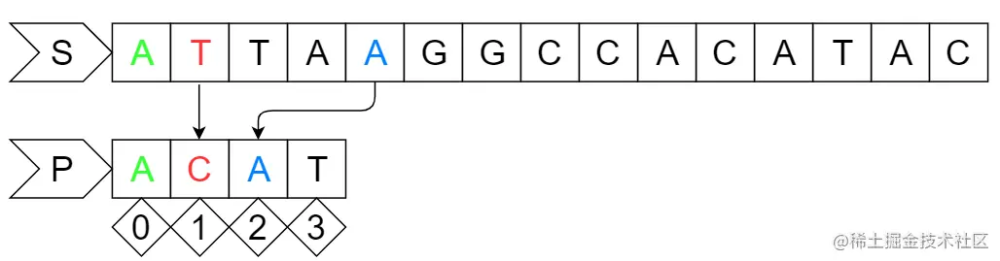

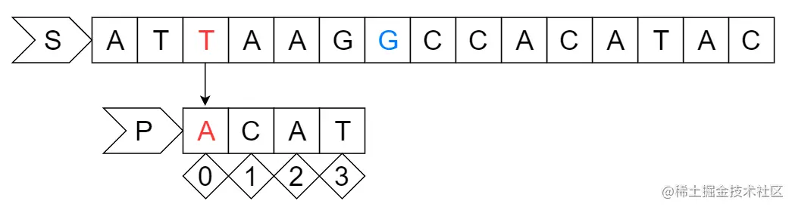

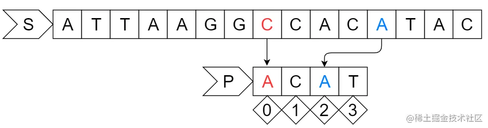

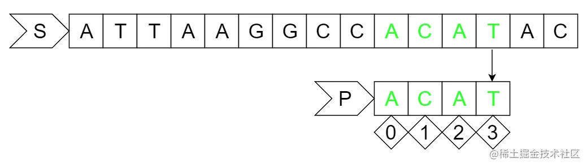

算法实现：

```java
private int[] shift = new int[512];
public int strStr(String a, String b) {
    int alen = a.length(), blen = b.length();
    Arrays.fill(shift, blen + 1);
    for (int i = 0; i < b.length(); i++) {
        shift[b.charAt(i)] = blen - i;
    }

    int m = 0, n;
    while (m <= alen - blen) {
        n = 0;
        while (a.charAt(m + n) == b.charAt(n)) {
            n++;
            if (n >= blen) return m;
        }
        if (m + blen >= alen) return -1;
        m += shift[a.charAt(m + blen)];
    }
    return -1;
}
```

## 十二. 搜索

### 1. Flood Fill 算法

即使用线性时间复杂度将满足条件的情况遍历一次，可以使用BFS或者DFS，但是DFS容易会爆栈，通常使用BFS进行实现（队列）。

### 1. 折半搜索 / 双向DFS

* 参考：[Meet in the middle - GeeksforGeeks](https://www.geeksforgeeks.org/meet-in-the-middle/)

### 2. BFS 与双向BFS

BFS 比 DFS 更适合找最短路径，通常用于求解决最小值问题，并且不会存在爆栈问题。

## 番外：语言技巧

### Java 输入输出

参考：[Java中System.out.println效率较低](https://www.acwing.com/problem/content/discussion/content/7/)

对于需要Java中频繁进行输入输出，println效率较低，需要使用`BufferedWriter`以及`BufferedReader`

> 记得关闭流`close`和刷新`flush()`。

数据输入：

```java
public class P1227 {
    private static BufferedReader reader = new BufferedReader(new InputStreamReader(System.in));
    private static int N, K;
    private static int s[][];

    public static void main(String[] args) throws IOException {
        String[] strs = reader.readLine().split(" ");
        N = Integer.parseInt(strs[0]);
        K = Integer.parseInt(strs[1]);
        s = new int[N][2];
        for (int i = 0; i < N; i++) {
            String[] strs2 = reader.readLine().split(" ");
            s[i][0] = Integer.parseInt(strs2[0]);
            s[i][1] = Integer.parseInt(strs2[1]);
        }
        reader.close();
    }
}
```

数据输出：

```java
public static void main(String[] args) throws IOException {
    BufferedWriter bw = new BufferedWriter(new OutputStreamWriter(System.out));

    bw.write(min_cnt + "\n");
    
    // ,,,,

    bw.flush();
    bw.close();
}
```

